#	Introduction to Soil Data Preparation & Spatial Data

##PART ONE: Introduction to R
### Understanding the RStudio Interface

**RStudio** provides an integrated environment that simplifies working with R. The interface is divided into four main panes (Fig. \@ref(fig:rstudio)):

```{r rstudio, echo=FALSE, out.width="100%",fig.cap = "RStudio interface."}
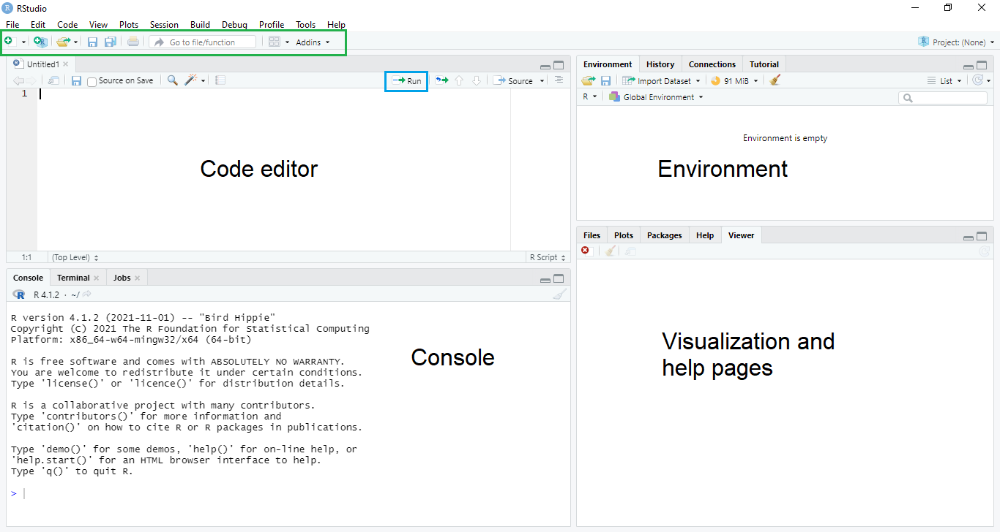
```

The **Console**  (Bottom Left) is where R code is executed.
You can type commands directly here or run them from your script.
The Console displays results, warnings, and error messages.

```{r console-example, echo=TRUE, eval=FALSE}
# Type directly in the console
5 * 3

# R will immediately show the result
# [1] 15
```

You can write commands directly in the Console  (Top Left) and execute them line by line. However, it is usually more convenient to write code in a script editor—the **Code Editor** pane. Here you can create and edit R scripts (`.R` files), R Markdown documents (`.Rmd` files), and other file types. Scripts allow you to save your code and run it repeatedly, which is essential for reproducible analysis.

Working in the **Code Editor** also makes it easier to organize code for later use. You can send any line or selected block of code to the **Console** for execution by pressing `Ctrl + Enter` (Windows/Linux) or `Cmd + Enter` (macOS). You can also run code by clicking the **Run** button in the top-right corner of the **Code Editor** pane.

::: highlights
-   Code can be written and executed directly in the **Console**.\
-   Using  the **Code Editor** is more convenient for organizing and reusing code.\
-   Send a line or block of code to the console with `Ctrl + Enter` (Windows(), `Cmd + Enter` (macOS), or the equivalent shortcut in Linux.\
-   You can also run code by clicking the **Run** button in the script editor.\

**Creating a new script:**
-   File → New File → R Script (or press `Ctrl+Shift+N` / `Cmd+Shift+N`)

:::

Top Right Pane (Environment/History) is divided into:

-   **Environment**: Shows all objects (variables, datasets, functions) currently in your R session

-   **History**: Records all commands you've run during the session

Finally, the Bottom Right Pane shows

-   **Files**: Browse your computer's file system

-   **Plots**: View visualizations created with R

-   **Packages**: Manage installed packages

-   **Help**: Access R documentation and function help pages

::: highlights
**Best Practice**

- Always work in scripts rather than typing directly in the Console.

- Scripts preserve your workflow and make your analysis reproducible.

:::

### R Packages: Extending R's Capabilities

R's strength lies in its extensibility through **packages**.
A package is a collection of functions, data, and documentation that extends R's functionality for specific tasks.

#### What are Packages?

The base R installation includes fundamental functions for data manipulation and statistical analysis.
However, specialized tasks often require additional tools provided by contributed packages.

For soil science work, key packages include:

-   `{tidyverse}`: A collection of packages for data manipulation and visualization, including `{dplyr}` and `{tidyr}`, among others

-   `{terra}`: Spatial data analysis and raster operations

-   `{sf}`: Working with vector spatial data

-   `{aqp}`: Algorithms for Quantitative Pedology (soil profile data)

-   `{ggplot2}` : Advanced data visualization (part of tidyverse)


#### Installing Packages

Packages need to be installed once before you can use them.
Use `install.packages()`:

```{r install-package, echo=TRUE, eval=FALSE}
# Install a single package
install.packages("tidyverse")

# Install multiple packages at once
install.packages(c("terra", "sf", "aqp"))
```

You only need to install a package once, but you must load it with `library()` each time you start a new R session.

You can check which *{packages}* are installed with:

```{r installed-packages, echo=TRUE, eval=FALSE}
installed.packages()
```


##### Install Packages from GitHub or Other Sources{-}

Some *{packages}* are not yet available on CRAN or you may want a newer development versions from GitHub, Gitlab, bitbucket, or an URL.
In these cases, you can use the `remotes` or `devtools` *{packages}*, with the functions `install_github()`, `install_gitlab()`, `install_bitbucket()` or `install_url()`:

```{r remotes-installation, echo=TRUE, eval=FALSE}
# First, install remotes package (if not already installed)
install.packages("remotes")

# Install an R package from GitHub
remotes::install_github("rspatial/terra")
```

This is useful for accessing cutting-edge versions, experimental features, or tools developed by research groups.

##### Manual Installation of R Packages{-}

You may need to install R *{packages}* manually especially when working in environments without internet access or when using custom-built *{packages}*.

There are two common methods:

- **1. Installing from a compressed source package file** (e.g., `mypackage_1.0.0.tar.gz`)


```{r manual-installation, echo=TRUE, eval=FALSE}
install.packages("path/to/mypackage_1.0.0.tar.gz", repos = NULL, type = "source")
```

- **2. Installing from a Local `.zip` file** (Windows Binary)

```{r install-from-zip, echo=TRUE, eval=FALSE}
install.packages("path/to/mypackage.zip", repos = NULL, type = "win.binary")
```

This method does not require compilation and is usually faster on Windows.

::: warning-box
**Note:**

 - Package installation typically requires an internet connection.

 - Depending on the package size and your connection speed, installation may take several minutes.

:::

#### Loading Packages

After installation, you must **load** a package into your R session each time you start R.
Use the `library()` function:

```{r load-packages, echo=TRUE, eval=FALSE}
# Load tidyverse package
library(tidyverse)

# Load multiple packages
library(terra)
library(sf)
library(aqp)
```

::: highlights
**Key Difference:**

-   `install.packages()`: Downloads and installs a package (once)
-   `library()`: Loads a package into your current session (every time you start R)

:::

#### Finding Help on Packages

```{r package-help, echo=TRUE, eval=FALSE}
# Get help on a package
help(package = "tidyverse")

# Or use
?tidyverse

# View vignettes (tutorials) for a package
vignette(package = "ggplot2")
vignette("ggplot2", package = "ggplot2")

```


### R Basics: Objects and Data Types {#object-types}

In R, everything you work with is an **object** (numbers, text, vectors, tables, models, and maps). When you create an object, R stores it in your computer’s **memory** (RAM) so you can reuse it later. Because memory is limited, especially when working with large soil datasets, rasters, or spatial objects, it is good practice to keep your workspace tidy: reuse objects when appropriate, remove objects you no longer need with `rm()`, and occasionally trigger garbage collection with ´gc()´ to free memory that is no longer in use.

#### Creating Objects with Assignment {#object-assignment}

If you run an operation without assigning it to an object, R will compute the result but won’t store it for later use.
You can assign values to objects using either `<-` or `=`. 

However, the preferred and most common assignment operator is `<-` while `=` is most commonly used inside function calls to name arguments. This avoids confusion between assigning objects and passing inputs to functions.

```{r variable-assignment, echo=TRUE, eval=FALSE}
# Assign a value to a variable
soil_depth <- 30
# View the content of soil_depth
soil_depth

# Assignment `<-` to objects and `=` to function arguments
soil_depth <- c(10,20,30)
mean_soil_depth <- mean(x = soil_depth, na.rm = TRUE)
# View the content of mean_soil_depth
mean_soil_depth

```

::: warning-box
**Naming Rules:**
-   Object names must start with a letter
-   Names can contain letters, numbers, underscores `_`, and periods `.`
-   Names are case-sensitive: `SoilDepth` is different from `soildepth`
-   Avoid using reserved words like `TRUE`, `FALSE`, `NA`, `function`, etc.

**Good naming practices:**

```{r naming-good, echo=TRUE, eval=FALSE}
# Descriptive names
soil_ph <- 6.5
organic_carbon_percent <- 2.1
clay_content_gkg <- 350

# Use consistent style
plot_id <- "P001"      # snake_case (recommended)
plotID <- "P001"       # camelCase (alternative)
```

**Avoid:**

```{r naming-bad, echo=TRUE, eval=FALSE}
# Bad naming practices — too short, too long, unclear
# Too short, unclear
x <- 6.5
a <- 2.1

# Too long
the_ph_value_of_the_topsoil_at_site_one <- 6.5
```

:::

#### Data Types in R {#data-types}

Every object in R has a data type, which tells R what kind of information it contains and how it can be used (for example, whether you can do math with it or use it as text labels).

R has several basic data types:

##### 1. Numeric (Numbers) {#numeric-data} {-}

Numeric values store measurements that can include decimals (e.g., pH, clay %, temperature).

```{r numeric-type, echo=TRUE, eval=FALSE}
# Numeric values
ph_value <- 6.8
clay_percent <- 25.5
temperature <- 15.2
```

##### 2. Integer (Whole Numbers) {#integer-data}{-}

Integers are whole numbers. In R, you can create them explicitly using the L suffix.

```{r integer-type, echo=TRUE, eval=FALSE}
# Integer values (use L suffix)
sample_count <- 100L
plot_number <- 5L
```

##### 3. Character (Text Strings) {#text-data}{-}

Character values store text (soil types, locations, notes). They must be written inside quotes.

```{r character-typea, echo=TRUE, eval=FALSE}
# Character values (use quotes)
soil_type <- "Acrisol"
location <- "Kansas"
notes <- "Sample collected from topsoil"
```

##### 4. Logical (TRUE/FALSE) {#logical-data} {-}

Logical values represent yes/no conditions and are commonly used for filtering and decision-making.

```{r logical-type, echo=TRUE, eval=FALSE}
# Logical values
is_valid <- TRUE
has_missing_data <- FALSE
```

##### 5. Dates {#dates-data} {-}

Dates often are imported as character strings, but it is better to convert them to the Date class for sorting, filtering, and plotting.

```{r date-type, echo=TRUE, eval=FALSE}
# ISO 8601 date format, YYYY-MM-DD
sampling_date <- "2024-03-12"
# Convert to date (%Y = 4-digit year; %y = 2-digit year)
sampling_date <- as.Date(sampling_date, format = "%Y-%m-%d")
class(sampling_date)
```

::: warning-box
- The ISO 8601 date format (**YYYY-MM-DD**) is preferred for storing date values, since it is the date format adopted in the **GloSIS** database.
:::


#### Checking Data Types {#check-data}

```{r check-types, echo=TRUE, eval=FALSE}
# Check the class (high-level type)
class(ph_value)   # "numeric"
class(soil_type)  # "character"
class(is_valid)   # "logical"

# Check the internal storage type
typeof(sample_count)
typeof(ph_value)

# Helpful checks
is.numeric(ph_value)
is.character(soil_type)
is.logical(is_valid)
```

`class()` is what you’ll use most in practice. `typeof()` is more 'internal' (how R stores the object).

::: highlights
- Every R object has a **data type**, which tells R how to store the information and what operations are possible.

- **Numeric**: measurements such as pH, clay (%), bulk density, or organic carbon.

- **Numeric vectors**: multiple numeric values (e.g., pH readings from several samples or horizons).

- **Character**: text labels such as soil type, land use, site code, or field notes.

- **Character vectors**: multiple text values (e.g., a list of soil classes).

- **Logical**: `TRUE`/`FALSE` values, often used for conditions, filtering, and quality checks.
:::

::: warning-box
**Caution:**

 - When importing data from external sources (CSV, Excel, databases), always check that columns have the expected data types. For example, pH or SOC may be imported as text instead of numeric.

- Check types with `str()`, `class()`, or `typeof()`.

- Convert types when needed using `as.numeric()`, `as.character()`, `as.logical()`, or `as.Date()`.
:::


### Data Structures in R {#structure-data}

R can store data in different structures, depending on how many values you have and how you want to organize them. For example, a single measurement can be stored as a number, a series of measurements as a vector, and a full dataset as a data frame. Understanding these structures is essential because it determines how you subset data, apply functions, summarize results, and prepare data for plotting or modeling.

#### Vectors {#vector-data}

A **vector** is the simplest data structure - a one-dimensional sequence of elements of the same type.

##### Creating Vectors {#create-vector} {-}

```{r vectors-create, echo=TRUE, eval=FALSE}
# Create a numeric vector using c() (combine)
ph_values <- c(5.2, 6.5, 7.1, 5.8, 6.9)
print(ph_values)
ph_values # Equivalent to print(ph_values)

# Character vector
soil_types <- c("Acrisol", "Ferralsol", "Vertisol", "Andosol", "Cambisol")
soil_types

# Logical vector
valid_samples <- c(TRUE, TRUE, FALSE, TRUE, TRUE)
valid_samples

# Create sequences
depths <- 0:100                    # Integers from 0 to 100
depths_seq <- seq(0, 100, by=10)   # 0, 10, 20, ..., 100
```

##### Vector Operations {#operate-vector} {-}

```{r vector-operations, echo=TRUE, eval=FALSE}
# Arithmetic on vectors (element-wise)
ph_values * 10
ph_values + 1

# Summary statistics
mean(ph_values)
median(ph_values)
sd(ph_values)        # standard deviation
min(ph_values)
max(ph_values)
# NAs affect the statistic results
mean(c(ph_values,NA))
mean(c(ph_values,NA), na.rm=TRUE) # Remove NAs from calculations

```

##### Accessing Vector Elements {#element-vector} {-}

```{r vector-access, echo=TRUE, eval=FALSE}
# Access by index (position)
ph_values           # Complete data
ph_values[1]        # First element
ph_values[3]        # Third element

# Access multiple elements
ph_values[c(1,3,5)]  # Elements 1, 3, and 5

# Access by logical condition
ph_values[ph_values > 6]     # All pH values greater than 6

# Negative indices exclude elements
ph_values[-1]       # All except first
ph_values[-c(1,2)]  # All except first two
```

#### Factors {#factor-data}

**Factors** are used to represent categorical data.
They store values as levels (categories).

```{r factor-type, echo=TRUE, eval=FALSE}
# Create a factor from character vector
soil_class <- factor(c("Clay", "Loam", "Sand", "Clay", "Loam"))
soil_class

# Check levels
levels(soil_class)

# Count observations per level
table(soil_class)

# Ordered factors (when order matters)
texture_class <- factor(
  c("Coarse", "Fine", "Medium", "Fine", "Coarse"),
  levels = c("Coarse", "Medium", "Fine"),
  ordered = TRUE
)
texture_class
```

#### Matrices {#matrix-data}

A **matrix** is a two-dimensional structure where all elements must be of the same type.

```{r matrix-class, echo=TRUE, eval=FALSE}
# Create a matrix
soil_matrix <- matrix(
  c(5.2, 25, 30,
    6.5, 30, 28,
    7.1, 18, 35),
  nrow = 3,
  ncol = 3,
  byrow = TRUE
)

# Add column names
colnames(soil_matrix) <- c("pH", "Clay", "Sand")
rownames(soil_matrix) <- c("Sample1", "Sample2", "Sample3")

print(soil_matrix)

# Access elements
soil_matrix[1, 2]        # Row 1, Column 2
soil_matrix[1, ]         # All of row 1
soil_matrix[, 2]         # All of column 2
```

#### Data Frames {#dataframe}

A **data frame** is the most commonly used structure for storing datasets.
It's like a spreadsheet: rows represent observations, columns represent variables, and different columns can have different data types.

##### Creating Data Frames {#dataframe-create} {-}

```{r dataframe-class, echo=TRUE, eval=FALSE}
# Create a data frame
soil_data <- data.frame(
  plot_id = c("P001", "P002", "P003", "P004", "P005"),
  latitude = c(-1.25, -1.27, -1.23, -1.29, -1.26),
  longitude = c(36.85, 36.83, 36.87, 36.81, 36.84),
  ph = c(5.2, 6.5, 7.1, 5.8, 6.9),
  organic_carbon = c(2.1, 3.2, 1.8, 2.7, 2.9),
  clay_content = c(25, 30, 18, 42, 35),
  soil_type = c("Acrisol", "Ferralsol", "Vertisol", "Andosol", "Cambisol")
)

# View the data frame
soil_data

# View structure
str(soil_data)

# View first rows
head(soil_data)

# View last rows
tail(soil_data)

# Get dimensions
dim(soil_data)         # rows, columns
nrow(soil_data)        # number of rows
ncol(soil_data)        # number of columns
```

##### Accessing Data Frame Elements {#dataframe-access} {-}

```{r dataframes-access, echo=TRUE, eval=FALSE}
# Access columns by name
soil_data$ph
soil_data$soil_type

# Alternative: use brackets
soil_data[, "ph"]
soil_data[["ph"]]

# Access rows
soil_data[1, ]           # First row
soil_data[c(1,3,5), ]    # Rows 1, 3, and 5

# Access specific cells
soil_data[2, 4]          # Row 2, Column 4 (pH of second plot)

# Subset based on conditions
soil_data[soil_data$ph > 6, ]              # Plots with pH > 6
soil_data[soil_data$soil_type == "Acrisol", ]  # Only Acrisols
```

##### Adding Columns {#dataframe-cols} {-}

```{r dataframes-add, echo=TRUE, eval=FALSE}
# Add a new column
soil_data$silt_content <- c(40, 35, 52, 23, 30)

# Calculate new columns from existing ones
soil_data$clay_plus_silt <- soil_data$clay_content + soil_data$silt_content

# View updated data frame
head(soil_data)
```

#### Lists {#list-data}

A **list** is a flexible structure that can contain elements of different types and sizes (vectors, data frames, other lists, etc.).

```{r lists-class, echo=TRUE, eval=FALSE}
# Create a list
soil_analysis <- list(
  site_name = "Kansas Field",
  coordinates = c(lat = -1.25, lon = 36.85),
  measurements = data.frame(
    depth = c(0, 10, 20, 30),
    ph = c(6.5, 6.2, 5.8, 5.5)
  ),
  notes = "Collected during dry season"
)

# View list structure
str(soil_analysis)

# Access list elements
soil_analysis$site_name
soil_analysis[[1]]                # First element
soil_analysis[["measurements"]]   # View measurements data frame
```


### Operators in R {#operators}

Operators perform operations on objects. R has several types of operators:

#### Arithmetic Operators {#arithmetic-operators}

```{r arithmetic-operators, echo=TRUE, eval=FALSE}
# Basic arithmetic
10 + 5      # Addition
10 - 5      # Subtraction
10 * 5      # Multiplication
10 / 5      # Division
10 ^ 2      # Exponentiation (10 squared)
10 %% 3     # Modulus (remainder: 10 mod 3 = 1)
10 %/% 3    # Integer division (10 divided by 3 = 3)

# Order of operations (PEMDAS)
result <- (10 + 5) * 2 / 4 - 1
result
```


#### Comparison Operators {#comparison-operators}

```{r comparison-operators, echo=TRUE, eval=FALSE}
# Comparison operators return TRUE or FALSE
5 == 5      # Equal to
5 != 3      # Not equal to
5 > 3       # Greater than
5 < 3       # Less than
5 >= 5      # Greater than or equal to
5 <= 6      # Less than or equal to

# Use in subsetting
ph_values <- c(5.2, 6.5, 7.1, 5.8, 6.9)
ph_values > 6                     # Logical vector
ph_values[ph_values > 6]          # Values greater than 6
```


#### Logical Operators {#logical-operators}

```{r logical-operators, echo=TRUE, eval=FALSE}
# AND operator: & (element-wise) or && (single values)
TRUE & TRUE      # TRUE
TRUE & FALSE     # FALSE

# OR operator: | (element-wise) or || (single values)
TRUE | FALSE     # TRUE
FALSE | FALSE    # FALSE

# NOT operator: !
!TRUE            # FALSE
!FALSE           # TRUE

# Combining conditions
ph_values <- c(5.2, 6.5, 7.1, 5.8, 6.9)
clay_content <- c(25, 30, 18, 42, 35)

# Find samples with pH > 6 AND clay > 25
ph_values > 6 & clay_content > 25

# Find samples with pH > 6 OR clay > 40
ph_values > 6 | clay_content > 40
```


### Control Structures: Conditional Statements {#conditional-statements}

Conditional statements let your code make decisions—running different blocks depending on whether a condition is `TRUE` or `FALSE`.

#### If-Else Statements {#ifelse-statements}

Use `if` / `else` when you are checking **a single condition** (one TRUE/FALSE value).

```{r if-else, echo=TRUE, eval=FALSE}
# Basic if statement
ph_value <- 7.5

# Basic if statement
if (ph_value > 7) {
  print("Alkaline soil")
}

# If-else
if (ph_value > 7) {
  print("Alkaline soil")
} else {
  print("Neutral or acidic soil")
}

# Multiple conditions (only the first TRUE branch runs)
if (ph_value > 7.5) {
  print("Strongly alkaline")
} else if (ph_value > 7) {
  print("Slightly alkaline")
} else if (ph_value == 7) {
  print("Neutral")
} else {
  print("Acidic")
}
```

::: highlights
`if (...)` expects a single logical value.
If you have a vector of values, use a vectorized approach such as `ifelse()`, `cut()`, or `case_when()`.
:::

#### Vectorized If-Else: `ifelse()` {#v-ifelse-statements}

`ifelse()` is vectorized: it applies a condition to each element of a vector.

```{r ifelse, echo=TRUE, eval=FALSE}
# Vectorized conditional assignment
ph_values <- c(5.2, 6.5, 7.1, 5.8, 7.0)

# Simple two-class example
soil_reaction <- ifelse(ph_values > 7, "Alkaline", "Not alkaline")
soil_reaction
```

#### Vectorized Cut: `cut()` {#cut-statements}

Use `cut()` when you have a **numeric** variable and you want to classify values into **interval-based categories** (bins), such as pH classes, depth intervals, or temperature ranges. It is especially useful when:

- the variable is **continuous or ordered** (numeric),
- you can define meaningful **break points**, and
- you want a clear, readable alternative to many nested conditions.

For multiple classes, `cut()` is often easier to read than nested `ifelse()`:

```{r cut, echo=TRUE, eval=FALSE}
soil_class <- cut(
  ph_values,
  breaks = c(-Inf, 5.5, 7.0, Inf),
  labels = c("Acidic", "Neutral", "Alkaline"),
  right = TRUE, include.lowest = TRUE
)
soil_class

# Notes:
# - `right = TRUE` means intervals are **right-closed** (e.g., `(5.5, 7.0]`).
# - `include.lowest = TRUE` ensures the smallest value is included in the first interval.

```


### Control Structures: Loops {#control-structures}

Loops in R are used to **repeat a block of code** multiple times. They are helpful when you need to automate repetitive tasks, such as performing calculations over a sequence of values or processing each element of a dataset.

R provides several loop constructs, but the most commonly used are `for` and `while`.


#### For Loops {#for-loop}

Use a `for` loop when you want to iterate over a sequence or over the elements of an object.


```{r for-loops, echo=TRUE, eval=FALSE}
# Loop through a sequence
for (i in 1:5) {
  print(paste("Iteration:", i))
}

# Loop through a vector
soil_types <- c("Acrisol", "Ferralsol", "Vertisol")

for (soil in soil_types) {
  print(paste("Soil type:", soil))
}

# Loop with conditional logic
ph_values <- c(5.2, 6.5, 7.1, 5.8, 6.9)

for (i in 1:length(ph_values)) {
  if (ph_values[i] > 6) {
    print(paste("Sample", i, "has pH =", ph_values[i], "(Acceptable)"))
  } else {
    print(paste("Sample", i, "has pH =", ph_values[i], "(Too acidic)"))
  }
}
```

#### While Loops {#while-loop}

A `while` loop repeats as long as a condition is `TRUE`. It is useful when you do not know in advance how many iterations you will need.

```{r while-loops, echo=TRUE, eval=FALSE}
# While loop continues until condition is FALSE
counter <- 1

while (counter <= 5) {
  print(paste("Counter value:", counter))
  counter <- counter + 1   # Increment counter
}
```

::: warning-box
**Caution:**

- Always ensure loop conditions eventually become `FALSE` to avoid infinite loops!

:::

### Functions in R {#r-funtions}

Functions are reusable blocks of code that take **inputs** (arguments), perform a task, and return an **output**. They help you avoid repeating code and make your scripts easier to read and maintain.

#### Using Built-in Functions {#built-funtions}

R comes with thousands of built-in functions. You can view help pages with `?function_name` (e.g., `?mean`).

```{r builtin-functions, echo=TRUE, eval=FALSE}
# Statistical functions
mean(c(5, 10, 15, 20))
median(c(5, 10, 15, 20))
sd(c(5, 10, 15, 20))
sum(c(5, 10, 15, 20))

# String functions
toupper("acrisol")
tolower("FERRALSOL")
nchar("soil science")         # Count characters

# Math functions
sqrt(16)
log(10)
exp(2)
abs(-5)
round(pi, 2)
```

::: highlights
Function **arguments** can be provided by position (e.g., round(3.14159, 2)) or by name (e.g., round(**x =** 3.14159, **digits =** 2)).
Using names is often clearer and reduces mistakes.
:::

#### Creating Custom Functions {#build-functions}

You can write your own functions using `function()`:

```{r custom-functions, echo=TRUE, eval=FALSE}
# Example: Bulk density (mass / volume)
calculate_bulk_density <- function(mass, volume) {
  if (any(volume <= 0)) stop("volume must be > 0")
  mass / volume
}

calculate_bulk_density(mass = 150, volume = 100)

# Function with a default argument
classify_soil_ph <- function(ph, threshold = 7) {
  if (ph > threshold) {
    "Alkaline"
  } else if (ph == threshold) {
    "Neutral"
  } else {
    "Acidic"
  }
}

classify_soil_ph(6.5)
classify_soil_ph(6.5, threshold = 6)
```

::: highlights
`return()` is optional in many cases, R returns the last evaluated expression.
You can still use `return()` when you want to exit early or make the function’s output explicit.
:::

#### Function Arguments and Defaults {#arguments-functions}

```{r function-args, echo=TRUE, eval=FALSE}
# SOC stock calculation (example)
# Assumptions:
# - soc_percent is in %
# - bulk_density is in g/cm^3
# - depth is in cm
# Output: SOC stock in Mg/ha

calculate_soc_stock <- function(soc_percent, bulk_density, depth, coarse_fragment = 0) {
  if (any(coarse_fragment < 0 | coarse_fragment > 100)) stop("coarse_fragment must be between 0 and 100")
  soc_percent * bulk_density * depth * (1 - coarse_fragment / 100)
}

calculate_soc_stock(soc_percent = 2.5, bulk_density = 1.3, depth = 30)
calculate_soc_stock(soc_percent = 2.5, bulk_density = 1.3, depth = 30, coarse_fragment = 15)
```


### Data Manipulation with Base R {#R-data-manipulation}

This section shows common data manipulation tasks using base R: filtering rows, selecting columns, sorting, and summarizing by groups.

#### Subsetting and Filtering {#R-data-subset}

Use subsetting and filtering to **extract only certain rows or columns** from a dataset. This is often the first step when you want to focus on data that meet specific criteria.

In data frames, data access is organized by *rows* and *columns* using the pattern `data[rows, columns]`, where:
 
- `rows` specifies which observations (records) to keep. It can be a number, a logical condition, or a vector of indices.

- `columns` specifies which variables to keep. It can be a name, a position, or a vector of indices.

In this context, **filtering** usually refers to selecting rows, while **subsetting** often refers to selecting columns. In the example below, we use this structure to filter rows and subset columns from a `soil_data` data frame.


```{r subsetting-df, echo=TRUE, eval=FALSE}
# Example data frame
soil_data <- data.frame(
  plot_id = c("P001", "P002", "P003", "P004", "P005"),
  latitude = c(-1.25, -1.27, -1.23, -1.29, -1.26),
  longitude = c(36.85, 36.83, 36.87, 36.81, 36.84),
  ph = c(5.2, 6.5, 7.1, 5.8, 6.9),
  clay_content = c(25, 30, 18, 42, 35),
  soil_type = c("Acrisol", "Ferralsol", "Vertisol", "Andosol", "Cambisol")
)

# Select column by index: Show second column
soil_data[, 2]
# Select column by index: Show first and third columns
soil_data[, c(1,3)]
# Select column  by name: Show texture columns
soil_data[, c("ph","clay_content","soil_type")]
# Filter rows by index: keep first 2 records in the data frame
soil_data[c(1:2),]

# Filter rows by index: keep texture properties for the first 100 records in the data frame
soil_data[c(1:2), c("ph","clay_content","soil_type")]

# Filter rows based on conditions
high_ph <- soil_data[soil_data$ph > 6, ]
high_ph

# Multiple conditions with & and |
high_ph_clay <- soil_data[soil_data$ph > 6 & soil_data$clay_content > 25, ]
high_ph_clay

# Select columns by index: Show second column
subset_data <- soil_data[, 2]
# Select several columns by index
subset_data <- soil_data[, c(1:3)]

# Select by name
subset_data <- soil_data[, c("plot_id", "ph", "soil_type")]
subset_data
```

#### Deleting Columns and Rows {#delete-cols}

You can remove columns or rows from a data frame using names, indices, or logical conditions. This is useful when you want to drop unnecessary variables, remove incomplete records, or exclude outliers before analysis.


```{r delete-cols-rows, echo=TRUE, eval=FALSE}
# Example data frame
data <- data.frame(
  Plot = c("P001", "P002", "P003"),
  Clay = c(25, 30, 18),
  Silt = c(40, 35, 52),
  pH   = c(5.2, 6.5, 7.1)
)

# --- Delete columns ---

# Delete one column by name
data$Clay <- NULL
data

# Delete multiple columns by name
data[, c("Silt", "pH")] <- NULL
data

# --- Delete rows ---

# Delete a row by index (e.g., remove the 2nd row)
data <- data[-2, ]
data

# Delete rows based on a condition (e.g., remove rows with pH < 6)
# Rebuild the dataframe
data <- data.frame(
  Plot = c("P001", "P002", "P003"),
  Clay = c(25, 30, 18),
  Silt = c(40, 35, 52),
  pH   = c(5.2, 6.5, 7.1)
)
data <- data[data$pH >= 6, ]
data

```

::: highlights

 - To delete columns, use NULL (recommended) or an empty vector.

 - To delete rows, use negative indices (e.g., data[-2, ]) or a logical condition (e.g., data[data$pH >= 6, ]).

:::


#### Sorting Data {#sort-rows}

Sorting is useful for quickly identifying extreme values (e.g., highest pH, highest clay content) or for preparing tables for reporting.

```{r sorting-data, echo=TRUE, eval=FALSE}
# Sort by pH (ascending)
soil_data[order(soil_data$ph), ]

# Sort by pH (descending)
soil_data[order(-soil_data$ph), ]

# Sort by multiple columns
soil_data[order(soil_data$soil_type, soil_data$ph), ]
```

#### Aggregating Data {#aggregate-rows}

Aggregation means computing summary statistics by group, such as mean pH per soil type.

```{r aggregating-data, echo=TRUE, eval=FALSE}
# Example data frame with repeated soil_type groups
soil_data <- data.frame(
  plot_id = paste0("P", sprintf("%03d", 1:12)),
  latitude = c(-1.25, -1.26, -1.27, -1.28, -1.23, -1.24, -1.22, -1.21, -1.29, -1.30, -1.31, -1.32),
  longitude = c(36.85, 36.86, 36.83, 36.84, 36.87, 36.88, 36.82, 36.81, 36.84, 36.83, 36.86, 36.85),
  ph = c(5.2, 5.6, 6.5, 6.2, 7.1, 6.9, 5.8, 6.0, 6.9, 6.7, 5.4, 5.1),
  clay_content = c(25, 28, 30, 33, 18, 20, 42, 40, 35, 34, 27, 26),
  soil_type = c(
    "Acrisol","Acrisol",
    "Ferralsol","Ferralsol",
    "Vertisol","Vertisol",
    "Andosol","Andosol",
    "Cambisol","Cambisol",
    "Acrisol","Acrisol"
  )
)

# Multiple summary values aggregated by group (mean and standard deviation of pH by soil_type)
aggregate(
  ph ~ soil_type,
  data = soil_data,
  FUN = function(x) c(mean = mean(x), sd = sd(x))
)

```

::: warning-box
- When using `aggregate()`, make sure the grouping variable (here `soil_type`) is correctly imported as character or factor, and that the summarized variable (here `ph`) is numeric.
:::


### Data Manipulation with the Tidyverse {#tidyverse-manipultation}

While **base R** is powerful, the **tidyverse** makes many common data tasks easier to write, read, and maintain—especially when working with real datasets. Its functions use a consistent "verb" style (e.g., `filter()`, `select()`, `mutate()`, `summarize()`), and the pipe operator (`%>%` or `|>`) lets you build clear, step-by-step workflows. This is particularly useful in soil data analysis, where you often need to clean, subset, join, and summarize data repeatedly.

The `{tidyverse}` is a collection of R packages designed for data science that share a common philosophy and syntax.
Key packages include:

-   `{dplyr}`: Data manipulation

-   `{ggplot2}`: Data visualization

-   `{tidyr}`: Data reshaping

-   `{readr}`: Reading data

-   `{tibble}`: Modern data frames

#### Loading the Tidyverse {#tidyverse-load}

When you load `{tidyverse}`, it automatically attaches a core set of tidyverse packages (such as `{dplyr}` and `{ggplot2}`) so you can use them right away.

```{r tidyverse-load, echo=TRUE, eval=FALSE}
# Install if not already installed
install.packages("tidyverse")

# Load tidyverse
library(tidyverse)
```

#### Tibbles: Modern Data Frames {#tidyverse-tibbles}

A **tibble** is the tidyverse’s modern version of a data frame. It behaves like a regular data frame, but it prints in a cleaner way and is generally more user-friendly. For example, tibbles show only the first rows by default, keep long text from cluttering your console, and display column types so you can quickly confirm how R has interpreted your data. Tibbles also avoid some older base R behaviors (such as automatically converting text to factors in older R versions), which makes them a reliable default for data analysis workflows.

```{r tibble, echo=TRUE, eval=FALSE}
# Create tibble directly
soil_tbl <- tibble(
  plot_id = c("P001", "P002", "P003"),
  ph = c(5.2, 6.5, 7.1),
  clay = c(25, 30, 18)
)
# Convert data frame to tibble
soil_tbl <- as_tibble(soil_data)
soil_tbl

```

#### The Pipe Operator: `%>%` {#tidyverse-pipe}

The pipe operator `%>%` (from `{magrittr}` package, loaded with `{tidyverse}`) helps you write code as a clear sequence of chained operations. Instead of nesting functions inside each other, you send ("pipe") the output of one step into the next. This makes workflows easier to read and debug—especially when you are cleaning soil datasets where you often need to filter rows, select variables, create new columns, and then summarize or sort results.


```{r pipe, echo=TRUE, eval=FALSE}
# Without pipe (nested functions)
round(mean(soil_data$ph), 2)

# With pipe (sequential operations)
soil_data$ph %>%
  mean() %>%
  round(2)

# More complex example
soil_data %>%
  filter(ph > 6) %>%
  select(plot_id, ph, soil_type) %>%
  arrange(desc(ph))
```


::: highlights
**Key pipe benefits**:

-   *Readable*: Code flows logically from left to right

-   *Efficient*: No need for intermediate objects

-   *Debuggable*: Easy to add/remove steps by commenting out lines

-   *Natural*: Matches how we think about data transformations step-by-step

-️   Use `Ctrl+Shift+M` (Windows) or `Cmd+Shift+M` (Mac) to insert the pipe operator quickly in RStudio!
:::

#### Data Manipulation with `{dplyr}` {#manipulation-dplyr}

The `{dplyr}` package provides a clear set of 'data verbs' for manipulating tabular data. Its syntax is designed to be readable: you describe what you want to do (filter rows, select columns, create variables, summarize results) rather than how to do it step by step. This makes `{dplyr}` especially useful for soil datasets, where you often need to subset observations, compute derived indicators (e.g., pH classes), and summarize results by soil type, horizon, land use, or sampling site.

##### Selecting Columns {#dplyr-select} {-}

Use `select()` to choose the variables you need for analysis or reporting. This helps keep your workflow focused and reduces the chance of mistakes when working with wide datasets (many columns).

```{r dplyr-select, echo=TRUE, eval=FALSE}
# Select specific columns
soil_data %>%
  select(plot_id, ph, clay_content)

# Select range of columns
soil_data %>%
  select(plot_id:ph)

# Remove columns
soil_data %>%
  select(-latitude, -longitude)

# Select columns matching pattern
soil_data %>%
  select(contains("content"))
```

##### Filtering Rows {#dplyr-filter} {-}

Use `filter()` to keep only the rows that meet one or more conditions. This is commonly used to focus on samples within a range (e.g., pH > 6) or to extract specific soil classes or land uses.

```{r dplyr-filter, echo=TRUE, eval=FALSE}
# Filter rows based on condition
soil_data %>%
  filter(ph > 6)

# Multiple conditions
soil_data %>%
  filter(ph > 6 & clay_content > 25)

# Filter with OR
soil_data %>%
  filter(soil_type == "Acrisol" | soil_type == "Ferralsol")

# Use %in% for multiple values
soil_data %>%
  filter(soil_type %in% c("Acrisol", "Ferralsol", "Vertisol"))
```

#### Renaming Columns with `rename()` {#dplyr-rename}

`rename()` changes column names while keeping all the data.
The syntax is `new_name = old_name`.

```{r dplyr-rename, echo=TRUE, eval=FALSE}
# Rename columns for clarity
rename(soil_data,
    site_id = plot_id)

# You can rename multiple columns at once
soil_data %>%
 rename(
  location = plot_id,
  acidity = ph,
  clay_percent = clay_content
 ) 
```


##### Creating/Modifying Columns  with `mutate()` {#dplyr-mutate} {-}

Use `mutate()` to add new variables or update existing ones. This is where you typically compute derived soil indicators (classes, ratios, unit conversions) while keeping the original dataset intact.

```{r dplyr-mutate, echo=TRUE, eval=FALSE}
# Create new columns
soil_data %>%
  mutate(
    ph_class = ifelse(ph > 7, "Alkaline", "Acidic"),
    clay_gr_kg = clay_content * 10
  )

# Modify existing columns
soil_data %>%
  mutate(
    ph = round(ph, 1),
    soil_type = toupper(soil_type)
  )
```

##### Arranging (Sorting) Data {#dplyr-arrange} {-}

Use `arrange()` to sort rows by one or more column values. This is useful for quickly identifying extreme values (e.g., the highest pH) and for ordering results in tables and reports.
Use `arrange(desc())` for descending order.

```{r dplyr-arrange, echo=TRUE, eval=FALSE}
# Sort ascending
soil_data %>%
  arrange(ph)

# Sort descending
soil_data %>%
  arrange(desc(ph))

# Multiple sort keys
soil_data %>%
  arrange(soil_type, desc(clay_content))
```


#### Grouping and Summarizing Data by columns {#dplyr-group}

`group_by()` creates invisible groups in your data using common values on one or more columns, while `summarise()` calculates compute summary statistics.
Combined with `group_by()`, it becomes a powerful way to calculate metrics by soil type, site, land use, horizon, or any other grouping variable.

```{r dplyr-summarize, echo=TRUE, eval=FALSE}
# Create example dataset
soil_data <- data.frame(
site = c("Forest_A", "Forest_B", "Grassland_A", "Grassland_B", "Urban_A", "Urban_B"),
ecosystem = c("Forest", "Forest", "Grassland", "Grassland", "Urban", "Urban"),
pH = c(6.2, 6.8, 7.1, 6.9, 5.8, 6.0),
organic_carbon = c(3.2, 2.8, 2.1, 2.4, 1.5, 1.8)
)

# Summarize soil properties
soil_data %>%
  summarize(
    mean_ph = mean(pH),
    sd_ph = sd(pH),
    min_soc = min(organic_carbon),
    max_soc = max(organic_carbon),
    n_samples = n()
  )

# Group by and summarize
soil_data %>%
  group_by(ecosystem) %>%
  summarize(
    mean_ph = mean(pH),
    mean_soc = mean(organic_carbon), # Average organic carbon
    count = n(),  
  .groups = "drop"                   # Remove grouping
)
```

An alternative function to create quick grouped summaries is `count()`

```{r count-example, echo=TRUE, eval=FALSE}
# Count observations by group
count(soil_data, ecosystem)

# Count by multiple groups
count(soil_data, ecosystem, site)

# Count with weights of a column (sum of carbon instead of count)
soil_data %>%
 count(ecosystem, wt = organic_carbon, name = "total SOC")
```


### Combining Data Frames {#dplyr-join}

In soil research, information often comes from multiple sources. For example, one dataset may contain chemical properties (pH, organic carbon), another may include physical measurements (bulk density, nutrients), and a third may describe site conditions (land use, elevation, geology). To get a complete picture, we often need to **combine datasets** into a single table where all attributes are linked.

This is usually done by matching tables using a shared identifier (a **key**), such as `site_id`, `plot_id`, or `sample_id`. In R, `{dplyr}` (part of `{tidyverse}`) provides clear functions to perform these joins.

#### Understanding Joins {#understand-joins}

A **join** combines two data frames by matching values in one or more key columns. Each join type differs mainly in which rows (keys) are kept in the result.

##### Join types {#join-types} {-}

| Join                  | Keeps which keys?                             | Typical use                        |
|-----------------------|-----------------------|---------------------------|
| `left_join(x, y)`   | All keys in **x** | Add attributes to a main table, keeping all records in `x`|
| `right_join(x, y)`      | All keys in **y**      | Same as left join, but keeping all records in `y`         |
| `inner_join(x, y)`    | Keys present in **both** x and y            | Keep only records with matches in both tables      |
| `full_join(x, y)` | Keys present in **either** x or y        | Keep everything; unmatched fields become`NA`         |


::: warning-box
**Before joining, always check:**

 - The key columns use the **same format and values** in both tables (e.g., `"A"` is not the same as `"a"`, and extra spaces can cause mismatches).

 - If key columns have **different names**, map them explicitly, e.g.
   `left_join(x, y, by = c("key_in_x" = "key_in_y"))`
   
 - Keys are **unique in at least one table**. If both tables contain repeated keys, the join can create duplicate rows (a many-to-many join).
 
:::

##### Example datasets and join operations {#dplyr-join-example} {-}

```{r join-data, echo=TRUE, eval=FALSE}
# Soil data example
soil_basic <- data.frame(
 site_id = c("A", "B", "C", "D"),
 pH = c(6.2, 6.8, 7.1, 6.9),
 organic_carbon = c(3.2, 2.8, 2.1, 2.4)
)
# Additional measurements (note: includes data on site E, but not on site A)
nutrients <- data.frame(
 site_id = c("B", "C", "D", "E"),
 phosphorus = c(0.15, 0.12, 0.18, 0.14),
 potassium = c(0.8, 0.9, 0.7, 0.6)
)
# Site information
site_info <- data.frame(
 site_id = c("A", "B", "C", "D"),
 ecosystem = c("Forest", "Forest", "Grassland", "Grassland"),
 elevation = c(450, 520, 380, 420)
)

# Join examples (same keys, different rules for which rows are kept)

# 1) `left_join()`: Keep all rows from soil_basic
left_join(soil_basic, nutrients, by = "site_id")

# 2) `right_join()`: Keep all rows from nutrients
right_join(soil_basic, nutrients, by = "site_id")

# 3) `inner_join()`: Keep only rows that exist in both tables
inner_join(soil_basic, nutrients, by = "site_id")

# 4) `full_join()`: Keep all rows from both tables (missing values become NA)
full_join(soil_basic, nutrients, by = "site_id")

## Joining more than two tables sequentially
soil_basic %>%
  left_join(nutrients, by = "site_id") %>%
  left_join(site_info, by = "site_id")
```


#### Stacking Data with `bind_rows()` {#dplyr-bind_rows}

Sometimes datasets have the **same columns** but represent different campaigns (e.g., seasons, years, field visits). In that case, you combine them **vertically** (one under the other) using `bind_rows()`:


```{r bind-rows-example, echo=TRUE, eval=FALSE}
# Data from different time periods
spring_data <- data.frame(
 site = c("A", "B"),
 season = "Spring",
 pH = c(6.1, 6.7),
 temperature = c(12.5, 11.8)
)

summer_data <- data.frame(
 site = c("A", "B"),
 season = "Summer", 
 pH = c(6.3, 6.9),
 temperature = c(18.2, 17.5)
)

# Combine the datasets
bind_rows(spring_data, summer_data)
```

::: warning-box
**Caution:**

 - `bind_rows()` works best when column names and types match.
 
 - If one dataset has extra/missing columns, `bind_rows()` will create the missing columns and fill them with `NA`.

:::


### Missing Data {#NA}

Soil datasets often contain missing values.
Missing values in R are stored as `NA`. Many functions will return `NA` if missing values are present, unless you specify how to handle them (e.g., `na.rm = TRUE`).
Before running summaries, models, or maps, it is important to identify where values are missing and decide how to handle them.


#### Identifying Missing Data {#identify-NA}

```{r missing-data-identify, echo=TRUE, eval=FALSE}
# Create data with missing values
soil_data_na <- data.frame(
  plot = c("P001", "P002", "P003", "P004"),
  ph = c(5.2, NA, 7.1, 6.5),
  clay = c(25, 30, NA, 35)
)

# Check for missing values
is.na(soil_data_na)

# Count missing values per column
colSums(is.na(soil_data_na))

# Identify complete cases (rows with no missing values)
complete.cases(soil_data_na)

# Extract complete cases
soil_complete <- soil_data_na[complete.cases(soil_data_na), ]
soil_complete
```

#### Handling Missing Data {#handle-NA}

How you handle missing data depends on the context. Sometimes you can remove incomplete records; other times you may replace missing values with a reasonable estimate or a fixed value. An example of handling missing data is provided in the **Data Preparation** section.

In base R, `is.na()` helps you identify missing values, and `na.omit()` can be used to remove rows with missing data. Many functions (such as `mean()`) also include arguments that control how missing values are handled—for example, `na.rm = TRUE` tells R to ignore `NA` values when computing the result.


```{r missing-data-handle_rbase, echo=TRUE, eval=FALSE}
# Remove rows with any missing values (base R)
na.omit(soil_data_na)

# Remove rows where a specific column is missing (keep rows with non-missing pH)
soil_data_na[!is.na(soil_data_na$ph), ]

# Replace missing pH values with the mean pH (na.rm = TRUE ignores NA in the mean)
soil_data_na$ph[is.na(soil_data_na$ph)] <- mean(soil_data_na$ph, na.rm = TRUE)
soil_data_na
```


If you are using the tidyverse, `{tidyr}` provides convenient helpers for handling missing data. For example, `drop_na()` removes rows with missing values (either across all columns or in selected columns), and `replace_na()` fills missing values with specified replacements.


```{r missing-data-handle_tidyverse, echo=TRUE, eval=FALSE}
# Remove all rows with any NA
soil_data_na %>%
  drop_na()

# Remove rows where ph is NA
soil_data_na %>%
  drop_na(ph)

# Replace NA values with specified values
soil_data_na %>%
  replace_na(list(ph = 6.0, clay = 30))
```

::: warning-box
**Caution:**

 - `na.omit()` removes **any row** that contains at least one `NA` in **any column**. This can unintentionally drop many observations—especially in wide datasets.
 
 - `drop_na()` (like `na.omit()`) can remove many rows if your dataset has missing values in multiple columns.
 
 - Replacing missing values (imputation) can change your results and should be done carefully.

 - Always document the method you used and consider whether missingness might be informative (e.g., values missing due to sampling or lab issues).

:::


### Data Reshaping with `{tidyr}` package: Pivoting {#pivoting}

Soil datasets are often stored in different formats depending on how they were collected or produced. The `{tidyr}` package helps you reshape data—changing its layout without changing the information. This is especially useful when preparing data for plotting, reporting, modeling, or joining with other tables.

##### Wide vs Long Data Format {#wide-long} {-}

 - **Wide format**: each variable has its own column (common in spreadsheets and summary tables).

 - **Long format**: values are stored in a single column, with one or more columns describing what the values represent (common for tidy workflows and `ggplot2()`).


##### `pivot_longer()`: Wide to Long {#pivot-long} {-}

Use `pivot_longer()` to turn several measurement columns (e.g., pH, carbon, nitrogen) into a tidy key–value structure.

```{r pivot-longer-example , echo=TRUE}
library(dplyr) # for piping %>%
library(tidyr) # for pivoting
# Wide format data
wide_soil <- data.frame(
 site = c("A", "B", "C"),
 ecosystem = c("Forest", "Grassland", "Urban"),
 pH = c(6.2, 7.1, 5.8),
 carbon = c(3.2, 2.1, 1.5),
 nitrogen = c(0.25, 0.18, 0.12)
)
wide_soil

# Convert to long format
long_soil <- wide_soil %>%
 pivot_longer(
  cols = c(pH, carbon, nitrogen),     # Columns to pivot
  names_to = "measurement_type",      # Name for the variable column
  values_to = "value"           # Name for the values column
 )
long_soil
```

::: highlights
 - Many tidyverse workflows (especially with `{ggplot2}`) work best with long data.
 
 - Functions such as `slab()` (from the **Algorithms for Quantitative Pedology** package -`{aqp}`) often return horizon or slice summaries in a long format (e.g., one row per profile × depth-slice). If you need a "one row per horizon" table for reporting or modeling, you may need to reshape that output to wide using `pivot_wider()`.
 
 - In many relational databases such as **PostgreSQL**, measurements are often stored in a **long (tidy) format**, where each row represents one observation and additional columns describe *what* was measured (e.g., `property`, `method`, `unit`) and *the result* (e.g., `value`). This structure is flexible: you can store many different variables in a single table and add new measurement types over time without changing the table schema.

 - This is also the approach used in the **GloSIS** relational database: soil analytical results are typically stored as **one record per sample/observation × property**, rather than as many property columns in a single wide table. For this reason, reshaping data between **wide** (common in spreadsheets) and **long** (common in databases) formats is a frequent step when preparing data for insertion into GloSIS or extracting data for analysis.
 
:::

##### `pivot_wider()`: Long to Wide {#pivot-wider} {-}

Use `pivot_wider()` to spread a variable column back into multiple columns. This is helpful when you want a compact table for reporting or when a model expects predictors in separate columns.

```{r pivot-wider-example , echo=TRUE}
# Convert back to wide format
long_soil %>%
 pivot_wider(
  names_from = measurement_type, # Column containing variable names
  values_from = value            # Column containing values
 )
```

##### Advanced Pivoting: Multiple Measurements per Site (Replicates) {#pivot-table} {-}

In real datasets, you may have repeated measurements (e.g., replicate samples). In that case, keep replicate identifiers as separate columns and pivot the measurement names into columns.

```{r advanced-pivot, echo=TRUE}
# More complex examples with multiple measurements per site
field_data <- data.frame(
 site = rep(c("Forest", "Grassland"), each = 6),
 measurement = rep(c("pH", "carbon", "nitrogen"), 4),
 replicate = rep(c("R1", "R2"), 6),
 value = c(6.2, 6.1, 3.2, 3.0, 0.25, 0.23, 7.1, 7.0, 2.1, 2.3, 0.18, 0.19)
)
field_data

# Pivot to have measurements as columns
print("Pivoted data:")
field_data %>%
 pivot_wider(
  names_from = measurement,
  values_from = value
 )

```


::: .highlights
 - If your long dataset contains more than one value for the same combination of identifiers (e.g., site + replicate + measurement), pivot_wider() may create list-columns or produce an error.
 In those cases, summarize duplicates first, or use values_fn, for example:
   `pivot_wider(..., values_fn = mean)`

:::


### Handling Below Detection Limit Data {#dl-data}
In soil laboratory datasets, some results are reported as below the detection (or reporting) limit, for example `<0.05`. When imported into R, these values often cause the entire column to be read as character. A common practical approach for basic summaries is to convert these entries to a numeric value equal to half the detection limit (DL/2), while keeping the original raw values for traceability.

*Example: Converting "<DL" to DL/2*

```{r detection-limits, echo=TRUE, eval=FALSE}
soil_lab <- data.frame(
  plot_id = c("P001", "P002", "P003", "P004"),
  no3_mgkg_raw = c("0.12", "<0.05", "0.31", "<0.05"),
  stringsAsFactors = FALSE
)
soil_lab

soil_lab <- soil_lab %>%
  mutate(
    censored = str_detect(no3_mgkg_raw, "^\\s*<"),
    dl = if_else(censored,
                 as.numeric(str_remove(no3_mgkg_raw, "^\\s*<\\s*")),
                 NA_real_),
    no3_mgkg = if_else(censored, dl / 2, as.numeric(no3_mgkg_raw))
  )

soil_lab

```

::: warning-box
**Caution:**

 - Replacing BDL values with DL/2 is a simple convention, but it can bias results when many values are censored. Always report the detection limit and the percentage of BDL values.

:::

::: highlights
**Other approaches for BDL data:**

- *DL (or 0) substitution:* simple sensitivity checks (compare results using 0, DL/2, and DL).

- *Censored-data methods (recommended for inference):*
  - *Kaplan–Meier (KM)* (e.g., with the `{NADA}` package): estimates summary statistics without assuming substituted values by treating BDL results as left-censored.
  - *ROS (Regression on Order Statistics)** (e.g., with the `{NADA}` package): commonly used for environmental data and often a good default when there are multiple detection limits.

- *Censored regression (e.g., Tobit):* useful for modeling relationships while accounting for censoring.

:::


### Working with Soil Data {#soil-data}

Soil data analysis usually starts with importing data, making sure it was read correctly, and then doing a few basic cleaning and selection steps before any modeling or mapping. In this section, you will learn how to set your R environment (manage file paths and your working directory), load the packages you need, import soil datasets from CSV and Excel files, and explore and manipulate the imported data to prepare it for further analyses.

#### Setting Working Directory {#set-directory}

The *working directory* is the folder where R looks for input files (by default) and where it saves output files unless you specify a different location. Any *relative file path* you use (e.g., `"data/soil_data.csv"`) is interpreted relative to the working directory.

It is good practice to set the working directory at the beginning of a script.

You can set the working directory manually with `setwd()`, which takes the target folder path as a character string.
RStudio also provides a menu option: `Session → Set Working Directory`.

You can always check the current working directory with `getwd()`, which returns the path of the folder where R is currently operating.

```{r working-directory, echo=TRUE, eval=FALSE}
# Check current working directory
getwd()

# Set new working directory
setwd("C:/Users/YourName/Documents/YourSoilProject")

# On Mac/Linux
setwd("/Users/YourName/Documents/YourSoilProject")
```

If you are using RStudio, an option is to set the working directory to the location of the active script:

```{r wd-rstudio, echo=TRUE, eval=FALSE}  
# Set working directory to script location (recommended)
setwd(dirname(rstudioapi::getActiveDocumentContext()$path))
```


::: highlights
**Best practice:** Use an RStudio Project (`.Rproj`) to avoid hard-coded paths.

 - `File → New Project` creates an `.Rproj` file.

 - Keep your data inside the project folder and use relative paths (e.g., `"01_data/module1/kssl/KSSL_data.csv"`).

 - If you prefer, you can also set the working directory to the active script location:
 
    `setwd(dirname(rstudioapi::getActiveDocumentContext()$path))`

::: warning-box
 - If you are not using RStudio (or rstudioapi is not installed), the script-location method will not work. In that case, use an RStudio Project or set the working directory manually.

:::

:::

#### Load packages {#load-packages}

```{r example-load-packages, echo=TRUE, eval=FALSE}
library(readxl)           # Read Excel files
library(tidyverse)        # Data manipulation and visualization
```

#### Importing Data from Files {#import-files}

Most soil science projects use data from external sources (field surveys, lab results, sensors, or remote sensing). These datasets are commonly stored as CSV or Excel files, but they can also come from databases, spatial formats (e.g., GeoPackages/shapefiles), or web APIs. R provides tools to import, clean, and analyze these data. In this tutorial, we focus on CSV (`.csv`) and Excel (`.xlsx`) because they are the most widely used formats in soil science workflows.

##### Reading CSV Files {#read-csv} {-}

CSV (comma-separated values) and plain text (`.txt`) files are widely used for exchanging tabular data. In base R, you can import them with `read.csv()` or the more general `read.table()` (both from `{utils}`).
These functions assumes the separator is a comma (,) and by default use `header = TRUE`, meaning the first row is treated as column names.
The output is a `data.frame`.
For larger files, you can use `read_csv()`, from `{readr}` (included in `tidyverse`) which is usually faster and often does a better job of parsing column types.

```{r read-csv, echo=TRUE, eval=FALSE}
# Read a CSV file (generic syntax)
soil_data <- read.csv("path/to/soil_data.csv")

# If CSV uses different separator (semicolon, tab) (generic syntax)
soil_data <- read.csv("path/to/file.csv", sep = ";")
soil_data <- read.delim("path/to/file.txt", sep = "\t")
# Read a CSV file using the `readr::read_csv` in tidyverse  (generic syntax)
soil_data <- read_csv("path/to/file.txt")
```

If you are using an RStudio Project and the dataset is stored inside your project, you can use a relative path. For example, for the Kansas soil profiles dataset in this project:

```{r read_kssl-csv, echo=TRUE, eval=FALSE}
# Read the KSSL data from a CSV file
soil_data <- read_csv("01_data/module1/kssl/KSSL_data.csv")

# View structure
str(soil_data)

# View first rows
head(soil_data)

```

::: highlights
When possible, prefer project-relative paths like `"01_data/module1/kssl/KSSL_data.csv"`.
They are easier to read and less likely to break if you reorganize folders.

:::

##### Reading Excel Files {#read-excel} {-}

To read Excel files, use `read_excel()` from the `{readxl}` package:


```{r read-excel, echo=TRUE, eval=FALSE}

# Read Excel file
soil_data <- read_excel("01_data/module1/kssl/KSSL_data.xlsx", sheet = 1) 

# Or read a specific sheet by name
soil_data <- read_excel("01_data/module1/kssl/KSSL_data.xlsx", sheet = "SoilData")

```

#### Exploring the Data {#data-exploration}

After importing, always confirm the structure, column names, and data types before analysis.
R provides several built-in functions to help you inspect the structure, preview the values, and summarize the dataset quickly.

```{r read-excel-example, echo=TRUE, eval=FALSE}
str(soil_data)        # Structure + column types
summary(soil_data)    # Quick summaries for each column
names(soil_data)      # Column names

head(soil_data)       # First rows
tail(soil_data)       # Last rows

View(soil_data) # opens a spreadsheet-style viewer in RStudio

```

::: warning-box
**Caution:**

 - Imported columns are sometimes read with the wrong type (e.g., numbers stored as text).

 - The `str()` function is especially useful when you're not sure how R is interpreting your variables for example, whether a column is being read as text (character) or as a categorical variable (factor).
 
 - Check types with `str()` and convert when needed using `as.numeric()`, `as.character()`, or `as.Date()`.
 
:::


### Additional resources {#r-resources}

[R for Data Science (Grolemund & Wickham, 2017)](https://r4ds.had.co.nz/ "R for Data Science") : A free, beginner-friendly guide to doing data science with R, emphasizing best practices for reproducible and efficient analysis.

[Spatial Sampling with R](https://dickbrus.github.io/SpatialSamplingwithR/ "Spatial Sampling with R")[@brus2022b]: A practical guide to designing and analyzing spatial surveys in R, with examples and exercises for environmental and natural resource studies.

[Predictive Soil Mapping with R](https://soilmapper.org/ "Predictive Soil Mapping with R") [@hengl2019]: An introduction to statistical and machine-learning methods for producing soil property and soil class maps, with workflows and code examples in R.

[Statistics for Soil Survey (Soil Survey Staff, 2025)](https://ncss-tech.github.io/stats_for_soil_example/ "USDA Statistics for Soil Survey"): An open, R-based textbook covering core statistical methods for soil survey,  with practical examples and a strong focus on *Algorithms for Quantitative Pedology* using the `{aqp}` package.

[Spatial Data Science: With Applications in R](https://rspatial.org/ "https://r-spatial.org/book/")[@pebesma2023]: Book and online materials for spatial data analysis in R, with a focus on the `{sf}` package.

[Spatial Data Science with R and 'terra'](https://rspatial.org/ "Spatial Data Science with R and 'terra'"): Online materials for spatial data analysis and modeling in R, with a focus on `{terra}`.

[What They Forgot to Teach You About R](https://rstats.wtf/): A short, practical guide with tips and workflows for working effectively in R.


### References  {.unnumbered}


##PART TWO: Data preparation for Digital Soil Mapping in R


```{r setup-ch1, include=FALSE, echo=FALSE, eval=TRUE}
#knitr::opts_knit$set(root.dir = normalizePath("../SoilFER-Training-Resources", mustWork = FALSE))
knitr::opts_chunk$set(echo=TRUE, message=FALSE, warning=FALSE, fig.width=10, fig.height=7)

# Load libraries
library(tidyverse)        # Data manipulation and visualization
library(readxl)           # Read Excel files
library(writexl)          # Write Excel files
library(knitr)            # For formatted tables
library(sf)               # Manipulation of Vector Data
library(terra)            # Manipulation of Raster Data

# training_folder <- "../SoilFER-Training-Resources/"
# output_dir <- paste0(training_folder,"03_outputs/module1/")
# raw_data <- read_excel(paste0(training_folder,"01_data/module1/kssl/KSSL_data.xlsx"), sheet = 1) 
# property_thresholds <- read_csv(paste0(training_folder,"01_data/module1/kssl/property_thresholds.csv"))
# kdata <- read.csv (paste0(output_dir,"KSSL_DSM_0-30.csv"))
# soil_sf <- st_read(paste0(output_dir,"soil_profiles.shp"))
# admin <- st_read(paste0(training_folder,"01_data/module1/shapes/Tiger_2020_Counties.shp"))
#save.image("SoilFER-Training-Resources/01_outputs/module1.RData")
load("SoilFER-Training-Resources/01_outputs/module1.RData")

#training_rasters <- "../SoilFER-Rasters/"
#crops  <- rast(paste0(training_rasters,"Cropland_Mask_KANSAS.tif"))
#covs <- rast(paste0(training_rasters,"Env_Cov_250m_KANSAS.tif"))

```


### Introduction

Data preparation is one of the most critical and time-consuming steps in Digital Soil Mapping (DSM). Raw soil laboratory data typically contains numerous inconsistencies, errors, and redundancies that must be systematically identified and resolved before use in modeling. Poor data quality at this stage directly translates to poor prediction models and unreliable soil property maps. 

This section demonstrates systematic approaches to soil data validation, cleaning, and harmonization using the Kansas **KSSL dataset** as a practical example. The training dataset as well as a tutorial on how to download it can be found in the section [How to use this book](#how-to-use) of this Technical Manual. The goal is to transform raw soil measurements into clean, consistent data ready for Digital Soil Mapping analysis and modeling.

Raw soil laboratory data commonly contains the following types of quality issues:

-   **Geographic errors**: Missing or out-of-bounds coordinates, coordinate swaps, and unit inconsistencies

-   **Depth inconsistencies**: Missing soil depths, zero-thickness horizons ((bottom = top), invalid depth logic (bottom \< top), overlapping intervals, and duplicate measurements 

-   **Laboratory data problems**: Missing values, out-of-range soil properties, texture validation failures (clay+silt+sand $\neq$ 100%)

-   **Duplicate profiles**: Multiple measurement sequences at the same location with conflicting depth intervals

-   **Logical inconsistencies**: Values that are physically or chemically impossible given soil science constraints

The KSSL dataset used throughout this section provides real-world examples of these issues, allowing you to practice identifying and correcting them systematically using reproducible R workflows. 

::: {.warning-box}
**Considerations**

  - Every soil dataset is unique and may have specific data-quality issues.
  
  - Proper identification of quality problems requires prior understanding of the dataset’s structure.
  
  - When using a different database, the code shown here must be adapted to your actual database column names and data types.

:::

### Preparing Soil Observations 


#### Loading and exploring raw soil data

Before performing any data cleaning or validation, you must first understand the structure and content of your raw data. This exploratory phase reveals data types, identifies potential problems, and informs your validation strategy.

##### Basic data loading and structure {-}

```{r load-data, eval=FALSE}
# Load libraries
library(tidyverse)        # Data manipulation and visualization
library(readxl)           # Read Excel files
library(writexl)          # Write Excel files
library(knitr)            # For formatted tables
library(sf)               # Manipulation of Vector Data

# Set working directory to the training resources folder
setwd( "../SoilFER-Training-Resources")

# Read Excel file containing raw soil data
raw_data <- read_excel("01_data/module1/kssl/KSSL_data.xlsx", sheet = 1) 

# Define the folder to store the results of the exercise
output_dir <-"03_outputs/module1/"

# Define the relative path to the folder with the downloaded covariates and spectral data
training_dir <-"01_data/module1/training_data"

# Create the output directory if not existing
if (!file.exists(output_dir)){
  # create a new sub directory inside the main path
  dir.create(output_dir)
}

str(raw_data) # Examine the structure of the data
head(raw_data, 10) # Show the first 10 rows
summary(raw_data) # Summarize the data

```

This dataset contains four types of information: *site* data (location and depth), *laboratory* data (measured soil properties), and *spectral* data (mid-infrared, MIR, reflectance). In addition, each row includes identifiers for the sample (`smp_id`), and other keys related to the spectral analyses (`join_key`, `scan_path_name`, `file_name`). In many cases, soil datasets do not include spectral data. Understanding these components will help you organize the cleaning process systematically.


##### Data components and organization {-}

Typically, a raw soil dataset includes several types of information:

- **Site information** defines where and at what depth a soil sample was collected:
  - Geographic coordinates (longitude and latitude, often in WGS84 or X, Y in Cartesian projected systems)
  - Unique identifiers (profile ID, horizon ID, sample ID)
  - Depth boundaries (top and bottom depth of the analyzed horizons in each soil profile)

- **Laboratory data** contains measured soil properties: 
  - Physical properties (texture: clay, silt, sand percentages)
  - Chemical properties (pH, organic carbon, cation exchange capacity)
  - Other analyzed parameters (salinity, nutrients, etc.)

- **Spectral data** (optional) includes:
  - Spectral reflectance values at multiple wavelengths (MIR, VIS-NIR)
  - Used for predicting soil properties through spectroscopy


#### Preparing site data for analysis

Data cleaning involves extracting relevant information from raw data, standardizing column names, assigning unique identifiers, and validating data quality. To track changes through this process, we add a unique row identifier to the raw dataset before making any modifications.

We operationally define a **site** as the set of horizons or layers that share the same geographic location (i.e., identical coordinates at the chosen precision). The site has information on location (lat and long coordinates), depth (upper and lower depth boundaries) and metadata-related information (horizon ID).

##### Adding a unique row identifier {-}

During data cleaning, some records may be removed, merged, or modified. Good practice is to add a unique sequential `rowID` to the raw (unchanged) dataset so you can track each original record throughout the entire workflow. This identifier allows you to trace any result back to its source data and understand which raw records were retained or excluded.

```{r add-rowID, eval=FALSE}
# Add unique row identifier to track individual records through processing
raw_data <- raw_data %>%
  mutate(rowID = row_number(), .before = 1)

```

The `rowID` column preserves the link between processed data and raw data, enabling full transparency and reproducibility in your cleaning workflow.


##### Extracting and standardizing column names for sites {-}

Raw soil data often uses inconsistent column naming conventions that vary between data sources, laboratories, and surveys. Standardizing these names prevents errors and makes your code more readable and reusable across different projects

The R object `site` will store the location, depth, and metadata from the full set of observations, including all sites and their associated horizons or layers in the database.

```{r rename-columns, eval=FALSE}
# Select only the columns needed for site data preparation
site <- raw_data %>%
  select(
    rowID,
    Long_Site.x,              # Raw column name for longitude
    Lat_Site.x,               # Raw column name for latitude
    smp_id,                   # Sample/horizon identifier
    Top_depth_cm.x,           # Top depth in centimeters
    Bottom_depth_cm.x         # Bottom depth in centimeters
  )

  # Rename columns to standard, consistent names
site <- site %>%
  rename(
    lon = Long_Site.x,
    lat = Lat_Site.x,
    HorID = smp_id,
    top = Top_depth_cm.x,
    bottom = Bottom_depth_cm.x
  ) 

```


##### Creating unique profile identifiers {-}

Each unique geographic location represents a single soil profile. A profile may contain multiple horizons or layers sampled at different depths. We create a unique identifier `ProfID` for each location based on coordinates so that all horizons from the same location can be grouped together in the same profile.

```{r profile-ids, eval=FALSE}
site <- site %>%
  # Group all horizons at the same location
  group_by(lon, lat) %>%
  # Assign sequential ID to each unique location (cur_group_id() returns group number)
  mutate(ProfID = cur_group_id()) %>%
  ungroup() %>%
  # Format as standardized IDs: PROF0001, PROF0002, etc. with 4 digit resolution
  mutate(ProfID = sprintf("PROF%04d", ProfID))

  # Reorder columns for clarity
site <- site %>%
  select(rowID, ProfID, HorID, lon, lat, top, bottom)

```

After this step, horizons from the same location share a common `ProfID`, while those from different locations receive distinct `ProfID` values. When unique profile IDs are not available in the raw data, this method reconstructs profile identity using the geographic position of the samples.

##### Remove duplicate site records {-}

Multiple site records may correspond to identical observations (i.e., the same location and depth). In this dataset, spectroscopic measurements were performed four times per sample, resulting in duplicate entries. Remove duplicates and retain a single record to prevent redundancy and double counting in subsequent analyses.

```{r duplicates, eval=FALSE}
# Remove duplicate rows
site <- site %>%
  distinct(across(-rowID), .keep_all = TRUE)
```


::: {.key-concept}
**Standard column naming convention** ensures consistency across all your code and projects:

- `ProfID`: Profile identifier

- `HorID`: Horizon or sample identifier

- `lon`, `lat`: Geographic coordinates (decimal degrees, WGS84)

- `top`,`bottom`: Depth boundaries in centimeters

:::

::: {.warning-box}

**Adjust `ProfID` for locations with multiple profile descriptions** 

  - Horizons or layers measured at different times or for different purposes may occur at the same location. If the `ProfID` is based only on spatial position, these observations may share the same identifier.
  
  - Identify these profiles and assign a unique `ProfID` to each one (see the procedure in Section 6 of this chapter).
  
  - Proper identification of unique profiles is necessary to ensure consistent data management and reliable Digital Soil Mapping results.

:::

#### Coordinate validation and correction

Spatial coordinates form the basis of all spatial analyses. Invalid or inaccurate coordinates result in erroneous maps and unreliable spatial predictions. Systematic validation is therefore essential to identify and correct coordinate errors before they propagate through the analytical workflow.

Coordinates can be expressed in different coordinate reference systems (CRS):

 - **Geographic coordinate**s (longitude and latitude in decimal degrees, typically WGS84)
 - **Projected coordinates** (X and Y in a projected system, such as UTM or a local projection)

Any dataset should explicitly document which CRS is used. For Digital Soil Mapping workflows, it is recommended to standardize all coordinates to WGS84 (EPSG:4326) geographic coordinates (longitude and latitude) to ensure interoperability and consistency across projects.


##### Check 1: Missing coordinates {-}

Records lacking valid spatial coordinates cannot be georeferenced and must be excluded from spatial analyses. Check for missing or null values in both coordinate dimensions (e.g., latitude/longitude or projected X/Y) before proceeding.

```{r missing-coords, eval=FALSE}
  # Remove records with missing coordinates
  site <- site %>%
    dplyr::filter(!is.na(lon) & !is.na(lat))

```


##### Check 2: Valid coordinate ranges {-}

For geographic coordinates (longitude and latitude expressed in decimal degrees), values must fall within the following absolute ranges:

**Longitude**: -180° to +180° (negative = West, positive = East)
**Latitude**: -90° to +90° (negative = South, positive = North)

Values outside these limits indicate invalid or incorrectly formatted coordinates.

The following validation routine applies only to geographic coordinates stored in decimal degrees.

```{r bounds-check, eval=FALSE}
# Keep only rows with valid lon/lat geographic coordinates inside valid ranges
site <- site %>%
  dplyr::filter(
    lon >= -180, lon <= 180,
    lat >=  -90, lat <=  90
  )

```

If projected coordinates are used, valid ranges depend on the specific projection and the spatial extent of the study area. In such cases, define the expected bounds for the coordinate reference system (CRS) before performing range checks.

 
::: {.warning-box}

**Coordinate system considerations**: 

  - Geographic coordinates (longitude/latitude in decimal degrees) have fixed global bounds (−180° to +180°, −90° to +90°) that must not be exceeded.
  
  - Projected coordinates (e.g., X/Y in meters, such as UTM) require CRS-specific limits. 
  
  - To minimize CRS-related errors, standardize coordinates to WGS84 (EPSG:4326) early in the workflow. Document the original CRS and any transformations applied to ensure reproducibility and transparency.
  
:::


#### Soil depth validation and correction

Depth intervals define the soil layer represented by each observation. Missing or inconsistent depth information prevents harmonization across profiles and can lead to incorrect interpretation of depth-dependent patterns and model outputs. This section describes a set of quality-control checks to validate and, where possible, correct depth interval data. The checks are applied sequentially, removing structurally invalid records before attempting logical corrections.

::: {.key-concept}
**Understanding depth conventions**

Soil horizons (or layers) are represented as depth intervals with explicit upper and lower boundaries, typically recorded as top depth and bottom depth (e.g., “0–15 cm” indicates measurements from 0 to 15 cm below the soil surface). The following rules apply:

- Depth boundaries define a continuous interval in the soil profile.

- Bottom depth must be strictly greater than top depth.

- Depths are measured downward from the soil surface (0 cm).

- Horizon thickness is computed as bottom − top and must be positive.

:::

##### Check 1: Missing depth boundaries {-}

Records with missing top or bottom depths cannot be assigned to a valid interval and should be excluded unless depth information can be recovered from the source.

```{r missing-depths, eval=FALSE}
# Keep records where `top` or `bottom` are not NA
site <- site %>%
  dplyr::filter(!is.na(top) & !is.na(bottom))
```


##### Check 2: Negative depth values {-}

Depth values must be non-negative. Negative depths indicate invalid input and should be removed unless the error can be corrected using metadata or original field notes.

```{r negative-depths, eval=FALSE}
# Keep records where `top` or `bottom` are positive
  site <- site %>%
    filter(!(top < 0 | bottom < 0))
```


##### Check 3: Zero-thickness intervals {-}

Horizons with top = bottom have zero thickness and do not represent a measurable soil layer. These records should be excluded from analysis unless the error can be corrected.

```{r zero-thickness, eval=FALSE}
# Remove zero-thickness horizons
  site <- site %>%
    filter(!(bottom - top == 0))
```


##### Check 4: Invalid depth logic {-}

For a valid depth interval, bottom > top must hold. Violations typically indicate data entry errors (e.g., swapped boundaries or incorrect units).

```{r invalid-logic, eval=FALSE}
# Remove invalid depth logic
site <- site %>%
  filter(bottom > top)
```


##### Check 5: Profiles without a surface horizon (top > 0) {-}

Each profile should represent the complete soil column starting at surface. This is essential for depth harmonization in a later step for Digital Soil Mapping.

```{r invalid-surface, eval=FALSE}
## Keep only profiles that start at the surface (min top == 0)
site <- site %>%
  dplyr::group_by(ProfID) %>%
  dplyr::filter(!is.na(top) & min(top, na.rm = TRUE) == 0) %>%
  dplyr::ungroup()

```

::: {.warning-box}

**Further checks for depth integrity required**

After applying the basic depth validation steps above, some profiles may still contain duplicated or overlapping horizons, or multiple depth sequences for the same `ProfID`. These situations often arise from repeated sampling or laboratory analyses conducted at different times.

Do not remove these records prematurely. Duplicate horizons may contain complementary analytical measurements that are not consistently available across all repetitions. Eliminating them at this stage may result in unintended data loss.

Depth-sequence conflicts should therefore be resolved only after laboratory data have been cleaned, validated, and consolidated at the horizon level. Once analytical completeness has been ensured, apply the dedicated profile-level procedure described in **'Detecting and resolving duplicate soil profiles'** to identify and retain a single representative depth sequence per profile.

This staged approach prevents loss of valid measurements and ensures consistent profile harmonization.
:::


#### Preparing lab data: harmonization and validation

Laboratory analyses provide the soil property measurements used as soil property inputs for Digital Soil Mapping. Laboratory data must be quality-controlled to ensure completeness, plausible value ranges, and internal consistency (e.g., particle-size fractions summing to ~100%). This section describes standard extraction, harmonization, and validation checks.

Laboratory analyses provide the soil property measurements used as inputs for Digital Soil Mapping. Prior to modelling, laboratory data must be quality-controlled to ensure: 

(i) completeness of critical variables,
(ii) numeric data types for analytical parameters,
(iii) plausibility of measured values based on feasible analytical thresholds, and 
(iv) traceable handling of potential errors (flagging, correction, or exclusion).

##### Prepare and standardize laboratory columns {-}

In this step, you will extract horizon-level laboratory results from the raw dataset, convert relevant fields to numeric, and retain only the records associated with the profiles preserved in the cleaned site dataset. Finally, you will merge the laboratory data back into the site dataset using `rowID` as the unique record identifier.

```{r lab-extract, eval=FALSE}
# Add Row and Profile Identifiers
site_lab <- raw_data %>%
  mutate(rowID = row_number(), .before = 1) %>%
  # Group all horizons at the same location
  group_by(Long_Site, Lat_Site) %>%
  mutate(HorID = smp_id, .before = 2) %>%
  # Assign sequential ID to each unique Profile location (cur_group_id() returns group number)
  mutate(ProfID = cur_group_id(), .before = 3) %>%
  ungroup() %>%
  # Format as standardized IDs: PROF0001, PROF0002, etc. with 4 digit resolution
  mutate(ProfID = sprintf("PROF%04d", ProfID))

# Extract laboratory columns with standardized names
site_lab <- site_lab %>%
    select(
      rowID, ProfID, HorID, Lat_Site ,Long_Site, Top_depth_cm, Bottom_depth_cm,
      `Estimated Organic Carbon`, `Carbon, Total`,                                     # Soil Organic Carbon and Total Carbon (%)                    
      `Bulk Density, <2mm Fraction, 1/3 Bar`, `Bulk Density, <2mm Fraction, Ovendry`,  # Bulk density at 1.3 bar and oven dry (g/cm³)
      `Sand, Total`, `Silt, Total`, `Clay`,                                            # Texture (%)
      `pH, 1:1 Soil-Water Suspension`,                                                 # pH H2O
      `CEC, NH4OAc, pH 7.0, 2M KCl displacement`,                                      # CEC in cmol(+)/kg
      `Nitrogen, Total`,                                                               # Total nitrogen (%),
      `Phosphorus, Mehlich3 Extractable`, `Phosphorus, Olsen Extractable`,             # Available P (mg/kg)
      `Potassium, NH4OAc Extractable, 2M KCl displacement`,                            # Extractable K (cmol(+)/kg)
      `Calcium, NH4OAc Extractable, 2M KCl displacement`                               # Extractable Ca (cmol(+)/kg)
    )

  # Ensure numeric type for all analytical parameters (prevents issues if stored as text)
  site_lab <- site_lab %>%
    mutate(across(-c(rowID,ProfID, HorID), as.numeric))
site_lab

  # Rename columns in site_lab
  names(site_lab) <-
  c("rowID", "ProfID", "HorID",      # Unique row and profile identifier
  "lon", "lat",                      # Coordinates (WGS84)
  "top", "bottom",                   # Depth boundaries (cm)
  "SOC",                             # Soil Organic Carbon (%)
  "Carbon_Total",                    # Total carbon (%)
  "Bulk.Density_1_3.BAR",            # BD at 1.3 bar (g/cm³)
  "Bulk.Density_ovendry",            # BD oven dry (g/cm³)
  "Sand",                            # Sand content (%)
  "Silt",                            # Silt content (%)
  "Clay",                            # Clay content (%)
  "pH",                              # Soil pH (H₂O)
  "CEC",                             # Cation exchange capacity (cmol(+)/kg)
  "Nitrogen_Total",                  # Total nitrogen (%)
  "Phosphorus_Mehlich3",             # Available P (mg/kg)
  "Phosphorus_Olsen",                # Available P (mg/kg)
  "Potassium",                       # Exchangeable K (cmol(+)/kg)
  "Calcium")                         # Extractable Ca (cmol(+)/kg)

```

After preparing the laboratory dataset, the analytical results are validated through three quality-control checks:

 - Check 1: Identify out-of-bounds values — flag measurements that fall outside plausible or admissible ranges.

 - Check 2: Texture validation — verify that sand, silt, and clay values are internally consistent (e.g., within expected limits and summing appropriately when expressed as percentages).

 - Check 3: Correction of out-of-bounds laboratory values — apply a proper correction strategy (targeted fixes where justified, or replacing suspect values with `NA`).


##### Check 1: Check each property against feasible analytical thresholds {-}

Soil properties have physically and analytically plausible bounds. Values outside these bounds typically indicate measurement issues, unit inconsistencies, or transcription/data entry errors. Thresholds should be defined a priori and documented (e.g., based on existing soil datasets or peer-reviewed literature), then adjusted as needed for the target region and soil types.


###### Load property thresholds {-}

Thresholds are stored in a CSV file (`property_thresholds.csv`) to ensure transparency and reproducibility.

```{r thresholds-lab, eval=FALSE}
# Load thresholds for analytical soil properties
# NOTE: These thresholds are based on global soil datasets and literature and using the same measurement units as the KSSL dataset
#       Adjust for your specific region and soil types and units.
property_thresholds <- read_csv("01_data/module1/kssl/property_thresholds.csv")
```

The values of the analytical thresholds for the KSSL dataset are shown in Table \@ref(tab:thresholds-print).

```{r thresholds-print, eval=TRUE, echo=FALSE}
# Print table
knitr::kable(property_thresholds, caption = "Analytical property thresholds")

```

###### Identify out-of-bounds values {-}

Each soil analytical property is evaluated against its min/max thresholds. Out-of-bounds values are compiled into a structured issue log (`out_of_bounds_issues`) to support inspection, reporting, and correction.


```{r check1-lab, eval=FALSE}
# Identify out-of-bounds values
out_of_bounds_issues <- list()

for (i in seq_len(nrow(property_thresholds))) {
  prop <- property_thresholds$property[i]
  prop_desc <- property_thresholds$description[i]
  min_val <- property_thresholds$min_valid[i]
  max_val <- property_thresholds$max_valid[i]
  
  # Check property exists in the dataset
  if (prop %in% names(site_lab)) {
    x <- site_lab[[prop]]
    
    # Detect out-of-bounds: non-missing values outside [min_val, max_val]
    idx <- which(!is.na(x) & (x < min_val | x > max_val))
    
    if (length(idx) > 0) {
      out_of_bounds_issues[[prop]] <- tibble(
        rowID = site_lab$rowID[idx],
        property = prop,
        description = prop_desc,
        value = x[idx],
        min_valid = min_val,
        max_valid = max_val,
        issue = ifelse(
          x[idx] < min_val,
          paste0("Below minimum: ", round(x[idx], 2), " < ", min_val),
          paste0("Above maximum: ", round(x[idx], 2), " > ", max_val)
        )
      )
    }
  }
}

# We can easily detect potential issues with lab data
out_of_bounds_issues

# Remove temporary objects
rm(i,idx,max_val,min_val, prop,prop_desc,x)

```

###### Reporting out-of-bounds for properties and audit trail {-}

The following code generates an out-of-bounds summary by property, identify records with issues (often indicative of systematic errors), and export a full QC report for review and documentation. All issues identified in the dataset should be reviewed and, where necessary, corrected in the original input file. The `soil_property_validation_report.xlsx` file created serves as a guide to support and speed up this process.


```{r check1-report-lab, eval=FALSE}
# Report out-of-bounds if present
if (length(out_of_bounds_issues) > 0) {
  all_issues <- bind_rows(out_of_bounds_issues)
  cat("\n Out-of-bounds properties found\n")

  # Summary by property
  issue_summary <- all_issues %>%
    group_by(property, description) %>%
    summarise(
      count = n(),
      min_value_found = min(value, na.rm = TRUE),
      max_value_found = max(value, na.rm = TRUE),
      min_valid = first(min_valid),
      max_valid = first(max_valid),
      .groups = "drop"
    ) %>%
    arrange(desc(count))
  
  cat("Issues by property:\n")
  print(issue_summary)
  
  # Rows with multiple issues
  rows_with_multiple_issues <- all_issues %>%
    group_by(rowID) %>%
    summarise(
      n_issues = n(),
      properties = paste(property, collapse = ", "),
      .groups = "drop"
    ) %>%
    filter(n_issues > 1) %>%
    arrange(desc(n_issues))
  
  if (nrow(rows_with_multiple_issues) > 0) {
    cat("\n Records with MULTIPLE property issues:\n")
    print(head(rows_with_multiple_issues, 10))
    cat("\nThese records likely have data entry errors and should be reviewed.\n")
  }
  
  # Export QC report
  write_xlsx(
    list(
      Summary = issue_summary,
      Issues_by_record = rows_with_multiple_issues,
      All_issues = all_issues
    ),
    paste0(output_dir,"soil_property_validation_report.xlsx")
  )
  
  cat("\n Detailed report saved to: soil_property_validation_report.xlsx\n")
  
  rm(all_issues, issue_summary, rows_with_multiple_issues)
  
} else {
  cat("\n All soil properties within valid ranges!\n")
}

```


##### Check 2: Texture validation {-}

Particle-size fractions should sum to 100%. This check is used to flag potential inconsistencies (rounding, unit conversion issues, or data errors). The following code just flag  inconsistencies in Particle-size fractions. Values failing this check should be reviewed rather than automatically removed. 

```{r texture-validation, eval=FALSE}
# Print rows with texture validation incosistencies 
texture_problems <- site_lab %>%
  mutate(
    texture_sum = Clay + Silt + Sand,
    texture_valid = abs(texture_sum - 100) < 2
  )

texture_problems <- texture_problems %>%
  filter(!texture_valid)

if (nrow(texture_problems) > 0) {
  cat(" Found", nrow(texture_problems),
      "records with invalid texture sums\n\n")
  print(texture_problems %>%
          select(rowID, ProfID, Clay, Silt, Sand, texture_sum))
  # Flag for review (do not automatically remove)
} else {
  cat(" Texture problems not found")
}

```


##### Check 3: Correction of out-of-bounds laboratory values {-}

Out-of-bounds values identified during validation should be handled systematically and transparently. Corrections must follow clearly defined rules to avoid introducing subjective bias or undocumented changes.

Two complementary approaches are recommended:

**Option 1 (preferred): targeted correction**, when the error mechanism is known and the true value can be reasonably inferred (e.g., sign errors or unit-scaling mistakes).

**Option 2: replacement with `NA`**, when the true value cannot be reliably reconstructed. This preserves the observation while preventing propagation of erroneous measurements into subsequent analyses.

::: {.warning-box}
- **Option 1** requires a clear understanding of the relevant properties and thresholds to correctly identify errors, which can then be fixed with dedicated code.
- **Option 2** is a more drastic approach, as it will automatically replace all potential mistakes with `NA`. This can result in a critical decrease in records for some measured properties.
- Choosing between these options is a decision for the data manager. Handle both with care.
:::


###### Option 1: Targeted corrections (when error mechanism is known) {-}

Apply deterministic corrections only when the source of error is clearly understood and scientifically justified.

The summary of the critical values provides information on the nature of each issue.

```{r out-of-bounds-option1, eval=FALSE}
for (property in names(out_of_bounds_issues)){
  cat("Total errors in",property, ":",n_distinct(out_of_bounds_issues[[property]]$rowID), "\n")
  print(summary(data.frame(out_of_bounds_issues[property])[4]))
}
```

In the KSSL dataset provided, `SOC` is negative in 43 rows while `Phosphorus_Mehlich3` has wrong values in 1 row.

Example corrections shown below assume:  
- Extremely high `Phosphorus_Mehlich3` values arise from unit scaling (e.g., ppb recorded instead of mg/kg).


```{r correct-known-errors, eval=FALSE}
# Correction: Phosphorus Mehlich 3 > 2000 mg/kg (likely 1000× error - ppb instead of ppm)
idx <- !is.na(site_lab$Phosphorus_Mehlich3) & site_lab$Phosphorus_Mehlich3 > 2000
n_idx <- sum(idx)
if (n_idx > 0) site_lab$Phosphorus_Mehlich3[idx] <- site_lab$Phosphorus_Mehlich3[idx] / 1000
# Remove temporary objects
rm(idx, n_idx)

```


###### Option 2: Replace out-of-bounds values with `NA`{-}

When values cannot be corrected with confidence, replace only the problematic measurements with `NA` while retaining the rest of the record.

```{r set-oob-to-na, eval=FALSE}
# Loop through each property in the out_of_bounds_issues list
for (property in names(out_of_bounds_issues)) {
  # Get the rowIDs with issues for this property
  rowIDs_with_issues <- unique(out_of_bounds_issues[[property]]$rowID)
  # Change the values of the property in those rows to NA
  site_lab <- site_lab %>%
    dplyr::mutate(
      "{property}" := dplyr::if_else(rowID %in% rowIDs_with_issues,
                                     as.numeric(NA), .data[[property]])
    )
}
```


#### Resolving duplicated data in soil profiles

Duplicate or repeated soil profile descriptions may occur when the same location is sampled or analysed multiple times. These situations can produce multiple horizon sequences under the same `ProfID`, resulting in inconsistent depth intervals, overlapping layers, or conflicting analytical values.

Such inconsistencies must be resolved before depth harmonization and Digital Soil Mapping, as it requires one coherent and unique vertical profile per location.

The objective of this section is to:

 -Detect duplicated or overlapping depth descriptions

 -Merge replicated analytical measurements when appropriate

- Separate or select among competing depth sequences

 -Retain only complete and internally consistent profiles

##### Why duplicates occur {-}

Duplicates typically arise from:

 - Re-sampling of the same location in later campaigns (temporal duplicates)

 - Multiple laboratory analyses of the same sample (analytical replicates)

 - Re-use of identifiers across merged surveys

These situations may produce:

 - Multiple horizon sequences per `ProfID`

 - Overlapping or conflicting depth intervals

 - Repeated horizons with different values
 
 - Ambiguity about which sequence should be used for modelling
 

##### Types of duplicate situations {-}

It is important to distinguish between two fundamentally different cases:
 
**- Case A — Replicated analyses of the same horizons (same depths)**

    - Identical top–bottom intervals in the same profile

    - Multiple measurements of the same soil layer

    - Depth integrity is preserved
    
    - Typical in monitoring databases

  - *Action*: If used for monitoring, use the data for the corresponding period; otherwise, merge measurements (e.g., average values)

**- Case B — Multiple depth sequences (different depths)**

    - Different top–bottom structures within the same ProfID

    - Represents independent profile descriptions

  - *Action*: select one representative sequence


##### Check 1: Detect potential horizon duplicates within profiles {-}

Profile identifiers `ProfID` have been previously constructed by grouping horizons with identical coordinates into the same profile. However, if multiple profile descriptions have been created at the same location, the `ProfID` will be the same. The objective now is to flag `ProfID` values that appear to contain more than one distinct depth sequence (i.e., multiple sets of horizon boundaries).

```{r detect-duplicates, eval=FALSE}
## Detect potential horizon duplicates within profiles
profile_analysis <- site_lab %>%
  group_by(ProfID) %>%
  summarise(
    n_horizons = n(),
    n_unique_tops = n_distinct(top),
    n_unique_bottoms = n_distinct(bottom),
    max_depth = max(bottom, na.rm = TRUE),
    .groups = "drop"
  ) %>%
  mutate(
    # If all horizons have unique top/bottom values, 
    # depths are consistent (no duplicates)
    consistent = (n_unique_tops == n_horizons & n_unique_bottoms == n_horizons),
    likely_duplicates = !consistent
  )

# Find profiles with likely duplicates
duplicates <- profile_analysis %>%
  filter(likely_duplicates)

if (nrow(duplicates) > 0) {
  cat(" Found", nrow(duplicates), 
      "profiles with likely duplicates measurement sequences\n\n")
  print(duplicates)
}

# Select all profiles presenting duplicate horizons
duplicates <- site_lab %>%
  filter(ProfID %in% duplicates$ProfID)
# Explore duplicates
duplicates

```

##### Resolving Profile Duplicates {-}

Duplicate handling should follow the order below:

**1.- merge duplicated horizons**  
**2.- resolve competing depth sequences**  
**3.- remove incomplete profiles**

This order prevents premature data loss and preserves maximum analytical information.

###### Check 1: Average duplicated horizons (same depth intervals) {-}

When multiple records share identical `ProfID`, `top`, and `bottom`, they represent repeated measurements of the same soil layer. These should be consolidated into a single horizon. Numeric properties are averaged and common identifiers are retained from the first occurrence. 


```{r resolve-duplicates-a1, eval=FALSE}
# -----
# Correction 1: Summarize property in duplicated horizons my mean
# (e.g. PROF0237, PROF0262, PROF0271, PROF0284, PROF0368)
# -----
site_lab <- site_lab %>%
  group_by(ProfID, top, bottom) %>%
  summarise(
    # keep identifiers as the first value in each group
    across(c(rowID, HorID, lon, lat), ~ first(.x)),
    
    # compute mean for all other numeric columns (NA-safe)
    across(
      where(is.numeric) & !any_of(c("rowID","HorID","lon","lat","top","bottom")),
      ~ if (all(is.na(.x))) NA_real_ else mean(.x, na.rm = TRUE)
    ),
    .groups = "drop"
  ) %>%
  select(names(site_lab))   # <- restores original column order

# Explore site_lab
site_lab
```

::: {.key-concept}
**Note that:**

 - Replicates increase measurement reliability.

 - Averaging avoids discarding valid analytical information.

:::


###### Check 2: Resolve ProfID for multiple depth sequences {-}

Multiple independent profile descriptions likely exist in a single location. This data is valid and must remain in the dataset, but it has to be differentiated by its `ProfID`.

A `chain_horizons` function has been created to identify different sequences in horizons within each profile.

```{r resolve-duplicates-a2, eval=FALSE}
# Detect ProfID series with different top-bottom depth sequences
# Remove layers with missing depth boundaries and invalid depth logic
# 1. For each profile, check if all rows form ONE continuous depth sequence
# 2. If YES → Single profile (done)
# 3. If NO → Find the consecutive horizons that ARE continuous
# 4. If we find blocks with no gaps → Split the series into subprofiles

# 3.3.1  Check 1: Missing Depth Boundaries
# -----------------------------------------------------------------------------

# Keep records where `top` or `bottom` are not NA
site_lab <- site_lab %>%
  dplyr::filter(!is.na(top) & !is.na(bottom))

# Keep records where `top` or `bottom` are positive
site_lab <- site_lab %>%
  filter(!(top < 0 | bottom < 0))

# Remove zero-thickness horizons
site_lab <- site_lab %>%
  filter(!(bottom - top == 0))

# Remove invalid depth logic
site_lab <- site_lab %>%
  filter(bottom > top)

## Keep only profiles that start at the surface (min top == 0)
site_lab <- site_lab %>%
  dplyr::group_by(ProfID) %>%
  dplyr::filter(!is.na(top) & min(top, na.rm = TRUE) == 0) %>%
  dplyr::ungroup()


# Create a function to identify sequences of horizons for each profile
chain_horizons <- function(top, bottom) {
  n <- length(top)
  remaining <- seq_len(n)
  chain_id <- integer(n)
  cid <- 1
  
  while(length(remaining) > 0) {
    # start new chain at smallest top
    cur <- remaining[which.min(top[remaining])]
    repeat {
      chain_id[cur] <- cid
      remaining <- setdiff(remaining, cur)
      nxt <- remaining[top[remaining] == bottom[cur]]
      if(length(nxt) == 0) break
      cur <- nxt[1]
    }
    cid <- cid + 1
  }
  chain_id
}

site_lab <- site_lab %>%
  group_by(lon, lat, ProfID) %>%
  mutate(chain = chain_horizons(top, bottom)) %>%   # detect sequences
  arrange(chain, top, .by_group = TRUE) %>%         # sort within each chain
  mutate(
    ProfID = paste0(ProfID, "_", chain)             # add a numeric suffix
  ) %>%
  ungroup()


if (max(site_lab$chain, na.rm = TRUE) > 1) {
  corrected_profiles <- unique(site_lab$ProfID[site_lab$chain >= 2])
  cat("→ Corrected depth continuity in", length(corrected_profiles), "profiles\n")
  cat("  Corrected Profiles:", paste(sub("_2$", "", corrected_profiles), collapse = ", "), "\n")
} else {
  cat("→ No depth continuity corrections were needed\n")
}

# Delete the chain column
site_lab <- site_lab %>%
  select(-chain)

# Delete temporary objects
rm(corrected_profiles,chain_horizons)

```


##### Remove profiles not starting at the surface {-}

Profiles whose shallowest horizon does not begin at 0 cm represent mistakes or incomplete descriptions and may bias depth harmonization and DSM modelling.

Only profiles whose first horizon begins at the surface (top = 0 cm) should be retained for analyses requiring complete vertical representation.

###### Check 1: Remove profiles with incomplete surface coverage {-}

As a result of the previous steps, some horizons may remain without forming a continuous sequence within their profile. The objective here is to retain only those profiles whose shallowest recorded depth starts at 0 cm.

```{r resolve-topsoil, eval=FALSE}
site_lab <- site_lab %>%
  group_by(ProfID) %>%
  filter(min(top, na.rm = TRUE) == 0) %>%   
  arrange(ProfID, top, bottom, HorID) %>%
  ungroup()

```


##### Result {-}

After this procedure, we obtain a clean horizon-level dataset containing validated site, analytical, and metadata information. The dataset contains:

  - One consistent depth sequence per `ProfID`  
  - No duplicated horizons
  - Consolidated analytical measurements
  - Alternative profiles at the same location can coexist

This database can be exported to `csv` and `.xlsx` files.

```{r export-results-1, eval=FALSE}

# Save to CSV
output <- paste0(output_dir,"KSSL_cleaned.csv")
write.csv(site_lab, output, row.names = FALSE)

# Save to Excel
output <- paste0(output_dir,"KSSL_cleaned.xlsx")
write_xlsx(site_lab, output)

```


#### Harmonizing data for DSM

As shown in the previous step, the database produced can still present several alternative profiles coexisting at the same location. These profiles present different top-depth valid horizon sequences that must be retained in the soil database. When multiple valid profiles exist at the same coordinates, DSM requires a single profile description at each single location. There are different profile selection criteria based in the data available and/or modeling purpose. Select the option using one of these criteria: :   

          -   **Most complete**: Keep sequence with most horizons (more depth detail)
          -   **Best coverage**: Keep sequence extending deepest (most information)
          -   **Best quality** : Keep sequence with fewest missing values
          -   **Monitoring**   : Keep sequence analyzed at the period of interest (requires `Date` information)

In general, for monitoring activities, profiles can be selected upon a time key (e.g., `Date`, `campaign_id`) and treat profiles as separate observations information. This will allow to model temporal trends, or time-specific DSM surfaces. When sampling dates or campaign metadata are unavailable, the **most complete** (more depth detail) sequence is typically safest.


```{r select-most-complete-profile-per-location, eval=FALSE}
# Create a new object to store DSM harmonized data
# Keep most complete profiles at each location to avoid duplicated profiles  
horizons <- site_lab %>%
  group_by(lon, lat, ProfID) %>%
  summarise(n_hz = n_distinct(paste(top, bottom)), .groups = "drop") %>%
  group_by(lon, lat) %>%
  dplyr::slice_max(n_hz, n = 1, with_ties = FALSE) %>%
  select(lon, lat, ProfID) %>%
  inner_join(site_lab, by = c("lon", "lat", "ProfID")) %>%
  ungroup()

#Explore horizons
horizons

```

::: {.key-concept}
**DSM requires one profile per location**

- If no `Date`/`campaign` metadata exists → keep the most complete profile per location.

- If `Date`/`campaign` exists and the purpose is monitoring → stratify by `Date`/`campaign` and keep one profile per location per `Date`/`campaign`
:::
          

##### Depth standardization {-}

Finally, DSM requires analytical data calculated at standardized depth intervals (the same depths for every profile). The standard depths typically used are 0–30 cm (topsoil), 30–60 cm (subsoil), and 60–100 cm (deep subsoil). These represent meaningful soil zones in terms of soil fertility, root penetration, weathering, and soil formation. 

Since the cleaned dataset contains properties at variable-depth horizons for each profile, depth harmonization is needed.

The Algorithms for Quantitative Pedology (`aqp`) package provides the `slab()` function for standardizing variable-depth soil data using weighted averaging.

```{r harmonization, eval=FALSE}
library(aqp)

# Define standard depth intervals
standard_depths <- c(0, 30, 60)  # 0-30, 30-60 cm

# Select properties to standardize
properties_to_standardize <- c("SOC","Carbon_Total","Bulk.Density_1_3.BAR","Bulk.Density_ovendry","Sand","Silt","Clay",
                               "pH","CEC","Nitrogen_Total","Phosphorus_Mehlich3","Phosphorus_Olsen","Potassium","Calcium")

# Prepare data for aqp

# Create SoilProfileCollection Object
# aqp needs profiles + depth structure for proper interpolation
depths(horizons) <- ProfID ~ top + bottom

# Add Spatial Information to SoilProfileCollection
#   Links geographic location to soil profiles
initSpatial(horizons, crs = "EPSG:4326") <- ~ lon + lat

# Build the standardization formula
fml <- as.formula(
  paste("ProfID ~", paste(properties_to_standardize, collapse = " + "))
)
# View formula
fml

# Apply slab() to interpolate to standard depths
KSSL_standardized <- slab(
  horizons,
  fml,
  slab.structure = standard_depths,  # Target standard depths
  na.rm = TRUE                        # Ignore NA values in calculations
)

# The output is in Long Format
KSSL_standardized 

```

The `slab()` function produces output with: - `p.q5`: 5th percentile (lower confidence bound) - `p.q50`: Median estimate (best estimate) - `p.q95`: 95th percentile (upper confidence bound)

The 5th to 95th percentile range provides a 90% confidence interval, quantifying uncertainty in the standardized estimates.

```{r CI-harmonized, eval=FALSE}
# Create Confidence Interval of the estimations (CI column)
# Shows range of uncertainty (p.q5 to p.q95)

KSSL_standardized <- KSSL_standardized %>%
  mutate(
    # Create 90% confidence interval string (p.q5 to p.q95)
    CI = paste0(
      round(p.q5, 3),                 # Lower bound (5th percentile)
      "-",
      round(p.q95, 3)                 # Upper bound (95th percentile)
    )
  )

# The output is still in Long Format, only added the CI column
KSSL_standardized
```


##### Processing standardized data {-}

The output of the `slab()` function is a data frame in long format, where soil properties are stored as rows and the estimated percentile values are stored as columns. Each record is identified by `ProfID`, `top`, `and bottom`. For most downstream analyses, the data must be reshaped to wide format (i.e., one row per depth interval, with properties as columns).

```{r process-standardize, eval=FALSE}
# Convert from long to wide format
KSSL_standardized <- KSSL_standardized %>%
  pivot_wider(
    id_cols = c(ProfID, top, bottom), # Keep these as-is
    names_from = variable,             # Property names become column names
    values_from = c(p.q50, CI),        # Both point estimate and CI
    names_glue = "{variable}_{.value}" # Create names like "SOC_p.q50", "SOC_CI"
  )

# The output is now in Wide Format
KSSL_standardized

# Add geographic coordinates back
KSSL_standardized <- KSSL_standardized %>%
  # Get coordinates from original data (one per profile)
  left_join(
    site_lab %>%
      distinct(ProfID, .keep_all = TRUE) %>%  # One row per profile
      select(ProfID, lon, lat),
    by = "ProfID"
  ) %>%
  # Move coordinates to front for readability
  relocate(lon, lat, .after = ProfID)

# Registers have now coordinates
KSSL_standardized

# Since ProfIDs are now unique at each location, remove tailings ProfID values
KSSL_standardized$ProfID <- sub("_[12]$", "", KSSL_standardized$ProfID)

# Result: One row per profile-depth, with standardized soil properties
head(KSSL_standardized)

```

The final step is to save this dataset with standardized soil properties at two depths.

```{r export-results-2, eval=FALSE}

# Save to CSV
output <- paste0(output_dir,"KSSL_standardized.csv")
write.csv(KSSL_standardized, output, row.names = FALSE)

# Save to Excel
output <- paste0(output_dir,"KSSL_standardized.xlsx")
write_xlsx(KSSL_standardized, output)

```

##### Exporting standardized data for Digital Soil Mapping {-}

At this stage, the dataset is standardized to one row per profile and standard depth interval. Soil properties at these depths are derived from the original horizon measurements using depth-weighted averaging, and the output includes the percentiles of the weighted estimates (e.g., p05, p50, p95).

For the Digital Soil Modelling exercise in this tutorial, we will work with a subset focused on the topsoil (0–30 cm) and use the median (p50) estimates for the following properties: clay, silt, sand, SOC, and pH.


```{r subset-dsm, eval=FALSE}
# Keep only 0-30 cm depth and select relevant columns (Clay, Silt, Sand, SOC & pH)
subset_data <- KSSL_standardized %>%
  filter(top == 0 & bottom == 30) %>%
  select(
    ProfID,
    lon,
    lat,
    top,
    bottom,
    Clay = Clay_p.q50,
    Silt = Silt_p.q50,
    Sand = Sand_p.q50,
    SOC = SOC_p.q50,
    pH = pH_p.q50
  )
# Only mean values for Clay, Silt, Sand, SOC and pH for layer 0-30
subset_data

# Save to CSV
output_csv <- paste0(output_dir,"KSSL_DSM_0-30.csv")
write.csv(subset_data, output_csv, row.names = FALSE)
cat(" Saved to:", output_csv, "\n")

# Save to Excel
output_xlsx <- paste0(output_dir,"KSSL_DSM_0-30.xlsx")
write_xlsx(subset_data, output_xlsx)
cat(" Saved to:", output_xlsx, "\n")

cat(" Subset data ready for Digital Soil Mapping\n")
cat("  Output file: KSSL_DSM_0-30\n")
```


#### Preparing data for spectroscopy analyses

The original KSSL dataset includes visible–near infrared (vis–NIR) spectral observations associated with each soil horizon. To support spectroscopy-based estimation of soil properties, spectral observations must be integrated with the cleaned horizon dataset (`site_lab`) that contains unique and consistent soil profiles (`ProfID`), validated and harmonized horizon depths (`top`, `bottom`), corrected laboratory measurements.

Depth-consistent and quality-controlled reference data are essential for building robust spectral calibration models and avoiding bias introduced by duplicated horizons or invalid analytical values.

In this dataset, each soil sample/horizon was measured four times by spectroscopy. Therefore, after merging spectra to the cleaned horizon dataset, the resulting dataset is expected to contain approximately 4× more rows than the resulting cleaned dataset (subject to missing spectra or incomplete records).

Use a `left join` to preserve the cleaned horizon dataset as the reference. This ensures that every cleaned horizon remains in the merged dataset (even if spectra are missing), and no spectral-only records are introduced without corresponding cleaned horizon metadata. The join key for this operation is `HorID` in the cleaned dataset and `smp_id` in the spectral dataset. Then save the results as `-csv`and `.xlsx` files.


```{r sectral-results, eval=FALSE}
# Read and subset spectral data from the original dataset
raw_data <- read_excel(paste0(training_dir,"MIR_KANSAS_data.xlsx"), sheet = 1) 
spec <- raw_data[,-c(1,3:22)]

# Merge site_lab data to the original Spectral data by their common IDs
site_lab_spec <- left_join (site_lab,spec, by=c("HorID"="smp_id") )

# Save to CSV
output <- paste0(output_dir,"KSSL_spectral_cleaned.csv")
write.csv(site_lab_spec, output, row.names = FALSE)

# Save to Excel
output <- paste0(output_dir,"KSSL_spectral_cleaned.xlsx")
write_xlsx(site_lab_spec, output)

# Remove spectral data object
rm(spec)
```


::: {.warning-box}
 **\ - Best practices and recommendations**

 - **Trust but verify**: Never assume data is correct. Always validate systematically.

 - **Document everything**: Record what was removed, why it was removed, and how many records were affected. This documentation is essential for transparency and reproducibility.

 - **Preserve data lineage**: Use unique row identifiers to track which raw records became which cleaned records. This allows you to trace any result back to its source data.

 - **Be conservative with removal**: Only remove records if certain they are wrong. When uncertain, flag records for manual review rather than automatically excluding them.

 - **Automate, don't manually edit**: Write code that performs all cleaning steps, rather than manually editing spreadsheets. Code-based approaches are reproducible, transparent, and less prone to error.

 - **Save intermediate steps**: Keep clean versions after each major processing step. This allows you to backtrack if a decision doesn't work out.

\

**\ - Common pitfalls to avoid**

| Pitfall                  | Problem                             | Prevention                        |
|-----------------------|-----------------------|---------------------------|
| Removing too much data   | Biased results from non-random loss | Document removal rate; flag \>30% |
| Skipping validation      | Problems propagate to analysis      | Use systematic checklists         |
| Manual edits             | Not reproducible, hard to verify    | Everything in code                |
| Ignoring depth issues    | Impossible harmonization            | Verify bottom \> top for all      |
| No documentation         | Can't explain analysis later        | Keep detailed notes               |
| Overconfident correction | Guessing wrong fixes errors         | Only correct if confident         |

:::

#### Summary of exported files

| File                           | Description                                                                 |
|--------------------------------|-----------------------------------------------------------------------------|
| KSSL_cleaned                   | Clean horizon-level dataset with validated analytical data                  |
| KSSL_spectral_cleaned          | Clean horizon-level dataset with validated analytical and spectroscopic data|
| KSSL_standardized              | Depth-harmonized dataset (0–30 cm; 30–60 cm) of all soil properties         |
| KSSL_DSM_0-30                  | Depth-harmonized dataset (0–30 cm) for Digital Soil Mapping                 |
| soil_property_validation_report| Detailed report of analytical properties outside valid ranges               |


### Spatial Analysis in R

Spatial data has become an essential component of modern soil science.\
All steps of Digital Soil Mapping involve to work with spatial datasets.

This session introduces the fundamental concepts and tools needed to process, analyze, and visualize spatial data within R, using the most complete spatial packages available:
  
  -   **`{sf}`** for vector data (points, lines, polygons), and\
  -   **`{terra}`** for raster data (continuous surfaces, grids, remote sensing products).

The tutorial includes concepts as **vector** and **raster** spatial data **coordinate reference systems (CRS)**, spatial data operators for vector (buffer, intersection, union, spatial join) and raster (crop, mask, resample, raster algebra) data and translate raster informatio into vector structures such as soil sampling locations.


#### Spatial Data Concepts

Spatial data refers to any information that includes a location on Earth, usually represented by coordinates. Unlike regular tabular data, spatial data allows us to study how patterns, processes, and relationships change across space.

In the case of soils, following Jenny’s equation of soil-forming factors [@jenny1941], soil properties are a function of climate, organisms, relief, parent material, and time, leading to non-random spatial distributions:

\begin{aligned} S= f(cl, o, r, p, t,\ldots ). \end{aligned}

where 'S' represents soil formation, 'cl' is climate, 'o' is organisms, 'r' is relief, 'p' is the parent material and 't' accounts for the time that took place to develop the soil profile.

These relationships have traditionally been used by soil scientists to infer the distribution of different soil types in conventional soil mapping activities. Modern frameworks now use machine learning approaches (e.g., Self-Organizing Maps) to help 'disentangle' these complex relationships, transforming qualitative soil-forming factors into quantitative, high-resolution predictive models [@prieto2023]. 

This deterministic perspective—linking environmental variation to soil variation—forms the basis of Digital Soil Mapping. In practice, soil properties measured at point locations (vector data) are related to environmental characteristics represented as raster covariates, and these relationships are used to fit statistical or machine learning models which can predict soil properties continuously across space using the available raster-based environmental information.


#### Spatial Data Types: Vector vs Raster Data

Spatial data is commonly stored in two major formats: vector and raster (Fig. \@ref(fig:VectRast)) .

   - Vector data (points, lines, polygons) for discrete objects.
  
   - Raster data (regular grids) for continuous surfaces.

```{r VectRast, echo=FALSE, fig.cap="Vector vs raster data representations", out.width='100%'}
knitr::include_graphics("images/module1/vectorVSraster.png")
```

**Vector data** represent features as geometries (POINT, LINE, POLYGON) linked to an attribute table. They are ideal for representing discrete spatial objects such as soil sampling points, field boundaries, or landscape units.

*Table 1. Example of layer types and their associated geometry*

| Layer Type                        | Geometry |
|-----------------------------------|----------|
| Soil profile locations            | POINT    |
| Soil sampling locations           | POINT    |
| Rivers, roads                     | LINE     |
| Fields of sampling plots          | POLYGON  |
| Farms / Administrative boundaries | POLYGON  |
| Land units, physiographic regions | POLYGON  |


**Raster data** represents the landscape as a grid of equally sized cells, each storing a numeric value representing an area defined by the spatial resolution of the raster layer. Raster layers are ideal for continuous spatial phenomena such as soil properties in Digital Soil Mapping .

Examples of raster layers include:

 - Digital Elevation Models (DEM)

 - Climate variables (rainfall, temperature)

 - Remote sensing indices (NDVI, Sentinel-2 bands)

 - Soil property predictions (SOC, pH, clay%)

 - Moisture or vegetation products from satellites

Both data structures are complementary, and both are required for the creation of digital soil maps.


####  Coordinate Reference Systems (CRS) and Projections

A Coordinate Reference System (CRS) defines how spatial coordinates relate to positions on Earth. Because Earth is curved, and maps are flat, different CRS systems use different mathematical models to translate the curved space to a planar surface.

The choice of CRS has a major impact on the accuracy of distances, areas, buffer operations, overlays between layers, and spatial modelling outputs.

All spatial objects must should include a CRS as part of their metadata. Many common spatial errors come from mixing layers with different or missing CRS.


##### Geographic vs projected coordinate systems {-} 

In Geographic Coordinate Systems (GCS), coordinates are expressed in latitude and longitude with units in `degrees` (°) (a common example is `EPSG:4326 (WGS84)`).

Geographic Coordinate Systems are suitable for storing global data, but they are not appropriate for distance, area, or buffering calculations because degrees are angular units and the ground distance represented by one degree varies with latitude (Fig. \@ref(fig:degreeLat)). This variation leads to distortions in distance and area calculations.

```{r degreeLat, echo=FALSE, fig.cap="Distance distortion in GCS, where the physical distance of one degree varies by latitude", out.width='100%'}
knitr::include_graphics("images/module1/degreeEq.png")
```

To overcome these limitations, Projected Coordinate Systems (PCS) are designed to reduce distortion over a specific region by transforming the curved surface of the Earth onto a flat plane. In a PCS, coordinates are expressed in linear units (usually meters), which makes them suitable for accurate geometric operations such as distance, area, and buffering. Typical examples include UTM zones (e.g., `EPSG:32614`, `EPSG:32632`), national grid systems, and local projections optimized for area-specific precision. 

To find and compare appropriate CRS options for your data, you can explore available CRS definitions using [https://epsg.io](https://epsg.io/ "epsg.io: Coordinate Systems Worldwide").


#### Spatial Packages in R: `{sf}` and `{terra}`

##### Installing and Loading Spatial Packages {-}

`{sf}` and `{terra}` packages are available at CRAN and can be installed using the known `install.packages()` function.

```{r install-sf-terra, echo=TRUE, eval=FALSE}
  install.packages("sf")
  install.packages("terra")
```
  
Once the packages are installed, you must load them in your R session:
  
```{r load-sf-terra, echo=TRUE, eval=FALSE}
  library(sf)
  library(terra)
```


##### Working with Vector Data using `{sf}` {-}

The `{sf}` package implements the *Simple Features* standard for spatial vector data in R. A *simple feature* is a geometric object (point, line, polygon, etc.) linked to one or more **attributes** (e.g., soil type, pH, land use). 

In practice, an *`sf` object* is essentially a data frame that includes a geometry column and an associated coordinate system. Thus, it combines:\

1.  **Attributes** -- ordinary columns (e.g., plot ID, pH, SOC, soil type) just like in a regular data frame.\
2.  **Geometry column** -- typically named `geom` or `geometry`, storing coordinates and geometry type.\
3.  **CRS** -- information about the coordinate system used (e.g., WGS84, UTM), as part of the object.\


###### Importing and Exporting Vector Data {-}

Vector data represent discrete geographic features such as soil profile locations, field plots, administrative boundaries, roads, or land units.
Vector data is typically stored in formats such as Shapefile, GeoPackage, GeoJSON, or other OGC-compliant files, but can also be stored in plain files with associated coordinates such as `CSV` files.


###### Creating spatial vector objects from `CSV` files {-}

Spatial point layers in R can be created directly from regular data frames using the `{sf}` package.
The function `st_as_sf()` converts a data frame into a spatial (vector) object, as long as the data frame contains coordinate columns (e.g., longitude and latitude or projected X/Y coordinates).
To perform this conversion, users must specify the columns containing the coordinates. Even if not mandatory, it is highly recommended also to set the coordinate reference system:

Since importing a `.csv` file in R typically produces a data frame, the workflow is essentially the same as in the previous example. Once the table is loaded and includes coordinate columns (e.g., X and Y in longitude/latitude), it can be converted to an sf object using `st_as_sf()` by specifying the coordinate columns and the CRS.

```{r csv-to-sf, echo=TRUE, eval=FALSE}
# Import the previously standardized dataset for 0-30 cm depth 
output_dir <-"03_outputs/module1/"
kdata <- read.csv (paste0(output_dir,"KSSL_DSM_0-30.csv"))
# Convert to sf: create POINT geometry from lon/lat, set CRS = WGS84 (EPSG:4326)
soil_sf <- st_as_sf(kdata, coords = c("lon", "lat"), crs = 4326)
# Print object geometry
soil_sf$geometry
# Print CRS details
st_crs(soil_sf)
```

The Coordinate Reference System (CRS) has been provided as an argument within the  `st_as_sf()` function. Users can visualize CRS of sf objects with `st_crs()`. the sf object can be transformed to shapefile with `st_write`.


###### Exporting sf objects {-}
Simple features objects can be saved to files or databases using the `st_write()` function.

```{r sf-to-file, echo=TRUE, eval=FALSE}
# Export as shapefile
st_write(soil_sf, paste0(output_dir,"soil_profiles.shp"), delete_layer = TRUE) # overwrites shp

```

###### Importing Shapefiles {-}

Shapefiles can be directly imported into R using the `st_read()` function. You can also import most other vector formats with the same command, because `{sf}` automatically detects the file type.

The following chunk imports the soil sampling locations from the cleaned KSSL dataset. This layer represents individual soil pits or auger locations, with coordinates and measured properties stored in the attribute table. The chunk also plots pH values for a quick visual check of the spatial distribution of the data.

```{r shp-to-sf, echo=TRUE, eval=FALSE}
# Read the previously created shapefile containing soil profile points
soil_sf <- st_read(paste0(output_dir,"soil_profiles.shp"))
# Inspect the first rows
head(soil_sf)
# Quick visualization
plot(soil_sf["pH"], pch = 16, cex = 0.6, key.pos = 1)  # key.pos controls legend position

```

```{r shp-to-sf-hidden, echo=FALSE, eval=TRUE}
# Inspect the first rows
head(soil_sf)
# Quick visualization
plot(soil_sf["pH"], pch = 16, cex = 0.6, key.pos = 1)  # key.pos controls legend position
```


##### Setting and Reprojecting CRS for vector data {-}

It is good practice to always confirm the Coordinate Reference System (CRS) of your spatial data. If the CRS is missing or incorrectly specified, spatial operations such as buffering, distance, and overlay may fail or return misleading results.

As shown previously, the CRS can be defined when creating an sf object (e.g., with `st_as_sf()`). You can inspect the CRS of an `sf` object with `st_crs()`. If the CRS is missing, you can assign it with `st_set_crs()`. To reproject the data into a different CRS (i.e., change the coordinate values to a new reference system), use `st_transform()`.

Example: Converting the sf object `soil_sf` from Geographic WGS84 (EPSG:4326) to WGS 84 / Pseudo-Mercator (EPSG:3857), a projection commonly used for web mapping.

```{r vector-transform, echo=TRUE, eval=TRUE}
sf_3857 <- st_transform(soil_sf, 3857)

# Preview of the projected object
head(sf_3857)
```


##### Inspecting and manipulating `{sf}` Object {-}

Because `sf` objects inherit from the `data.frame` class, you can explore an sf object with the same tools as data frames (`class()`,`str()`, `summary()`), plus a few `{sf}` helpers (`st_geometry_type()`).

```{r vector-geom, echo=TRUE, eval=TRUE}
# Check structure
str(soil_sf)
# Summary of attributes + geometry
summary(soil_sf)
# Check the geometry type. Use head to avoid long printing
head(st_geometry_type(soil_sf))
# Check the CRS:
st_crs(soil_sf)
# Check the spatial extent of the object:
st_bbox(soil_sf)
```


`{sf}` objects can be manipulated in the same way as standard data frames while retaining all spatial information.
Base R and `{dplyr}` verbs such as `filter()`, `select()`, `mutate()`, can be directly applied on `sf` objects .

```{r vector-dplyr, echo=TRUE, eval=TRUE}
# Subset sf rows and columns using the pipping (%>%) operator with {dplyr}
alkaline <- soil_sf %>%
  filter(pH > 7.4) %>%
  select(ProfID, pH) %>%
  mutate(alkaline = TRUE)
# Preview alkaline data
head(alkaline)
```


##### Geometry Operations {-}

Geometry operations help you **create new geometries** (e.g., buffers) and **combine layers** (e.g., clip points to a boundary). In soil science, they are often used to define sampling influence areas, restrict data to an administrative unit, or summarize results by region.

:::warning-box
For distance and area-based operations (buffers, distances, areas), work in a Projected CRS (units in metres), not in lon/lat degrees.
Before any geometry operation, make sure both layers are in the same CRS.
:::


###### Buffering Plots (Influence Area) {-}
  
Buffers are regions created at a fixed distance around geometries (points, lines, or polygons).\
In soil applications, buffers can represent:
  
-   The influence area of a contaminating facility (polygon geometry).
-   Proximity zones around rivers or roads (line geometry).
-   Buffer zones around soil sampling points to define their spatial influence (point geometry).

The function `st_buffer()` is used for this. If the input dataset is in a Geographic Coordinate System (longitude/latitude in degrees), you should first transform it to a Projected Coordinate System (units in metres) before buffering.

```{r vector-buffer, echo=TRUE, eval=FALSE}
# Original KSSL data is in WGS84 EPSG:4326  geographic coordinates(lon/lat)
# Transform the subset of alkaline soils to NAD83 / UTM 14N (EPSG: 26914)
alkaline_utm <- st_transform(alkaline, crs = 26914)  # UTM 14N, distance in metres

# Create a 1 km buffer around each plot
plots_buffer_1k <- st_buffer(alkaline_utm, dist = 1000)

# Plot buffers (first 3 plots) and then overlay the same points
plot(st_geometry(plots_buffer_1k[1:3, ]), 
     col = rgb(0, 0, 1, 0.3), border = "blue",
     main = "Plot of first 3 alkaline soils with 1 km buffers")
# Overlay the original sample locations
plot(st_geometry(alkaline_utm[1:3, ]), 
     add = TRUE, pch = 16, col = "red")

```

```{r vector-buffer-image, echo=FALSE, eval=FALSE}
# This chunk is only to create the image. No eval or echo
png("SoilFER-Training-Resources/01_outputs/buffer_samples.png", width = 862, height = 708, res = 150)
# --- Nicer plot (with coordinates, grid, and cleaner titles) ---
# Use a tight common extent around the 3 buffers
bb  <- st_bbox(plots_buffer_1k[1:3, ])
pad <- 0.08
xpad <- as.numeric(bb$xmax - bb$xmin) * pad
ypad <- as.numeric(bb$ymax - bb$ymin) * pad
xlim <- c(bb$xmin - xpad, bb$xmax + xpad)
ylim <- c(bb$ymin - ypad, bb$ymax + ypad)

op <- par(mar = c(3.2, 3.2, 1.4, 0.8), xaxs = "i", yaxs = "i", cex.axis = 0.8)

# Buffers first
plot(st_geometry(plots_buffer_1k[1:3, ]),
     col = rgb(0, 0, 1, 0.25), border = "blue",
     xlim = xlim, ylim = ylim, asp = 1,
     axes = TRUE, xlab = "", ylab = "")

grid(nx = NULL, ny = NULL, lty = 3, col = "grey85")
title("1 km buffer around sampling sites", line = 0.2, cex.main = 0.95)
mtext("Easting (m)", side = 1, line = 2.0, cex = 0.9)
mtext("Northing (m)", side = 2, line = 2.0, cex = 0.9)

# Points on top (slightly transparent)
plot(st_geometry(alkaline_utm[1:3, ]),
     add = TRUE, pch = 16, cex = 0.5,
     col = rgb(1, 0, 0, 0.75))

legend("topright",
       legend = c("1 km buffer", "Sampling site"),
       pt.cex = c(NA, 1),
       pch = c(NA, 16),
       lwd = c(NA, NA),
       fill = c(rgb(0, 0, 1, 0.25), NA),
       border = c("blue", NA),
       bty = "n")

par(op)
dev.off()
```


```{r, echo=FALSE, fig.cap="1 km buffer around sampling points ", out.width='70%', fig.align='center'}
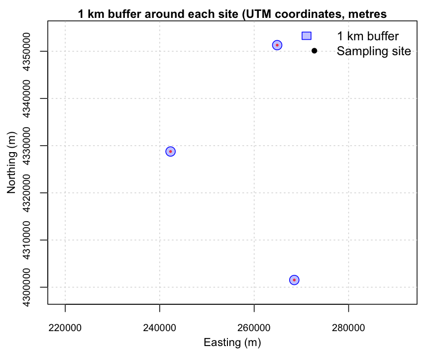
```


###### Clip Soil Data to Defined Boundaries {-}

In soil data management workflows, it is common to restrict analyses to a defined study area (e.g., a county, district, watershed, or project boundary). This helps ensure that summaries, maps, and models are computed only for the relevant spatial extent.

Two core operations are used repeatedly in Soil Data Management and Digital Soil Mapping:

* **Clip / subset by boundary** (`st_intersection()`): keeps only the features (or parts of features) that fall inside a target boundary.

* **Dissolve boundaries** (`st_union()`): merges multiple polygons into a single boundary by removing internal borders.

Use **clipping** to restrict soil profiles, samples, or observations to a target area before analysis or reporting.

Use **dissolving** to build a clean study boundary for masking, cropping, mapping, or aggregating results at a higher level.


**Example 1: Clip sampling points to one administrative unit**

In this example, we clip KSSL sampling points to Riley County. The steps are:

 - Read the administrative boundaries layer.

 - Transform it to the CRS of the soil points (so layers align).

 - Select the target polygon (Riley).

 - Clip the soil points to that polygon.

```{r vector-clip, echo=TRUE, eval=FALSE}
# Read administrative boundaries (example file)
admin <- st_read("01_data/module1/shapes/Tiger_2020_Counties.shp")
# Ensure both layers share the same CRS
admin <- st_transform(admin, st_crs(soil_sf))
# Example: select one unit (replace with your column/value)
study_area <- admin[admin$NAME == "Riley", ]
# Keep only points inside the study area
soil_clip <- st_intersection(soil_sf, study_area)
# Plot result
plot(st_geometry(study_area), col = NA, border = "black", main="Sampled soils in Riley County", cex.main = 1 )
plot(st_geometry(soil_clip), add = TRUE, pch = 16, col = "red", cex = 0.6)
```


```{r vector-clip-image, echo=FALSE, eval=FALSE}
# This chunk is only to create the image. No eval or echo
png("SoilFER-Training-Resources/01_outputs/riley_samples.png", width = 862, height = 708, res = 150)
# Ensure both layers share the same CRS
admin <- st_transform(admin, st_crs(soil_sf))
# Example: select one unit (replace with your column/value)
study_area <- admin[admin$NAME == "Riley", ]
# Keep only points inside the study area
soil_clip <- st_intersection(soil_sf, study_area)
# Plot result
plot(st_geometry(study_area), col = NA, border = "black", main="Sampled soils in Riley County", cex.main = 1 )
plot(st_geometry(soil_clip), add = TRUE, pch = 16, col = "red", cex = 0.6)
dev.off()
```

```{r, echo=FALSE, fig.cap="Sampled soils in Riley County", out.width='50%', fig.align='center'}
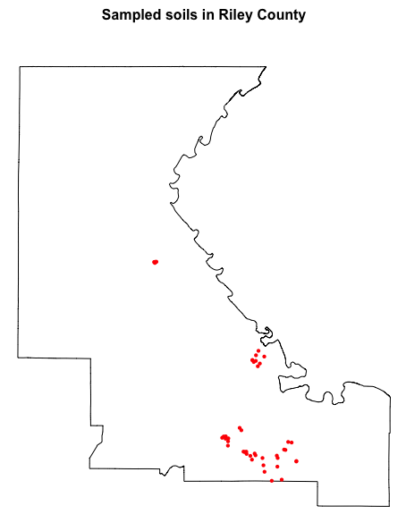
```


In this case, `soil_clip` preserves all attributes from the original sampling dataset (`soil_sf`) and includes the attributes of the administrative polygon `admin` at each point.

**Example 2: Dissolve polygons to create a single study region boundary**

Dissolving is useful when you want a single boundary for a larger study region. For example, you may want to combine all counties into a single Kansas state outline (or merge multiple polygons representing a project area).

`st_union()` merges all polygons into one geometry and removes internal borders.

```{r vector-dissolve, echo=TRUE, eval=FALSE}
# Dissolve all counties into one Kansas boundary
admin_dissolved <- st_union(admin)
# Plot comparison: before vs after dissolve
# Adjust graphics settings to 1 row x 2 columns layout with tight margins
op <- par(
  mfrow = c(1, 2),
  mar = c(0.5, 0.5, 0.1, 0.5),  # very small top margin
  xaxs = "i", yaxs = "i"
)
plot(st_geometry(admin[1]),
     col = NA, border = "black",
     axes = FALSE, asp = 1)
title("Before dissolve", line = -0.6, cex.main = 0.95)
plot(st_geometry(admin_dissolved),
     col = NA, border = "black",
     axes = FALSE, asp = 1)
title("After dissolve", line = -0.6, cex.main = 0.95)
# restore graphics settings
par(op)
```

```{r vector-dissolve-image, echo=FALSE, eval=FALSE}
# This chunk is only to create the image. No eval or echo
png("SoilFER-Training-Resources/01_outputs/dissolve_before_after.png",
    width = 1800, height = 900, res = 200)

bb <- st_bbox(admin_dissolved)
pad <- 0.02
xpad <- as.numeric(bb$xmax - bb$xmin) * pad
ypad <- as.numeric(bb$ymax - bb$ymin) * pad
xlim <- c(bb$xmin - xpad, bb$xmax + xpad)
ylim <- c(bb$ymin - ypad, bb$ymax + ypad)

op <- par(
  mfrow = c(1, 2),
  mar = c(3.0, 3.0, 1.2, 0.8),
  xaxs = "i", yaxs = "i",
  cex.axis = 0.6   # smaller tick labels
)

plot(st_geometry(admin),
     col = NA, border = "black",
     xlim = xlim, ylim = ylim,
     axes = TRUE, asp = 1,
     xlab = "", ylab = "")
grid(nx = NULL, ny = NULL, lty = 3, col = "grey85")
title("Before dissolve", line = 0.2, cex.main = 0.95)
mtext("Longitude", side = 1, line = 2.0, cex = 0.85)
mtext("Latitude",  side = 2, line = 2.0, cex = 0.85)

plot(st_geometry(admin_dissolved),
     col = NA, border = "black",
     xlim = xlim, ylim = ylim,
     axes = TRUE, asp = 1,
     xlab = "", ylab = "")
grid(nx = NULL, ny = NULL, lty = 3, col = "grey85")
title("After dissolve", line = 0.2, cex.main = 0.95)
mtext("Longitude", side = 1, line = 2.0, cex = 0.85)
mtext("Latitude",  side = 2, line = 2.0, cex = 0.85)

par(op)
dev.off()
```

```{r, echo=FALSE, fig.cap="Dissolving polygons on Kansas County vector data", out.width='100%'}
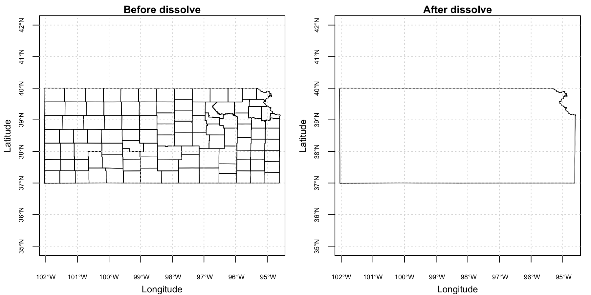
```


###### Spatial Relationships and Joins {-}

Spatial relationships help answer questions about how spatial features relate to one another (e.g., whether a point falls inside a polygon, or how far two features are apart).

**Spatial predicates** (return TRUE/FALSE relationships):

 - `st_intersects()` (touch/overlap)

 - `st_within()` (inside)

 - `st_distance()` (distance between features)

**Spatial joins** attach attributes from one layer to another:

 - `st_join()` (e.g., assign each soil profile to an administrative unit)

Example: assign each sampling point to an administrative polygon.

```{r vector-join, echo=TRUE, eval=TRUE}
# Ensure both layers share the same CRS
alkaline <- st_transform(alkaline, st_crs(admin))
# Join admin attributes to points (points inherit polygon attributes)
alkaline_with_admin <- st_join(alkaline, admin, join = st_within)
# Preview result
head(alkaline_with_admin)
```


##### Visualizing `{sf}` Objects {-}
  
As shown previously, `{sf}` objects can be quickly visualized using the base R `plot()` function. This is convenient for fast checks (e.g., verifying geometry and extent), but it offers limited control over plot appearance and legend design.

In contrast, `{ggplot2}` provides a consistent *'grammar of graphics'* that makes it easier to produce publication-ready maps. Key benefits include:

- Full control of aesthetics (colors, symbol size, line width, transparency) and clear legends.

- High-quality themes and consistent styling across figures (useful in reports and publications).

- Easy layering of multiple spatial objects (points, polygons, buffers, rasters—when combined with other tools).

- Faceting to compare maps by groups (e.g., land use class, sampling campaign, depth interval).

In `{ggplot2}`, spatial geometries are plotted with `geom_sf().`


```{r vector-plot, echo=TRUE, eval=FALSE}
library(ggplot2)
ggplot(data = soil_sf) +
  geom_sf(aes(color = pH), size = 2) +
  scale_color_viridis_c() +
  theme_minimal() +
  labs(
    title = "Soil sampling sites – pH",
    color = "pH"
  )

```

```{r vector-plot-image, echo=FALSE, eval=FALSE}
# This chunk is only to create the image. No eval or echo
png("SoilFER-Training-Resources/01_outputs/ggplot_ph.png", width = 1800, height = 900, res = 200)

ggplot(data = soil_sf) +
  geom_sf(aes(color = pH), size = 2) +
  scale_color_viridis_c() +
  theme_minimal() +
  labs(
    title = "Soil sampling sites – pH",
    color = "pH"
  )

dev.off()
```

```{r, echo=FALSE, fig.cap="Visualization of pH values with ggplot2", out.width='100%'}
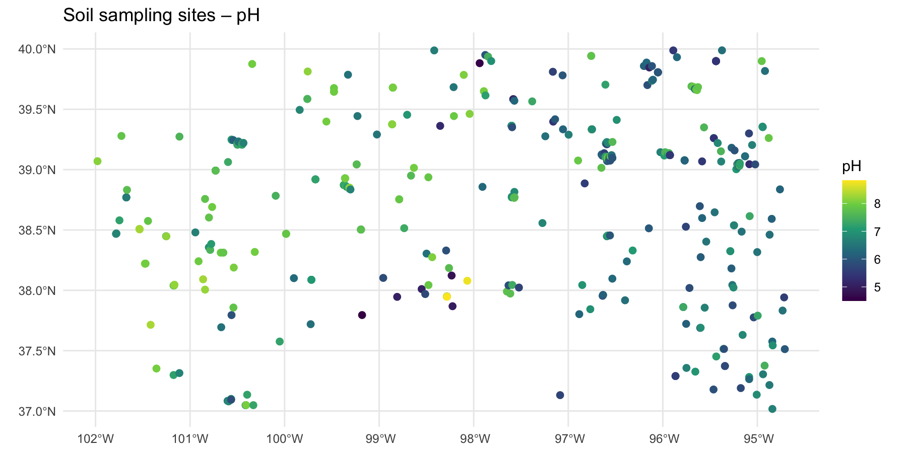
```

The possibilities for visualization with `{ggplot2}` are extensive. For more examples and options, see the `{ggplot2}` documentation and the `{sf}` vignettes on plotting with `geom_sf()`.

------------------------------------------------------------------------

### Preparing Raster Covariates

The workflows presented in this tutorial use environmental covariates as proxies to describe the spatial variation of soil properties. These covariates support two key steps:

- **Sampling design**: covariates are used to identify environmental clusters that should be sampled, helping maximize the representation of soil variability while optimizing sampling effort.

- **Digital Soil Mapping**: soil properties measured at known point locations (vector data) are related to environmental characteristics (raster covariates) to train statistical or machine learning models that predict soil properties continuously across space.

The preparation of covariates is a time-consuming task. Therefore this tutorial uses a pre-compiled set of environmental covariates to fulfil these tasks. It assembles five categories of environmental covariates cloud-optimized GeoTIFF files.

**Climate data** is sourced from two complementary products. 

  - **CHELSA** (Climatologies at High resolution for the Earth's Land Surface Areas) provides long-term bioclimatic variables including mean annual temperature (bio1), annual precipitation (bio12), and extreme temperature and precipitation metrics (bio5, bio6, bio13, bio14, bio16, bio17), alongside potential evapotranspiration computed using the Penman-Monteith method and surface wind statistics. 
  
  - **TerraClimate** contributes monthly time series of maximum and minimum temperature, precipitation, and potential evapotranspiration spanning 1981 to the present, which are exported as multi-band images for subsequent temporal aggregation in R.

**Terrain data** is derived from the USGS SRTM 30 m Digital Elevation Model, from which slope, aspect, Topographic Position Index (TPI), and hillshade are computed on-the-fly within GEE. Geomorphological landform classification at 90 m resolution is obtained from the `Geomorpho90m` dataset. Additionally, pre-computed terrain derivatives at 250 m resolution (elevation, slope, curvature, TPI, TWI) are loaded from the FAO GSP shared GEE asset library hosted at `projects/digital-soil-mapping-gsp-fao`.

**Vegetation and soil indices** are computed from Sentinel-2 Surface Reflectance imagery (Copernicus/S2\_SR\_HARMONIZED), filtered to scenes with less than 10% cloud cover and cloud-masked using the QA60 quality band. The script computes the Normalized Difference Vegetation Index (NDVI), Enhanced Vegetation Index (EVI), Normalized Difference Bareness and Soil Index (NDBSI), Redness Index, Brightness Index, NBR+, and the Visible-Near-Short-wave Infrared Index (VNSIR). Seasonal vegetation dynamics are additionally captured through MODIS FPAR mean and standard deviation layers for four three-month periods covering the full annual cycle.

**Soil Available Water Content** represent the mean available water capacity (AWC - in mm) of soil from 0 to 200 cm depth.

**Land cover** is represented by the ESA WorldCover 2021 product at 10 m resolution, from which a cropland mask is derived by isolating the cropland class (value 40) for use in masking or stratified analyses.


> Note: users need to have a google account to access the covariate data.


##### Download Covariate Rasters {-}

A dedicate Google Drive folder has been created to store large raster files used in this tutorial. Users can obtain the data directly from the folder `rasters` following link:
[https://drive.google.com/drive/folders/1K7tq9zX5HsqbqWcNoT27WtfPtehcKBCu](https://drive.google.com/drive/folders/1K7tq9zX5HsqbqWcNoT27WtfPtehcKBCu)

Data in this folder includes:

 - [**Cropland_Mask_KANSAS.tif**](https://drive.google.com/file/d/1wh6xSW03YKrCHScJJa0c_cSA1XZ8tYY-/view?usp=drive_link) (22.5 mb): Binary raster with presence (1) and absence (NA) of crops in Kansas at 20 meter resolution. This file is used as a mask to avoid non-cropped areas in the analyses. 
 - [**Environmental_Covariates_250m_KANSAS.tif**](https://drive.google.com/file/d/1wURPmPLi2LdYq6zBhZN1e91EiiZsk8oX/view?usp=drive_link) (203.2 mb): Multi-layer raster stack with climatic, remote sensing, topographic information at 250 meter resolution.
 - [**HighRes_Covariates_100m_Kansas.tif**](https://drive.google.com/file/d/1xf89gn4pBKsb5ynVIfKZd4MbT3ZL1Nf2/view?usp=drive_link) (535.6 mb). 100 m resolution rasters with remote sensing derived information.
 - [**DEM_KANSAS.tif**](https://drive.google.com/file/d/14KmmjjTfVD7jTEuQqCLkfcQmXy0VBDkA/view?usp=drive_link) (21.4 mb). 100 m resolution rasters with remote sensing derived information.
 - [**Slope_KANSAS.tif**](https://drive.google.com/file/d/1rESziVFlEvEEmrKacb88R1pKZxbrU7qS/view?usp=drive_link) (61.2 mb). 100 m resolution rasters with remote sensing derived information.
 - [**Geomorphon_Landforms_KANSAS**][@amatulli2020_geomorpho90m](https://drive.google.com/file/d/1E03U42UPl9SKMfUGZZ8qDCno2H_kPxUB/view?usp=drive_link) (14.9 mb). 90 m resolution raster of geomorphological types from Geomorpho90m – Global High-Resolution Geomorphometry Layers.
 - [**TerraClimate_AvgTemp_1981_2023_KANSAS.tif**](https://drive.google.com/file/d/1TyyErHkQeNW9Q_wchW9Fa_0UpdaWS_-_/view?usp=drive_link) (17.7 mb). 100 m TerraClimate monthly averaged Temperature rasters from 1981-2023.
 - [**TerraClimate_PET_1981_2023_KANSAS.tif**](https://drive.google.com/file/d/1b9wM3zwggBFS98pFEyWUFtpKN9ORq9we/view?usp=drive_link) (17.2 mb). 100 m TerraClimate monthly averaged Potential Evapotranspiration rasters from 1981-2023.
 - [**TerraClimate_Precip_1981_2023_KANSAS.tif**](https://drive.google.com/file/d/1xq6y8jNUjDbipXHQE1w67f_vxQeXACkH/view?usp=drive_link) (11.9 mb).  100 m TerraClimate monthly accumulated mean Precipitation rasters from 1981-2023.
 - [**sol_available.water.capacity_usda.mm_m_250m_0..200cm_1950..2017_v0.1.tif**][@gupta_zenodo_2019](https://drive.google.com/file/d/1nG0yCr-tNPzeeEvzcGrtdQxRHnQ6NMH5/view?usp=drive_link).  250-meter resolution geospatial raster dataset representing the mean available water capacity (AWC - in mm) of soil from 0 to 200 cm depth.
 - [**ESA_WorldCover_2021_KANSAS**][@zanaga2022_worldcover2021_v200](https://drive.google.com/file/d/1xq6y8jNUjDbipXHQE1w67f_vxQeXACkH/view?usp=drive_link) (11.9 mb). 10 m resolution rasters of landcover types from the European Space Agency WorldCover,  based on Sentinel-1 and Sentinel-2 data.
 
 
*Table. ESA WorldCover (global land cover) legend, the class codes and color in the Map band.*

   | Value | Class                    | Color (hex) |
   | ----: | ------------------------ | ----------- |
   |    10 | Tree cover               | `#006400`   |
   |    20 | Shrubland                | `#ffbb22`   |
   |    30 | Grassland                | `#ffff4c`   |
   |    40 | Cropland                 | `#f096ff`   |
   |    50 | Built-up                 | `#fa0000`   |
   |    60 | Bare / sparse vegetation | `#b4b4b4`   |
   |    70 | Snow and ice             | `#f0f0f0`   |
   |    80 | Permanent water bodies   | `#0064c8`   |
   |    90 | Herbaceous wetland       | `#0096a0`   |
   |    95 | Mangroves                | `#00cf75`   |
   |   100 | Moss and lichen          | `#fae6a0`   |


##### Obtain Covariate Data from Google Earth Engine (GEE) {-}
 
The data can also be generated directly using Google Earth Engine (GEE). GEE provides direct access to many environmental datasets through a unified interface, allowing analysts to extract, compute, and export ready-to-use covariate stacks for any region of interest using a single script.

The script provided with this training (`02_scripts/module1/1_gee_soilfer_env_covariates.txt`) contains step-by-step instructions to download the covariate data from the GEE platform. 

The data has been already processed for this training and is available to download from this [link](https://drive.google.com/drive/folders/1EGrkhbMTi2qglemuD_onegAqLWZb3BbT). Place these files into the `training_data` folder within `01_data/module1`and set the path for the covariate rasters and spectral data:

```{r training_dir, echo=TRUE, eval=FALSE}
# Define the relative path to the folder with the downloaded covariates
# NOTE: Adapt this path to your project structure
  training_dir <-"01_data/module1/training_data"
```
  

##### Running the GEE Script {-}

Copy the full contents of `1_gee_soilfer_env_covariates.txt` into the GEE Code Editor. Before running, review and adjust the configuration variables at the top of the script (Section 1) to match your study area and requirements.

The `aoi` variable defines the `area of interest`. For the training exercise, this is already configured to use the US Census TIGER state boundary layer:

```javascript
var aoi = ee.FeatureCollection('TIGER/2018/States')
  .filter(ee.Filter.eq('NAME', 'Kansas'));
```

To adapt the script to a different study area, replace this definition with a custom geometry or a different administrative boundary. Update `countryName` to a short descriptor used in the exported file names.

The date range for TerraClimate is controlled by `climateStartDate` and `climateEndDate`. The default configuration covers the full 1981--2023 record. For exploratory or training purposes, restricting this range (e.g., 2000--2023) reduces processing time and export file sizes.

Export spatial resolutions are defined individually for each product category, reflecting the native resolution of each data source: 250 m for the primary CHELSA/MODIS covariate stack, 100 m for high-resolution terrain and Sentinel-2 layers, 90 m for geomorphons, 20 m for the cropland mask, and 4000 m for TerraClimate time series.

Click **Run** to execute the script. Visualization layers (SRTM DEM, Sentinel-2 RGB composite, and cropland mask) will appear on the map immediately. Export tasks do not start automatically --- navigate to the **Tasks** tab in the right panel and click **Run** next to each pending task to initiate the exports to Google Drive.

:::warning-box
**Processing Time and Quotas**

Large exports, particularly **TerraClimate** time series and **Sentinel-2** layers over large regions, can take tens of minutes to several hours depending on server load and area size. GEE free-tier accounts are subject to computation quotas. If a task fails with a computation timeout or memory error, consider reducing the export resolution or splitting the time series into shorter periods. Monitor task progress in the **Tasks** tab; completed files will appear in your `GEE_Exports` Google Drive folder once finished.
:::

Once all exports are complete, download the GeoTIFF files from Google Drive to your local working directory. In subsequent modules, these rasters will be loaded into R using the `terra` package and stacked into the covariate array used in the next modules.

#### Working with Raster Data using `{terra}`

The `{terra}` package is the main framework for working with raster spatial data in R. A raster represents space as a regular grid of cells, where each cell stores a value (e.g., elevation, land cover class, rainfall, SOC prediction). Raster layers are widely used in Digital Soil Mapping both as covariates (environmental predictors) and as model outputs (predicted soil properties).

In practice, a `terra::SpatRaster` object combines:

 * Cell values: the data stored in the grid cells (continuous values like temperature, or categorical values like land cover).

 * Spatial geometry: the grid definition given by the extent (spatial coverage) and resolution (cell size).

 * CRS: the coordinate reference system used (e.g., WGS84, UTM).

 * Layers: a raster can have one layer (e.g., DEM, SOC) or multiple layers (a covariate stack).
 
 
##### Importing and Exporting Raster Data {-}

Raster files are commonly distributed as GeoTIFFs (.tif). The function `rast()` reads both single-layer and multi-layer rasters. Rasters can be exported back to disk with `writeRaster()`.


```{r read-raster, echo=TRUE, eval=FALSE}
library(terra)
# Read a single-layer raster (e.g., cropland mask or DEM)
crops <- rast(paste0(training_dir,"Cropland_Mask_KANSAS.tif"))
# Read a multi-layer raster (e.g., environmental covariates stack)
covs <- rast(paste0(training_dir,"Environmental_Covariates_250m_KANSAS.tif"))
```


To save raster data to disk use `writeRaster`:

```{r write-raster, echo=TRUE, eval=FALSE}
# Export a raster as GeoTIFF
writeRaster(crops, "03_outputs/module1/Cropland_Mask_KANSAS.tif", overwrite = TRUE) # overwrites tif
```

##### Inspecting and Exploring `SpatRaster` Objects {-}

Before analysis, inspect the spatial properties (extent, resolution, CRS), the number of layers, and the value ranges. This helps detect common issues such as mismatched CRS, unexpected resolution, incorrect extents, or missing data patterns.

```{r raster-inspection, echo=TRUE, eval=FALSE}
# Basic metadata (prints summary to console)
covs
# Number of layers
nlyr(covs)
# Spatial properties
ext(covs)
res(covs)
crs(covs)
# Layer names (multi-layer rasters)
names(covs)
# Value ranges for the first 4 layers
global(covs[[1:4]], fun = "range", na.rm = TRUE)
# Histograms of the first 4 layers
# Adjust graphics settings to 2 row x 2 columns layout with tight margins
op <- par(
  mfrow = c(2, 2),
  mar  = c(3.5, 3.5, 2.2, 1.2),  # more space around each panel
  oma  = c(1, 1, 1, 1),          # extra space around the whole figure
  mgp  = c(2.2, 0.7, 0)          # axis title/labels spacing
)

for (i in 1:4) {
  hist(covs[[i]],
       main = paste("Histogram of", names(covs)[i]),
       xlab = names(covs)[i])
}
# restore previous graphics settings
par(op)
```


```{r, echo=FALSE, fig.cap="Visualization of histograms of covariates", out.width='100%'}
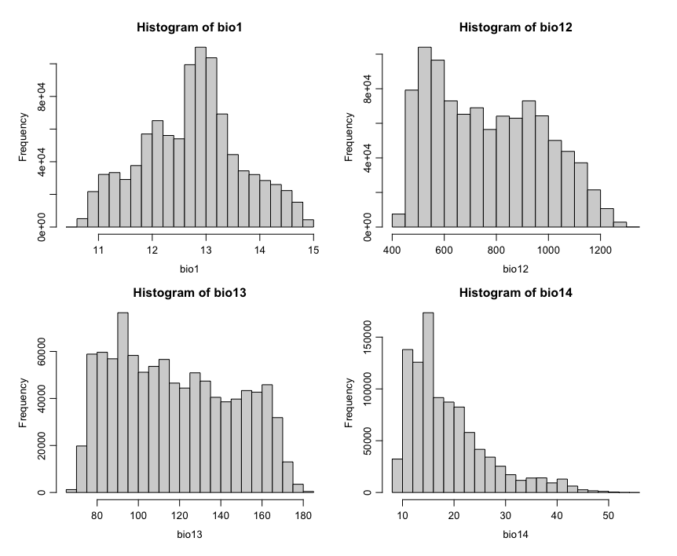
```

:::warning-box
For most raster operations, rasters should share the same CRS, resolution, and extent. If they do not, they typically need adjustment using functions such as `project()`, `resample()`, and `crop()` before combining.
:::

##### Raster Visualization {-}

Rasters can be quickly visualized using `plot()`. For multi-layer rasters, it is common to plot a subset of layers.

```{r plot-raster, echo=TRUE, eval=FALSE}
# Plot single-layer crops raster mask
plot(crops, main="Cropland Mask")
```

```{r, echo=FALSE, fig.cap="Visualization of raster crop mask", out.width='100%'}
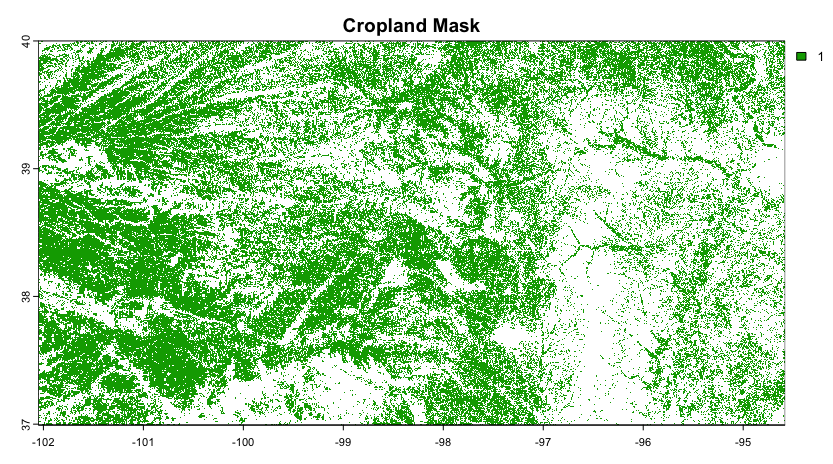
```

```{r plot-raster-covs, echo=TRUE, eval=FALSE}
# Plot a multi-layer raster (e.g., environmental covariates stack)
plot(covs)
```

```{r, echo=FALSE, fig.cap="Visualization of covariates", out.width='100%'}
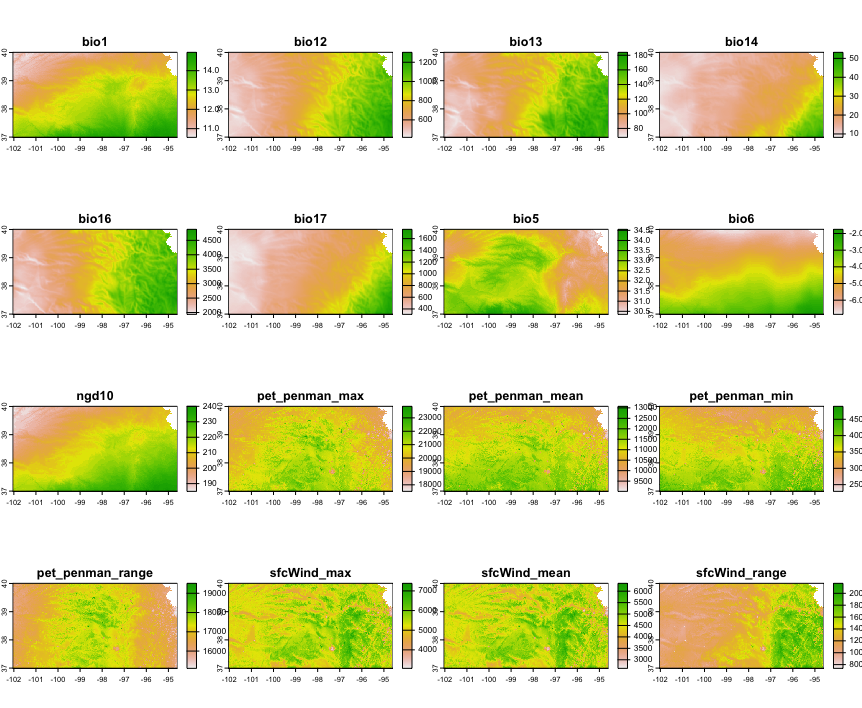
```

You can also plot specific layers by name:

```{r raster-plot-byname, echo=TRUE, eval=FALSE}
# Plot Elevation and Temperature from the covs stack
# Adjust graphics settings to 1 row x 2 columns layout with tight margins
op <- par(
  mfrow = c(1, 2),
  mar = c(0.5, 0.5, 0.5, 0.5),
  xaxs = "i", yaxs = "i"
)
plot(covs[["dtm_elevation_250m"]], main = "Elevation (DEM)", cex.main = .8)
plot(covs[["bio1"]], main = "Annual Mean Temperature", cex.main = .8)
par(op) # restore previous graphics settings
```

```{r, echo=FALSE, fig.cap="Visualization of Elevation and Temperature", out.width='100%'}
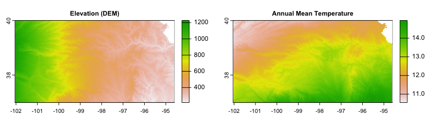
```


##### Setting and Reprojecting CRS for Raster Data {-}
Rasters also have a CRS. You can inspect it with `crs()`. To reproject a raster to a new CRS, use `project()`. Reprojection may change the grid and requires interpolation (resampling), so it is more computationally intensive than vector reprojection.

```{r raster-reproject, echo=TRUE, eval=FALSE}
# Inspect CRS
crs(covs)
# Reproject raster (example: to EPSG:3857)
covs_3857 <- project(covs, "EPSG:3857")
```


##### Spatial Operations on Rasters {-}

Raster operations are used to prepare consistent covariate stacks, restrict layers to a study area, and combine tiled outputs.

###### Merge rasters (mosaic) {-}

Adjacent raster tiles can be merged into a single, continuous layer using `mosaic()`. This is common when rasters are exported as tiles (e.g., from Google Earth Engine). In the example below, two binary cropland mask tiles are mosaicked and written as a compact GeoTIFF.

```{r raster-mosaic, echo=TRUE, eval=FALSE}
# Read input rasters (adjacent tiles)
r1 <- rast(paste0(training_dir,"Cropland_Mask_KANSAS-0000000000-0000000000.tif"))
r2 <- rast(paste0(training_dir,"Cropland_Mask_KANSAS-0000000000-0000023296.tif"))
# Mosaic into a single raster
m <- mosaic(r1, r2, fun = "max")
# Cast to integer to optimize file size (not valid for non-integer continuous data)
m <- as.int(m)
# Write output with compression to reduce file size
writeRaster(m,"03_outputs/module1/Cropland_Mask_KANSAS.tif", overwrite = TRUE,
  wopt = list(datatype = "INT1U",  # Byte (0–255); NA retained as NoData
    gdal = c("COMPRESS=DEFLATE", "PREDICTOR=2", "ZLEVEL=9", "TILED=YES")
  )
)
```

 
###### Crop and mask to study area (`crop()`, `mask()`) {-}

Use `crop()` to reduce the raster extent, and `mask()` to set values outside the boundary to NA.

```{r raster-crop, echo=TRUE, eval=FALSE}
# Crop and mask covariates to the extent of Riley
# Align CRS of both datasets
admin <- st_transform(admin, crs(covs))
# Crop covariates to the extent of the county
covs_crop <- crop(covs, admin[admin$NAME=="Riley",])
# Mask covariates
covs_mask <- mask(covs_crop, admin[admin$NAME=="Riley",])

# Plot covariate (bio1 = temperature) in Riley County
# Adjust graphics settings to 1 row x 2 columns layout with tight margins
op <- par(
  mfrow = c(1, 2),
  mar = c(0.5, 0.5, 0.5, 0.5),
  xaxs = "i", yaxs = "i"
)
plot(covs_crop[["bio1"]], main= "Crop", cex.main = 1)
plot(covs_mask[["bio1"]], main= "Mask", cex.main = 1)
# restore previous graphics settings
par(op) 

```


```{r, echo=FALSE, fig.cap="Differences of Crop and Mask outputs in raster data", out.width='80%'}
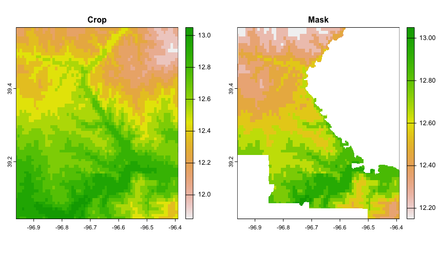
```


:::warning-box
**`crop()` and `mask()` are complementary operations.**

- `crop()`  reduces a raster to the extent of a vector polygon (it keeps all cells within the polygon’s bounding box), while `mask()` retains only the cells inside the polygon and sets values outside to `NA`.

- If you want to limit a raster to a specific boundary and keep only the data within that area, first apply `crop()`  and then `mask()`.

:::

###### Resampling and alignment (`resample()`) {-}

When combining rasters, they often need to be aligned to a common grid (same origin, resolution, and extent). The function `resample()` transfers values from one `SpatRaster` to the grid of another.

A key argument is method, which controls how new cell values are computed. Use `method = "near"` (nearest neighbour) for categorical/class rasters (e.g., land cover, masks) to avoid creating artificial mixed classes. Use `method = "bilinear"` (the default for numeric rasters) for continuous variables (e.g., temperature, elevation), where interpolation is appropriate.

```{r raster-resample, echo=TRUE, eval=FALSE}
# Align raster of crops to the grid of covariates
 crops_aligned <- resample(crops, covs, method = "near")
# Spatial properties of aligned crops and covariates are equal
ext(covs)
ext(crops_aligned)
res(covs)
res(crops_aligned)

```

Other methods (e.g., "cubic", "cubicspline", "lanczos") can produce smoother results for continuous surfaces, while summary methods such as "sum", "min", or "average" are useful when aggregating values from multiple input cells into larger output cells.

###### Combine and remove rasters in a raster stack {-}

Rasters with the same grid definition (same CRS, origin, resolution, and extent) can be combined into a single multi-layer `SpatRaster` (a 'stack'). This is useful for building covariate stacks for raster operations in Digital Soil Mapping.

```{r raster-combine, echo=TRUE, eval=FALSE}
# Set a clear layer name for the aligned cropland mask
names(crops_aligned) <- "crops"
# Add the cropland layer to the covariate stack
covs <- c(covs,crops_aligned)
# Check layer names
names(covs)
```

Layers can also be removed from the stack by subsetting the layers you want to keep.

```{r raster-remove, echo=TRUE, eval=FALSE}
# Remove "crops" from the stack
covs <- covs[[names(covs) != "crops"]]
# Check layer names
names(covs)
```

###### Raster Algebra {-}

Raster algebra creates raster layers by applying cell by cell mathematical or logical operations on existing rasters. It is used to derive new raster products such as indices, threshold-based masks, or reclassified maps. Rasters must have the same definition (CRS, origin, resolution, and extent).


```{r raster-algebra, echo=TRUE, eval=FALSE}
# Example: classify a continuous covariate into two classes
high_temperature <- covs[[1]] > 12
# Adjust graphics settings to 1 row x 2 columns layout with tight margins
op <- par(
  mfrow = c(1, 2),
  mar = c(0.5, 0.5, 0.5, 0.5),
  xaxs = "i", yaxs = "i"
)
plot(covs[["bio1"]], main= "Annual Mean Temperature", cex.main = .8)
plot(high_temperature, main= "High Temperature (>12ºC)", cex.main = .8)
par(op) # restore previous graphics settings
```

```{r, echo=FALSE, fig.cap="Reclassification of raster values with map algebra", out.width='100%'}
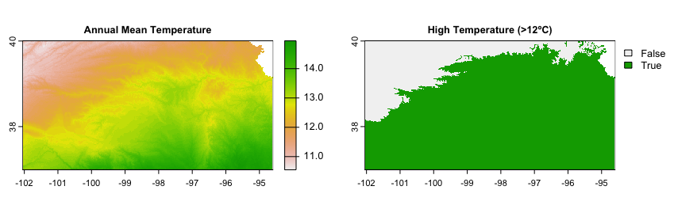
```


###### Combining environmental (Raster) and soil (Vector) information {-}

In Digital Soil Mapping, the calibration of statistical model need to link the analytical properties of soils with the environmental covariates. This is done by their overlapping position. To link soil observations (points) with environmental covariates (rasters), extract raster values at sample locations using `extract()`.

```{r raster-extract, echo=TRUE, eval=FALSE}
# Extract covariate values at point locations (soils_sf)
cov_values <- extract(covs, soil_sf)
```


The new object `cov_values` is a data frame which does not have the original data of the sf object `soil_sf`. A simple column bind command (`cbind`) can be used bind covariates to `soil_sf`, which remains an sf object keeping geometry (coordinates) and all original columns, plus the covariate columns.

```{r raster-bind, echo=TRUE, eval=FALSE}
# cov_values includes an ID column in the first column
soil_sf <- cbind(soil_sf, cov_values[ , -1, drop = FALSE])

```

This dataset contains all the information to be used in further analyses of Sampling Design and calibration of Digital Soil Mapping models.


#### Calculation of Soil–Climate Rasters (Newhall Simulation Model)

The Newhall Simulation Model (NSM) is a water-balance–based model originally developed to estimate soil moisture and soil temperature regimes from climate and site characteristics[@NewhallBerdanier1996]. It simulates the seasonal dynamics of soil water storage and temperature using monthly climate inputs and simple soil physical assumptions. The resulting regime classes (e.g., ustic, udic, xeric; and temperature regimes such as mesic or thermic) are widely used in soil survey and soil classification contexts, and they are also useful as environmental descriptors in DSM workflows.

In this tutorial, we use the R implementation of the NSM available in the `{jNSMR}` package.

The model requires several raster layers as inputs:

 * Monthly precipitation (pJan … pDec): drives water inputs into the soil water balance.

 * Monthly temperature (tJan … tDec): controls evapotranspiration demand and soil temperature dynamics.


 In addition to monthly precipitation and temperature, the Newhall Simulation Model also requires site descriptors that influence soil water balance and seasonality:

 * Elevation (DEM): to account for altitude-related effects on temperature (and therefore evapotranspiration and soil temperature patterns).

 * Available Water Capacity (AWC): to represent, in mm, how much water the soil can store (typically for a reference depth, e.g., 0–200 cm), which controls how quickly soils dry after rainfall.

 * Longitude and latitude: to provide each grid cell’s geographic position, supporting calculations that depend on seasonal timing and and solar geometry (e.g., daylength patterns and the timing of solstices used in some Newhall metrics such as 'days after summer solstice' or 'after winter solstice').
 
This workflow processes monthly temperature and precipitation data from large time series (1981--2023), computes long-term monthly averages, and prepares all the above described rasters in a stack to run the Newhall soil–climate model (via `{jNSMR}`). The output includes soil-climate diagnostics and regime classifications (e.g., temperature and moisture regimes), which can be used as covariates in Sampling Design and Digital Soil Mapping.

##### Environment setup {-}
 
The first step is to prepare the Environment setup (loading packages, define path to data files, and set the CRS).

```{r newhall-setup, echo=TRUE, eval=FALSE}
# Packages
library(terra)
library(sf)
library(dplyr)
library(jNSMR)

# Target CRS for the workflow (use a projected CRS for analysis)
epsg <- "EPSG:3857"   # Web Mercator (meters). Replace if needed.
agg.factor <- 1       # Optional aggregation to speed up Newhall calculations (1 = no aggregation)

```

##### Prepare monthly average rasters of climatic data {-}

TerraClimate files contains large time series (1981-2020) of climatic records. Monthly temperature and precipitation averages from these series must be calculated as independent raster files. Temperature in this dataset if scaled (e.g., ×10) to avoid decimal point data and save storage space this it has to be adjusted to real values. The following chunk computes the averages for every month across all years, producing a 12-layer raster stack of monthly averages.

```{r newhall-t-p-avg, echo=TRUE, eval=FALSE}
# Monthly temperature time series (multi-year, monthly layers)
tmp <- rast(paste0(training_dir,"TerraClimate_AvgTemp_1981_2023_KANSAS.tif"))

# Number of years in the stack (assuming complete years)
nyears <- nlyr(tmp) / 12

# Monthly means across all years
temp_list <- vector("list", 12)
tmp_ref <- tmp[[1]]  # reference layer for initializing
for(i in 1:12){
  var_sum <- tmp_ref * 0
  k <- i
  for(j in 1:nyears){
    var_sum <- var_sum + tmp[[k]]
    k <- k + 12
  }
  temp_list[[i]] <- var_sum / nyears
}
# Convert to stack
Temp_Stack <- rast(temp_list) * 0.1  # convert scaled values to °C (×0.1)
# Write to disk
writeRaster(Temp_Stack, "03_outputs/module1/Temp_Stack_monthlyMean.tif", overwrite = TRUE)


# Monthly precipitation time series (multi-year, monthly layers)
prec_mm <- rast(paste0(training_dir,"TerraClimate_Precip_1981_2023_KANSAS.tif"))
# Number of years in the stack (assuming complete years
nyears <- nlyr(prec_mm) / 12
# Monthly means across all years
prec_list <- vector("list", 12)
pre_ref <- prec_mm[[1]] # reference layer for initializing
for(i in 1:12){
  var_sum <- pre_ref * 0
  k <- i
  for(j in 1:nyears){
    var_sum <- var_sum + prec_mm[[k]]
    k <- k + 12
  }
  prec_list[[i]] <- var_sum / nyears
}
# Convert to stack
Prec_Stack <- rast(prec_list)
# Write to disk
writeRaster(Prec_Stack, "03_outputs/module1/Prec_Stack_monthlyMean.tif", overwrite = TRUE)
```

##### Prepare monthly average stack of climatic data {-}

NSM expects monthly precipitation and temperature layers with specific, predefined layer names.

```{r newhall-stack, echo=TRUE, eval=FALSE}
# Load outputs (reuse objects from above)
Prec_Stack <- rast("03_outputs/module1/Prec_Stack_monthlyMean.tif")
Temp_Stack <- rast("03_outputs/module1/Temp_Stack_monthlyMean.tif")


names(Prec_Stack) <- c("pJan","pFeb","pMar","pApr","pMay","pJun","pJul","pAug","pSep","pOct","pNov","pDec")
names(Temp_Stack) <- c("tJan","tFeb","tMar","tApr","tMay","tJun","tJul","tAug","tSep","tOct","tNov","tDec")

combined_stack <- c(Prec_Stack, Temp_Stack)
writeRaster(combined_stack, "03_outputs/module1/climate_vars.tif", overwrite = TRUE)
```


##### Prepare site descriptors that influence soil water balance and seasonality {-}

In addition to monthly precipitation and temperature, NSM uses a number of site descriptors influencing soil climate:

 - Elevation (DEM).

 - Available Water Capacity (AWC).

 - Longitude and latitude.
 
 These raster layers are obtained from different sources thus their geometry have to be harmonized to create a unique raster stack for the calculations. 
 
 
```{r newhall-resample, echo=TRUE, eval=FALSE}
# DEM
# Read raster
elev <- rast(paste0(training_dir,"DEM_KANSAS.tif"))
# Align CRS to the common EPSG
if(crs(elev) != epsg) elev <- project(elev, epsg, method = "near")

# AWC (0–200 cm, in mm)
# Read raster
awc <- rast(paste0(training_dir,"awc_KANSAS.tif"))
# Align CRS to the common EPSG
if(crs(awc) != epsg) awc <- project(awc, epsg, method = "near")
# Align geometries with the DEM raster
awc <- resample(awc, elev)
# Define name
names(awc) <- "awc"

# Temperature and Precipitation
# Read climate stack
newhall <- rast("03_outputs/module1/climate_vars.tif")
# Align CRS to the common EPSG
if(crs(newhall) != epsg) newhall <- project(newhall, epsg, method = "near")
# Align geometries with the DEM raster
newhall <- resample(newhall, elev)

# Longitude and Latitude 
# calculate lon/lat from the climate stack
newhall$lonDD <- init(newhall[[1]], "x")
newhall$latDD <- init(newhall[[1]], "y")

# Mask climate stack to DEM valid area and add DEM/AWC to the stack
newhall <- mask(newhall, elev)
newhall$awc  <- awc
newhall$elev <- elev

# Save full NSM input stack
writeRaster(newhall, "03_outputs/module1/climate_newhall_vars.tif", overwrite = TRUE)
```

##### Calculate NSM outputs {-}

Depending on resolution and extent, the calculation of the NSM can take hours. To reduce runtime you may aggregate the input stack (optional), then run `newhall_batch()` with multiple cores.

```{r newhall-compute, echo=TRUE, eval=FALSE}
# Read the full Newhall input stack
newhall <- rast("03_outputs/module1/cclimate_newhall_vars.tif")

# Optional: aggregate to speed up (e.g., fact = 2, 3, ...)
# newhall <- aggregate(newhall, fact = agg.factor)

system.time({
  newhall_results <- jNSMR::newhall_batch(newhall, cores = 4)
})
```

##### Inspect and export results (compact outputs) {-}

The NSM output includes the following layers:

```{r newhall-layer-table, echo=FALSE, message=FALSE, warning=FALSE}
library(knitr)
library(dplyr)
library(tibble)

newhall_layers <- tribble(
  ~layer, ~units, ~description,
  "annualRainfall", "mm/yr", "Total precipitation accumulated over the year.",
  "waterHoldingCapacity", "mm", "Soil water-holding capacity used by the model (plant-available storage over the modeled profile/control section).",
  "annualWaterBalance", "mm/yr", "Net annual water balance (precipitation − potential evapotranspiration) summed over the year; positive = surplus, negative = deficit.",
  "annualPotentialEvapotranspiration", "mm/yr", "Total annual potential evapotranspiration (atmospheric evaporative demand) summed over the year.",
  "summerWaterBalance", "mm (summer period)", "Net water balance during the model’s summer period (precipitation − potential evapotranspiration) for that season.",
  "dryDaysAfterSummerSolstice", "days", "Number of days classified as dry after the summer solstice (indicator of summer dryness duration).",
  "moistDaysAfterWinterSolstice", "days", "Number of days classified as moist after the winter solstice (indicator of post-winter moisture duration).",
  "numCumulativeDaysDry", "days", "Cumulative number of dry days across the year (sum of days meeting the model’s dry condition).",
  "numCumulativeDaysMoistDry", "days", "Cumulative number of moist-dry (intermediate) days across the year.",
  "numCumulativeDaysMoist", "days", "Cumulative number of moist days across the year.",
  "numCumulativeDaysDryOver5C", "days", "Cumulative number of dry days when temperature is > 5 °C.",
  "numCumulativeDaysMoistDryOver5C", "days", "Cumulative number of moist-dry days when temperature is > 5 °C.",
  "numCumulativeDaysMoistOver5C", "days", "Cumulative number of moist days when temperature is > 5 °C.",
  "numConsecutiveDaysMoistInSomeParts", "days", "Consecutive days when the soil is moist in some part of the control section (persistence of partial-profile moisture).",
  "numConsecutiveDaysMoistInSomePartsOver8C", "days", "Consecutive days when the soil is moist in some part of the control section and temperature is > 8 °C.",
  "temperatureRegime", "class", "Categorical soil temperature regime output (e.g., mesic, thermic), derived from the model’s temperature criteria.",
  "moistureRegime", "class", "Categorical soil moisture regime output (e.g., udic, ustic, xeric), derived from the model’s moisture criteria.",
  "regimeSubdivision1", "class", "Van Wambeke modifier (Part 1): a simple qualifier such as Wet/Dry/Typic/Weak/Extreme that refines the moisture regime.",
  "regimeSubdivision2", "class", "Van Wambeke base term (Part 2): the main regime term (often Temp* or Trop* forms like Tempustic/Tropustic or Tempudic/Tropudic). Combine with Part 1 to get the full label (e.g., 'Wet Tempustic')."
)
kable(
  newhall_layers,
  col.names = c("Layer", "Units", "Description"),
  align = c("l", "l", "l")
)
```

The final step is to inspect, mask, and export NSM outputs for use in subsequent analyses.  
We mask the model outputs using the annual rainfall layer as a validity template, which helps remove spurious values in areas where the climate inputs are undefined (e.g., open water or NoData zones in the precipitation surface).

```{r newhall-export, echo=TRUE, eval=FALSE}

# Build a validity mask from the precipitation layer
mask_valid <- !is.na(newhall_results$annualRainfall)
# Apply the mask to all NSM layers
results <- mask(newhall_results, mask_valid)
# Quick inspection
# -------------------------------------------------------------------
names(results)
plot(results[1:6])

# Export to GeoTIFF
writeRaster(results, "03_outputs/module1/newhall.tif", overwrite = TRUE)

# Optional: compact integer exports
#    Multiply by 10 to preserve 1 decimal place, then store as integer.
#    (Useful to reduce file size when decimals are not critical.)

results_intx10 <- app(results, function(x) as.integer(round(x * 10)))
writeRaster(results_intx10, "03_outputs/module1/newhall_intx10.tif", overwrite = TRUE)

```

The raster stack `newhall_results` contains the NSM outputs, which can be used as covariates in both the Sampling Design and Digital Soil Mapping workflows.
 

### References {-}


