# GloSIS Soil Data Preparation

## Introduction

For more than a century, tremendous resources and scientific effort have been invested in collecting and analyzing soil information across the globe [@ARROUAYS20172]. These data collection efforts---conducted through national soil surveys, research institutions, agricultural programs, and environmental monitoring initiatives---represent one of the most comprehensive scientific data compilation worldwide. This data, often referred to as legacy data, holds extraordinary potential with applications spanning food security, climate change mitigation, land degradation assessment, and sustainable land management.

However, this accumulated soil knowledge remains largely inaccessible and unusable for integrated local, regional or global analyses. The challenge is its fragmentation into thousands of isolated data repositories, each maintained independently by different organizations using their own formats, naming conventions, units of measurement, and analytical procedures. When properly compiled, organized, and standardized, historical soil surveys can serve as basic input or validation data for Digital Soil Mapping activities [@Medeiros24]. However, realizing this potential requires solving the fragmentation problem through systematic standardization.

In 2012, FAO formally established the Global Soil Partnership (GSP) to coordinate international efforts in soil governance and soil science. Within this framework, GSP mandated the International Network for Soil Information Institutions (INSII) to develop and implement GloSIS, the Global Soil Information System. Rather than attempting to centralize all soil data into a single organization or location, GloSIS functions as a decentralized spatial data infrastructure that enables soil data management and sharing within a global harmonization framework. National soil institutes, research organizations, and other data holders maintain control of their data in their own systems, but contribute that data to the GloSIS platform following standardized formats and protocols for data preparaation and sharing.

GloSIS makes data comparable across countries and regions. When data is submitted to GloSIS, it undergoes a standardization process that translates local data into a universally understood format, the PostgreSQL GloSIS database. This integration requires systematic preparation, validation, and standardization of individual datasets. This is where the technical infrastructure developed at FAO-GPS (the ETL system described in this manual) becomes essential. Before soil data can contribute meaningfully to global analysis, it must be carefully prepared, quality-checked, and transformed into the standardized format that GloSIS requires.

In this section, we introduce the key concepts of data harmonization and standardization in line with GloSIS database requirements, and demonstrate how to use the `glosis-etl-js` a JavaScript set of modules to Extract (E) Transform (T) and load (L) soil data into the GloSIS database structure. The exercises use the soil legacy dataset provided in the training materials as a practical example.

## The GloSIS ISO 28258 database

The GloSIS database is a PostgreSQL/PostGIS relational database that implements the GloSIS data model to store soil observations in a standardized, quality-controlled structure. It is aligned with the concepts for the digital exchange of soil-related data outlined in ISO 28258 and it is designed to make soil data consistent and comparable across countries and projects by enforcing common structures, controlled vocabularies, and validation rules. It serves as the central repository for harmonized soil data---linking spatial sampling locations, methods and procedures, and analytical results---so that datasets from different sources can be integrated and compared consistently worldwide.

The International Organization for Standardization (ISO) established **ISO 28258: "Soil quality---Digital exchange of information on soil and soil-related data"** as the international standard for digital soil data representation and exchange. ISO 28258 defines how soil-related information is logically organized, the hierarchical and relational structure connecting soil observations, definitions of soil concepts following international conventions, metadata requirements and quality assurance procedures.

By aligning with ISO 28258, the GloSIS database provides the infrastructure needed for global soil data integration and interoperability.

The Glosis database organizes data into the five standard soil-related categories, each with specific subcategories:

-   `Site`: Represents the broader environment where soil investigations occur, capturing context such as terrain, climate, and land-use.

-   `Plot`: A specific location for soil investigation where profiles and samples are collected. It is further classified into:

    -   `Surface`: A polygonal area where soil properties are assumed to be relatively homogeneous.
    -   `TrialPit`: A manually excavated pit for detailed soil examination.
    -   `Borehole`: A drilled hole for subsurface soil sampling.

-   `Profile`: A vertical sequence of soil horizons or layers at a given location (referred to as `ProfileElement` in ISO 28258).

-   `Element` -- Subdivisions of a profile based on depth, further categorized as:

    -   `Horizon` -- A natural, homogeneous soil layer formed by pedogenesis.
    -   `Layer` -- An arbitrarily defined soil section for analysis at fixed depths.

-   `Specimen` -- A physical sample extracted at a defined depth, typically analyzed in laboratories for chemical and physical properties (referred to as `SoilSpecimen` in ISO 28258).

Each of these 'features of interest' is represented by dedicated tables in the relational database. Because they describe different entities, they store different types of information and attributes. The challenge is to translate the raw soil data files into this structured database model.

## Standardization with the XLSX Template

Preparing data for GloSIS begins with organizing soil information according to the features of interest used in the GloSIS database (Site, Plot, Profile, Element, and Specimen). To support this process, the GloSIS ETL uses an `XLSX template` that offers a user-friendly way to compile soil data in a structure that mirrors the relational tables of the PostgreSQL/PostGIS database. When completed correctly, this template is used by the `glosis-etl-js` Standardization module to translate the information into the PostgreSQL database structure.

The template contains multiple sheets, each corresponding to a specific feature of interest and its associated attributes. By completing these sheets, users effectively split raw or legacy datasets into the categories required for harmonization and standardization prior to loading.

This organization can be done manually, by entering values directly into the template, or automatically using dedicated modules such as `glosis-etl-js Harmonization` introduced in the next section. In both cases, understanding the structure and purpose of the `XLSX template` is essential to ensure that data are prepared correctly.

In addition to the feature-of-interest sheets, the template includes dedicated tabs for documenting analytical procedures (including methods and units of measurement), metadata, and original analytical values, supporting traceability when unit conversions to GloSIS standards are required.

The following sections provide a detailed overview of each sheet included in the `XLSX template`.

### Plot Data Sheet

The `Plot Data` sheet (Fig. \@ref(fig:plot-tab)) provides information about the sampling location. It includes identification of the project in which the sample was collected (`project_code`), identifiers for the sampling site (`site_code`), plot (`plot_code`), plot type (`plot_type`) and profile (`profile_code`). The `plot_type` specifies the sampling method: `Borehole` (auger sample), `TrialPit` (open profile excavation), or `Surface` (area-based description).

The `n_layers` column indicates the number of soil samples collected at different depths for a given site. The number of samples corresponds to the number of horizons or layers collected at each sampling profile. For example, if a soil profile contains three horizons and all contains have been sampled, the `n_layers` value will be `3`.

`Date` stores the date when the survey was conducted. The date must follow ISO-8601 ("YYYY-MM-DD" format).

The following columns capture the georeferencing of the sampling site (`latitude`, `longitude`, and `altitude`), together with supporting location metadata (`positional_accuracy` - accuracy estimate, `extent` - spatial extent of sampling area and `map_sheet_code` - reference map sheet identifier; all of them not mandatory). Coordinates must be recorded in decimal degrees using the `EPSG:4326 (WGS84)` coordinate reference system to ensure global consistency and interoperability within the GloSIS database.

```{r plot-tab, echo=FALSE, out.width="100%",fig.cap = "Plot Data Sheet."}
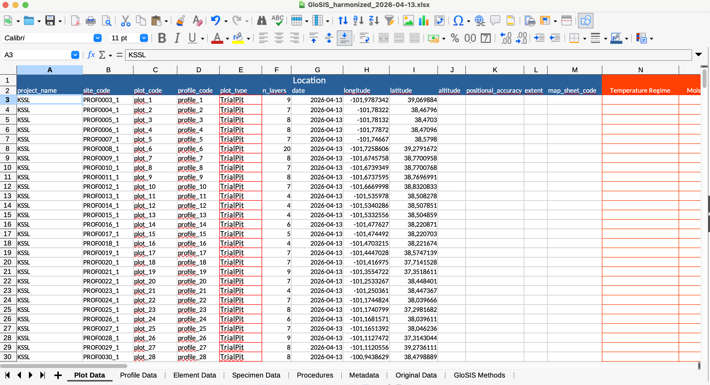
```

Finally, columns `N:BJ` describe the soil formation factors in the sampling plot following the FAO Guidelines for Soil Description 4th Ed. (2006) if available. These columns are optional and only can be updated manually directly on the `XLSX template`.

### Profile Data Sheet

This sheet includes profile identification `profile_code` and profile descriptors (FAO and Soil USDA classification Systems and Soil Depth classes according to the 4th edition of the FAO Guidelines for Soil Description. The `profile_code` column act as the join parameter to link profiles to the information on the other sheets, thus it is important to ensure its consistency over the whole file tabs.

This sheet records the profile identifier (`profile_code`) and key profile descriptors, including soil profile classification (FAO and USDA Soil Taxonomy) and soil depth classes following the 4th edition of the FAO Guidelines for Soil Description. The `profile_code` field serves as the main join key linking profile records to related information in the other sheets, so it is essential to keep it consistent across all sheets in the file.

### Element Data Sheet

An `Element` is a depth-based subdivision of a soil profile and can be described as either:

-   `Horizon`: a natural, relatively homogeneous layer formed by pedogenesis

-   `Layer`: an arbitrarily defined section, often based on fixed depth intervals for sampling and analysis

Figure \@ref(fig:element-fig) illustrates the differences between these two element types.


```{r element-fig, echo=FALSE, out.width="100%",fig.cap = "Horizon vs Layer en Element Features."}
knitr::include_graphics("images/module4/element.png")
```

For each sampled horizon or layer, the `Element Data` sheet records the identifiers used to link the profile and the element (`profile_code`, `element_code`), and where applicable, the horizon classification identifier (`horizon_code`) features. It also specifies the `element_type` (`Horizon` or `Layer`) and the depth limits of the element (`upper_depth`, `lower_depth`)

As in the `Profile Data` sheet, key morphological characteristics following the 4th edition of the FAO Guidelines for Soil Description can optionally be added manually in columns `H:CC` (Fig. \@ref(fig:element-tab)).

```{r element-tab, echo=FALSE, out.width="100%",fig.cap = "Element Data Sheet."}
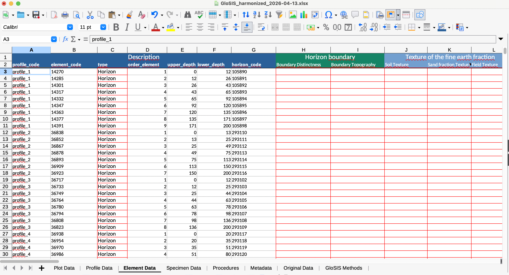
```


### Specimen Data Sheet

The main purpose of the `Specimen Data` is to store the laboratory analytical results for each horizon or layer registered in `Element Data`. It includes the identifiers needed to link analytical results to the corresponding profile and element (`profile_code`, `element_code`) and the laboratory sample label (`specimen_code`) in columns `A:C` (Fig. \@ref(fig:specimen-tab)). 

The subsequent columns contain the analytical values for each measured soil property.

Because these values are loaded into the GloSIS database, all analytical results in this sheet **must be expressed in the GloSIS standard units of measurement**. If necessary, values should be converted to the required units prior to ingestion. These values are automatically transformed if the `glosis-etl-js Harmonization` module is used to create the template.

```{r specimen-tab, echo=FALSE, out.width="100%",fig.cap = "Specimen Data Sheet."}
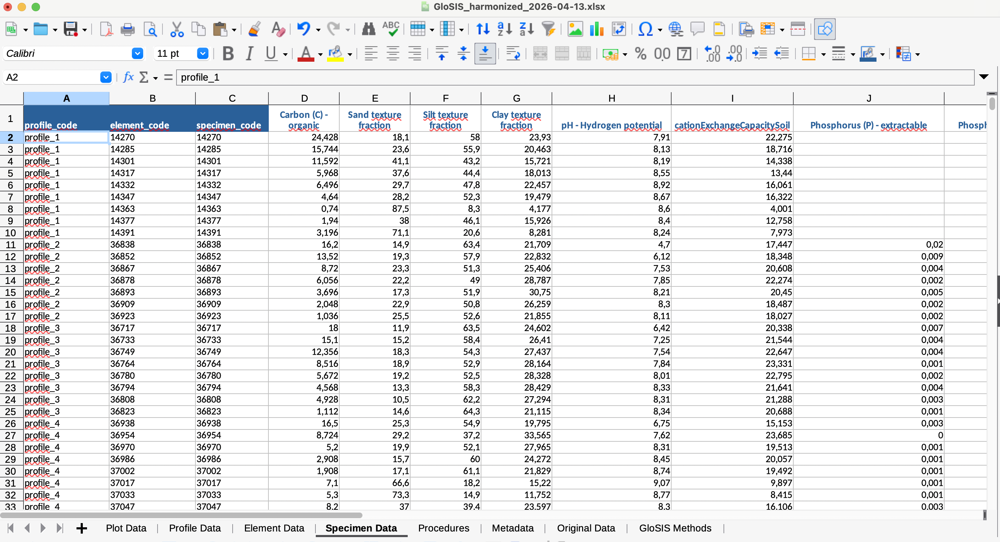
```

** Note that the values in this sheet are already converted to the corresponding GloSIS standard units of measurement. The original values remain as a backup in the sheet `Original Data`.

### Procedures Sheet

The `Procedures` sheet defines the relationship between the measured soil properties, their standardized GloSIS property names, the laboratory methods, and the units of measurement. This linkage is essential to ensure consistency and interoperability across datasets and to support correct ingestion into the GloSIS database.

The sheet is linked to the reference list provided in the `GloSIS Methods` sheet, which contains the approved set of standardized soil property names, analytical procedures, and measurement units. Only properties, methods, and units included in `GloSIS Methods` can be uploaded to the GloSIS database. Any measured property, method, or unit that is not present in this list cannot be ingested and must either be removed or replaced with an accepted equivalent. Missing procedures can be reported to the GloSIS Working Group for possible inclusion, together with documentation describing the soil property, the analytical method, and the unit of measurement. The reference list is maintained and updated over time to incorporate new analytical properties, methods, and units.

In practical terms, this sheet links the analytical values in `Specimen Data` to their corresponding analytical metadata (Fig. \@ref(fig:procedures-tab)).  The first column (`soil_property`) lists the soil properties included in `Specimen Data`, in the same order in which they appear. Columns `B–D` provide drop-down menus to select the corresponding standard GloSIS property name, analytical procedure, and unit of measurement. This sheet is automatically populated by the `glosis-etl-js Harmonization` module

```{r procedures-tab, echo=FALSE, out.width="100%",fig.cap = "Procedures Sheet."}
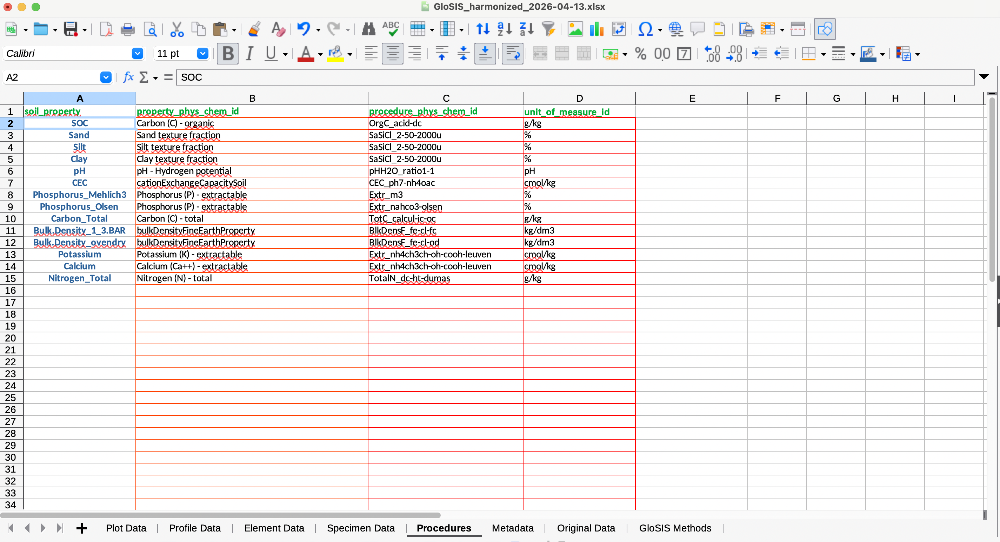
```


### Metadata Sheet

It includes detailed metadata to identify the different data providers (Fig. \@ref(fig:metadata-tab)) .

```{r metadata-tab, echo=FALSE, out.width="100%",fig.cap = "Metadata Sheet."}
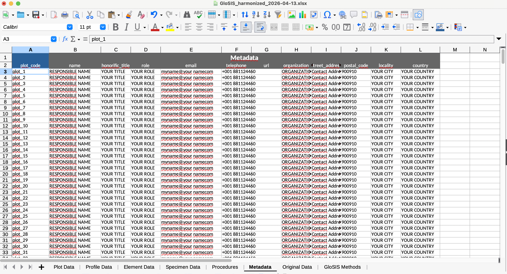
```


### Original Data Sheet

The `Original Data` sheet  (Fig. \@ref(fig:original-tab)) stores the raw values from soil analyses and descriptions before any unit conversion. Although optional, it is recommended for maintaining a record of the original measurements, especially when unit conversions or other transformations are required. Keeping these values supports traceability and good documentation practices.

```{r original-tab, echo=FALSE, out.width="100%",fig.cap = "Original Data Sheet."}
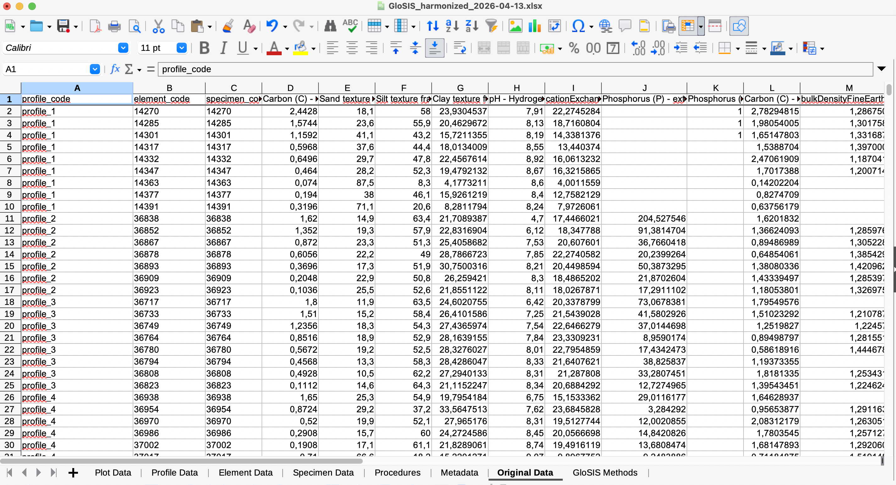
```

Values in the `Original Data` sheet can be linked (e.g., via formulas) to the `Element Data` sheet, allowing adjusted values to be transformed and transferred automatically while preserving the original records. This helps users track how each soil property was measured and in which units the results were reported. The original data are automatically preserved when using the `glosis-etl-js Harmonization` module.


### GloSIS Methods sheet

The `GloSIS Methods` sheet is the reference table that defines which soil properties, analytical procedures, and units of measurement are accepted for loading data into the GloSIS database. It is used by the `Procedures` sheet (via drop-down lists) and by the `glosis-etl-js Harmonization` module to validate inputs and apply unit conversions consistently.

The main columns are:

-   `property_phys_chem_id`: The standardized GloSIS name for the soil property (e.g., Acidity -- exchangeable).

-   \`procedure_phys_chem_idv: The standardized identifier for the analytical method used to measure that property (e.g., ExchAcid_ph0-kcl1m).

-   `unit_of_measure_id`: The required unit for storing the value in GloSIS (e.g., cmol/kg).

-   `value_min / value_max`: The admissible bounds for quality control. Values outside this range can be flagged during harmonization/validation.

-   `definition`: A short description of what is being measured and how (e.g., exchangeable acidity (H+Al) extracted with 1 M KCl).

-   `common_input_units`: A list of commonly encountered units in legacy datasets that can be converted into the GloSIS standard units.

-   `conversion_factors`: The factors applied to each unit listed in `common_input_units`, in the same order, to convert to the GloSIS unit.

-   `notes`: Additional clarifications (e.g., equivalences between units).

## The GloSIS ETL Platform

Because the GloSIS database enforces a structured model, data cannot be loaded reliably as free-form from heterogeneous legacy information. The GloSIS ETL platform provides a practical workflow to harmonize, standardize, and load soil legacy data into the GloSIS PostgreSQL/PostGIS schema in a consistent and reproducible way. This platform has been developed in JavaScript and it is referenced as `glosis-etl-js` in this tutorial.

`glosis-etl-js` transforms raw datasets into database-ready tables by automating the harmonization and standardization tasks required in GloSIS. This streamlines ingestion into the relational database, improves accessibility for non-technical users, and ensures that soil datasets from different sources can be integrated and compared effectively.

The `glosis-etl-js` services are provided as **Docker containers**, allowing users to deploy and manage the system without manually installing software dependencies. This approach ensures stability, compatibility, and ease of updates. The installation and setup of the ETL are described in the next section.

The platform includes three modules  (Figure \@ref(fig:glosis-etl)):

-   *Harmonization*: Checks and harmonizes raw input data (e.g., coordinates, depth intervals, missing or inconsistent fields, out-of-range lab values) and defines units and methods according to GloSIS conventions to produce a clean, consistent dataset for loading.
-   *Standardization*: Transforms the harmonized data into ISO 28258–compliant and GloSIS-standardized data, applying controlled vocabularies and standardized identifiers so that the dataset is fully compliant with the target schema.
-   *Viewer*: Allows users to explore and validate the standardized data before and/or after loading to confirm that records, attributes, and values were ingested correctly into the database.

```{r glosis-etl, echo=FALSE, out.width="100%",fig.cap = "Modules in the glosis-etl-js."}
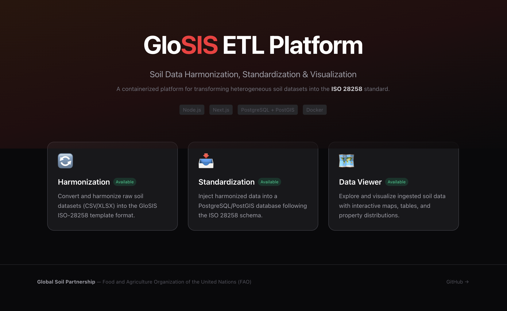
```

### Installation and Setup of the glosis-etl-js

The `glosis-etl-js` application is distributed as a set of Docker containers orchestrated by **Docker Compose**. This means users do not need to manually install PostgreSQL, R, or any other dependency, all software requirements are pre-configured inside the containers and managed automatically through the `docker-compose.yml`.

The project consists of two main services, each running as an independent container:

1.  **`glosis-db-js`** -- A **PostGIS-enabled PostgreSQL database** (based on `postgis/postgis:17-3.5`) that stores soil data following the **GloSIS / ISO 28258** standard. It is automatically initialized with the GloSIS schema via SQL scripts bundled in the repository.

2.  **`glosis-etl-js`** -- A **JavaScript** application that serves a **landing page** and three web modules:

    -   **Harmonization** (`/harmonization`) -- Converts local soil data into GloSIS-compatible format using Excel templates.
    -   **Standardization** (`/standardization`) -- Injects harmonized Excel data into the PostgreSQL database.
    -   **Data Viewer** (`/dataviewer`) -- An interactive dashboard to explore, visualize, and subset the data stored in the database.

An optional third service, **`glosis-pgadmin`**, provides a pgAdmin 4 web interface for direct database administration (see **Optional Services** below).

::: {.warning-box}
Before proceeding, ensure that *Docker Desktop* is installed and running on your computer (see *Installation of Docker Desktop and Docker Compose* in the *Software Installation* section at the beginning of this document).
:::

The easiest way to install the `glosis-etl-js` services is by downloading the repository and using Docker Compose to build and run the containers.

**Steps:**

1.  **Ensure Docker Desktop is running.**

2.  **Download the glosis-etl-js repository from GitHub:**

    Go to:

    ```         
    https://github.com/FAO-SID/glosis-etl-js
    ```

    Click the green **"Code"** button, then select **Download ZIP** (Figure \@ref(fig:clone)).

    ```{r clone, echo=FALSE, out.width="100%", fig.cap="Cloning the repository."}
    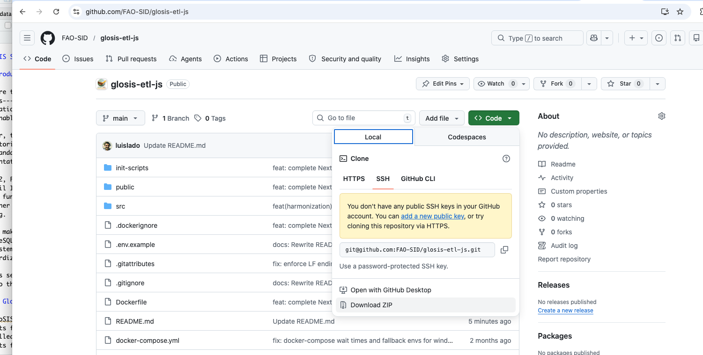
    ```

    Alternatively, if you have Git installed, you can clone the repository:

    ``` bash
    git clone https://github.com/FAO-SID/glosis-etl-js.git
    ```

3.  **Extract the ZIP file** (if downloaded) to a folder on your computer (e.g., the `Desktop` folder).

4.  **Configure the environment variables (Oonly or production deployments).**
    Environment variables (database credentials, logging level, etc.) are read from the `.env` file in the project root. The `.env` file stores configuration values that are shared between the services. The default variables are:

``` bash
# PostgreSQL Database Configuration
POSTGRES_DB=glosis
POSTGRES_USER=glosis
POSTGRES_PASSWORD=glosis    # Change in production!

```

The default values use `glosis` as the database name, user, and password. For production deployments, edit the `.env` file and change the `POSTGRES_PASSWORD` value.

:::warning-box
**CAUTION:**
- ⚠️ Important: For local development or testing, as in this training, do not modify the `.env` file.
- Only update these values when deploying to a production environment, especially the database password.
- For production deployments, always change the default password (`glosis`) to a secure value.
:::


5.  **Open a Terminal or Command Prompt** and navigate to the extracted folder:

    ``` bash
    cd Desktop/glosis-etl-js
    ```

6.  **Start the GloSIS services** by running:

    ``` bash
    docker compose up -d --build
    ```

    > **Note:** The `--build` flag is required the first time to build the `glosis-etl-js` image from the Dockerfile. Subsequent runs can omit it unless the application code has changed. The first build may take **2--5 minutes**.

    > **Note:** On older systems you may need to use `docker-compose` (with a hyphen) instead of `docker compose`.

### Verify Installation

#### Using Docker Desktop

Open Docker Desktop and check if the containers are running (Figure \@ref(fig:docker-desktop)).

```{r docker-desktop, echo=FALSE, out.width="100%", fig.cap="Docker Desktop showing running containers."}
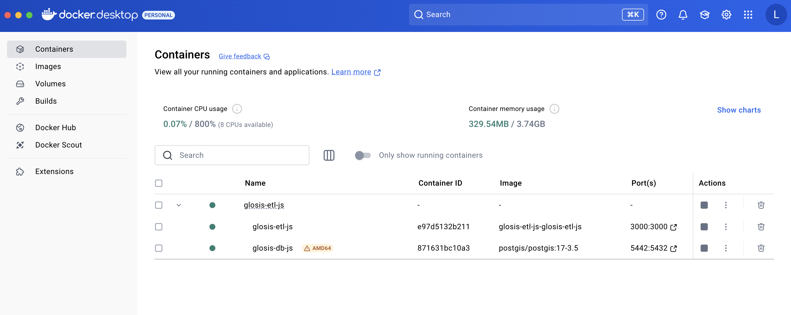
```

If everything is working, the project and service icons should be **green**. If any service fails, the icon will appear \*\*orange\*.

#### Using the Terminal

To manually check if the services are running, type:

``` bash
docker ps
```

You should see an output similar to:

```         
CONTAINER ID   IMAGE                          COMMAND                  CREATED        STATUS                  PORTS                    NAMES
415f97d8a445   glosis-etl-js-glosis-etl-js    "docker-entrypoint.s…"   25 hours ago   Up 25 hours (healthy)   0.0.0.0:3000->3000/tcp   glosis-etl-js
cb414728ebfd   postgis/postgis:17-3.5         "docker-entrypoint.s…"   7 days ago     Up 7 days (healthy)     0.0.0.0:5442->5432/tcp   glosis-db-js
```

Both containers should show a status of **(healthy)**.

#### Stopping the Services

To stop the services at any time, use:

``` bash
docker compose down
```

This will stop and remove the containers, but your **database data will remain intact** in the Docker named volume `glosis-db-data`.

> **Tip:** To completely reset the database (remove all data), run: `docker compose down -v`. This deletes the named volumes and the database will be re-initialized from the SQL scripts on the next start.

### Optional: pgAdmin Web Interface {#pgadmin}

The `docker-compose.yml` file includes an optional **pgAdmin 4** service for direct database management. To activate it, go to the installation folder and type:

``` bash
docker compose --profile admin up -d
```

Once running, access pgAdmin at:

```         
http://localhost:5050
```

Login credentials:

-   **Email:** `admin@glosis.org`
-   **Password:** `admin`

To connect to the GloSIS database from pgAdmin, create a new server with:

-   **Host:** `postgis`
-   **Port:** `5432`
-   **Database:** `postgres`
-   **User / Password:** `glosis` / `glosis`


All created GloSIS PostgreSQL databases are available for connection to external applications such as **pgAdmin**, **DBeaver**, **QGIS**, and **R**, using the parameters listed in Table \@ref(tab:db-connection).

```{r db-connection, echo=FALSE}
db_params <- data.frame(
  Parameter = c("Host", "Port", "Database", "User", "Password"),
  Value = c("localhost", "5442", "yourdatabase", "glosis", "glosis")
)
knitr::kable(db_params, caption = "Database connection parameters.")
```

> **Note:** The port is 5442 (not the standard 5432) to avoid conflicts with any locally installed PostgreSQL server. Adjust the database name to match your actual database.


## Running the GloSIS ETL

To open the GloSIS ETL Platform, enter this address in your web browser:

```         
http://localhost:3000/
```

This will load the **landing page** with links to the three application modules (Figure \@ref(fig:etl-harmonization)).

```{r etl-harmonization, echo=FALSE, out.width="100%",fig.cap = "glosis-etl-js Harmonization module in first place."}

```

Each module is accessible directly via its URL:

| Module              | URL                                     | Description                                |
|:-----------------|:-------------------------|:---------------------------|
| **Harmonization**   | `http://localhost:3000/harmonization`   | Convert local soil data into GloSIS format |
| **Standardization** | `http://localhost:3000/standardization` | Inject harmonized data into the database   |
| **Data Viewer**     | `http://localhost:3000/dataviewer`      | Explore and visualize stored soil data     |


### Data Harmonization

The [Data Harmonization](http://localhost:3000/harmonization) module (Figure \@ref(fig:etl-harmonization)) provides the foundation for preparation of a clean and documented dataset to be ingested in the GloSIS database.


The preparation of the data follows a 3-step quality assurance procedure (Figure \@ref(fig:etl-harmonization-steps)) comprehensive data validation at each stage.

```{r etl-harmonization-steps, echo=FALSE, out.width="100%",fig.cap = "glosis-etl-js Harmonization module."}
knitr::include_graphics("images/module4/etl_harmonization_steps.png")
```

The module performs systematic data quality checks across three domains to produce a `XLSX` file following the GloSIS standards. This file, once correctly verified, will be used as input in the `GloSIS Data` standardization module to ingest soil data into the GloSIS database.


#### Data Upload Interface: Upload

The first step of the harmonization process involves uploading soil datasets and configuring variable mappings to align with GloSIS standard data structure and naming conventions.

The module accepts the following data formats (Figure \@ref(fig:etl-harmonization-step1)):

-   CSV files (.csv) - For comma-separated tabular data
-   Text files (.txt)

```{r etl-harmonization-step1, echo=FALSE, out.width="100%",fig.cap = "Step 1: Data upload section."}
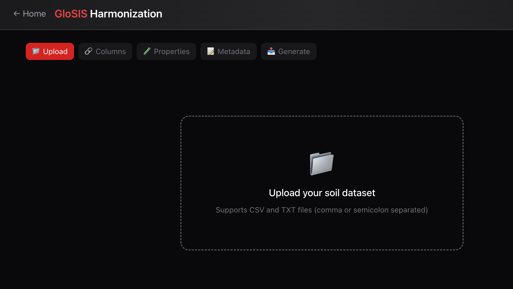
```

The example in this tutorial uses the file `KSSL_cleaned.csv`, produced as output during Session 3 of Module 1 – Soil Data Preparation, as input.

#### Variable Mapping: Columns

Once data is uploaded, users must systematically map their dataset columns to GloSIS standard variable names through an interactive menu. This section facilitates the mapping of Site and Plot features of interest and the identification of the analytical properties in the dataset. It provides dropdown selections for each variable and fuzzy matching to assist in finding correct mappings.

On top, the module displays a table with the first rows of the uploaded data (Figure \@ref(fig:etl-harmonization-step2a)). This serves to identify the column that must be mapped to standard GloSIS nomenclature. 

```{r etl-harmonization-step2a, echo=FALSE, out.width="100%",fig.cap = "Step 2a: Parameter Mapping."}
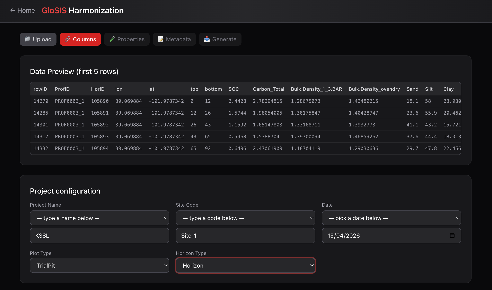
```

The mapping process captures 3 essential categories:

**1) Project Configuration Settings** *Site Identification Parameters (Optional - Default values provided if not mapped):* - Project Name - Site Code - Date of observation - Plot Type - Horizon Type.

**2) Column Mapping ** *Required Plot and Element Parameters (Must be mapped explicitly):* - Sample ID (element_code or specimen_code) - Longitude (X coordinate, WGS84) - Latitude (Y coordinate, WGS84) - Upper Depth (cm) - Top boundary of soil layer - Lower Depth (cm) - Bottom boundary of soil layer.

**3) Soil Properties ** *Identification of the columns with analytical soil properties measured (Multi-selection):* - Each property must be selected to be then mapped to GloSIS standard nomenclature in the next section

Column Mapping and Analytical Properties Identification in this section (Figure \@ref(fig:etl-harmonization-step2b)).

```{r etl-harmonization-step2b, echo=FALSE, out.width="100%",fig.cap = "Step 2b: - Plot, Element and Analytical Mapping."}
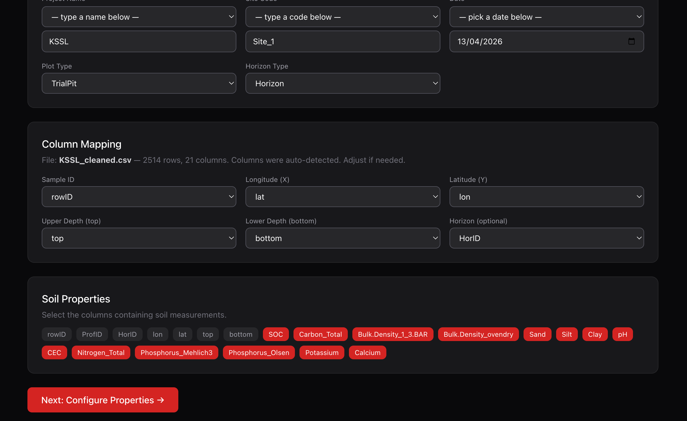
```


#### Variable Mapping: Properties

Each of the selected analytical properties identified in the previous step are here presented to identify the correlative GloSIS standard nomenclature, the analytical methods used and the reporting units in the original database (Figure \@ref(fig:etl-harmonization-step2c)). If the reported soil units differ from GloSIS standard units, the module automatically applies conversion factors to satisfy GloSIS requirements.


```{r etl-harmonization-step2c, echo=FALSE, out.width="100%",fig.cap = "Step 2c: Mapping analytical procedures and units of measurement."}
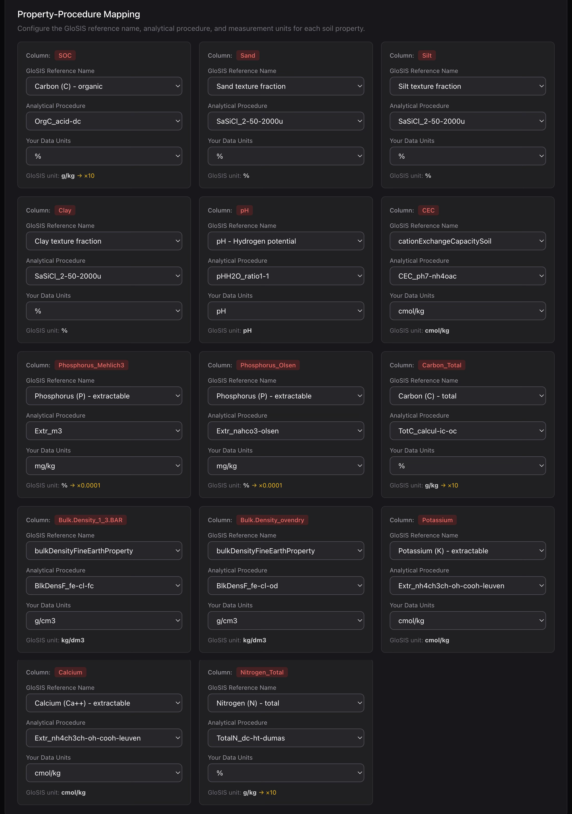
```

The 
#### Data Quality Check and Quality Report Generation

The module analyses the data values, its integrity and coherence and identifies potential issues with the data. 

The data validation in this step occurs at three stages, geographic (horizontal location), soil depth (vertical position) and Analytical integrity (missing values, non valid data, data outliers):

##### Geographic Data Validation

This validation phase ensures that every soil sample is correctly georeferenced with accurate spatial coordinates, maintaining the spatial integrity essential for the GloSIS database.

The GloSIS database uses **EPSG:4326** (WGS84) as its standard coordinate reference system. All geographic coordinates must be identified using this global standard projection.

The module systematically checks for the following geographic data issues:

**Coordinate Completeness:** - Identifies missing X (longitude) and/or Y (latitude) coordinates

**Coordinate Range Validation:** - Longitude: −180° to +180°, Latitude: −90° to +90° (global bounds) - Flags coordinates outside standard global ranges as invalid

**Duplicate Site Detection:** - Identifies potential duplicate sites (multiple profiles at identical coordinates)

##### Soil Depth Validation

All soil profiles must include both upper and lower depth measurements for each sampled layer. This step ensures that the vertical intervals for each soil sample are physically and logically possible, maintaining the integrity of soil profile structure.

The module checks for **Depth Completeness** and **Depth Logical Consistency**:

-   Identifies records with missing top and/or bottom depth measurements
-   Detects depth inversions where top depth ≥ bottom depth (physically impossible)
-   Identifies soil profiles not starting at surface (top depth \> 0 cm when expected)

##### Soil Properties Validation

This final validation step involves screening analytical soil property values against scientifically established analytical thresholds to identify unrealistic or impossible values. Out-of-bounds values are commonly known as outliers.

For each analytical property, the system validates that reported values fall within scientifically plausible ranges using a GloSIS lookup table with global soil data as a reference. The values for each soil property are compared with specific soil lower and upper thresholds and identified as potential out-of-bound values those out of the range of these thresholds 

All errors and warnings identified during the validation phases above are automatically compiled and reported in the main interface. Quality check results are displayed in the bottom of the  `Properties` Tab which displays detailed validation results organized by issue type. Users can download a comprehensive `Download QC Report (XLSX format)` for further analysis and data cleaning outside the module (Figure \@ref(fig:etl-harmonization-QC1)).

```{r etl-harmonization-QC1, echo=FALSE, out.width="100%",fig.cap = "Step 3a: Reporting potential errors in the dataset."}
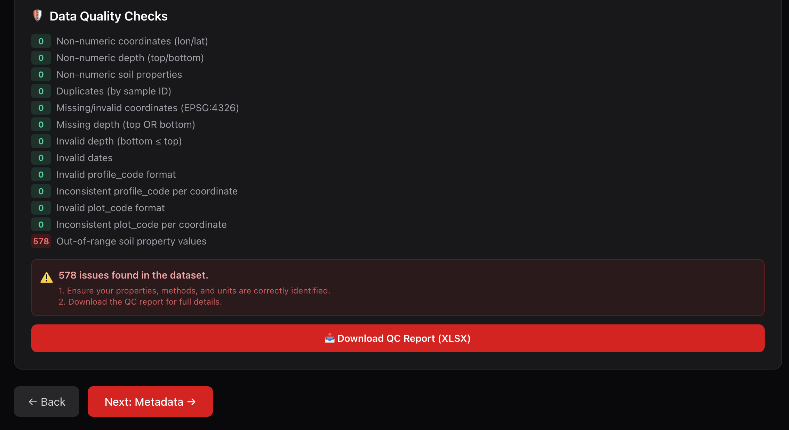
```

If no issues were detected, the QC section will display the message "Data Ready to Harmonize" (Figure \@ref(fig:etl-harmonization-QC2)), and users can proceed to include the Metadata information.

```{r etl-harmonization-QC2, echo=FALSE, out.width="100%",fig.cap = "Step 3a: No errors identified in the dataset."}
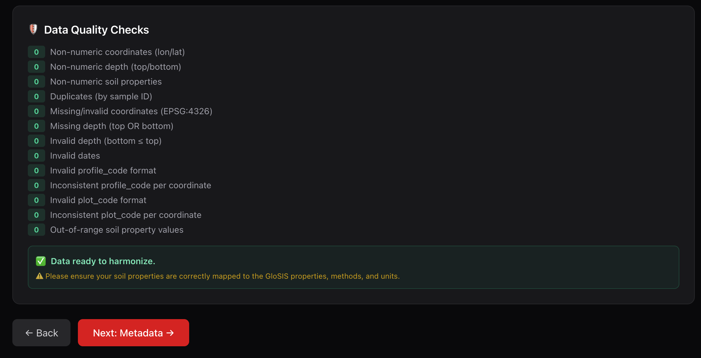
```


##### Data Correction and Resubmission

If data quality issues identified in the Quality Check Report are to to incorrect mapping of soil properties method and units, corrections can be made in the same section once identified. If is related to the dataset itself, users must correct the original dataset and resubmit again for harmonization.

::: highlights
-   The `Procedures Reference` tab in the `public/glosis_template_v6.xlsx` and `public/glosis_procedures_v2.csv` files contain detailed information on the analytical procedures in GloSIS, including glosis units, method descriptions and unit conversion parameters.
:::

#### Metadata 

The metadata section provides a mechanism to include contact and organizational metadata (Figure \@ref(fig:etl-harmonization-metadata)). These values can be adjusted in the generated XLSX GloSIS template to reflect specific metadata associated with individual soil observations.

```{r etl-harmonization-metadata, echo=FALSE, out.width="100%",fig.cap = "Metadata Tab."}
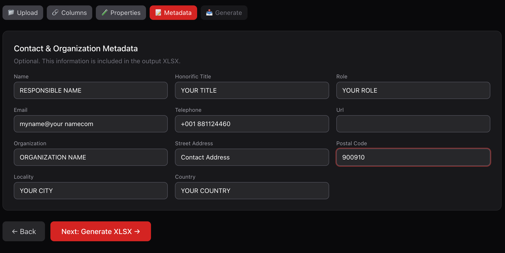
```


#### Generate and Download the Harmonized Data

Once all critical data quality issues have been resolved and the dataset passes validation, users can download the harmonized data in a GloSIS-standard format. Press the `Generate & Download` green button (Figure \@ref(fig:etl-harmonization-download)), and a file with the GloSIS harmonized data will be available in your computer.

```{r etl-harmonization-download, echo=FALSE, out.width="100%",fig.cap = "Metadata Tab."}
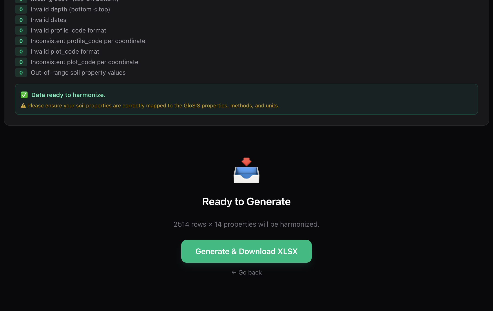
```

The downloaded file follows the GloSIS standard format, with data organized according to the hierarchical features of interest defined in ISO 28258.

**Plot Data Sheet:** - Project identifier - Site identifier - Plot identifier - Profile identifier - Plot type identifier (Borehole, TrialPit, Surface) - Number of layers / plot - Date of observation - Longitude (WGS84) - Latitude (WGS84)

**Profile Data Sheet:** - Profile identifier

**Element Data Sheet:** - Profile identifier - Element identifier - Element type (Horizon, Layer) - Order element (Element position in the profile) - Upper depth - Lower depth - Horizon identifier

**Specimen Sheet:** - Profile identifier - Element identifier - Specimen identifier - Analytical properties (GloSIS Standard Units)

**Procedures Sheet:** - Analytical properties - Analytical properties (GloSIS standard) - Analytical procedures - Unit of measure (GloSIS standard)

**Metadata Sheet:** - Plot identifier - Provider Metadata

**Original Data Sheet:** - Profile identifier - Analytical properties (Original Units)

**GloSIS Methods Sheet:** - GloSIS Procedures Registry List (Informative)

::: warning-box
-   All Analytical Procedures must exist in the available GloSIS `Procedures` Registry list. This ensures methodology traceability and standardization.

-   Each dataset is unique and may have specific data-quality issues requiring investigation and resolution.

-   The `Procedures` list is flexible and can incorporate new, well-documented analytical procedures upon request to the GloSIS Working Group team.

-   Properties not in the standard `Procedures` list must be removed from the analyses before data injection into the database to ensure compatibility within GloSIS.

-   Users must resolve all Critical Issues before proceeding to data download. Warning Issues should be carefully reviewed; users can override if values are scientifically justified.
:::

### Data Standardization

The data injection of soil data into the Glosis database is performed thought a standardized Excel (`.xlsx`) template that serves as an intermediary format for structuring soil data before its integration into PostgreSQL. This template ensures that the data follows a predefined schema, aligning with the complex relational structure of the GloSIS database. The template consists of multiple sheets, each corresponding to a specific data entity, such as site information, soil horizons/layers, laboratory procedures, and analytical results structured in different sheets. Each column in these sheets is carefully labeled to match the expected database fields, reducing errors and ensuring data consistency. The structured nature of the template minimizes manual intervention and ensures that data is correctly mapped when it is processed by the `glosis-etl-js` module. It validates the input, identifies potential discrepancies, and harmonizes the dataset before transferring it into PostgreSQL, ultimately simplifying the data submission process while maintaining accuracy and comparability.

Ensuring the correct creation of the template is essential for the successful execution of the data injection process. Proper adherence to the template structure guarantees data integrity, compatibility, and seamless integration into the PostgreSQL GloSIS Database.

#### Create a database to store your results

Run the [Data Standardization](http://localhost:3000/standardization) module and move to the `Create New Database` box. Type the name in the box and press the button `+ Create` (Figure \@ref(fig:etl-standardization)).

```{r etl-standardization, echo=FALSE, out.width="100%",fig.cap = "Metadata Tab."}
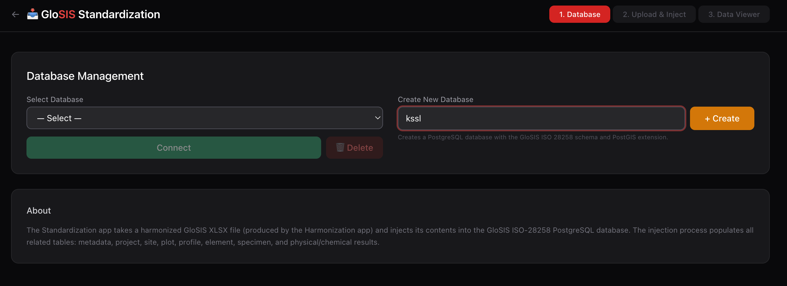
```

The module will create that specific database with tables following the database schema in the GloSIS database. Once created, select it in `Select Database` dropdown menu and press the button `Connect`. Now you are connected to your GloSIS standardized database.

:::warning-box
- The module includes a `Delete` button that permanently removes the selected database. Use this option with caution, and only if you are certain the database is no longer needed.
- If this is your first time running the Docker containers, a GloSIS PostgreSQL database may be created with an empty schema (0 tables).
  In this case:
  a) Go to the **Database** section  
  b) Remove the existing empty `glosis` database using the interface options (`Select` & `Delete`)  
  c) If you want to create a new database named `glosis`, click the `+ Create` button to build it from scratch  
:::

#### Inject the data into the created PostgreSQL database

Once connected, click the red `Upload Data` button, to open the tab for uploading the `XLSX template` previously created using the [Data harmonization](http://localhost:3000/harmonization) module (Figure \@ref(fig:etl-harmonization-metadata)). 

Then, click the red `Inject Data` button. The module will transform the data from the Excel file into the structure of the GloSIS PostgreSQL database.

You can explore the uploaded data in the `Data Viewer` tab within this module.


```{r etl-injection, echo=FALSE, out.width="100%",fig.cap = "Standardization Upload and Injection tab."}
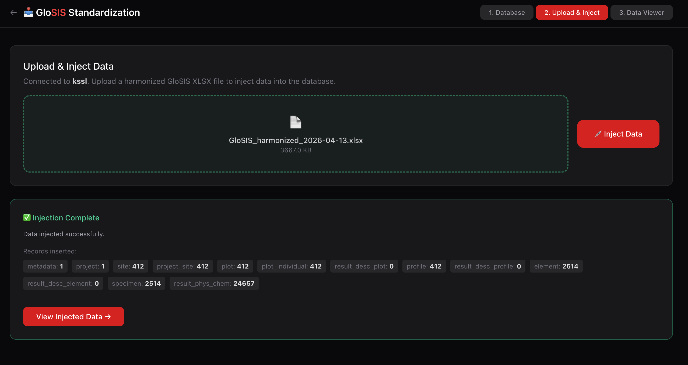
```


### Data Viewer

The [Data Viewer](http://localhost:3000/dataviewer) module provides interactive visualization of soil databases stored in the system, enabling users to validate data integrity before and after database ingestion.

Open [Data Viewer](http://localhost:3000/dataviewer) from the [ETL main menu](http://localhost:3000). Select an existing database from the list in the top right corner and click `Connect`. The Data Viewer will load the soil data, display the distribution of sampling sites on an interactive map, and preview harmonized records with filterable analytical columns. This allows users to explore the variation of soil properties with depth across soil profiles (Figure \@ref(fig:etl-viewer)).

```{r etl-viewer, echo=FALSE, out.width="100%",fig.cap = "Visualization of the KSSL data in this Manual"}
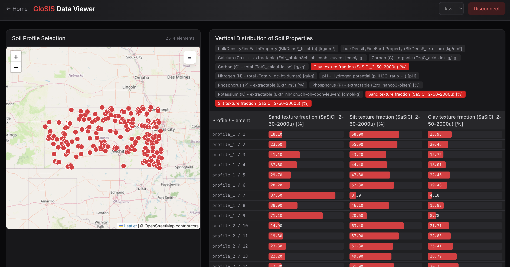
```

Users can also select a subset of soil locations, restricting the visualization to the chosen soil profiles (Figure \@ref(fig:etl-viewer2)).

```{r etl-viewer2, echo=FALSE, out.width="100%",fig.cap = "Visualization of a subset of the KSSL data in this Manual"}
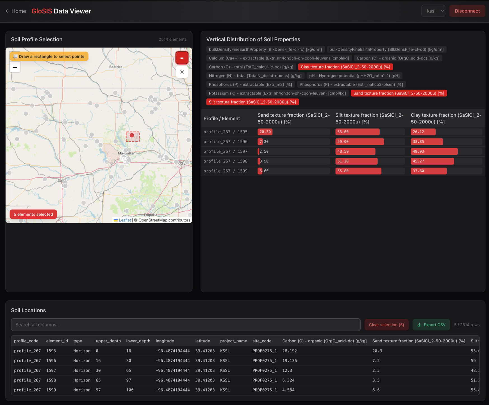
```


## Connecting PostgreSQL to QGIS

The created PostgreSQL database can be easily connected to QGIS by following these steps:

1. Open QGIS.
2. Add a New PostgreSQL connection by going to **Layer -> Add Layer -> Add PostGIS Layers**.
3. Set the Connection information in the New PostGIS Connection (Figure \@ref(fig:qgis-connection)):

```{r qgis-connection, echo=FALSE, out.width="50%", fig.align="center", fig.cap="Connection information in the New PostGIS Connection"}
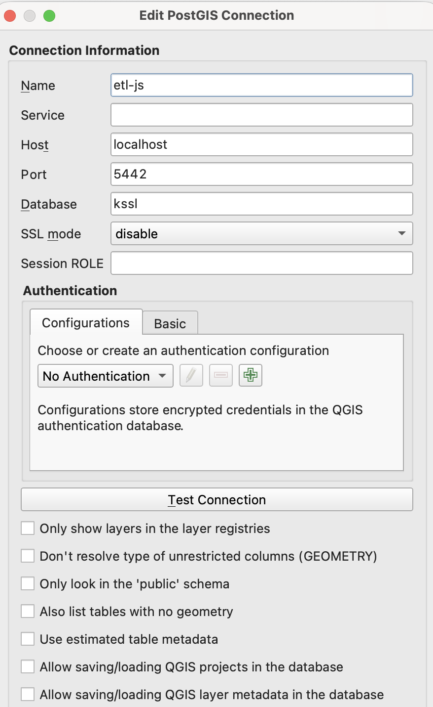
```

4. Open the database connection in the **Database Manager** by going to **Database -> Database Manager -> Providers -> PostGIS -> etl-js** and double-click to connect (Figure \@ref(fig:qgis-dbmanager)).

```{r qgis-dbmanager, echo=FALSE, out.width="100%",fig.cap = "Open Connection in DB Manager"}
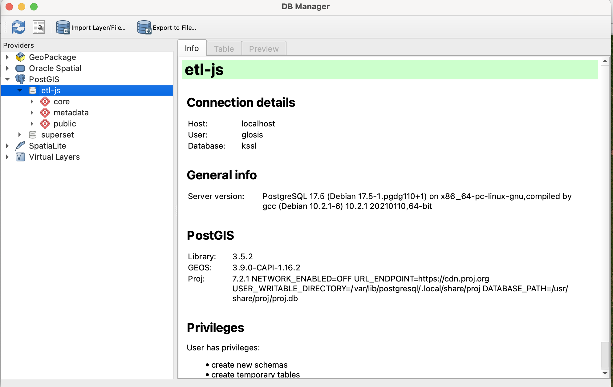
```

5. Go to **Database -> SQL Window**.

In this window, type the query below and Execute the code:

```sql
SELECT 
  r.result_phys_chem_id AS gid,
  p.name,
  s.site_id,
  p3.profile_id, 
  e.element_id,
  e.upper_depth,
  e.lower_depth,
  r.specimen_id,
  o.property_phys_chem_id,
  o.procedure_phys_chem_id,
  r.value,
  o.unit_of_measure_id,
  p2."position" AS geom
FROM core.project p
LEFT JOIN core.site_project sp ON sp.project_id = p.project_id
LEFT JOIN core.site s ON s.site_id = sp.site_id
LEFT JOIN core.plot p2 ON p2.site_id = s.site_id
LEFT JOIN core.profile p3 ON p3.plot_id = p2.plot_id
LEFT JOIN core."element" e ON e.profile_id = p3.profile_id
LEFT JOIN core.specimen s2 ON s2.element_id = e.element_id
LEFT JOIN core.result_phys_chem r ON r.specimen_id = s2.specimen_id
LEFT JOIN core.observation_phys_chem o ON o.observation_phys_chem_id = r.observation_phys_chem_id
ORDER BY p.name, s.site_id, p3.profile_id, e.upper_depth, o.property_phys_chem_id;
```

Check on the mark on `Load as a New Layer` and click on the `Load` button (Figure \@ref(fig:qgis-dbquery)).

```{r qgis-dbquery, echo=FALSE, out.width="100%",fig.cap = "Open Connection in DB Manager"}
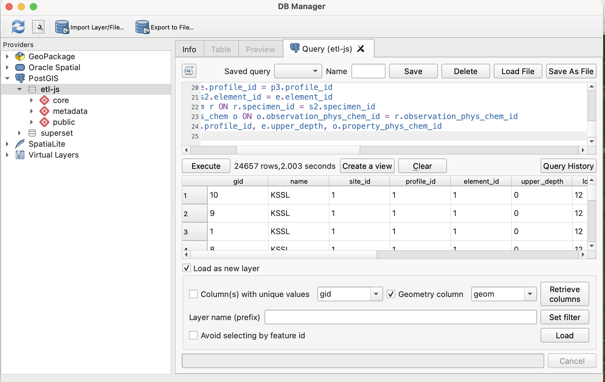
```

A layer named `QueryLayer` will appear in the Layers Panel in QGIS (Figure \@ref(fig:qgis-querylayer)).

```{r qgis-querylayer, echo=FALSE, out.width="100%",fig.cap = "Sampling Points in QueryLayer"}
knitr::include_graphics("images/module4/qgis_out.png")
```

This layer contains point data from the cleaned `kssl` database in *long* format, where each row represents a single observation of a soil property measured at a specific site, profile, depth interval, and specimen. The columns describe the context of each observation (e.g., site, profile, element, and depth), along with the measured property, the analytical method used, the observed value, and its unit of measurement.

```{r qgis-long, echo=FALSE, out.width="100%",fig.cap = "QueryLayer Table in long format"}
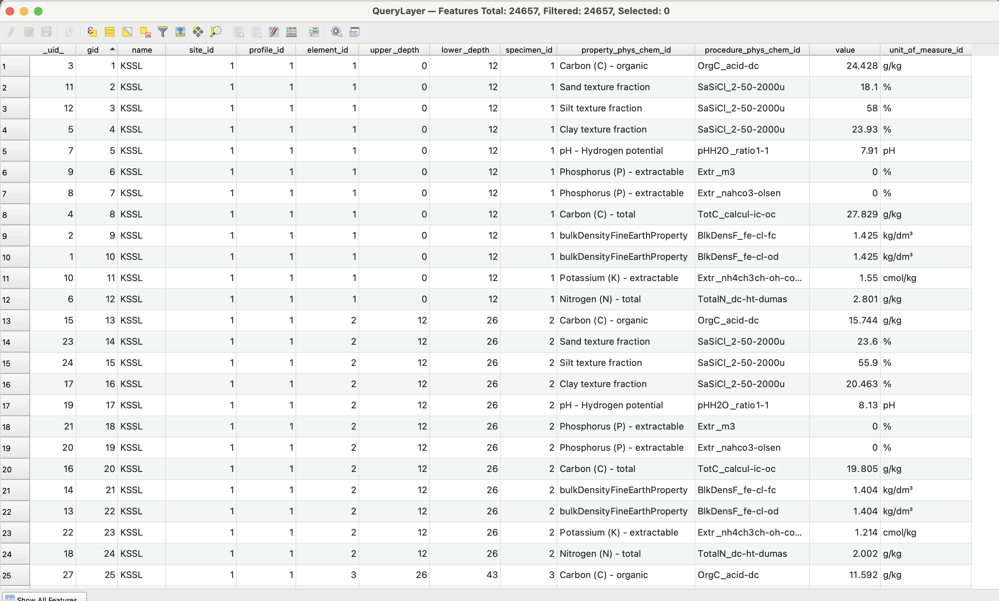
```

## Connecting PostgreSQL to R

The PostgreSQL GloSIS database can be connected to R using appropriate packages and SQL queries.

In this section, the `kssl` database is accessed from R, and the results are exported as a GeoPackage. This format is used because it preserves full column names, allowing soil analytical properties and their units of measurement to remain clearly described in the output.

The resulting file is saved in `03_outputs/module3/` and can be directly loaded into GIS software such as QGIS for further visualization and analysis.

```{r postgres-2-R, eval=FALSE}
# =========================================================
# Load packages
# =========================================================
library(DBI)
library(RPostgres)
library(dplyr)
library(tidyr)
library(sf)

# =========================================================
# Connect to the PostgreSQL database
# =========================================================
# This connection uses the database exposed on localhost:5442,
# which is the port mapped from the Docker PostgreSQL container.
con <- dbConnect(
  RPostgres::Postgres(),
  dbname   = "kssl",
  host     = "localhost",
  port     = 5442,
  user     = "glosis",
  password = "glosis"
)

# =========================================================
# SQL Query 1: retrieve soil point / profile / horizon metadata
# =========================================================
# This query extracts the structural information for each soil specimen:
# - project and site identifiers
# - plot and profile identifiers
# - horizon/element depth information
# - specimen code
# - longitude and latitude from the plot geometry

query_points <- "
SELECT
  p.project_id,
  p.name AS project_name,
  s.site_id,
  s.site_code,
  pl.plot_id,
  pf.profile_id,
  e.element_id,
  e.order_element,
  e.upper_depth,
  e.lower_depth,
  e.type,
  sp.specimen_id,
  sp.code AS specimen_code,
  ST_X(pl.position::geometry) AS longitude,
  ST_Y(pl.position::geometry) AS latitude
FROM core.project p
JOIN core.project_site ps
  ON ps.project_id = p.project_id
JOIN core.site s
  ON s.site_id = ps.site_id
JOIN core.plot pl
  ON pl.site_id = s.site_id
JOIN core.profile pf
  ON pf.plot_id = pl.plot_id
JOIN core.element e
  ON e.profile_id = pf.profile_id
JOIN core.specimen sp
  ON sp.element_id = e.element_id
ORDER BY
  p.name,
  s.site_id,
  pf.profile_id,
  e.order_element,
  e.upper_depth
"

# =========================================================
# SQL Query 2: retrieve laboratory soil properties
# =========================================================
# This query extracts the measured physico-chemical properties
# linked to each specimen, including:
# - property identifier
# - analytical procedure
# - unit of measure
# - observed value

query_properties <- "
SELECT
  p.name AS project_name,
  s.site_code,
  sp.specimen_id,
  sp.code AS specimen_code,
  r.result_phys_chem_id,
  o.observation_phys_chem_id,
  o.property_phys_chem_id,
  o.procedure_phys_chem_id,
  o.unit_of_measure_id,
  r.value
FROM core.result_phys_chem r
JOIN core.specimen sp
  ON r.specimen_id = sp.specimen_id
JOIN core.element e
  ON sp.element_id = e.element_id
JOIN core.profile pf
  ON e.profile_id = pf.profile_id
JOIN core.plot pl
  ON pf.plot_id = pl.plot_id
JOIN core.site s
  ON pl.site_id = s.site_id
JOIN core.project_site ps
  ON s.site_id = ps.site_id
JOIN core.project p
  ON ps.project_id = p.project_id
JOIN core.observation_phys_chem o
  ON o.observation_phys_chem_id = r.observation_phys_chem_id
ORDER BY
  p.name,
  s.site_code,
  sp.specimen_id,
  o.property_phys_chem_id
"

# =========================================================
# Execute the SQL queries and store results in R objects
# =========================================================
soil_points <- dbGetQuery(con, query_points)
soil_properties <- dbGetQuery(con, query_properties)

# =========================================================
# Convert soil properties from long to wide format
# =========================================================
# A new field called 'property_unit' is created by concatenating:
# - property_phys_chem_id
# - unit_of_measure_id
#
# This ensures that each output column clearly represents both
# the property and its measurement unit.
#
# Then the table is grouped by specimen and reshaped to wide format so that:
# - each row corresponds to one specimen
# - each property becomes a separate column
soil_properties <- soil_properties %>%
  mutate(
    property_unit = paste0(property_phys_chem_id, "_", unit_of_measure_id)
  ) %>%
  group_by(project_name, site_code, specimen_id, specimen_code, property_unit) %>%
  summarise(value = mean(value, na.rm = TRUE), .groups = "drop") %>%
  pivot_wider(
    names_from = property_unit,
    values_from = value
  )

# =========================================================
# Join specimen metadata with laboratory properties
# =========================================================
# The project name is removed from the properties table before joining
# to avoid duplicated columns such as project_name.x / project_name.y.
#
# The join is performed using:
# - site_code
# - specimen_id
# - specimen_code
soil_points_with_properties <- soil_points %>%
  left_join(
    soil_properties %>% select(-project_name),
    by = c("site_code", "specimen_id", "specimen_code")
  )

# =========================================================
# Convert the final table to an sf spatial object
# =========================================================
# Longitude and latitude are used to create point geometries.
# The coordinate reference system is WGS84 (EPSG:4326).
soil_points_sf <- st_as_sf(
  soil_points_with_properties,
  coords = c("longitude", "latitude"),
  crs = 4326
)

# =========================================================
# Export the spatial dataset to a GeoPackage file
# =========================================================
# GeoPackage is used instead of Shapefile because it preserves:
# - full column names
# - special characters
# - a larger number of fields
st_write(
  soil_points_sf,
  "03_outputs/module3/kssl_points_with_properties.gpkg",
  delete_dsn = TRUE
)

# =========================================================
# Optional: close the database connection when finished
# =========================================================
dbDisconnect(con)
```
