# Soil Data Sharing and Dissemination

## Introduction

For more than a century, tremendous resources and scientific effort have been invested in collecting and analysing soil information across the globe [@ARROUAYS20172]. These data collection efforts---conducted through national soil surveys, research institutions, agricultural programmes, and environmental monitoring initiatives---represent one of the most comprehensive scientific data compilation worldwide. This data, often referred to as legacy data, holds extraordinary potential with applications spanning food security, climate change mitigation, land degradation assessment, and sustainable land management.

However, this accumulated soil knowledge remains largely inaccessible and unusable for integrated local, regional or global analyses. The challenge is its fragmentation into thousands of isolated data repositories, each maintained independently by different organisations using their own formats, naming conventions, units of measurement, and analytical procedures. When properly compiled, organised, and standardised, historical soil surveys can serve as basic input or validation data for Digital Soil Mapping activities [@Medeiros24]. However, realising this potential requires solving the fragmentation problem through systematic standardisation.

In 2012, FAO formally established the Global Soil Partnership (GSP) to coordinate international efforts in soil governance and soil science. Within this framework, GSP mandated the International Network for Soil Information Institutions (INSII) to develop and implement GloSIS, the Global Soil Information System. Rather than attempting to centralise all soil data into a single organisation or location, GloSIS functions as a decentralised spatial data infrastructure that enables soil data management and sharing within a global standardisation framework. National soil institutes, research organisations, and other data holders maintain control of their data in their own systems, but contribute that data following standardised formats and protocols for data preparation and sharing.

Making soil data usable, however, is not only about preparing it once. It is about keeping it **online, discoverable, and ready to use** by others---both the point observations gathered in the field and laboratory, and the maps derived from them. This is the role of a **Soil Information System (SIS)**: a web-based platform that allows soil scientists to publish their own data on the internet, describe it properly so that others can find and trust it, and visualise it together with data from other providers.

In this module we focus on the SIS from the point of view of a soil scientist who has data to share. You will learn what the SIS is, how it standardises and shares your data so that it can take part in the wider GloSIS federation, and---step by step---how to use the SIS web application to:

- publish **soil profile (point) data** from a CSV file;
- publish the **raster maps** you produce from soil observations and environmental covariates (the production of these maps is covered in the Digital Soil Mapping module);
- explore your data in the built-in map viewer;
- combine existing maps into new ones with the **Raster Calculator**.

No programming is required to use the SIS---it is operated entirely through a web browser.

## The Soil Information System (SIS)

### What is a Spatial Data Infrastructure?

A **Spatial Data Infrastructure (SDI)** is the combination of technology, standards, and agreements that lets people *share geographic data over the internet* in a consistent way. Instead of e-mailing files back and forth, an SDI publishes data through standard web services, so that any compatible application---a web map, a desktop GIS such as QGIS, or another institution's platform---can connect to the same data and use it directly.

The SIS is an SDI specialised for soil information. It brings together, in one place and in a comparable form, the two kinds of products soil scientists generate:

- **Soil profiles (point data)** --- georeferenced observations of soil properties measured at specific sampling locations and depths.
- **Raster maps (gridded data)** --- continuous surfaces, typically produced by Digital Soil Mapping, that predict a soil property across an area from soil observations and environmental covariates.

### What the SIS lets you do

As a soil scientist, the SIS gives you a place to:

- **Publish** your soil profiles and maps online, with a few clicks and without writing any code;
- **Describe** each dataset with proper metadata (who produced it, when, under which licence, covering which area and period) so that others can find it and cite it correctly;
- **Visualise** your data on an interactive map, together with data from other providers;
- **Control** what is shared---each dataset can be kept private or published, and sensitive sampling coordinates can be slightly blurred to protect data providers;
- **Reuse** the data through open standards, both inside the SIS and from external GIS software.

### Standardisation

When you publish data, the SIS **standardises** it---it makes sure that every soil property and every laboratory procedure is referred to by the right, internationally agreed name. As you describe your data, you point each measured property and method to an entry in the **GloSIS codelists**, the shared vocabularies for soil properties and laboratory procedures.

For example, a column of pH measured in water is linked to the codelist entry that identifies it precisely as *pH in water*, distinct from *pH in KCl*. The SIS does not alter your measurements; it ensures they are labelled correctly. Because every dataset in the SIS is described with these same terms, data from different providers and different countries can be compared directly and combined with confidence.

> The GloSIS codelists for soil properties and laboratory procedures are published openly at <https://github.com/glosis-ld/glosis>.

::: {.highlights}
- You publish soil **profiles (points)** and **maps (rasters)**.
- The SIS keeps them online, described, and ready to be reused.
- Everything is done from a web browser---no installation, no code.
:::

## A node in the GloSIS federation {#glosis-node}

The SIS is not meant to be an island. It is designed to act as a **node** in **GloSIS**, the Global Soil Information System---a *federation* in which each participating institution or country runs its own SIS and keeps full control of its own data, while all nodes can still be searched and used together as if they were one. Your data stays with you; what is shared is access to it, in a common form.

Two things make this federation possible, and both happen automatically when you publish your data:

- **A common vocabulary.** Because every SIS describes soil data using the same GloSIS codelists for soil properties and laboratory procedures, a value published in one node means exactly the same thing in every other node.
- **Common ways of sharing.** The SIS publishes data through open standards from the **Open Geospatial Consortium (OGC)**: maps are served so they can be **viewed** anywhere (Web Map Service, WMS), datasets are described so they can be **discovered** (Catalog Service for the Web, CSW), and soil profiles are **served** through the SIS data service. Any compatible system---another SIS node, or standard GIS software---can connect to that data without special arrangements.

You do not need to operate any of this yourself. Simply by publishing your profiles and maps as described below, you make your data ready to take its place in the wider GloSIS federation.

## Getting started: accessing the SIS

### The map viewer

The map viewer (Figure \@ref(fig:sis-viewer)) displays the published soil data on an interactive map: soil profiles appear as points (grouped into clusters when you zoom out), and raster maps appear as image layers you can switch on and off. From here you can pan and zoom, choose a base map, change layer transparency, click a profile to see its details, or click a raster to read the predicted value at that location.

```{r sis-viewer, echo=FALSE, out.width="100%", fig.cap="The SIS map viewer, showing soil profiles and a raster layer."}
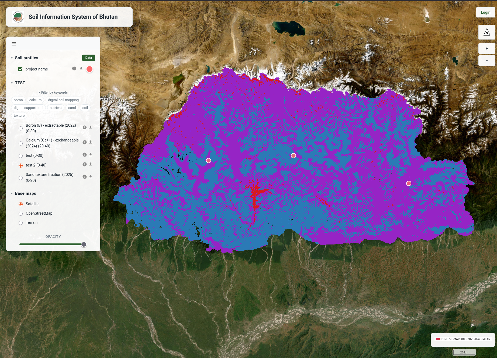
```

### The Admin Panel

Publishing data is done from the **Login/Admin Panel**. Click the **Login/Admin Panel** button on the map viewer and sign in with the credentials provided by your administrator (Figure \@ref(fig:sis-admin-login)).

```{r sis-admin-login, echo=FALSE, out.width="100%", fig.cap="Accessing the Admin Panel."}
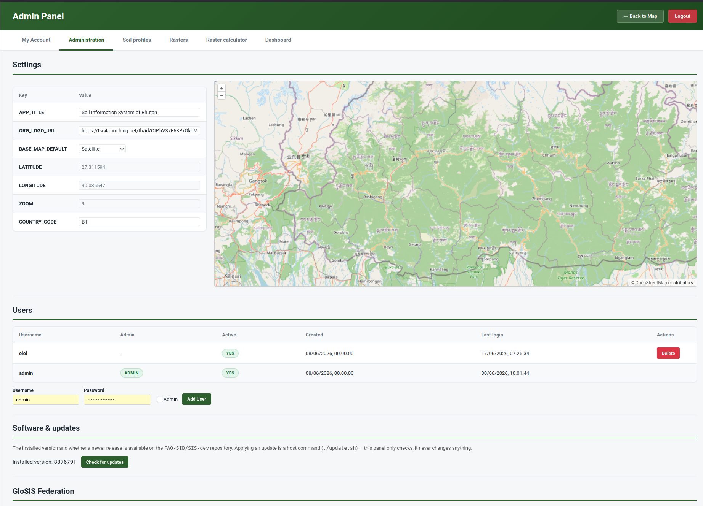
```

The Admin Panel is organised into six tabs:

| Tab | What it is for |
|:------------------|:----------------------------------------------|
| **My account** | Change your own username and password |
| **Administration** | Manage the node itself (administrators only) |
| **Soil profiles** | Upload and publish soil profile (point) data from a CSV file |
| **Rasters** | Upload and publish raster maps (GeoTIFF) |
| **Raster calculator** | Combine existing rasters into new maps |
| **Dashboard** | An overview of the data held on the node |

The following sections describe each of these tabs in turn. The **Administration** tab is only visible to users with administrator rights (see *Administration*).

## My account

The **My account** tab lets you manage your own sign-in details (Figure \@ref(fig:sis-account)). You can change your **username** and **password**; your current password is always required to confirm a change, and any field left blank is kept unchanged.

```{r sis-account, echo=FALSE, out.width="100%", fig.cap="The My account tab, for changing your username and password."}
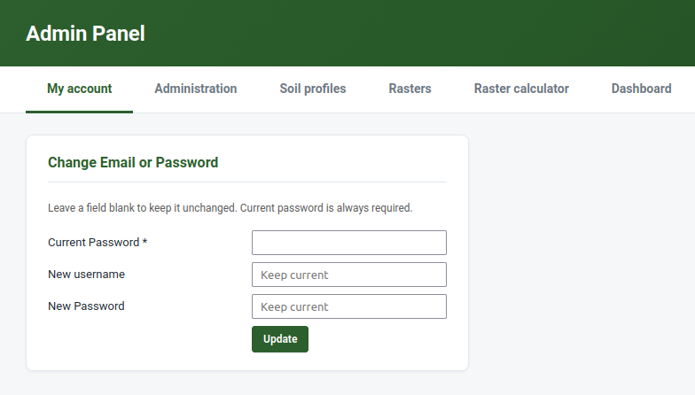
```

## Administration

The **Administration** tab is available only to users with **administrator** rights, and is where the SIS node itself---rather than the data in it---is managed. It brings together four areas: **Settings**, **Users**, **Software update**, and **GloSIS Federation**.

### Settings

The **Settings** area holds the node-wide options that control how the SIS looks and behaves, shown as a simple table of keys and values. From here an administrator can, for example, set the **default map view**---the area and zoom level the map viewer opens on---using the accompanying map. A change made here takes effect for everyone who uses the node.

### Users

The **Users** area manages the accounts that can sign in to the Admin Panel. The table lists each user---username, whether they are an **administrator**, whether the account is **active**, and the dates created and last logged in. An administrator can **add a user** (username and password, optionally with administrator rights) and edit or deactivate existing accounts. Only administrators can see this area or grant administrator rights to others.

### Software update

The **Software update** area shows the **installed version** of the SIS and lets an administrator **check for updates** against the project's software repository. It is purely informational: it tells you whether a newer release is available but does not change anything---applying an update is done on the server by whoever maintains the installation, not from the web interface.

### GloSIS Federation

Taking part in the federation through common vocabularies and standards (see Section \@ref(glosis-node)) happens automatically as you publish. Connecting your node to the *global* GloSIS Federation---so that the GloSIS Discovery Hub and other nodes can find and query it---is a deliberate, one-time step carried out by the node administrator. It is **switched off by default**: a node never exposes itself to the federation until someone chooses to.

To enable it:

1. Sign in to the SIS as an **administrator**.
2. Open **Administration → GloSIS Federation** (Figure \@ref(fig:sis-glosis-federation)).
3. Click **Enable**. The node issues a **federation token** (shown on the same panel) and opens a small set of **read-only** endpoints---a *manifest* of what the node holds, its *soil profiles*, and their *observations*.
4. Provide that token and the endpoint addresses to the **GloSIS Discovery Hub**, which registers your node as part of the federation.

```{r sis-glosis-federation, echo=FALSE, out.width="100%", fig.cap="The Administration → GloSIS Federation panel, where federation access is enabled and the federation token is shown."}
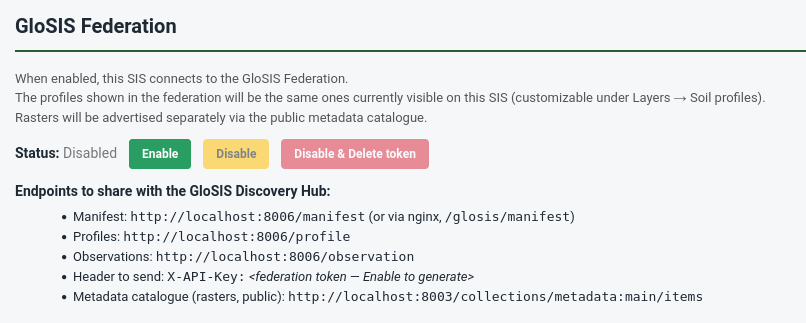
```

What is shared is exactly the **soil profiles currently published** on your node (those visible under *Layers → Soil profiles*)---nothing else can be read, and nothing can be written. Your **raster maps** are not part of this feed; they are already shared separately through the metadata catalogue and the map service.

You can click **Disable** at any time to stop sharing while keeping the token, or **Disable & delete token** to revoke access entirely and force a new token the next time federation is enabled.

::: {.highlights}
- Federation access is **opt-in** and **read-only**---you stay in full control of your data.
- Only your **published soil profiles** are exposed; rasters are shared via the catalogue and map service.
- Enabling it registers your SIS as a node that others can discover and query through the GloSIS Discovery Hub.
:::

## Publishing soil profile data from a CSV

Soil profile data is published from the **Soil profiles** tab of the Admin Panel. The SIS reads a single **CSV file** in which each row is a soil sample (a depth layer of a profile) and each column is an attribute---an identifier, a coordinate, a depth, or a measured property. A good starting point is the cleaned dataset produced earlier in this manual (for example, the `KSSL_cleaned.csv` file from the Soil Data Preparation module).

::: {.warning-box}
The CSV can contain up to **200,000 data rows** and be at most **50 MB**. Larger datasets should be split before uploading.
:::

The workflow has five steps, all on the same page.

### Step 1 --- Upload the CSV file

In the **Soil profiles** tab, open the **Upload CSV** section, click the file selector, choose your `.csv` file, and press **Upload CSV** (Figure \@ref(fig:sis-profile-upload)). The file is uploaded to a temporary working area; nothing is published yet.

```{r sis-profile-upload, echo=FALSE, out.width="100%", fig.cap="Step 1: Selecting and uploading the CSV file."}
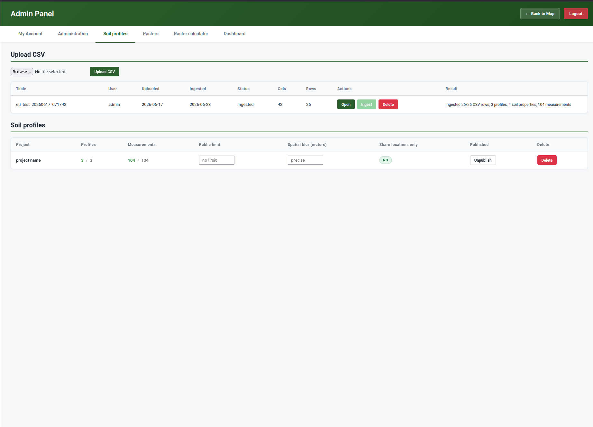
```

### Step 2 --- Preview the data

Once uploaded, expand the **preview** to check that the file was read correctly---that columns are separated properly and values look as expected (Figure \@ref(fig:sis-profile-preview-metadata)). Use the **Previous** / **Next** buttons to page through the rows. This is the moment to catch obvious problems (wrong separator, shifted columns) before going further.

### Step 3 --- Describe the dataset (metadata)

Next, describe the dataset so that others can understand and cite it (Figure \@ref(fig:sis-profile-preview-metadata)):

- **Project** --- select the project this data belongs to, or create one with **+ Add new project…**.
- **Abstract** --- a short description of the dataset.
- **Licence** --- the terms under which you share the data (e.g. CC BY, CC BY-SA, CC BY-NC, CC0).
- **EPSG code** --- the coordinate reference system of your coordinates. The default is **4326** (WGS84, decimal degrees), which is recommended.
- **Authors** --- the organisation(s) and people responsible, with their role. You can add new organisations and individuals inline.

```{r sis-profile-preview-metadata, echo=FALSE, out.width="100%", fig.cap="Steps 2 and 3: previewing the uploaded data and describing it with metadata."}
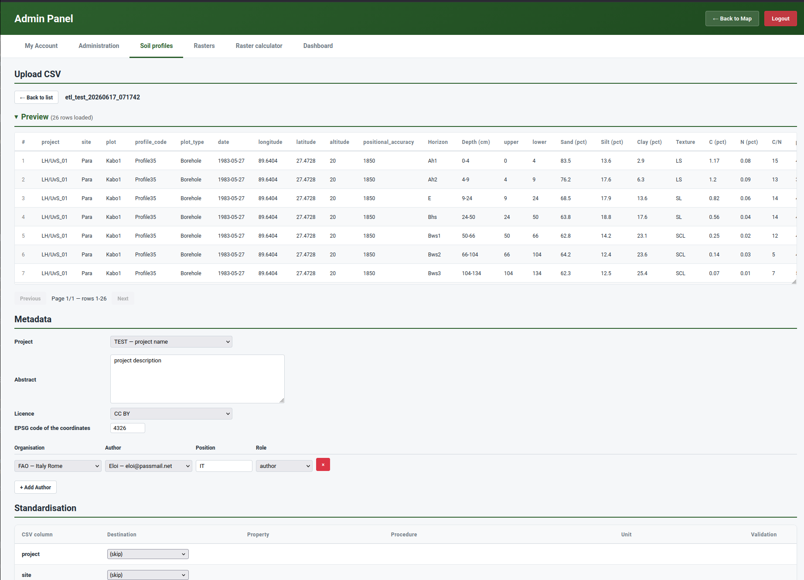
```

### Step 4 --- Standardise your columns

The SIS now needs to know **what each column of your CSV means**. In the **standardisation** table, each row corresponds to one column of your file, and you assign it a **destination** in the soil data model (Figure \@ref(fig:sis-profile-standardisation)). The essential destinations are:

| Your column holds… | Destination | Notes |
|:--------------------|:------------------------|:----------------------------|
| Profile / sample identifier | Profile code | Rows sharing a code are merged into one profile |
| Longitude (X) | Coordinate | Decimal degrees, −180 to 180 |
| Latitude (Y) | Coordinate | Decimal degrees, −90 to 90 |
| Sampling date | Sampling date | Format `YYYY-MM-DD` |
| Upper depth | Element upper depth | Whole cm, top of the layer |
| Lower depth | Element lower depth | Whole cm, must be greater than the upper depth |
| A measured soil property | Result value | Choose the property, analytical procedure and unit |

For each measured property, you also indicate its **GloSIS property, analytical procedure, and unit of measurement**. If your values are reported in a different unit, the SIS converts them to the standard unit automatically. Optional destinations include plot type (e.g. *TrialPit*, *Borehole*), altitude, positional accuracy, and horizon designation.

```{r sis-profile-standardisation, echo=FALSE, out.width="100%", fig.cap="Step 4: standardising the CSV columns against the soil data model."}
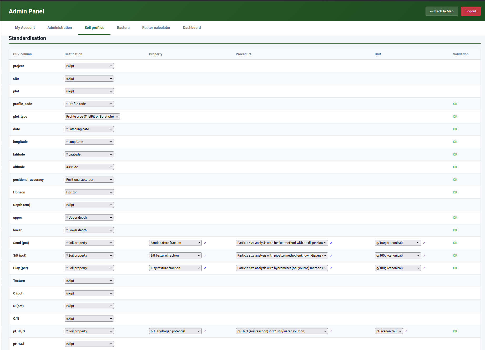
```

### Step 5 --- Validate and ingest

Before the data is stored, press **Validate**. The SIS runs a series of quality checks and reports any problems per column (Figure \@ref(fig:sis-profile-validate)):

- **Coordinates** fall within valid ranges, and at least 95% of the points lie within the expected country boundary;
- **Depths** are whole numbers, the upper depth is smaller than the lower depth, and layers within a profile are contiguous;
- **Property values** fall within scientifically plausible ranges for each property (out-of-range values are flagged as potential outliers).

Use **Save** to keep your metadata and standardisation settings. When validation passes, **ingest** the data: the SIS writes the profiles, elements (layers), and measured results into the database, and your points become available in the map viewer.

```{r sis-profile-validate, echo=FALSE, out.width="100%", fig.cap="Step 5: Validation report before ingestion."}
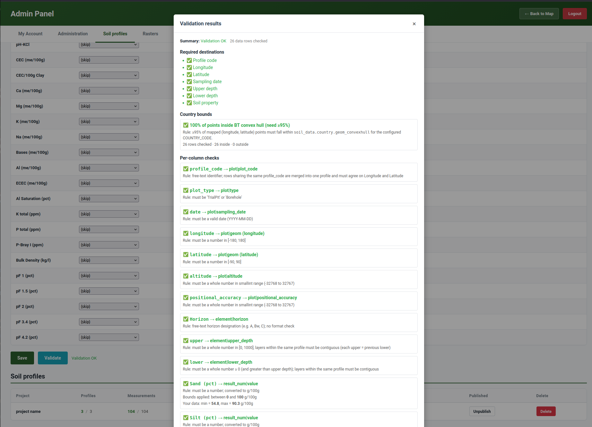
```

::: {.warning-box}
- Correct any **critical issues** (invalid coordinates, impossible depths) before ingesting.
- **Warnings** (e.g. unusual property values) should be reviewed; you may proceed if the values are scientifically justified.
- Each upload is tagged with the source file name, so a dataset can be re-uploaded or removed cleanly later.
:::

## Publishing raster maps

Raster maps---the gridded predictions you produce by Digital Soil Mapping---are published from the **Rasters** tab of the Admin Panel. The SIS accepts a single **GeoTIFF** file (`.tif` / `.tiff`) per upload and publishes it so that it can be viewed in the SIS (and in standard GIS software) and, if you wish, described in the catalogue so others can find it.

Open the **Upload GeoTIFF** section and complete the form (the steps below correspond to the sections of that form).

### Step 1 --- Select the GeoTIFF

Choose your `.tif` or `.tiff` file. The raster must be properly georeferenced; the SIS reads its spatial extent and coordinate system directly from the file. The whole upload form is shown in Figure \@ref(fig:sis-raster-form).

### Step 2 --- Location and project

Select the **Country** the map covers and the **Project** it belongs to (or create a new project inline; a new project needs a short ID, a name, and a description).

### Step 3 --- Soil property and units

Indicate which **soil property** the map represents (for example, soil organic carbon), choosing from the list or adding a new property. The **unit of measurement** is offered automatically based on the property. This is what allows the map to be compared and combined with others consistently.

### Step 4 --- Dates, depth and statistics

Document the temporal and vertical context of the map:

- **Created on** --- the date the map was produced (`YYYY-MM-DD`).
- **Period start** / **Period end** --- the oldest and most recent dates of the data used to produce the map.
- **Depth** --- the soil depth interval the map refers to (upper and lower, in cm).
- **Statistics** --- what the pixel values represent: **MEAN** (the prediction), **SDEV** (its standard deviation), or **UNCT** (uncertainty).

### Step 5 --- Licence, catalogue and authors

Choose a **licence** for the map, decide whether to **publish it to the catalogue** (the checkbox is ticked by default, so the map can be found by others), and list the **authors** (organisation, person, and role), exactly as for profile data.

### Step 6 --- Review and upload

The form shows a preview of the **generated file name** that the map will be stored under, built from the information you provided. Review the entries and press **Upload** (Figure \@ref(fig:sis-raster-form)). The SIS first inspects the GeoTIFF to confirm it is valid, then registers and publishes it. Once finished, the map is available as a layer in the map viewer and, if you chose to, as a record in the catalogue.

```{r sis-raster-form, echo=FALSE, out.width="100%", fig.cap="The Upload GeoTIFF form, where the raster map and its metadata are entered together."}
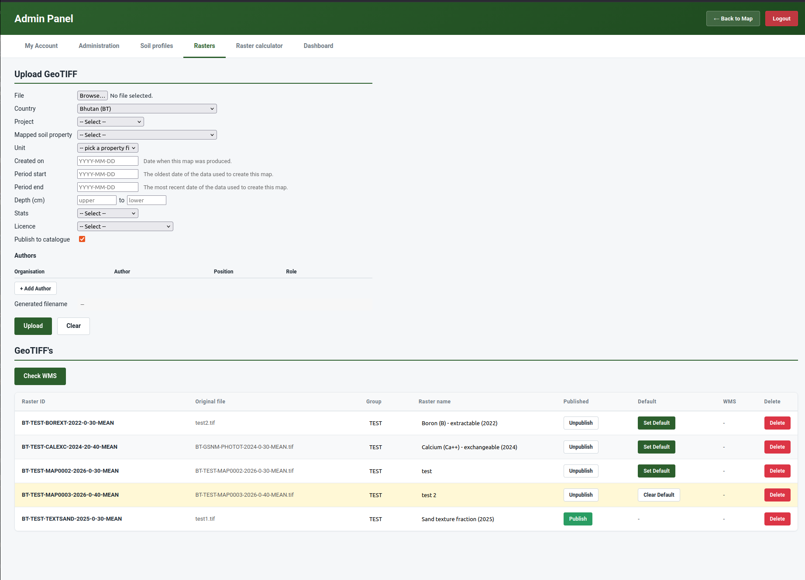
```

::: {.highlights}
Once uploaded, your map can be **viewed** in the SIS (and in any compatible GIS) and, if you ticked *Publish to catalogue*, can also be **discovered** by others---in your own SIS and across the GloSIS federation.
:::

## The Raster Calculator

The **Raster Calculator** (found under the **Raster calculator** tab of the Admin Panel) lets you create a **new map by combining existing ones**, without leaving the SIS. It is well suited to rule-based analyses such as land **suitability**: for example, combining maps of pH, organic carbon, and depth into a single suitability map.

The calculator works with **recipes**. A recipe is a saved set of rules that takes one or more published rasters as input and produces a new raster as output. Each input is scored using a simple **threshold rule**, and the scores are combined into the result.

### Creating a recipe

In the **Raster calculator** tab, the existing recipes are listed with their status and last run. Click **+ New Recipe** to open the editor (Figure \@ref(fig:sis-raster-calculator-recipe)). Choose the **Project** (default *DST*) and the **mapped property** of the output (default *SUITABILITY*), or add new ones inline. The SIS proposes a recipe identifier and description automatically.

### Adding input layers and thresholds

Click **+ Add layer** to add an input row, then for each row (Figure \@ref(fig:sis-raster-calculator-recipe)):

- pick a **Layer** from the published rasters (its **Min** and **Max** are shown to guide you);
- set a **Threshold**---the cut-off value that splits the layer;
- set the **Above** score (given to pixels at or above the threshold) and the **Below** score (given to pixels below it). The defaults are **1** and **0**, which you can change for custom scoring.

In other words, each input map is reclassified into scores by its threshold, and the SIS then aggregates the scored inputs into the output map. Add as many input layers as your rule requires; remove a row with its delete button.

### Running the recipe

Press **Run** to execute the recipe (Figure \@ref(fig:sis-raster-calculator-recipe)). The calculation runs in the background; the recipe list shows its status (queued, running, completed, or failed) and the time of the last run. When it completes, the result is registered as a **new raster layer**---available in the map viewer just like any uploaded map, and ready to be combined again in further recipes.

```{r sis-raster-calculator-recipe, echo=FALSE, out.width="100%", fig.cap="The Raster Calculator recipe screen: the output project and property, the input-layer table with thresholds and scores, and the recipe list with its Run button and status."}
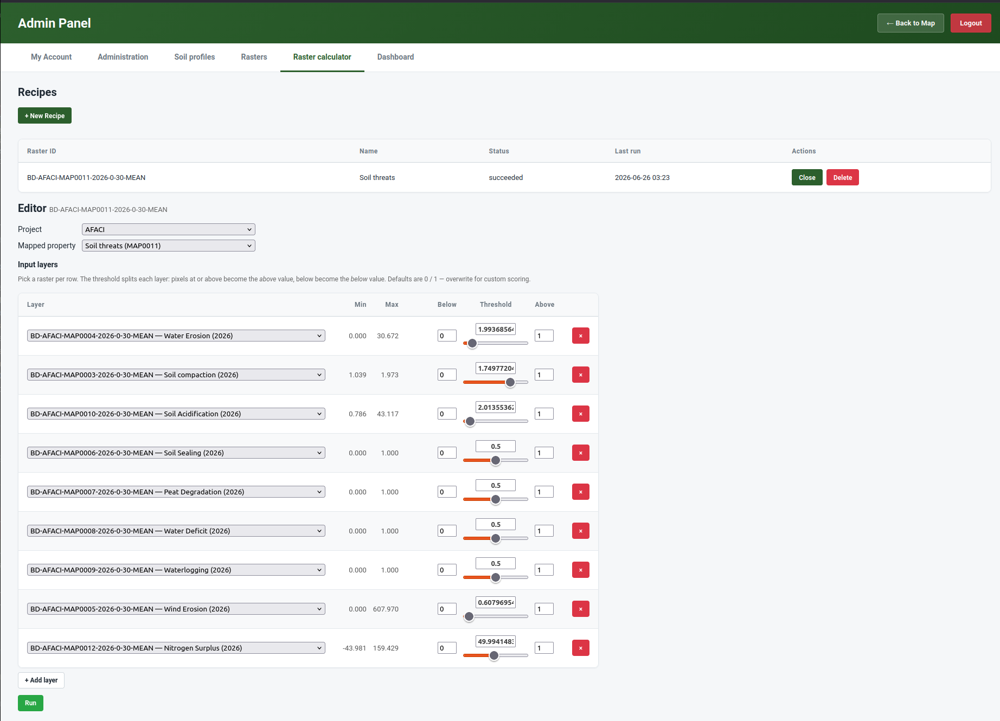
```

### Inspecting the result

Once the recipe has run, open the resulting map in the **map viewer** (see Section \@ref(explore-viewer)) and click any pixel to see how its value was built up (Figure \@ref(fig:sis-raster-calculator-result)). For that location, the SIS shows the **original value** of each input layer, the **score** each one received after being reclassified by its threshold, and the **sum** of those scores---the value of the resulting map. This makes the calculation fully transparent and easy to check.

```{r sis-raster-calculator-result, echo=FALSE, out.width="100%", fig.cap="Inspecting a pixel of the resulting map: each input layer's original value, its score after reclassification, and the sum that forms the result."}
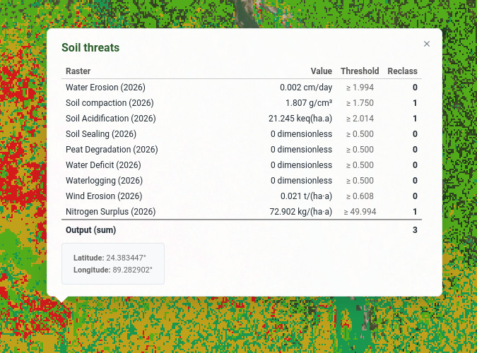
```

::: {.highlights}
- Inputs are **published rasters**; the output is a **new raster** you can view, share, or reuse.
- Each input is split by a **threshold** into *above* / *below* scores, then the scores are combined.
- Recipes are **saved and re-runnable**, so an analysis can be repeated as the underlying maps are updated.
:::

## Exploring data in the map viewer {#explore-viewer}

Once data has been published, return to the map viewer to explore it (Figure \@ref(fig:sis-explore)). From the viewer you can:

- **Toggle layers** on and off to control what is shown;
- **Change the base layer**---the background map, such as a street map, satellite imagery, or terrain;
- **Adjust transparency** of a raster to see what lies beneath it;
- **Filter the raster layers** by **keywords** drawn from each layer's metadata, to quickly find the maps you are interested in;
- **Click a soil profile** to inspect its **attribute data**---location, depths, and the analytical soil properties measured for each layer; the **Data/Hide** button shows or hides this attribute table;
- **Click a raster** to read the predicted value at that point;
- **Download a layer**---both raster maps and soil profile (point) datasets can be downloaded for use in other software;
- **View a dataset's metadata** (raster or point), presented in the standard spatial format (ISO 19115/19139), so its origin, authors, licence, spatial extent and date are clear;
- **Zoom** to spread out clustered points and inspect individual profiles.

This makes the viewer a quick way to **validate** what you have just published---confirming that points landed where expected and that maps display with sensible values---before sharing the SIS address with colleagues.

```{r sis-explore, echo=FALSE, out.width="100%", fig.cap="Exploring published profiles and maps in the SIS viewer."}
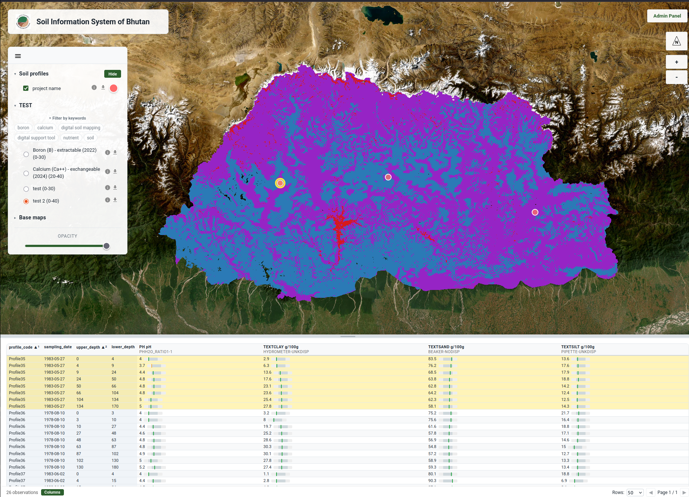
```

## Dashboard

The **Dashboard** tab gives an at-a-glance overview of everything held on the node (Figure \@ref(fig:sis-dashboard)). Summary cards show the totals---such as the number of soil profiles, rasters and projects---alongside charts that summarise the data: profiles and rasters per project, the most frequently measured soil properties, profiles sampled per year, the distribution of sampling depths, and the range of values recorded for each property. It is a quick way to understand what a node contains and to spot gaps or anomalies.

```{r sis-dashboard, echo=FALSE, out.width="100%", fig.cap="The Dashboard, summarising the soil profiles and maps held on the node."}
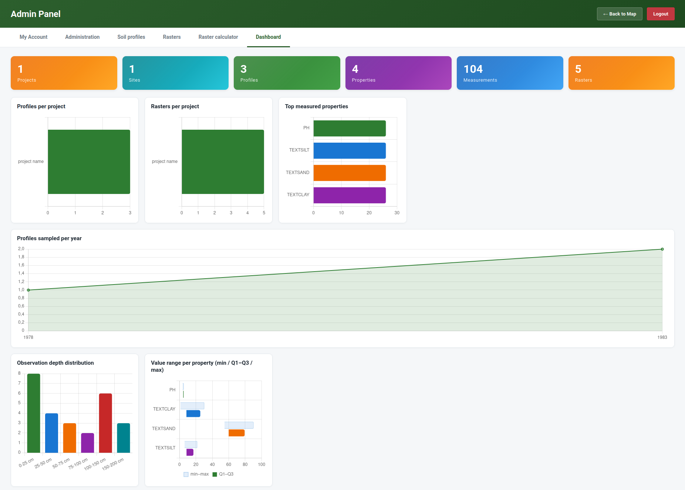
```

## Summary

In this module you have seen how the Soil Information System turns isolated soil data into a shared, discoverable, and reusable resource. As a soil scientist you can, entirely from a web browser, publish your **soil profile points** from a CSV file and your **raster maps** as GeoTIFFs, describe them with proper metadata, explore them in the map viewer, and derive new maps with the Raster Calculator. As you publish, the SIS standardises your data against the GloSIS codelists and shares it through open standards---so that the data you contribute is not only available in your own SIS, but ready to take its place as a node in the wider GloSIS federation.
