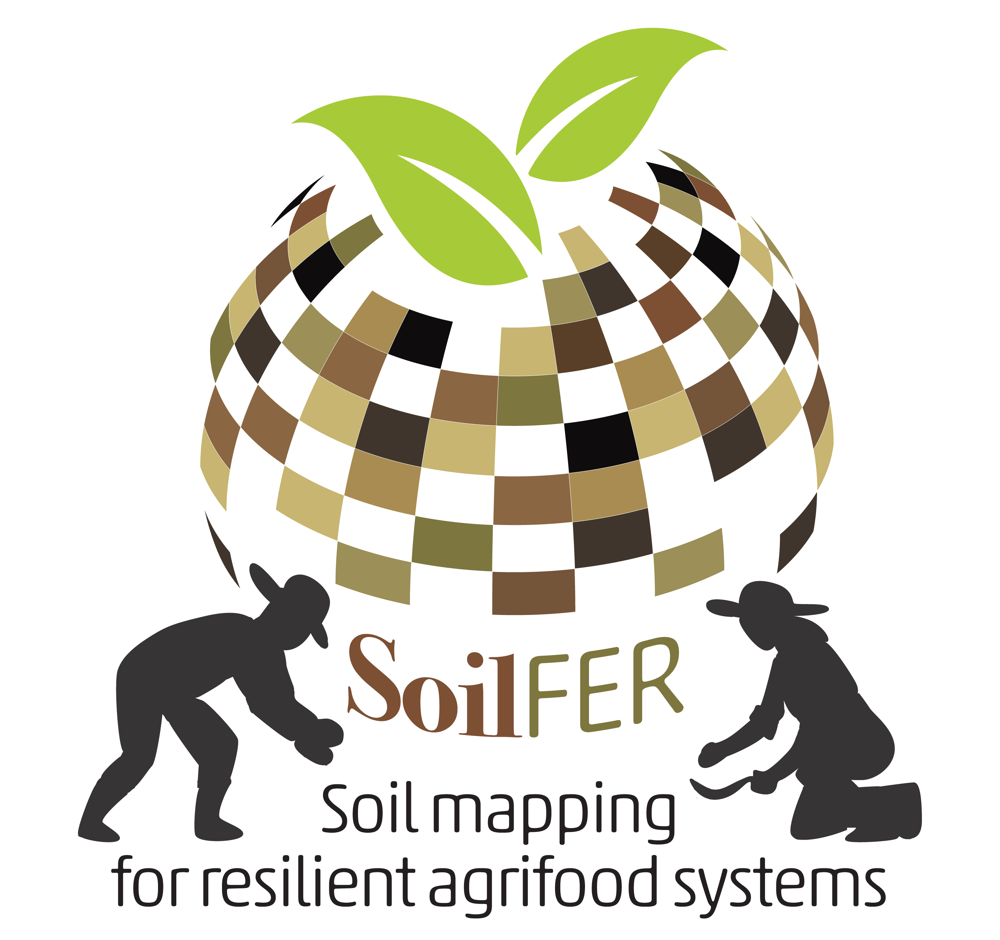
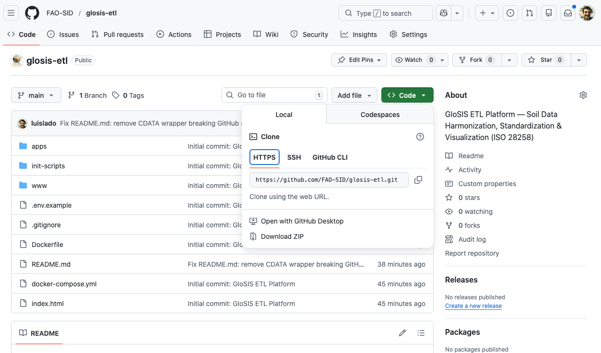
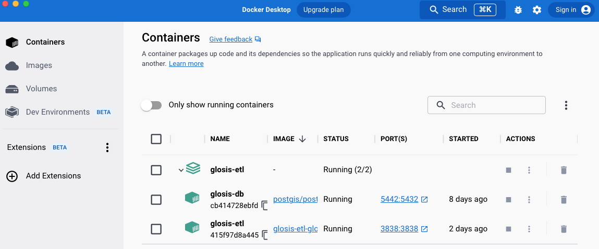

```{r set-options, echo=FALSE, cache=FALSE, warning=FALSE, message=FALSE, eval = FALSE}

options(width = 65 ,scipen=999)


library(kableExtra)


# Cache results
knitr::opts_chunk$set(cache=F,fig.pos = 'H', fig.cap = T,dev = 'jpeg')

```


\frontmatter
\addtocontents{toc}{\protect\hypersetup{hidelinks}}   
\addtocontents{lof}{\protect\hypersetup{hidelinks}}
\addtocontents{lot}{\protect\hypersetup{hidelinks}}
\addtocontents{lot}{\protect\hypersetup{hidelinks}}
\addtocontents{lot}{\protect\hypersetup{hidelinks}}
\tableofcontents
\listoffigures
\listoftables
\nopagebreak[5]


```{r, echo = F, eval = T, fig.cap = ""}

```

# Licence {-}

The Technical Manual is made available under the Creative Commons Attribution-NonCommercial-ShareAlike 3.0 IGO licence


[CC BY-NC-SA 3.0 IGO](https://creativecommons.org/licenses/by-nc-sa/3.0/igo/legalcode).


# Abbreviations and acronyms {-}
BD

:   Bulk density

CEC

:   Cation exchange capacity

CRAN

:   Comprehensive R archive network

DSM

:   Digital soil mapping 

GEE

:   Google Earth Engine

GSP

:   Global Soil Partnership

INSII

:   International Network of Soil Information Institutions

ITPS

:   Intergovernmental Technical Panel on Soils

ME

:   Mean error

MAE

:   Mean absolute error

MEC

:   Modelling efficiency coefficient

NDVI

:   Normalized difference in vegetation index

QA/QC

:   Quality assurance/quality check

RMSE

:   Root mean squared error

SOC

:   Soil organic carbon

SOM

:   Soil organic matter


# Contributors and reviewers {-}


<!--chapter:end:index.Rmd-->

# Presentation and basics {-}

##	Background and Objective {-}
Healthy and productive soils are fundamental to resilient agrifood systems, sustainable land management, and climate adaptation. Yet, in many regions, soil information remains fragmented, outdated, or inaccessible. The Soil Mapping for Resilient Agrifood Systems (SoilFER) programme responds to this challenge by building comprehensive soil information systems that integrate sampling design, laboratory analysis, soil spectroscopy, digital modeling, and decision support tools. These systems aim to empower governments, researchers, and farmers with actionable knowledge for crop selection, fertilizer recommendations, and soil health management. 

This manual, provides a step-by-step guide along the entire soil data value chain. It is designed as both a technical reference and a practical training resource, bridging the gap between raw soil data and its functional use in agricultural and environmental decision-making. 

The objectives of this manual are to: 

* Present harmonized approaches for soil sampling design used under the SoilFER programme

* Provide guidance on the integration soil spectroscopy estimated soil parameters into the digital soil mapping process

* Introduce best practices in soil data preparation and management, aligned with the Global Soil Information System (GloSIS)

* Demonstrate methods for digital soil modeling and mapping, covering classical statistics, machine learning, and hybrid inference for both continuous and categorical soil properties. 

* Explain how to generate functional soil information to support evidence-based decision-making. 

* Facilitate data sharing and dissemination, promoting open standards, metadata documentation, and web-based services. 

By integrating these components, the manual equips users to move from raw samples to reliable soil information products that inform policy, guide sustainable soil management, and strengthen food and nutrition security. 


## What this Tutorial is not {-}

::: highlights

This is not a comprehensive course on R, statistics, or modeling. Instead, it focuses on the essential skills needed to work effectively with soil data.

The main strength of this tutorial is that it provides a complete learning environment that combines lessons, hands-on examples, and assessments—with a strong emphasis on soil data workflows. The goal is to help you build practical skills in soil data management, soil sampling design, Digital Soil Mapping, and soil spectroscopy using R.

For more information, we recommend the following dedicated resources:

[R for Data Science (Grolemund & Wickham, 2017)](https://r4ds.had.co.nz/ "R for Data Science") : A free, beginner-friendly guide to doing data science with R, emphasizing best practices for reproducible and efficient analysis.

[Spatial Sampling with R (DJ Brus, 2023)](https://dickbrus.github.io/SpatialSamplingwithR/ "Spatial Sampling with R") : A practical guide to designing and analyzing spatial surveys in R, with examples and exercises for environmental and natural resource studies.

[Predictive Soil Mapping with R (Hengl & MacMillan, 2019)](https://soilmapper.org/ "Predictive Soil Mapping with R"): An introduction to statistical and machine-learning methods for producing soil property and soil class maps, with workflows and code examples in R.

[Statistics for Soil Survey (Soil Survey Staff, 2025)](https://ncss-tech.github.io/stats_for_soil_example/ "USDA Statistics for Soil Survey"): An open, R-based textbook covering core statistical methods for soil survey,  with practical examples and a strong focus on *Algorithms for Quantitative Pedology* using the`{aqp}` package.

[Spatial Data Science: With Applications in R (Pebesma & Bivand, 2023)](https://rspatial.org/ "https://r-spatial.org/book/"): Book and online materials for spatial data analysis in R, with a focus on the `{sf}` package.

[Spatial Data Science with R and 'terra'](https://rspatial.org/ "Spatial Data Science with R and 'terra'"): Online materials for spatial data analysis and modeling in R, with a focus on `{terra}`.

[What They Forgot to Teach You About R](https://rstats.wtf/): A short, practical guide with tips and workflows for working effectively in R.
:::


## The Training Dataset {-}

This manual uses the **KSSL (Kellogg Soil Survey Laboratory) soil dataset from Kansas, USA** as a comprehensive example for implementing the complete Digital Soil Mapping (DSM) workflow. The dataset provides a realistic foundation for learning DSM techniques, from inspection and cleaning of raw soil laboratory data through advanced spatial modeling and uncertainty assessment. It also demonstrates the integration of soil spectroscopy data and its application in operational DSM production.

The KSSL Kansas dataset represents a collection of laboratory-analyzed soil samples with corresponding mid-infrared spectroscopy measurements. It contains **10,352 soil horizon measurements** from **2,584 distinct soil profiles** distributed across Kansas, spanning from 37.02°N to 39.99°N latitude and -102.04°W to -94.71°W longitude. The dataset exemplifies common data quality issues encountered in soil databases, providing hands-on experience with:

- **Coordinate validation**: Geographic coordinate quality assessment and correction
- **Depth sequence validation**: Nested horizon depths requiring logical consistency checks
- **Outlier detection**: Property values spanning common feasible ranges
- **Replicate measurements**: Resolving data replicates
- **Missing values**: Strategic approach for dealing with missing values

These characteristics make the KSSL Kansas dataset an adequate example for acquiring skills in systematic data cleaning, validation, and quality assurance procedures before proceeding to spatial modeling.


### Data Structure {-}

The original dataset has been split into two data files:

**1) Site and wet chemistry data (`KSSL_data.xlsx` & `KSSL_data.csv`)**: This file includes soil location, sample identifiers, and analytical soil properties (wet chemistry).

The wet chemistry analyses include 14 soil properties commonly measured in soil survey operations. Table \@ref(tab:soil-properties) presents the complete list of available properties, their measurement units, and data completeness.

```{r table-properties, echo=FALSE, warning=FALSE, message=FALSE}
library(knitr)
library(kableExtra)

# Create soil properties table
soil_props <- data.frame(
  Category = c(
    "Carbon & Organic Matter", "",
    "Physical Properties", "", "",
    "Texture", "", "",
    "Chemical Properties", "", "",
    "Nutrients", "", "", ""
  ),
  Property = c(
    "Soil Organic Carbon", 
    "Total Carbon",
    "Bulk Density (1/3 bar)", 
    "Bulk Density (oven-dry)", 
    "pH",
    "Clay", 
    "Silt", 
    "Sand",
    "Cation Exchange Capacity", 
    "Calcium Carbonate Equivalent",
    "Potassium (exchangeable)",
    "Total Nitrogen",
    "Phosphorus (Mehlich-3)",
    "Phosphorus (Olsen)",
    ""
  ),
  Variable_Name = c(
    "SOC", "Carbon_Total",
    "Bulk.Density_1_3.BAR", "Bulk.Density_ovendry", "pH",
    "Clay", "Silt", "Sand",
    "CEC", "Calcium_Carbonate_equivalent", "Potassium",
    "Nitrogen_Total", "Phosphorus_Mehlich3", "Phosphorus_Olsen",
    ""
  ),
  Units = c(
    "% (w/w)", "% (w/w)",
    "g/cm^3", "g/cm^3", "unitless",
    "%", "%", "%",
    "cmol(+)/kg", "%", "cmol(+)/kg",
    "% (w/w)", "mg/kg", "mg/kg",
    ""
  ),
  Completeness = c(
    "100.0", "99.5",
    "60.8", "60.8", "98.9",
    "99.1", "99.1", "99.1",
    "97.1", "39.6", "85.3",
    "93.9", "38.1", "13.6",
    ""
  ),
  Notes = c(
    "Organic carbon only; excludes carbonates",
    "Includes both organic and inorganic C",
    "Measured at field capacity (1/3 bar tension)",
    "Measured after oven drying at 105 degrees C",
    "Standard soil pH (1:1 soil:water ratio)",
    "Particles < 0.002 mm",
    "Particles 0.002-0.05 mm",
    "Particles 0.05-2.0 mm (note: sum should = 100%)",
    "Nutrient retention capacity; also as meq/100g",
    "Inorganic carbon; high in western Kansas",
    "Also reported as mg/kg in some databases",
    "Used to calculate C:N ratio",
    "Multi-element extraction; common in US",
    "Bicarbonate extraction for alkaline soils",
    ""
  ),
  stringsAsFactors = FALSE
)

# Create formatted table
kable(soil_props,
      col.names = c("Category", "Property", "Variable Name", "Units", "Complete (%)", "Notes"),
      caption = "Soil properties available in the KSSL Kansas dataset",
      booktabs = TRUE,
      align = c("l", "l", "l", "l", "r", "l")) %>%
  kable_styling(
    latex_options = c("striped", "hold_position", "scale_down"),
    font_size = 9,
    full_width = FALSE
  ) %>%
  column_spec(1, bold = TRUE, width = "2.5cm") %>%
  column_spec(2, width = "3cm") %>%
  column_spec(3, width = "3cm", monospace = TRUE) %>%
  column_spec(4, width = "2cm") %>%
  column_spec(5, width = "1.5cm") %>%
  column_spec(6, width = "5cm") %>%
  collapse_rows(columns = 1, valign = "top", latex_hline = "major")
```

Some properties show strategic missing data patterns reflecting standard laboratory protocols where not all tests are performed on every sample. The varying completeness percentages reflect typical soil laboratory operations rather than random missing data:

- **Fully measured properties** (>95% complete) represent standard analyses performed on nearly all samples: organic carbon, texture, pH, and CEC
- **Selectively measured properties** (40-94% complete) reflect analyses performed when specific conditions warrant: bulk density, nitrogen, potassium, and calcium carbonate
- **Conditionally measured properties** (<40% complete) are performed only when needed

**2) Dry chemistry data (`KSSL_spec.xlsx` & `KSSL_spec.csv`)**: This file includes replicates of mid-infrared reflectance data (identified by `scan_path_name`) for each soil sample (linked via the `join_key` variable). Multiple spectral scans per horizon enable:

- Quality control through spectral replicates
- Training spectroscopy-based prediction models
- Hybrid DSM approaches combining laboratory measurements with spectral inference
- Gap-filling strategies for properties with lower completeness using spectral predictions

## How to Use This Manual {-}

This tutorial manual introduces the essential concepts of soil data management, covering the complete workflow from soil sampling design through Digital Soil Mapping (DSM) to data sharing. It is organized into 6 modules with multiple sessions each, progressing from fundamental R programming skills through advanced spatial modeling and international data standardization. The manual is designed for hands-on learning, combining conceptual explanations with practical coding exercises, real soil datasets, and spatial data workflows.


### Manual Structure {-}

Each module builds upon the previous one, creating a comprehensive learning pathway for operational DSM implementation:

---

#### **Module 1: Introduction to R and Preparation of Soil Data for Digital Soil Mapping** {-}

This module introduces R programming fundamentals for soil science applications. It consists of three sessions covering essential skills for soil data management and analysis.

**Session 1.1 - Introduction to R for Soil Science**  
Introduces the R programming environment, basic syntax, data types, operators, functions, and control structures. Participants learn to work with R objects, install and manage packages, and understand the RStudio interface. The session emphasizes practical soil science examples throughout all coding demonstrations.

**Session 1.2 - Soil Data Preparation for Digital Soil Mapping**  
Focuses on systematic soil data quality assessment and cleaning procedures essential before spatial modeling. Topics include coordinate validation, depth sequence checking, outlier detection and treatment, handling missing values, texture validation, handling duplicated data, and data harmonization techniques including depth standardization for Digital Soil Mapping products.

**Session 1.3 - Working with Spatial Data in R**  
Covers fundamental concepts of spatial data handling using `{sf}` and `{terra}` packages. Participants learn coordinate reference systems, spatial transformations, geometric operations, raster processing, data visualization and methods for extracting environmental covariate values at soil sampling locations.


---

#### **Module 2: Soil Sampling Design** {-}

This module introduces scientific sampling methodologies for soil surveys and monitoring, with particular emphasis on the SoilFER project's three-stage hierarchical hybrid sampling approach. This methodology reflects current best practices in spatial soil survey design, combining a strong statistical basis with operational feasibility for developing soil sampling designs.

**Session 2.1 - Sampling Design Fundamentals**  
Establishes the theoretical foundation for representative soil sampling through the SCORPAN model. Participants learn to optimize sample size and use Covariate Space Coverage (CSC) sampling as a method for identifying representative sampling. The session then presents the nested SoilFER three-stage hierarchical sampling framework, progressing from broad-scale Primary Sampling Units down to field-scale units.

**Session 2.2 - Practical Implementation**  
Provides hands-on training in implementing the SoilFER sampling protocol through a complete R workflow. The session guides participants through calculating minimum sample size, applying CSC sampling algorithms to identify Primary Sampling Units, generating Secondary and Tertiary Sampling Units through stratified random sampling, and establishing systematic site identification codes that maintain traceability throughout the sampling hierarchy..

---

#### **Module 3: GloSIS Data Preparation** {-}

This module covers the Global Soil Information System (GloSIS) framework and database specifications for standardizing soil data to international standards, enabling global interoperability and exchange through web services.

**Session 3.1 - Harmonization of Soil Data for GloSIS**  
Introduces the ISO-28258 standards and GloSIS database model, focusing on Features of Interest that define how soil observations are structured in the system. Participants learn to harmonize soil property units and measurement methods across different laboratory protocols using the GloSIS template, a structured spreadsheet format designed to standardize heterogeneous national datasets. The session demonstrates automated harmonization tools that convert legacy soil data into GloSIS-compliant formats, addressing common challenges such as unit conversions, classification system mapping, and quality flag assignment. This preparation ensures datasets become compatible with FAO reporting requirements and accessible through international soil information platforms.

**Session 3.2 - GloSIS Web Services and Deployment**  
Provides hands-on training in deploying the complete GloSIS software stack using Docker containerization. Participants configure a PostgreSQL database with PostGIS spatial extension for storing harmonized soil data, implement Extract-Transform-Load (ETL), establish a metadata catalog service that enables dataset discovery through standardized search protocols, and deploy web mapping interfaces for interactive spatial visualization. 

---
#### **Module 4: Digital Soil Mapping** {-}

This module provides comprehensive training in digital soil mapping (DSM) theory and practice, progressing from fundamental concepts through practical implementation using the standardized dataset produced in Module 1.

**Session 4.1 - Theoretical Foundations and Model Development**  
Introduces feature selection techniques for identifying relevant environmental information to explain spatial patterns in soil properties. The module present several machine learning algorithms predictive models  to produce raster predictions of soil properties, addresses model training, cross-validation, and quantification of the prediction uncertainties.

**Session 4.2 - Practical Implementation Workflows**  
The session provides hands-on experience building prediction models for three variable types: continuous properties such as pH using regression approaches, nominal classes representing unordered categories combining clay content and pH, and ordinal soil pH classes. Each workflow produces raster prediction maps with associated uncertainty estimates and accuracy assessments.


#### **Module 5: Soil Spectroscopy** {-}

This module introduces soil infrared spectroscopy as a rapid, cost-effective method for predicting soil properties and demonstrates its integration into DSM workflows.

**Session 5.1 - Spectroscopy Fundamentals and Calibration**  
The session introduces essential spectral data preprocessing techniques, quality control procedures and advanced chemometric modeling approaches for building spectral calibration models.

**Session 5.2 - Practical Spectroscopy Workflows**  
Provides hands-on experience processing raw spectral scans from the KSSL dataset, build calibration models for soil properties, and integrate spectral predictions into complete DSM workflows.


#### **Module 6: Soil Data Sharing** {-}

This module covers the technical and organizational aspects of making soil data discoverable, accessible, and interoperable through web services and international platforms.

**Session 6.1 - Standards, Metadata, and Interoperability**  
Introduces ISO 19115/19139 standards for creating spatial metadata that enables dataset discovery and proper documentation. The session covers deploying web services for standardized data access, establishing appropriate data licensing and data attribution. 

**Session 6.2 - Web Services Deployment**  
Demonstrates configuring web map servers for interactive soil data visualization and publishing datasets. The session provides practical training in establishing complete data sharing infrastructure, from database configuration through web service endpoints, ensuring participants can make their soil information FAIR (Findable, Accessible, Interoperable, Reusable) and contribute to global soil information systems while maintaining data quality and provenance.

---


## Required downloads {-}

All training materials are distributed across **two complementary sources**.

1. Scripts and lightweight tabular data (GitHub)

The GitHub repository contains:

- All scripts used throughout the manual  
- Lightweight tabular datasets  
- The full project folder structure, organised by module  

Download the repository as a ZIP file from:  
[https://github.com/SoilFER/SoilFER-Training-Resources](https://github.com/SoilFER/SoilFER-Training-Resources/archive/refs/heads/main.zip)

2. Large input datasets (Google Drive)

The Google Drive folder contains files that are too large to be hosted on GitHub, including:

- Raster covariates and maps  
- Large spectral datasets  
- Other supporting input data used in selected modules  

Download the data from:  
[https://drive.google.com/drive/folders/1K7tq9zX5HsqbqWcNoT27WtfPtehcKBCu](https://drive.google.com/drive/folders/1K7tq9zX5HsqbqWcNoT27WtfPtehcKBCu?usp=drive_link)

### Step-by-step setup instructions {-}

Follow these steps **in order** before starting any module exercises.

#### Step 1: Download and extract the GitHub repository {-} 

1. Download the ZIP file from the GitHub link above.  
2. Extract (unzip) the contents on your local machine.  
3. Rename the extracted folder if needed (e.g. `SoilFER-Training-Resources`).  
4. Use this folder as your **main project directory**.

#### Step 2: Download the Google Drive data {-}

1. Download the full contents of the Google Drive folder.  
2. Keep all file names and folder structures unchanged.  
3. Do **not** work directly from the downloaded Google Drive folder.

#### Step 3: Inspect the project folder structure {-}

1. Open the extracted project directory.  
2. Confirm that the top-level structure matches the following:

```text
SoilFER-Training-Resources/
├── 01_data/
│   ├── module1/
│   ├── module2/
│   ├── module3/
│   ├── module4/
│   ├── module5/
│   └── module6/
├── 02_scripts/
├── 03_outputs/
├── 04_assignments/
├── README.md
└── LICENSE
```

Verify that each subfolder under `01_data/` corresponds to a module in this manual.

#### Step 4: Place Google Drive files into the correct module folders {-}

1. Locate the downloaded Google Drive data on your computer.

2. Copy the entire `rasters/` folder into:

   01_data/module2/

3. Copy the file `MIR_KANSAS_data.xlsx` into:

   01_data/module3/

4. Confirm that the folders now resemble:
```text
   01_data/  
   ├── module2/  
   │   ├── shapes/  
   │   ├── rasters/  
   │   └── README.md  
   ├── module3/  
   │   ├── MIR_KANSAS_data.xlsx  
   │   └── README.md  
```

::: warning-box
 - All Google Drive files must be placed *inside* the appropriate `01_data/moduleX/` folders.  
 - Scripts rely on relative paths and will not run correctly if files are stored elsewhere.
 
:::


#	Introduction to R programming {-}

## What is R?

 is a programming language and software environment designed for statistical computing, data analysis, and visualization.
It was created in the early 1990s by Ross Ihaka and Robert Gentleman at the University of Auckland, New Zealand, and has since grown into one of the most widely used tools in data science, particularly for statistical modeling.

R is open-source, meaning it is freely available and supported by a large global community of users and developers.
This community continuously develops new tools and packages that extend R's capabilities, making it highly adaptable to diverse fields such as ecology, genetics, economics, social sciences and, as in this case, soil science.


### Why R for Soil Science?

R is particularly well-suited for soil science applications because it offers comprehensive tools for:

-   **Data management**: Efficiently handle, clean, and transform large soil datasets

-   **Statistical analysis**: Perform descriptive and inferential statistics, ANOVA, regression models, and more

-   **Spatial analysis**: Work with geographic data using packages like `{terra}` and `{sf}`

-   **Digital Soil Mapping**: Apply machine learning algorithms for predictive soil mapping

-   **Visualization**: Create publication-quality maps, charts, and graphs using `{ggplot2}` and other visualization tools

-   **Reproducibility**: Share analyses through scripts that others can replicate and verify

In the context of SoilFER, the FAO Global Soil Partnership (GSP) and Digital Soil Mapping initiatives, R provides standardized workflows that promote collaboration, transparency, and scientific rigor.

::: highlights
 - R is a analytical go-to platform which unites statistical, spatial, and visualization capabilities in a single ecosystem.
 - It powers digital soil mapping, supports machine learning and reproducible reporting, and connects seamlessly with GIS and database tools.

:::

------------------------------------------------------------------------

## Installing R and RStudio

To start using R, you need two main components:

1.  **R**: The core programming language and computational engine

2.  **RStudio**: An integrated development environment (IDE) that makes working with R easier

### Installing R

**Step 1**: Visit the Comprehensive R Archive Network (CRAN): <https://cran.r-project.org/>

**Step 2**: Choose your operating system:

-   **Windows**: Click "Download R for Windows" → "base" → "Download R-4.x.x for Windows"

-   **macOS**: Click "Download R for macOS" → Select the appropriate `.pkg` file for your macOS version

-   **Linux**: Follow the distribution-specific instructions

**Step 3**: Run the installer and follow the prompts. Accept the default settings unless you have specific preferences.

### Installing RStudio

**Step 1**: Visit RStudio's website: <https://posit.co/download/rstudio-desktop/>

**Step 2**: Download the free RStudio Desktop version for your operating system

**Step 3**: Install RStudio by running the installer

Once installed, R provides the underlying engine for data analysis---but working directly in base R can be challenging due to its command-line interface.

::: warning-box
**Important**

 - Install R before installing RStudio, as RStudio requires R to function.
 
:::

### Verifying Installation

After installation, open RStudio. You should see a window with several panes:

-   **Console** (bottom left): Where R commands are executed

-   **Source** (top left): Where you write and edit scripts

-   **Environment/History** (top right): Shows variables and command history

-   **Files/Plots/Packages/Help** (bottom right): File browser, plot viewer, package manager, and help documentation

Try typing a simple command in the Console window:

```{r verify-install, echo=TRUE, eval=FALSE}
# Simple arithmetic
2 + 2

# Check R version
R.version.string
```

If you see the results, R and RStudio are properly installed in your system.

------------------------------------------------------------------------

## Understanding the RStudio Interface

**RStudio** provides an integrated environment that simplifies working with R. The interface is divided into four main panes (Fig. 1):

[{width=100%}](images/2_RStudio-interface.png)

### 1. Console Pane (Bottom Left)

The **Console** is where R code is executed.
You can type commands directly here or run them from your script.
The Console displays results, warnings, and error messages.

```{r console-example, echo=TRUE, eval=FALSE}
# Type directly in the console
5 * 3

# R will immediately show the result
# [1] 15
```

### 2. Code Editor Pane (Top Left)

You can write commands directly in the Console and execute them line by line. However, it is usually more convenient to write code in a script editor—the **Code Editor** pane. Here you can create and edit R scripts (`.R` files), R Markdown documents (`.Rmd` files), and other file types. Scripts allow you to save your code and run it repeatedly, which is essential for reproducible analysis.

Working in the **Code Editor** also makes it easier to organize code for later use. You can send any line or selected block of code to the **Console** for execution by pressing `Ctrl + Enter` (Windows/Linux) or `Cmd + Enter` (macOS). You can also run code by clicking the **Run** button in the top-right corner of the **Code Editor** pane.

::: highlights
-   Code can be written and executed directly in the **Console**.\
-   Using  the **Code Editor** is more convenient for organizing and reusing code.\
-   Send a line or block of code to the console with `Ctrl + Enter` (Windows(), `Cmd + Enter` (macOS), or the equivalent shortcut in Linux.\
-   You can also run code by clicking the **Run** button in the script editor.\

**Creating a new script:**
-   File → New File → R Script (or press `Ctrl+Shift+N` / `Cmd+Shift+N`)

:::

### 3. Environment/History Pane (Top Right)

-   **Environment**: Shows all objects (variables, datasets, functions) currently in your R session

-   **History**: Records all commands you've run during the session

### 4. Files/Plots/Packages/Help Pane (Bottom Right)

-   **Files**: Browse your computer's file system

-   **Plots**: View visualizations created with R

-   **Packages**: Manage installed packages

-   **Help**: Access R documentation and function help pages

::: highlights
**Best Practice**

- Always work in scripts rather than typing directly in the Console.

- Scripts preserve your workflow and make your analysis reproducible.

:::

------------------------------------------------------------------------

## R Packages: Extending R's Capabilities

R's strength lies in its extensibility through **packages**.
A package is a collection of functions, data, and documentation that extends R's functionality for specific tasks.

### What are Packages?

The base R installation includes fundamental functions for data manipulation and statistical analysis.
However, specialized tasks often require additional tools provided by contributed packages.

For soil science work, key packages include:

-   `{tidyverse}`: A collection of packages for data manipulation and visualization, including `{dplyr}` and `{tidyr}`, among others

-   `{terra}`: Spatial data analysis and raster operations

-   `{sf}`: Working with vector spatial data

-   `{aqp}`: Algorithms for Quantitative Pedology (soil profile data)

-   `{ggplot2}` : Advanced data visualization (part of tidyverse)


### Installing Packages

Packages need to be installed once before you can use them.
Use `install.packages()`:

```{r install-package-1, echo=TRUE, eval=FALSE}
# Install a single package
install.packages("tidyverse")

# Install multiple packages at once
install.packages(c("terra", "sf", "aqp"))
```

You only need to install a package once, but you must load it with `library()` each time you start a new R session.

You can check which *{packages}* are installed with:

```{r, echo=TRUE, eval=FALSE}
installed.packages()
```
<br>

#### Install Packages from GitHub or Other Sources

Some *{packages}* are not yet available on CRAN or you may want a newer development versions from GitHub, Gitlab, bitbucket, or an URL.
In these cases, you can use the `remotes` or `devtools` *{packages}*, with the functions `install_github()`, `install_gitlab()`, `install_bitbucket()` or `install_url()`:

```{r, echo=TRUE, eval=FALSE}
# First, install remotes package (if not already installed)
install.packages("remotes")

# Install an R package from GitHub
remotes::install_github("rspatial/terra")
```

This is useful for accessing cutting-edge versions, experimental features, or tools developed by research groups.

#### Manual Installation of R Packages

You may need to install R *{packages}* manually---especially when working in environments without internet access or when using custom-built *{packages}*.

There are two common methods:

- **1. Installing from a compressed source package file** (e.g., `mypackage_1.0.0.tar.gz`)


```{r, echo=TRUE, eval=FALSE}
install.packages("path/to/mypackage_1.0.0.tar.gz", repos = NULL, type = "source")
```

- **2. Installing from a Local `.zip` file** (Windows Binary)

```{r, echo=TRUE, eval=FALSE}
install.packages("path/to/mypackage.zip", repos = NULL, type = "win.binary")
```

This method does not require compilation and is usually faster on Windows.

::: warning-box
**Note:**

 - Package installation typically requires an internet connection.

 - Depending on the package size and your connection speed, installation may take several minutes.

:::

### Loading Packages

After installation, you must **load** a package into your R session each time you start R.
Use the `library()` function:

```{r load-packages, echo=TRUE, eval=FALSE}
# Load tidyverse package
library(tidyverse)

# Load multiple packages
library(terra)
library(sf)
library(aqp)
```

::: highlights
**Key Difference:**

-   `install.packages()`: Downloads and installs a package (once)
-   `library()`: Loads a package into your current session (every time you start R)

:::

### Finding Help on Packages

```{r package-help, echo=TRUE, eval=FALSE}
# Get help on a package
help(package = "tidyverse")

# Or use
?tidyverse

# View vignettes (tutorials) for a package
vignette(package = "ggplot2")
```


## R Basics: Objects and Data Types {#object-types}

In R, everything you work with is an **object** (numbers, text, vectors, tables, models, and maps). When you create an object, R stores it in your computer’s **memory** (RAM) so you can reuse it later. Because memory is limited, especially when working with large soil datasets, rasters, or spatial objects, it is good practice to keep your workspace tidy: reuse objects when appropriate, remove objects you no longer need with `rm()`, and occasionally trigger garbage collection with ´gc()´ to free memory that is no longer in use.

### Creating Objects with Assignment {#object-assignment}

If you run an operation without assigning it to an object, R will compute the result but won’t store it for later use.
You can assign values to objects using either `<-` or `=`. 

However, the preferred and most common assignment operator is `<-` while `=` is most commonly used inside function calls to name arguments. This avoids confusion between assigning objects and passing inputs to functions.

```{r assignment, echo=TRUE, eval=FALSE}
# Assign a value to a variable
soil_depth <- 30

# Assignment `<-` to objects and `=` to function arguments
soil_depth <- mean(x = ph_values, na.rm = TRUE)

```

::: warning-box
**Naming Rules:**
-   Object names must start with a letter
-   Names can contain letters, numbers, underscores `_`, and periods `.`
-   Names are case-sensitive: `SoilDepth` is different from `soildepth`
-   Avoid using reserved words like `TRUE`, `FALSE`, `NA`, `function`, etc.

**Good naming practices:**

```{r naming-good, echo=TRUE, eval=FALSE}
# Descriptive names
soil_ph <- 6.5
organic_carbon_percent <- 2.1
clay_content_gkg <- 350

# Use consistent style
plot_id <- "P001"      # snake_case (recommended)
plotID <- "P001"       # camelCase (alternative)
```

**Avoid:**

```{r naming-bad, echo=TRUE, eval=FALSE}
# Too short, unclear
x <- 6.5
a <- 2.1

# Too long
the_ph_value_of_the_topsoil_at_site_one <- 6.5
```

:::

### Data Types in R {#data-types}

Every object in R has a data type, which tells R what kind of information it contains and how it can be used (for example, whether you can do math with it or use it as text labels).

R has several basic data types:

#### 1. Numeric (Numbers) {#numeric-data}

Numeric values store measurements that can include decimals (e.g., pH, clay %, temperature).

```{r numeric, echo=TRUE, eval=FALSE}
# Numeric values
ph_value <- 6.8
clay_percent <- 25.5
temperature <- 15.2
```

#### 2. Integer (Whole Numbers) {#integer-data}

Integers are whole numbers. In R, you can create them explicitly using the L suffix.

```{r integer, echo=TRUE, eval=FALSE}
# Integer values (use L suffix)
sample_count <- 100L
plot_number <- 5L
```

#### 3. Character (Text Strings) {#text-data}

Character values store text (soil types, locations, notes). They must be written inside quotes.

```{r character, echo=TRUE, eval=FALSE}
# Character values (use quotes)
soil_type <- "Acrisol"
location <- "Kansas"
notes <- "Sample collected from topsoil"
```

#### 4. Logical (TRUE/FALSE) {#logical-data}

Logical values represent yes/no conditions and are commonly used for filtering and decision-making.

```{r logical, echo=TRUE, eval=FALSE}
# Logical values
is_valid <- TRUE
has_missing_data <- FALSE
```

#### 5. Dates {#dates-data}

Dates often are imported as character strings, but it is better to convert them to the Date class for sorting, filtering, and plotting.

```{r date, echo=TRUE, eval=FALSE}
# ISO 8601 date format, YYYY-MM-DD
sampling_date <- "2024-03-12"
sampling_date <- as.Date(sampling_date, format = "%Y-%m-%d")
class(sampling_date)
```

::: warning-box
- The ISO 8601 date format (**YYYY-MM-DD**) is preferred for storing date values, since it is the date format adopted in the **GloSIS** database.
:::


### Checking Data Types {#check-data}

```{r check-types, echo=TRUE, eval=FALSE}
# Check the class (high-level type)
class(ph_value)   # "numeric"
class(soil_type)  # "character"
class(is_valid)   # "logical"

# Check the internal storage type
typeof(ph_value)

# Helpful checks
is.numeric(ph_value)
is.character(soil_type)
is.logical(is_valid)
```

`class()` is what you’ll use most in practice. `typeof()` is more 'internal' (how R stores the object).

::: highlights
- Every R object has a **data type**, which tells R how to store the information and what operations are possible.

- **Numeric**: measurements such as pH, clay (%), bulk density, or organic carbon.

- **Numeric vectors**: multiple numeric values (e.g., pH readings from several samples or horizons).

- **Character**: text labels such as soil type, land use, site code, or field notes.

- **Character vectors**: multiple text values (e.g., a list of soil classes).

- **Logical**: `TRUE`/`FALSE` values, often used for conditions, filtering, and quality checks.
:::

::: warning-box
**Caution:**

 - When importing data from external sources (CSV, Excel, databases), always check that columns have the expected data types. For example, pH or SOC may be imported as text instead of numeric.

- Check types with `str()`, `class()`, or `typeof()`.

- Convert types when needed using `as.numeric()`, `as.character()`, `as.logical()`, or `as.Date()`.
:::


## Data Structures in R {#structure-data}

R can store data in different structures, depending on how many values you have and how you want to organize them. For example, a single measurement can be stored as a number, a series of measurements as a vector, and a full dataset as a data frame. Understanding these structures is essential because it determines how you subset data, apply functions, summarize results, and prepare data for plotting or modeling.

### Vectors {#vector-data}

A **vector** is the simplest data structure - a one-dimensional sequence of elements of the same type.

#### Creating Vectors {#create-vector}

```{r vectors-create, echo=TRUE, eval=FALSE}
# Create a numeric vector using c() (combine)
ph_values <- c(5.2, 6.5, 7.1, 5.8, 6.9)
print(ph_values)

# Character vector
soil_types <- c("Acrisol", "Ferralsol", "Vertisol", "Andosol", "Cambisol")
print(soil_types)

# Logical vector
valid_samples <- c(TRUE, TRUE, FALSE, TRUE, TRUE)
print(valid_samples)

# Create sequences
depths <- 0:100                    # Integers from 0 to 100
depths_seq <- seq(0, 100, by=10)   # 0, 10, 20, ..., 100
```

#### Vector Operations {#operate-vector}

```{r vector-operations, echo=TRUE, eval=FALSE}
# Arithmetic on vectors (element-wise)
ph_values * 10
ph_values + 1

# Summary statistics
mean(ph_values)
median(ph_values)
sd(ph_values)        # standard deviation
min(ph_values)
max(ph_values)
```

#### Accessing Vector Elements {#element-vector}

```{r vector-access, echo=TRUE, eval=FALSE}
# Access by index (position)
ph_values[1]        # First element
ph_values[3]        # Third element

# Access multiple elements
ph_values[c(1,3,5)]  # Elements 1, 3, and 5

# Access by logical condition
ph_values[ph_values > 6]     # All pH values greater than 6

# Negative indices exclude elements
ph_values[-1]       # All except first
ph_values[-c(1,2)]  # All except first two
```

### Factors {#factor-data}

**Factors** are used to represent categorical data.
They store values as levels (categories).

```{r factors, echo=TRUE, eval=FALSE}
# Create a factor from character vector
soil_class <- factor(c("Clay", "Loam", "Sand", "Clay", "Loam"))
print(soil_class)

# Check levels
levels(soil_class)

# Count observations per level
table(soil_class)

# Ordered factors (when order matters)
texture_class <- factor(
  c("Coarse", "Fine", "Medium", "Fine", "Coarse"),
  levels = c("Coarse", "Medium", "Fine"),
  ordered = TRUE
)
print(texture_class)
```

### Matrices {#matrix-data}

A **matrix** is a two-dimensional structure where all elements must be of the same type.

```{r matrices, echo=TRUE, eval=FALSE}
# Create a matrix
soil_matrix <- matrix(
  c(5.2, 25, 30,
    6.5, 30, 28,
    7.1, 18, 35),
  nrow = 3,
  ncol = 3,
  byrow = TRUE
)

# Add column names
colnames(soil_matrix) <- c("pH", "Clay", "Sand")
rownames(soil_matrix) <- c("Sample1", "Sample2", "Sample3")

print(soil_matrix)

# Access elements
soil_matrix[1, 2]        # Row 1, Column 2
soil_matrix[1, ]         # All of row 1
soil_matrix[, 2]         # All of column 2
```

### Data Frames {#dataframe}

A **data frame** is the most commonly used structure for storing datasets.
It's like a spreadsheet: rows represent observations, columns represent variables, and different columns can have different data types.

#### Creating Data Frames {#dataframe-create}

```{r dataframes-create, echo=TRUE, eval=FALSE}
# Create a data frame
soil_data <- data.frame(
  plot_id = c("P001", "P002", "P003", "P004", "P005"),
  latitude = c(-1.25, -1.27, -1.23, -1.29, -1.26),
  longitude = c(36.85, 36.83, 36.87, 36.81, 36.84),
  ph = c(5.2, 6.5, 7.1, 5.8, 6.9),
  organic_carbon = c(2.1, 3.2, 1.8, 2.7, 2.9),
  clay_content = c(25, 30, 18, 42, 35),
  soil_type = c("Acrisol", "Ferralsol", "Vertisol", "Andosol", "Cambisol")
)

# View the data frame
print(soil_data)

# View structure
str(soil_data)

# View first few rows
head(soil_data)

# View last few rows
tail(soil_data)

# Get dimensions
dim(soil_data)         # rows, columns
nrow(soil_data)        # number of rows
ncol(soil_data)        # number of columns
```

#### Accessing Data Frame Elements {#dataframe-access}

```{r dataframes-access, echo=TRUE, eval=FALSE}
# Access columns by name
soil_data$ph
soil_data$soil_type

# Alternative: use brackets
soil_data[, "ph"]
soil_data[["ph"]]

# Access rows
soil_data[1, ]           # First row
soil_data[c(1,3,5), ]    # Rows 1, 3, and 5

# Access specific cells
soil_data[2, 4]          # Row 2, Column 4 (pH of second plot)

# Subset based on conditions
soil_data[soil_data$ph > 6, ]              # Plots with pH > 6
soil_data[soil_data$soil_type == "Acrisol", ]  # Only Acrisols
```

#### Adding Columns {#dataframe-cols}

```{r dataframes-add, echo=TRUE, eval=FALSE}
# Add a new column
soil_data$silt_content <- c(40, 35, 52, 23, 30)

# Calculate new columns from existing ones
soil_data$clay_plus_silt <- soil_data$clay_content + soil_data$silt_content

# View updated data frame
head(soil_data)
```

### Lists {#list-data}

A **list** is a flexible structure that can contain elements of different types and sizes (vectors, data frames, other lists, etc.).

```{r lists, echo=TRUE, eval=FALSE}
# Create a list
soil_analysis <- list(
  site_name = "Kansas Field",
  coordinates = c(lat = -1.25, lon = 36.85),
  measurements = data.frame(
    depth = c(0, 10, 20, 30),
    ph = c(6.5, 6.2, 5.8, 5.5)
  ),
  notes = "Collected during dry season"
)

# View list structure
str(soil_analysis)

# Access list elements
soil_analysis$site_name
soil_analysis[[1]]           # First element
soil_analysis[["measurements"]]  # measurements data frame
```


## Operators in R {#operators}

Operators perform operations on objects. R has several types of operators:

### Arithmetic Operators {#arithmetic-operators}

```{r arithmetic, echo=TRUE, eval=FALSE}
# Basic arithmetic
10 + 5      # Addition
10 - 5      # Subtraction
10 * 5      # Multiplication
10 / 5      # Division
10 ^ 2      # Exponentiation (10 squared)
10 %% 3     # Modulus (remainder: 10 mod 3 = 1)
10 %/% 3    # Integer division (10 divided by 3 = 3)

# Order of operations (PEMDAS)
result <- (10 + 5) * 2 / 4 - 1
result
```


### Comparison Operators {#comparison-operators}

```{r comparison, echo=TRUE, eval=FALSE}
# Comparison operators return TRUE or FALSE
5 == 5      # Equal to
5 != 3      # Not equal to
5 > 3       # Greater than
5 < 3       # Less than
5 >= 5      # Greater than or equal to
5 <= 6      # Less than or equal to

# Use in subsetting
ph_values <- c(5.2, 6.5, 7.1, 5.8, 6.9)
ph_values > 6                     # Logical vector
ph_values[ph_values > 6]          # Values greater than 6
```


### Logical Operators {#logical-operators}

```{r logical-ops, echo=TRUE, eval=FALSE}
# AND operator: & (element-wise) or && (single values)
TRUE & TRUE      # TRUE
TRUE & FALSE     # FALSE

# OR operator: | (element-wise) or || (single values)
TRUE | FALSE     # TRUE
FALSE | FALSE    # FALSE

# NOT operator: !
!TRUE            # FALSE
!FALSE           # TRUE

# Combining conditions
ph_values <- c(5.2, 6.5, 7.1, 5.8, 6.9)
clay_content <- c(25, 30, 18, 42, 35)

# Find samples with pH > 6 AND clay > 25
ph_values > 6 & clay_content > 25

# Find samples with pH > 6 OR clay > 40
ph_values > 6 | clay_content > 40
```


## Control Structures: Conditional Statements {#conditional-statements}

Conditional statements let your code make decisions—running different blocks depending on whether a condition is `TRUE` or `FALSE`.

### If-Else Statements {#ifelse-statements}

Use `if` / `else` when you are checking **a single condition** (one TRUE/FALSE value).

```{r if-else, echo=TRUE, eval=FALSE}
# Basic if statement
ph_value <- 7.5

# Basic if statement
if (ph_value > 7) {
  print("Alkaline soil")
}

# If-else
if (ph_value > 7) {
  print("Alkaline soil")
} else {
  print("Neutral or acidic soil")
}

# Multiple conditions (only the first TRUE branch runs)
if (ph_value > 7.5) {
  print("Strongly alkaline")
} else if (ph_value > 7) {
  print("Slightly alkaline")
} else if (ph_value == 7) {
  print("Neutral")
} else {
  print("Acidic")
}
```

::: highlights
`if (...)` expects a single logical value.
If you have a vector of values, use a vectorized approach such as `ifelse()`, `cut()`, or `case_when()`.
:::

### Vectorized If-Else: `ifelse()` {#v-ifelse-statements}

`ifelse()` is vectorized: it applies a condition to each element of a vector.

```{r ifelse, echo=TRUE, eval=FALSE}
# Vectorized conditional assignment
ph_values <- c(5.2, 6.5, 7.1, 5.8, 7.0)

# Simple two-class example
soil_reaction <- ifelse(ph_values > 7, "Alkaline", "Not alkaline")
soil_reaction
```

### Vectorized Cut: `cut()` {#cut-statements}

Use `cut()` when you have a **numeric** variable and you want to classify values into **interval-based categories** (bins), such as pH classes, depth intervals, or temperature ranges. It is especially useful when:

- the variable is **continuous or ordered** (numeric),
- you can define meaningful **break points**, and
- you want a clear, readable alternative to many nested conditions.

For multiple classes, `cut()` is often easier to read than nested `ifelse()`:

```{r cut, echo=TRUE, eval=FALSE}
soil_class <- cut(
  ph_values,
  breaks = c(-Inf, 5.5, 7.0, Inf),
  labels = c("Acidic", "Neutral", "Alkaline"),
  right = TRUE, include.lowest = TRUE
)
soil_class

# Notes:
# - `right = TRUE` means intervals are **right-closed** (e.g., `(5.5, 7.0]`).
# - `include.lowest = TRUE` ensures the smallest value is included in the first interval.

```


## Control Structures: Loops {#control-structures}

Loops in R are used to **repeat a block of code** multiple times. They are helpful when you need to automate repetitive tasks, such as performing calculations over a sequence of values or processing each element of a dataset.

R provides several loop constructs, but the most commonly used are `for` and `while`.


### For Loops {#for-loop}

Use a `for` loop when you want to iterate over a sequence or over the elements of an object.


```{r for-loops, echo=TRUE, eval=FALSE}
# Loop through a sequence
for (i in 1:5) {
  print(paste("Iteration:", i))
}

# Loop through a vector
soil_types <- c("Acrisol", "Ferralsol", "Vertisol")

for (soil in soil_types) {
  print(paste("Soil type:", soil))
}

# Loop with conditional logic
ph_values <- c(5.2, 6.5, 7.1, 5.8, 6.9)

for (i in 1:length(ph_values)) {
  if (ph_values[i] > 6) {
    print(paste("Sample", i, "has pH =", ph_values[i], "(Acceptable)"))
  } else {
    print(paste("Sample", i, "has pH =", ph_values[i], "(Too acidic)"))
  }
}
```

### While Loops {#while-loop}

A `while` loop repeats as long as a condition is `TRUE`. It is useful when you do not know in advance how many iterations you will need.

```{r while-loops, echo=TRUE, eval=FALSE}
# While loop continues until condition is FALSE
counter <- 1

while (counter <= 5) {
  print(paste("Counter value:", counter))
  counter <- counter + 1   # Increment counter
}
```

::: warning-box
**Caution:**

- Always ensure loop conditions eventually become `FALSE` to avoid infinite loops!

:::

## Functions in R {#r-funtions}

Functions are reusable blocks of code that take **inputs** (arguments), perform a task, and return an **output**. They help you avoid repeating code and make your scripts easier to read and maintain.

### Using Built-in Functions {#built-funtions}

R comes with thousands of built-in functions. You can view help pages with `?function_name` (e.g., `?mean`).

```{r builtin-functions, echo=TRUE, eval=FALSE}
# Statistical functions
mean(c(5, 10, 15, 20))
median(c(5, 10, 15, 20))
sd(c(5, 10, 15, 20))
sum(c(5, 10, 15, 20))

# String functions
toupper("acrisol")
tolower("FERRALSOL")
nchar("soil science")         # Count characters

# Math functions
sqrt(16)
log(10)
exp(2)
abs(-5)
round(3.14159, 2)
```

::: highlights
Function **arguments** can be provided by position (e.g., round(3.14159, 2)) or by name (e.g., round(**x =** 3.14159, **digits =** 2)).
Using names is often clearer and reduces mistakes.
:::

### Creating Custom Functions {#build-functions}

You can write your own functions using `function()`:

```{r custom-functions, echo=TRUE, eval=FALSE}
# Example: Bulk density (mass / volume)
calculate_bulk_density <- function(mass, volume) {
  if (any(volume <= 0)) stop("volume must be > 0")
  mass / volume
}

calculate_bulk_density(mass = 150, volume = 100)

# Function with a default argument
classify_soil_ph <- function(ph, threshold = 7) {
  if (ph > threshold) {
    "Alkaline"
  } else if (ph == threshold) {
    "Neutral"
  } else {
    "Acidic"
  }
}

classify_soil_ph(6.5)
classify_soil_ph(6.5, threshold = 6)
```

::: highlights
`return()` is optional in many cases, R returns the last evaluated expression.
You can still use `return()` when you want to exit early or make the function’s output explicit.
:::

### Function Arguments and Defaults {#arguments-functions}

```{r function-args, echo=TRUE, eval=FALSE}
# SOC stock calculation (example)
# Assumptions:
# - soc_percent is in %
# - bulk_density is in g/cm^3
# - depth is in cm
# Output: SOC stock in Mg/ha

calculate_soc_stock <- function(soc_percent, bulk_density, depth, coarse_fragment = 0) {
  if (any(coarse_fragment < 0 | coarse_fragment > 100)) stop("coarse_fragment must be between 0 and 100")
  soc_percent * bulk_density * depth * (1 - coarse_fragment / 100)
}

calculate_soc_stock(soc_percent = 2.5, bulk_density = 1.3, depth = 30)
calculate_soc_stock(soc_percent = 2.5, bulk_density = 1.3, depth = 30, coarse_fragment = 15)
```


## Data Manipulation with Base R {#R-data-manipulation}

This section shows common data manipulation tasks using base R: filtering rows, selecting columns, sorting, and summarizing by groups.

### Subsetting and Filtering {#R-data-subset}

Use subsetting and filtering to **extract only certain rows or columns** from a dataset. This is often the first step when you want to focus on data that meet specific criteria.

In data frames, data access is organized by *rows* and *columns* using the pattern `data[rows, columns]`, where:
 
- `rows` specifies which observations (records) to keep. It can be a number, a logical condition, or a vector of indices.

- `columns` specifies which variables to keep. It can be a name, a position, or a vector of indices.

In this context, **filtering** usually refers to selecting rows, while **subsetting** often refers to selecting columns. In the example below, we use this structure to filter rows and subset columns from a `soil_data` data frame.


```{r subsetting, echo=TRUE, eval=FALSE}
# Example data frame
soil_data <- data.frame(
  plot_id = c("P001", "P002", "P003", "P004", "P005"),
  latitude = c(-1.25, -1.27, -1.23, -1.29, -1.26),
  longitude = c(36.85, 36.83, 36.87, 36.81, 36.84),
  ph = c(5.2, 6.5, 7.1, 5.8, 6.9),
  clay_content = c(25, 30, 18, 42, 35),
  soil_type = c("Acrisol", "Ferralsol", "Vertisol", "Andosol", "Cambisol")
)

# Select column by index: Show second column
soil_data[, 2]
# Select column by index: Show first and third columns
soil_data[, c(1,3]
# Select column  by name: Show texture columns
soil_data[, c("clay","silt","sand")]
# Filter rows by index: keep first 2 records in the data frame
soil_data[c(1:2),]

# Filter rows by index: keep texture properties for the first 100 records in the data frame
soil_data[c(1:2), c("clay","silt","sand")]

# Filter rows based on conditions
high_ph <- soil_data[soil_data$ph > 6, ]
high_ph

# Multiple conditions with & and |
high_ph_clay <- soil_data[soil_data$ph > 6 & soil_data$clay_content > 25, ]
high_ph_clay

# Select columns by index: Show second column
subset_data <- soil_data[, 2]
# Select several columns by index
subset_data <- soil_data[, c(1:3]

# Select by name
subset_data <- soil_data[, c("plot_id", "ph", "soil_type")]
subset_data
```

### Deleting Columns {#delete-cols}

You can remove columns or rows from a data frame using names, indices, or logical conditions. This is useful when you want to drop unnecessary variables, remove incomplete records, or exclude outliers before analysis.


```{r deleting, echo=TRUE, eval=FALSE}
# Example data frame
data <- data.frame(
  Plot = c("P001", "P002", "P003"),
  Clay = c(25, 30, 18),
  Silt = c(40, 35, 52),
  pH   = c(5.2, 6.5, 7.1)
)

# --- Delete columns ---

# Delete one column by name
data$Clay <- NULL
data$Clay <- c() # Empty vector

# Delete multiple columns by name
data[, c("Silt", "pH")] <- NULL


# --- Delete rows ---

# Delete a row by index (e.g., remove the 2nd row)
data <- data[-2, ]

# Delete rows based on a condition (e.g., remove rows with pH < 6)
data <- data[data$pH >= 6, ]


```

::: highlights

 - To delete columns, use NULL (recommended) or an empty vector.

 - To delete rows, use negative indices (e.g., data[-2, ]) or a logical condition (e.g., data[data$pH >= 6, ]).

:::


### Sorting Data {#sort-rows}

Sorting is useful for quickly identifying extreme values (e.g., highest pH, highest clay content) or for preparing tables for reporting.

```{r sorting, echo=TRUE, eval=FALSE}
# Sort by pH (ascending)
soil_data[order(soil_data$ph), ]

# Sort by pH (descending)
soil_data[order(-soil_data$ph), ]

# Sort by multiple columns
soil_data[order(soil_data$soil_type, soil_data$ph), ]
```

### Aggregating Data {#aggregate-rows}

Aggregation means computing summary statistics by group, such as mean pH per soil type.

```{r aggregating, echo=TRUE, eval=FALSE}
# Mean pH by soil type
aggregate(ph ~ soil_type, data = soil_data, FUN = mean)

# Multiple summary values by group (mean and standard deviation of pH by soil_type)
aggregate(
  ph ~ soil_type,
  data = soil_data,
  FUN = function(x) c(mean = mean(x), sd = sd(x))
)
```

::: warning-box
- When using `aggregate()`, make sure the grouping variable (here `soil_type`) is correctly imported as character or factor, and that the summarized variable (here `ph`) is numeric.
:::


## Data Manipulation with the Tidyverse {#tidyverse-manipultation}

While **base R** is powerful, the **tidyverse** makes many common data tasks easier to write, read, and maintain—especially when working with real datasets. Its functions use a consistent "verb" style (e.g., `filter()`, `select()`, `mutate()`, `summarize()`), and the pipe operator (`%>%` or `|>`) lets you build clear, step-by-step workflows. This is particularly useful in soil data analysis, where you often need to clean, subset, join, and summarize data repeatedly.

The `{tidyverse}` is a collection of R packages designed for data science that share a common philosophy and syntax.
Key packages include:

-   `{dplyr}`: Data manipulation

-   `{ggplot2}`: Data visualization

-   `{tidyr}`: Data reshaping

-   `{readr}`: Reading data

-   `{tibble}`: Modern data frames

### Loading the Tidyverse {#tidyverse-load}

When you load `{tidyverse}`, it automatically attaches a core set of tidyverse packages (such as `{dplyr}` and `{ggplot2}`) so you can use them right away.

```{r tidyverse-load, echo=TRUE, eval=FALSE}
# Install if not already installed
install.packages("tidyverse")

# Load tidyverse
library(tidyverse)
```

### Tibbles: Modern Data Frames {#tidyverse-tibbles}

A **tibble** is the tidyverse’s modern version of a data frame. It behaves like a regular data frame, but it prints in a cleaner way and is generally more user-friendly. For example, tibbles show only the first rows by default, keep long text from cluttering your console, and display column types so you can quickly confirm how R has interpreted your data. Tibbles also avoid some older base R behaviors (such as automatically converting text to factors in older R versions), which makes them a reliable default for data analysis workflows.

```{r tibbles, echo=TRUE, eval=FALSE}
# Convert data frame to tibble
soil_tbl <- as_tibble(soil_data)
soil_tbl

# Create tibble directly
soil_tbl <- tibble(
  plot_id = c("P001", "P002", "P003"),
  ph = c(5.2, 6.5, 7.1),
  clay = c(25, 30, 18)
)
```

### The Pipe Operator: `%>%` {#tidyverse-pipe}

The pipe operator `%>%` (from `{magrittr}` package, loaded with `{tidyverse}`) helps you write code as a clear sequence of chained operations. Instead of nesting functions inside each other, you send ("pipe") the output of one step into the next. This makes workflows easier to read and debug—especially when you are cleaning soil datasets where you often need to filter rows, select variables, create new columns, and then summarize or sort results.


```{r pipe, echo=TRUE, eval=FALSE}
# Without pipe (nested functions)
result <- round(mean(soil_data$ph), 2)

# With pipe (sequential operations)
result <- soil_data$ph %>%
  mean() %>%
  round(2)
result

# More complex example
soil_data %>%
  filter(ph > 6) %>%
  select(plot_id, ph, soil_type) %>%
  arrange(desc(ph))
```


::: highlights
**Key pipe benefits**:

-   *Readable*: Code flows logically from left to right

-   *Efficient*: No need for intermediate objects

-   *Debuggable*: Easy to add/remove steps by commenting out lines

-   *Natural*: Matches how we think about data transformations step-by-step

-️   Use `Ctrl+Shift+M` (Windows) or `Cmd+Shift+M` (Mac) to insert the pipe operator quickly in RStudio!
:::

### Data Manipulation with `{dplyr}` {#manipulation-dplyr}

The `{dplyr}` package provides a clear set of 'data verbs' for manipulating tabular data. Its syntax is designed to be readable: you describe what you want to do (filter rows, select columns, create variables, summarize results) rather than how to do it step by step. This makes `{dplyr}` especially useful for soil datasets, where you often need to subset observations, compute derived indicators (e.g., pH classes), and summarize results by soil type, horizon, land use, or sampling site.

#### Selecting Columns {#dplyr-select}

Use `select()` to choose the variables you need for analysis or reporting. This helps keep your workflow focused and reduces the chance of mistakes when working with wide datasets (many columns).

```{r dplyr-select, echo=TRUE, eval=FALSE}
# Select specific columns
soil_data %>%
  select(plot_id, ph, clay_content)

# Select range of columns
soil_data %>%
  select(plot_id:ph)

# Remove columns
soil_data %>%
  select(-latitude, -longitude)

# Select columns matching pattern
soil_data %>%
  select(contains("content"))
```

#### Filtering Rows {#dplyr-filter}

Use `filter()` to keep only the rows that meet one or more conditions. This is commonly used to focus on samples within a range (e.g., pH > 6) or to extract specific soil classes or land uses.

```{r dplyr-filter, echo=TRUE, eval=FALSE}
# Filter rows based on condition
soil_data %>%
  filter(ph > 6)

# Multiple conditions
soil_data %>%
  filter(ph > 6 & clay_content > 25)

# Filter with OR
soil_data %>%
  filter(soil_type == "Acrisol" | soil_type == "Ferralsol")

# Use %in% for multiple values
soil_data %>%
  filter(soil_type %in% c("Acrisol", "Ferralsol", "Vertisol"))
```

### Renaming Columns with `rename()` {#dplyr-rename}

`rename()` changes column names while keeping all the data.
The syntax is `new_name = old_name`.

```{r dplyr-rename, echo=TRUE, eval=FALSE}
# Rename columns for clarity
rename(soil_data,
    site_id = site)

# You can rename multiple columns at once
soil_data %>%
 rename(
  location = site,
  acidity = pH,
  carbon_content = organic_carbon
 )
```


#### Creating/Modifying Columns  with `mutate()` {#dplyr-mutate}

Use `mutate()` to add new variables or update existing ones. This is where you typically compute derived soil indicators (classes, ratios, unit conversions) while keeping the original dataset intact.

```{r dplyr-mutate, echo=TRUE, eval=FALSE}
# Create new columns
soil_data %>%
  mutate(
    ph_class = ifelse(ph > 7, "Alkaline", "Acidic"),
    clay_percent = clay_content / 10
  )

# Modify existing columns
soil_data %>%
  mutate(
    ph = round(ph, 1),
    soil_type = toupper(soil_type)
  )
```

#### Arranging (Sorting) Data {#dplyr-arrange}

Use `arrange()` to sort rows by one or more column values. This is useful for quickly identifying extreme values (e.g., the highest pH) and for ordering results in tables and reports.
Use `arrange(desc())` for descending order.

```{r dplyr-arrange, echo=TRUE, eval=FALSE}
# Sort ascending
soil_data %>%
  arrange(ph)

# Sort descending
soil_data %>%
  arrange(desc(ph))

# Multiple sort keys
soil_data %>%
  arrange(soil_type, desc(clay_content))
```


### Grouping and Summarizing Data by columns {#dplyr-group}

`group_by()` creates invisible groups in your data using common values on one or more columns, while `summarise()` calculates compute summary statistics.
Combined with `group_by()`, it becomes a powerful way to calculate metrics by soil type, site, land use, horizon, or any other grouping variable.

```{r dplyr-summarize, echo=TRUE, eval=FALSE}
# Create example dataset
soil_data <- data.frame(
site = c("Forest_A", "Forest_B", "Grassland_A", "Grassland_B", "Urban_A", "Urban_B"),
ecosystem = c("Forest", "Forest", "Grassland", "Grassland", "Urban", "Urban"),
pH = c(6.2, 6.8, 7.1, 6.9, 5.8, 6.0),
organic_carbon = c(3.2, 2.8, 2.1, 2.4, 1.5, 1.8)
)

# Summarize soil properties
soil_data %>%
  summarize(
    mean_ph = mean(pH),
    sd_ph = sd(pH),
    min_soc = min(organic_carbon),
    max_soc = max(organic_carbon),
    n_samples = n()
  )

# Group by and summarize
soil_data %>%
  group_by(ecosystem) %>%
  summarize(
    mean_ph = mean(pH),
    mean_soc = mean(organic_carbon), # Average organic carbon
    count = n(),  
  .groups = "drop"            # Remove grouping
)
```

An alternative function to create quick grouped summaries is `count()`

```{r count-example, echo=TRUE, eval=FALSE}
soil_data <- data.frame(
site = c("Forest_A", "Forest_B", "Grassland_A", "Grassland_B", "Urban_A", "Urban_B"),
ecosystem = c("Forest", "Forest", "Grassland", "Grassland", "Urban", "Urban"),
pH = c(6.2, 6.8, 7.1, 6.9, 5.8, 6.0),
organic_carbon = c(3.2, 2.8, 2.1, 2.4, 1.5, 1.8)
)
# Count observations by group
count(soil_data, ecosystem)

# Count by multiple groups
count(soil_data, ecosystem, site)

# Count with weights of a column (sum of carbon instead of count)
soil_data %>%
 count(ecosystem, wt = organic_carbon, name = "total SOC")
```

------------------------------------------------------------------------

## Combining Data Frames {#dplyr-join}

In soil research, information often comes from multiple sources. For example, one dataset may contain chemical properties (pH, organic carbon), another may include physical measurements (bulk density, nutrients), and a third may describe site conditions (land use, elevation, geology). To get a complete picture, we often need to **combine datasets** into a single table where all attributes are linked.

This is usually done by matching tables using a shared identifier (a **key**), such as `site_id`, `plot_id`, or `sample_id`. In R, `{dplyr}` (part of `{tidyverse}`) provides clear functions to perform these joins.

### Understanding Joins {#understand-joins}

A **join** combines two data frames by matching values in one or more key columns. Each join type differs mainly in which rows (keys) are kept in the result.

#### Join types {#join-types}

| Join                  | Keeps which keys?                             | Typical use                        |
|-----------------------|-----------------------|---------------------------|
| `left_join(x, y)`   | All keys in **x** | Add attributes to a main table, keeping all records in `x`|
| `right_join(x, y)`      | All keys in **y**      | Same as left join, but keeping all records in `y`         |
| `inner_join(x, y)`    | Keys present in **both** x and y            | Keep only records with matches in both tables      |
| `full_join(x, y)` | Keys present in **either** x or y        | Keep everything; unmatched fields become`NA`         |


::: warning-box
**Before joining, always check:**

 - The key columns use the **same format and values** in both tables (e.g., `"A"` is not the same as `"a"`, and extra spaces can cause mismatches).

 - If key columns have **different names**, map them explicitly, e.g.
   `left_join(x, y, by = c("key_in_x" = "key_in_y"))`
   
 - Keys are **unique in at least one table**. If both tables contain repeated keys, the join can create duplicate rows (a many-to-many join).
 
:::

#### Example datasets and join operations {#dplyr-join-example}

```{r join-data, echo=TRUE, eval=FALSE}
# Soil data example
soil_basic <- data.frame(
 site_id = c("A", "B", "C", "D"),
 pH = c(6.2, 6.8, 7.1, 6.9),
 organic_carbon = c(3.2, 2.8, 2.1, 2.4)
)
# Additional measurements (note: includes data on site E, but not on site A)
nutrients <- data.frame(
 site_id = c("B", "C", "D", "E"),
 phosphorus = c(0.15, 0.12, 0.18, 0.14),
 potassium = c(0.8, 0.9, 0.7, 0.6)
)
# Site information
site_info <- data.frame(
 site_id = c("A", "B", "C", "D"),
 ecosystem = c("Forest", "Forest", "Grassland", "Grassland"),
 elevation = c(450, 520, 380, 420)
)

# Join examples (same keys, different rules for which rows are kept)

# 1) `left_join()`: Keep all rows from soil_basic
left_join(soil_basic, nutrients, by = "site_id")

# 2) `right_join()`: Keep all rows from nutrients
right_join(soil_basic, nutrients, by = "site_id")

# 3) `inner_join()`: Keep only rows that exist in both tables
inner_join(soil_basic, nutrients, by = "site_id")

# 4) `full_join()`: Keep all rows from both tables (missing values become NA)
full_join(soil_basic, nutrients, by = "site_id")

## Joining more than two tables sequentially
soil_basic %>%
  left_join(nutrients, by = "site_id") %>%
  left_join(site_info, by = "site_id")
```


### Stacking Data with `bind_rows()` {#dplyr-bind_rows}

Sometimes datasets have the **same columns** but represent different campaigns (e.g., seasons, years, field visits). In that case, you combine them **vertically** (one under the other) using bind_rows():


```{r bind-rows-example, echo=TRUE, eval=FALSE}
# Data from different time periods
spring_data <- data.frame(
 site = c("A", "B"),
 season = "Spring",
 pH = c(6.1, 6.7),
 temperature = c(12.5, 11.8)
)

summer_data <- data.frame(
 site = c("A", "B"),
 season = "Summer", 
 pH = c(6.3, 6.9),
 temperature = c(18.2, 17.5)
)

# Combine the datasets
bind_rows(spring_data, summer_data)
```

::: warning-box
**Caution:**

 - `bind_rows()` works best when column names and types match.
 
 - If one dataset has extra/missing columns, `bind_rows()` will create the missing columns and fill them with `NA`.

:::


## Missing Data {#NA}

Soil datasets often contain missing values.
Missing values in R are stored as `NA`. Many functions will return `NA` if missing values are present, unless you specify how to handle them (e.g., na.rm = TRUE).
Before running summaries, models, or maps, it is important to identify where values are missing and decide how to handle them.


### Identifying Missing Data {#identify-NA}

```{r missing-data-identify, echo=TRUE, eval=FALSE}
# Create data with missing values
soil_data_na <- data.frame(
  plot = c("P001", "P002", "P003", "P004"),
  ph = c(5.2, NA, 7.1, 6.5),
  clay = c(25, 30, NA, 35)
)

# Check for missing values
is.na(soil_data_na)

# Count missing values per column
colSums(is.na(soil_data_na))

# Identify complete cases (rows with no missing values)
complete.cases(soil_data_na)

# Extract complete cases
soil_complete <- soil_data_na[complete.cases(soil_data_na), ]
soil_complete
```

### Handling Missing Data {#handle-NA}

How you handle missing data depends on the context. Sometimes you can remove incomplete records; other times you may replace missing values with a reasonable estimate or a fixed value. An example of handling missing data is provided in the **Data Preparation** section.

In base R, `is.na()` helps you identify missing values, and `na.omit()` can be used to remove rows with missing data. Many functions (such as `mean()`) also include arguments that control how missing values are handled—for example, `na.rm = TRUE` tells R to ignore `NA` values when computing the result.


```{r missing-data-handle_rbase, echo=TRUE, eval=FALSE}
# Remove rows with any missing values (base R)
na.omit(soil_data_na)

# Remove rows where a specific column is missing (keep rows with non-missing pH)
soil_data_na[!is.na(soil_data_na$ph), ]

# Replace missing pH values with the mean pH (na.rm = TRUE ignores NA in the mean)
soil_data_na$ph[is.na(soil_data_na$ph)] <- mean(soil_data_na$ph, na.rm = TRUE)
soil_data_na
```


If you are using the tidyverse, `{tidyr}` provides convenient helpers for handling missing data. For example, `drop_na()` removes rows with missing values (either across all columns or in selected columns), and r`eplace_na()` fills missing values with specified replacements.


```{r missing-data-handle_tidyverse, echo=TRUE, eval=FALSE}
# Remove all rows with any NA
soil_data_na %>%
  drop_na()

# Remove rows where ph is NA
soil_data_na %>%
  drop_na(ph)

# Replace NA values with specified values
soil_data_na %>%
  replace_na(list(ph = 6.0, clay = 30))
```

::: warning-box
**Caution:**

 - `na.omit()` removes **any row** that contains at least one `NA` in **any column**. This can unintentionally drop many observations—especially in wide datasets.
 
 - `drop_na()` (like `na.omit()`) can remove many rows if your dataset has missing values in multiple columns.
 
 - Replacing missing values (imputation) can change your results and should be done carefully.

 - Always document the method you used and consider whether missingness might be informative (e.g., values missing due to sampling or lab issues).

:::


## Data Reshaping with `{tidyr}` package: Pivoting {#pivoting}

Soil datasets are often stored in different formats depending on how they were collected or produced. The `{tidyr}` package helps you reshape data—changing its layout without changing the information. This is especially useful when preparing data for plotting, reporting, modeling, or joining with other tables.

#### Wide vs Long Data Format {#wide-long}

 - **Wide format**: each variable has its own column (common in spreadsheets and summary tables).

 - **Long format**: values are stored in a single column, with one or more columns describing what the values represent (common for tidy workflows and `ggplot2()`).


#### `pivot_longer()`: Wide to Long {#pivot-long}

Use `pivot_longer()` to turn several measurement columns (e.g., pH, carbon, nitrogen) into a tidy key–value structure.

```{r pivot-longer-example , echo=TRUE}
library(dplyr) # for piping %>%
library(tidyr) # for pivoting
# Wide format data
wide_soil <- data.frame(
 site = c("A", "B", "C"),
 ecosystem = c("Forest", "Grassland", "Urban"),
 pH = c(6.2, 7.1, 5.8),
 carbon = c(3.2, 2.1, 1.5),
 nitrogen = c(0.25, 0.18, 0.12)
)
print(wide_soil)

# Convert to long format
long_soil <- wide_soil %>%
 pivot_longer(
  cols = c(pH, carbon, nitrogen),     # Columns to pivot
  names_to = "measurement_type",      # Name for the variable column
  values_to = "value"           # Name for the values column
 )
long_soil
```

::: highlights
 - Many tidyverse workflows (especially with `{ggplot2}`) work best with long data.
 
 - Functions such as `slab()` (from the **Algorithms for Quantitative Pedology** package -`{aqp}`) often return horizon or slice summaries in a long format (e.g., one row per profile × depth-slice). If you need a "one row per horizon" table for reporting or modeling, you may need to reshape that output to wide using `pivot_wider()`.
 
 - In many relational databases such as **PostgreSQL**, measurements are often stored in a **long (tidy) format**, where each row represents one observation and additional columns describe *what* was measured (e.g., `property`, `method`, `unit`) and *the result* (e.g., `value`). This structure is flexible: you can store many different variables in a single table and add new measurement types over time without changing the table schema.

 - This is also the approach used in the **GloSIS** relational database: soil analytical results are typically stored as **one record per sample/observation × property**, rather than as many property columns in a single wide table. For this reason, reshaping data between **wide** (common in spreadsheets) and **long** (common in databases) formats is a frequent step when preparing data for insertion into GloSIS or extracting data for analysis.
 
:::

#### `pivot_wider()`: Long to Wide {#pivot-wider}

Use `pivot_wider()` to spread a variable column back into multiple columns. This is helpful when you want a compact table for reporting or when a model expects predictors in separate columns.

```{r pivot-wider-example , echo=TRUE}
# Convert back to wide format
long_soil %>%
 pivot_wider(
  names_from = measurement_type, # Column containing variable names
  values_from = value            # Column containing values
 )
```

#### Advanced Pivoting: Multiple Measurements per Site (Replicates) {#pivot-table}

In real datasets, you may have repeated measurements (e.g., replicate samples). In that case, keep replicate identifiers as separate columns and pivot the measurement names into columns.

```{r advanced-pivot, echo=TRUE}
# More complex examples with multiple measurements per site
field_data <- data.frame(
 site = rep(c("Forest", "Grassland"), each = 6),
 measurement = rep(c("pH", "carbon", "nitrogen"), 4),
 replicate = rep(c("R1", "R2"), 6),
 value = c(6.2, 6.1, 3.2, 3.0, 0.25, 0.23, 7.1, 7.0, 2.1, 2.3, 0.18, 0.19)
)
field_data

# Pivot to have measurements as columns
print("Pivoted data:")
field_data %>%
 pivot_wider(
  names_from = measurement,
  values_from = value
 )

```


::: .highlights
 - If your long dataset contains more than one value for the same combination of identifiers (e.g., site + replicate + measurement), pivot_wider() may create list-columns or produce an error.
 In those cases, summarize duplicates first, or use values_fn, for example:
   `pivot_wider(..., values_fn = mean)`

:::


## Handling Below Detection Limit Data {#dl-data}
In soil laboratory datasets, some results are reported as below the detection (or reporting) limit, for example `<0.05`. When imported into R, these values often cause the entire column to be read as character. A common practical approach for basic summaries is to convert these entries to a numeric value equal to half the detection limit (DL/2), while keeping the original raw values for traceability.

*Example: Converting "<DL" to DL/2*

```{r dl-dl2, echo=TRUE, eval=FALSE}
soil_lab <- data.frame(
  plot_id = c("P001", "P002", "P003", "P004"),
  no3_mgkg_raw = c("0.12", "<0.05", "0.31", "<0.05"),
  stringsAsFactors = FALSE
)
soil_lab

soil_lab <- soil_lab %>%
  mutate(
    censored = str_detect(no3_mgkg_raw, "^\\s*<"),
    dl = if_else(censored,
                 as.numeric(str_remove(no3_mgkg_raw, "^\\s*<\\s*")),
                 NA_real_),
    no3_mgkg = if_else(censored, dl / 2, as.numeric(no3_mgkg_raw))
  )

soil_lab

```

::: warning-box
**Caution:**

 - Replacing BDL values with DL/2 is a simple convention, but it can bias results when many values are censored. Always report the detection limit and the percentage of BDL values.

:::

::: highlights
**Other approaches for BDL data:**

- *DL (or 0) substitution:* simple sensitivity checks (compare results using 0, DL/2, and DL).

- *Censored-data methods (recommended for inference):*
  - *Kaplan–Meier (KM)* (e.g., with the `{NADA}` package): estimates summary statistics without assuming substituted values by treating BDL results as left-censored.
  - *ROS (Regression on Order Statistics)** (e.g., with the `{NADA}` package): commonly used for environmental data and often a good default when there are multiple detection limits.

- *Censored regression (e.g., Tobit):* useful for modeling relationships while accounting for censoring.

:::


## Working with Soil Data {#soil-data}

Soil data analysis usually starts with importing data, making sure it was read correctly, and then doing a few basic cleaning and selection steps before any modeling or mapping. In this section, you will learn how to set your R environment (manage file paths and your working directory), load the packages you need, import soil datasets from CSV and Excel files, and explore and manipulate the imported data to prepare it for further analyses.

### Setting Working Directory {#set-directory}

The *working directory* is the folder where R looks for input files (by default) and where it saves output files unless you specify a different location. Any *relative file path* you use (e.g., `"data/soil_data.csv"`) is interpreted relative to the working directory.

It is good practice to set the working directory at the beginning of a script.

You can set the working directory manually with `setwd()`, which takes the target folder path as a character string.
RStudio also provides a menu option: `Session → Set Working Directory`.

You can always check the current working directory with `getwd()`, which returns the path of the folder where R is currently operating.

```{r working-directory, echo=TRUE, eval=FALSE}
# Check current working directory
getwd()

# Set new working directory
setwd("C:/Users/YourName/Documents/YourSoilProject")

# On Mac/Linux
setwd("/Users/YourName/Documents/YourSoilProject")
```

If you are using RStudio, an option is to set the working directory to the location of the active script:

```{r wd-rstudio, echo=TRUE, eval=FALSE}  
# Set working directory to script location (recommended)
setwd(dirname(rstudioapi::getActiveDocumentContext()$path))
```


::: highlights
**Best practice:** Use an RStudio Project (`.Rproj`) to avoid hard-coded paths.

 - `File → New Project` creates an `.Rproj` file.

 - Keep your data inside the project folder and use relative paths (e.g., `"data/KSSL_data.csv"`).

 - If you prefer, you can also set the working directory to the active script location:
 
    `setwd(dirname(rstudioapi::getActiveDocumentContext()$path))`

::: warning-box
 - If you are not using RStudio (or rstudioapi is not installed), the script-location method will not work. In that case, use an RStudio Project or set the working directory manually.

:::

:::

### Load packages {#load-packages}

```{r example-load-packages, echo=TRUE, eval=FALSE}
library(readxl)           # Read Excel files
library(tidyverse)        # Data manipulation and visualization
```

### Importing Data from Files {#import-files}

Most soil science projects use data from external sources (field surveys, lab results, sensors, or remote sensing). These datasets are commonly stored as CSV or Excel files, but they can also come from databases, spatial formats (e.g., GeoPackages/shapefiles), or web APIs. R provides tools to import, clean, and analyze these data. In this tutorial, we focus on CSV (`.csv`) and Excel (`.xlsx`) because they are the most widely used formats in soil science workflows.

#### Reading CSV Files {#read-csv}

CSV (comma-separated values) and plain text (`.txt`) files are widely used for exchanging tabular data. In base R, you can import them with `read.csv()` or the more general `read.table()` (both from `{utils}`).
These functions assumes the separator is a comma (,) and by default use `header = TRUE`, meaning the first row is treated as column names.
The output is a `data.frame`.
For larger files, you can use `read_csv()`, from `{readr}` which is usually faster and often does a better job of parsing column types.

```{r read-csv, echo=TRUE, eval=FALSE}
# Read CSV file
soil_data <- read.csv("path/to/soil_data.csv")

# View structure
str(soil_data)

# View first rows
head(soil_data)

# If CSV uses different separator (semicolon, tab)
soil_data <- read.csv("path/to/file.csv", sep = ";")
soil_data <- read.delim("path/to/file.txt", sep = "\t")
```

If you are using an RStudio Project and the dataset is stored inside your project, you can use a relative path. For example, for the Kansas soil profiles dataset in this project:

```{r read_kssl-csv, echo=TRUE, eval=FALSE}
# Read CSV file
soil_data <- read_csv("01_data/module1/KSSL_data.csv")

# View structure
str(soil_data)

# View first rows
head(soil_data)

```

::: highlights
When possible, prefer project-relative paths like `"01_data/module1/KSSL_data.csv"`.
They are easier to read and less likely to break if you reorganize folders.

:::

#### Reading Excel Files {#read-excel}

To read Excel files, use `read_excel()` from the `{readxl}` package:


```{r read-excel, echo=TRUE, eval=FALSE}

# Read Excel file
soil_data <- read_excel("01_data/module1/KSSL_data.xlsx", sheet = 1) 

# Or read a specific sheet by name
soil_data <- read_excel("01_data/module1/KSSL_data.xlsx", sheet = "SoilData")

```

### Exploring the Data {#data-exploration}

After importing, always confirm the structure, column names, and data types before analysis.
R provides several built-in functions to help you inspect the structure, preview the values, and summarize the dataset quickly.

```{r read-excel-example, echo=TRUE, eval=FALSE}
str(soil_data)        # Structure + column types
summary(soil_data)    # Quick summaries for each column
names(soil_data)      # Column names

head(soil_data)       # First rows
tail(soil_data)       # Last rows

View(soil_data) # opens a spreadsheet-style viewer in RStudio

```

::: warning-box
**Caution:**

 - Imported columns are sometimes read with the wrong type (e.g., numbers stored as text).

 - The `str()` function is especially useful when you're not sure how R is interpreting your variables --- for example, whether a column is being read as text (character) or as a categorical variable (factor).
 
 - Check types with `str()` and convert when needed using `as.numeric()`, `as.character()`, or `as.Date()`.
 
:::


## References {#references-m1}

 - Brus, D.J.(2022). Spatial Sampling with R, CRC Press, New York. https://dickbrus.github.io/SpatialSamplingwithR/
 
 - Grolemund, G., & Wickham, H. (2017). R for Data Science. O’Reilly Media.

 - Hengl, T., & MacMillan, R. A. (2019). Predictive Soil Mapping with R. Zenodo. https://doi.org/10.5281/zenodo.2561035

 - Pebesma, E.; Bivand, R. (2023). Spatial Data Science: With Applications in R (1st ed.). 314 pages. Chapman and Hall/CRC, Boca Raton. https://doi.org/10.1201/9780429459016

 - Soil Survey Staff (2025). Statistics for Soil Survey. https://ncss-tech.github.io/stats_for_soil_example/

 - Spatial Data Science with R and 'terra' (2025). https://rspatial.org/


<!--chapter:end:00-Presentation-and-data-preparation.Rmd-->


# Data preparation for Digital Soil Mapping in R

## Introduction {#introduction-1}

Data preparation is one of the most critical and time-consuming steps in Digital Soil Mapping (DSM). Raw soil laboratory data typically contains numerous inconsistencies, errors, and redundancies that must be systematically identified and resolved before use in modeling. Poor data quality at this stage directly translates to poor prediction models and unreliable soil property maps. 

This section demonstrates systematic approaches to soil data validation, cleaning, and harmonization using the **Kansas KSSL dataset** as a practical example. The training dataset as well as a tutorial on how to download it can be found in the following section [How to use this book](#how-to-use) of this Technical Manual. The goal is to transform raw soil measurements into clean, consistent data ready for Digital Soil Mapping analysis and modeling.

Raw soil laboratory data commonly contains the following types of quality issues:

-   **Geographic errors**: Missing or out-of-bounds coordinates, coordinate swaps, and unit inconsistencies

-   **Depth inconsistencies**: Missing soil depths, zero-thickness horizons ((bottom = top), invalid depth logic (bottom \< top), overlapping intervals, and duplicate measurements 

-   **Laboratory data problems**: Missing values, out-of-range soil properties, texture validation failures (clay+silt+sand $\neq$ 100%)

-   **Duplicate profiles**: Multiple measurement sequences at the same location with conflicting depth intervals

-   **Logical inconsistencies**: Values that are physically or chemically impossible given soil science constraints

The Kansas KSSL dataset used throughout this section provides real-world examples of these issues, allowing you to practice identifying and correcting them systematically using reproducible R workflows. 

:::warning-box
**Considerations**

  - Every soil dataset is unique and may have specific data-quality issues.
  
  - Proper identification of quality problems requires prior understanding of the dataset’s structure.
  
  - When using a different database, the code shown here must be adapted to your actual database column names and data types.

:::


## Loading and exploring raw soil data {#loading-data}

Before performing any data cleaning or validation, you must first understand the structure and content of your raw data. This exploratory phase reveals data types, identifies potential problems, and informs your validation strategy.

### Basic data loading and structure

```{r load-data, eval=FALSE}
# Load libraries
library(tidyverse)        # Data manipulation and visualization
library(readxl)           # Read Excel files
library(knitr)            # For formatted tables

# Read Excel file containing raw soil data
raw_data <- read_excel("../../01_data/module1/KSSL_data.xlsx", sheet = 1) 

# Define the folder to store the results of the exercise
output_dir <-"../../03_outputs/module1/"

# Create the output directory if not existing
if (!file.exists(output_dir)){
  # create a new sub directory inside the main path
  dir.create(output_dir)
}

str(raw_data) # Examine the structure of the data
head(raw_data, 10) # Show the first 10 rows
summary(raw_data[,1:25]) # Summarize the data in 25 first columns

```

This dataset contains four types of information: *site* data (location and depth), *laboratory* data (measured soil properties), and *spectral* data (mid-infrared, MIR, reflectance). In addition, each row includes identifiers for the sample (`smp_id`), and other keys related to the spectral analyses (`join_key`, `scan_path_name`, `file_name`). In many cases, soil datasets do not include spectral data. Understanding these components will help you organize the cleaning process systematically.


### Data components and organization

Typically, a raw soil dataset includes several types of information:

- **Site information** defines where and at what depth a soil sample was collected:
  - Geographic coordinates (longitude and latitude, often in WGS84 or X, Y in Cartesian projected systems)
  - Unique identifiers (profile ID, horizon ID, sample ID)
  - Depth boundaries (top and bottom depth of the analyzed horizons in each soil profile)

- **Laboratory data** contains measured soil properties: 
  - Physical properties (texture: clay, silt, sand percentages)
  - Chemical properties (pH, organic carbon, cation exchange capacity)
  - Other analyzed parameters (salinity, nutrients, etc.)

- **Spectral data** (optional) includes:
  - Spectral reflectance values at multiple wavelengths (MIR, VIS-NIR)
  - Used for predicting soil properties through spectroscopy


## Preparing site data for analysis {#site-data-preparation}

Data cleaning involves extracting relevant information from raw data, standardizing column names, assigning unique identifiers, and validating data quality. To track changes through this process, we add a unique row identifier to the raw dataset before making any modifications.

We operationally define a **site** as the set of horizons or layers that share the same geographic location (i.e., identical coordinates at the chosen precision). The site has information on location (lat and long coordinates), depth (upper and lower depth boundaries) and metadata-related information (horizon ID).

### Adding a unique row identifier

During data cleaning, some records may be removed, merged, or modified. Good practice is to add a unique sequential `rowID` to the raw (unchanged) dataset so you can track each original record throughout the entire workflow. This identifier allows you to trace any result back to its source data and understand which raw records were retained or excluded.

```{r add-rowID, eval=FALSE}
# Add unique row identifier to track individual records through processing
raw_data <- raw_data %>%
  mutate(rowID = row_number(), .before = 1)

```

The `rowID` column preserves the link between processed data and raw data, enabling full transparency and reproducibility in your cleaning workflow.


### Extracting and standardizing column names for sites

Raw soil data often uses inconsistent column naming conventions that vary between data sources, laboratories, and surveys. Standardizing these names prevents errors and makes your code more readable and reusable across different projects

The R object `site` will store the location, depth, and metadata from the full set of observations, including all sites and their associated horizons or layers in the database.

```{r rename-columns, eval=FALSE}
# Select only the columns needed for site data preparation
site <- raw_data %>%
  select(
    rowID,
    Long_Site.x,              # Raw column name for longitude
    Lat_Site.x,               # Raw column name for latitude
    smp_id,                   # Sample/horizon identifier
    Top_depth_cm.x,           # Top depth in centimeters
    Bottom_depth_cm.x         # Bottom depth in centimeters
  )

  # Rename columns to standard, consistent names
site <- site %>%
  rename(
    lon = Long_Site.x,
    lat = Lat_Site.x,
    HorID = smp_id,
    top = Top_depth_cm.x,
    bottom = Bottom_depth_cm.x
  ) 

```


### Creating unique profile identifiers

Each unique geographic location represents a single soil profile. A profile may contain multiple horizons or layers sampled at different depths. We create a unique identifier `ProfID` for each location based on coordinates so that all horizons from the same location can be grouped together in the same profile.

```{r profile-ids, eval=FALSE}
site <- site %>%
  # Group all horizons at the same location
  group_by(lon, lat) %>%
  # Assign sequential ID to each unique location (cur_group_id() returns group number)
  mutate(ProfID = cur_group_id()) %>%
  ungroup() %>%
  # Format as standardized IDs: PROF0001, PROF0002, etc. with 4 digit resolution
  mutate(ProfID = sprintf("PROF%04d", ProfID))

  # Reorder columns for clarity
site <- site %>%
  select(rowID, ProfID, HorID, lon, lat, top, bottom)

```

After this step, horizons from the same location share a common `ProfID`, while those from different locations receive distinct `ProfID` values. When unique profile IDs are not available in the raw data, this method reconstructs profile identity using the geographic position of the samples.

### Remove exact duplicate site records

Multiple site records may correspond to identical observations (i.e., the same location and depth). In this dataset, spectroscopic measurements were performed four times per sample, resulting in duplicate entries. Remove duplicates and retain a single record to prevent redundancy and double counting in subsequent analyses.

```{r duplicates, eval=FALSE}
# Remove exact duplicate rows
site <- site %>%
  distinct(across(-rowID), .keep_all = TRUE)
```


::: key-concept
**Standard column naming convention** ensures consistency across all your code and projects:

- `ProfID`: Profile identifier

- `HorID`: Horizon or sample identifier

- `lon`, `lat`: Geographic coordinates (decimal degrees, WGS84)

- `top`,`bottom`: Depth boundaries in centimeters

:::warning-box

**Adjust `ProfID` for locations with multiple profile descriptions** 

  - Horizons or layers measured at different times or for different purposes may occur at the same location. If the `ProfID` is based only on spatial position, these observations may share the same identifier.
  
  - Identify these profiles and assign a unique `ProfID` to each one (see the procedure in Section 6 of this chapter).
  
  - Proper identification of unique profiles is necessary to ensure consistent data management and reliable Digital Soil Mapping results.

:::

:::


## Coordinate validation and correction {#coordinate-validation}

Spatial coordinates form the basis of all spatial analyses. Invalid or inaccurate coordinates result in erroneous maps and unreliable spatial predictions. Systematic validation is therefore essential to identify and correct coordinate errors before they propagate through the analytical workflow.

Coordinates can be expressed in different coordinate reference systems (CRS):

 - **Geographic coordinate**s (longitude and latitude in decimal degrees, typically WGS84)
 - **Projected coordinates** (X and Y in a projected system, such as UTM or a local projection)

Any dataset should explicitly document which CRS is used. For Digital Soil Mapping workflows, it is recommended to standardize all coordinates to WGS84 (EPSG:4326) geographic coordinates (longitude and latitude) to ensure interoperability and consistency across projects.


### Check 1: Missing coordinates

Records lacking valid spatial coordinates cannot be georeferenced and must be excluded from spatial analyses. Check for missing or null values in both coordinate dimensions (e.g., latitude/longitude or projected X/Y) before proceeding.

```{r missing-coords, eval=FALSE}
  # Remove records with missing coordinates
  site <- site %>%
    dplyr::filter(!is.na(lon) & !is.na(lat))

```


### Check 2: Valid coordinate ranges

For geographic coordinates (longitude and latitude expressed in decimal degrees), values must fall within the following absolute ranges:

**Longitude**: -180° to +180° (negative = West, positive = East)
**Latitude**: -90° to +90° (negative = South, positive = North)

Values outside these limits indicate invalid or incorrectly formatted coordinates.

The following validation routine applies only to geographic coordinates stored in decimal degrees.

```{r bounds-check, eval=FALSE}
# Keep only rows with valid lon/lat geographic coordinates inside valid ranges
site <- site %>%
  dplyr::filter(
    lon >= -180, lon <= 180,
    lat >=  -90, lat <=  90
  )

```

If projected coordinates are used, valid ranges depend on the specific projection and the spatial extent of the study area. In such cases, define the expected bounds for the coordinate reference system (CRS) before performing range checks.

 
:::warning-box

**Coordinate system considerations**: 

  - Geographic coordinates (longitude/latitude in decimal degrees) have fixed global bounds (−180° to +180°, −90° to +90°) that must not be exceeded.
  
  - Projected coordinates (e.g., X/Y in meters, such as UTM) require CRS-specific limits. 
  
  - To minimize CRS-related errors, standardize coordinates to WGS84 (EPSG:4326) early in the workflow. Document the original CRS and any transformations applied to ensure reproducibility and transparency.
  
:::


## Soil depth validation and correction {#depth-validation}

Depth intervals define the soil layer represented by each observation. Missing or inconsistent depth information prevents harmonization across profiles and can lead to incorrect interpretation of depth-dependent patterns and model outputs. This section describes a set of quality-control checks to validate and, where possible, correct depth interval data. The checks are applied sequentially, removing structurally invalid records before attempting logical corrections.

::: key-concept
**Understanding depth conventions**

Soil horizons (or layers) are represented as depth intervals with explicit upper and lower boundaries, typically recorded as top depth and bottom depth (e.g., “0–15 cm” indicates measurements from 0 to 15 cm below the soil surface). The following rules apply:

- Depth boundaries define a continuous interval in the soil profile.

- Bottom depth must be strictly greater than top depth.

- Depths are measured downward from the soil surface (0 cm).

- Horizon thickness is computed as bottom − top and must be positive.

:::

### Check 1: Missing depth boundaries

Records with missing top or bottom depths cannot be assigned to a valid interval and should be excluded unless depth information can be recovered from the source.

```{r missing-depths, eval=FALSE}
# Keep records where `top` or `bottom` are not NA
site <- site %>%
  dplyr::filter(!is.na(top) & !is.na(bottom))
```


### Check 2: Negative depth values

Depth values must be non-negative. Negative depths indicate invalid input and should be removed unless the error can be corrected using metadata or original field notes.

```{r negative-depths, eval=FALSE}
# Keep records where `top` or `bottom` are positive
  site <- site %>%
    filter(!(top < 0 | bottom < 0))
```


### Check 3: Zero-thickness intervals

Horizons with top = bottom have zero thickness and do not represent a measurable soil layer. These records should be excluded from analysis unless the error can be corrected.

```{r zero-thickness, eval=FALSE}
# Remove zero-thickness horizons
  site <- site %>%
    filter(!(bottom - top == 0))
```


### Check 4: Invalid depth logic

For a valid depth interval, bottom > top must hold. Violations typically indicate data entry errors (e.g., swapped boundaries or incorrect units).

```{r invalid-logic, eval=FALSE}
# Remove invalid depth logic
site <- site %>%
  filter(bottom > top)
```


### Check 5: Profiles without a surface horizon (top > 0)

Each profile should represent the complete soil column starting at surface. This is essential for depth harmonization in a later step for Digital Soil Mapping.

```{r invalid-surface, eval=FALSE}
## Keep only profiles that start at the surface (min top == 0)
site <- site %>%
  dplyr::group_by(ProfID) %>%
  dplyr::filter(!is.na(top) & min(top, na.rm = TRUE) == 0) %>%
  dplyr::ungroup()

```

:::warning-box

**Further checks for depth integrity required**

After applying the basic depth validation steps above, some profiles may still contain duplicated or overlapping horizons, or multiple depth sequences for the same `ProfID`. These situations often arise from repeated sampling or laboratory analyses conducted at different times.

Do not remove these records prematurely. Duplicate horizons may contain complementary analytical measurements that are not consistently available across all repetitions. Eliminating them at this stage may result in unintended data loss.

Depth-sequence conflicts should therefore be resolved only after laboratory data have been cleaned, validated, and consolidated at the horizon level. Once analytical completeness has been ensured, apply the dedicated profile-level procedure described in **'Detecting and resolving duplicate soil profiles'** to identify and retain a single representative depth sequence per profile.

This staged approach prevents loss of valid measurements and ensures consistent profile harmonization.
:::


## Preparing lab data: harmonization and validation {#lab-validation}

Laboratory analyses provide the soil property measurements used as soil property inputs for Digital Soil Mapping. Laboratory data must be quality-controlled to ensure completeness, plausible value ranges, and internal consistency (e.g., particle-size fractions summing to ~100%). This section describes standard extraction, harmonization, and validation checks.

Laboratory analyses provide the soil property measurements used as inputs for Digital Soil Mapping. Prior to modelling, laboratory data must be quality-controlled to ensure: 

(i) completeness of critical variables,
(ii) numeric data types for analytical parameters,
(iii) plausibility of measured values based on feasible analytical thresholds, and 
(iv) traceable handling of potential errors (flagging, correction, or exclusion).

### Prepare and standardize laboratory columns

In this step, you will extract horizon-level laboratory results from the raw dataset, convert relevant fields to numeric, and retain only the records associated with the profiles preserved in the cleaned site dataset. Finally, you will merge the laboratory data back into the site dataset using `rowID` as the unique record identifier.

```{r lab-extract, eval=FALSE}
# Extract laboratory columns with standardized names
lab <- raw_data %>%
  select(
    rowID,
    SOC, Carbon_Total,                                # Soil Organic Carbon and Total Carbon (%)                    
    Bulk.Density_1_3.BAR, Bulk.Density_ovendry,       # Bulk density at 1.3 bar and oven dry (g/cm³)
    Sand, Silt, Clay,                                 # Texture (%)
    pH,                                               # pH H2O
    CEC,                                              # CEC in cmol(+)/kg
    Nitrogen_Total,                                   # Total nitrogen (%),
    Phosphorus_Mehlich3, Phosphorus_Olsen, Potassium, # Available P (mg/kg), Exchangeable K (cmol(+)/kg)
    Calcium_Carbonate_equivalent                      # CaCO3 equivalent (%)
  )

  # Ensure numeric type for all analytical parameters (prevents issues if stored as text)
  lab <- lab %>%
  mutate(across(-rowID, as.numeric))

  # Keep only lab records that are present in the cleaned site dataset
  lab <- lab %>%
    filter(rowID %in% site$rowID)
  
  # Join both site and lab data by the common identifier 'rowID'
  site_lab <- site %>%
    left_join(lab, by = "rowID")
```

After preparing the laboratory dataset, the analytical results are validated through three quality-control checks:

 - Check 1: Identify out-of-bounds values — flag measurements that fall outside plausible or admissible ranges.

 - Check 2: Texture validation — verify that sand, silt, and clay values are internally consistent (e.g., within expected limits and summing appropriately when expressed as percentages).

 - Check 3: Correction of out-of-bounds laboratory values — apply a proper correction strategy (targeted fixes where justified, or replacing suspect values with `NA`).


### Check 1: Check each property against feasible analytical thresholds

Soil properties have physically and analytically plausible bounds. Values outside these bounds typically indicate measurement issues, unit inconsistencies, or transcription/data entry errors. Thresholds should be defined a priori and documented (e.g., based on existing soil datasets or peer-reviewed literature), then adjusted as needed for the target region and soil types.


#### Load property thresholds

Store thresholds in a configuration file (e.g., `property_thresholds.csv`) to ensure transparency and reproducibility.


```{r thresholds-lab, eval=FALSE}
# Load valid ranges for soil properties
# NOTE: These thresholds are based on global soil datasets and literature.
#       Adjust for your specific region and soil types.
property_thresholds <- read_csv("property_thresholds.csv")
# Display thresholds
print(property_thresholds)

```

#### Identify out-of-bounds values

Each soil analytical property is evaluated against its min/max thresholds. Out-of-bounds values are compiled into a structured issue log (`out_of_bounds_issues`) to support inspection, reporting, and correction.

```{r check1-lab, eval=FALSE}
# Identify out-of-bounds values
out_of_bounds_issues <- list()

for (i in seq_len(nrow(property_thresholds))) {
  prop <- property_thresholds$property[i]
  prop_desc <- property_thresholds$description[i]
  min_val <- property_thresholds$min_valid[i]
  max_val <- property_thresholds$max_valid[i]
  
  # Check property exists in the dataset
  if (prop %in% names(site_lab)) {
    x <- site_lab[[prop]]
    
    # Detect out-of-bounds: non-missing values outside [min_val, max_val]
    idx <- which(!is.na(x) & (x < min_val | x > max_val))
    
    if (length(idx) > 0) {
      out_of_bounds_issues[[prop]] <- tibble(
        rowID = site_lab$rowID[idx],
        property = prop,
        description = prop_desc,
        value = x[idx],
        min_valid = min_val,
        max_valid = max_val,
        issue = ifelse(
          x[idx] < min_val,
          paste0("Below minimum: ", round(x[idx], 2), " < ", min_val),
          paste0("Above maximum: ", round(x[idx], 2), " > ", max_val)
        )
      )
    }
  }
}
# Remove temporary objects
rm(i,idx,max_val,min_val, prop,prop_desc,x)

```

#### Reporting out-of-bounds for properties and audit trail

Generate a summary by property, identify records with issues (often indicative of systematic errors), and export a full QC report for review and documentation.

```{r check1-report-lab, eval=FALSE}
# Report out-of-bounds if present
if (length(out_of_bounds_issues) > 0) {
  all_issues <- bind_rows(out_of_bounds_issues)
  cat("\n Out-of-bounds properties found\n")

  # Summary by property
  issue_summary <- all_issues %>%
    group_by(property, description) %>%
    summarise(
      count = n(),
      min_value_found = min(value, na.rm = TRUE),
      max_value_found = max(value, na.rm = TRUE),
      min_valid = first(min_valid),
      max_valid = first(max_valid),
      .groups = "drop"
    ) %>%
    arrange(desc(count))
  
  cat("Issues by property:\n")
  print(issue_summary)
  
  # Rows with multiple issues
  rows_with_multiple_issues <- all_issues %>%
    group_by(rowID) %>%
    summarise(
      n_issues = n(),
      properties = paste(property, collapse = ", "),
      .groups = "drop"
    ) %>%
    filter(n_issues > 1) %>%
    arrange(desc(n_issues))
  
  if (nrow(rows_with_multiple_issues) > 0) {
    cat("\n Records with MULTIPLE property issues:\n")
    print(head(rows_with_multiple_issues, 10))
    cat("\nThese records likely have data entry errors and should be reviewed.\n")
  }
  
  # Export QC report
  write_xlsx(
    list(
      Summary = issue_summary,
      Issues_by_record = rows_with_multiple_issues,
      All_issues = all_issues
    ),
    paste0(output_dir,"soil_property_validation_report.xlsx")
  )
  
  cat("\n Detailed report saved to: soil_property_validation_report.xlsx\n")
  
  rm(all_issues, issue_summary, rows_with_multiple_issues)
  
} else {
  cat("\n All soil properties within valid ranges!\n")
}

```


### Check 2: Texture validation

Particle-size fractions should sum to approximately 100%. This check is used to flag potential inconsistencies (rounding, unit conversion issues, or data errors). The following code just flag  inconsistencies in Particle-size fractions. Values failing this check should be reviewed rather than automatically removed. 

```{r texture-validation, eval=FALSE}
# Print rows with texture validation incosistencies 
texture_problems <- site_lab %>%
  mutate(
    texture_sum = Clay + Silt + Sand,
    texture_valid = abs(texture_sum - 100) < 2
  )

texture_problems <- texture_problems %>%
  filter(!texture_valid)

if (nrow(texture_problems) > 0) {
  cat(" Found", nrow(texture_problems),
      "records with invalid texture sums\n\n")
  print(texture_problems %>%
          select(rowID, ProfID, Clay, Silt, Sand, texture_sum))
  # Flag for review (do not automatically remove)
}

```


### Check 3: Correction of out-of-bounds laboratory values

Out-of-bounds values identified during validation should be handled systematically and transparently. Corrections must follow clearly defined rules to avoid introducing subjective bias or undocumented changes.

Two complementary approaches are recommended:

**Option 1 (preferred): targeted correction**, when the error mechanism is known and the true value can be reasonably inferred (e.g., sign errors or unit-scaling mistakes).

**Option 2: replacement with `NA`**, when the true value cannot be reliably reconstructed. This preserves the observation while preventing propagation of erroneous measurements into subsequent analyses.

:::warning-box
- **Option 1** requires a clear understanding of the relevant properties and thresholds to correctly identify errors, which can then be fixed with dedicated code.
- **Option 2** is a more drastic approach, as it will automatically replace all potential mistakes with `NA`. This can result in a critical decrease in records for some measured properties.
- Choosing between these options is a decision for the data manager. Handle both with care.
:::


#### Option 1: Targeted corrections (when error mechanism is known)

Apply deterministic corrections only when the source of error is clearly understood and scientifically justified.

The summary of the critical values provides information on the nature of each issue.

```{r out-of-bounds-option1, eval=FALSE}
for (property in names(out_of_bounds_issues)){
  cat("Total errors in",property, ":",n_distinct(out_of_bounds_issues[[property]]$rowID), "\n")
  print(summary(data.frame(out_of_bounds_issues[property])[4]))
}
```

In the KSSL dataset provided, `SOC` is negative in 43 rows while `Phosphorus_Mehlich3` has wrong values in 1 row.

Example corrections shown below assume:  
- Negative `SOC` values arise from sign errors, and  
- Extremely high `Phosphorus_Mehlich3` values arise from unit scaling (e.g., ppb recorded instead of mg/kg).


```{r correct-known-errors, eval=FALSE}
# Correction: Negative SOC values
idx <- !is.na(site_lab$SOC) & site_lab$SOC < 0
if (any(idx)) site_lab$SOC[idx] <- abs(site_lab$SOC[idx])
# Remove temporary objects
rm(idx)

# Correction: Phosphorus Mehlich 3 > 2000 mg/kg (likely 1000× error - ppb instead of ppm)
idx <- !is.na(site_lab$Phosphorus_Mehlich3) & site_lab$Phosphorus_Mehlich3 > 2000
n_idx <- sum(idx)
if (n_idx > 0) site_lab$Phosphorus_Mehlich3[idx] <- site_lab$Phosphorus_Mehlich3[idx] / 1000
# Remove temporary objects
rm(idx, n_idx)

```


#### Option 2: Replace out-of-bounds values with `NA`

When values cannot be corrected with confidence, replace only the problematic measurements with `NA` while retaining the rest of the record.

```{r set-oob-to-na, eval=FALSE}
# Loop through each property in the out_of_bounds_issues list
for (property in names(out_of_bounds_issues)) {
  # Get the rowIDs with issues for this property
  rowIDs_with_issues <- unique(out_of_bounds_issues[[property]]$rowID)
  # Change the values of the property in those rows to NA
  site_lab <- site_lab %>%
    dplyr::mutate(
      "{property}" := dplyr::if_else(rowID %in% rowIDs_with_issues,
                                     as.numeric(NA), .data[[property]])
    )
}
```


## Resolving duplicated data in soil profiles {#duplicate-detection}

Duplicate or repeated soil profile descriptions may occur when the same location is sampled or analysed multiple times. These situations can produce multiple horizon sequences under the same `ProfID`, resulting in inconsistent depth intervals, overlapping layers, or conflicting analytical values.

Such inconsistencies must be resolved before depth harmonization and Digital Soil Mapping, as it requires one coherent and unique vertical profile per location.

The objective of this section is to:

 -Detect duplicated or overlapping depth descriptions

 -Merge replicated analytical measurements when appropriate

- Separate or select among competing depth sequences

 -Retain only complete and internally consistent profiles

### Why duplicates occur

Duplicates typically arise from:

 - Re-sampling of the same location in later campaigns (temporal duplicates)

 - Multiple laboratory analyses of the same sample (analytical replicates)

 - Re-use of identifiers across merged surveys

These situations may produce:

 - Multiple horizon sequences per `ProfID`

 - Overlapping or conflicting depth intervals

 - Repeated horizons with different values
 
 - Ambiguity about which sequence should be used for modelling
 

### Types of duplicate situations

It is important to distinguish between two fundamentally different cases:
 
**- Case A — Replicated analyses of the same horizons (same depths)**

    - Identical top–bottom intervals in the same profile

    - Multiple measurements of the same soil layer

    - Depth integrity is preserved
    
    - Typical in monitoring databases

  - *Action*: If used for monitoring, use the data for the corresponding period; otherwise, merge measurements (e.g., average values)

**- Case B — Multiple depth sequences (different depths)**

    - Different top–bottom structures within the same ProfID

    - Represents independent profile descriptions

  - *Action*: select one representative sequence


### Check 1: Detect potential horizon duplicates within profiles

Profile identifiers `ProfID` have been previously constructed by grouping horizons with identical coordinates into the same profile. However, if multiple profile descriptions have been created at the same location, the `ProfID` will be the same. The objective now is to flag `ProfID` values that appear to contain more than one distinct depth sequence (i.e., multiple sets of horizon boundaries).

```{r detect-duplicates, eval=FALSE}
### Detect potential horizon duplicates within profiles
profile_analysis <- site_lab %>%
  group_by(ProfID) %>%
  summarise(
    n_horizons = n(),
    n_unique_tops = n_distinct(top),
    n_unique_bottoms = n_distinct(bottom),
    max_depth = max(bottom, na.rm = TRUE),
    .groups = "drop"
  ) %>%
  mutate(
    # If all horizons have unique top/bottom values, 
    # depths are consistent (no duplicates)
    consistent = (n_unique_tops == n_horizons & n_unique_bottoms == n_horizons),
    likely_duplicates = !consistent
  )

# Find profiles with likely duplicates
duplicates <- profile_analysis %>%
  filter(likely_duplicates)

if (nrow(duplicates) > 0) {
  cat(" Found", nrow(duplicates), 
      "profiles with likely duplicates measurement sequences\n\n")
  print(duplicates)
}

# Select all profiles presenting duplicate horizons
duplicates <- site_lab %>%
  filter(ProfID %in% duplicates$ProfID)


```

### Resolving Profile Duplicates

Duplicate handling should follow the order below:

**1 → merge duplicated horizons**  
**2 → resolve competing depth sequences**  
**3 → remove incomplete profiles**

This order prevents premature data loss and preserves maximum analytical information.

#### Check 1: Average duplicated horizons (same depth intervals)

When multiple records share identical `ProfID`, `top`, and `bottom`, they represent repeated measurements of the same soil layer. These should be consolidated into a single horizon. Numeric properties are averaged and common identifiers are retained from the first occurrence. 


```{r resolve-duplicates-a1, eval=FALSE}
# -----
# Correction 1: Summarize property in duplicated horizons my mean
# (e.g. PROF0237, PROF0262, PROF0271, PROF0284, PROF0368)
# -----
site_lab <- site_lab %>%
  group_by(ProfID, top, bottom) %>%
  summarise(
    # keep identifiers as the first value in each group
    across(c(rowID, HorID, lon, lat), ~ first(.x)),
    
    # compute mean for all other numeric columns (NA-safe)
    across(
      where(is.numeric) & !any_of(c("rowID","HorID","lon","lat","top","bottom")),
      ~ if (all(is.na(.x))) NA_real_ else mean(.x, na.rm = TRUE)
    ),
    .groups = "drop"
  ) %>%
  select(names(site_lab))   # <- restores original column order

```

::: key-concept
 - Replicates increase measurement reliability.
 - Averaging avoids discarding valid analytical information.

:::

#### Check 2: Resolve ProfID for multiple depth sequences

Multiple independent profile descriptions likely exist in a single location. This data is valid and must remain in the dataset, but it has to be differentiated by its `ProfID`.

A `chain_horizons` function has been created to identify different sequences in horizons within each profile.

```{r resolve-duplicates-a2, eval=FALSE}
# Detect ProfID series with different top-bottom depth sequences
# 1. For each profile, check if all rows form ONE continuous depth sequence
# 2. If YES → Single profile (done)
# 3. If NO → Find the consecutive horizons that ARE continuous
# 4. If we find blocks with no gaps → Split the series into subprofiles

# Create a function to identify sequences of horizons for each profile
chain_horizons <- function(top, bottom) {
  n <- length(top)
  remaining <- seq_len(n)
  chain_id <- integer(n)
  cid <- 1
  
  while(length(remaining) > 0) {
    # start new chain at smallest top
    cur <- remaining[which.min(top[remaining])]
    repeat {
      chain_id[cur] <- cid
      remaining <- setdiff(remaining, cur)
      nxt <- remaining[top[remaining] == bottom[cur]]
      if(length(nxt) == 0) break
      cur <- nxt[1]
    }
    cid <- cid + 1
  }
  chain_id
}

site_lab <- site_lab %>%
  group_by(lon, lat, ProfID) %>%
  mutate(chain = chain_horizons(top, bottom)) %>%   # detect sequences
  arrange(chain, top, .by_group = TRUE) %>%         # sort within each chain
  mutate(
    ProfID = paste0(ProfID, "_", chain)             # add a numeric suffix
  ) %>%
  ungroup()


if (max(site_lab$chain, na.rm = TRUE) > 1) {
  corrected_profiles <- unique(site_lab$ProfID[site_lab$chain >= 2])
  cat("→ Corrected depth continuity in", length(corrected_profiles), "profiles\n")
  cat("  Corrected Profiles:", paste(sub("_2$", "", corrected_profiles), collapse = ", "), "\n")
} else {
  cat("→ No depth continuity corrections were needed\n")
}

# Delete the chain column
site_lab <- site_lab %>%
  select(-chain)

# Delete temporary objects
rm(corrected_profiles,chain_horizons)

```


### Remove profiles not starting at the surface

Profiles whose shallowest horizon does not begin at 0 cm represent mistakes or incomplete descriptions and may bias depth harmonization and DSM modelling.

Only profiles whose first horizon begins at the surface (top = 0 cm) should be retained for analyses requiring complete vertical representation.

#### Check 1: Remove profiles with incomplete surface coverage

As a result of the previous steps, some horizons may remain without forming a continuous sequence within their profile. The objective here is to retain only those profiles whose shallowest recorded depth starts at 0 cm.

```{r resolve-topsoil, eval=FALSE}
site_lab <- site_lab %>%
  group_by(ProfID) %>%
  filter(min(top, na.rm = TRUE) == 0) %>%   
  arrange(ProfID, top, bottom, HorID) %>%
  ungroup()

```


### Result

After this procedure, we obtain a clean horizon-level dataset containing validated site, analytical, and metadata information. The dataset contains:

  - One consistent depth sequence per `ProfID`  
  - No duplicated horizons
  - Consolidated analytical measurements
  - Alternative profiles at the same location can coexist

This database can be exported to `csv` and `.xlsx` files.

```{r export-results-1, eval=FALSE}

# Save to CSV
output <- paste0(output_dir,"KSSL_cleaned.csv")
write.csv(site_lab, output, row.names = FALSE)

# Save to Excel
output <- paste0(output_dir,"KSSL_cleaned.xlsx")
write_xlsx(site_lab, output)

```


## Harmonizing data for DSM {#harmonization}

As shown in the previous step, the database produced can still present several alternative profiles coexisting at the same location. These profiles present different top-depth valid horizon sequences that must be retained in the soil database. When multiple valid profiles exist at the same coordinates, DSM requires a single profile description at each single location. There are different profile selection criteria based in the data available and/or modeling purpose. Select the option using one of these criteria: :   

          -   **Most complete**: Keep sequence with most horizons (more depth detail)
          -   **Best coverage**: Keep sequence extending deepest (most information)
          -   **Best quality** : Keep sequence with fewest missing values
          -   **Monitoring**   : Keep sequence analyzed at the period of interest (requires `Date` information)

In general, for monitoring activities, profiles can be selected upon a time key (e.g., `Date`, `campaign_id`) and treat profiles as separate observations information. This will allow to model temporal trends, or time-specific DSM surfaces. When sampling dates or campaign metadata are unavailable, the **most complete** (more depth detail) sequence is typically safest.


```{r select-most-complete-profile-per-location, eval=FALSE}
# Create a new object to store DSM harmonized data
# Keep most complete profiles at each location to avoid duplicated profiles  
horizons <- site_lab %>%
  group_by(lon, lat, ProfID) %>%
  summarise(n_hz = n_distinct(paste(top, bottom)), .groups = "drop") %>%
  group_by(lon, lat) %>%
  dplyr::slice_max(n_hz, n = 1, with_ties = FALSE) %>%
  select(lon, lat, ProfID) %>%
  inner_join(site_lab, by = c("lon", "lat", "ProfID")) %>%
  ungroup()

```

::: key-concept
**DSM requires one profile per location**

- If no `Date`/`campaign` metadata exists → keep the most complete profile per location.

- If `Date`/`campaign` exists and the purpose is monitoring → stratify by `Date`/`campaign` and keep one profile per location per `Date`/`campaign`
:::
          

### Depth standardization

Finally, DSM requires analytical data calculated at standardized depth intervals (the same depths for every profile). The standard depths typically used are 0–30 cm (topsoil), 30–60 cm (subsoil), and 60–100 cm (deep subsoil). These represent meaningful soil zones in terms of soil fertility, root penetration, weathering, and soil formation. 

Since the cleaned dataset contains properties at variable-depth horizons for each profile, depth harmonization is needed.

The Algorithms for Quantitative Pedology (`aqp`) package provides the `slab()` function for standardizing variable-depth soil data using weighted averaging.

```{r harmonization, eval=FALSE}
library(aqp)

# Define standard depth intervals
standard_depths <- c(0, 30, 60)  # 0-30, 30-60 cm

# Select properties to standardize
properties_to_standardize <- names(site_lab)[!names(site_lab) %in% c("rowID","ProfID","HorID","lon","lat","top","bottom","texture_sum","texture_valid")]

# Prepare data for aqp

# Create SoilProfileCollection Object
# aqp needs profiles + depth structure for proper interpolation
depths(horizons) <- ProfID ~ top + bottom

# Add Spatial Information to SoilProfileCollection
#   Links geographic location to soil profiles
initSpatial(horizons, crs = "EPSG:4326") <- ~ lon + lat

# Build the standardization formula
fml <- as.formula(
  paste("ProfID ~", paste(properties_to_standardize, collapse = " + "))
)

# Apply slab() to interpolate to standard depths
KSSL_standardized <- slab(
  horizons,
  fml,
  slab.structure = standard_depths,  # Target standard depths
  na.rm = TRUE                        # Ignore NA values in calculations
)

```

The `slab()` function produces output with: - `p.q5`: 5th percentile (lower confidence bound) - `p.q50`: Median estimate (best estimate) - `p.q95`: 95th percentile (upper confidence bound)

The 5th to 95th percentile range provides a 90% confidence interval, quantifying uncertainty in the standardized estimates.

```{r CI-harmonized, eval=FALSE}
# Create Confidence Interval of the estimations (CI column)
# Shows range of uncertainty (p.q5 to p.q95)

KSSL_standardized <- KSSL_standardized %>%
  mutate(
    # Create 90% confidence interval string (p.q5 to p.q95)
    CI = paste0(
      round(p.q5, 3),                 # Lower bound (5th percentile)
      "-",
      round(p.q95, 3)                 # Upper bound (95th percentile)
    )
  )

```


### Processing standardized data

The output of the `slab()` function is a data frame in long format, where soil properties are stored as rows and the estimated percentile values are stored as columns. Each record is identified by `ProfID`, `top`, `and bottom`. For most downstream analyses, the data must be reshaped to wide format (i.e., one row per depth interval, with properties as columns).

```{r process-standardize, eval=FALSE}
# Convert from long to wide format
KSSL_standardized <- KSSL_standardized %>%
  pivot_wider(
    id_cols = c(ProfID, top, bottom), # Keep these as-is
    names_from = variable,             # Property names become column names
    values_from = c(p.q50, CI),        # Both point estimate and CI
    names_glue = "{variable}_{.value}" # Create names like "SOC_p.q50", "SOC_CI"
  )

# Add geographic coordinates back
KSSL_standardized <- KSSL_standardized %>%
  # Get coordinates from original data (one per profile)
  left_join(
    site_lab %>%
      distinct(ProfID, .keep_all = TRUE) %>%  # One row per profile
      select(ProfID, lon, lat),
    by = "ProfID"
  ) %>%
  # Move coordinates to front for readability
  relocate(lon, lat, .after = ProfID)

# Since ProfIDs are now unique at each location, remove tailings ProfID values
KSSL_standardized$ProfID <- sub("_[12]$", "", KSSL_standardized$ProfID)

# Result: One row per profile-depth, with standardized soil properties
head(KSSL_standardized)

```

The final step is to save this dataset with standardized soil properties at two depths.

```{r export-results-2, eval=FALSE}

# Save to CSV
output <- paste0(output_dir,"KSSL_standardized.csv")
write.csv(KSSL_standardized, output, row.names = FALSE)

# Save to Excel
output <- paste0(output_dir,"KSSL_standardized.xlsx")
write_xlsx(KSSL_standardized, output)

```

### Exporting standardized data for Digital Soil Mapping

At this stage, the dataset is standardized to one row per profile and standard depth interval. Soil properties at these depths are derived from the original horizon measurements using depth-weighted averaging, and the output includes the percentiles of the weighted estimates (e.g., p05, p50, p95).

For the Digital Soil Modelling exercise in this tutorial, we will work with a subset focused on the topsoil (0–30 cm) and use the median (p50) estimates for the following properties: clay, silt, sand, SOC, and pH.


```{r subset-dsm, eval=FALSE}
# Keep only 0-30 cm depth and select relevant columns (Clay, Silt, Sand, SOC & pH)
subset_data <- data %>%
  filter(top == 0 & bottom == 30) %>%
  select(
    ProfID,
    lon,
    lat,
    top,
    bottom,
    Clay = Clay_p.q50,
    Silt = Silt_p.q50,
    Sand = Sand_p.q50,
    SOC = SOC_p.q50,
    pH = pH_p.q50
  )

# Save to CSV
output_csv <- paste0(output_dir,"KSSL_DSM_0-301.csv")
write.csv(subset_data, output_csv, row.names = FALSE)
cat(" Saved to:", output_csv, "\n")

# Save to Excel
output_xlsx <- paste0(output_dir,"KSSL_DSM_0-30.xlsx")
write_xlsx(subset_data, output_xlsx)
cat(" Saved to:", output_xlsx, "\n")

cat(" Subset data ready for Digital Soil Mapping\n")
cat("  Output file: KSSL_DSM\n")
```


## Preparing data for spectroscopy analyses {#spectroscopy}

The original KSSL dataset includes visible–near infrared (vis–NIR) spectral observations associated with each soil horizon. To support spectroscopy-based estimation of soil properties, spectral observations must be integrated with the cleaned horizon dataset (`site_lab`) that contains unique and consistent soil profiles (`ProfID`), validated and harmonized horizon depths (`top`, `bottom`), corrected laboratory measurements.

Depth-consistent and quality-controlled reference data are essential for building robust spectral calibration models and avoiding bias introduced by duplicated horizons or invalid analytical values.

In this dataset, each soil sample/horizon was measured four times by spectroscopy. Therefore, after merging spectra to the cleaned horizon dataset, the resulting dataset is expected to contain approximately 4× more rows than the resulting cleaned dataset (subject to missing spectra or incomplete records).

Use a `left join` to preserve the cleaned horizon dataset as the reference. This ensures that every cleaned horizon remains in the merged dataset (even if spectra are missing), and no spectral-only records are introduced without corresponding cleaned horizon metadata. The join key for this operation is `HorID` in the cleaned dataset and `smp_id` in the spectral dataset. Then save the results as `-csv`and `.xlsx` files.


```{r sectral-results, eval=FALSE}
# Read and subset spectral data from the original dataset
raw_data <- read_excel("../../01_data/module1/MIR_KANSAS_data.xlsx", sheet = 1) 
spec <- raw_data[,-c(1,2,4:22)]

# Merge site_lab data to the original Spectral data by their common IDs
site_lab_spec <- left_join (site_lab,spec, by=c("HorID"="smp_id") )

# Save to CSV
output <- paste0(output_dir,"KSSL_spectral_cleaned.csv")
write.csv(site_lab_spec, output, row.names = FALSE)

# Save to Excel
output <- paste0(output_dir,"KSSL_spectral_cleaned.xlsx")
write_xlsx(site_lab_spec, output)

# Remove spectral data object
rm(spec)
```


:::warning-box
 **\ - Best practices and recommendations**

 - **Trust but verify**: Never assume data is correct. Always validate systematically.

 - **Document everything**: Record what was removed, why it was removed, and how many records were affected. This documentation is essential for transparency and reproducibility.

 - **Preserve data lineage**: Use unique row identifiers to track which raw records became which cleaned records. This allows you to trace any result back to its source data.

 - **Be conservative with removal**: Only remove records if certain they are wrong. When uncertain, flag records for manual review rather than automatically excluding them.

 - **Automate, don't manually edit**: Write code that performs all cleaning steps, rather than manually editing spreadsheets. Code-based approaches are reproducible, transparent, and less prone to error.

 - **Save intermediate steps**: Keep clean versions after each major processing step. This allows you to backtrack if a decision doesn't work out.

\

**\ - Common pitfalls to avoid**

| Pitfall                  | Problem                             | Prevention                        |
|-----------------------|-----------------------|---------------------------|
| Removing too much data   | Biased results from non-random loss | Document removal rate; flag \>30% |
| Skipping validation      | Problems propagate to analysis      | Use systematic checklists         |
| Manual edits             | Not reproducible, hard to verify    | Everything in code                |
| Ignoring depth issues    | Impossible harmonization            | Verify bottom \> top for all      |
| No documentation         | Can't explain analysis later        | Keep detailed notes               |
| Overconfident correction | Guessing wrong fixes errors         | Only correct if confident         |

:::

## Summary of exported files {#exports}

| File                           | Description                                                                 |
|--------------------------------|-----------------------------------------------------------------------------|
| KSSL_cleaned                   | Clean horizon-level dataset with validated analytical data                  |
| KSSL_spectral_cleaned          | Clean horizon-level dataset with validated analytical and spectroscopic data |
| KSSL_standardized              | Depth-harmonized dataset (0–30 cm; 30–60 cm) of all soil properties       |
| KSSL_DSM                       | Depth-harmonized dataset (0–30 cm) for Digital Soil Mapping       |
| soil_property_validation_report| Detailed report of analytical properties outside valid ranges               |


## References {.unnumbered}


# Spatial Analysis in R

Spatial data has become an essential component of modern soil science.
In the context of this manual, all steps of digital soil mapping depend on the ability to work with spatial datasets.

This section introduces the fundamental concepts and tools needed to process, analyze, and visualize spatial data within R, using two specific R packages:
  
 - **`{sf}`** to work with vector data (points, lines, polygons), and\
 - **`{terra}`** for raster data (continuous surfaces, grids, remote sensing products).

By the end of this section, you will be able to:
  
-   Distinguish between **vector** and **raster** spatial data and their roles in soil science.

-   Understand and manage **coordinate reference systems (CRS)** and projections.

-   Import, explore, and visualize spatial data using `{sf}` and `{terra}`.

-   Perform **vector operations** (buffer, intersection, union, spatial join).

-   Perform **raster operations** (crop, mask, resample, raster algebra).

-   Extract raster values at point or polygon locations for soil profiles and plots.

-   Export processed spatial data to common GIS formats.\


::: highlights

**Advanced online resources:**
  
* [Geocomputation with R (Lovelace, Nowosad & Muenchow, 2025)](https://r.geocompx.org/ "Geocomputation with R") : A book on geographic data analysis, visualization and modeling.

* [Spatial Data Science: With Applications in R (Pebesma, E., & Bivand, R., 2023)](https://r-spatial.org/book/ "Spatial Data Science: With applications in R") : A clear and practical introduction to the fundamental concepts of spatial data---its structures, representations, and analytical implications.

:::
  

## Spatial Data Concepts

Spatial data refers to any information that includes a location on Earth, usually represented by coordinates. Unlike regular tabular data, spatial data allows us to study how patterns, processes, and relationships change across space.

Soil properties are not randomly distributed in space but change across landscapes. Following Jenny´s equation of soil forming factors, soil is a function of environmental factors interacting over time [@prieto2023]:

\begin{aligned} S= f(cl, o, r, p, t,\ldots ). \end{aligned}

where 'S' represents soil formation, 'cl' is climate, 'o' is organisms, 'r' is relief, 'p' is the parent material and 't' accounts for the time that took place to develop the soil profile.

With these relationships soil scientists can describe, model, and predict variations in soil properties across the space.

In R, spatial data is represented using two main data types:

 - Vector data (points, lines, polygons) for discrete objects.

 - Raster data (regular grids) for continuous surfaces.

To work with them efficiently, this module focuses on two core R packages:

 - `{sf}` – for vector data (points, lines, polygons)

 - `{terra}` – for raster data (grids, surfaces, satellite images, soil predictions)

These two packages will be using along this tutorial to script spatial workflows in R.

------------------------------------------------------------------------

### Vector vs Raster Data

Spatial data is commonly stored in two major formats: vector and raster (Figure 3).

<br>

```{r VectRast, echo=FALSE, fig.cap="<br>*Figure 3: Vector vs raster data representations*", out.width='80%'}
knitr::include_graphics("images/module1/vectorVSraster.png")
```
<br>


Vector datasets represent features as geometries (POINT, LINE, POLYGON) linked to an attribute table. They are ideal for representing discrete spatial objects such as soil sampling points, field boundaries, or landscape units.

*Table 1. Example of layer types and their associated geometry*

| Layer Type                        | Geometry |
|-----------------------------------|----------|
| Soil profile locations            | POINT    |
| Soil sampling locations           | POINT    |
| Rivers, roads                     | LINE     |
| Fields of sampling plots          | POLYGON  |
| Farms / Administrative boundaries | POLYGON  |
| Land units, physiographic regions | POLYGON  |

------------------------------------------------------------------------

Raster data represents the landscape as a grid of equally sized cells, each storing a numeric value. Raster layers are ideal for continuous spatial phenomena—a central component in digital soil mapping and spatial modelling.

Examples of raster layers used in soil science:

 - Digital Elevation Models (DEM)

 - Climate variables (rainfall, temperature)

 - Remote sensing indices (NDVI, Sentinel-2 bands)

 - Soil property predictions (SOC, pH, clay%)

 - Moisture or vegetation products from satellites

Each cell contains a value that represents the property at that location, enabling spatial modelling and interpolation.

::: highlights
- Vector data is best for discrete objects (profile locations, soil boundaries).
- Raster data is best for continuous surfaces (elevation, SOC, soil moisture, remote sensing layers).
:::


###  Coordinate Reference Systems (CRS) and Projections

A Coordinate Reference System (CRS) defines how spatial coordinates relate to positions on Earth. Because Earth is curved, and maps are flat, different CRS systems use different mathematical models to translate the curved space to a planar surface.

The choice of CRS has a major impact on the accuracy of distances, areas, buffer operations, overlays between layers, and spatial modelling outputs.

::: highlights

 - All `{sf}` and `{terra}` objects must include a CRS.

 - Many common spatial errors come from mixing layers with different or missing CRS.

 - Always ensure all layers are in the same CRS before performing spatial operations.
:::


#### Geographic vs projected coordinate systems.

In Geographic Coordinate Systems (GCS), coordinates are expressed in latitude and longitude with units in `degrees` (°) (e.g. common example: EPSG:4326 --- WGS84).

Geographic Coordinate Systems are good for storing global data, but not suitable for distance, area, or buffering calculations because degrees are angular units, and the physical distance of one degree changes with latitude (Figure 4).
This leads to distortions in distances areas calculations.


<br>

```{r degreeLat, echo=FALSE, fig.cap="<br>*Figure 4: Distance distortion in GCS, where the physical distance of one degree varies by latitude*", out.width='80%'}
knitr::include_graphics("images/module1/degreeEq.png")
```
<br>


Projected Coordinate Systems (PCS) have been designed to reduce distortion over a specific region. In PCS coordinates are expressed in linear units (usually meters) and are used for accurate geometric operations (distance, area, buffers).
Typical examples for PCS include UTM zones (e.g., EPSG:32614, EPSG:32632), national grid systems and local projections optimized for area-specific precision.

::: highlights
-   Always check the units in `st_crs()` before doing geometric calculations.

-   Use projected CRS when computing areas, distances, or buffers.

-   If your data is in latitude/longitude, reproject to an appropriate PCS.

-   Explore available CRS definitions using [https://epsg.io](https://epsg.io/ "epsg.io: Coordinate Systems Worldwide").
:::


## **Spatial Packages in R: `{sf}` and `{terra}`**

### Installing and Loading Spatial Packages

In this module we will work with two core spatial packages:

-   `{sf}` for vector data (points, lines, polygons)
-   `{terra}` for raster data (grids, satellite images, continuous surfaces)

You already learned how to install R packages in Module 1, so here we just show how this applies specifically to `{sf}` and {terra}.\


::: highlights

  **Reminder:**\
   - If the packages are not yet installed on your system, you can install them from CRAN using `install.packages()` function.
  *Example 4.1: Installation of `{sf}` and `{terra}` packages*
  ```{r, echo=TRUE, eval=FALSE}
  install.packages("sf")
  install.packages("terra")
  ```
  
  - Packages only need to be done once per system.\
  - Once the packages are installed, you must load them in each R session before use:
  
  *Example 4.2: Loading `{sf}` and `{terra}` packages*
  ```{r, echo=TRUE, eval=FALSE}
  library(sf)
  library(terra)
  ```

:::


### **Working with Vector Data using `{sf}`**

The `{sf}` package implements the *Simple Features* standard for spatial vector data in R.

A *simple feature* is a geometric object (point, line, polygon, etc.) linked to one or more **attributes** (e.g., soil type, pH, land use).\

In practice, an *`sf` object* is just a *data frame with a special geometry column*, plus metadata that tells R.
An `sf` object combines:\

1.  **Attributes** -- ordinary columns (e.g., plot ID, pH, SOC, soil type).\
2.  **Geometry column** -- typically named `geom` or `geometry`, storing coordinates and geometry type.\
3.  **CRS** -- information about the coordinate system used (e.g., WGS84, UTM), stored as part of the object.\


::: highlights

An `sf` object is essentially a data frame that includes a geometry column.

-   The attribute columns remain just like in a regular data frame.

-   A geometry column (commonly named `geometry`) is added, storing the spatial features together with their geometry type.

-   The object has the classes `sf` and `data.frame`, and it also stores CRS information.

:::


### Importing Vector Data

Vector spatial data represent discrete geographic features such as soil profile locations, field plots, administrative boundaries, roads, or land units.
In R, vector data are typically stored in formats such as Shapefile, GeoPackage, GeoJSON, or other OGC-compliant files.


#### Creating spatial vector objects from data frames

Spatial point layers in R can be created directly from regular data frames using the `{sf}` package.
The function `st_as_sf()` converts a data frame into a spatial (vector) object, as long as the data frame contains coordinate columns (e.g., longitude and latitude or projected X/Y coordinates).

To perform this conversion, you must specify:

- Which columns contain the coordinates using `coords = c("X", "Y")`

- The Coordinate Reference System (CRS) of those coordinates using `crs =`


<br>*Example 4.3: Transforming a Data Frame into an `{sf}` Spatial Object*
In the example below, `.csv` data containing soil sampling locations (longitude/latitude in WGS84) is imported as a data frame and converted into a POINT geometry layer.

```{r, echo=TRUE, eval=TRUE}
library(sf)

# Import soil sampling data with coordinates (WGS84)
k.data <- read.csv("data/kansas_site_lab_data.csv")

# Convert to sf: create POINT geometry from lon/lat, set CRS = WGS84 (EPSG:4326)
soil_sf <- st_as_sf(k.data, coords = c("X", "Y"), crs = 4326)

# Print object geometry
soil_sf$geometry

# Print CRS details
st_crs(soil_sf)
```

::: highlights
**Notes & Best Practices**

- Always confirm that your coordinates are in the CRS you specify.

- If the CRS is unknown or incorrectly specified, spatial operations such as buffering, distance, or overlay may produce errors or misleading results.

- The order in `coords = c("X","Y")` matters:
    - For lon/lat: X = longitude and Y = latitude.
    - If your coordinate columns are named differently (e.g., lon, lat, easting, northing), adjust the `coords =` argument accordingly.

:::


------------------------------------------------------------------------

#### Reading Shapefiles with st_read()

The `{sf}` package reads these formats using the universal function `st_read()`.
You can import most vector formats using the same command, since `{sf}` automatically detects the file type.

<br>*Example 4.4: Reading shapefiles with {sf}*

```{r, echo=TRUE, eval=FALSE}
library(sf)

# Read a shapefile containing soil profile points
soil_profiles <- st_read("data/soil_profiles.shp")

# Inspect the first rows
head(soil_profiles)

# Plot quick visualization
plot(soil_profiles["profile_id"])
```

This layer may represent individual soil pits or auger locations, each with coordinates and measured properties stored in the attribute table.

------------------------------------------------------------------------

#### Inspecting and Setting CRS

-   Checking CRS of sf objects (`st_crs()`).

-   Checking CRS of terra objects (`crs()`).

-   

#### Reprojecting Spatial Data

-   Reprojecting vector data with `{sf}` (`st_transform()`).

-   Reprojecting raster data with `{terra}` (`project()`).

-   Choosing an appropriate CRS for national soil projects.

Example: converting the point dataset from WGS84 (EPSG:4326) to WGS 84 / Pseudo-Mercator (EPSG: 3857)

```{r, echo=TRUE, eval=FALSE}
plots_sf_utm <- st_transform(plots_sf, crs = 3857)
```


#### Inspecting and manipulating `{sf}` Object

Because `sf` objects inherit from the `data.frame` class, you can explore an sf object with the same tools as data frames (`class()`,`str()`, `summary()`), plus a few `{sf}` helpers (`st_geometry_type()`).

```{r, echo=TRUE, eval=FALSE}
# Check structure
str(soil_sf)

# Summary of attributes + geometry
summary(soil_sf)

# Extract the geometry column
st_geometry(soil_sf)

# Check the geometry type. Use head to avoid long printing
head(st_geometry_type(soil_sf))

# Check the CRS:
st_crs(soil_sf)

# Check the spatial extent of the object:
st_bbox(soil_sf)
```


`{sf}` objects can be manipulated in the same way as standard data frames while retaining all spatial information.
Base R and `{dplyr}` verbs such as `filter()`, `select()`, `mutate()`, can be directly applied on `sf` objects .

*Example: Selecting, filtering an creating new variables in an `sf` object with `{dplyr}`*

```{r, echo=TRUE, eval=TRUE}
# Subset sf rows and columns using the pipping (%>%) operator with {dplyr}
soil_sf %>%
  dplyr::filter(ph_h2o > 9) %>%
  select(taxa, ph_h2o) %>%
  mutate(saline = TRUE)

```

::: highlights

**What `dplyr::` means?**

-   Several packages can contain functions with the same name.
    For example, the `filter()` function exists in:

    -   `stats::filter()` (base R -- for time-series filtering)

    -   `dplyr::filter()` (for data frames / sf objects)

    -   `terra::filter()` (for raster filtering)

    -   `signal::filter()`, etc.

When you load packages, R follows the search path.
If a package containing its own `filter()` is loaded after `{dplyr}`, then that package's `filter()` will mask the dplyr version.
As a result, calling `filter()` alone may not work as expected for your object.
This behavior often occurs with the `select()` function in many operations in spatial analysis.

To avoid this, you can explicitly specify which package the function should come from using the general form `package::function()`.
For [example:\\](example:\){.uri}

```{r, echo=TRUE, eval=FALSE}
# Call the filter function from the `dplyr` package
dplyr::filter()
```

However, this may not always be necessary.
If no masking occurs and no errors appear in the console, you can safely use the functions directly without the `package::` prefix.
:::
  
  Further `{dplyr}` functions can be applied on `sf` objects to get in-depth analyses of soil properties

*Example: Calculate mean pH values by taxonomic groups on (taxa) potential saline soils (pH \> 9)*
  
```{r, echo=TRUE, eval=TRUE}
# Filtering rows by pH value and subset columns with {dplyr}
saline <- soil_sf %>%
  dplyr::filter(ph_h2o > 9) %>%
  dplyr::select(taxa, ph_h2o)

# Calculate the mean pH for the different taxonomic groups in these new dataset
saline %>%
  dplyr::group_by(taxa) %>%
  dplyr::summarize(mean_ph=mean(ph_h2o))

```


#### Geometry Operations
  
  Geometry operations allow you to modify and analyze the spatial shape of your vector features.\
Typical tasks in soil science include defining sampling influence areas around plots, clipping soil data to administrative units, and calculating areas or lengths for reporting and analysis.

::: highlightsç
Remember that geometry operations are safer if the data is transformed to a Projected Coordinate Cystem.
:::
  
  ##### Buffering Plots (Sampling Influence Area)
  
  Buffers are regions created at a fixed distance around geometries (points, lines, or polygons).\
In soil applications, buffers can represent:
  
  -   The influence area of a contaminating facility (polygon geometry).
-   Proximity zones around rivers or roads (line geometry).
-   Buffer zones around soil sampling points to define their spatial influence (point geometry).

The function `st_buffer()` is used for this.

```{r, echo=TRUE, eval=FALSE}
library(sf)
# k.data is in WGS84 EPSG:4326  geographic coordinates(lon/lat)
# kansas_sf <- k.data[1:108,]
kansas_sf <- k.data[1,]
# Convert to spatial sf
kansas_sf <- st_as_sf(kansas_sf,coords = c("X", "Y"),crs = 4326)
# transform to NAD83 / UTM kansas_sf 14N (EPSG: 26914)
kansas_sf <- st_transform(kansas_sf, crs = 26914)  # UTM 14N, metres

# 'kansas_sf' contains plot centroids (POINT geometries) and is already in a projected CRS with metres as units
st_crs(kansas_sf)

# Create a 100 m buffer around each plot
plots_buffer_100 <- st_buffer(kansas_sf, dist = 100)

# Plot first point and its buffers
plot(st_geometry(plots_buffer_100), col = rgb(0, 0, 1, 0.3), border = "blue")
plot(st_geometry(kansas_sf), add = TRUE, pch = 16, col = "red")

# Create a second 50 m buffer around the plot
plots_buffer_50 <- st_buffer(kansas_sf, dist = 50)
plot(st_geometry(plots_buffer_50), add = TRUE, col = rgb(0, 0, 1, 0.3), border = "navy")

```

##### Intersection and Union with Administrative Boundaries

Frequently, soil datasets need to be restricted to a study region (e.g., a province) or aggregated at administrative levels (e.g., districts, municipalities).

We will use two key functions:
  
  `st_intersection()` -- keeps only the overlapping parts of two layers.

`st_union()` -- dissolves or merges geometries into a single geometry (or by groups).

Example: Clip plots to an administrative region

### Spatial Relationships and Joins

-   Spatial predicates (`st_intersects()`, `st_within()`, `st_distance()`).

-   Spatial joins (`st_join()`) to attach attributes from one layer to another.

-   Assigning soil profiles to polygons or administrative units.

-   
  
  ------------------------------------------------------------------------
  
  ### Visualizing `{sf}` Objects
  
  `{sf}` objects can be quickly visualized using the base R `plot()` function:
  
  ```{r, echo=TRUE, eval=TRUE}
# Simple plot of sampling locations
plot(soil_sf["ph_h2o"], main = "Soil sampling sites – pH (H2O)")
```

In this example, each point represents a sampling site, and the color scale corresponds to the ph_h2o attribute.
If no column is specified in the `plot()`function, the display will produce a series of panels, one for each attribute stored in the `{sf}` data frame.

Unlike `plot()`, the `{ggplot2}` package provides extensive control over themes, labels, legends, and color palettes, for more flexible plots.
In this case, the geometry type is defined with `geom_sf()`.

```{r, echo=TRUE, eval=TRUE}
library(ggplot2)

ggplot(data = soil_sf) +
  geom_sf(aes(color = ph_h2o)) +
  scale_color_viridis_c() +
  theme_minimal() +
  labs(
    title = "Soil sampling sites – pH (H2O)",
    color = "pH (H2O)"
  )
```


------------------------------------------------------------------------
  
  ## The `{terra}` Package (Raster & Vector)
  
  -   SpatRaster and SpatVector objects.

-   Differences from older `{raster}` package.

-   Why `{terra}` is recommended in this course.

-   
  
  ## **Working with Vector Data using `{sf}`**
  

  

## **Working with Raster Data using `{terra}`**

### Importing Raster Data

-   Reading single-layer and multi-layer rasters (`rast()`).

-   Examples: DEM, SOC predictions, climate layers.

-   
  
  ### Exploring Raster Layers
  
  -   Inspecting basic properties: extent, resolution, CRS, number of layers.

-   Summaries and histograms of raster values.

-   
  
  ### Raster Visualization
  
  -   Basic plotting of rasters (`plot()`).

-   Layered visualizations, color scales, and legends.

-   Visualizing multiple layers (e.g., SOC and DEM).

-   
  
  ### Spatial Operations on Rasters
  
  -   Crop and mask to study area (`crop()`, `mask()`).

-   Resampling and alignment of rasters (`resample()`, `align()`).

-   Reprojecting rasters to other CRS (`project()`).

-   
  
  ### Raster Algebra and Map Algebra
  
  -   Simple arithmetic between rasters.

-   Creating indices (e.g., terrain indices, SOC classes).

-   Handling NoData values and masking.

-   

## Combining Vector and Raster Data
  
### Extracting Raster Values to Points and Polygons
  
  -   Extract SOC, pH, climate values at soil profile locations (`extract()`).

-   Zonal statistics for polygons (mean, min, max, sd).

-   
  
  ### Preparing Covariates for Digital Soil Mapping
  
  -   Stacking rasters (covariate stack).

-   Matching resolution and extent.

-   Exporting covariate values for modeling (to CSV or tables).

-   
  
  ------------------------------------------------------------------------
  
  ## **Practical Workflows for Soil Mapping**
  
  ### Typical Workflow: From Raw Data to Analysis-Ready Layers
  
  -   Import raw vector and raster data.

-   Clean and harmonize CRS.

-   Clip to area of interest.

-   Derive covariates (slopes, indices).

-   Extract covariates at sample points for DSM.

-   
  
  ### Case Example (Kansan / OSSL-like Dataset)
  
  -   Use soil points + DEM + land cover.

-   Build a simple workflow (description + placeholders for code).

-   
  
 
## Exporting and Sharing Spatial Data
  
### Exporting Vector Data
  
-   Writing sf objects to disk (`st_write()`).

-   Formats: Shapefile, GeoPackage, GeoJSON.

-   
  
### Exporting Raster Data
  
-   Writing SpatRaster objects (`writeRaster()`).

-   GeoTIFF and other formats.

-   Managing file size and compression.

   
  


<!--chapter:end:01-Intro-to-R-and-data-preparation.Rmd-->


# Sampling design for soil surveys

## Introduction {#introduction}

Soil surveys play a critical role in environmental monitoring, evaluating soil degradation, and formulating sustainable land use strategies [@bui2020]. They offer essential information on soil characteristics, including texture, structure, pH levels, organic matter content, nutrient availability, and other physicochemical attributes of interest. These data are essential for making informed choices about crop selection, fertilizer use, irrigation planning, and soil conservation and management strategies. Therefore, soil information and data are key components in any comprehensive soil survey that supplies necessary information for soil management decisions at local to global scales. In this sense, the Soil Mapping for Resilient Agrifood Systems (SoilFER) framework aims to provide open-access soil information system to support the formulation of digital soil maps, fertilizer recommendations, establish crop suitability, determine soil quality indicators, assess soil health, implement soil conservation practices, and create a national soil spectral library.

State-of-the-art soil sampling protocols incorporate a systematic approach that considers factors such as soil variability, sampling depth, current use of the land, farming activities, and sampling density [@brevik2016; @clay2018; @morton2000; @norris2020]. The SoilFER Sampling Design Technical Manual provides a general guidance on soil sampling design methodologies to ensure precision, reproducibility, and reliability in the proper collection of soil samples for digital soil mapping and monitoring. This manual presents a three-stage hierarchical hybrid method incorporating both probability and non-probability sampling for soil mapping and monitoring within the SoilFER framework. The first and second hierarchical levels select respectively the primary and secondary sampling units using a covariate space coverage sampling method on environmental covariates (model-based), while the hierarchical third-level sampling selects the tertiary sampling units using simple random sampling, without replacement (design-based). This implementation standardizes soil sampling methodologies across the various countries involved in the project.

## Sampling methodologies for soil spatial survey {#sampling-theory}

Soil monitoring and mapping are essential to understand soil variability and manage soil resources efficiently. In this context, it is important to understand the basics of choosing a sampling methodology that best fits the project's objectives, whether focused on mapping, monitoring, or a combination of both. The aim of this section is to provide an overview of sampling design concepts, making them understandable and accessible for both academic and non-academic audiences.

### Selection of the sampling methodology {#selection-methods}

Purposive (also known as traditional or expert) and probability sampling are the most used methods for selecting sampling units in soil surveys. Both methods differ basically in their objectives. In simple terms, expert sampling involves selecting specific points along a slope or landscape feature, either at individual locations or along transects, such as a catena or toposequence. This approach aims to capture the relationships between the variation in soil properties and the different geographical features that make up the landscape. This concept has been widely used as stated in the literature for soil mapping [@borden2020; @gobin2000; @milne1936]. This selection method effectively captures local variations in soil properties and is useful for understanding how these properties change in relation to terrain and hydrological characteristics. However, this sampling method may not always reflect the overall variability of soil properties across the entire study area. Moreover, implementing this approach generally requires significant effort, time, and funding, particularly for large study areas.

On the other hand, probability sampling assigns a known probability of selection to each sampling unit, ensuring that each sampling unit has a chance of being included in the sample. This approach focuses on obtaining representative samples to make unbiased inferences about the entire population under study [@degruijter2006]. This method requires careful planning and implementation to ensure that the sampling design is both unbiased and representative of the population. In addition, its implementation can be more complex compared to the expert sampling method. However, its main advantage is that every sampling unit has a chance of being included in the sample, resulting in a more representative sample of the variability in the study area. Additionally, it allows statistical inferences about the entire population from the sample. This last aspect, if not the most important, allows soil surveyors to monitor and better report the current and future status of soil properties. In general, traditional/expert (non-probabilistic) sampling is less flexible than probabilistic sampling since the latter allows for both types of inference methods, as we will see in the next subsection.

### Inference Methods {#inference-methods}

Two primary statistical inference methods are used in soil survey: design- and model-based inference approaches [@degruijter2006]. Design-based inference utilizes the sample design to make inferences about the entire population including probabilities of the sampling units. This approach is suitable for estimating global quantities, such as means and totals, or local quantities for large domains based on the design of the sampling scheme. Briefly, global quantities encompass the spatial cumulative distribution function of the response variable in the sampling universe, or quantities derived from it, such as quantiles, median, mean, and standard deviation. Local quantities, on the other hand, pertain to individual estimates within sub-areas of the sampling universe, also known as domains. Model-based inference uses statistical models to make inferences about unsampled locations based on the relationships observed in the sampled data. This approach is valuable for predicting soil properties at unsampled locations, especially in areas where sampling is limited. Further information about design- and model-based approaches can be found in @brus2021.

### Purpose of Sampling {#sampling-purpose}

Bounding together selection and inference methods, one can better determine which one of those combinations works best for their project goals. The choice of sampling method in soil survey and monitoring depends on the survey's purpose [@brus2022]. For monitoring soil properties over time, design-based inference and probability sampling selection are suitable. These methods allow for the unbiased estimation of changes in soil properties at specific locations over time. For mapping soil properties across a landscape, model-based inference and non-probabilistic sampling are more appropriate. These methods allow for the spatial prediction of soil properties at unsampled locations based on the relationships observed in the sampled data. Monitoring differs from estimating soil parameters of domains at a given point in time. However, similar to monitoring, design-based inference and probability sampling are the most suitable methods for estimating soil properties within a certain domain. These approaches ensure that the estimates of soil parameters (e.g., mean, variance, mode, median) are unbiased and representative of the study area.

### Sampling Design Types {#design-types}

The sequence of decision-making for a soil survey or monitoring project should follow a logical order to ensure that the objectives of the project are met effectively. Begin by defining the purpose of the project. Determine whether the goal is to monitor changes in soil properties over time or to map them across landscape. Based on the purpose, one can choose an appropriate selection method. After that, one can select the inference method which best suits the project. For instance, if the goal is monitoring, consider probability sampling. For mapping, consider either non-probability or probability methods. Once the purpose, selection and inference methods are defined, one can select the appropriate sampling design.

Before diving into the types of sampling design, it is important to take into consideration the stratification of the sampling universe. Stratification involves dividing the sampling universe into strata or sub-areas based on certain criteria, such as soil-climate types or land-use. This approach can increase the efficiency of the sampling design by obtaining separate estimates for each stratum, leading to more precise estimates for specific regions of interest (ROI). For example, if the ROI has distinct soil types, stratifying the sample by soil type can ensure that each soil type is adequately represented in the sample. Another example is using explanatory variables from remote sensing as a means of spatial coverage and stratification.

We divided the sampling design types into monitoring and mapping (Table \@ref(tab:design-comparison)). For monitoring, one can certainly choose among simple random sampling (SRS), stratified SRS, or two-stage cluster random sampling. In SRS, each sampling unit in the ROI has equal probability of being selected. This approach is straightforward and easy to implement but may not account for spatial variability in soil properties. Stratified simple random sampling divides the ROI into strata based on certain criteria, such as soil-climate types or land-use. Then, SRS is conducted within each stratum. This method ensures that each stratum is adequately represented in the sample, leading to more precise estimates for specific ROI. Finally, two-stage cluster random sampling, the sampling units are grouped into clusters, and then clusters are randomly selected for sampling. This method is useful for large study areas where it may be impractical to sample every unit individually. One interesting method, which is not specifically categorized as simple, stratified, or two-stage cluster random sampling, is called balanced acceptance sampling [@robertson2013]. This methodological approach can be applied within any of these sampling design types to ensure a balanced representation of different strata in the sample. For example, in a simple random sampling design, balanced acceptance sampling (BAS) would involve ensuring that each stratum is adequately represented in the random sample. In a stratified sampling design, BAS would aim to balance the number of sampling points across strata. In a two-stage cluster random sampling design, BAS would involve ensuring a balanced selection of clusters from each stratum. In essence, BAS is a principle or strategy that can be incorporated into various sampling design types to reduce bias in the estimation of soil properties.

If the main goal of a sampling design is to map soil properties, non-probability methods such as conditioned Latin Hypercube sampling [@minasny2006], catena or topo-sequence sampling [@milne1936], grid sampling, or covariate space coverage sampling [@brus2018; @degruijter2006] are the most suitable choices. Conditioned Latin Hypercube sampling (CLHS) selects sampling points that ensure a representative distribution of soil properties across the study area. This approach is particularly useful for capturing spatial variability within the explanatory variables that describe the pattern of the response variable, leading to more accurate soil property maps. Catena or topo-sequence sampling was already discussed in section \@ref(selection-methods). Covariate space coverage sampling (CSCS) selects sampling points to provide complete spatial coverage of the ROI. @ma2020 compared the efficiency of SRS, CLHS, and CSCS, being the latter the most efficient.

In addition to the aforementioned methods, there are sampling approaches designed to produce samples that are evenly distributed across the study area, known as spatially balanced designs. These methods ensure that all areas are considered for inclusion in fieldwork, often requiring fewer samples compared to simple random sampling (SRS). Generalized Random Tessellation Stratified (GRTS) sampling [@stevens1999] and BAS are two popular approaches within the balanced sampling framework. The rationale behind these methods is that for estimating overall properties over a landscape, such as mean soil carbon, the estimate is most reliable when samples cover all areas of interest. While SRS, GRTS, and BAS are among the many sampling methods available, each with its own set of advantages and disadvantages, selecting the most suitable method can be daunting for field scientists. They often need to choose sites for fieldwork while adhering to constraints such as budget and time. For instance, the GRTS method can be used to provide a spatially balanced, probability sample with design-based, unbiased variance estimators with a minimum sample size.

```{r design-comparison, echo=FALSE}
library(knitr)
design_types <- data.frame(
  "Sampling Design" = c("Simple Random (SR)", "Stratified Simple Random (SSR)", 
                        "Two-Stage Cluster Random (TSCR)", "Conditioned Latin Hypercube (CLH)", 
                        "Catena/Toposequence (CT)", "Covariate Space Coverage (CSC)",
                        "Generalized Tessellation Stratified (GRT)", "Balanced Acceptance (BA)"),
  "Purpose" = c("Monitoring", "Monitoring", "Monitoring", "Mapping", "Mapping", "Mapping", "Both", "Both"),
  "Pros" = c("Simple, unbiased", "Better precision per stratum", "Cost-effective for large areas",
             "Environmental representativeness", "Captures terrain relationships", 
             "Most efficient for mapping", "Spatially balanced", "Reduces bias"),
  "Cons" = c("May miss rare features", "Requires prior stratification", "Higher variance",
             "Complex implementation", "Subjective, labor-intensive", "Computationally intensive",
             "Complex variance estimation", "Requires careful planning")
)

kable(design_types, caption = "Short description of pros and cons within each soil sampling design type")
```

#### Example: Soils4Africa Sampling Design {#soils4africa-example}

The EU-funded project Soils4Africa aimed to provide open-access information about the condition and spatio-temporal dynamics of African soils, accompanied by a methodology for repeated soil monitoring and mapping across the African continent to support sustainable agriculture in Africa. The project's purpose was to monitor and map African Soils. Given this purpose, probability sampling was identified as the most suitable selection method. This method allowed both inference methods, design- and model-based mapping. Once the purpose, selection and inference methods are defined, the final step was to choose the appropriate sampling design, which was a three-stage random sampling. The sampling design was based in a hierarchical sampling method with involves the selection of sampling sites at three scale levels:

**Primary Sampling Units (PSUs)**: PSUs constitute the broadest spatial units within the study area, typically defined based on geographical, administrative, ecological boundaries, or soil management types. The size of each PSU is 4 square kilometers (2 × 2 km grid cells). The total number of PSUs selected depends on the sample size and ideally should be sufficient to cover the range of environmental gradients present in the study area.

**Secondary Sampling Units (SSUs)**: Within each PSU, a predefined number of SSUs are selected for detailed sampling. SSUs offer a finer resolution level of sampling within each PSU. The size of an SSU is determined based on the need to capture localized environmental conditions and variability. In this case the size of the SSUs is 1 hectare (100 × 100 m grid cells). This approach involves a random selection of 7 SSUs per PSU to ensure a comprehensive coverage of the PSU's environmental diversity. Four of these SSU are target SSUs and 3 are alternative SSUs to be used as replacement areas due to potential sampling challenges encountered in the field.

**Tertiary Sampling Units (TSUs)**: TSUs represent the most detailed level of sampling, focusing on specific points within SSUs. The number of TSUs within each SSU is 3, one which acts as the primary target point and 2 as replacement points for the primary point.

The sampling design in Soils4Africa proceeds as follows: (i) A first selection of PSUs is made using a stratified random sampling on farming systems strata. The farming system classification data comes from the FAO farming systems map for Africa which provides information for 46 different farming classes or stratum. (ii) Within each of the selected PSUs, a second sampling level is done upon a regular division of the PSU into cells of 1 ha, the SSU. For each PSU, 4 random SSUs are selected for sampling and 3 additional cells are stored as alternative cells. These cells are used as replacements in case some of the target SSUs cannot be sampled for some reason. The selection of SSUs is done by simple random sampling within the PSU. (iii) Within each SSU, 3 simple random sampling points are located. The first point serves as the target point to be sampled and the remaining 2 are stored as replacement points to be used as in the previous step. This Hierarchical Sampling design helps reduce bias in the data, allowing for accurate assessments of soil constraints, quantification of risk factors, and reliable evaluations of changes in soil health/quality.

## SoilFER Sampling Design {#soilfer-design}

The SoilFER soil spatial survey aims to estimate means and totals for a set of target soil properties and quality indicators within three domains: **croplands (85%)**, **grasslands (10%)**, and **forests (5%)** in a country. The percentages for each domain are relative to the total sampling points, considering the sampling density required for high-resolution digital soil maps. Once the purpose was defined, the most suitable selection method identified was probability sampling, which allows for both design- and model-based inference methods. Given the purpose, selection and inference methods, the final step was to choose the appropriate sampling design. Like the Soils4Africa project, the SoilFER project employs three sampling units, which are discrete entities in space, and thus a three-stage hierarchical hybrid method incorporating both probability and non-probability sampling was selected for mapping and monitoring within the SoilFER sampling design.

In the literature, covariate space coverage (CSC) sampling has proven to be more efficient than other approaches for mapping a continuous soil property or class [@brus2018; @degruijter2006; @ma2020; @schmidinger2024]. Therefore, in the SoilFER sampling design, the first stage or first hierarchical level selects the primary sampling units (PSUs) (i.e., 2km × 2km) using a CSC sampling method, or k-means sampling if you will (i.e., model-based). K-means is an unsupervised clustering method used when no response variable is available, partitioning data into k groups by maximizing similarity within groups and differences between them. Like the selection of PSUs, the second hierarchical level selects the secondary sampling units (SSUs) (i.e., 100m × 100m) using CSC sampling and a second set of environmental covariates (i.e., model-based). Lastly, the third hierarchical levels select the tertiary sampling units using simple random sampling without replacement (i.e., design-based). This multi-stage sampling framework enhances both spatial representativeness and statistical reliability.

### Soil Properties {#soil-properties}

Understanding and assessing soil properties are critical for evaluating soil health, guiding fertilizer recommendations, and informing land management decisions. In the SoilFER project, both chemical and physical soil attributes are measured to provide a comprehensive evaluation of soil quality and health (Table \@ref(tab:soil-properties)). Some key chemical properties include soil organic carbon, pH, cation exchange capacity, and nutrient levels such as nitrogen, phosphorus, and potassium. On the physical side, attributes like soil texture, soil depth, rockiness of surface soil, drainage, surface cracks, soil color, soil erosion and gypsum content are analyzed to understand soil structure, compaction, and water infiltration rates. Collectively, these attributes offer valuable insights into the soil's ability to support plant growth, resist erosion, and store carbon, making them indispensable for both mapping soil health and tailoring site-specific fertilizer recommendations.

```{r soil-properties, echo=FALSE}
properties <- data.frame(
  Category = c(rep("Chemical", 8), rep("Physical", 8)),
  Property = c("Soil Organic Carbon", "pH", "Cation Exchange Capacity", "Total Nitrogen",
               "Available Phosphorus", "Exchangeable Potassium", "Micronutrients", "Electrical Conductivity",
               "Soil Texture", "Soil Depth", "Rockiness", "Drainage", "Surface Cracks", 
               "Soil Color", "Erosion", "Gypsum Content"),
  Unit = c("%", "pH units", "cmol(+)/kg", "%", "mg/kg", "cmol(+)/kg", "mg/kg", "dS/m",
           "% sand/silt/clay", "cm", "% coverage", "class", "present/absent", 
           "Munsell", "severity class", "%")
)

kable(properties, caption = "Some of the chemical and physical soil properties to be quantified in the SoilFER project")
```

> **Note**: Both wet and dry chemistry (i.e., infrared spectroscopy) will be conducted in the laboratory for soil analysis as part of the SoilFER project. These methods are not listed here, as a standard operating procedure exists for each one of them.

### Environmental Covariates {#env-covariates}

Environmental covariates, also referred to as explanatory or environmental variables or simply covariates, are essential for understanding the spatial variability of soil properties and landscape processes. The SoilFER sampling design incorporates **85 environmental covariates** (Table \@ref(tab:psu-covariates)) to optimise the identification and allocation of PSUs (2km × 2km) across diverse landscapes at a national scale. As SoilFER targets soil mapping at national scale, the first set of environmental covariates have pixel resolution varying from 250 m to 1 km. To align with the PSU size (2km × 2km), these covariates were upscaled to ensure that each PSU is represented by a single aggregated value per covariate. This resolution provides a balance between sufficient spatial detail and computational efficiency, ensuring accurate large-scale mapping while manageable computational processing requirements, ensuring efficient data handling and analysis. Moreover, this comprehensive set of covariates ensures that the selected PSUs capture the full range of environmental conditions and soil diversity within a country. 

Additionally, a second set of **24 environmental covariates** (Table \@ref(tab:ssu-covariates)) is used to refine site selection at farm level. This high-resolution dataset (e.g., ≤ 90 m pixel resolution) was upscaled to match the SSU size (100m × 100m), ensuring that each SSU is characterized by a single representative value for each covariate. This significantly enhances the precision of SSU selection by capturing finer spatial variability. If additional high-resolution environmental covariates are available for a given country, it is highly recommended to incorporate them into the analysis to further improve sampling precision. These two sets of environmental covariates were carefully chosen based on their relevance to soil formation processes, spatial variability, and their role as proxies for key soil properties. Further information on how to retrieve these environmental covariates can be found in the SoilFER GitHub repository.

```{r psu-covariates, echo=FALSE}
# psu_covs <- data.frame(
#   Source = c(rep("CHELSA Climate", 16), rep("MODIS Vegetation", 32), rep("OpenLandMap Terrain", 10),
#              rep("Land Cover", 10), rep("Newhall Soil Climate", 17)),
#   Variable = c("bio1 - Annual Mean Temperature", "bio5 - Max Temp Warmest Month", 
#                "bio6 - Min Temp Coldest Month", "bio12 - Annual Precipitation",
#                "bio13 - Precipitation Wettest Month", "bio14 - Precipitation Driest Month",
#                "bio16 - Precipitation Wettest Quarter", "bio17 - Precipitation Driest Quarter",
#                "ngd10 - Growing Degree Days", "pet_penman_max/mean/min/range",
#                "sfcWind_max/mean/range", "...",
#                "NDVI (4 quarters × mean/SD)", "FPAR (4 quarters × mean/SD)",
#                "LST Day (4 quarters × mean/SD)", "NDLST (4 quarters × mean/SD)", "...",
#                "Elevation", "Slope", "Aspect", "TPI", "TWI", "Geomorphology", "...",
#                "Crop proportion", "Forest cover", "Grassland cover", "...",
#                "Temperature Regime", "Moisture Regime", "Annual Water Balance", "..."),
#   Resolution = c(rep("250-1000m", 16), rep("250-500m", 32), rep("250m", 10), 
#                  rep("250-1000m", 10), rep("~4km", 17))
# )
# 
# kable(head(psu_covs, 20), caption = "List of environmental covariates used to delineate the primary sampling units (first 20 shown)")

kable(properties, caption = "Some of the chemical and physical soil properties to be quantified in the SoilFER project")

src <- c(
  rep("CHELSA Climate", 16),
  rep("MODIS Vegetation", 32),
  rep("OpenLandMap Terrain", 10),
  rep("Land Cover", 10),
  rep("Newhall Soil Climate", 17)
)

vars <- c(
  "bio1 - Annual Mean Temperature", "bio5 - Max Temp Warmest Month",
  "bio6 - Min Temp Coldest Month", "bio12 - Annual Precipitation",
  "bio13 - Precipitation Wettest Month", "bio14 - Precipitation Driest Month",
  "bio16 - Precipitation Wettest Quarter", "bio17 - Precipitation Driest Quarter",
  "ngd10 - Growing Degree Days", "pet_penman_max/mean/min/range",
  "sfcWind_max/mean/range", "...",
  "NDVI (4 quarters × mean/SD)", "FPAR (4 quarters × mean/SD)",
  "LST Day (4 quarters × mean/SD)", "NDLST (4 quarters × mean/SD)", "...",
  "Elevation", "Slope", "Aspect", "TPI", "TWI", "Geomorphology", "...",
  "Crop proportion", "Forest cover", "Grassland cover", "...",
  "Temperature Regime", "Moisture Regime", "Annual Water Balance", "..."
)

res <- c(
  rep("250-1000m", 16),
  rep("250-500m", 32),
  rep("250m", 10),
  rep("250-1000m", 10),
  rep("~4km", 17)
)

# --- make lengths consistent ---
if (length(vars) > length(src)) {
  stop("Variable has more entries (", length(vars), ") than Source/Resolution (", length(src), ").")
}
if (length(vars) < length(src)) {
  vars <- c(vars, rep("...", length(src) - length(vars)))
}

psu_covs <- data.frame(
  Source = src,
  Variable = vars,
  Resolution = res,
  stringsAsFactors = FALSE
)


```

> **Note**: NSM, Normalized Soil Moisture; SWIR, Shortwave Infrared. Full list contains 85 variables.

```{r ssu-covariates, echo=FALSE}
ssu_covs <- data.frame(
  Source = c(rep("SRTM Terrain", 5), rep("Sentinel-2 Spectral", 10), rep("Sentinel-2 Indices", 6),
             rep("Geomorphology", 3)),
  Variable = c("Elevation", "Slope", "Aspect", "TPI", "Hillshade",
               "B2 (Blue)", "B3 (Green)", "B4 (Red)", "B5 (Red Edge 1)", "B6 (Red Edge 2)",
               "B7 (Red Edge 3)", "B8 (NIR)", "B8A (NIR Narrow)", "B11 (SWIR 1)", "B12 (SWIR 2)",
               "NDVI", "EVI", "NDBSI", "Brightness Index", "Redness Index", "VNSIR",
               "Geomorphon Class 1-9", "...", "..."),
  Resolution = c(rep("90-100m", 5), rep("10-20m", 10), rep("10-20m", 6), rep("90m", 3))
)

kable(ssu_covs, caption = "List of environmental covariates used to delineate the secondary sampling units")
```

### Understanding the Methodology {#methodology}

The SoilFER sampling design methodology follows a hierarchical sampling approach with three levels of increasing spatial resolution: Primary Sampling Units (PSUs), Secondary Sampling Units (SSUs), and Tertiary Sampling Units (TSUs) (Figure \@ref(fig:three-stage)). This design is similar to the Soils4Africa project but differs in two key aspects. First, we use covariate space coverage (CSC) to select PSUs [@brus2022], whereas Soils4Africa employed stratified random sampling at this stage. At the first hierarchical level, CSC is used to select PSUs (2km × 2km areas), ensuring a well-distributed spread across the covariate space to maximise environmental variation and represent soil diversity across the region at national scale. Second key aspect, we select SSUs using CSC rather than simple random sampling, as done in Soils4Africa. At this second hierarchical level, CSC is applied to select SSUs (100m × 100m) based on a refined set of environmental covariates at farm scale. It is of note that each project adopted a methodology tailored to its specific objectives/purposes, ensuring that the sampling design aligns with its intended goals. Each PSU contains multiple SSUs, each measuring 100m × 100m, and each SSU consists of three TSUs, each measuring 20m × 20m. This structured yet flexible sampling design captures soil variability across different spatial scales (Figure \@ref(fig:three-stage)).

```{r three-stage, echo=FALSE, fig.cap="Example of a primary sampling unit with seven secondary sampling units, each containing three tertiary sampling units. Target units or points are in green, and replacements are in red.", out.width='100%'}
#knitr::include_graphics("images/figure1_three_stage.png")

```

#### PSU Selection Process {#psu-selection-process}

The process of selecting the PSUs is summarized as follows:

**Step 1: Create 2km × 2km Grid** (Figure \@ref(fig:grid-creation))
- A 2km × 2km grid covering the entire region of interest (ROI) is created
- This grid serves as the foundational structure for stratification and spatial analysis

**Step 2: Overlay Land Use and Protected Areas** (Figure \@ref(fig:grid-overlay))
- Land-use and land cover (LULC) mask layer identifying cropland, forest, or grassland is overlaid
- Protected area boundaries are incorporated
- Grid cells where cropland, forest, or grassland cover more than 10% (or specified percentage) are retained
- This ensures that only PSUs containing target land uses are selected

**Step 3: Apply Covariate Space Coverage** (Figure \@ref(fig:csc-application))
- PSUs are selected through CSC sampling using 85 environmental covariates
- Covariates are resampled to 250m resolution
- Principal Component Analysis (PCA) transforms covariates into PC layers
- PC layers accounting for up to 99% of variance are retained
- PC layers are upscaled to 2km × 2km resolution

**Step 4: Determine Optimal Sample Size**
- Optimal number of PSUs determined using divergence metrics
- Kullback-Leibler Divergence (KLD) quantifies how well sampled data represent full environmental covariate space
- Unlike Jensen-Shannon methods, KLD does not overestimate optimal sample size [@saurette2023]

**Step 5: Perform K-means Clustering**
- K-means clustering creates homogeneous clusters (strata)
- Number of clusters equals total number of PSUs to be sampled
- Legacy point data can be incorporated (clusters fixed at legacy locations)
- Mean Squared Shortest Distance (MSSD) in covariate space is calculated
- Process repeated 10 times, retaining trial with minimum MSSD

**Step 6: Select Target and Replacement PSUs** (Figure \@ref(fig:psu-selection))
- PSUs allocated by minimizing MSSD within environmental covariate space
- Output: N PSUs where N equals total number of samples
- Replacement PSUs calculated by randomly selecting grid cells within same cluster class

```{r grid-creation, echo=FALSE, fig.cap="A 2×2 km grid is created across the region of interest.", out.width='80%'}
#knitr::include_graphics("images/figure2_grid.png")
```

```{r grid-overlay, echo=FALSE, fig.cap="The grid is overlaid with legacy point data, crop layer data and protected area boundaries.", out.width='80%'}
#knitr::include_graphics("images/figure3_overlay.png")
```

```{r csc-application, echo=FALSE, fig.cap="PSUs located in non-protected areas and containing more than 10% or any specified percentage of crop coverage are selected. The Covariate Space Coverage sampling method, incorporating 85 environmental covariates, is applied to identify target and replacement PSUs.", out.width='80%'}
#knitr::include_graphics("images/figure4_csc.png")
```

```{r psu-selection, echo=FALSE, fig.cap="The selected target and replacement PSUs.", out.width='80%'}
#knitr::include_graphics("images/figure5_selected.png")
```

#### SSU and TSU Selection Process {#ssu-tsu-selection}

**Stage 2: Secondary Sampling Units (SSUs)**

The second stage involves selecting SSUs using Covariate Space Coverage Sampling (CSCS) based on 24 high-resolution environmental covariates. Each SSU represents a 100m × 100m (1 hectare) area divided into 25 regular sampling plots of 20m × 20m (Figure \@ref(fig:ssu-detail)).

**Selection scheme**:
- 8 SSUs selected from each PSU
- 4 target SSUs (1-4): where samples will be collected  
- 4 replacement SSUs (5-8): pre-identified substitutes
- Replacement SSUs directly linked to targets (one-to-one basis):
  - SSU 5 replaces SSU 1
  - SSU 6 replaces SSU 2
  - SSU 7 replaces SSU 3
  - SSU 8 replaces SSU 4

If all SSUs within a target PSU are exhausted, missing SSUs must be selected from the designated PSU replacement. The designated PSU replacements were selected with the same spatial variability as their PSU targets.

```{r ssu-detail, echo=FALSE, fig.cap="Single primary sampling unit displaying secondary sampling units (a), and a zoomed-in view of a secondary sampling unit with tertiary sampling units (b).", out.width='100%'}
#knitr::include_graphics("images/figure6_ssu_detail.png")
```

**Stage 3: Tertiary Sampling Units (TSUs)**

The third and final stage involves selecting TSUs using **simple random sampling without replacement**. Each SSU contains 25 possible TSUs of 20m × 20m, corresponding to the pixel size of the crop raster layer.

**Selection scheme**:
- 3 TSUs per SSU:
  - 1 target TSU (primary sampling location)
  - 2 replacement TSUs (alternatives)
- If a TSU is unsuitable, any replacement can be used
- If all TSUs within an SSU are unsuitable, entire SSU is rejected

**Soil sampling protocol**:
- Sampling conducted strictly at designated TSU locations
- **Maximum shift**: 10 metres from defined coordinates

#### Site Identification System {#site-id}

The final site ID is an alphanumeric identifier structured as follows (Figure \@ref(fig:site-id)):

**Format**: `AAA####-#-#X`

Where:
- `AAA` = Three-letter country ISO code (e.g., KEN for Kenya)
- `####` = Primary Sampling Unit number (zero-padded, e.g., 0001)
- First `#` = Secondary Sampling Unit number (1-8)
- Second `#` = Tertiary Sampling Unit number (1-3)
- `X` = Land use type code:
  - `C` = Cropland
  - `G` = Grassland
  - `F` = Forest

**Example**: `KEN0001-1-1C`
- Country: Kenya
- PSU: 1
- SSU: 1 (target)
- TSU: 1 (target)
- Land use: Cropland

```{r site-id, echo=FALSE, fig.cap="Deciphering the site identification.", out.width='60%'}
#knitr::include_graphics("images/figure7_site_id.png")
```

## Tutorial Using R {#tutorial}

This tutorial is designed for users with a basic understanding of R programming and provides a comprehensive guide to implementing a soil sampling design for soil monitoring and mapping. All scripts and data are available at the [SoilFER GitHub repository](https://github.com/FAO-GSP/SoilFER-sampling-design).

> **💡 Note**: Ensure you have the `tinytex`, `knitr`, `rmarkdown`, and `rstudioapi` R packages installed to successfully run and render R Markdown documents before running this script. Additionally, install tinytex by running `tinytex::install_tinytex()` to enable LaTeX support for PDF generation.

### Setting Up the Environment {#setup}

First, set the working directory to the location of your R script. This ensures that all paths in the script are relative to the script's location.

```{r setup-wd, eval=FALSE}
setwd(dirname(rstudioapi::getActiveDocumentContext()$path))
setwd("../") # Move wd down to the main folder
getwd()
```

#### Install Required Libraries {#install-libraries}

The script uses several R libraries, each serving a specific purpose (Table \@ref(tab:r-libraries)).

```{r r-libraries, echo=FALSE}
libraries <- data.frame(
  Package = c("sp", "terra", "raster", "sf", "sgsR", "entropy", "tripack", "tibble",
              "manipulate", "dplyr", "synoptReg", "doSNOW", "Rfast", "fields", 
              "ggplot2", "rassta"),
  Purpose = c("Spatial data classes", "Raster data manipulation", "Legacy raster support",
              "Simple features (vector data)", "Spatial sampling", "Entropy calculations",
              "Triangulation", "Data frames", "Interactive plotting", "Data manipulation",
              "PCA for rasters", "Parallel processing", "Fast R functions", 
              "Distance calculations", "Visualization", "Terrain analysis")
)

kable(libraries, caption = "Summary of required R libraries and their purposes for SoilFER sampling design")
```

Some libraries might need to be installed from GitHub. Uncomment and run the lines below if needed:

```{r install-packages, eval=FALSE}
# Install synoptReg package from GitHub
# install.packages("remotes") # Install remotes if not installed
# remotes::install_github("lemuscanovas/synoptReg")

packages <- c("sp", "terra", "raster", "sf", "sgsR", "entropy", 
              "tripack", "tibble", "manipulate", "dplyr", "synoptReg", 
              "doSNOW", "Rfast", "fields", "ggplot2", "rassta")

invisible(lapply(packages, library, character.only = TRUE))

rm(packages)
```

> **Alternative method**: In RStudio, use the **Packages** tab in the bottom-right pane → click **Install** → type package name → ensure "Install dependencies" is checked → click **Install**.

### Define Variables and Parameters {#define-parameters}

Several variables and parameters must be defined to establish a consistent framework for the script.

### Country ISO Code

```{r iso-code, eval=FALSE}
ISO.code <- "ZMB"  # Zambia example
```

> **💡 Note**: Use the Alpha-3 ISO code for your country of interest.

#### Land Use Type

The SoilFER project focuses on three primary land-use types: croplands (80%), grasslands (15%), and forests (5%).

```{r landuse, eval=FALSE}
landuse <- "crops"  # Options: "crops", "grassland", "forest"
```

#### File Paths

```{r file-paths, eval=FALSE}
# Path to data folders
raster.path <- "data/rasters/"
shp.path <- "data/shapes/"
other.path <- "data/other/"
landuse_dir <- paste0("data/results/", landuse, "/")
   
# Check if landuse directory exists; if not, create it
if (!file.exists(landuse_dir)) {
  dir.create(landuse_dir)
}

results.path <- landuse_dir
```

#### Coordinate Reference System

```{r crs, eval=FALSE}
epsg <- "EPSG:3857"  # WGS 84 / Pseudo-Mercator
# Find your CRS at: https://epsg.io/
```

#### Sample Size Calculation

```{r sample-size, eval=FALSE}
nsamples <- 300  # Total sampling sites
share <- 0.80    # 80% for this land use (croplands)
nsites <- nsamples * share  # Final number of sites

# However, we will calculate the optimal sample size statistically later
```

#### Sampling Unit Definitions

```{r sampling-units, eval=FALSE}
# Define the number of PSUs to sample
n.psu <- round(nsamples/8)  # Will be optimized later
  
# Define PSU and SSU sizes 
psu_size <- 2000  # 2km × 2 km
ssu_size <- 100   # 100m × 100m = 1 ha
  
# Define number of target and alternative SSUs at each PSU
num_primary_ssus <- 4
num_alternative_ssus <- 4
    
# Define number of TSUs at each SSU
number_TSUs <- 3
```

#### Algorithm Parameters

```{r algorithm-params, eval=FALSE}
# Number of iterations for clustering algorithm
iterations <- 10  # 10 is sufficient

# Minimum crop percentage in selected PSUs
percent_crop <- 10  # At least 10% crop coverage
```

### Custom Functions {#custom-functions}

#### Covariate Space Coverage Function (CSIS)

The CSIS function is the backbone of clustering sampling units in covariate space. It ensures optimal distribution while considering any fixed legacy data.

**How it works**:

1. **Input Parameters**:
   - `fixed`: Preselected (legacy) sampling points
   - `nsup`: Number of additional (new) sampling points to select
   - `nstarts`: Number of random starting points for clustering
   - `mygrd`: Grid of covariate data for ROI

2. **Workflow**:
   - Extract fixed points and exclude from grid
   - Randomly initialize new sampling points
   - Combine fixed and new centers
   - Compute distances and assign points to nearest cluster
   - Update cluster centers iteratively until convergence
   - Calculate Mean Squared Shortest Distance (MSSSD)
   - Save best clustering result

```{r csis-function, eval=FALSE}
# Clustering CSC function with fixed legacy data
CSIS <- function(fixed, nsup, nstarts, mygrd) {
  n_fix <- nrow(fixed)
  p <- ncol(mygrd)
  units <- fixed$units
  mygrd_minfx <- mygrd[-units, ]
  MSSSD_cur <- NA
  
  for (s in 1:nstarts) {
    units <- sample(nrow(mygrd_minfx), nsup)
    centers_sup <- mygrd_minfx[units, ]
    centers <- rbind(fixed[, names(mygrd)], centers_sup)
    
    repeat {
      D <- rdist(x1 = centers, x2 = mygrd)
      cluster <- apply(X = D, MARGIN = 2, FUN = which.min) %>% as.factor(.)
      centers_cur <- centers
      
      for (i in 1:p) {
        centers[, i] <- tapply(mygrd[, i], INDEX = cluster, FUN = mean)
      }
      
      # Restore fixed centers
      centers[1:n_fix, ] <- centers_cur[1:n_fix, ]
      
      # Check convergence
      sumd <- diag(rdist(x1 = centers, x2 = centers_cur)) %>% sum(.)
      if (sumd < 1E-12) {
        D <- rdist(x1 = centers, x2 = mygrd)
        Dmin <- apply(X = D, MARGIN = 2, FUN = min)
        MSSSD <- mean(Dmin^2)
        
        if (s == 1 | MSSSD < MSSSD_cur) {
          centers_best <- centers
          clusters_best <- cluster
          MSSSD_cur <- MSSSD
        }
        break
      }
    }
    
    print(paste0(s, " out of ", nstarts))
  }
  
  list(centers = centers_best, cluster = clusters_best)
}
```

> **💡 Note**: This function creates spatially balanced sampling designs by considering existing sampling points and covariate distributions.

#### TSU Generation Function

This function generates TSUs within SSUs, ensuring random distribution while respecting land-use constraints.

```{r tsu-function, eval=FALSE}
generate_tsu_points_within_ssu <- function(ssu, number_TSUs, index, ssu_type, crops) {
  # Convert SSU to SpatVector for masking
  ssu_vect <- ssu_grid_sf[index, ]
  
  # Clip the raster to the SSU boundaries
  clipped_lu <- crop(crops, ssu_vect)
  
  # Generate random points within the clipped raster
  sampled_points <- sample_srs(clipped_lu, nSamp = number_TSUs)
  
  # Ensure required number of TSUs
  while (nrow(sampled_points) < number_TSUs) {
    sampled_points <- spatSample(clipped_lu, size = number_TSUs)
  }
  
  # Add metadata
  sampled_points$PSU_ID <- selected_psu$ID
  sampled_points$SSU_ID <- index
  sampled_points$TSU_ID <- seq_len(nrow(sampled_points))
  sampled_points$SSU_Type <- ssu_type
  sampled_points$TSU_Name <- paste0(ISO.code, sprintf("%04d", sampled_points$PSU_ID),
                                    "-", sampled_points$SSU_ID, "-", 
                                    seq_len(nrow(sampled_points)))
  
  return(sampled_points)
}
```

### Load Country Boundaries and Legacy Data {#load-boundaries}

Load and transform country boundaries and legacy soil data to the desired CRS:

```{r load-boundaries, eval=FALSE}
# Define file locations
country_boundaries <- file.path(paste0(shp.path, "roi_epsg_3857.shp"))
legacy <- file.path(paste0(shp.path, "zmb_legacy_v2_clipped_epsg_3857.shp"))

# Load and transform country boundaries
country_boundaries <- sf::st_read(country_boundaries, quiet = TRUE)

if (sf::st_crs(country_boundaries)$epsg != epsg) {
  country_boundaries <- sf::st_transform(country_boundaries, crs = epsg)
}

# Load legacy data (if it exists)
if (file.exists(legacy)) {
  legacy <- sf::st_read(legacy, quiet = TRUE)
  
  # Transform coordinates
  if (sf::st_crs(legacy)$epsg != epsg) {
    legacy <- sf::st_transform(legacy, crs = epsg)
  }
} else {
  # If legacy data does not exist, delete the object
  rm(legacy)
}
```

> **💡 Note**: Always verify that all geospatial datasets use the same CRS before performing spatial operations. Misaligned CRSs can lead to incorrect analyses.

#### Visualize Boundaries and Legacy Data

```{r viz-boundaries, eval=FALSE, fig.cap="Black rectangle outlines the region of interest, while black dots represent the geolocations of the legacy data points."}
library(ggplot2)
library(ggspatial)

basemap <- annotation_map_tile("osm")

ggplot(data = country_boundaries) +
  basemap +
  geom_sf(fill = "transparent", color = "black") +
  geom_sf(data = legacy, aes(geometry = geometry),
          color = "black", size = 0.3) +
  labs(title = "Country Boundaries and Legacy Data",
       caption = "Data source: OpenStreetMap") +
  theme_minimal() +
  theme(plot.title = element_text(hjust = 0.5))
```

```{r legacy-map, echo=FALSE, fig.cap="Black rectangle outlines the region of interest, while black dots represent the geolocations of the legacy data points.", out.width='80%'}
#knitr::include_graphics("images/figure8_legacy.png")
```

### Load Environmental Covariates for PSUs {#load-covariates-psu}

#### Optional Auxiliary Data

Additional data layers can improve PSU selection:

```{r aux-data, eval=FALSE}
# Non-protected areas (shapefile or raster)
npa <- file.path(paste0(shp.path, "zmb_national_parks_zari_clipped_epsg_3857.shp"))

# High slopes (binary raster: 1 = <50%, NA = >=50%)
slope <- file.path(paste0(raster.path, "zmb_clipped_slope_mask_epsg_3857.tif")) 

# Geology
geo <- file.path(paste0(shp.path, "zmb_geology_clipped_epsg_3857.shp"))
geo.classes <- "GEO"  # Field name for geologic classes

# Geomorphology
geomorph <- file.path(paste0(raster.path, "zmb_clipped_Geomorphon.tif"))
geomorph.classes <- "CODR"  # Field name for geomorphology classes
```

#### Load and Process Auxiliary Data

```{r process-aux, eval=FALSE}
# Non-protected areas
if (file.exists(npa)) {
  npa <- sf::st_read(npa, quiet = FALSE)
  npa <- sf::st_union(npa)
  npa <- sf::st_difference(country_boundaries, npa)
  
  if (sf::st_crs(npa)$epsg != epsg) {
    npa <- sf::st_transform(npa, crs = epsg)
  }
} else {
  rm(npa)
}

# Slope mask
if (file.exists(slope)) {
  slope <- rast(slope)
  if (crs(slope) != epsg) {
    slope <- project(slope, epsg, method = "near")
  }
  slope <- slope / slope  # Normalize to 0/1
} else {
  rm(slope)
}

# Geology
if (file.exists(geo)) {
  geo <- sf::st_read(geo, quiet = TRUE)
  if (sf::st_crs(geo)$epsg != epsg) {
    geo <- sf::st_transform(geo, crs = epsg)
  }
  geo$GEO <- as.numeric(as.factor(geo[[geo.classes]]))
} else {
  rm(geo)
}

# Geomorphology
if (file.exists(geomorph)) {
  file_extension <- tools::file_ext(geomorph)
  
  if (file_extension == "tif") {
    geomorph <- rast(geomorph)
    names(geomorph) <- 'GEOMORPH'
    
    if (crs(geomorph) != epsg) {
      geomorph <- project(geomorph, epsg, method = "near")
    }
  } else if (file_extension == "shp") {
    geomorph <- sf::st_read(geomorph, quiet = TRUE)
    
    if (sf::st_crs(geomorph)$epsg != epsg) {
      geomorph <- sf::st_transform(geomorph, crs = epsg)
    }
    geomorph$GEOMORPH <- as.numeric(as.factor(geomorph[[geomorph.classes]]))
  } else {
    warning("File format not recognized. Expected .tif or .shp.")
    rm(geomorph)
  }
} else {
  rm(geomorph)
}
```

### Load Main Environmental Covariates

```{r load-main-covs, eval=FALSE}
# Load covariate stack
cov.dat <- list.files(raster.path, 
                      pattern = "covs_zam_clipped.tif$",  
                      recursive = TRUE, 
                      full.names = TRUE)
cov.dat <- terra::rast(cov.dat)

cat(sprintf("Loaded %d environmental covariates\n", nlyr(cov.dat)))

# Display covariate names in a table
cov.dat.names <- matrix(names(cov.dat), ncol = 3, byrow = TRUE)
knitr::kable(cov.dat.names, format = "markdown", 
             caption = "Environmental covariates")
```

> **💡 Note**: Initial number of environmental covariates: 68

#### Load and Process Soil Climate Data (Newhall)

```{r load-newhall, eval=FALSE}
# Load soil climate data
newhall <- list.files(raster.path, 
                      pattern = "newhall_zam_clipped.tif$",  
                      recursive = TRUE, 
                      full.names = TRUE)
newhall <- terra::rast(newhall)

# Display variable names
newhall.names <- matrix(names(newhall), ncol = 3, byrow = TRUE)
knitr::kable(newhall.names, format = "markdown", 
             caption = "Soil climate variables")

# Remove unnecessary subdivisions
newhall$regimeSubdivision1 <- c()
newhall$regimeSubdivision2 <- c()

cat(sprintf("Soil climate variables: %d (after removing subdivisions)\n", nlyr(newhall)))
```

#### Convert Categorical Variables to Dummy Variables

```{r dummy-vars, eval=FALSE}
# Convert temperatureRegime and moistureRegime to dummy variables
temperatureRegime <- dummies(ca.rast = newhall$temperatureRegime, 
                             preval = 1, absval = 0)
moistureRegime <- dummies(ca.rast = newhall$moistureRegime, 
                          preval = 1, absval = 0)

# Remove original categorical layers
newhall$temperatureRegime <- c()
newhall$moistureRegime <- c()
```

#### Merge All Covariate Layers

```{r merge-covs, eval=FALSE}
# Merge covariates and climate data
cov.dat <- c(cov.dat, newhall, temperatureRegime, moistureRegime)
    
# Project if necessary
if (crs(cov.dat) != epsg) {
  cov.dat <- terra::project(cov.dat, epsg, method = "near")
}

# Add geology if exists
if (exists("geo")) {
  geo <- rasterize(as(geo, "SpatVector"), cov.dat, field = "GEO")
  geo <- dummies(ca.rast = geo$GEO, preval = 1, absval = 0)
  cov.dat <- c(cov.dat, geo)
}

# Add geomorphology if exists
if (exists("geomorph")) {
  if (!inherits(geomorph, "SpatRaster")) {
    geomorph <- rasterize(as(geomorph, "SpatVector"), cov.dat, field = "GEOMORPH")
  }
  geomorph <- dummies(ca.rast = geomorph$GEOMORPH, preval = 1, absval = 0)
  
  # Ensure matching extent and resolution
  if (!identical(ext(cov.dat), ext(geomorph))) {
    geomorph <- extend(geomorph, cov.dat)
  }
  if (!all(res(cov.dat) == res(geomorph))) {
    geomorph <- resample(geomorph, cov.dat, method = "near")
  }
  
  cov.dat <- c(cov.dat, geomorph)
}

# Cleanup
rm(newhall, geomorph, geo)
gc()

cat(sprintf("\nFinal covariate stack: %d layers\n", nlyr(cov.dat)))
```

> **💡 Note**: **Stacking** is the process of combining multiple spatial data layers (raster datasets) into a single multi-layer object. This is useful when multiple variables need to be analyzed together.

#### Crop and Save Covariates

```{r crop-save-covs, eval=FALSE}
# Crop covariates to administrative boundary
cov.dat <- crop(cov.dat, country_boundaries, mask = TRUE, overwrite = TRUE)
writeRaster(cov.dat, 
            paste0(raster.path, "cov_dat_stack.tif"), 
            overwrite = TRUE)

# Reload if needed
# cov.dat <- rast(paste0(raster.path, "cov_dat_stack.tif"))
```

## Principal Component Analysis (PCA) {#pca}

PCA reduces dimensionality while retaining the most important information. Components explaining 99% of variance are kept.

```{r pca, eval=FALSE}
# Perform PCA
pca <- synoptReg::raster_pca(cov.dat)  # Faster than terra::princomp

# Get SpatRaster layers
cov.dat <- pca$PCA

# Display summary
summary(cov.dat)

# Subset to main PCs (variance explained >= 0.99)
n_comps <- first(which(pca$summaryPCA[3,] > 0.99))
cov.dat <- pca$PCA[[1:n_comps]]

cat(sprintf("\nRetained %d principal components (99%% variance)\n", n_comps))

# Save PCA rasters
writeRaster(cov.dat, 
            paste0(results.path, "PCA_projected.tif"), 
            overwrite = TRUE)

# Cleanup
rm(pca)

# Reload if needed
# cov.dat <- rast(paste0(results.path, "PCA_projected.tif"))
```

## Organize the Sampling Universe {#sampling-universe}

### Load and Process Land Use Data

```{r load-landuse, eval=FALSE}
# Define land-use raster path
landuse <- file.path(paste0(raster.path, "cropland_clipped_zmb_v1_epsg_3857.tif"))

# Load binary raster (1 = target land use, NA = other)
crops <- rast(landuse)
crops <- crops / crops  # Normalize

names(crops) <- "lu"

# Display raster info
crops
```

```{r cropland-20m, echo=FALSE, fig.cap="Spatial distribution of crops represented at a 20-meter pixel resolution.", out.width='80%'}
#knitr::include_graphics("images/figure9_cropland_20m.png")
```

### Exclude Protected Areas

```{r exclude-protected, eval=FALSE}
if (exists("npa")) {
  # If npa is a shapefile
  crops <- mask(crops, npa)
  
  # If npa is a raster (uncomment if applicable)
  # npa <- resample(npa, crops, method = "near")
  # crops <- crops * npa
}

rm(npa)
```

> **💡 Note**: Use the correct operation for your npa dataset type (shapefile or raster).

### Restrict to Accessible Slopes

```{r restrict-slopes, eval=FALSE}
if (exists("slope")) {
  # Resample to match crops resolution
  slope <- resample(slope, crops, method = "near")
  crops <- crops * slope
}

rm(slope)
```

### Aggregate to 100m Resolution

Resampling to 100m resolution significantly optimizes processing speed and reduces storage requirements.

```{r aggregate-100m, eval=FALSE}
# Aggregate 20m pixels to 100m (5×5 grid using modal value)
lu <- aggregate(crops, 5, fun = modal, cores = 4, na.rm = TRUE)
lu <- lu / lu

# Display new resolution
lu
```

```{r cropland-100m, echo=FALSE, fig.cap="Spatial distribution of crops aggregated/upscaled from the original 20-meter pixel resolution to a coarser 100-meter pixel resolution for improved visualization and analysis.", out.width='80%'}
#knitr::include_graphics("images/figure10_cropland_100m.png")
```

### Save Processed Land Use

```{r save-landuse, eval=FALSE}
writeRaster(lu, 
            paste0(raster.path, "cropland_zmb_100m_v1_epsg_3857.tif"), 
            overwrite = TRUE)

# Reload if needed
lu <- rast(paste0(raster.path, "cropland_zmb_100m_v1_epsg_3857.tif"))
```

### Filter Legacy Data

```{r filter-legacy, eval=FALSE}
if (exists("legacy")) {
  # Keep only legacy points within land-use areas
  legacy$INSIDE <- terra::extract(crops, legacy) %>% dplyr::select(lu)
  legacy <- legacy[!is.na(legacy$INSIDE), ] %>%
    dplyr::select(-"INSIDE")
  
  cat(sprintf("Legacy points within land-use areas: %d\n", nrow(legacy)))
}
```

## Create Primary Sampling Units (PSU Grid) {#create-psu-grid}

### Generate 2km × 2km Grid

```{r generate-grid, eval=FALSE}
# Create grid
psu_grid <- st_make_grid(country_boundaries, 
                         cellsize = c(psu_size, psu_size), 
                         square = TRUE)
psu_grid <- st_sf(geometry = psu_grid)
psu_grid$ID <- 1:nrow(psu_grid)

cat(sprintf("Generated %d PSU grid cells\n", nrow(psu_grid)))
```

### Trim to Country Boundaries

```{r trim-grid, eval=FALSE}
# This operation is computationally intensive
psu_grid <- psu_grid[country_boundaries[1], ]

cat(sprintf("PSUs within country boundaries: %d\n", nrow(psu_grid)))
```

### Save PSU Grid

```{r save-psu-grid, eval=FALSE}
write_sf(psu_grid, 
         paste0(results.path, "../grid2k.shp"), 
         overwrite = TRUE)

# Reload if needed
psu_grid <- sf::st_read(file.path(paste0(results.path, "../grid2k.shp")))
```

## Select PSUs with Sufficient Land Use Coverage {#select-psus}

### Calculate Land Use Percentage

```{r calc-lu-percent, eval=FALSE}
# Extract land-use values for each PSU
extracted_values <- terra::extract(lu, psu_grid)

# Calculate percentage (400 pixels = 2km × 2km PSU at 100m resolution)
crop_perc <- extracted_values %>%
  group_by(ID) %>%
  summarize(crop_perc = sum(lu, na.rm = TRUE) * 100 / 400)

rm(extracted_values)

# Add to PSU grid
psu_grid$crop_perc <- crop_perc$crop_perc

cat(sprintf("Crop percentage calculated for all PSUs\n"))
```

### Filter PSUs

```{r filter-psus, eval=FALSE}
# Keep only PSUs with sufficient crop coverage
psu_grid_filtered <- psu_grid[psu_grid$crop_perc > percent_crop, "ID"]

cat(sprintf("PSUs with >%d%% crop coverage: %d\n", 
            percent_crop, nrow(psu_grid_filtered)))

# Save filtered grid
write_sf(psu_grid_filtered, 
         file.path(paste0(results.path, "/psu_grid_counts.shp")), 
         overwrite = TRUE)
```

```{r psu-filtered, echo=FALSE, fig.cap="Distribution of selected Primary Sampling Units based on crop coverage and exclusion of protected areas.", out.width='80%'}
#knitr::include_graphics("images/figure11_psu_filtered.png")
```

## Rasterize PSUs for Covariate Space Coverage {#rasterize-psus}

```{r rasterize-psus, eval=FALSE}
# Create raster template at PSU resolution
template <- rast(vect(psu_grid_filtered), res = psu_size)
template <- rasterize(vect(psu_grid_filtered), template, field = "ID")

# Crop covariates to filtered PSUs
cov.dat <- crop(cov.dat, psu_grid_filtered, mask = TRUE, overwrite = TRUE)

# Resample covariates to match PSU template
PSU.r <- resample(cov.dat, template)

cat(sprintf("Covariates resampled to PSU resolution\n"))
```

> **💡 Why this matters**: Cropping and resampling ensure that spatial resolution and extent of covariates match the PSU grid, facilitating accurate clustering.

## Compute Optimal Sample Size {#optimal-sample-size}

After rasterizing PSUs for Covariate Space Coverage, calculate the optimal sample size based on divergence metrics [@saurette2023].

```{r load-opt-sample, eval=FALSE}
# Load optimization script
source("scripts/opt_sample.R")

# Prepare covariate data
psu.r.df <- data.frame(PSU.r)

# Define parameters
initial.n <- 50     # Minimum sample size
final.n <- 3000     # Maximum sample size
by.n <- 25          # Increment step
iters <- 4          # Iterations per trial
```

### Run Optimization

```{r run-optimization, eval=FALSE}
# Calculate optimal sample size using normalized KL-divergence
opt_N_fcs <- opt_sample(
  alg = "fcs",              # Feature coverage sampling
  s_min = initial.n, 
  s_max = final.n, 
  s_step = by.n, 
  s_reps = iters, 
  covs = psu.r.df, 
  cpus = NULL,              # Use all available cores
  conf = 0.95
)

# Display results
print(opt_N_fcs$optimal_sites)
```

```{r optimal-n-plot, echo=FALSE, fig.cap="Divergence metrics for determining the optimal sample size. The top row shows the relationship between sample size and divergence metrics. The red curve represents the fitted trend, while black dots represent computed divergence values. The bottom row displays the cumulative distribution function (CDF) of the inverse normalized divergence metrics. Vertical red lines indicate the optimal sample size selection.", out.width='100%'}
#knitr::include_graphics("images/figure12_optimal_n.png")
```

```{r divergence-comparison, echo=FALSE, fig.cap="Comparison of normalized divergence metrics across sample sizes. The plots illustrate the variation across multiple principal components (PCs). Each colored line represents a principal component.", out.width='100%'}
#knitr::include_graphics("images/figure13_divergence.png")
```

### Extract Optimal Sample Size

```{r extract-optimal, eval=FALSE}
# Use Kullback-Leibler Divergence (most reliable)
optimal_N_KLD <- opt_N_fcs$optimal_sites[1, 2]

cat(sprintf("\n✓ Optimal sample size: %d PSUs\n", optimal_N_KLD))

# Set final PSU count
n.psu <- optimal_N_KLD

# Expected total sampling sites (4 per PSU)
cat(sprintf("Expected total target sites: %d\n", n.psu * 4))
```

> **💡 Note**: The optimal sample size is based on Kullback-Leibler Divergence, which does not overestimate like Jensen-Shannon methods.

## Covariate Space Coverage - Computing PSUs {#csc-computing}

Covariate Space Coverage (CSC) sampling ensures sampling units are distributed effectively across the multidimensional space of environmental covariates.

### Prepare Function Parameters

```{r prepare-csc, eval=FALSE}
# Convert raster to dataframe with coordinates
PSU.df <- as.data.frame(PSU.r, xy = TRUE)

# Get covariate names
covs <- names(cov.dat)

# Scale covariates (mean = 0, SD = 1)
mygrd <- data.frame(scale(PSU.df[, covs]))

cat(sprintf("Prepared %d PSUs with %d covariates for clustering\n", 
            nrow(mygrd), ncol(mygrd)))
```

### Perform K-means Clustering

```{r kmeans-clustering, eval=FALSE}
# With legacy data
if (exists("legacy")) {
  # Filter legacy to PSU grid extent
  legacy <- st_filter(legacy, psu_grid_filtered)
  legacy_df <- st_coordinates(legacy)
  
  # Find nearest PSU for each legacy point
  units <- numeric(nrow(legacy_df))
  for (i in 1:nrow(legacy_df)) {
    distances <- sqrt((PSU.df$x - legacy_df[i, "X"])^2 + 
                     (PSU.df$y - legacy_df[i, "Y"])^2)
    units[i] <- which.min(distances)
  }
  
  # Create fixed centers from legacy points
  fixed <- unique(data.frame(units, scale(PSU.df[, covs])[units, ]))
  
  cat(sprintf("Incorporating %d legacy points as fixed centers\n", nrow(fixed)))
  
  # Run constrained clustering
  res <- CSIS(fixed = fixed, 
              nsup = n.psu, 
              nstarts = iterations, 
              mygrd = mygrd)
  
} else {
  # Standard k-means without legacy data
  res <- kmeans(mygrd, 
                centers = n.psu, 
                iter.max = 10000, 
                nstart = 100)
  
  cat(sprintf("Running standard k-means with %d centers\n", n.psu))
}
```

> **💡 Note**: Progress is printed as "X out of Y" for each clustering iteration.

### Assign Clusters and Calculate Distances

```{r assign-clusters, eval=FALSE}
# Assign clusters to PSUs
PSU.df$cluster <- res$cluster

# Compute distances to nearest cluster center
D <- rdist(x1 = res$centers, x2 = scale(PSU.df[, covs]))
units <- apply(D, MARGIN = 1, FUN = which.min)

# Calculate Mean Squared Shortest Distance (MSSSD)
dmin <- apply(D, MARGIN = 2, min)
MSSSD <- mean(dmin^2)

cat(sprintf("MSSSD: %.6f\n", MSSSD))
```

### Extract Selected PSUs

```{r extract-selected, eval=FALSE}
# Get selected PSU coordinates and covariates
myCSCsample <- PSU.df[units, c("x", "y", covs)]

# Label as legacy or new
if (exists("legacy")) {
  myCSCsample$type <- c(rep("legacy", nrow(fixed)), 
                        rep("new", length(units) - nrow(fixed)))
} else {
  myCSCsample$type <- "new"
}

# Convert to spatial object
myCSCsample <- myCSCsample %>%
  st_as_sf(coords = c("x", "y"), crs = epsg)

# Separate legacy and new points
if (exists("legacy")) {
  legacy <- myCSCsample[myCSCsample$type == "legacy", ]
}
new <- myCSCsample[myCSCsample$type == "new", ]

# Get PSU IDs
PSUs <- sf::st_intersection(psu_grid_filtered, new) %>% 
  dplyr::select(ID)

# Extract target PSUs
target.PSUs <- psu_grid_filtered[psu_grid_filtered$ID %in% PSUs$ID, ] %>% 
  dplyr::select(ID)

cat(sprintf("\n✓ Selected %d target PSUs\n", nrow(target.PSUs)))

# Cleanup
rm(new, dmin, MSSSD)
```

```{r psu-selected-map, echo=FALSE, fig.cap="Distribution of selected target Primary Sampling Units over the covariate space coverage.", out.width='80%'}
#knitr::include_graphics("images/figure14_psu_selected.png")
```

### Visualize in Covariate Space

```{r viz-covariate-space, echo=FALSE, fig.cap="Distribution of Primary Sampling Units over the covariate space coverage (PC1 vs PC2).", out.width='80%'}
#knitr::include_graphics("images/figure15_covariate_space.png")
```

## Compute SSUs and TSUs {#compute-ssu-tsu}

Now we generate Secondary Sampling Units (100m × 100m) within each PSU and Tertiary Sampling Units (20m × 20m points) within each SSU.

### Load High-Resolution Covariates

```{r load-highres, eval=FALSE}
# Load SSU-level covariates (100m resolution)
cov.dat.ssu <- terra::rast(paste0(raster.path, 
                                   "hres_data/covs_stack_ssu_1ha_ZMB.tif"))

cat(sprintf("Loaded %d high-resolution covariates\n", nlyr(cov.dat.ssu)))

# Display covariate names
names(cov.dat.ssu)

# Remove system-specific bands if needed
cov.dat.ssu <- subset(cov.dat.ssu, 
                      names(cov.dat.ssu)[!names(cov.dat.ssu) %in% 
                        c("sysisen_B2", "sysisen_B3", "sysisen_B4", "sysisen_B5",
                          "sysisen_B6", "sysisen_B7", "sysisen_B8", "sysisen_B8A",
                          "sysisen_B11", "sysisen_B12")])

# Replace NA with 0 (for categorical variables)
cov.dat.ssu[is.na(cov.dat.ssu)] <- 0

cat(sprintf("Final SSU covariates: %d layers\n", nlyr(cov.dat.ssu)))
```

### Process Each PSU

```{r process-psus, eval=FALSE}
# Initialize storage lists
selected_ssus <- list()
all_psus_tsus <- list()

# Main loop: Process each PSU
for (psu_id in 1:nrow(target.PSUs)) {
  
  selected_psu <- target.PSUs[psu_id, ]
  
  # Generate 100m × 100m SSU grid
  ssu_grid <- st_make_grid(selected_psu, 
                           cellsize = c(ssu_size, ssu_size), 
                           square = TRUE)
  ssu_grid_sf <- st_sf(geometry = ssu_grid)
  
  # Convert to SpatVector for extraction
  ssu_grid_vect <- vect(ssu_grid_sf)
  
  # Extract land-use values to filter SSUs
  extracted_values <- extract(crops, ssu_grid_vect, fun = table)
  
  # Calculate land-use percentage (25 pixels per SSU at 20m resolution)
  ssu_grid_sf$lu <- (extracted_values[, 2] * 100) / 25
  ssu_grid_sf <- ssu_grid_sf[ssu_grid_sf$lu > percent_crop, ]
  
  # Progress update
  if (psu_id %% 10 == 0 || psu_id == nrow(target.PSUs)) {
    cat(sprintf("\rProgress: %.2f%% (%d out of %d)", 
                (psu_id / nrow(target.PSUs)) * 100, 
                psu_id, nrow(target.PSUs)))
    flush.console()
  }
  
  # Check minimum SSU requirement
  total_ssus <- nrow(ssu_grid_sf)
  if (total_ssus < (num_primary_ssus + num_alternative_ssus)) {
    warning(paste("PSU", psu_id, "does not have enough SSUs. Skipping."))
    next
  }
  
  # Extract covariate values for each SSU
  ssu_covariates <- terra::extract(cov.dat.ssu, vect(ssu_grid_sf), df = TRUE)
  
  # Merge with SSU spatial data
  ssu_data <- cbind(ssu_grid_sf, ssu_covariates[, -1])
  ssu_data_values <- st_drop_geometry(ssu_data)
  
  # Identify columns to exclude from scaling (categorical)
  exclude <- grep("^geomorph_|^lu$", names(ssu_data_values), value = TRUE)
  
  # Separate scalable and non-scalable data
  to_scale <- ssu_data_values[, !names(ssu_data_values) %in% exclude]
  to_keep  <- ssu_data_values[, names(ssu_data_values) %in% exclude, drop = FALSE]
  
  # Remove NA-only columns
  to_scale <- to_scale[, colSums(!is.na(to_scale)) > 0, drop = FALSE]
  
  # Identify zero-variance columns
  zero_variance_cols <- sapply(to_scale, function(x) sd(x, na.rm = TRUE) == 0)
  zero_variance_cols[is.na(zero_variance_cols)] <- TRUE
  
  # Scale only non-zero-variance columns
  scaled_part <- to_scale
  if (any(!zero_variance_cols)) {
    scaled_part[, !zero_variance_cols] <- scale(to_scale[, !zero_variance_cols])
  }
  
  # Recombine
  mygrd_ssu <- cbind(to_keep, scaled_part)
  
  # Perform k-means clustering for this PSU
  optimal_k <- num_primary_ssus  # 4 clusters
  kmeans_result <- kmeans(mygrd_ssu[, -1], 
                          centers = optimal_k, 
                          iter.max = 10000, 
                          nstart = 10)
  
  ssu_data$cluster <- as.factor(kmeans_result$cluster)
  
  # CSC Sampling: Select closest SSUs to cluster centers
  D <- rdist(x1 = kmeans_result$centers, x2 = mygrd_ssu[, -1])
  
  # Target SSUs (closest to centers)
  target_units <- apply(D, MARGIN = 1, FUN = function(x) order(x)[1])
  target_ssus <- ssu_data[target_units, ]
  
  # Replacement SSUs (second closest to centers)
  replacement_units <- apply(D, MARGIN = 1, FUN = function(x) order(x)[2])
  replacement_ssus <- ssu_data[replacement_units, ]
  
  # Add metadata
  target_ssus$SSU_Type <- "Target"
  replacement_ssus$SSU_Type <- "Replacement"
  
  target_ssus$SSU_ID <- 1:nrow(target_ssus)
  replacement_ssus$SSU_ID <- (nrow(target_ssus) + 1):(2 * nrow(target_ssus))
  
  # Link replacements to targets by cluster
  replacement_ssus$replacement_for <- sapply(replacement_ssus$cluster, function(cl) {
    matched <- target_ssus$SSU_ID[target_ssus$cluster == cl]
    if (length(matched) > 0) return(matched[1]) else return(NA)
  })
  target_ssus$replacement_for <- NA
  
  # Add PSU ID
  target_ssus$PSU_ID <- selected_psu$ID
  replacement_ssus$PSU_ID <- selected_psu$ID
  
  # Store SSUs
  selected_ssus[[psu_id]] <- rbind(target_ssus, replacement_ssus)
  
  # Generate TSUs for target SSUs
  primary_tsus <- lapply(rownames(target_ssus), function(index) {
    generate_tsu_points_within_ssu(
      ssu_grid_sf[rownames(ssu_grid_sf) == index, ], 
      number_TSUs, 
      index, 
      "Target", 
      crops
    )
  })
  
  # Generate TSUs for replacement SSUs
  alternative_tsus <- lapply(rownames(replacement_ssus), function(index) {
    generate_tsu_points_within_ssu(
      ssu_grid_sf[rownames(ssu_grid_sf) == index, ], 
      number_TSUs, 
      index, 
      "Replacement", 
      crops
    )
  })
  
  # Combine all TSUs for this PSU
  all_psus_tsus[[psu_id]] <- do.call(rbind, c(primary_tsus, alternative_tsus))
}

cat(sprintf("\n✓ Processing complete\n"))
cat(sprintf("  Successful PSUs: %d\n", length(selected_ssus)))
```

```{r ssu-csc, echo=FALSE, fig.cap="Covariate space coverage sampling allocating target and replacement SSUs.", out.width='80%'}
#knitr::include_graphics("images/figure16_ssu_csc.png")
```

### Combine SSUs and TSUs

```{r combine-ssu-tsu, eval=FALSE}
# Combine all SSUs
all_ssus <- do.call(rbind, selected_ssus)
all_ssus <- all_ssus %>%
  mutate_at(vars(PSU_ID, SSU_ID), as.numeric)

# Combine all TSUs
all_tsus <- do.call(rbind, all_psus_tsus)
all_tsus <- all_tsus %>%
  mutate_at(vars(PSU_ID, SSU_ID), as.numeric)

# Join TSU and SSU metadata
all_tsus <- st_join(all_tsus, 
                    all_ssus[c("PSU_ID", "SSU_ID", "SSU_Type", "replacement_for")])

# Reorganize columns
all_tsus <- all_tsus %>%
  select(PSU_ID = PSU_ID.x, 
         SSU_ID = SSU_ID.y, 
         SSU_Type = SSU_Type.y,
         Replacement_for = replacement_for, 
         TSU_ID, 
         geometry)

# Label TSU types
all_tsus$TSU_Type <- "Target"
all_tsus[all_tsus$TSU_ID > 1, "TSU_Type"] <- "Alternative"
all_tsus$PSU_Type <- "Target"

# Final column selection
all_tsus <- all_tsus %>%
  dplyr::select("PSU_ID", "SSU_ID", "SSU_Type", "Replacement_for", 
                "TSU_ID", "TSU_Type", "geometry")

cat(sprintf("\n✓ Total SSUs: %d\n", nrow(all_ssus)))
cat(sprintf("✓ Total TSUs: %d\n", nrow(all_tsus)))
cat(sprintf("✓ Target sampling sites: %d\n", 
            sum(all_tsus$SSU_Type == "Target" & all_tsus$TSU_Type == "Target")))
```

```{r psu-example, echo=FALSE, fig.cap="Example of a target Primary Sampling Unit (PSU) displaying its associated target and alternative Secondary Sampling Units (SSUs), and Tertiary Sampling Units (TSUs).", out.width='100%'}
#knitr::include_graphics("images/figure17_psu_example.png")
```

## Export Sampling Units {#export-units}

### Create Cluster Raster

```{r create-cluster-raster, eval=FALSE}
# Convert cluster information to raster
dfr <- PSU.df[, c("x", "y", "cluster")]
dfr$cluster <- as.numeric(dfr$cluster)
dfr <- rasterFromXYZ(dfr)
crs(dfr) <- epsg

# Associate clusters with PSUs
PSU_cluster.id <- unlist(extract(dfr, target.PSUs))

valid.PSU_clusters <- target.PSUs %>% 
  mutate(cluster = extract(dfr, target.PSUs, fun = mean, na.rm = TRUE))

all.PSU_clusters <- psu_grid_filtered %>% 
  mutate(cluster = extract(dfr, psu_grid_filtered, fun = mean, na.rm = TRUE))

all.PSU_clusters <- na.omit(all.PSU_clusters)
```

### Join Cluster Info to TSUs

```{r join-clusters, eval=FALSE}
# Rename cluster column
valid.PSU_clusters <- valid.PSU_clusters %>%
  rename(Replace_ID = cluster)

# Join to TSUs
all_tsus <- st_join(all_tsus, valid.PSU_clusters)

# Assign sampling order
all_tsus <- all_tsus %>%
  group_by(PSU_ID) %>%
  mutate(order = match(SSU_ID, unique(SSU_ID))) %>%
  ungroup()
```

### Create Site IDs

```{r create-site-ids, eval=FALSE}
# Generate unique site IDs
all_tsus$site_id <- paste0(ISO.code, 
                           sprintf("%04d", all_tsus$PSU_ID), 
                           "-", all_tsus$SSU_ID, 
                           "-", all_tsus$TSU_ID, 
                           "C")  # C = Cropland

cat(sprintf("Created %d unique site IDs\n", nrow(all_tsus)))
```

### Export Shapefiles

```{r export-shapefiles, eval=FALSE}
# Export target PSUs
write_sf(valid.PSU_clusters, 
         paste0(results.path, "/PSUs_target.shp"), 
         overwrite = TRUE)

# Export target TSUs
write_sf(all_tsus, 
         paste0(results.path, "/TSUs_target.shp"), 
         overwrite = TRUE)

# Export all PSU clusters
write_sf(all.PSU_clusters, 
         paste0(results.path, "/PSU_pattern_cl.shp"), 
         overwrite = TRUE)

# Export cluster raster
writeRaster(dfr, 
            paste0(results.path, "/clusters.tif"), 
            overwrite = TRUE)

cat(sprintf("\n✓ All files exported successfully\n"))
cat(sprintf("  Location: %s\n", results.path))
```

## Compute Alternative PSUs {#alternative-psus}

Generate replacement PSUs from the same environmental clusters as targets.

```{r compute-replacements, eval=FALSE}
# Filter out already selected PSUs
remaining_psus <- all.PSU_clusters %>%
  filter(!(ID %in% target.PSUs$ID))

# Get unique cluster IDs from targets
unique_clusters <- unique(valid.PSU_clusters$Replace_ID)

# Initialize list for replacements
replacement_psus <- data.frame()

# For each target cluster, select a replacement
for (clust_id in unique_clusters) {
  # Find candidates in same cluster
  candidates <- remaining_psus %>% 
    filter(cluster == clust_id)
  
  if (nrow(candidates) > 0) {
    # Random selection from candidates
    replacement <- candidates[sample(nrow(candidates), 1), ]
    replacement$replaces_PSU <- valid.PSU_clusters$ID[
      valid.PSU_clusters$Replace_ID == clust_id
    ][1]
    
    replacement_psus <- rbind(replacement_psus, replacement)
  } else {
    warning(sprintf("No replacement found for cluster %d", clust_id))
  }
}

cat(sprintf("\n✓ Generated %d replacement PSUs\n", nrow(replacement_psus)))

# Export replacement PSUs
write_sf(replacement_psus, 
         paste0(results.path, "/PSUs_replacements.shp"), 
         overwrite = TRUE)
```

```{r replacement-example, echo=FALSE, fig.cap="Example of an alternative Primary Sampling Unit (PSU) displaying its associated target and alternative Secondary Sampling Units (SSUs), and Tertiary Sampling Units (TSUs).", out.width='100%'}
#knitr::include_graphics("images/figure18_replacement.png")
```

> **Note**: Follow the same SSU and TSU generation process for replacement PSUs to create complete backup sampling locations.

# Merging Results from Multiple Land Uses {#merging-results}

After running the sampling design separately for cropland, grassland, and forest, combine all results into a unified dataset with country-wide unique IDs.

```{r merge-landuses, eval=FALSE}
library(data.table)

# Define land uses and codes
landuses <- c("cropland", "grassland", "forest")
lu_codes <- c("C", "G", "F")

# Initialize storage lists
psus_target_list <- list()
tsus_target_list <- list()
psus_repl_list <- list()
tsus_repl_list <- list()

# Load all shapefiles
for (i in seq_along(landuses)) {
  lu <- landuses[i]
  code <- lu_codes[i]
  
  # Target PSUs
  file_path <- sprintf("results/%s/PSUs_target.shp", lu)
  if (file.exists(file_path)) {
    temp <- st_read(file_path, quiet = TRUE)
    temp$lulc <- code
    psus_target_list[[lu]] <- temp
    cat(sprintf("✓ Loaded %s target PSUs (%d)\n", lu, nrow(temp)))
  }
  
  # Target TSUs
  file_path <- sprintf("results/%s/TSUs_target.shp", lu)
  if (file.exists(file_path)) {
    temp <- st_read(file_path, quiet = TRUE)
    temp$lulc <- code
    tsus_target_list[[lu]] <- temp
    cat(sprintf("✓ Loaded %s target TSUs (%d)\n", lu, nrow(temp)))
  }
  
  # Replacement PSUs and TSUs
  # (similar loading process)
}

# Merge using data.table (handles different column names)
psus_target <- st_as_sf(rbindlist(psus_target_list, fill = TRUE))
tsus_target <- st_as_sf(rbindlist(tsus_target_list, fill = TRUE))

cat(sprintf("\n=== MERGED DATASETS ===\n"))
cat(sprintf("Target PSUs: %d\n", nrow(psus_target)))
cat(sprintf("Target TSUs: %d\n", nrow(tsus_target)))
```

## Assign Country-Wide Unique IDs {#assign-unique-ids}

```{r assign-country-ids, eval=FALSE}
# Assign sequential IDs to target PSUs
psus_target$PSU_ID_country <- 1:nrow(psus_target)

# Continue numbering for replacements
start_id <- nrow(psus_target) + 1
psus_repl$PSU_ID_country <- start_id:(start_id + nrow(psus_repl) - 1)

# Transfer country-wide IDs to TSUs
tsus_target$PSU_temp_ID <- paste0(tsus_target$PSU_ID, "-", tsus_target$lulc)
psus_target$PSU_temp_ID <- paste0(psus_target$ID, "-", psus_target$lulc)

tsus_target$PSU_ID_country <- psus_target$PSU_ID_country[
  match(tsus_target$PSU_temp_ID, psus_target$PSU_temp_ID)
]

# Create final site IDs with country-wide PSU numbers
tsus_target <- tsus_target %>%
  mutate(site_id = sprintf("%s%04d-%d-%d%s", 
                          ISO.code, PSU_ID_country, SSU_ID, TSU_ID, lulc))

# Clean up
tsus_target <- tsus_target %>%
  select(PSU_ID = PSU_ID_country, SSU_ID, SSU_Type, TSU_ID, TSU_Type, 
         site_id, lulc, geometry)

psus_target <- psus_target %>%
  select(PSU_ID = PSU_ID_country, lulc, geometry)

cat(sprintf("\n✓ Assigned country-wide unique IDs\n"))
```

## Export Unified Datasets {#export-unified}

```{r export-unified, eval=FALSE}
# Export unified datasets
write_sf(psus_target, "results/all/all_psus_target.shp", overwrite = TRUE)
write_sf(tsus_target, "results/all/all_tsus_target.shp", overwrite = TRUE)
write_sf(psus_repl, "results/all/all_psus_replacements.shp", overwrite = TRUE)
write_sf(tsus_repl, "results/all/all_tsus_replacements.shp", overwrite = TRUE)

cat(sprintf("\n✓ All unified datasets exported to results/all/\n"))
```

## Summary Statistics {#summary-stats}

```{r final-summary, eval=FALSE}
# Count target sites by land use
summary_lu <- tsus_target %>%
  filter(SSU_Type == "Target" & TSU_Type == "Target") %>%
  st_drop_geometry() %>%
  group_by(lulc) %>%
  summarise(
    n_PSUs = n_distinct(PSU_ID),
    n_sites = n(),
    sites_per_PSU = n / n_distinct(PSU_ID)
  )

print(summary_lu)

# Total counts
cat(sprintf("\n=== FINAL SAMPLING DESIGN ===\n"))
cat(sprintf("Total PSUs: %d\n", n_distinct(tsus_target$PSU_ID)))
cat(sprintf("Total target sampling sites: %d\n", 
            sum(tsus_target$SSU_Type == "Target" & tsus_target$TSU_Type == "Target")))
cat(sprintf("  - Cropland: %d\n", 
            sum(tsus_target$lulc == "C" & tsus_target$SSU_Type == "Target" & 
                tsus_target$TSU_Type == "Target")))
cat(sprintf("  - Grassland: %d\n", 
            sum(tsus_target$lulc == "G" & tsus_target$SSU_Type == "Target" & 
                tsus_target$TSU_Type == "Target")))
cat(sprintf("  - Forest: %d\n", 
            sum(tsus_target$lulc == "F" & tsus_target$SSU_Type == "Target" & 
                tsus_target$TSU_Type == "Target")))
```

## Create Distribution Maps {#distribution-maps}

```{r final-maps, eval=FALSE, fig.cap="Final site distribution across all land uses"}
library(ggplot2)

# Filter to target sites only
target_sites <- tsus_target %>%
  filter(SSU_Type == "Target" & TSU_Type == "Target")

# Load country boundaries
country <- st_read("shapes/roi_country_epsg_4326.shp")

# Create distribution map
ggplot() +
  geom_sf(data = country, fill = "gray95", color = "gray50") +
  geom_sf(data = target_sites, aes(color = lulc), size = 0.5, alpha = 0.6) +
  scale_color_manual(
    name = "Land Use",
    values = c("C" = "#F096FF", "G" = "#FFFF4C", "F" = "#006400"),
    labels = c("C" = "Cropland", "G" = "Grassland", "F" = "Forest")
  ) +
  labs(title = "SoilFER Sampling Design - Final Site Distribution",
       subtitle = sprintf("%d sampling locations across %d PSUs", 
                         nrow(target_sites), n_distinct(target_sites$PSU_ID))) +
  theme_minimal() +
  theme(legend.position = "right")

ggsave("results/all/final_site_distribution.png", 
       width = 12, height = 10, dpi = 300)

cat(sprintf("\n✓ Distribution map saved\n"))
```

# Field Sampling Protocol {#field-protocol}

## GPS Device Preparation {#gps-prep}

### Export to GPX Format

```{r export-gpx, eval=FALSE}
# Load target TSUs
tsus_field <- st_read("results/all/all_tsus_target.shp")

# Filter to primary targets only (1 per SSU)
tsus_field <- tsus_field %>%
  filter(SSU_Type == "Target" & TSU_Type == "Target")

# Transform to WGS84 (required for GPS)
tsus_field_wgs84 <- st_transform(tsus_field, crs = 4326)

# Export to GPX
st_write(tsus_field_wgs84, 
         "results/all/field_sampling_points.gpx", 
         driver = "GPX", 
         delete_dsn = TRUE)

cat(sprintf("✓ Exported %d waypoints to GPX\n", nrow(tsus_field_wgs84)))
```

### Load onto GPS Device

1. Connect GPS device to computer
2. Copy `field_sampling_points.gpx` to GPS memory
3. Load waypoints in GPS software
4. Waypoint names will be `site_id` values (e.g., KEN0001-1-1C)

## Sampling Procedure {#sampling-procedure}

**For each PSU (in order of PSU_ID):**

1. **Navigate to TSU 1** (SSU_ID=1, TSU_ID=1)
   - If accessible → Sample at exact GPS location
   - If inaccessible (physical barrier) → Use TSU 2 (Alternative 1) or TSU 3 (Alternative 2)

2. **Navigate to TSU 2** (SSU_ID=2, TSU_ID=1)
   - Repeat accessibility check and sampling

3. **Navigate to TSU 3** (SSU_ID=3, TSU_ID=1)

4. **Navigate to TSU 4** (SSU_ID=4, TSU_ID=1)

**If entire PSU is inaccessible:**
- Use `replacement_PSU_ID` to find backup PSU
- Navigate to replacement PSU location
- Sample at replacement TSUs (SSU_ID = 5, 6, 7, 8)

## Data Recording {#data-recording}

Field form should capture (Table \@ref(tab:field-form)):

```{r field-form, echo=FALSE}
field_data <- data.frame(
  Field = c("site_id", "date", "team", "coordinates_actual", "accessibility", 
            "land_use_observed", "soil_depth", "photos", "notes"),
  Example = c("KEN0001-1-1C", "2025-01-15", "Team A", "-1.2345, 36.7890", 
              "Target / Alt1 / Alt2", "Maize field", "45 cm", 
              "KEN0001-1-1C_001.jpg", "Rocky, 15% slope"),
  Notes = c("**CRITICAL** - Unique identifier", "Date of sampling", "Field team name",
            "Actual GPS coordinates", "Which TSU was sampled", "Visual confirmation",
            "Depth to restrictive layer", "Geotagged photos", "Relevant observations")
)

kable(field_data, caption = "Required field data recording")
```

## Quality Control {#qc}

**During field work:**
- ✅ Verify land use matches expected type
- ✅ Document if alternative TSU used (and reason)
- ✅ Take geotagged photos at each site
- ✅ Record actual GPS coordinates
- ✅ Note any anomalies or challenges

**Post-field QC:**
- Check for duplicate `site_id` entries
- Verify all mandatory fields completed
- Cross-reference photos with field records
- Flag sites with large GPS deviation (>30m from waypoint)

## References {#references-sdg1}

  - Bishop, T.F.A., McBratney, A.B. & Laslett, G.M. 1999. Modelling soil attribute depth functions with equal-area quadratic smoothing splines, 91: 27–45. https://doi.org/10.1016/s0016-7061(99)00003-8

  - Breiman, L. 2001. Random forests. Machine Learning, 45(1): 5–32. https://doi.org/10.1023/A:1010933404324

  - Breiman, L., Friedman, J.H., Olshen, R.A. & Stone, C.J. 1984. Classification and regression trees. Belmont, CA, Wadsworth.

  - Hengl, T., Heuvelink, G.B.M. & Rossiter, D.G. 2007. About regression-kriging: From equations to case studies. Computers & Geosciences, 33: 1301–1315. https://doi.org/10.1016/j.cageo.2007.05.001

  - Heuvelink, G.B.M., Kros, J., Reinds, G.J. & De Vries, W. 2016. Geostatistical prediction and simulation of european soil property maps. Geoderma Regional, 7: 201–215. https://doi.org/10.1016/j.geodrs.2016.04.002

  - Heuvelink, G.B.M. & Webster, R. 2001. Modelling soil variation: Past, present, and future. Geoderma, 100: 269–301. https://doi.org/10.1016/S0016-7061(01)00025-8

  - Jenny, H. 1941. A system of quantitative pedology. In “factors of soil formation”. McGraw Hill: New York.

  - Kempen, B., Brus, D.J., Heuvelink, G.B.M. & Stoorvogel, J.J. 2009. Updating the 1:50,000 dutch soil map using legacy soil data: A multinomial logistic regression approach. Geoderma, 151: 311–326. https://doi.org/10.1016/j.geoderma.2009.04.023

  - Kursa, M.B. & Rudnicki, W.R. 2010. Feature selection with the Boruta package. Journal of Statistical Software, 36(11): 1–13. https://doi.org/10.18637/jss.v036.i11

  - Lagacherie, P. 2008. Digital soil mapping: A state of the art. In A.E. Hartemink, A.B. McBratney & M.L. Mendonça-Santos, eds. Digital soil mapping with limited data, pp. 3–14. Dordrecht, Springer.

  - Lagacherie, P. & McBratney, A.B. 2006. Spatial soil information systems and spatial soil inference systems: Perspectives for digital soil mapping. In P. Lagacherie,   - A.B. McBratney & M. Voltz, eds. Digital soil mapping: An introductory perspective, pp. 3–22. Amsterdam, Elsevier.

  - McBratney, A.B., Mendonça Santos, M.L. & Minasny, B. 2003. On digital soil mapping. Geoderma, 117: 3–52. https://doi.org/10.1016/S0016-7061(03)00223-4

  - Meyer, H. & Pebesma, E. 2021. Predicting into unknown space? Estimating the area of applicability of spatial prediction models. Methods in Ecology and Evolution, 12: 1620–1633. https://doi.org/10.1111/2041-210X.13650

  - Minasny, B. & McBratney, A.B. 2016. Digital soil mapping: A brief history and some lessons. Geoderma, 264: 301–311. https://doi.org/10.1016/j.geoderma.2015.07.017

  - Odeh, I.O.A., McBratney, A.B. & Chittleborough, D.J. 1995. Further results on prediction of soil properties from terrain attributes: Heterotopic cokriging and regression-kriging. Geoderma, 67: 215–226. https://doi.org/10.1016/0016-7061(95)00007-B

  - Odgers, N.P., McBratney, A.B. & Minasny, B. 2011. Bottom-up digital soil mapping. I. Soil layer classes. Geoderma, 163: 38–44. https://doi.org/10.1016/j.geoderma.2011.03.014

  - Orton, T.G., Pringle, M.J., Page, K.L., Dalal, R.C. & Bishop, T.F.A. 2014. Spatial prediction of soil organic carbon stock using a linear model of coregionalisation. Geoderma, 230–231: 119–130. https://doi.org/10.1016/j.geoderma.2014.04.016

  - Padarian, J. & McBratney, A.B. 2023. QuadMap: Variable resolution maps to communicate uncertainty. Computers and Geosciences, 181: 105480. https://doi.org/10.1016/j.cageo.2023.105480

  - Roberts, D.R. & others. 2017. Cross-validation strategies for data with temporal, spatial, hierarchical, or phylogenetic structure. Ecography, 40: 913–929. https://doi.org/10.1111/ecog.02881

  - Styc, Q. & Lagacherie, P. 2021. Combining spatial-environmental covariates and soil input data types to predict soil available water holding capacity. Geoderma, 401: 115171. https://doi.org/10.1016/j.geoderma.2021.115171

  - Wadoux, A.M.J.-C., Minasny, B. & McBratney, A.B. 2021. Machine learning for digital soil mapping: Applications, challenges and suggested solutions. Earth-Science Reviews, 210: 103359. https://doi.org/10.1016/j.earscirev.2020.103359

  - Webster, R., Lessells, C.M. & Hodgson, J.M. 1979. A reconnaissance soil survey of the ivybridge area of south devon. Soil Survey Technical Monograph, 12.

  - Webster, R. & Oliver, M.A. 2007. Geostatistics for environmental scientists. 2nd edition. Chichester, John Wiley & Sons.

  - Zhang, L., Heuvelink, G.B.M., Mulder, V.L., Chen, S., Deng, X. & Yang, L. 2024. Using process-oriented model output to enhance machine learning-based soil organic carbon prediction in space and time. Science of the Total Environment, 922: 170778. https://doi.org/10.1016/j.scitotenv.2024.170778


<div id="refs"></div>

# Appendices {-}

## Appendix A: Software and Data Sources {-}

### Software Requirements

- **R** (version ≥ 4.0): https://www.r-project.org/
- **RStudio**: https://posit.co/products/open-source/rstudio/
- **Google Earth Engine**: https://earthengine.google.com/
- **QGIS** (optional): https://qgis.org/

### Data Sources

**Global Datasets:**
- CHELSA Climate: https://chelsa-climate.org/
- TerraClimate: https://www.climatologylab.org/terraclimate.html
- MODIS: https://lpdaac.usgs.gov/products/mod13q1v006/
- Sentinel-2: https://scihub.copernicus.eu/
- SRTM DEM: https://earthexplorer.usgs.gov/
- ESA WorldCover: https://esa-worldcover.org/
- SoilGrids: https://soilgrids.org/
- Geomorpho90m: https://www.geomorpho90m.org/

**Administrative Boundaries:**
- GADM: https://gadm.org/
- Natural Earth: https://www.naturalearthdata.com/

## Appendix B: Troubleshooting Common Issues {-}

### Memory Issues

**Problem**: R runs out of memory during processing

**Solution**:
```{r memory-fix, eval=FALSE}
# Increase memory limit (Windows)
memory.limit(size = 32000)  # 32 GB

# Use terra instead of raster (more efficient)
# Process data in chunks
# Close unnecessary applications
```

### CRS Misalignment

**Problem**: Spatial layers don't overlap correctly

**Solution**:
```{r crs-fix, eval=FALSE}
# Always check CRS
sf::st_crs(your_data)
terra::crs(your_raster)

# Reproject if needed
your_data <- sf::st_transform(your_data, crs = target_crs)
your_raster <- terra::project(your_raster, target_crs)
```

### Empty Geometry

**Problem**: SSU or TSU generation fails

**Solution**:
```{r geometry-fix, eval=FALSE}
# Check for valid geometries
st_is_valid(your_sf_object)

# Fix invalid geometries
your_sf_object <- st_make_valid(your_sf_object)

# Remove empty geometries
your_sf_object <- your_sf_object[!st_is_empty(your_sf_object), ]
```

## Appendix C: Acronyms and Abbreviations {-}

```{r acronyms, echo=FALSE}
acronyms <- data.frame(
  Acronym = c("AOI", "AWC", "BAS", "CHELSA", "CLHS", "CRS", "CSC", "CSCS", 
              "DEM", "DSM", "EVI", "FAO", "FPAR", "GEE", "GRTS", "ISO",
              "KLD", "JSD", "LULC", "MAST", "MODIS", "MSSD", "MSSSD", "NDVI",
              "NSM", "PCA", "PC", "PET", "PSU", "ROI", "SoilFER", "SRS",
              "SRTM", "SSU", "SWIR", "TPI", "TSU", "TWI", "VACS"),
  Definition = c("Area of Interest", "Available Water Capacity", "Balanced Acceptance Sampling",
                 "Climatologies at High resolution for the Earth's Land Surface Areas",
                 "Conditioned Latin Hypercube Sampling", "Coordinate Reference System",
                 "Covariate Space Coverage", "Covariate Space Coverage Sampling",
                 "Digital Elevation Model", "Digital Soil Mapping", "Enhanced Vegetation Index",
                 "Food and Agriculture Organization", "Fraction of Photosynthetically Active Radiation",
                 "Google Earth Engine", "Generalized Random Tessellation Stratified",
                 "International Organization for Standardization",
                 "Kullback-Leibler Divergence", "Jensen-Shannon Divergence",
                 "Land Use and Land Cover", "Mean Annual Soil Temperature",
                 "Moderate Resolution Imaging Spectroradiometer",
                 "Mean Squared Shortest Distance", "Mean Squared Shortest Scaled Distance",
                 "Normalized Difference Vegetation Index", "Normalized Soil Moisture",
                 "Principal Component Analysis", "Principal Component",
                 "Potential Evapotranspiration", "Primary Sampling Unit",
                 "Region of Interest", "Soil Mapping for Resilient Agrifood Systems",
                 "Simple Random Sampling", "Shuttle Radar Topography Mission",
                 "Secondary Sampling Unit", "Shortwave Infrared",
                 "Topographic Position Index", "Tertiary Sampling Unit",
                 "Topographic Wetness Index", "Vision for Adapted Crops and Soils")
)

kable(acronyms, caption = "List of acronyms and abbreviations used in this manual")
```

---

*For questions, technical support, or to report issues, please visit the [SoilFER GitHub repository](https://github.com/FAO-GSP/SoilFER-sampling-design) or contact the SoilFER team at FAO.*

<!--chapter:end:02-Soil-Sampling-Design.Rmd-->

# TBD

<!--chapter:end:03-Soil-Spectral-Analysis.Rmd-->

# GloSIS Soil Data Preparation

## Introduction

For more than a century, tremendous resources and scientific effort have been invested in collecting and analyzing soil information across the globe [@ARROUAYS20172]. These data collection efforts—conducted through national soil surveys, research institutions, agricultural programs, and environmental monitoring initiatives—represent one of the most comprehensive scientific data compilation worldwide. This data, often referred to as legacy data, holds extraordinary potential with applications spanning food security, climate change mitigation, land degradation assessment, and sustainable land management.

However, this accumulated soil knowledge remains largely inaccessible and unusable for integrated local, regional or global analyses. The challenge is its fragmentation into thousands of isolated data repositories, each maintained independently by different organizations using their own formats, naming conventions, units of measurement, and analytical procedures. When properly compiled, organized, and standardized, historical soil surveys can serve as basic input or validation data for Digital Soil Mapping activities [@Medeiros2024]. However, realizing this potential requires solving the fragmentation problem through systematic standardization.

In 2012, FAO formally established the Global Soil Partnership (GSP) to coordinate international efforts in soil governance and soil science. Within this framework, GSP mandated the International Network for Soil Information Institutions (INSII) to develop and implement GloSIS, the Global Soil Information System. Rather than attempting to centralize all soil data into a single organization or location, GloSIS functions as a decentralized spatial data infrastructure that enables soil data management and sharing within a global harmonization framework. National soil institutes, research organizations, and other data holders maintain control of their data in their own systems, but contribute that data to the GloSIS platform following standardized formats and protocols for data preparaation and sharing. 

GloSIS makes data comparable across countries and regions. When data is submitted to GloSIS, it undergoes a standardization process that translates local data into a universally understood format, the PostgreSQL GloSIS database. This integration requires systematic preparation, validation, and standardization of individual datasets. This is where the technical infrastructure developed at FAO-GPS (the ETL system described in this manual) becomes essential. Before soil data can contribute meaningfully to global analysis, it must be carefully prepared, quality-checked, and transformed into the standardized format that GloSIS requires.

In this section, we introduce the key concepts of data harmonization and standardization in line with GloSIS database requirements, and demonstrate how to use the `GloSIS-ETL` to prepare data and load it into the GloSIS database structure. The exercises use the soil legacy dataset provided in the training materials as a practical example.

##	The GloSIS database

The GloSIS database is a PostgreSQL/PostGIS relational database that implements the GloSIS data model to store soil observations in a standardized, quality-controlled structure. It is aligned with the concepts for the digital exchange of soil-related data outlined in ISO 28258 and it is designed to make soil data consistent and comparable across countries and projects by enforcing common structures, controlled vocabularies, and validation rules. It serves as the central repository for harmonized soil data—linking spatial sampling locations, methods and procedures, and analytical results—so that datasets from different sources can be integrated and compared consistently worldwide.

The International Organization for Standardization (ISO) established **ISO 28258: "Soil quality—Digital exchange of information on soil and soil-related data"** as the international standard for digital soil data representation and exchange. ISO 28258 defines how soil-related information is logically organized, the hierarchical and relational structure connecting soil observations, definitions of soil concepts following international conventions, metadata requirements and quality assurance procedures. 

By aligning with ISO 28258, the GloSIS database provides the infrastructure needed for global soil data integration and interoperability. 

The Glosis database organizes data into the five standard soil-related categories, each with specific subcategories:

- `Site`: Represents the broader environment where soil investigations occur, capturing context such as terrain, climate, and land-use.
- `Plot`: A specific location for soil investigation where profiles and samples are collected. It is further classified into:
  - `Surface`: A polygonal area where soil properties are assumed to be relatively homogeneous.
  - `TrialPit`: A manually excavated pit for detailed soil examination.
  - `Borehole`: A drilled hole for subsurface soil sampling.
- `Profile`: A vertical sequence of soil horizons or layers at a given location (referred to as `ProfileElement` in ISO 28258).
- `Element` – Subdivisions of a profile based on depth, further categorized as:
  - `Horizon` – A natural, homogeneous soil layer formed by pedogenesis.
  - `Layer` – An arbitrarily defined soil section for analysis at fixed depths.
- `Specimen` – A physical sample extracted at a defined depth, typically analyzed in laboratories for chemical and physical properties.(referred to as `SoilSpecimen` in ISO 28258).

Each of these 'features of interest' is represented by dedicated tables in the relational database. Because they describe different entities, they store different types of information and attributes. The challenge is to translate the raw soil data files into this structured database model.


##	Features of interest: Understanding the XLSX Template

Preparing data for GloSIS begins with organizing soil information according to the features of interest used in the GloSIS database (Site, Plot, Profile, Element, and Specimen). To support this process, GloSIS provides an XLSX template that offers a user-friendly way to compile soil data in a structure that mirrors the relational tables of the PostgreSQL/PostGIS database. When completed correctly, this template is used by the `GloSIS-ETL Standardization` tool to translate the information into the PostgreSQL database structure.

The template contains multiple sheets, each corresponding to a specific feature of interest and its associated attributes. By completing these sheets, users effectively split raw or legacy datasets into the categories required for harmonization and standardization prior to loading.

This organization can be done manually, by entering values directly into the template, or automatically using dedicated tools such as `GloSIS-ETL Harmonization` introduced in the next section. In both cases, understanding the structure and purpose of the XLSX template is essential to ensure that data are prepared correctly.

In addition to the feature-of-interest sheets, the template includes dedicated tabs for documenting analytical procedures (including methods and units of measurement), metadata, and original analytical values, supporting traceability when unit conversions to GloSIS standards are required.

The following sections provide a detailed overview of each sheet included in the XLSX template for data standardization.

### `Plot Data` Sheet

The `Plot Data` sheet (Figure @ref(fig:plot-tab)) provides information about the sampling location. It includes identification of the project in which the sample was collected (`project_code`), identifiers for the sampling site (`site_code`), plot (`plot_code`), plot type (`plot_type`) and profile (`profile_code`). The `plot_type` specifies the sampling method: `Borehole` (auger sample), `TrialPit` (open profile excavation), or `Surface` (area-based description). 

The `n_layers` column indicates the number of soil samples collected at different depths for a given site. The number of samples corresponds to the number of horizons or layers collected at each sampling profile. For example, if a soil profile contains three horizons and all contains have been sampled, the `n_layers` value will be `3`.

`Date` stores the date when the survey was conducted. The date must follow ISO-8601 ("YYYY-MM-DD" format).

The following columns capture the georeferencing of the sampling site (`latitude`, `longitude`, and `altitude`), together with supporting location metadata (`positional_accuracy` - accuracy estimate, `extent` - spatial extent of sampling area and `map_sheet_code` - reference map sheet identifier; all of them not mandatory). Coordinates must be recorded in decimal degrees using the `EPSG:4326 (WGS84)` coordinate reference system to ensure global consistency and interoperability within the GloSIS database.

```{r plot-tab, echo=FALSE, out.width="60%",fig.cap = "Information in the Plot Data Sheet."}
knitr::include_graphics("images/module4/sheet1.png")
```

Finally, columns `N:BJ` describe the soil formation factors in the sampling plot following the FAO Guidelines for Soil Description 4th Ed. (2006) if available. These columns are optional and only can be updated manually directly on the XLSX template.

### `Profile Data` Sheet

This sheet includes profile identification `profile_code` and profile descriptors (FAO and Soil USDA classification Systems and Soil Depth classes according to the 4th edition of the FAO Guidelines for Soil Description. The `profile_code` column act as the join parameter to link profiles to the information on the other sheets, thus it is important to ensure its consistency over the whole file tabs.

This sheet records the profile identifier (`profile_code`) and key profile descriptors, including soil profile classification (FAO and USDA Soil Taxonomy) and soil depth classes following the 4th edition of the FAO Guidelines for Soil Description. The `profile_code` field serves as the main join key linking profile records to related information in the other sheets, so it is essential to keep it consistent across all tabs in the file.

### `Element Data` Sheet

An `Element` is a depth-based subdivision of a soil profile and can be described as either:

 - `Horizon`: a natural, relatively homogeneous layer formed by pedogenesis

 - `Layer`: an arbitrarily defined section, often based on fixed depth intervals for sampling and analysis
 
Figure @ref(fig:element-tab) illustrates the differences between these two element types.

For each sampled horizon or layer, the `Element Data` sheet records the identifiers used to link the profile and the element (`profile_code`, `element_code`), and where applicable, the horizon classification identifier (`horizon_code`) features. It also specifies the `element_type` (`Horizon` or `Layer`) and the depth limits of the element (`upper_depth`, `lower_depth`)

As in the `Profile Data` sheet, key morphological characteristics following the 4th edition of the FAO Guidelines for Soil Description can optionally be added manually in columns `H:CC`. 

```{r element-tab, echo=FALSE, out.width="60%",fig.cap = "Horizon vs Layer en Element Features."}
knitr::include_graphics("images/module4/element.png")
```


###  `Specimen Data` Sheet

The main purpose of the `Specimen Data` is to store the laboratory analytical results for each horizon or layer registered in `Element Data`. It includes the identifiers needed to link analytical results to the corresponding profile and element (`profile_code`, `element_code`) and the laboratory sample label (`specimen_code`) in columns `A:C`.

The subsequent columns contain the analytical values for each measured soil property.

Because these values are loaded into the GloSIS database, all analytical results must be expressed in the GloSIS units of measurement. If necessary, values should be converted to the required units prior to ingestion. These values are automatically transformed if the `GloSIS-ETL Harmonization` tool is used to create the template.


### `Procedures` Sheet

The `Procedures` sheet defines the relationship between the measured soil properties, their standardized GloSIS property names, the laboratory methods, and the units of measurement. This linkage is essential to ensure consistency and interoperability across datasets and to support correct ingestion into the GloSIS database.

The sheet is linked to the reference list provided in the `GloSIS Methods` tab, which contains the approved set of standardized soil property names, analytical procedures, and measurement units. Only properties, methods, and units included in `GloSIS Methods` can be uploaded to the GloSIS database. Any measured property, method, or unit that is not present in this list cannot be ingested and must either be removed or replaced with an accepted equivalent. Missing procedures can be reported to the GloSIS Working Group for possible inclusion, together with documentation describing the soil property, the analytical method, and the unit of measurement. The reference list is maintained and updated over time to incorporate new analytical properties, methods, and units.

In practical terms, this sheet links the analytical values in `Specimen Data` to their corresponding analytical metadata. The first column (`soil_property`) lists the soil properties included in `Specimen Data`, in the same order in which they appear. Columns `B–D` provide drop-down menus to select the corresponding standard GloSIS property name, analytical procedure, and unit of measurement. This sheet is automatically populated by the `GloSIS-ETL Harmonization` tool.

### `Metadata` Sheet

It includes detailed metadata to identify the different data providers.

### `Original Data` Sheet

The `Original Data` sheet stores the raw values from soil analyses and descriptions. Although optional, it is recommended for maintaining a record of the original measurements, especially when unit conversions or other transformations are required. Keeping these values supports traceability and good documentation practices.

Values in the `Original Data` sheet can be linked (e.g., via formulas) to the `Element Data` sheet, allowing adjusted values to be transformed and transferred automatically while preserving the original records. This helps users track how each soil property was measured and in which units the results were reported. The original data are automatically preserved when using the `GloSIS-ETL Harmonization` tool.

###	`GloSIS Methods` sheet

The `GloSIS Methods` sheet is the reference table that defines which soil properties, analytical procedures, and units of measurement are accepted for loading data into the GloSIS database. It is used by the `Procedures` sheet (via drop-down lists) and by the `GloSIS-ETL Harmonization` tool to validate inputs and apply unit conversions consistently.

The main columns are:

- `property_phys_chem_id`: The standardized GloSIS name for the soil property (e.g., Acidity – exchangeable).

- `procedure_phys_chem_idv: The standardized identifier for the analytical method used to measure that property (e.g., ExchAcid_ph0-kcl1m).

- `unit_of_measure_id`: The required unit for storing the value in GloSIS (e.g., cmol/kg).

- `value_min / value_max`: The admissible bounds for quality control. Values outside this range can be flagged during harmonization/validation.

- `definition`: A short description of what is being measured and how (e.g., exchangeable acidity (H+Al) extracted with 1 M KCl).

- `common_input_units`: A list of commonly encountered units in legacy datasets that can be converted into the GloSIS standard units.

- `conversion_factors`: The factors applied to each unit listed in `common_input_units`, in the same order, to convert to the GloSIS unit.

- `notes`: Additional clarifications (e.g., equivalences between units).


## GloSIS-ETL

Because the GloSIS database enforces a structured model, data cannot be loaded reliably as free-form from heterogeneous legacy information. The `GloSIS-ETL` pipeline provides a practical workflow to harmonize, standardize, and load soil legacy data into the GloSIS PostgreSQL/PostGIS schema in a consistent and reproducible way.

`GloSIS-ETL` transforms raw datasets into database-ready tables by automating the harmonization and standardization tasks required in GloSIS. This streamlines ingestion into the relational database, improves accessibility for non-technical users, and ensures that soil datasets from different sources can be integrated and compared effectively.

The `GloSIS-ETL` services are provided as **Docker containers**, which allow users to deploy and manage the system without manually installing software dependencies. This approach ensures stability, compatibility, and easy updates. The installation and setup of the ETL are described in the last section of this session.

The `GloSIS-ETL` (Figure @ref(fig:glosis-etl)) includes three applications:

  * GloSIS Data Harmonization: Checks and harmonizes raw input data (e.g., coordinates, depth intervals, missing or inconsistent fields, out-of-range lab values) and define units/methods for GloSIS conventions to produce a clean, consistent dataset for loading.
  * GloSIS Data Standardization: Maps harmonized data to ISO 28258 and the GloSIS data model, applying controlled vocabularies and standardized identifiers so the dataset is fully compliant with the target schema.
  * GloSIS Data Viewer: Allows users to explore and validate the standardized data before and/or after loading to confirm that records, attributes, and values were ingested correctly in the database.
  
These applications are distributed as a containerized project in Docker, enabling deployment on any computer. The ETL package also includes PostgreSQL with access to the GloSIS database schema.

```{r glosis-etl, echo=FALSE, out.width="60%",fig.cap = "Application in the GloSIS-ETL."}
knitr::include_graphics("images/module4/glosis_etl.png")
```

### GloSIS Data Harmonization

The `GloSIS-ETL Harmonization` tool (Figure @ref(fig:etl-harmonization)) provides the foundation for preparation of a clean and documented dataset to be ingested in the GloSIS database.

```{r etl-harmonization, echo=FALSE, out.width="60%",fig.cap = "GloSIS-ETL Harmonization Tool."}
knitr::include_graphics("images/module4/etl_harmonization.png")
```

The preparation of the data follows a 3-step quality assurance procedure (Figure @ref(fig:etl-harmonization-steps)) comprehensive data validation at each stage. 


```{r etl-harmonization-steps, echo=FALSE, out.width="60%",fig.cap = "GloSIS-ETL Harmonization Tool."}
knitr::include_graphics("images/module4/etl_harmonization_steps.png")
```

The application performs systematic data quality checks across three domains to produce a `XLSX` file following the GloSIS standards. This file, once correctly verified, will be used as input in the `GloSIS Data Standardization` tool to ingest soil data into the GloSIS database.

### Step 1: Data Ingestion & Variable Mapping

The first step of the harmonization process involves uploading soil datasets and configuring variable mappings to align with GloSIS standard data structure and naming conventions.

The application accepts the following data formats:

 - Excel files (.xlsx)
 - CSV files (.csv) - For comma-separated tabular data

#### Data Upload Interface

The **`1) Upload your data (CSV or XLSX)`** section in the left-side menu allows users to upload their raw dataset into the application. Once data is uploaded, the application displays a warning message (Figure \@ref(fig:etl-harmonization-step1)) indicating which soil data site identification columns must be mapped to standard GloSIS nomenclature.

```{r etl-harmonization-step1, echo=FALSE, out.width="60%",fig.cap = "Step 1 Warning Message: Required Site Parameter Identification."}
knitr::include_graphics("images/module4/etl_harmonization_step1.png")
```

#### Parameter Mapping Configuration

Users must systematically map their dataset columns to GloSIS standard variable names through an interactive sidebar menu. The mapping process captures 2 essential categories:

**`2) Configure Project Settings`**
*Site Identification Parameters (Optional - Default values provided if not mapped):*
- Project Name
- Site Code
- Date of observation
- Profile Code
- Plot Code and Plot Type
- Horizon ID and Horizon Type

**`3) Map Plot Parameters`**
*Required Plot Parameters (Must be mapped explicitly):*
- Sample ID (element_code or specimen_code)
- Longitude (X coordinate, WGS84)
- Latitude (Y coordinate, WGS84)
- Upper Depth (cm) - Top boundary of soil layer
- Lower Depth (cm) - Bottom boundary of soil layer
- Soil analytical properties being measured (Multi-selection)
- Each property must be mapped to GloSIS standard nomenclature

The sidebar menu provides dropdown selections for each variable, fuzzy matching to assist in finding correct mappings, and validation warnings if required parameters are not mapped.

---

### Step 2: Quality Check and Quality Report Generation

This step analyses the data values, its integrity and coherence and identifies potential issues with the data. It automatically generates Quality Report for verification and correction of potential mistakes or unconsistencies in the dataset.
The validation occurs at three stages, geographic (horizontal location), soil depth (vertical position) and Analytical integrity (missing values, non valid data, data outliers):

### Step 2a: Geographic Data Validation

This validation phase ensures that every soil sample is correctly georeferenced with accurate spatial coordinates, maintaining the spatial integrity essential for the GloSIS database.

#### Coordinate Reference System Requirements

The GloSIS database uses **EPSG:4326** (WGS84) as its standard coordinate reference system. All geographic coordinates must be identified using this global standard projection. 

The application systematically checks for the following geographic data issues:

**Coordinate Completeness:**
- Identifies missing X (longitude) and/or Y (latitude) coordinates

**Coordinate Range Validation:**
- Longitude: −180° to +180°, Latitude: −90° to +90° (global bounds)
- Flags coordinates outside standard global ranges as invalid

**Duplicate Site Detection:**
- Identifies potential duplicate sites (multiple profiles at identical coordinates)

---

### Step 2b: Soil Depth Validation

All soil profiles must include both upper and lower depth measurements for each sampled layer. This step ensures that the vertical intervals for each soil sample are physically and logically possible, maintaining the integrity of soil profile structure.

The application checks for **Depth Completeness** and **Depth Logical Consistency**:

- Identifies records with missing top and/or bottom depth measurements
- Detects depth inversions where top depth ≥ bottom depth (physically impossible)
- Identifies soil profiles not starting at surface (top depth > 0 cm when expected)

---

### Step 2c: Soil Properties Validation

This final validation step involves screening analytical soil property values against scientifically established analytical thresholds to identify unrealistic or impossible values. Out-of-bounds values are commonly known as outliers.

The soil analytical properties selected through the sidebar menu (Step 1) will be displayed in the main dashboard. For each property, users must define:

1. **Analytical Procedure**: The method used to determine the property (must exist in GloSIS `Procedures` Registry)
2. **Unit of Measurement**: The reporting unit used in original data

If the reported soil units differ from GloSIS standard units, the application automatically applies conversion factors to satisfy GloSIS requirements (example shown in Figure \@ref(fig:etl-harmonization-step2)).


```{r etl-harmonization-step2, echo=FALSE, out.width="60%",fig.cap = "Mapping analytical procedures and units of measurement"}
knitr::include_graphics("images/module4/etl_harmonization_step2.png")
```

For each analytical property, the system validates that reported values fall within scientifically plausible ranges using a lookup table with global soil data as a reference. The values for each soil property are compared with specific soil lower and upper thresholds and identified as potential out-of-bound values those out of the range of these thresholds (Figure \@ref(fig:etl-harmonization-step4)).

```{r etl-harmonization-step4, echo=FALSE, out.width="60%",fig.cap = "Validation of analytical values"}
knitr::include_graphics("images/module4/etl_harmonization_step4.png")
```


All errors and warnings identified during the validation phases above are automatically compiled and reported in the main interface. Quality check results are displayed in a dedicated `Quality Checks` Tab which displays detailed validation results organized by issue type. Users can download a comprehensive `Quality Check Report (XLSX format)` for further analysis and data cleaning outside the application. 


---
### Step 3: Data Correction and Resubmission

Once data quality issues are identified in the Quality Check Report, users must correct the original dataset and resubmit for harmonization.


::: highlights

  - The `Metadata` tab provides a way to manually add metadata to the exported results.
  - The `Procedures Reference` tab includes information on the analytical procedures in GloSIS, including their units and descriptions.

:::


```{r etl-harmonization-step3, echo=FALSE, out.width="60%",fig.cap = "Quality Checks Tab."}
knitr::include_graphics("images/module4/etl_harmonization_step3.png")
```

---

### Step 4: Download Harmonized Data

Once all critical data quality issues have been resolved and the dataset passes validation, users can download the harmonized data in a GloSIS-standard format. In the first step the `Prepare XLSX` button translates the data into the standardized GloSIS structure and store it in memory as a temporary file. The file then becomes available through the `Download XLSX` button.

The downloaded file follows the GloSIS standard format, with data organized according to the hierarchical features of interest defined in ISO 28258.

**Plot Data Sheet:**
- Project identifier
- Site identifier
- Plot identifier
- Profile identifier
- Plot type identifier (Borehole, TrialPit, Surface)
- Number of layers / plot
- Date of observation
- Longitude (WGS84)
- Latitude (WGS84)

**Profile Data Sheet:**
- Profile identifier

**Element Data Sheet:**
- Profile identifier
- Element identifier
- Element type (Horizon, Layer)
- Order element (Element position in the profile)
- Upper depth
- Lower depth
- Horizon identifier

**Specimen Sheet:**
- Profile identifier
- Element identifier
- Specimen identifier
- Analytical properties (GloSIS Standard Units)

**Procedures Sheet:**
- Analytical properties
- Analytical properties (GloSIS standard)
- Analytical procedures
- Unit of measure (GloSIS standard)

**Metadata Sheet:**
- Plot identifier
- Provider Metadata

**Original Data Sheet:**
- Profile identifier
- Analytical properties (Original Units)

**GloSIS Methods Sheet:**
- GloSIS Procedures Registry List (Informative)

---

:::warning-box
  - All Analytical Procedures must exist in the available GloSIS `Procedures` Registry list. This ensures methodology traceability and standardization.
  
  - Each dataset is unique and may have specific data-quality issues requiring investigation and resolution.
  
  - The `Procedures` list is flexible and can incorporate new, well-documented analytical procedures upon request to the GloSIS Working Group team.
  
  - Properties not in the standard `Procedures` list must be removed from the analyses before data injection into the database to ensure compatibility within GloSIS. 

  - Users must resolve all Critical Issues before proceeding to data download. Warning Issues should be carefully reviewed; users can override if values are scientifically justified.

:::

### GloSIS Data Standardization

The data injection of soil data into the Glosis database is performed thought a standardized Excel (`.xlsx`) template that serves as an intermediary format for structuring soil data before its integration into PostgreSQL. This template ensures that the data follows a predefined schema, aligning with the complex relational structure of the GloSIS database. The template consists of multiple sheets, each corresponding to a specific data entity, such as site information, soil horizons/layers, laboratory procedures, and analytical results structured in different sheets. Each column in these sheets is carefully labeled to match the expected database fields, reducing errors and ensuring data consistency. Users are required to fill in the template while adhering to specific data formats, such as numeric values for measurements, categorical values for predefined classifications, and geospatial coordinates in standard longitude and latitude formats. The structured nature of the template minimizes manual intervention and ensures that data is correctly mapped when it is processed by the `glosis-shiny` application. The application validates the input, identifies potential discrepancies, and harmonizes the dataset before transferring it into PostgreSQL, ultimately simplifying the data submission process while maintaining accuracy and comparability.

The data in the standardized Excel template must be collected in a harmonized manner to ensure consistency and accuracy during integration into the GloSIS database. This requires harmonization of spatial coordinates to the EPSG:4326 coordinate system recorded in the `Plot_Data` sheet, ensuring homogeneous sample georeferencing. Additionally, the identification of standard soil property names, laboratory methods, and units of measurement must be correctly defined in the `Procedures` sheet. If the original data is recorded in different units, it must be converted to match the standardized units specified in the `Procedures` sheet before inclusion in the `Element Data` sheet.

Furthermore, all soil properties listed in the `Element Data` and `Procedures` sheets must correspond to those available in the `Codelist` sheet, which contains the standardized soil properties defined in the GloSIS **`codelist`**. Any property not included in the `Codelist` sheet must be removed from the template before data injection to ensure compatibility with the GloSIS database. This harmonization process is essential for maintaining data consistency, facilitating data sharing, and ensuring seamless integration with the global soil information system.

Ensuring the correct utilization of the template is essential for the successful execution of the data injection process. Proper adherence to the template structure guarantees data integrity, compatibility, and seamless integration into the PostgreSQL GloSIS Database.


### GloSIS Data Viewer

The Data Viewer component (Figure @ref(fig:etl-viewer)) provides interactive visualization of soil databases stored in the system, enabling users to validate data integrity before and after database ingestion.

The `GloSIS Viewer` enables the review of the geographic distribution of sampling sites on a interactive map, preview harmonized records in tabular format with sortable/filterable columns, visualize the variation of soil properties with depth in the soil profile and export selected data to othe formats

```{r etl-viewer, echo=FALSE, out.width="40%",fig.cap = "Automated Units Conversion in the Information in the GloSIS ETL-Harmonization tool"}
knitr::include_graphics("images/module4/etl_viewer.png")
```


## Installation and Setup of the `GloSIS-ETL`

The `GloSIS-ETL` services are provided as **Docker containers**, which allows users to deploy and manage the system without manually installing software dependencies. This approach ensures stability, compatibility, and easy updates.

**Docker Compose** is a tool used to define and run multi-container Docker applications. It allows users to **orchestrate multiple services** using a single configuration file (see Section **The docker-compose.yml file**). The key benefits of Docker Compose include:

-  **Simplified Deployment** -- Automatically pulls and runs multiple containers with a single command.
-  **Predefined Configuration** -- Ensures all services are correctly configured and work together.
-  **Portability** -- The same configuration can be used across different systems without installation issues.

The system consists of two main **services**, both running as Docker containers:

1. **`glosis-db`** -- A **PostGIS-enabled PostgreSQL database** (based on `postgis/postgis:17-3.5`) that stores soil data following the **GloSIS / ISO 28258** standard. It is automatically initialized with the GloSIS schema via SQL scripts bundled in the repository.

2. **`glosis-etl`** -- A **Shiny Server** application that serves a **landing page** and three web modules:
   - **Harmonization** (`/harmonization`) -- Converts local soil data into GloSIS-compatible format using Excel templates.
   - **Standardization** (`/standardization`) -- Injects harmonized Excel data into the PostgreSQL database.
   - **Data Viewer** (`/dataviewer`) -- An interactive dashboard to explore, visualize, and subset the data stored in the database.

An optional third service, **`glosis-pgadmin`**, provides a pgAdmin 4 web interface for direct database administration (see **Optional Services** below).

These services are **built from pre-configured Docker images** and automatically deployed as containers using **Docker Compose**, meaning all dependencies are pre-configured, ensuring a consistent and reproducible execution across different operating systems (Windows, macOS, and Linux).

This section provides step-by-step instructions to set up the **GloSIS-ETL platform**, including the installation of **Docker Desktop** and the deployment of the services. **No manual installation of PostgreSQL, R, or any other dependency is required** --- everything runs inside Docker.


### Install Docker Desktop

Before proceeding, **Docker Desktop** must be installed on your computer.

#### Windows

1. **Enable Hyper-V**

   Docker Desktop requires Hyper-V as well as the Hyper-V Module for Windows PowerShell to be installed and enabled. In most systems, the Docker Desktop installer enables it for you.

   To test if Hyper-V is enabled, go to the start menu and type:

   ```
   Turn Windows features on or off
   ```

   and press enter. In the subsequent screen, verify that Hyper-V is enabled.

   To install Hyper-V manually, see [Install Hyper-V on Windows 10](https://learn.microsoft.com/es-es/windows-server/virtualization/hyper-v/get-started/Install-Hyper-V?pivots=windows-server). A reboot is required after installation. If you install Hyper-V without rebooting, Docker Desktop does not work correctly.

   In some Windows systems, [Virtualization](https://support.microsoft.com/en-gb/windows/enable-virtualization-on-windows-c5578302-6e43-4b4b-a449-8ced115f58e1) must be enabled in the BIOS. Note that many Windows devices already have virtualization enabled, so this may not apply.

2. Download **Docker Desktop for Windows** from the [official website](https://docs.docker.com/desktop/install/windows-install/).
3. Run the installer and follow the on-screen instructions.
4. After installation, restart your computer.
5. Open **Docker Desktop** and ensure it is running.

#### macOS

1. Download **Docker Desktop for Mac** from the [official website](https://docs.docker.com/desktop/install/mac-install/). Choose the correct version for your processor (**Apple Silicon** or **Intel**).
2. Open the `.dmg` file and drag **Docker** into the Applications folder.
3. Start **Docker Desktop** and allow any requested system permissions.

#### Linux

1. Open a terminal and run the following commands:

   ```bash
   sudo apt update
   sudo apt install docker.io docker-compose -y
   sudo systemctl start docker
   sudo systemctl enable docker
   ```

2. Add your user to the Docker group (to run Docker without `sudo`):

   ```bash
   sudo usermod -aG docker $USER
   ```

3. **Log out and log back in** (or restart your computer) for the group change to take effect.

4. Verify Docker is running:

   ```bash
   docker --version
   ```

   If the installation was successful, you should see output similar to:

   ```
   Docker version 24.0.5, build 123456
   ```


### Install the GloSIS-ETL Services

The easiest way to install the GloSIS-ETL services is by downloading the repository and using Docker Compose to build and run the containers.

**Steps:**

1. **Ensure Docker Desktop is running.**

2. **Download the GloSIS-ETL repository from GitHub:**

   Go to:

   ```
   https://github.com/FAO-SID/glosis-etl
   ```

   Click the green **"Code"** button, then select **Download ZIP** (Figure \@ref(fig:clone)).

   ```{r clone, echo=FALSE, out.width="60%", fig.cap="Cloning the repository."}
   
   ```

   Alternatively, if you have Git installed, you can clone the repository:

   ```bash
   git clone https://github.com/FAO-SID/glosis-etl.git
   ```

3. **Extract the ZIP file** (if downloaded) to a folder on your computer (e.g., the `Desktop` folder).

4. **Configure the environment variables.**

   Inside the extracted folder you will find a file called `.env.example`. Copy it and rename the copy to `.env`:

   - **Windows (Command Prompt):**

     ```bash
     copy .env.example .env
     ```

   - **macOS / Linux:**

     ```bash
     cp .env.example .env
     ```

   The default values use `glosis` as the database name, user, and password. For production deployments, edit the `.env` file and change the `POSTGRES_PASSWORD` value.

5. **Open a Terminal or Command Prompt** and navigate to the extracted folder:

   ```bash
   cd Desktop/glosis-etl
   ```

6. **Start the GloSIS services** by running:

   ```bash
   docker compose up -d --build
   ```

   > **Note:** The `--build` flag is required the first time to build the `glosis-etl` Shiny application image from the Dockerfile. Subsequent runs can omit it unless the application code has changed. The first build may take **10--15 minutes** as it downloads base images and installs R packages.

   > **Note:** On older systems you may need to use `docker-compose` (with a hyphen) instead of `docker compose`.


### Verify Installation

#### Using Docker Desktop

Open Docker Desktop and check if the containers are running (Figure \@ref(fig:docker-desktop)).

```{r docker-desktop, echo=FALSE, out.width="60%", fig.cap="Docker Desktop showing running containers."}

```

If everything is working, the project and service icons should be **green**. If any service fails, the icon will appear **orange*.


#### Using the Terminal

To manually check if the services are running, type:

```bash
docker ps
```

You should see an output similar to:

```
CONTAINER ID   IMAGE                    COMMAND                  CREATED        STATUS                  PORTS                    NAMES
415f97d8a445   glosis-etl-glosis-etl    "/usr/bin/shiny-serv…"   25 hours ago   Up 25 hours (healthy)   0.0.0.0:3838->3838/tcp   glosis-etl
cb414728ebfd   postgis/postgis:17-3.5   "docker-entrypoint.s…"   7 days ago     Up 7 days (healthy)     0.0.0.0:5442->5432/tcp   glosis-db
```

Both containers should show a status of **(healthy)**.

#### Stopping the Services

To stop the services at any time, use:

```bash
docker compose down
```

This will stop and remove the containers, but your **database data will remain intact** in the Docker named volume `glosis-db-data`.

> **Tip:** To completely reset the database (remove all data), run: `docker compose down -v`. This deletes the named volumes and the database will be re-initialized from the SQL scripts on the next start.


### Optional: pgAdmin Web Interface {#pgadmin}

The `docker-compose.yml` file includes an optional **pgAdmin 4** service for direct database management. To activate it:

```bash
docker compose --profile admin up -d
```

Once running, access pgAdmin at:

```
http://localhost:5050
```

Login credentials:

- **Email:** `admin@glosis.org`
- **Password:** `admin`

To connect to the GloSIS database from pgAdmin, create a new server with:

- **Host:** `postgis`
- **Port:** `5432`
- **Database:** `glosis`
- **User / Password:** `glosis` / `glosis`


## Accessing the Services

### Landing Page

To open the **GloSIS-ETL** platform, enter this address in your web browser:

```
http://localhost:3838/
```

This will load the **landing page** with links to the three application modules (Figure \@ref(fig:etl-landing)).

```{r etl-landing, echo=FALSE, out.width="60%", fig.cap="GloSIS-ETL landing page."}
knitr::include_graphics("images/module4/glosis_etl.png")
```

### Shiny Application Modules

Each module is accessible directly via its URL:

| Module              | URL                                    | Description                                |
|:--------------------|:---------------------------------------|:-------------------------------------------|
| **Harmonization**   | `http://localhost:3838/harmonization`   | Convert local soil data into GloSIS format |
| **Standardization** | `http://localhost:3838/standardization` | Inject harmonized data into the database   |
| **Data Viewer**     | `http://localhost:3838/dataviewer`      | Explore and visualize stored soil data     |

```{r etl-standardization, echo=FALSE, out.width="60%", fig.cap="GloSIS Standardization service."}
knitr::include_graphics("images/module4/etl_standardization.png")
```

### GloSIS Database

The GloSIS database is available for connection with external applications such as **pgAdmin**, **DBeaver**, **QGIS**, **R**, etc., using the parameters listed in Table \@ref(tab:db-connection).

```{r db-connection, echo=FALSE}
db_params <- data.frame(
  Parameter = c("Host", "Port", "Database", "User", "Password"),
  Value = c("localhost", "5442", "glosis", "glosis", "glosis (default)")
)
knitr::kable(db_params, caption = "Database connection parameters.")
```

> **Note:** The port is `5442` (not the standard `5432`) to avoid conflicts with any locally installed PostgreSQL server.

With this setup, users can easily run and manage the GloSIS-ETL platform and its Shiny web interface while ensuring stability and avoiding conflicts with other PostgreSQL installations.


## The `docker-compose.yml` File {#docker-compose-file}

The `docker-compose.yml` file defines the complete GloSIS-ETL service architecture. Below is a summary of its key components:

```{r docker-compose-summary, echo=FALSE}
dc_summary <- data.frame(
  Component = c("postgis", "glosis-etl", "pgadmin (optional)",
                "glosis-db-data", "glosis-net"),
  Type = c("Service", "Service", "Service", "Volume", "Network"),
  Purpose = c(
    "PostgreSQL 17 + PostGIS 3.5 database",
    "Shiny Server with landing page and three app modules",
    "pgAdmin 4 web UI for database management",
    "Persistent storage for PostgreSQL data",
    "Bridge network connecting all services"
  )
)
knitr::kable(dc_summary, caption = "Docker Compose components.")
```

The `glosis-etl` service **depends on** `postgis` and will only start once the database passes its health check (`pg_isready`). Environment variables (database credentials, logging level, etc.) are read from the `.env` file in the project root.


## The `.env` File {#env-file}

The `.env` file stores configuration values that are shared between the services. The available variables are:

```bash
# PostgreSQL Database Configuration
POSTGRES_DB=glosis
POSTGRES_USER=glosis
POSTGRES_PASSWORD=glosis    # Change in production!

# Application Environment
SHINY_LOG_LEVEL=INFO        # Options: DEBUG, INFO, WARN, ERROR
R_MAX_MEM_SIZE=2Gb          # R memory limit
```

> **CAUTION:** For production deployments, always change the default password (`glosis`) to a secure value.

<!--chapter:end:04-Soil-Data-Preparation-GloSIS.Rmd-->

# Digital Soil Mapping and Modeling

```{r setup-ch5, include=FALSE}
knitr::opts_chunk$set(
  echo = TRUE,
  message = FALSE,
  warning = FALSE,
  fig.width = 10,
  fig.height = 7
)

# ── Root path to the SoilFER-Training-Resources repository ──
# All data, scripts, and outputs are referenced relative to this path.
RESOURCES_ROOT <- "../SoilFER-Training-Resources"

# Convenience paths
DATA_DIR    <- file.path(RESOURCES_ROOT, "01_data", "module5")
SCRIPTS_DIR <- file.path(RESOURCES_ROOT, "02_scripts", "module5")
OUTPUTS_DIR <- file.path(RESOURCES_ROOT, "03_outputs", "module5")

# Figures are stored locally in the Manual repo so they render online (GitHub Pages)
FIGURES_DIR <- "images/module5"

# ── terra temporary directory (avoid filling system drive) ──
# Students on laptops with small C: drives can change this to a larger disk.
TERRA_TMPDIR <- file.path(tempdir(), "terra_module5")
dir.create(TERRA_TMPDIR, showWarnings = FALSE, recursive = TRUE)
if (requireNamespace("terra", quietly = TRUE)) {
  terra::terraOptions(tempdir = TERRA_TMPDIR)
}

# ── Check that the Resources repository exists ──
if (!dir.exists(RESOURCES_ROOT)) {
  stop(
    "SoilFER-Training-Resources repository not found at:\n  ",
    normalizePath(RESOURCES_ROOT, mustWork = FALSE), "\n\n",
    "Make sure both repositories are cloned side-by-side:\n",
    "  SoilFER-Org/\n",
    "    SoilFER-Training-Manual/\n",
    "    SoilFER-Training-Resources/\n"
  )
}

# ── Check that large raster files exist ──
required_tifs <- c("Env_Cov_250m_KANSAS.tif",
                   "HighRes_Cov_100m_KANSAS.tif",
                   "Cropland_Mask_KANSAS.tif")
missing_tifs <- required_tifs[!file.exists(file.path(DATA_DIR, required_tifs))]

if (length(missing_tifs) > 0) {
  message("------------------------------------------------------------")
  message("WARNING: Required raster files are missing from:")
  message("  ", DATA_DIR)
  message("")
  message("Missing: ", paste(missing_tifs, collapse = ", "))
  message("")
  message("To download them, run one of:")
  message("  source('", file.path(DATA_DIR, "download_module5_data.R"), "')")
  message("  # or in PowerShell:")
  message("  .\\download_module5_data.ps1")
  message("")
  message("See DATA_SOURCES.md in the module5 data folder for details.")
  message("------------------------------------------------------------")
}

# ── Check that pre-generated figures exist ──
if (!dir.exists(FIGURES_DIR) || length(list.files(FIGURES_DIR, pattern = "\\.png$")) == 0) {
  message("------------------------------------------------------------")
  message("WARNING: Pre-generated figures are missing from:")
  message("  ", FIGURES_DIR)
  message("")
  message("To generate them, run:")
  message("  Rscript ", file.path(SCRIPTS_DIR, "generate_chapter_figures.R"))
  message("------------------------------------------------------------")
}

# ── Check that model and validation outputs exist ──
required_models <- c(
  "models/selected_features_pH.rds",
  "models/ranger_model_pH.rds",
  "models/selected_features_Clay_pH_Class.rds",
  "models/ranger_model_Clay_pH_Class.rds",
  "models/ordinal_encoding.rds",
  "models/selected_features_pH_Class.rds",
  "models/ranger_model_pH_Class_ordinal.rds"
)
required_validation <- c(
  "validation/metrics_pH.csv",
  "validation/metrics_Clay_pH_Class.csv",
  "validation/metrics_pH_Class_ordinal.csv"
)
required_outputs <- c(required_models, required_validation)
missing_outputs <- required_outputs[!file.exists(file.path(OUTPUTS_DIR, required_outputs))]

if (length(missing_outputs) > 0) {
  message("------------------------------------------------------------")
  message("WARNING: Required model/validation files are missing from:")
  message("  ", OUTPUTS_DIR)
  message("")
  message("Missing: ", paste(basename(missing_outputs), collapse = ", "))
  message("")
  message("These files are generated by running the modelling script:")
  message("  source('", file.path(SCRIPTS_DIR, "modelling_&_mapping.R"), "')")
  message("------------------------------------------------------------")
}

# Set seed for approximate reproducibility
set.seed(2024)
```

## Part I: Theoretical Foundations {-}

------------------------------------------------------------------------

## Fundamentals of Digital Soil Mapping

### Introduction to Digital Soil Mapping

Digital soil mapping (DSM) is a modern approach that uses quantitative methods to create soil maps. It combines field observations, laboratory data, and environmental information within a spatial framework [@Lagacherie2008]. DSM represents a significant change from traditional soil survey, where maps were created based mainly on expert knowledge and manual interpretation of landscapes.

Traditional soil survey relied on a soil surveyor's conceptual model of the landscape. Surveyors used aerial photographs, satellite images, and field observations to identify soil patterns. However, this approach had important limitations: maps were subjective, difficult to update, and lacked quantitative measures of uncertainty [@Minasny2016].

The evolution towards digital methods began in the 1970s when researchers started using computers to store and analyse soil data. @Webster1979 demonstrated early digital soil cartography in England, while soil information systems were developed to manage soil databases. During the 1980s, the development of geographic information systems (GIS) and geostatistics provided new tools for spatial analysis. The 1990s brought advances in digital terrain modelling, data mining, and machine learning methods such as classification trees and neural networks.

The success of DSM in the early 2000s resulted from several factors: increased availability of digital elevation models and satellite imagery, greater computing power, development of data mining tools, and a growing global demand for soil information with uncertainty estimates [@Minasny2016]. Universities and research centres began producing soil maps that were previously only made by national survey agencies.

Today, DSM is defined as the creation of spatial soil information systems using field and laboratory observations combined with spatial inference methods [@Lagacherie2006]. The theoretical framework for DSM was formalised in 2003, establishing the conceptual basis that guides current practice.

### The SCORPAN Framework

The conceptual and methodological foundations of DSM were formalised by the *scorpan* framework [@McBratney2003]. This model represents a quantitative expansion of the classical factors of soil formation originally proposed by Dokuchaev in 1883 and later refined by @Jenny1941. While Jenny's *clorpt* model (climate, organisms, relief, parent material, time) was developed to explain soil genesis, the *scorpan* framework transforms this explanatory approach into an empirical predictive tool for spatial mapping.

The fundamental distinction between the two frameworks lies in their purpose. Jenny's model describes how soils form through the interaction of environmental factors over time—it is a qualitative, theoretical framework. The *scorpan* approach, in contrast, does not attempt to explain soil formation mechanistically but rather exploits empirical relationships between soil and environmental variables for prediction [@McBratney2003]. As noted by the authors, the direction of causality is not considered: where evidence of a relationship exists, it can be used for prediction regardless of whether the factor causes or is caused by soil properties.

The *scorpan* acronym identifies seven environmental factors that influence soil distribution:

-   **s**: soil—other properties of the soil at a point, including information from prior maps, proximal or remote sensing, or expert knowledge
-   **c**: climate—properties of the environment such as precipitation, temperature, and evapotranspiration
-   **o**: organisms—vegetation, fauna, or human activity, often represented by land cover or spectral indices
-   **r**: relief—topographic attributes derived from digital elevation models
-   **p**: parent material—lithology and geological substrate
-   **a**: age—the time factor representing soil development duration or geomorphic surface age
-   **n**: space—spatial position expressed as geographic coordinates

Two additional factors distinguish *scorpan* from Jenny's original formulation. First, soil itself (s) is included as a predictor because soil properties can be predicted from other soil attributes measured at the same location or from existing soil maps. Second, the spatial factor (n) explicitly incorporates geographic position, which captures spatial trends and autocorrelation not explained by the other environmental factors [@McBratney2003]. The spatial coordinates can be used directly or transformed into derived variables such as distance to coast or distance from discharge areas.

The general pedometric model is formulated as:

$$S_c = f(s, c, o, r, p, a, n) + \varepsilon$$

or for soil attributes:

$$S_a = f(s, c, o, r, p, a, n) + \varepsilon$$

This can be expressed more compactly as:

$$S = f(Q) + \varepsilon$$

where $S$ denotes a soil class ($S_c$) or attribute ($S_a$) at a specific location, $f(Q)$ represents a deterministic function of the *scorpan* covariates, and $\varepsilon$ represents the spatially autocorrelated residual. The complete methodological approach is termed *scorpan-SSPFe* (Soil Spatial Prediction Function with spatially autocorrelated errors), where deterministic predictions from $f(Q)$ are complemented by geostatistical modelling of residuals to account for spatial structure not captured by the covariates [@McBratney2003].

Each *scorpan* factor is represented by one or more environmental covariates. For example, climate (c) may be represented by mean annual precipitation and temperature; relief (r) by slope, aspect, curvature, and terrain wetness index; and organisms (o) by satellite-derived vegetation indices such as NDVI. The selection of covariates depends on data availability, mapping scale, and the soil property being predicted.

The *scorpan-SSPFe* approach represents a paradigm shift in soil mapping [@McBratney2003]. While the conventional Jenny model follows a deductive-nomological framework, the *scorpan* approach follows an inductive-statistical model of explanation. Both frameworks share the same ontological basis—soil as a function of environment—but differ fundamentally in methodology and apparatus. The *scorpan* approach requires digital data, computing resources, and statistical methods for fitting $f()$, whereas traditional mapping relies primarily on expert mental models and field interpretation.

### Statistical Theory for Predictive Soil Mapping

The spatial heterogeneity of soil properties results from complex interactions among soil-forming factors that are often only partially characterised. While the deterministic influences of climate, organisms, relief, parent material, and time are well-recognised, their synergistic interaction over pedogenic timescales presents significant challenges for mechanistic modelling [@HeuvelinkWebster2001]. Soil varies continuously in space and time, and any description of this variation is inevitably incomplete. Soil scientists must therefore represent this variation using models that combine deterministic and stochastic components [@HeuvelinkWebster2001].

#### Mechanistic versus Empirical Approaches

Mechanistic modelling (also referred to as process-based or white-box modelling) involves the mathematical representation of soil systems based on known physical, chemical, and biological processes. Unlike empirical models that rely on statistical correlations, mechanistic models attempt to simulate the actual mechanisms of soil formation and function—such as water movement, solute transport, organic matter decomposition, and soil erosion—over time and space [@Wadoux2021]. These models typically use systems of differential equations to describe the state of the soil system and its evolution.

@Wadoux2021 distinguish between mechanistic and functional (empirical) models for soil mapping. Mechanistic models have structures based on mechanisms derived from knowledge of physical processes and soil chemical and biological reactions. Examples include soil erosion and deposition models, soil-landscape evolution models, and soil carbon dynamics models. However, the main problems with mechanistic approaches are that they require adequate mechanistic understanding of major soil processes, need extensive input data that are often unavailable, have many parameters that are difficult to infer, are computationally challenging, and typically do not quantify prediction uncertainty.

Although advancements have been made in modelling vertical soil variation through process-based approaches, these methods remain primarily experimental and are not yet suitable for large-scale operational soil mapping [@Zhang2024]. Consequently, most operational DSM follows an **empirical approach**. Instead of simulating every physical process, empirical models use statistical relationships between soil properties and environmental covariates to make predictions [@McBratney2003].

Recent research has explored hybrid approaches that integrate process-oriented (PO) and machine learning (ML) models. @Zhang2024 proposed a framework where PO model outputs serve as additional covariates for ML models, combining the ability of PO models to capture temporal dynamics with the spatial prediction accuracy of ML models. This integration represents a promising avenue for dynamic soil mapping that addresses one of the ten challenges for the future of pedometrics [@Wadoux2021].

#### Sources of Residual Variance

Regression models frequently account for only a portion of the total soil variance. This limitation arises from several factors [@Hengl2007; @Wadoux2021]:

1. **Model structure limitations**: The deterministic model structure may fail to represent actual mechanistic pedogenic processes adequately.
2. **Missing causal factors**: Models often exclude significant causal factors that influence soil variation.
3. **Covariate limitations**: Environmental covariates serve as incomplete proxies for true soil-forming factors (see section below).
4. **Measurement errors**: Covariates contain inherent measurement errors or suffer from scale (support) mismatches relative to soil observations.
5. **Spatial scale effects**: Soil properties vary at spatial scales from the atomic to the global, and the factors causing variation at one scale may differ from those at other scales [@Wadoux2021].

Given these constraints, soil spatial models often exhibit substantial residual variance. When these residuals demonstrate spatial autocorrelation—quantifiable through variogram analysis—the application of kriging techniques to the residuals can significantly improve prediction accuracy [@McBratney2003; @Hengl2007].

#### Covariates as Proxies of Soil-Forming Factors

In DSM, we use the terms **proxy** and **covariate** when referring to environmental data layers used to predict soil properties. A proxy is an indirect measurement of a variable that is difficult to measure directly. Since we cannot measure the exact historical climate or the precise biological activity that has occurred at every location over millennia, we use available data that correlates with these processes [@McBratney2003].

For example, a **Normalized Difference Vegetation Index (NDVI)** map derived from satellite imagery is not the "organisms" factor itself but serves as a proxy for vegetation biomass and productivity, which influences organic matter inputs to the soil.

While the *scorpan* framework is based on soil-forming factors, the digital layers we input into models are mathematical representations rather than the physical factors themselves. There are four primary reasons for this distinction [@Lagacherie2008; @Kempen2009]:

1. **Temporal mismatch**: Soil formation occurs over centuries or millennia, but most climate covariates are based on the last 30 to 50 years of data. These represent proxies for the long-term climate that actually formed the soil.
2. **Information loss and simplification**: A Digital Elevation Model represents relief, but it is a grid of numbers representing average heights within pixels. It misses fine-scale terrain nuances that influence water flow and erosion.
3. **Measurement error**: Every digital layer contains inherent errors. Satellite sensors have noise, and climate station data are interpolated across spatial gaps.
4. **Indirect correlation**: Often, a covariate represents multiple factors simultaneously. Elevation (relief) correlates strongly with temperature (climate), making it a statistical surrogate rather than a pure physical factor.

#### The Universal Model of Soil Variation

In DSM, we mathematically decompose soil variation into distinct components to better understand and predict soil patterns. This decomposition follows the **Universal Model of Soil Variation** [@Webster2007; @HeuvelinkWebster2001]:

$$Z(s) = m(s) + \varepsilon'(s) + \varepsilon''(s)$$

Where:

- $Z(s)$: The value of a soil property at a specific location ($s$)
- $m(s)$: The **deterministic component** (trend)—the part of soil variation explained using environmental covariates
- $\varepsilon'(s)$: The **spatially correlated stochastic component**—variation that follows a spatial pattern but is not captured by covariates
- $\varepsilon''(s)$: The **pure noise**—measurement errors and fine-scale variation

This decomposition provides the theoretical foundation for hybrid interpolation methods such as regression-kriging, where the trend $m(s)$ is modelled as a function of environmental covariates and the spatially correlated residual $\varepsilon'(s)$ is interpolated using kriging [@Hengl2007; @Odeh1995].

@Hengl2007 demonstrated that regression-kriging explicitly separates trend estimation from residual interpolation, allowing the use of arbitrarily complex regression forms. The method can be expressed as:

$$\hat{Z}(s_0) = \hat{m}(s_0) + \hat{\varepsilon}'(s_0)$$

where $\hat{m}(s_0)$ is predicted from the regression model and $\hat{\varepsilon}'(s_0)$ is obtained by kriging the regression residuals.

#### Extending the Model: Space, Depth, and Time (3D+T)

While a 2D map describes soil variation at a single depth layer, soils are three-dimensional bodies that change over time. The Universal Model can be generalised to include depth ($d$) and time ($t$) [@HeuvelinkWebster2001]:

$$Z(s, d, t) = m(s, d, t) + \varepsilon'(s, d, t) + \varepsilon''(s, d, t)$$

This **3D+T (spatio-temporal)** model allows tracking how soil properties change with depth and evolve over time. @Heuvelink2016 noted that 3D kriging, where depth is treated as a third dimension, has important advantages because predictions at any depth interval can be made. However, modelling vertical variation realistically is challenging due to zonal and geometric anisotropies and discontinuities at horizon boundaries. Soil observations are typically averages over depth intervals and cannot be treated as vertical points. Mass-preserving splines have been developed to address this issue [@Bishop1999; @Orton2014], though they introduce additional uncertainties.

::: Highlights
**Example: Weekly Soil Moisture Mapping**
A classic example of the need for spatio-temporal modelling is **soil moisture**. Unlike soil texture (which changes very slowly over decades), soil moisture fluctuates daily or weekly based on rainfall and evaporation. Creating weekly maps of soil moisture requires a space-time framework considering location ($s$), time ($t$), and depth ($d$) simultaneously.
:::

However, moving from 2D to 3D+T significantly increases analytical complexity. Each additional dimension requires more model parameters to be estimated, and the data requirements increase substantially.

> **2D+T and 3D+T models**: Because data requirements for 2D+T and 3D+T models are high, they remain experimental in many regions. For most projects, focusing on high-quality 2D or 3D (depth-only) mapping is the standard starting point. Recent developments in integrating process-oriented models with machine learning offer promising approaches for capturing temporal dynamics while maintaining spatial prediction accuracy [@Zhang2024].

### Types of Soil Variables

Soil variables are classified into two fundamental categories based on their mathematical nature, and this distinction has important implications for the choice of prediction methods [@McBratney2003]:

**Continuous Variables (Soil Properties):** These are attributes measured on a numerical scale that can take any value within a range. Common examples include clay content (%), soil organic carbon concentration (g kg⁻¹), pH, bulk density (g cm⁻³), and cation exchange capacity (cmol kg⁻¹). From a pedological perspective, these properties typically change gradually across space, reflecting the continuous nature of soil variation [@HeuvelinkWebster2001]. However, some properties may exhibit abrupt changes at lithological boundaries or landscape discontinuities.

**Categorical Variables (Soil Classes):** These represent qualitative groups or discrete soil attributes. Examples include soil taxonomic units (e.g., Mollisol, Alfisol), drainage classes, or horizon designations. Traditional soil classification follows a "top-down" model where soils are divided into mutually exclusive classes with sharp conceptual boundaries [@Odgers2011]. However, the intrinsic variability of soil means that soil usually does not exist as discrete bodies with sharp boundaries between them—either physical boundaries in the natural landscape or conceptual boundaries in the feature space [@HeuvelinkWebster2001; @Odgers2011].

**The Soil Continuum Problem:** In reality, soil grades more or less gradually from one class to another, both in the landscape and in feature space [@Odgers2011]. This has led to the development of continuous classification approaches using fuzzy set theory, where objects can belong to multiple classes with membership values that sum to one [@HeuvelinkWebster2001]. Fuzzy classification provides a more realistic representation of soil variation by quantifying the degree of similarity between soil profiles and class centroids.

### Prediction Methods

The mathematical nature of soil variables determines the type of statistical method used to create predictive maps [@McBratney2003]:

**Regression for Continuous Properties:** For continuous variables, regression algorithms establish numerical relationships between soil properties and environmental covariates. Methods range from linear approaches (ordinary least squares, generalised linear models) to non-linear techniques (generalised additive models, regression trees, neural networks, and ensemble methods such as Random Forest). The advantage of tree-based methods over linear models is their ability to handle nonlinearity and non-additive behaviour without requiring interactions to be pre-specified [@Breiman1984; @McBratney2003].

**Classification for Soil Classes:** For categorical variables, classification algorithms calculate the probability of a location belonging to specific soil classes. Methods include discriminant analysis, logistic regression, classification trees, and machine learning classifiers. Rather than producing a single "hard" classification, modern approaches often output class membership probabilities for each location, providing a richer representation of prediction uncertainty [@McBratney2003; @Kempen2009].

**Hybrid Approaches:** Some methods can handle both continuous and categorical data simultaneously. Classification and regression trees (CART) exemplify this flexibility, automatically determining splitting variables and points based on the data structure [@Breiman1984]. Tree-based models are particularly valued for their interpretability compared to methods like neural networks or generalised additive models [@McBratney2003].

### Nonlinearity and Uncertainty

A fundamental characteristic of soil-environment relationships is that they are often **non-linear and complex** [@Minasny2016]. Environmental factors do not always influence soil properties in simple, linear ways. Terrain attributes may have threshold effects, climate interactions may be multiplicative, and biological processes introduce additional complexity. Because predictive models are simplified representations of natural processes, they are never fully accurate.

Unlike traditional soil maps that provide a single deterministic view, digital soil mapping enables the quantification of **prediction uncertainty**. This means that for every prediction, we can provide measures of confidence indicating where the model is reliable and where additional data might be needed [@Padarian2023; @Styc2021]. Uncertainty can be expressed through:

- **Prediction intervals**: Upper and lower bounds within which the true value is expected to fall with a specified probability (e.g., 90% confidence interval)
- **Standard deviation or variance**: Measures of prediction spread around the mean estimate
- **Prediction interval coverage probability (PICP)**: Assessment of whether stated confidence intervals actually contain the expected proportion of true values [@Styc2021]

However, @Padarian2023 noted that uncertainty estimates remain underutilised in practice. Around 50% of DSM studies still do not report uncertainty assessments, and end users often find uncertainty maps difficult to interpret alongside target variable maps. This challenge has motivated new approaches for communicating uncertainty, including variable-resolution maps where pixel size encodes prediction confidence.

------------------------------------------------------------------------

## Part II: Practical Application {-}

------------------------------------------------------------------------

## Workflow Overview

This section guides you through the interpretation of results from the Digital Soil Mapping workflow. We apply the theoretical concepts from Part I to predict three types of soil variables in Kansas, USA, each requiring a different modelling approach:

| Variable type | Example | Approach | What the map shows |
|---------------|---------|----------|-------------------|
| **Continuous** | pH (numeric scale) | Quantile Regression Forest | Predicted value + uncertainty at each pixel |
| **Nominal** | Clay_pH_Class (unordered categories) | Classification Random Forest | Most likely class + class probabilities |
| **Ordinal** | pH_Class (ordered categories) | Integer-encoded Regression | Predicted class + instability near boundaries |

The type of soil variable determines model choice, validation metrics, and how we interpret uncertainty. The workflow also demonstrates the **Area of Applicability (AOA)** analysis to identify where predictions can be trusted.

```{r load-packages-ch5}
# ── Check and load required packages ──
required_pkgs <- c("tidyverse", "caret", "knitr")
missing_pkgs  <- required_pkgs[!sapply(required_pkgs, requireNamespace, quietly = TRUE)]

if (length(missing_pkgs) > 0) {
  message("Installing missing packages: ", paste(missing_pkgs, collapse = ", "))
  install.packages(missing_pkgs, repos = "https://cloud.r-project.org")
}

library(tidyverse)
library(caret)
library(knitr)
```

------------------------------------------------------------------------

## Continuous Modelling (pH)

### Nature of the Variable

Soil pH is a **continuous variable**: it takes numeric values on a scale (typically 4–9 in mineral soils). We predict the actual pH value at each location rather than placing observations into categories.

Following the *scorpan* framework, we model pH as a function of environmental covariates that represent climate, organisms, relief, and other soil-forming factors. The relationship is empirical—we do not simulate the chemical processes that determine pH, but rather exploit correlations between pH and measurable environmental variables.

**What this approach produces:**

-   A map of predicted pH values across the study area
-   An uncertainty map (standard deviation) showing where predictions are more or less reliable
-   Validation metrics that measure prediction error in pH units

**What this approach cannot do:**

-   It cannot tell you *why* pH varies (only which covariates correlate with it)
-   It does not guarantee accurate predictions in areas unlike the training data
-   It does not account for temporal changes in pH

### Data and Covariates

The workflow begins by loading environmental covariates representing the *scorpan* factors: terrain attributes derived from digital elevation models (r), climate variables (c), and remote sensing indices representing vegetation (o).

```{r example-covariate, echo=FALSE, fig.cap="Example environmental covariate layer from the 250m resolution stack."}
knitr::include_graphics(file.path(FIGURES_DIR,"example_covariate.png"))
```

Each covariate layer represents one environmental variable at 100m resolution. These are **proxies** for the true soil-forming factors—they correlate with soil pH but do not directly represent the chemical processes involved. The model learns which covariates best explain pH variation from the training points, then applies that relationship to predict pH across the entire area.

### Feature Selection (Boruta)

Not all covariates contribute equally to prediction. Some may be irrelevant, redundant, or introduce noise. **Boruta** is an algorithm that identifies which covariates genuinely help predict pH by comparing each variable's importance against randomly shuffled "shadow" versions of itself [@Kursa2010].

```{r boruta-features}
selected_features <- readRDS(file.path(OUTPUTS_DIR, "models", "selected_features_pH.rds"))

print(paste("Number of selected features:", length(selected_features)))
print("Selected features:")
print(selected_features)
```

```{r boruta-plot, echo=FALSE, fig.cap="Boruta feature selection results. Green = confirmed important, red = rejected, yellow = tentative."}
knitr::include_graphics(file.path(FIGURES_DIR,"boruta_pH.png"))
```

**How to read this plot:**

-   **Green boxes**: Variables confirmed as important. Their importance exceeds random noise.
-   **Red boxes**: Variables rejected. They do not help more than randomly shuffled data.
-   **Yellow boxes**: Tentative (borderline). We include them to avoid discarding potentially useful information.

Check if the selected features make pedological sense. For pH, you might expect climate (precipitation, temperature) and terrain (slope position, wetness) to be important because they influence weathering and drainage.

### Model Training

We use **Random Forest** to predict pH. Random Forest is an ensemble method that builds many decision trees, each trained on a random subset of the data, and averages their predictions [@Breiman2001]. This approach aligns with the empirical tradition in DSM—we fit the function $f(Q)$ from the *scorpan* model using data-driven methods rather than process-based equations.

**Why Random Forest for DSM:**

-   It handles nonlinear relationships between covariates and soil properties automatically
-   It captures interactions between covariates without requiring explicit specification
-   It does not require the analyst to specify the functional form of relationships
-   It provides measures of variable importance for interpretation

**What Random Forest does NOT solve:**

-   It cannot extrapolate beyond the range of covariate values in training data
-   It does not account for spatial autocorrelation in model fitting (the $\varepsilon'(s)$ term from the Universal Model)
-   It may underperform if training data are spatially clustered or biased toward certain environments

```{r model-summary}
model_cont <- readRDS(file.path(OUTPUTS_DIR, "models", "ranger_model_pH.rds"))

# Show model summary
print(model_cont)

# Best hyperparameters
print("Best hyperparameters:")
print(model_cont$bestTune)
```

The model was trained using **10-fold cross-validation repeated 5 times**. The data were split into 10 parts; the model was trained on 9 parts and tested on the held-out part, rotating through all combinations. This process was repeated 5 times with different random splits.

**What cross-validation evaluates:** How well the model predicts pH for observations not used in training.

**What cross-validation does NOT evaluate:** Whether predictions are reliable in geographic areas far from training points. This is a fundamental limitation—cross-validation assumes that held-out observations are representative of prediction locations. If your training points are spatially clustered, the model may perform worse in unsampled regions than cross-validation suggests [@Roberts2017].

### Variable Importance

```{r varimp-plot, echo=FALSE, fig.cap="Variable importance from the trained Random Forest model."}
knitr::include_graphics(file.path(FIGURES_DIR,"varimp_pH.png"))
```

This plot ranks covariates by how much they contribute to predictions. Variables at the top reduce prediction error the most when used in tree splits.

Variable importance helps link empirical predictions back to pedological understanding. If a climate variable ranks highest, soil pH variation may be driven primarily by regional precipitation or temperature gradients. If a terrain variable ranks highest, local topographic position and drainage may dominate. However, importance does not imply causation—it reflects statistical association, not mechanistic influence.

### Validation Metrics

```{r validation-metrics}
metrics <- read_csv(file.path(OUTPUTS_DIR, "validation", "metrics_pH.csv"), show_col_types = FALSE)
kable(metrics, digits = 3, caption = "Cross-validation metrics for pH prediction")
```

**What each metric tells you:**

| Metric | Meaning | Interpretation |
|--------|---------|----------------|
| **ME (Mean Error)** | Average difference between predicted and observed. | Values near 0 indicate no systematic bias. Positive ME = model overpredicts on average. |
| **RMSE** | Root Mean Square Error—typical size of prediction errors in pH units. | Compare to the range of pH in your data. RMSE of 0.5 in data ranging 5–8 is different from RMSE of 0.5 in data ranging 6–7. |
| **R²** | Proportion of variance explained by the model. | R² = 0.32 means the model captures about one-third of pH variation. The remainder is unexplained variance ($\varepsilon'$ and $\varepsilon''$ from the Universal Model). |
| **NSE** | Nash-Sutcliffe Efficiency. | Values > 0 mean the model is better than simply predicting the mean everywhere. |

An R² of ~0.32 is modest but not unusual in DSM. This reflects the sources of residual variance discussed in Part I: measurement error, missing covariates, scale mismatches, and fine-scale soil variation that cannot be captured at 100m resolution.

```{r scatterplot, echo=FALSE, fig.cap="Observed vs Predicted pH from cross-validation. The red line shows perfect 1:1 prediction."}
knitr::include_graphics(file.path(FIGURES_DIR,"scatterplot_pH.png"))
```

**How to read this scatterplot:**

-   Points on the red line are perfectly predicted.
-   Vertical spread around the line shows prediction uncertainty.
-   If points curve away from the line at high or low values, the model may be compressing extreme predictions toward the mean. This is a common Random Forest behaviour because predictions are averages of tree outputs and cannot exceed the range of training data.

### Prediction Maps

#### Mean pH Map

```{r map-mean, echo=FALSE, fig.cap="Predicted mean pH across the study area."}
knitr::include_graphics(file.path(FIGURES_DIR,"map_mean_pH.png"))
```

This map represents the deterministic component $\hat{m}(s)$ from the Universal Model—the predicted pH value at each 100m pixel based on environmental covariates.

Look for patterns that match your understanding of soil-landscape relationships. Higher pH in flat, poorly-drained areas may indicate carbonate accumulation. Lower pH on steep slopes may reflect greater leaching. These patterns should be consistent with the *scorpan* logic: relief influences drainage, which affects weathering and pH.

**Warning signs of artefacts:**

-   Abrupt straight-line boundaries may indicate covariate artefacts (e.g., satellite image edges, DEM tile boundaries)
-   Uniform areas with no variation may indicate limited covariate information in those regions

#### Uncertainty Map (Standard Deviation)

```{r map-sd, echo=FALSE, fig.cap="Prediction uncertainty (SD) - higher values indicate more uncertain predictions."}
knitr::include_graphics(file.path(FIGURES_DIR,"map_sd_pH.png"))
```

For continuous predictions, we express uncertainty as a **standard deviation (SD)**. This comes from Quantile Regression Forest: each of the trees in the forest makes its own prediction. Where trees agree, SD is low. Where trees disagree, SD is high.

This SD map provides spatially explicit uncertainty—a key advantage of DSM over traditional mapping. High SD areas are where the model is uncertain, often occurring where:

-   Covariate combinations are unlike the training data
-   Soil patterns are complex or highly variable
-   Training data are sparse

Use this map to prioritise where additional sampling would improve predictions and to communicate confidence to map users.

#### Coefficient of Variation Map

```{r map-cv, echo=FALSE, fig.cap="Coefficient of Variation (%) - relative uncertainty."}
knitr::include_graphics(file.path(FIGURES_DIR,"map_cv_pH.png"))
```

CV expresses uncertainty relative to the predicted value: CV = (SD / Mean) × 100.

**Caution:** For pH, CV is meaningful because pH values are never near zero. For variables like soil organic carbon that can approach zero, CV becomes artificially inflated where predicted values are low and should be interpreted carefully.

------------------------------------------------------------------------

## Nominal Classification (Clay_pH_Class)

### Nature of the Variable

**Clay_pH_Class** is a **nominal variable**: it consists of unordered categories created by combining clay content classes (low, medium, high) with pH classes (acid, neutral, alkaline). The result is up to 9 combinations like "low_clay_acid" or "high_clay_alkaline".

These categories have no inherent order. "low_clay_acid" is not "less than" "medium_clay_neutral" in any meaningful sense. This distinguishes nominal from ordinal variables and affects both the model and how we evaluate predictions.

**What this approach produces:**

-   A map showing the most likely class at each pixel
-   Probability maps for each class
-   An uncertainty map based on classification confidence

**What this approach cannot do:**

-   It cannot capture gradual transitions (a pixel is assigned to exactly one class)
-   It struggles when some classes have few training samples
-   Accuracy metrics treat all misclassifications equally, whether the error is "neighbouring" or distant in attribute space

**Important:** Classifying variables that are naturally continuous (like clay content and pH) introduces artificial boundaries. Observations near class thresholds could easily fall into adjacent classes with slightly different measurements—this is the "soil continuum problem" discussed in Part I.

### Feature Selection

```{r boruta-nominal}
selected_features_nom <- readRDS(file.path(OUTPUTS_DIR, "models", "selected_features_Clay_pH_Class.rds"))

print(paste("Number of selected features:", length(selected_features_nom)))
print("Selected features:")
print(selected_features_nom)
```

The same Boruta procedure is applied, but now selecting features that help distinguish between soil classes rather than predicting a numeric value.

### Model Training

```{r model-nominal}
model_nom <- readRDS(file.path(OUTPUTS_DIR, "models", "ranger_model_Clay_pH_Class.rds"))

print(model_nom)
print("Best hyperparameters:")
print(model_nom$bestTune)
```

For classification, Random Forest assigns each observation to the class that receives the most "votes" from individual trees. Each tree classifies the observation, and the forest aggregates these votes into class probabilities. This provides a form of fuzzy classification—rather than a single hard assignment, we obtain probabilities for each class [@McBratney2003].

### Validation

```{r validation-nominal}
metrics_nom <- read_csv(file.path(OUTPUTS_DIR, "validation", "metrics_Clay_pH_Class.csv"), show_col_types = FALSE)
kable(metrics_nom, digits = 3, caption = "Classification metrics for Clay_pH_Class")
```

**What each metric tells you:**

| Metric | Meaning | Interpretation |
|--------|---------|----------------|
| **Accuracy** | Proportion of observations correctly classified. | With 9 classes, random guessing gives ~11% accuracy. Values above this indicate the model learned meaningful patterns. |
| **Kappa** | Agreement beyond chance, accounting for class frequencies. | Kappa 0.2–0.4 is "fair" agreement; 0.4–0.6 is "moderate". |

Accuracy of ~39% is better than random but limited. This is typical when classifying continuous variables into categories, especially with class imbalance (some classes have many more observations than others).

```{r confusion-matrix, echo=FALSE, fig.cap="Confusion matrix showing predicted vs observed classes. Diagonal cells are correct predictions."}
knitr::include_graphics(file.path(FIGURES_DIR,"confusion_matrix_Clay_pH_Class.png"))
```

**How to read the confusion matrix:**

-   **Diagonal cells** (top-left to bottom-right): Correct predictions. Higher numbers = better.
-   **Off-diagonal cells**: Misclassifications. Look for patterns—which classes are confused with each other?
-   **Empty rows or columns**: Classes with no correct predictions. This indicates the model ignores minority classes, a common problem with imbalanced data.

If "high_clay_acid" is often misclassified as "medium_clay_acid", the model struggles to distinguish clay content but captures pH better. This suggests clay-related covariates may be weaker predictors than pH-related covariates.

### Prediction Maps

#### Predicted Class Map

```{r map-class-max, echo=FALSE, fig.cap="Predicted class based on maximum probability."}
knitr::include_graphics(file.path(FIGURES_DIR,"map_class_max_prob.png"))
```

Each pixel is assigned to the class with the highest predicted probability. Check if spatial patterns match landscape expectations: high clay in floodplains? Acid soils in high-rainfall uplands?

#### Maximum Probability Map

```{r map-prob-max, echo=FALSE, fig.cap="Maximum class probability - higher values indicate more confident predictions."}
knitr::include_graphics(file.path(FIGURES_DIR,"map_max_prob_value.png"))
```

**Why probability is uncertainty for nominal variables:**

For classification, the model outputs a probability for each class. These probabilities reflect the votes from individual trees. If the maximum probability is 0.9, the model is confident—most trees agree. If it is 0.2 (close to 1/9 = 0.11 for random guessing with 9 classes), the model is uncertain—trees disagree about which class applies.

Low probability areas are "transition zones" where the model cannot confidently assign a single class. These often correspond to gradual soil transitions in the landscape—precisely the areas where the categorical representation is most problematic.

#### Uncertainty Map

```{r map-uncertainty-nom, echo=FALSE, fig.cap="Classification uncertainty (1 - max probability)."}
knitr::include_graphics(file.path(FIGURES_DIR,"map_uncertainty_nominal.png"))
```

This map shows 1 minus the maximum probability. High values mean the model is uncertain about class assignment.

#### Confident Predictions Map

```{r map-confident, echo=FALSE, fig.cap="Only predictions where max probability >= 0.4 are shown."}
knitr::include_graphics(file.path(FIGURES_DIR,"map_class_confident.png"))
```

This map applies a confidence threshold: predictions below 40% probability are masked. Areas in white/NA are where the model is not confident enough to assign a class.

When delivering classification maps to users, consider providing probability maps alongside class maps, or masking uncertain areas to avoid false precision.

------------------------------------------------------------------------

## Ordinal Modelling (pH_Class)

### Nature of the Variable

**pH_Class** is an **ordinal variable**: categories with a natural order. The levels are: very_acid < acid < neutral < alkaline < very_alkaline.

Unlike nominal classes, order matters. Predicting "acid" when the truth is "neutral" (one class away) is a smaller error than predicting "very_acid" (two classes away). This ordering changes how we validate predictions and interpret errors.

**What this approach produces:**

-   A map of predicted pH classes
-   An instability map showing where predictions are near class boundaries
-   Validation metrics that account for class order (distance-weighted errors)

**What this approach cannot do:**

-   It assumes equal spacing between classes (the "distance" from very_acid to acid equals acid to neutral), which may not reflect true chemical differences
-   It does not preserve the original continuous pH information

### Ordinal Encoding

```{r ordinal-encoding}
ordinal_encoding <- readRDS(file.path(OUTPUTS_DIR, "models", "ordinal_encoding.rds"))

print("Ordinal level lookup:")
print(ordinal_encoding$lookup)

print("Reclassification thresholds:")
print(ordinal_encoding$reclassify_matrix)
```

**The approach:**

1.  Convert ordered classes to integers: very_acid = 1, acid = 2, neutral = 3, alkaline = 4, very_alkaline = 5
2.  Train a regression model to predict these integers as if they were continuous
3.  Round predictions back to classes using midpoint thresholds (1.5, 2.5, 3.5, 4.5)

**Limitation:** This assumes equal spacing between classes. In reality, the chemical difference between pH 4 and 5 may not equal the difference between pH 6 and 7. The ordinal approach is a compromise between continuous prediction and nominal classification.

### Feature Selection

```{r boruta-ordinal}
selected_features_ord <- readRDS(file.path(OUTPUTS_DIR, "models", "selected_features_pH_Class.rds"))

print(paste("Number of selected features:", length(selected_features_ord)))
print("Selected features:")
print(selected_features_ord)
```

### Model Training

```{r model-ordinal}
model_ord <- readRDS(file.path(OUTPUTS_DIR, "models", "ranger_model_pH_Class_ordinal.rds"))

print(model_ord)
print("Best hyperparameters:")
print(model_ord$bestTune)
```

We use Random Forest in regression mode, treating the integer-coded classes as a continuous target. This allows the model to produce predictions like 2.7, which is then rounded to class 3 (neutral). The regression approach respects the ordering of classes—predicting 2.7 is closer to truth=3 than predicting 1.2.

### Validation

```{r validation-ordinal}
metrics_ord <- read_csv(file.path(OUTPUTS_DIR, "validation", "metrics_pH_Class_ordinal.csv"), show_col_types = FALSE)
kable(metrics_ord, digits = 3, caption = "Ordinal classification metrics for pH_Class")
```

**What each metric tells you:**

| Metric | Meaning | Interpretation |
|--------|---------|----------------|
| **MAE_rank** | Mean Absolute Error in class units—average distance between observed and predicted class. | MAE_rank = 0.58 means predictions are typically about half a class off. |
| **Mean_distance** | Weighted average error accounting for all misclassifications. | Lower values = predictions closer to truth on the ordinal scale. |

**Why ordinal metrics differ from nominal:**

In ordinal validation, not all errors are equal. Predicting class 3 when truth is class 4 (distance = 1) is less severe than predicting class 1 (distance = 3). The metrics weight errors by their distance on the ordinal scale.

```{r ordinal-confusion, echo=FALSE, fig.cap="Ordinal confusion matrix. Errors near the diagonal are minor; errors far from diagonal are severe."}
knitr::include_graphics(file.path(FIGURES_DIR,"ordinal_confusion_pH_Class.png"))
```

**How to read the ordinal confusion matrix:**

-   **Diagonal**: Correct predictions
-   **Adjacent cells (±1)**: Minor errors, one class off
-   **Distant cells**: Severe errors, multiple classes off
-   Look for systematic patterns: does the model consistently underpredict (errors below diagonal) or overpredict (errors above diagonal)?

### Prediction Maps

#### Latent Values Map

```{r map-latent, echo=FALSE, fig.cap="Continuous 'latent' predictions before reclassification to ordinal classes."}
knitr::include_graphics(file.path(FIGURES_DIR,"map_latent_pH_Class.png"))
```

This map shows the raw regression output before rounding to classes. Values range from ~1 to ~5. This reveals continuous spatial gradients that are lost when we assign discrete classes.

#### Reclassified Ordinal Class Map

```{r map-class-ord, echo=FALSE, fig.cap="Ordinal classes derived from latent predictions using midpoint thresholds."}
knitr::include_graphics(file.path(FIGURES_DIR,"map_class_pH_Class.png"))
```

Classes 1–5 correspond to: very_acid, acid, neutral, alkaline, very_alkaline. Compare this to the continuous pH map—patterns should be similar but expressed as discrete classes.

#### Standard Deviation Map

```{r map-sd-ord, echo=FALSE, fig.cap="Prediction uncertainty (SD) from the ordinal regression model."}
knitr::include_graphics(file.path(FIGURES_DIR,"map_sd_pH_Class.png"))
```

As with continuous predictions, SD reflects disagreement among trees. High SD means the model is uncertain about the latent value.

#### Class Instability Map

```{r map-instability, echo=FALSE, fig.cap="Class instability - high values where predictions are near class boundaries."}
knitr::include_graphics(file.path(FIGURES_DIR,"map_instability_pH_Class.png"))
```

**Why ordinal uncertainty is about instability:**

For ordinal variables, a unique source of uncertainty is **class boundary instability**. A prediction of 2.48 is very close to the 2.5 threshold between classes 2 and 3. Small changes in input data or model parameters could flip the assigned class.

Instability combines prediction uncertainty (SD) with proximity to class boundaries. High instability means: "The model predicts a value near a threshold AND is uncertain about that value."

Areas with high instability should be flagged as uncertain classifications, even if they receive a class label in the map. This is a form of uncertainty specific to ordinal classification that does not exist for continuous predictions.

------------------------------------------------------------------------

## Area of Applicability (AOA)

### Why AOA is Necessary

Cross-validation tells us how well the model predicts **where we have training data**. But we apply the model to the entire study area, including locations with covariate combinations unlike any training point.

This relates to a fundamental limitation of empirical models: they cannot extrapolate reliably beyond the range of training data. The *scorpan* model $S = f(Q) + \varepsilon$ is fitted using available observations, and predictions outside the training domain are unreliable.

The **Area of Applicability (AOA)** identifies which parts of the study area have covariate combinations similar to the training data [@Meyer2021]. Outside the AOA, the model is extrapolating, and predictions may be unreliable regardless of cross-validation performance.

### Dissimilarity Index (DI)

```{r map-di, echo=FALSE, fig.cap="Dissimilarity Index - how different each location is from training data in covariate space."}
knitr::include_graphics(file.path(FIGURES_DIR,"map_DI_pH.png"))
```

DI measures how different each pixel's covariate values are from the nearest training point in multivariate covariate space. It is calculated using weighted Euclidean distance, where weights reflect variable importance from the model.

DI near 0 means the pixel is similar to training data. High DI means the covariate combination was not well represented in training—the model is extrapolating.

### AOA Binary Mask

```{r map-aoa-mask, echo=FALSE, fig.cap="Area of Applicability mask. Green = within AOA (trustworthy), Grey = outside AOA (unreliable)."}
knitr::include_graphics(file.path(FIGURES_DIR,"map_AOA_pH.png"))
```

Pixels are classified as inside (1) or outside (0) the AOA based on a DI threshold derived from cross-validation.

-   **Green areas**: Model has seen similar covariate combinations. Predictions are supported by training data.
-   **Grey areas**: Covariate combinations not represented in training. Predictions are extrapolations and should not be trusted.

```{r aoa-coverage, echo=FALSE}
# AOA coverage statistic (pre-computed by generate_chapter_figures.R)
aoa_cov_file <- file.path(FIGURES_DIR,"aoa_coverage.txt")
if (file.exists(aoa_cov_file)) cat(readLines(aoa_cov_file), "\n")
```

### Local Point Density (LPD)

```{r map-lpd, echo=FALSE, fig.cap="Local Point Density - number of training points supporting predictions at each location."}
knitr::include_graphics(file.path(FIGURES_DIR,"map_LPD_pH.png"))
```

LPD counts how many training points are "nearby" in covariate space. Even within the AOA, some areas have more training support than others.

LPD = 0 means no training points are nearby—a strong warning. Higher LPD means multiple training observations support the prediction, increasing confidence.

### Predictions Masked to AOA

```{r map-masked-aoa, echo=FALSE, fig.cap="pH predictions only shown within the Area of Applicability."}
knitr::include_graphics(file.path(FIGURES_DIR,"map_mean_pH_masked_AOA.png"))
```

This map shows predictions only where the model can be trusted. White/NA areas are outside the AOA.

**Practical recommendations:**

1.  Always report AOA coverage alongside prediction maps
2.  Mask or flag predictions outside AOA when delivering products to users
3.  Use areas outside AOA to prioritise future sampling—these are gaps in training data coverage

------------------------------------------------------------------------

## Summary

| Session | Variable Type | Approach | Key Metric | Uncertainty Type |
|---------|---------------|----------|------------|------------------|
| 1 | Continuous (pH) | QRF regression | R², RMSE | Standard deviation from tree disagreement |
| 2 | Nominal (Clay_pH_Class) | Classification RF | Accuracy, Kappa | Probability of assigned class |
| 3 | Ordinal (pH_Class) | Integer regression | MAE_rank | Instability near class boundaries |
| 4 | AOA | Dissimilarity analysis | Coverage % | Inside/outside applicability |

**Key points:**

1.  **Match the model to the variable type.** Continuous, nominal, and ordinal variables require different approaches and produce different outputs. The choice follows from the mathematical nature of the variable and how errors should be evaluated.

2.  **Models are empirical, not mechanistic.** We fit statistical relationships between soil and covariates ($S = f(Q) + \varepsilon$) rather than simulating physical processes. This is powerful but limited—models cannot explain causation or extrapolate reliably.

3.  **Cross-validation has limits.** It evaluates prediction at training locations, not in unsampled areas. Spatial clustering of training data can lead to overly optimistic error estimates.

4.  **Always report uncertainty.** The form of uncertainty depends on variable type: standard deviation for continuous variables, class probabilities for nominal variables, and instability for ordinal variables.

5.  **Use AOA to identify reliable predictions.** Do not trust predictions in areas with covariate combinations unlike the training data.

------------------------------------------------------------------------

## References {-}

<!--chapter:end:05-Digital-soil-mapping-and-modeling.Rmd-->

# Soil Data Sharing 
## Data sharing and export formats
##	Metadata
##	Web Services

<!--chapter:end:06-Soil-Data-Sharing.Rmd-->

# References {-}

<!--chapter:end:References.rmd-->

