```{r set-options, echo=FALSE, cache=FALSE, warning=FALSE, message=FALSE, eval = FALSE}

options(width = 65 ,scipen=999)


library(kableExtra)


# Cache results
knitr::opts_chunk$set(cache=F,fig.pos = 'H', fig.cap = T,dev = 'jpeg')

```


\frontmatter
\addtocontents{toc}{\protect\hypersetup{hidelinks}}   
\addtocontents{lof}{\protect\hypersetup{hidelinks}}
\addtocontents{lot}{\protect\hypersetup{hidelinks}}
\addtocontents{lot}{\protect\hypersetup{hidelinks}}
\addtocontents{lot}{\protect\hypersetup{hidelinks}}
\tableofcontents
\listoffigures
\listoftables
\nopagebreak[5]


```{r, echo = F, eval = T, fig.cap = ""}

```

# Licence {-}

The Technical Manual is made available under the Creative Commons Attribution-NonCommercial-ShareAlike 3.0 IGO licence


[CC BY-NC-SA 3.0 IGO](https://creativecommons.org/licenses/by-nc-sa/3.0/igo/legalcode).


# Abbreviations and acronyms {-}
BD

:   Bulk density

CEC

:   Cation exchange capacity

CRAN

:   Comprehensive R archive network

DSM

:   Digital soil mapping 

GEE

:   Google Earth Engine

GSP

:   Global Soil Partnership

INSII

:   International Network of Soil Information Institutions

ITPS

:   Intergovernmental Technical Panel on Soils

ME

:   Mean error

MAE

:   Mean absolute error

MEC

:   Modelling efficiency coefficient

NDVI

:   Normalized difference in vegetation index

QA/QC

:   Quality assurance/quality check

RMSE

:   Root mean squared error

SOC

:   Soil organic carbon

SOM

:   Soil organic matter


# Contributors and reviewers {-}


<!--chapter:end:index.Rmd-->

# Presentation and basics {-}

##	Background and Objective {-}
Healthy and productive soils are fundamental to resilient agrifood systems, sustainable land management, and climate adaptation. Yet, in many regions, soil information remains fragmented, outdated, or inaccessible. The Soil Mapping for Resilient Agrifood Systems (SoilFER) programme responds to this challenge by building comprehensive soil information systems that integrate sampling design, laboratory analysis, soil spectroscopy, digital modeling, and decision support tools. These systems aim to empower governments, researchers, and farmers with actionable knowledge for crop selection, fertilizer recommendations, and soil health management. 

This manual, provides a step-by-step guide along the entire soil data value chain. It is designed as both a technical reference and a practical training resource, bridging the gap between raw soil data and its functional use in agricultural and environmental decision-making. 

The objectives of this manual are to: 

* Present harmonized approaches for soil sampling design used under the SoilFER programme

* Introduce best practices in soil data preparation and management, aligned with the Global Soil Information System (GloSIS)

* Demonstrate methods for digital soil modeling and mapping, covering classical statistics, machine learning, and hybrid inference for both continuous and categorical soil properties. 

* Explain how to generate functional soil information to support evidence-based decision-making. 

* Provide guidance on the integration soil spectroscopy estimated soil parameters into the digital soil mapping process

* Facilitate data sharing and dissemination, promoting open standards, metadata documentation, and web-based services. 

By integrating these components, the manual equips users to move from raw samples to reliable soil information products that inform policy, guide sustainable soil management, and strengthen food and nutrition security. 


## The Training Dataset {-}

This manual uses the **KSSL (Kellogg Soil Survey Laboratory) soil dataset from Kansas, USA** as a comprehensive example for implementing the complete Digital Soil Mapping (DSM) workflow. The dataset provides a realistic foundation for learning DSM techniques, from inspection and cleaning of raw soil laboratory data through advanced spatial modeling and uncertainty assessment. It also demonstrates the integration of soil spectroscopy data and its application in operational DSM production.

The KSSL Kansas dataset represents a collection of laboratory-analyzed soil samples with corresponding mid-infrared spectroscopy measurements. It contains **10,352 soil horizon measurements** from **2,584 distinct soil profiles** distributed across Kansas, spanning from 37.02°N to 39.99°N latitude and -102.04°W to -94.71°W longitude. The dataset exemplifies common data quality issues encountered in soil databases, providing hands-on experience with:

- **Coordinate validation**: Geographic coordinate quality assessment and correction
- **Depth sequence validation**: Nested horizon depths requiring logical consistency checks
- **Outlier detection**: Property values spanning common feasible ranges
- **Replicate measurements**: Resolving data replicates
- **Missing values**: Strategic approach for dealing with missing values

These characteristics make the KSSL Kansas dataset an adequate example for acquiring skills in systematic data cleaning, validation, and quality assurance procedures before proceeding to spatial modeling.


### Data Structure {-}

The original dataset has been split into two data files:

**1) Site and wet chemistry data (`KSSL_data.xlsx` & `KSSL_data.csv`)**: This file includes soil location, sample identifiers, and analytical soil properties (wet chemistry).

The wet chemistry analyses include 14 soil properties commonly measured in soil survey operations. Table \@ref(tab:soil-properties) presents the complete list of available properties, their measurement units, and data completeness.

```{r table-properties, echo=FALSE, warning=FALSE, message=FALSE}
library(knitr)

# Create soil properties table
soil_props <- data.frame(
  Category = c(
    "Carbon & Organic Matter", "",
    "Physical Properties", "", "",
    "Texture", "", "",
    "Chemical Properties", "Nutrients", "",
    "", "", "", ""
  ),
  Property = c(
    "Soil Organic Carbon", 
    "Total Carbon",
    "Bulk Density (1/3 bar)", 
    "Bulk Density (oven-dry)", 
    "pH",
    "Clay", 
    "Silt", 
    "Sand",
    "Cation Exchange Capacity", 
    "Calcium Extractable",
    "Potassium Extractable",
    "Total Nitrogen",
    "Phosphorus (Mehlich-3)",
    "Phosphorus (Olsen)",
    ""
  ),
  Variable_Name = c(
    "SOC", "Carbon_Total",
    "Bulk.Density_1_3.BAR", "Bulk.Density_ovendry", "pH",
    "Clay", "Silt", "Sand",
    "CEC", "Calcium", "Potassium",
    "Nitrogen_Total", "Phosphorus_Mehlich3", "Phosphorus_Olsen",
    ""
  ),
  Units = c(
    "% (w/w)", "% (w/w)",
    "g/cm^3", "g/cm^3", "unitless",
    "%", "%", "%",
    "cmol(+)/kg", "cmol(+)/kg", "cmol(+)/kg",
    "% (w/w)", "mg/kg", "mg/kg",
    ""
  ),
  Completeness = c(
    "97.4", "99.4",
    "60.8", "60.8", "99.3",
    "99.5", "99.5", "99.5",
    "96.7", "96.7", "84.7",
    "93.7", "38.6", "13.7",
    ""
  ),
  Notes = c(
    "Organic carbon only; excludes carbonates",
    "Includes both organic and inorganic C",
    "Measured at field capacity (1/3 bar tension)",
    "Measured after oven drying at 105 degrees C",
    "Standard soil pH (1:1 soil:water ratio)",
    "Particles < 0.002 mm",
    "Particles 0.002-0.05 mm",
    "Particles 0.05-2.0 mm (note: sum should = 100%)",
    "Nutrient retention capacity; also as meq/100g",
    "Exchangeable Calcium in CEC; high in Mollisols",
    "Exchangeable Potassium in CEC;",
    "Used to calculate C:N ratio",
    "Multi-element extraction; common in US",
    "Bicarbonate extraction for alkaline soils",
    ""
  ),
  stringsAsFactors = FALSE
)

# Create formatted table
knitr::kable(
  soil_props,
  col.names = c("Category", "Property", "Variable Name", "Units",
                "Complete (%)", "Notes"),
  caption = "Soil properties available in the KSSL Kansas dataset",
  booktabs = TRUE,
  align = c("l", "l", "l", "l", "r", "l")
)
```

Some properties show strategic missing data patterns reflecting standard laboratory protocols where not all tests are performed on every sample. The varying completeness percentages reflect typical soil laboratory operations rather than random missing data:

- **Fully measured properties** (>95% complete) represent standard analyses performed on nearly all samples: organic carbon, texture, pH, and CEC
- **Selectively measured properties** (40-94% complete) reflect analyses performed when specific conditions warrant: bulk density, nitrogen, potassium, and calcium carbonate
- **Conditionally measured properties** (<40% complete) are performed only when needed

**2) Dry chemistry data (`MIR_KANSAS_data.xlsx`)**: This file includes replicates of mid-infrared reflectance data (identified by `scan_path_name`) for each soil sample (linked via the `join_key` variable). It is available to download from the [shared folder](https://drive.google.com/drive/folders/1qaD6-psvOH-Mmt3RvFIHnhV7vnr26z21?usp=drive_link) in this manual. Multiple spectral scans per horizon enable:

- Quality control through spectral replicates
- Training spectroscopy-based prediction models
- Hybrid DSM approaches combining laboratory measurements with spectral inference
- Gap-filling strategies for properties with lower completeness using spectral predictions

## How to Use This Manual {-}

This tutorial manual introduces the essential concepts of soil data management, covering the complete workflow from soil sampling design through Digital Soil Mapping (DSM) to data sharing. It is organized into 6 modules with multiple sessions each, progressing from fundamental R programming skills through advanced spatial modeling and international data standardization. The manual is designed for hands-on learning, combining conceptual explanations with practical coding exercises, real soil datasets, and spatial data workflows.


### Manual Structure {-}

Each module builds upon the previous one, creating a comprehensive learning pathway for operational DSM implementation:


#### **Module 1: Introduction to R and Preparation of Soil Data for Digital Soil Mapping** {-}

This module introduces R programming fundamentals for soil science applications. It consists of three sessions covering essential skills for soil data management and analysis.

**Session 1.1 - Introduction to R for Soil Science**  
Introduces the R programming environment, basic syntax, data types, operators, functions, and control structures. Participants learn to work with R objects, install and manage packages, and understand the RStudio interface. The session emphasizes practical soil science examples throughout all coding demonstrations.

**Session 1.2 - Soil Data Preparation for Digital Soil Mapping**  
Focuses on systematic soil data quality assessment and cleaning procedures essential before spatial modeling. Topics include coordinate validation, depth sequence checking, outlier detection and treatment, handling missing values, texture validation, handling duplicated data, and data harmonization techniques including depth standardization for Digital Soil Mapping products.

**Session 1.3 - Working with Spatial Data in R**  
Covers fundamental concepts of spatial data handling using `{sf}` and `{terra}` packages. Participants learn coordinate reference systems, spatial transformations, geometric operations, raster processing, data visualization, covariate preparation and methods for extracting environmental covariate values at soil sampling locations. 


#### **Module 2: Soil Sampling Design** {-}

This module introduces scientific sampling methodologies for soil surveys and monitoring, with particular emphasis on the SoilFER project's three-stage hierarchical hybrid sampling approach. This methodology reflects current best practices in spatial soil survey design, combining a strong statistical basis with operational feasibility for developing soil sampling designs.

**Session 2.1 - Sampling Design Fundamentals**  
Establishes the theoretical foundation for representative soil sampling through the SCORPAN model. Participants learn to optimize sample size and use Covariate Space Coverage (CSC) sampling as a method for identifying representative sampling. The session then presents the nested SoilFER three-stage hierarchical sampling framework, progressing from broad-scale Primary Sampling Units down to field-scale units.

**Session 2.2 - Practical Implementation**  
Provides hands-on training in implementing the SoilFER sampling protocol through a complete R workflow. The session guides participants through calculating minimum sample size, applying CSC sampling algorithms to identify Primary Sampling Units, generating Secondary and Tertiary Sampling Units through stratified random sampling, and establishing systematic site identification codes that maintain traceability throughout the sampling hierarchy..


#### **Module 3: Digital Soil Mapping** {-}

This module provides comprehensive training in digital soil mapping (DSM) theory and practice, progressing from fundamental concepts through practical implementation using the standardized dataset produced in Module 1.

**Session 4.1 - Theoretical Foundations and Model Development**  
Introduces feature selection techniques for identifying relevant environmental information to explain spatial patterns in soil properties. The module present several machine learning algorithms predictive models  to produce raster predictions of soil properties, addresses model training, cross-validation, and quantification of the prediction uncertainties.

**Session 4.2 - Practical Implementation Workflows**  
The session provides hands-on experience building prediction models for three variable types: continuous properties such as pH using regression approaches, nominal classes representing unordered categories combining clay content and pH, and ordinal soil pH classes. Each workflow produces raster prediction maps with associated uncertainty estimates and accuracy assessments.


#### **Module 4: Soil Spectroscopy** {-}

This module introduces soil infrared spectroscopy as a rapid, cost-effective method for predicting soil properties and demonstrates its integration into DSM workflows.

**Session 4.1 - Spectroscopy Fundamentals and Calibration**  
The session introduces essential spectral data preprocessing techniques, quality control procedures and advanced chemometric modeling approaches for building spectral calibration models.

**Session 4.2 - Practical Spectroscopy Workflows**  
Provides hands-on experience processing raw spectral scans from the KSSL dataset, build calibration models for soil properties, and integrate spectral predictions into complete DSM workflows.


#### **Module 5: Soil Data Sharing** {-}

This module covers the technical and organizational aspects of making soil data discoverable, accessible, and interoperable through web services and international platforms.

**Session 5.1 - Standards, Metadata, and Interoperability**  
Introduces ISO 19115/19139 standards for creating spatial metadata that enables dataset discovery and proper documentation. The session covers deploying web services for standardized data access, establishing appropriate data licensing and data attribution. 

**Session 5.2 - Web Services Deployment**  
Demonstrates configuring web map servers for interactive soil data visualization and publishing datasets. The session provides practical training in establishing complete data sharing infrastructure, from database configuration through web service endpoints, ensuring participants can make their soil information FAIR (Findable, Accessible, Interoperable, Reusable) and contribute to global soil information systems while maintaining data quality and provenance.


## Required downloads {-}

All training materials are distributed across **two complementary sources**.

1. Scripts and lightweight tabular data (GitHub)

The GitHub repository contains:

- All scripts used throughout the manual  
- Lightweight tabular datasets  
- The full project folder structure, organised by module  

Download the repository as a ZIP file from:  
[https://github.com/SoilFER/SoilFER-Training-Resources](https://github.com/SoilFER/SoilFER-Training-Resources/archive/refs/heads/main.zip)

2. Large input datasets (Google Drive)

The Google Drive folder contains files that are too large to be hosted on GitHub, including:

- Raster covariates and maps  
- KSSL spectral dataset (`MIR_KANSAS_data.xlsx`)

Download the data from:  
[https://drive.google.com/drive/folders/1K7tq9zX5HsqbqWcNoT27WtfPtehcKBCu](https://drive.google.com/drive/folders/1K7tq9zX5HsqbqWcNoT27WtfPtehcKBCu?usp=drive_link)


### Step-by-step setup instructions {-}

Follow these steps **in order** before starting any module exercises.

#### Step 1: Download and extract the GitHub repository {-} 

1. Download the ZIP file from the GitHub link above.  
2. Extract (unzip) the contents on your local machine.  
3. Rename the extracted folder if needed (e.g. `SoilFER-Training-Resources`).  
4. Use this folder as your **main project directory**.

#### Step 2: Download the Google Drive data {-}

1. Download the full contents of the Google Drive folder.  
2. Keep all file names and folder structures unchanged.  
3. Do **not** work directly from the downloaded Google Drive folder.

#### Step 3: Inspect the project folder structure {-}

1. Open the extracted project directory.  
2. Confirm that the top-level structure matches the following:

```text
SoilFER-Training-Resources/
├── 01_data/
│   ├── module1/
│   ├── module2/
│   ├── module3/
│   ├── module4/
│   └── module5/
├── 02_scripts/
├── 03_outputs/
├── 04_assignments/
├── README.md
└── LICENSE
```

Verify that each subfolder under `01_data/` corresponds to a module in this manual.

#### Step 4: Place Google Drive files into the correct module folders {-}

1. Locate the downloaded Google Drive data on your computer.

2. Copy the files in the `rasters` folder and the file `MIR_KANSAS_data.xlsx` into:

   01_data/module1/training_data

3. Confirm that the folders now resemble:
```text
   01_data/  
   ├── module1/  
   │   ├── kssl/
   │   │          ├── KSSL_data.csv
   │   │          ├── KSSL_data.xlsx
   │   │          ├── property_thresholds.csv
   │   ├── shapes/
   │   │          ├── Tiger_2020_Counties.shp
   │   │          ├── .... 
   │   ├── training_data/  
   │   │                ├── TerraClimate_Precip_1981_2023_KANSAS.tif  
   │   │                ├── TerraClimate_PET_1981_2023_KANSAS.tif
   │   │                ├── TerraClimate_AvgTemp_1981_2023_KANSAS.tif  
   │   │                ├── ....tif  
   │   │                ├── MIR_KANSAS_data.xlsx  
   │   └── README.md  
```

::: warning-box
 - All files downloaded from the Google Drive folder must be placed *inside* the `01_data/module1/training_data` folder. 
 - All code in the manual that uses these files reference that folder.
 - Scripts rely on relative paths and will not run correctly if files are stored elsewhere.

:::


#	Software installation {-}

## Installing R and RStudio {-}

R is a programming language and software environment designed for statistical computing, data analysis, and visualization.
It was created in the early 1990s by Ross Ihaka and Robert Gentleman at the University of Auckland, New Zealand, and has since grown into one of the most widely used tools in data science, particularly for statistical modeling.

R is open-source, meaning it is freely available and supported by a large global community of users and developers.
This community continuously develops new tools and packages that extend R's capabilities, making it highly adaptable to diverse fields such as ecology, genetics, economics, social sciences and, as in this case, soil science.

R is particularly well-suited for soil science applications because it offers comprehensive tools for:

-   *Data management*: Efficiently handle, clean, and transform large soil datasets

-   *Statistical analysis*: Perform descriptive and inferential statistics, ANOVA, regression models, and more

-   *Spatial analysis*: Work with geographic data using packages like `{terra}` and `{sf}`

-   *Digital Soil Mapping*: Apply machine learning algorithms for predictive soil mapping

-   *Visualization*: Create publication-quality maps, charts, and graphs using `{ggplot2}` and other visualization tools

-   *Reproducibility*: Share analyses through scripts that others can replicate and verify

In the context of SoilFER, the FAO Global Soil Partnership (GSP) and Digital Soil Mapping initiatives, R provides standardized workflows that promote collaboration, transparency, and scientific rigor.


To start using R, you need two main components:

1.  **R**: The core programming language and computational engine

2.  **RStudio**: An integrated development environment (IDE) that makes working with R easier


### Installing R

**Step 1**: Visit the Comprehensive R Archive Network (CRAN): <https://cran.r-project.org/>

**Step 2**: Choose your operating system:

-   **Windows**: Click "Download R for Windows" → "base" → "Download R-4.x.x for Windows"

-   **macOS**: Click "Download R for macOS" → Select the appropriate `.pkg` file for your macOS version

-   **Linux**: Follow the distribution-specific instructions

**Step 3**: Run the installer and follow the prompts. Accept the default settings unless you have specific preferences.

### Installing RStudio

**Step 1**: Visit RStudio's website: <https://posit.co/download/rstudio-desktop/>

**Step 2**: Download the free RStudio Desktop version for your operating system

**Step 3**: Install RStudio by running the installer

Once installed, R provides the underlying engine for data analysis but working directly in base R can be challenging due to its command-line interface.

::: warning-box
**Important**

 - Install R before installing RStudio, as RStudio requires R to function.
 
:::

### Verifying Installation

After installation, open RStudio. You should see a window with several panes:

-   **Console** (bottom left): Where R commands are executed

-   **Source** (top left): Where you write and edit scripts

-   **Environment/History** (top right): Shows variables and command history

-   **Files/Plots/Packages/Help** (bottom right): File browser, plot viewer, package manager, and help documentation

Try typing a simple command in the Console window:

```{r verify-install, echo=TRUE, eval=FALSE}
# Simple arithmetic
2 + 2

# Check R version
R.version.string
```

If you see the results, R and RStudio are properly installed in your system.


## Setting Up Google Earth Engine {-}

Google Earth Engine (GEE) is a cloud-based geospatial analysis platform that provides access to an extensive catalog of satellite imagery and geospatial datasets alongside the computational infrastructure needed to process them at planetary scale. Launched by Google in 2010 and made available to the research community in 2012, GEE has fundamentally changed how scientists approach large-scale environmental and geospatial analysis by eliminating the need to download and manage terabytes of raw imagery locally.

In this manual, GEE is used to access to the different soil covariates that are used to:

- Create a robust soil sampling design based on the SCORPAN framework
- Predict soil properties in the Digital Soil Mapping workflow.


### Step 1: Create a Google Account

GEE requires a Google account. If you do not already have one, create a free account at [https://accounts.google.com](https://accounts.google.com). Use an institutional address (university or research organization) if possible, as this can facilitate the approval process.

### Step 2: Register for a GEE Account

GEE access requires prior registration. Navigate to the Earth Engine registration page:

[https://earthengine.google.com/register](https://earthengine.google.com/register)

Select **Register a Noncommercial or Commercial Cloud project**. On the next screen, choose **Unpaid usage** and then select the project type that best describes your work (e.g., *Academia & Research*).

:::warning-box
**Note on Account Approval**

GEE registration is subject to manual review by Google. Approval typically takes between a few hours and two business days. You will receive a confirmation email once your account is activated. Register well in advance of any practical session that requires GEE access.
:::

### Step 3: Create or Select a Google Cloud Project

GEE now operates within the Google Cloud infrastructure. During registration you will be prompted to either create a new Google Cloud project or link an existing one. For training purposes, create a new project with a descriptive name such as `soilfer-training`. Note the **Project ID**, as you will need it when initializing GEE from Python or when sharing scripts with colleagues.

### Step 4: Access the GEE Code Editor

Once your account is approved, open the JavaScript-based Code Editor at:

[https://code.earthengine.google.com](https://code.earthengine.google.com)

The GEE Code Editor ([https://code.earthengine.google.com](https://code.earthengine.google.com)) is a browser-based integrated development environment (IDE) designed specifically for writing, testing, and running Earth Engine scripts in JavaScript. It requires no local software installation beyond a modern web browser and provides immediate access to the full GEE API and data catalog. Figure \@ref(fig:gee-editor) shows a schematic of the interface layout.

```{r gee-editor, echo=FALSE, fig.cap="Layout of the Google Earth Engine Code Editor interface.", out.width="100%"}
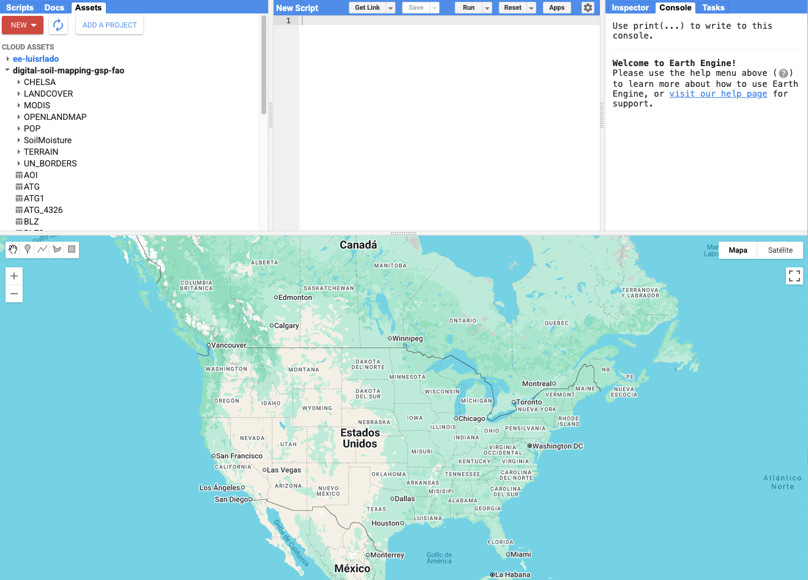
```

The interface is organized into four functional zones: a left panel with navigation and data discovery tools, a central code editing area, a right panel for output inspection and task management, and a lower interactive map.

#### Left Panel: Scripts, Assets, and Documentation

The left panel is divided into three tabs. The **Scripts** tab provides a personal repository for saving and organizing your GEE scripts, organized into folders. Scripts can be shared with other GEE users by generating a link, which is useful for collaborative training exercises. A **Reader** and **Writer** permission system controls who can view or edit shared scripts. The **Examples** folder within the Scripts tab contains a large collection of community-contributed scripts covering common use cases, which serve as an excellent learning resource.

The **Assets** tab allows you to upload and manage personal geospatial assets --- raster images, vector feature collections, or tables --- that can then be loaded into scripts using `ee.Image()` or `ee.FeatureCollection()` calls. The FAO GSP shared assets used in this training (e.g., CHELSA climate layers and OpenLandMap terrain derivatives) are hosted in a shared project asset folder (`projects/digital-soil-mapping-gsp-fao`) that your account must be authorized to access.

The **Docs** tab provides a searchable, offline-accessible reference for the entire JavaScript GEE API. Every function, data type, and parameter is documented here with descriptions and usage examples. When you are uncertain about a function's arguments or return type, searching Docs is usually faster than consulting external documentation.

#### Central Panel: The Code Editor

The central panel is where scripts are written and executed. It provides syntax highlighting for JavaScript, basic autocompletion for GEE API methods, and inline error indicators. Scripts are saved automatically to your personal repository. The toolbar above the editor contains several important controls:

The **Run** button (or `Ctrl+Enter` / `Cmd+Enter`) executes the entire script. GEE processes the script server-side, so execution does not transfer data to your browser --- only the final computed outputs and any `print()` statements are returned. This means that even very large computations feel responsive in the editor, as you are only waiting for metadata and visualization tiles rather than raw data downloads.

The **Save** button commits the current script state to your repository. It is good practice to save frequently and to use the **Get Link** button to generate a shareable URL that encodes the current script state. This URL is particularly useful for sharing reproducible workflows in a training context.

The **Reset** button clears all layers from the map and resets the console, without deleting your script. Use this when you want to re-run a script cleanly after making changes.

The **Apps** button allows you to publish a script as a standalone GEE application with a simplified user interface, which is useful for sharing tools with non-technical audiences.


### Right Panel: Console, Inspector, and Tasks

The right panel has three tabs that serve distinct purposes during script development and execution.

The **Console** tab displays the output of `print()` statements in your script. Printing an Earth Engine object such as an image collection or feature collection shows its metadata: the number of elements, band names, projection, spatial extent, and property dictionary. This is the primary tool for debugging scripts and verifying that filtering and processing steps are producing the expected results. For example, printing the Sentinel-2 collection after applying cloud filters confirms how many scenes are available before computing the median composite.

The **Inspector** tab activates a point-query tool. When active, clicking any location on the map returns the pixel values of all currently displayed layers at that point, along with their band names and data types. This is particularly useful for quickly checking that computed indices or terrain derivatives have realistic values across the study area without exporting the full raster.

The **Tasks** tab is essential for managing data exports. GEE does not automatically execute export operations when a script is run --- instead, exports are queued as tasks that must be submitted manually. After running a script that contains `Export.image.toDrive()` calls, pending tasks appear in this tab with a yellow **Run** button. Clicking **Run** for each task opens a dialog where you can confirm or modify the export parameters (description, folder, scale, CRS) before submission. Once submitted, tasks progress through *READY*, *RUNNING*, and *COMPLETED* states. Completed exports appear in the designated Google Drive folder as GeoTIFF files. Failed tasks display an error message that can help diagnose issues related to computation limits, memory, or invalid geometries.

### Lower Section: The Interactive Map

The lower section of the Code Editor is an interactive map, similar in functionality to Google Maps, onto which computed layers are rendered as tiled overlays. Layers are added using `Map.addLayer()`, which accepts an Earth Engine image or feature collection, a visualization parameter dictionary specifying band names, color palettes, and value ranges, and an optional display name.

The map toolbar provides tools for navigating (pan and zoom), measuring distances, and drawing geometries. The geometry drawing tools --- point, line, polygon, and rectangle --- allow you to define regions of interest directly on the map and reference them as variables in your script. This is a convenient way to quickly define a custom study area without needing to upload a vector file. Drawn geometries are automatically added to the **Geometry Imports** section at the top of the script.

The layer manager in the upper right corner of the map lists all currently added layers with toggle controls for visibility and opacity sliders. Each layer can be independently shown or hidden, making it easy to compare multiple products --- for instance, toggling between the ESA WorldCover land cover and the Sentinel-2 RGB composite to verify that the cropland mask aligns with visible agricultural patterns.

:::warning-box
**Browser Compatibility**

The GEE Code Editor is optimized for Google Chrome. While it functions in other modern browsers (Firefox, Edge), some features such as autocompletion and the geometry import panel may behave differently. For the best experience during training sessions, use an up-to-date version of Google Chrome.
:::

### Step 5: Prepare Your Google Drive Export Folder

The SoilFER covariate extraction script exports raster files directly to your Google Drive. Before running the script, create a folder named `GEE_Exports` in the root of your Google Drive at [https://drive.google.com](https://drive.google.com). This folder name is referenced explicitly in the export configuration of the script (see the `exportFolder` variable in Section 1 of the script). If you prefer a different folder name, update this variable accordingly before running.


## Installation of QGIS {-}

QGIS is a free and open-source desktop GIS application used to visualise and inspect spatial datasets. The Long-Term Release (LTR) version is recommended for stability.
Go to the [QGIS download page](https://qgis.org/download/) and choose your installation: 

### Windows
  • Use the OSGeo4W installer.

  • Choose "Express Install" and select either QGIS (latest) or QGIS LTR (stable long-term support).

### macOS / Linux
  • Use the installers or package-manager instructions shown on the QGIS download page for your operating system.
    
    
## Installation of Docker Desktop and Docker Compose {-}

Docker is an open-source platform that lets you build, deploy, and run applications inside lightweight, portable units called containers. A container bundles the code, runtime, libraries, and configuration into a single package, so the application behaves identically on any machine – Windows, macOS, or Linux.

The `GloSIS-ETL` application used in module 4 is delivered as a set of 2 Docker containers that runs and are orchestrated simultaneously with a single command. **Docker Desktop** is the GUI tool that manages containers on your local machine. It provides the Docker engine, a graphical interface to manage running containers and images, and bundles Docker Compose as an integrated component, so no separate installation of Compose is required.

**Docker Compose** is a tool used to define and run multi-container Docker applications. Rather than starting each container individually, Compose reads a single configuration file (`docker-compose.yml`) that describes all the services, their dependencies, and how they connect to each other, then starts everything with a single command. The key benefits of this approach include:

-   **Simplified Deployment**: Automatically pulls and runs multiple containers with a single command.
-   **Predefined Configuration**: Ensures all services are correctly configured and work together.
-   **Portability**: The same configuration runs on Windows, macOS, and Linux without modification.

Installing **Docker Desktop** is the only prerequisite to deploy the `GloSIS-ETL`.

### Windows

**System requirements**: Windows 10 (build 19041 or later) or Windows 11, with hardware virtualization enabled. On most modern machines this is already active, but if Docker fails to start, check your BIOS settings and enable virtualization manually. See Enable [Virtualization on Windows](https://support.microsoft.com/en-gb/windows/enable-virtualization-on-windows-c5578302-6e43-4b4b-a449-8ced115f58e1) for guidance.

**Installation steps**:
    1. **Check that Hyper-V is enabled**. Open the Start menu, type Turn Windows features on or off, and press Enter. In the list that appears, verify that Hyper-V and Hyper-V Module for Windows PowerShell are both checked. If they are not, enable them and restart your computer before continuing. The Docker Desktop installer will attempt to enable Hyper-V automatically in most cases, but verifying this beforehand avoids installation failures. For manual installation instructions see [Install Hyper-V on Windows](https://learn.microsoft.com/en-us/windows-server/virtualization/hyper-v/get-started/Install-Hyper-V). 
    
    2. **Download Docker Desktop** from the [official website](https://docs.docker.com/desktop/install/windows-install/) and run the installer. 
    
    3. **Follow the installation prompts**, accepting the default settings. When asked, enable **WSL 2** (Windows Subsystem for Linux), which is required for running Linux containers on Windows. 
    
    4. **Restart your computer** once the installation completes. 
    
    5. **Launch Docker Desktop** from the Start menu. Wait until the whale icon in the system tray turns green, which confirms the Docker engine is running and the application is ready to use.
    

### macOS

1.  Download **Docker Desktop for Mac** from the [official website](https://docs.docker.com/desktop/install/mac-install/). Choose the correct version for your processor (**Apple Silicon** or **Intel**).
2.  Open the `.dmg` file and drag **Docker** into the Applications folder.
3.  Start **Docker Desktop** and allow any requested system permissions.

### Linux

1.  Open a terminal and run the following commands:

``` bash
  sudo apt update
  sudo apt install docker.io docker-compose -y
  sudo systemctl start docker
  sudo systemctl enable docker
```

2.  Add your user to the Docker group (to run Docker without `sudo`):

``` bash
  sudo usermod -aG docker $USER
```

3.  **Log out and log back in** (or restart your computer) for the group change to take effect.

4.  Verify Docker is running:

``` bash
docker --version
```

If the installation was successful, you should see output similar to:

``` bash
  Docker version 24.0.5, build 123456
```


<!--chapter:end:00-Presentation-and-data-preparation.Rmd-->

#	Introduction to Soil Data Preparation & Spatial Data

## PART ONE: Introduction to R
### Understanding the RStudio Interface

**RStudio** provides an integrated environment that simplifies working with R. The interface is divided into four main panes (Fig. \@ref(fig:rstudio)):

```{r rstudio, echo=FALSE, out.width="100%",fig.cap = "RStudio interface."}
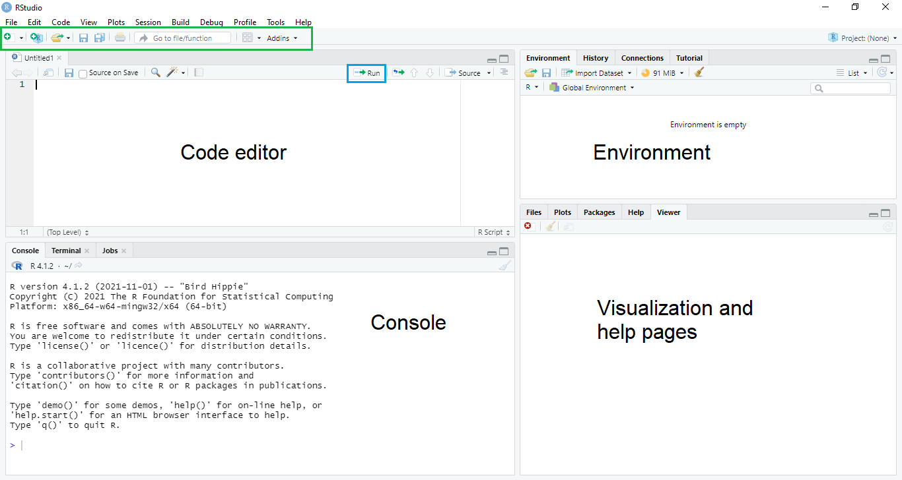
```

The **Console**  (Bottom Left) is where R code is executed.
You can type commands directly here or run them from your script.
The Console displays results, warnings, and error messages.

```{r console-example, echo=TRUE, eval=FALSE}
# Type directly in the console
5 * 3

# R will immediately show the result
# [1] 15
```

You can write commands directly in the Console  (Top Left) and execute them line by line. However, it is usually more convenient to write code in a script editor—the **Code Editor** pane. Here you can create and edit R scripts (`.R` files), R Markdown documents (`.Rmd` files), and other file types. Scripts allow you to save your code and run it repeatedly, which is essential for reproducible analysis.

Working in the **Code Editor** also makes it easier to organize code for later use. You can send any line or selected block of code to the **Console** for execution by pressing `Ctrl + Enter` (Windows/Linux) or `Cmd + Enter` (macOS). You can also run code by clicking the **Run** button in the top-right corner of the **Code Editor** pane.

::: highlights
-   Code can be written and executed directly in the **Console**.\
-   Using  the **Code Editor** is more convenient for organizing and reusing code.\
-   Send a line or block of code to the console with `Ctrl + Enter` (Windows(), `Cmd + Enter` (macOS), or the equivalent shortcut in Linux.\
-   You can also run code by clicking the **Run** button in the script editor.\

**Creating a new script:**
-   File → New File → R Script (or press `Ctrl+Shift+N` / `Cmd+Shift+N`)

:::

Top Right Pane (Environment/History) is divided into:

-   **Environment**: Shows all objects (variables, datasets, functions) currently in your R session

-   **History**: Records all commands you've run during the session

Finally, the Bottom Right Pane shows

-   **Files**: Browse your computer's file system

-   **Plots**: View visualizations created with R

-   **Packages**: Manage installed packages

-   **Help**: Access R documentation and function help pages

::: highlights
**Best Practice**

- Always work in scripts rather than typing directly in the Console.

- Scripts preserve your workflow and make your analysis reproducible.

:::

### R Packages: Extending R's Capabilities

R's strength lies in its extensibility through **packages**.
A package is a collection of functions, data, and documentation that extends R's functionality for specific tasks.

#### What are Packages?

The base R installation includes fundamental functions for data manipulation and statistical analysis.
However, specialized tasks often require additional tools provided by contributed packages.

For soil science work, key packages include:

-   `{tidyverse}`: A collection of packages for data manipulation and visualization, including `{dplyr}` and `{tidyr}`, among others

-   `{terra}`: Spatial data analysis and raster operations

-   `{sf}`: Working with vector spatial data

-   `{aqp}`: Algorithms for Quantitative Pedology (soil profile data)

-   `{ggplot2}` : Advanced data visualization (part of tidyverse)


#### Installing Packages

Packages need to be installed once before you can use them.
Use `install.packages()`:

```{r install-package, echo=TRUE, eval=FALSE}
# Install a single package
install.packages("tidyverse")

# Install multiple packages at once
install.packages(c("terra", "sf", "aqp"))
```

You only need to install a package once, but you must load it with `library()` each time you start a new R session.

You can check which *{packages}* are installed with:

```{r installed-packages, echo=TRUE, eval=FALSE}
installed.packages()
```


##### Install Packages from GitHub or Other Sources{-}

Some *{packages}* are not yet available on CRAN or you may want a newer development versions from GitHub, Gitlab, bitbucket, or an URL.
In these cases, you can use the `remotes` or `devtools` *{packages}*, with the functions `install_github()`, `install_gitlab()`, `install_bitbucket()` or `install_url()`:

```{r remotes-installation, echo=TRUE, eval=FALSE}
# First, install remotes package (if not already installed)
install.packages("remotes")

# Install an R package from GitHub
remotes::install_github("rspatial/terra")
```

This is useful for accessing cutting-edge versions, experimental features, or tools developed by research groups.

##### Manual Installation of R Packages{-}

You may need to install R *{packages}* manually especially when working in environments without internet access or when using custom-built *{packages}*.

There are two common methods:

- **1. Installing from a compressed source package file** (e.g., `mypackage_1.0.0.tar.gz`)


```{r manual-installation, echo=TRUE, eval=FALSE}
install.packages("path/to/mypackage_1.0.0.tar.gz", repos = NULL, type = "source")
```

- **2. Installing from a Local `.zip` file** (Windows Binary)

```{r install-from-zip, echo=TRUE, eval=FALSE}
install.packages("path/to/mypackage.zip", repos = NULL, type = "win.binary")
```

This method does not require compilation and is usually faster on Windows.

::: warning-box
**Note:**

 - Package installation typically requires an internet connection.

 - Depending on the package size and your connection speed, installation may take several minutes.

:::

#### Loading Packages

After installation, you must **load** a package into your R session each time you start R.
Use the `library()` function:

```{r load-packages, echo=TRUE, eval=FALSE}
# Load tidyverse package
library(tidyverse)

# Load multiple packages
library(terra)
library(sf)
library(aqp)
```

::: highlights
**Key Difference:**

-   `install.packages()`: Downloads and installs a package (once)
-   `library()`: Loads a package into your current session (every time you start R)

:::

#### Finding Help on Packages

```{r package-help, echo=TRUE, eval=FALSE}
# Get help on a package
help(package = "tidyverse")

# Or use
?tidyverse

# View vignettes (tutorials) for a package
vignette(package = "ggplot2")
vignette("ggplot2", package = "ggplot2")

```


### R Basics: Objects and Data Types {#object-types}

In R, everything you work with is an **object** (numbers, text, vectors, tables, models, and maps). When you create an object, R stores it in your computer’s **memory** (RAM) so you can reuse it later. Because memory is limited, especially when working with large soil datasets, rasters, or spatial objects, it is good practice to keep your workspace tidy: reuse objects when appropriate, remove objects you no longer need with `rm()`, and occasionally trigger garbage collection with ´gc()´ to free memory that is no longer in use.

#### Creating Objects with Assignment {#object-assignment}

If you run an operation without assigning it to an object, R will compute the result but won’t store it for later use.
You can assign values to objects using either `<-` or `=`. 

However, the preferred and most common assignment operator is `<-` while `=` is most commonly used inside function calls to name arguments. This avoids confusion between assigning objects and passing inputs to functions.

```{r variable-assignment, echo=TRUE, eval=FALSE}
# Assign a value to a variable
soil_depth <- 30
# View the content of soil_depth
soil_depth

# Assignment `<-` to objects and `=` to function arguments
soil_depth <- c(10,20,30)
mean_soil_depth <- mean(x = soil_depth, na.rm = TRUE)
# View the content of mean_soil_depth
mean_soil_depth

```

::: warning-box
**Naming Rules:**
-   Object names must start with a letter
-   Names can contain letters, numbers, underscores `_`, and periods `.`
-   Names are case-sensitive: `SoilDepth` is different from `soildepth`
-   Avoid using reserved words like `TRUE`, `FALSE`, `NA`, `function`, etc.

**Good naming practices:**

```{r naming-good, echo=TRUE, eval=FALSE}
# Descriptive names
soil_ph <- 6.5
organic_carbon_percent <- 2.1
clay_content_gkg <- 350

# Use consistent style
plot_id <- "P001"      # snake_case (recommended)
plotID <- "P001"       # camelCase (alternative)
```

**Avoid:**

```{r naming-bad, echo=TRUE, eval=FALSE}
# Bad naming practices — too short, too long, unclear
# Too short, unclear
x <- 6.5
a <- 2.1

# Too long
the_ph_value_of_the_topsoil_at_site_one <- 6.5
```

:::

#### Data Types in R {#data-types}

Every object in R has a data type, which tells R what kind of information it contains and how it can be used (for example, whether you can do math with it or use it as text labels).

R has several basic data types:

##### 1. Numeric (Numbers) {#numeric-data} {-}

Numeric values store measurements that can include decimals (e.g., pH, clay %, temperature).

```{r numeric-type, echo=TRUE, eval=FALSE}
# Numeric values
ph_value <- 6.8
clay_percent <- 25.5
temperature <- 15.2
```

##### 2. Integer (Whole Numbers) {#integer-data}{-}

Integers are whole numbers. In R, you can create them explicitly using the L suffix.

```{r integer-type, echo=TRUE, eval=FALSE}
# Integer values (use L suffix)
sample_count <- 100L
plot_number <- 5L
```

##### 3. Character (Text Strings) {#text-data}{-}

Character values store text (soil types, locations, notes). They must be written inside quotes.

```{r character-typea, echo=TRUE, eval=FALSE}
# Character values (use quotes)
soil_type <- "Acrisol"
location <- "Kansas"
notes <- "Sample collected from topsoil"
```

##### 4. Logical (TRUE/FALSE) {#logical-data} {-}

Logical values represent yes/no conditions and are commonly used for filtering and decision-making.

```{r logical-type, echo=TRUE, eval=FALSE}
# Logical values
is_valid <- TRUE
has_missing_data <- FALSE
```

##### 5. Dates {#dates-data} {-}

Dates often are imported as character strings, but it is better to convert them to the Date class for sorting, filtering, and plotting.

```{r date-type, echo=TRUE, eval=FALSE}
# ISO 8601 date format, YYYY-MM-DD
sampling_date <- "2024-03-12"
# Convert to date (%Y = 4-digit year; %y = 2-digit year)
sampling_date <- as.Date(sampling_date, format = "%Y-%m-%d")
class(sampling_date)
```

::: warning-box
- The ISO 8601 date format (**YYYY-MM-DD**) is preferred for storing date values, since it is the date format adopted in the **GloSIS** database.
:::


#### Checking Data Types {#check-data}

```{r check-types, echo=TRUE, eval=FALSE}
# Check the class (high-level type)
class(ph_value)   # "numeric"
class(soil_type)  # "character"
class(is_valid)   # "logical"

# Check the internal storage type
typeof(sample_count)
typeof(ph_value)

# Helpful checks
is.numeric(ph_value)
is.character(soil_type)
is.logical(is_valid)
```

`class()` is what you’ll use most in practice. `typeof()` is more 'internal' (how R stores the object).

::: highlights
- Every R object has a **data type**, which tells R how to store the information and what operations are possible.

- **Numeric**: measurements such as pH, clay (%), bulk density, or organic carbon.

- **Numeric vectors**: multiple numeric values (e.g., pH readings from several samples or horizons).

- **Character**: text labels such as soil type, land use, site code, or field notes.

- **Character vectors**: multiple text values (e.g., a list of soil classes).

- **Logical**: `TRUE`/`FALSE` values, often used for conditions, filtering, and quality checks.
:::

::: warning-box
**Caution:**

 - When importing data from external sources (CSV, Excel, databases), always check that columns have the expected data types. For example, pH or SOC may be imported as text instead of numeric.

- Check types with `str()`, `class()`, or `typeof()`.

- Convert types when needed using `as.numeric()`, `as.character()`, `as.logical()`, or `as.Date()`.
:::


### Data Structures in R {#structure-data}

R can store data in different structures, depending on how many values you have and how you want to organize them. For example, a single measurement can be stored as a number, a series of measurements as a vector, and a full dataset as a data frame. Understanding these structures is essential because it determines how you subset data, apply functions, summarize results, and prepare data for plotting or modeling.

#### Vectors {#vector-data}

A **vector** is the simplest data structure - a one-dimensional sequence of elements of the same type.

##### Creating Vectors {#create-vector} {-}

```{r vectors-create, echo=TRUE, eval=FALSE}
# Create a numeric vector using c() (combine)
ph_values <- c(5.2, 6.5, 7.1, 5.8, 6.9)
print(ph_values)
ph_values # Equivalent to print(ph_values)

# Character vector
soil_types <- c("Acrisol", "Ferralsol", "Vertisol", "Andosol", "Cambisol")
soil_types

# Logical vector
valid_samples <- c(TRUE, TRUE, FALSE, TRUE, TRUE)
valid_samples

# Create sequences
depths <- 0:100                    # Integers from 0 to 100
depths_seq <- seq(0, 100, by=10)   # 0, 10, 20, ..., 100
```

##### Vector Operations {#operate-vector} {-}

```{r vector-operations, echo=TRUE, eval=FALSE}
# Arithmetic on vectors (element-wise)
ph_values * 10
ph_values + 1

# Summary statistics
mean(ph_values)
median(ph_values)
sd(ph_values)        # standard deviation
min(ph_values)
max(ph_values)
# NAs affect the statistic results
mean(c(ph_values,NA))
mean(c(ph_values,NA), na.rm=TRUE) # Remove NAs from calculations

```

##### Accessing Vector Elements {#element-vector} {-}

```{r vector-access, echo=TRUE, eval=FALSE}
# Access by index (position)
ph_values           # Complete data
ph_values[1]        # First element
ph_values[3]        # Third element

# Access multiple elements
ph_values[c(1,3,5)]  # Elements 1, 3, and 5

# Access by logical condition
ph_values[ph_values > 6]     # All pH values greater than 6

# Negative indices exclude elements
ph_values[-1]       # All except first
ph_values[-c(1,2)]  # All except first two
```

#### Factors {#factor-data}

**Factors** are used to represent categorical data.
They store values as levels (categories).

```{r factor-type, echo=TRUE, eval=FALSE}
# Create a factor from character vector
soil_class <- factor(c("Clay", "Loam", "Sand", "Clay", "Loam"))
soil_class

# Check levels
levels(soil_class)

# Count observations per level
table(soil_class)

# Ordered factors (when order matters)
texture_class <- factor(
  c("Coarse", "Fine", "Medium", "Fine", "Coarse"),
  levels = c("Coarse", "Medium", "Fine"),
  ordered = TRUE
)
texture_class
```

#### Matrices {#matrix-data}

A **matrix** is a two-dimensional structure where all elements must be of the same type.

```{r matrix-class, echo=TRUE, eval=FALSE}
# Create a matrix
soil_matrix <- matrix(
  c(5.2, 25, 30,
    6.5, 30, 28,
    7.1, 18, 35),
  nrow = 3,
  ncol = 3,
  byrow = TRUE
)

# Add column names
colnames(soil_matrix) <- c("pH", "Clay", "Sand")
rownames(soil_matrix) <- c("Sample1", "Sample2", "Sample3")

print(soil_matrix)

# Access elements
soil_matrix[1, 2]        # Row 1, Column 2
soil_matrix[1, ]         # All of row 1
soil_matrix[, 2]         # All of column 2
```

#### Data Frames {#dataframe}

A **data frame** is the most commonly used structure for storing datasets.
It's like a spreadsheet: rows represent observations, columns represent variables, and different columns can have different data types.

##### Creating Data Frames {#dataframe-create} {-}

```{r dataframe-class, echo=TRUE, eval=FALSE}
# Create a data frame
soil_data <- data.frame(
  plot_id = c("P001", "P002", "P003", "P004", "P005"),
  latitude = c(-1.25, -1.27, -1.23, -1.29, -1.26),
  longitude = c(36.85, 36.83, 36.87, 36.81, 36.84),
  ph = c(5.2, 6.5, 7.1, 5.8, 6.9),
  organic_carbon = c(2.1, 3.2, 1.8, 2.7, 2.9),
  clay_content = c(25, 30, 18, 42, 35),
  soil_type = c("Acrisol", "Ferralsol", "Vertisol", "Andosol", "Cambisol")
)

# View the data frame
soil_data

# View structure
str(soil_data)

# View first rows
head(soil_data)

# View last rows
tail(soil_data)

# Get dimensions
dim(soil_data)         # rows, columns
nrow(soil_data)        # number of rows
ncol(soil_data)        # number of columns
```

##### Accessing Data Frame Elements {#dataframe-access} {-}

```{r dataframes-access, echo=TRUE, eval=FALSE}
# Access columns by name
soil_data$ph
soil_data$soil_type

# Alternative: use brackets
soil_data[, "ph"]
soil_data[["ph"]]

# Access rows
soil_data[1, ]           # First row
soil_data[c(1,3,5), ]    # Rows 1, 3, and 5

# Access specific cells
soil_data[2, 4]          # Row 2, Column 4 (pH of second plot)

# Subset based on conditions
soil_data[soil_data$ph > 6, ]              # Plots with pH > 6
soil_data[soil_data$soil_type == "Acrisol", ]  # Only Acrisols
```

##### Adding Columns {#dataframe-cols} {-}

```{r dataframes-add, echo=TRUE, eval=FALSE}
# Add a new column
soil_data$silt_content <- c(40, 35, 52, 23, 30)

# Calculate new columns from existing ones
soil_data$clay_plus_silt <- soil_data$clay_content + soil_data$silt_content

# View updated data frame
head(soil_data)
```

#### Lists {#list-data}

A **list** is a flexible structure that can contain elements of different types and sizes (vectors, data frames, other lists, etc.).

```{r lists-class, echo=TRUE, eval=FALSE}
# Create a list
soil_analysis <- list(
  site_name = "Kansas Field",
  coordinates = c(lat = -1.25, lon = 36.85),
  measurements = data.frame(
    depth = c(0, 10, 20, 30),
    ph = c(6.5, 6.2, 5.8, 5.5)
  ),
  notes = "Collected during dry season"
)

# View list structure
str(soil_analysis)

# Access list elements
soil_analysis$site_name
soil_analysis[[1]]                # First element
soil_analysis[["measurements"]]   # View measurements data frame
```


### Operators in R {#operators}

Operators perform operations on objects. R has several types of operators:

#### Arithmetic Operators {#arithmetic-operators}

```{r arithmetic-operators, echo=TRUE, eval=FALSE}
# Basic arithmetic
10 + 5      # Addition
10 - 5      # Subtraction
10 * 5      # Multiplication
10 / 5      # Division
10 ^ 2      # Exponentiation (10 squared)
10 %% 3     # Modulus (remainder: 10 mod 3 = 1)
10 %/% 3    # Integer division (10 divided by 3 = 3)

# Order of operations (PEMDAS)
result <- (10 + 5) * 2 / 4 - 1
result
```


#### Comparison Operators {#comparison-operators}

```{r comparison-operators, echo=TRUE, eval=FALSE}
# Comparison operators return TRUE or FALSE
5 == 5      # Equal to
5 != 3      # Not equal to
5 > 3       # Greater than
5 < 3       # Less than
5 >= 5      # Greater than or equal to
5 <= 6      # Less than or equal to

# Use in subsetting
ph_values <- c(5.2, 6.5, 7.1, 5.8, 6.9)
ph_values > 6                     # Logical vector
ph_values[ph_values > 6]          # Values greater than 6
```


#### Logical Operators {#logical-operators}

```{r logical-operators, echo=TRUE, eval=FALSE}
# AND operator: & (element-wise) or && (single values)
TRUE & TRUE      # TRUE
TRUE & FALSE     # FALSE

# OR operator: | (element-wise) or || (single values)
TRUE | FALSE     # TRUE
FALSE | FALSE    # FALSE

# NOT operator: !
!TRUE            # FALSE
!FALSE           # TRUE

# Combining conditions
ph_values <- c(5.2, 6.5, 7.1, 5.8, 6.9)
clay_content <- c(25, 30, 18, 42, 35)

# Find samples with pH > 6 AND clay > 25
ph_values > 6 & clay_content > 25

# Find samples with pH > 6 OR clay > 40
ph_values > 6 | clay_content > 40
```


### Control Structures: Conditional Statements {#conditional-statements}

Conditional statements let your code make decisions—running different blocks depending on whether a condition is `TRUE` or `FALSE`.

#### If-Else Statements {#ifelse-statements}

Use `if` / `else` when you are checking **a single condition** (one TRUE/FALSE value).

```{r if-else, echo=TRUE, eval=FALSE}
# Basic if statement
ph_value <- 7.5

# Basic if statement
if (ph_value > 7) {
  print("Alkaline soil")
}

# If-else
if (ph_value > 7) {
  print("Alkaline soil")
} else {
  print("Neutral or acidic soil")
}

# Multiple conditions (only the first TRUE branch runs)
if (ph_value > 7.5) {
  print("Strongly alkaline")
} else if (ph_value > 7) {
  print("Slightly alkaline")
} else if (ph_value == 7) {
  print("Neutral")
} else {
  print("Acidic")
}
```

::: highlights
`if (...)` expects a single logical value.
If you have a vector of values, use a vectorized approach such as `ifelse()`, `cut()`, or `case_when()`.
:::

#### Vectorized If-Else: `ifelse()` {#v-ifelse-statements}

`ifelse()` is vectorized: it applies a condition to each element of a vector.

```{r ifelse, echo=TRUE, eval=FALSE}
# Vectorized conditional assignment
ph_values <- c(5.2, 6.5, 7.1, 5.8, 7.0)

# Simple two-class example
soil_reaction <- ifelse(ph_values > 7, "Alkaline", "Not alkaline")
soil_reaction
```

#### Vectorized Cut: `cut()` {#cut-statements}

Use `cut()` when you have a **numeric** variable and you want to classify values into **interval-based categories** (bins), such as pH classes, depth intervals, or temperature ranges. It is especially useful when:

- the variable is **continuous or ordered** (numeric),
- you can define meaningful **break points**, and
- you want a clear, readable alternative to many nested conditions.

For multiple classes, `cut()` is often easier to read than nested `ifelse()`:

```{r cut, echo=TRUE, eval=FALSE}
soil_class <- cut(
  ph_values,
  breaks = c(-Inf, 5.5, 7.0, Inf),
  labels = c("Acidic", "Neutral", "Alkaline"),
  right = TRUE, include.lowest = TRUE
)
soil_class

# Notes:
# - `right = TRUE` means intervals are **right-closed** (e.g., `(5.5, 7.0]`).
# - `include.lowest = TRUE` ensures the smallest value is included in the first interval.

```


### Control Structures: Loops {#control-structures}

Loops in R are used to **repeat a block of code** multiple times. They are helpful when you need to automate repetitive tasks, such as performing calculations over a sequence of values or processing each element of a dataset.

R provides several loop constructs, but the most commonly used are `for` and `while`.


#### For Loops {#for-loop}

Use a `for` loop when you want to iterate over a sequence or over the elements of an object.


```{r for-loops, echo=TRUE, eval=FALSE}
# Loop through a sequence
for (i in 1:5) {
  print(paste("Iteration:", i))
}

# Loop through a vector
soil_types <- c("Acrisol", "Ferralsol", "Vertisol")

for (soil in soil_types) {
  print(paste("Soil type:", soil))
}

# Loop with conditional logic
ph_values <- c(5.2, 6.5, 7.1, 5.8, 6.9)

for (i in 1:length(ph_values)) {
  if (ph_values[i] > 6) {
    print(paste("Sample", i, "has pH =", ph_values[i], "(Acceptable)"))
  } else {
    print(paste("Sample", i, "has pH =", ph_values[i], "(Too acidic)"))
  }
}
```

#### While Loops {#while-loop}

A `while` loop repeats as long as a condition is `TRUE`. It is useful when you do not know in advance how many iterations you will need.

```{r while-loops, echo=TRUE, eval=FALSE}
# While loop continues until condition is FALSE
counter <- 1

while (counter <= 5) {
  print(paste("Counter value:", counter))
  counter <- counter + 1   # Increment counter
}
```

::: warning-box
**Caution:**

- Always ensure loop conditions eventually become `FALSE` to avoid infinite loops!

:::

### Functions in R {#r-funtions}

Functions are reusable blocks of code that take **inputs** (arguments), perform a task, and return an **output**. They help you avoid repeating code and make your scripts easier to read and maintain.

#### Using Built-in Functions {#built-funtions}

R comes with thousands of built-in functions. You can view help pages with `?function_name` (e.g., `?mean`).

```{r builtin-functions, echo=TRUE, eval=FALSE}
# Statistical functions
mean(c(5, 10, 15, 20))
median(c(5, 10, 15, 20))
sd(c(5, 10, 15, 20))
sum(c(5, 10, 15, 20))

# String functions
toupper("acrisol")
tolower("FERRALSOL")
nchar("soil science")         # Count characters

# Math functions
sqrt(16)
log(10)
exp(2)
abs(-5)
round(pi, 2)
```

::: highlights
Function **arguments** can be provided by position (e.g., round(3.14159, 2)) or by name (e.g., round(**x =** 3.14159, **digits =** 2)).
Using names is often clearer and reduces mistakes.
:::

#### Creating Custom Functions {#build-functions}

You can write your own functions using `function()`:

```{r custom-functions, echo=TRUE, eval=FALSE}
# Example: Bulk density (mass / volume)
calculate_bulk_density <- function(mass, volume) {
  if (any(volume <= 0)) stop("volume must be > 0")
  mass / volume
}

calculate_bulk_density(mass = 150, volume = 100)

# Function with a default argument
classify_soil_ph <- function(ph, threshold = 7) {
  if (ph > threshold) {
    "Alkaline"
  } else if (ph == threshold) {
    "Neutral"
  } else {
    "Acidic"
  }
}

classify_soil_ph(6.5)
classify_soil_ph(6.5, threshold = 6)
```

::: highlights
`return()` is optional in many cases, R returns the last evaluated expression.
You can still use `return()` when you want to exit early or make the function’s output explicit.
:::

#### Function Arguments and Defaults {#arguments-functions}

```{r function-args, echo=TRUE, eval=FALSE}
# SOC stock calculation (example)
# Assumptions:
# - soc_percent is in %
# - bulk_density is in g/cm^3
# - depth is in cm
# Output: SOC stock in Mg/ha

calculate_soc_stock <- function(soc_percent, bulk_density, depth, coarse_fragment = 0) {
  if (any(coarse_fragment < 0 | coarse_fragment > 100)) stop("coarse_fragment must be between 0 and 100")
  soc_percent * bulk_density * depth * (1 - coarse_fragment / 100)
}

calculate_soc_stock(soc_percent = 2.5, bulk_density = 1.3, depth = 30)
calculate_soc_stock(soc_percent = 2.5, bulk_density = 1.3, depth = 30, coarse_fragment = 15)
```


### Data Manipulation with Base R {#R-data-manipulation}

This section shows common data manipulation tasks using base R: filtering rows, selecting columns, sorting, and summarizing by groups.

#### Subsetting and Filtering {#R-data-subset}

Use subsetting and filtering to **extract only certain rows or columns** from a dataset. This is often the first step when you want to focus on data that meet specific criteria.

In data frames, data access is organized by *rows* and *columns* using the pattern `data[rows, columns]`, where:
 
- `rows` specifies which observations (records) to keep. It can be a number, a logical condition, or a vector of indices.

- `columns` specifies which variables to keep. It can be a name, a position, or a vector of indices.

In this context, **filtering** usually refers to selecting rows, while **subsetting** often refers to selecting columns. In the example below, we use this structure to filter rows and subset columns from a `soil_data` data frame.


```{r subsetting-df, echo=TRUE, eval=FALSE}
# Example data frame
soil_data <- data.frame(
  plot_id = c("P001", "P002", "P003", "P004", "P005"),
  latitude = c(-1.25, -1.27, -1.23, -1.29, -1.26),
  longitude = c(36.85, 36.83, 36.87, 36.81, 36.84),
  ph = c(5.2, 6.5, 7.1, 5.8, 6.9),
  clay_content = c(25, 30, 18, 42, 35),
  soil_type = c("Acrisol", "Ferralsol", "Vertisol", "Andosol", "Cambisol")
)

# Select column by index: Show second column
soil_data[, 2]
# Select column by index: Show first and third columns
soil_data[, c(1,3)]
# Select column  by name: Show texture columns
soil_data[, c("ph","clay_content","soil_type")]
# Filter rows by index: keep first 2 records in the data frame
soil_data[c(1:2),]

# Filter rows by index: keep texture properties for the first 100 records in the data frame
soil_data[c(1:2), c("ph","clay_content","soil_type")]

# Filter rows based on conditions
high_ph <- soil_data[soil_data$ph > 6, ]
high_ph

# Multiple conditions with & and |
high_ph_clay <- soil_data[soil_data$ph > 6 & soil_data$clay_content > 25, ]
high_ph_clay

# Select columns by index: Show second column
subset_data <- soil_data[, 2]
# Select several columns by index
subset_data <- soil_data[, c(1:3)]

# Select by name
subset_data <- soil_data[, c("plot_id", "ph", "soil_type")]
subset_data
```

#### Deleting Columns and Rows {#delete-cols}

You can remove columns or rows from a data frame using names, indices, or logical conditions. This is useful when you want to drop unnecessary variables, remove incomplete records, or exclude outliers before analysis.


```{r delete-cols-rows, echo=TRUE, eval=FALSE}
# Example data frame
data <- data.frame(
  Plot = c("P001", "P002", "P003"),
  Clay = c(25, 30, 18),
  Silt = c(40, 35, 52),
  pH   = c(5.2, 6.5, 7.1)
)

# --- Delete columns ---

# Delete one column by name
data$Clay <- NULL
data

# Delete multiple columns by name
data[, c("Silt", "pH")] <- NULL
data

# --- Delete rows ---

# Delete a row by index (e.g., remove the 2nd row)
data <- data[-2, ]
data

# Delete rows based on a condition (e.g., remove rows with pH < 6)
# Rebuild the dataframe
data <- data.frame(
  Plot = c("P001", "P002", "P003"),
  Clay = c(25, 30, 18),
  Silt = c(40, 35, 52),
  pH   = c(5.2, 6.5, 7.1)
)
data <- data[data$pH >= 6, ]
data

```

::: highlights

 - To delete columns, use NULL (recommended) or an empty vector.

 - To delete rows, use negative indices (e.g., data[-2, ]) or a logical condition (e.g., data[data$pH >= 6, ]).

:::


#### Sorting Data {#sort-rows}

Sorting is useful for quickly identifying extreme values (e.g., highest pH, highest clay content) or for preparing tables for reporting.

```{r sorting-data, echo=TRUE, eval=FALSE}
# Sort by pH (ascending)
soil_data[order(soil_data$ph), ]

# Sort by pH (descending)
soil_data[order(-soil_data$ph), ]

# Sort by multiple columns
soil_data[order(soil_data$soil_type, soil_data$ph), ]
```

#### Aggregating Data {#aggregate-rows}

Aggregation means computing summary statistics by group, such as mean pH per soil type.

```{r aggregating-data, echo=TRUE, eval=FALSE}
# Example data frame with repeated soil_type groups
soil_data <- data.frame(
  plot_id = paste0("P", sprintf("%03d", 1:12)),
  latitude = c(-1.25, -1.26, -1.27, -1.28, -1.23, -1.24, -1.22, -1.21, -1.29, -1.30, -1.31, -1.32),
  longitude = c(36.85, 36.86, 36.83, 36.84, 36.87, 36.88, 36.82, 36.81, 36.84, 36.83, 36.86, 36.85),
  ph = c(5.2, 5.6, 6.5, 6.2, 7.1, 6.9, 5.8, 6.0, 6.9, 6.7, 5.4, 5.1),
  clay_content = c(25, 28, 30, 33, 18, 20, 42, 40, 35, 34, 27, 26),
  soil_type = c(
    "Acrisol","Acrisol",
    "Ferralsol","Ferralsol",
    "Vertisol","Vertisol",
    "Andosol","Andosol",
    "Cambisol","Cambisol",
    "Acrisol","Acrisol"
  )
)

# Multiple summary values aggregated by group (mean and standard deviation of pH by soil_type)
aggregate(
  ph ~ soil_type,
  data = soil_data,
  FUN = function(x) c(mean = mean(x), sd = sd(x))
)

```

::: warning-box
- When using `aggregate()`, make sure the grouping variable (here `soil_type`) is correctly imported as character or factor, and that the summarized variable (here `ph`) is numeric.
:::


### Data Manipulation with the Tidyverse {#tidyverse-manipultation}

While **base R** is powerful, the **tidyverse** makes many common data tasks easier to write, read, and maintain—especially when working with real datasets. Its functions use a consistent "verb" style (e.g., `filter()`, `select()`, `mutate()`, `summarize()`), and the pipe operator (`%>%` or `|>`) lets you build clear, step-by-step workflows. This is particularly useful in soil data analysis, where you often need to clean, subset, join, and summarize data repeatedly.

The `{tidyverse}` is a collection of R packages designed for data science that share a common philosophy and syntax.
Key packages include:

-   `{dplyr}`: Data manipulation

-   `{ggplot2}`: Data visualization

-   `{tidyr}`: Data reshaping

-   `{readr}`: Reading data

-   `{tibble}`: Modern data frames

#### Loading the Tidyverse {#tidyverse-load}

When you load `{tidyverse}`, it automatically attaches a core set of tidyverse packages (such as `{dplyr}` and `{ggplot2}`) so you can use them right away.

```{r tidyverse-load, echo=TRUE, eval=FALSE}
# Install if not already installed
install.packages("tidyverse")

# Load tidyverse
library(tidyverse)
```

#### Tibbles: Modern Data Frames {#tidyverse-tibbles}

A **tibble** is the tidyverse’s modern version of a data frame. It behaves like a regular data frame, but it prints in a cleaner way and is generally more user-friendly. For example, tibbles show only the first rows by default, keep long text from cluttering your console, and display column types so you can quickly confirm how R has interpreted your data. Tibbles also avoid some older base R behaviors (such as automatically converting text to factors in older R versions), which makes them a reliable default for data analysis workflows.

```{r tibble, echo=TRUE, eval=FALSE}
# Create tibble directly
soil_tbl <- tibble(
  plot_id = c("P001", "P002", "P003"),
  ph = c(5.2, 6.5, 7.1),
  clay = c(25, 30, 18)
)
# Convert data frame to tibble
soil_tbl <- as_tibble(soil_data)
soil_tbl

```

#### The Pipe Operator: `%>%` {#tidyverse-pipe}

The pipe operator `%>%` (from `{magrittr}` package, loaded with `{tidyverse}`) helps you write code as a clear sequence of chained operations. Instead of nesting functions inside each other, you send ("pipe") the output of one step into the next. This makes workflows easier to read and debug—especially when you are cleaning soil datasets where you often need to filter rows, select variables, create new columns, and then summarize or sort results.


```{r pipe, echo=TRUE, eval=FALSE}
# Without pipe (nested functions)
round(mean(soil_data$ph), 2)

# With pipe (sequential operations)
soil_data$ph %>%
  mean() %>%
  round(2)

# More complex example
soil_data %>%
  filter(ph > 6) %>%
  select(plot_id, ph, soil_type) %>%
  arrange(desc(ph))
```


::: highlights
**Key pipe benefits**:

-   *Readable*: Code flows logically from left to right

-   *Efficient*: No need for intermediate objects

-   *Debuggable*: Easy to add/remove steps by commenting out lines

-   *Natural*: Matches how we think about data transformations step-by-step

-️   Use `Ctrl+Shift+M` (Windows) or `Cmd+Shift+M` (Mac) to insert the pipe operator quickly in RStudio!
:::

#### Data Manipulation with `{dplyr}` {#manipulation-dplyr}

The `{dplyr}` package provides a clear set of 'data verbs' for manipulating tabular data. Its syntax is designed to be readable: you describe what you want to do (filter rows, select columns, create variables, summarize results) rather than how to do it step by step. This makes `{dplyr}` especially useful for soil datasets, where you often need to subset observations, compute derived indicators (e.g., pH classes), and summarize results by soil type, horizon, land use, or sampling site.

##### Selecting Columns {#dplyr-select} {-}

Use `select()` to choose the variables you need for analysis or reporting. This helps keep your workflow focused and reduces the chance of mistakes when working with wide datasets (many columns).

```{r dplyr-select, echo=TRUE, eval=FALSE}
# Select specific columns
soil_data %>%
  select(plot_id, ph, clay_content)

# Select range of columns
soil_data %>%
  select(plot_id:ph)

# Remove columns
soil_data %>%
  select(-latitude, -longitude)

# Select columns matching pattern
soil_data %>%
  select(contains("content"))
```

##### Filtering Rows {#dplyr-filter} {-}

Use `filter()` to keep only the rows that meet one or more conditions. This is commonly used to focus on samples within a range (e.g., pH > 6) or to extract specific soil classes or land uses.

```{r dplyr-filter, echo=TRUE, eval=FALSE}
# Filter rows based on condition
soil_data %>%
  filter(ph > 6)

# Multiple conditions
soil_data %>%
  filter(ph > 6 & clay_content > 25)

# Filter with OR
soil_data %>%
  filter(soil_type == "Acrisol" | soil_type == "Ferralsol")

# Use %in% for multiple values
soil_data %>%
  filter(soil_type %in% c("Acrisol", "Ferralsol", "Vertisol"))
```

#### Renaming Columns with `rename()` {#dplyr-rename}

`rename()` changes column names while keeping all the data.
The syntax is `new_name = old_name`.

```{r dplyr-rename, echo=TRUE, eval=FALSE}
# Rename columns for clarity
rename(soil_data,
    site_id = plot_id)

# You can rename multiple columns at once
soil_data %>%
 rename(
  location = plot_id,
  acidity = ph,
  clay_percent = clay_content
 ) 
```


##### Creating/Modifying Columns  with `mutate()` {#dplyr-mutate} {-}

Use `mutate()` to add new variables or update existing ones. This is where you typically compute derived soil indicators (classes, ratios, unit conversions) while keeping the original dataset intact.

```{r dplyr-mutate, echo=TRUE, eval=FALSE}
# Create new columns
soil_data %>%
  mutate(
    ph_class = ifelse(ph > 7, "Alkaline", "Acidic"),
    clay_gr_kg = clay_content * 10
  )

# Modify existing columns
soil_data %>%
  mutate(
    ph = round(ph, 1),
    soil_type = toupper(soil_type)
  )
```

##### Arranging (Sorting) Data {#dplyr-arrange} {-}

Use `arrange()` to sort rows by one or more column values. This is useful for quickly identifying extreme values (e.g., the highest pH) and for ordering results in tables and reports.
Use `arrange(desc())` for descending order.

```{r dplyr-arrange, echo=TRUE, eval=FALSE}
# Sort ascending
soil_data %>%
  arrange(ph)

# Sort descending
soil_data %>%
  arrange(desc(ph))

# Multiple sort keys
soil_data %>%
  arrange(soil_type, desc(clay_content))
```


#### Grouping and Summarizing Data by columns {#dplyr-group}

`group_by()` creates invisible groups in your data using common values on one or more columns, while `summarise()` calculates compute summary statistics.
Combined with `group_by()`, it becomes a powerful way to calculate metrics by soil type, site, land use, horizon, or any other grouping variable.

```{r dplyr-summarize, echo=TRUE, eval=FALSE}
# Create example dataset
soil_data <- data.frame(
site = c("Forest_A", "Forest_B", "Grassland_A", "Grassland_B", "Urban_A", "Urban_B"),
ecosystem = c("Forest", "Forest", "Grassland", "Grassland", "Urban", "Urban"),
pH = c(6.2, 6.8, 7.1, 6.9, 5.8, 6.0),
organic_carbon = c(3.2, 2.8, 2.1, 2.4, 1.5, 1.8)
)

# Summarize soil properties
soil_data %>%
  summarize(
    mean_ph = mean(pH),
    sd_ph = sd(pH),
    min_soc = min(organic_carbon),
    max_soc = max(organic_carbon),
    n_samples = n()
  )

# Group by and summarize
soil_data %>%
  group_by(ecosystem) %>%
  summarize(
    mean_ph = mean(pH),
    mean_soc = mean(organic_carbon), # Average organic carbon
    count = n(),  
  .groups = "drop"                   # Remove grouping
)
```

An alternative function to create quick grouped summaries is `count()`

```{r count-example, echo=TRUE, eval=FALSE}
# Count observations by group
count(soil_data, ecosystem)

# Count by multiple groups
count(soil_data, ecosystem, site)

# Count with weights of a column (sum of carbon instead of count)
soil_data %>%
 count(ecosystem, wt = organic_carbon, name = "total SOC")
```


### Combining Data Frames {#dplyr-join}

In soil research, information often comes from multiple sources. For example, one dataset may contain chemical properties (pH, organic carbon), another may include physical measurements (bulk density, nutrients), and a third may describe site conditions (land use, elevation, geology). To get a complete picture, we often need to **combine datasets** into a single table where all attributes are linked.

This is usually done by matching tables using a shared identifier (a **key**), such as `site_id`, `plot_id`, or `sample_id`. In R, `{dplyr}` (part of `{tidyverse}`) provides clear functions to perform these joins.

#### Understanding Joins {#understand-joins}

A **join** combines two data frames by matching values in one or more key columns. Each join type differs mainly in which rows (keys) are kept in the result.

##### Join types {#join-types} {-}

| Join                  | Keeps which keys?                             | Typical use                        |
|-----------------------|-----------------------|---------------------------|
| `left_join(x, y)`   | All keys in **x** | Add attributes to a main table, keeping all records in `x`|
| `right_join(x, y)`      | All keys in **y**      | Same as left join, but keeping all records in `y`         |
| `inner_join(x, y)`    | Keys present in **both** x and y            | Keep only records with matches in both tables      |
| `full_join(x, y)` | Keys present in **either** x or y        | Keep everything; unmatched fields become`NA`         |


::: warning-box
**Before joining, always check:**

 - The key columns use the **same format and values** in both tables (e.g., `"A"` is not the same as `"a"`, and extra spaces can cause mismatches).

 - If key columns have **different names**, map them explicitly, e.g.
   `left_join(x, y, by = c("key_in_x" = "key_in_y"))`
   
 - Keys are **unique in at least one table**. If both tables contain repeated keys, the join can create duplicate rows (a many-to-many join).
 
:::

##### Example datasets and join operations {#dplyr-join-example} {-}

```{r join-data, echo=TRUE, eval=FALSE}
# Soil data example
soil_basic <- data.frame(
 site_id = c("A", "B", "C", "D"),
 pH = c(6.2, 6.8, 7.1, 6.9),
 organic_carbon = c(3.2, 2.8, 2.1, 2.4)
)
# Additional measurements (note: includes data on site E, but not on site A)
nutrients <- data.frame(
 site_id = c("B", "C", "D", "E"),
 phosphorus = c(0.15, 0.12, 0.18, 0.14),
 potassium = c(0.8, 0.9, 0.7, 0.6)
)
# Site information
site_info <- data.frame(
 site_id = c("A", "B", "C", "D"),
 ecosystem = c("Forest", "Forest", "Grassland", "Grassland"),
 elevation = c(450, 520, 380, 420)
)

# Join examples (same keys, different rules for which rows are kept)

# 1) `left_join()`: Keep all rows from soil_basic
left_join(soil_basic, nutrients, by = "site_id")

# 2) `right_join()`: Keep all rows from nutrients
right_join(soil_basic, nutrients, by = "site_id")

# 3) `inner_join()`: Keep only rows that exist in both tables
inner_join(soil_basic, nutrients, by = "site_id")

# 4) `full_join()`: Keep all rows from both tables (missing values become NA)
full_join(soil_basic, nutrients, by = "site_id")

## Joining more than two tables sequentially
soil_basic %>%
  left_join(nutrients, by = "site_id") %>%
  left_join(site_info, by = "site_id")
```


#### Stacking Data with `bind_rows()` {#dplyr-bind_rows}

Sometimes datasets have the **same columns** but represent different campaigns (e.g., seasons, years, field visits). In that case, you combine them **vertically** (one under the other) using `bind_rows()`:


```{r bind-rows-example, echo=TRUE, eval=FALSE}
# Data from different time periods
spring_data <- data.frame(
 site = c("A", "B"),
 season = "Spring",
 pH = c(6.1, 6.7),
 temperature = c(12.5, 11.8)
)

summer_data <- data.frame(
 site = c("A", "B"),
 season = "Summer", 
 pH = c(6.3, 6.9),
 temperature = c(18.2, 17.5)
)

# Combine the datasets
bind_rows(spring_data, summer_data)
```

::: warning-box
**Caution:**

 - `bind_rows()` works best when column names and types match.
 
 - If one dataset has extra/missing columns, `bind_rows()` will create the missing columns and fill them with `NA`.

:::


### Missing Data {#NA}

Soil datasets often contain missing values.
Missing values in R are stored as `NA`. Many functions will return `NA` if missing values are present, unless you specify how to handle them (e.g., `na.rm = TRUE`).
Before running summaries, models, or maps, it is important to identify where values are missing and decide how to handle them.


#### Identifying Missing Data {#identify-NA}

```{r missing-data-identify, echo=TRUE, eval=FALSE}
# Create data with missing values
soil_data_na <- data.frame(
  plot = c("P001", "P002", "P003", "P004"),
  ph = c(5.2, NA, 7.1, 6.5),
  clay = c(25, 30, NA, 35)
)

# Check for missing values
is.na(soil_data_na)

# Count missing values per column
colSums(is.na(soil_data_na))

# Identify complete cases (rows with no missing values)
complete.cases(soil_data_na)

# Extract complete cases
soil_complete <- soil_data_na[complete.cases(soil_data_na), ]
soil_complete
```

#### Handling Missing Data {#handle-NA}

How you handle missing data depends on the context. Sometimes you can remove incomplete records; other times you may replace missing values with a reasonable estimate or a fixed value. An example of handling missing data is provided in the **Data Preparation** section.

In base R, `is.na()` helps you identify missing values, and `na.omit()` can be used to remove rows with missing data. Many functions (such as `mean()`) also include arguments that control how missing values are handled—for example, `na.rm = TRUE` tells R to ignore `NA` values when computing the result.


```{r missing-data-handle_rbase, echo=TRUE, eval=FALSE}
# Remove rows with any missing values (base R)
na.omit(soil_data_na)

# Remove rows where a specific column is missing (keep rows with non-missing pH)
soil_data_na[!is.na(soil_data_na$ph), ]

# Replace missing pH values with the mean pH (na.rm = TRUE ignores NA in the mean)
soil_data_na$ph[is.na(soil_data_na$ph)] <- mean(soil_data_na$ph, na.rm = TRUE)
soil_data_na
```


If you are using the tidyverse, `{tidyr}` provides convenient helpers for handling missing data. For example, `drop_na()` removes rows with missing values (either across all columns or in selected columns), and `replace_na()` fills missing values with specified replacements.


```{r missing-data-handle_tidyverse, echo=TRUE, eval=FALSE}
# Remove all rows with any NA
soil_data_na %>%
  drop_na()

# Remove rows where ph is NA
soil_data_na %>%
  drop_na(ph)

# Replace NA values with specified values
soil_data_na %>%
  replace_na(list(ph = 6.0, clay = 30))
```

::: warning-box
**Caution:**

 - `na.omit()` removes **any row** that contains at least one `NA` in **any column**. This can unintentionally drop many observations—especially in wide datasets.
 
 - `drop_na()` (like `na.omit()`) can remove many rows if your dataset has missing values in multiple columns.
 
 - Replacing missing values (imputation) can change your results and should be done carefully.

 - Always document the method you used and consider whether missingness might be informative (e.g., values missing due to sampling or lab issues).

:::


### Data Reshaping with `{tidyr}` package: Pivoting {#pivoting}

Soil datasets are often stored in different formats depending on how they were collected or produced. The `{tidyr}` package helps you reshape data—changing its layout without changing the information. This is especially useful when preparing data for plotting, reporting, modeling, or joining with other tables.

##### Wide vs Long Data Format {#wide-long} {-}

 - **Wide format**: each variable has its own column (common in spreadsheets and summary tables).

 - **Long format**: values are stored in a single column, with one or more columns describing what the values represent (common for tidy workflows and `ggplot2()`).


##### `pivot_longer()`: Wide to Long {#pivot-long} {-}

Use `pivot_longer()` to turn several measurement columns (e.g., pH, carbon, nitrogen) into a tidy key–value structure.

```{r pivot-longer-example , echo=TRUE}
library(dplyr) # for piping %>%
library(tidyr) # for pivoting
# Wide format data
wide_soil <- data.frame(
 site = c("A", "B", "C"),
 ecosystem = c("Forest", "Grassland", "Urban"),
 pH = c(6.2, 7.1, 5.8),
 carbon = c(3.2, 2.1, 1.5),
 nitrogen = c(0.25, 0.18, 0.12)
)
wide_soil

# Convert to long format
long_soil <- wide_soil %>%
 pivot_longer(
  cols = c(pH, carbon, nitrogen),     # Columns to pivot
  names_to = "measurement_type",      # Name for the variable column
  values_to = "value"           # Name for the values column
 )
long_soil
```

::: highlights
 - Many tidyverse workflows (especially with `{ggplot2}`) work best with long data.
 
 - Functions such as `slab()` (from the **Algorithms for Quantitative Pedology** package -`{aqp}`) often return horizon or slice summaries in a long format (e.g., one row per profile × depth-slice). If you need a "one row per horizon" table for reporting or modeling, you may need to reshape that output to wide using `pivot_wider()`.
 
 - In many relational databases such as **PostgreSQL**, measurements are often stored in a **long (tidy) format**, where each row represents one observation and additional columns describe *what* was measured (e.g., `property`, `method`, `unit`) and *the result* (e.g., `value`). This structure is flexible: you can store many different variables in a single table and add new measurement types over time without changing the table schema.

 - This is also the approach used in the **GloSIS** relational database: soil analytical results are typically stored as **one record per sample/observation × property**, rather than as many property columns in a single wide table. For this reason, reshaping data between **wide** (common in spreadsheets) and **long** (common in databases) formats is a frequent step when preparing data for insertion into GloSIS or extracting data for analysis.
 
:::

##### `pivot_wider()`: Long to Wide {#pivot-wider} {-}

Use `pivot_wider()` to spread a variable column back into multiple columns. This is helpful when you want a compact table for reporting or when a model expects predictors in separate columns.

```{r pivot-wider-example , echo=TRUE}
# Convert back to wide format
long_soil %>%
 pivot_wider(
  names_from = measurement_type, # Column containing variable names
  values_from = value            # Column containing values
 )
```

##### Advanced Pivoting: Multiple Measurements per Site (Replicates) {#pivot-table} {-}

In real datasets, you may have repeated measurements (e.g., replicate samples). In that case, keep replicate identifiers as separate columns and pivot the measurement names into columns.

```{r advanced-pivot, echo=TRUE}
# More complex examples with multiple measurements per site
field_data <- data.frame(
 site = rep(c("Forest", "Grassland"), each = 6),
 measurement = rep(c("pH", "carbon", "nitrogen"), 4),
 replicate = rep(c("R1", "R2"), 6),
 value = c(6.2, 6.1, 3.2, 3.0, 0.25, 0.23, 7.1, 7.0, 2.1, 2.3, 0.18, 0.19)
)
field_data

# Pivot to have measurements as columns
print("Pivoted data:")
field_data %>%
 pivot_wider(
  names_from = measurement,
  values_from = value
 )

```


::: .highlights
 - If your long dataset contains more than one value for the same combination of identifiers (e.g., site + replicate + measurement), pivot_wider() may create list-columns or produce an error.
 In those cases, summarize duplicates first, or use values_fn, for example:
   `pivot_wider(..., values_fn = mean)`

:::


### Handling Below Detection Limit Data {#dl-data}
In soil laboratory datasets, some results are reported as below the detection (or reporting) limit, for example `<0.05`. When imported into R, these values often cause the entire column to be read as character. A common practical approach for basic summaries is to convert these entries to a numeric value equal to half the detection limit (DL/2), while keeping the original raw values for traceability.

*Example: Converting "<DL" to DL/2*

```{r detection-limits, echo=TRUE, eval=FALSE}
soil_lab <- data.frame(
  plot_id = c("P001", "P002", "P003", "P004"),
  no3_mgkg_raw = c("0.12", "<0.05", "0.31", "<0.05"),
  stringsAsFactors = FALSE
)
soil_lab

soil_lab <- soil_lab %>%
  mutate(
    censored = str_detect(no3_mgkg_raw, "^\\s*<"),
    dl = if_else(censored,
                 as.numeric(str_remove(no3_mgkg_raw, "^\\s*<\\s*")),
                 NA_real_),
    no3_mgkg = if_else(censored, dl / 2, as.numeric(no3_mgkg_raw))
  )

soil_lab

```

::: warning-box
**Caution:**

 - Replacing BDL values with DL/2 is a simple convention, but it can bias results when many values are censored. Always report the detection limit and the percentage of BDL values.

:::

::: highlights
**Other approaches for BDL data:**

- *DL (or 0) substitution:* simple sensitivity checks (compare results using 0, DL/2, and DL).

- *Censored-data methods (recommended for inference):*
  - *Kaplan–Meier (KM)* (e.g., with the `{NADA}` package): estimates summary statistics without assuming substituted values by treating BDL results as left-censored.
  - *ROS (Regression on Order Statistics)** (e.g., with the `{NADA}` package): commonly used for environmental data and often a good default when there are multiple detection limits.

- *Censored regression (e.g., Tobit):* useful for modeling relationships while accounting for censoring.

:::


### Working with Soil Data {#soil-data}

Soil data analysis usually starts with importing data, making sure it was read correctly, and then doing a few basic cleaning and selection steps before any modeling or mapping. In this section, you will learn how to set your R environment (manage file paths and your working directory), load the packages you need, import soil datasets from CSV and Excel files, and explore and manipulate the imported data to prepare it for further analyses.

#### Setting Working Directory {#set-directory}

The *working directory* is the folder where R looks for input files (by default) and where it saves output files unless you specify a different location. Any *relative file path* you use (e.g., `"data/soil_data.csv"`) is interpreted relative to the working directory.

It is good practice to set the working directory at the beginning of a script.

You can set the working directory manually with `setwd()`, which takes the target folder path as a character string.
RStudio also provides a menu option: `Session → Set Working Directory`.

You can always check the current working directory with `getwd()`, which returns the path of the folder where R is currently operating.

```{r working-directory, echo=TRUE, eval=FALSE}
# Check current working directory
getwd()

# Set new working directory
setwd("C:/Users/YourName/Documents/YourSoilProject")

# On Mac/Linux
setwd("/Users/YourName/Documents/YourSoilProject")
```

If you are using RStudio, an option is to set the working directory to the location of the active script:

```{r wd-rstudio, echo=TRUE, eval=FALSE}  
# Set working directory to script location (recommended)
setwd(dirname(rstudioapi::getActiveDocumentContext()$path))
```


::: highlights
**Best practice:** Use an RStudio Project (`.Rproj`) to avoid hard-coded paths.

 - `File → New Project` creates an `.Rproj` file.

 - Keep your data inside the project folder and use relative paths (e.g., `"01_data/module1/kssl/KSSL_data.csv"`).

 - If you prefer, you can also set the working directory to the active script location:
 
    `setwd(dirname(rstudioapi::getActiveDocumentContext()$path))`

::: warning-box
 - If you are not using RStudio (or rstudioapi is not installed), the script-location method will not work. In that case, use an RStudio Project or set the working directory manually.

:::

:::

#### Load packages {#load-packages}

```{r example-load-packages, echo=TRUE, eval=FALSE}
library(readxl)           # Read Excel files
library(tidyverse)        # Data manipulation and visualization
```

#### Importing Data from Files {#import-files}

Most soil science projects use data from external sources (field surveys, lab results, sensors, or remote sensing). These datasets are commonly stored as CSV or Excel files, but they can also come from databases, spatial formats (e.g., GeoPackages/shapefiles), or web APIs. R provides tools to import, clean, and analyze these data. In this tutorial, we focus on CSV (`.csv`) and Excel (`.xlsx`) because they are the most widely used formats in soil science workflows.

##### Reading CSV Files {#read-csv} {-}

CSV (comma-separated values) and plain text (`.txt`) files are widely used for exchanging tabular data. In base R, you can import them with `read.csv()` or the more general `read.table()` (both from `{utils}`).
These functions assumes the separator is a comma (,) and by default use `header = TRUE`, meaning the first row is treated as column names.
The output is a `data.frame`.
For larger files, you can use `read_csv()`, from `{readr}` (included in `tidyverse`) which is usually faster and often does a better job of parsing column types.

```{r read-csv, echo=TRUE, eval=FALSE}
# Read a CSV file (generic syntax)
soil_data <- read.csv("path/to/soil_data.csv")

# If CSV uses different separator (semicolon, tab) (generic syntax)
soil_data <- read.csv("path/to/file.csv", sep = ";")
soil_data <- read.delim("path/to/file.txt", sep = "\t")
# Read a CSV file using the `readr::read_csv` in tidyverse  (generic syntax)
soil_data <- read_csv("path/to/file.txt")
```

If you are using an RStudio Project and the dataset is stored inside your project, you can use a relative path. For example, for the Kansas soil profiles dataset in this project:

```{r read_kssl-csv, echo=TRUE, eval=FALSE}
# Read the KSSL data from a CSV file
soil_data <- read_csv("01_data/module1/kssl/KSSL_data.csv")

# View structure
str(soil_data)

# View first rows
head(soil_data)

```

::: highlights
When possible, prefer project-relative paths like `"01_data/module1/kssl/KSSL_data.csv"`.
They are easier to read and less likely to break if you reorganize folders.

:::

##### Reading Excel Files {#read-excel} {-}

To read Excel files, use `read_excel()` from the `{readxl}` package:


```{r read-excel, echo=TRUE, eval=FALSE}

# Read Excel file
soil_data <- read_excel("01_data/module1/kssl/KSSL_data.xlsx", sheet = 1) 

# Or read a specific sheet by name
soil_data <- read_excel("01_data/module1/kssl/KSSL_data.xlsx", sheet = "SoilData")

```

#### Exploring the Data {#data-exploration}

After importing, always confirm the structure, column names, and data types before analysis.
R provides several built-in functions to help you inspect the structure, preview the values, and summarize the dataset quickly.

```{r read-excel-example, echo=TRUE, eval=FALSE}
str(soil_data)        # Structure + column types
summary(soil_data)    # Quick summaries for each column
names(soil_data)      # Column names

head(soil_data)       # First rows
tail(soil_data)       # Last rows

View(soil_data) # opens a spreadsheet-style viewer in RStudio

```

::: warning-box
**Caution:**

 - Imported columns are sometimes read with the wrong type (e.g., numbers stored as text).

 - The `str()` function is especially useful when you're not sure how R is interpreting your variables for example, whether a column is being read as text (character) or as a categorical variable (factor).
 
 - Check types with `str()` and convert when needed using `as.numeric()`, `as.character()`, or `as.Date()`.
 
:::


### Additional resources {#r-resources}

[R for Data Science (Grolemund & Wickham, 2017)](https://r4ds.had.co.nz/ "R for Data Science") : A free, beginner-friendly guide to doing data science with R, emphasizing best practices for reproducible and efficient analysis.

[Spatial Sampling with R](https://dickbrus.github.io/SpatialSamplingwithR/ "Spatial Sampling with R")[@brus2022b]: A practical guide to designing and analyzing spatial surveys in R, with examples and exercises for environmental and natural resource studies.

[Predictive Soil Mapping with R](https://soilmapper.org/ "Predictive Soil Mapping with R") [@hengl2019]: An introduction to statistical and machine-learning methods for producing soil property and soil class maps, with workflows and code examples in R.

[Statistics for Soil Survey (Soil Survey Staff, 2025)](https://ncss-tech.github.io/stats_for_soil_example/ "USDA Statistics for Soil Survey"): An open, R-based textbook covering core statistical methods for soil survey,  with practical examples and a strong focus on *Algorithms for Quantitative Pedology* using the `{aqp}` package.

[Spatial Data Science: With Applications in R](https://rspatial.org/ "https://r-spatial.org/book/")[@pebesma2023]: Book and online materials for spatial data analysis in R, with a focus on the `{sf}` package.

[Spatial Data Science with R and 'terra'](https://rspatial.org/ "Spatial Data Science with R and 'terra'"): Online materials for spatial data analysis and modeling in R, with a focus on `{terra}`.

[What They Forgot to Teach You About R](https://rstats.wtf/): A short, practical guide with tips and workflows for working effectively in R.


### References  {.unnumbered}


## PART TWO: Data preparation for Digital Soil Mapping in R


```{r setup-ch1, include=FALSE, echo=FALSE, eval=TRUE}
#knitr::opts_knit$set(root.dir = normalizePath("../SoilFER-Training-Resources", mustWork = FALSE))
knitr::opts_chunk$set(echo=TRUE, message=FALSE, warning=FALSE, fig.width=10, fig.height=7)

# Load libraries
library(tidyverse)        # Data manipulation and visualization
library(readxl)           # Read Excel files
library(writexl)          # Write Excel files
library(knitr)            # For formatted tables
library(sf)               # Manipulation of Vector Data
library(terra)            # Manipulation of Raster Data

# training_folder <- "../SoilFER-Training-Resources/"
# output_dir <- paste0(training_folder,"03_outputs/module1/")
# raw_data <- read_excel(paste0(training_folder,"01_data/module1/kssl/KSSL_data.xlsx"), sheet = 1) 
# property_thresholds <- read_csv(paste0(training_folder,"01_data/module1/kssl/property_thresholds.csv"))
# kdata <- read.csv (paste0(output_dir,"KSSL_DSM_0-30.csv"))
# soil_sf <- st_read(paste0(output_dir,"soil_profiles.shp"))
# admin <- st_read(paste0(training_folder,"01_data/module1/shapes/Tiger_2020_Counties.shp"))
#save.image("SoilFER-Training-Resources/01_outputs/module1.RData")
load("SoilFER-Training-Resources/03_outputs/module1.RData")

#training_rasters <- "../SoilFER-Rasters/"
#crops  <- rast(paste0(training_rasters,"Cropland_Mask_KANSAS.tif"))
#covs <- rast(paste0(training_rasters,"Env_Cov_250m_KANSAS.tif"))

```


### Introduction

Data preparation is one of the most critical and time-consuming steps in Digital Soil Mapping (DSM). Raw soil laboratory data typically contains numerous inconsistencies, errors, and redundancies that must be systematically identified and resolved before use in modeling. Poor data quality at this stage directly translates to poor prediction models and unreliable soil property maps. 

This section demonstrates systematic approaches to soil data validation, cleaning, and harmonization using the Kansas **KSSL dataset** as a practical example. The training dataset as well as a tutorial on how to download it can be found in the section [How to use this book](#how-to-use) of this Technical Manual. The goal is to transform raw soil measurements into clean, consistent data ready for Digital Soil Mapping analysis and modeling.

Raw soil laboratory data commonly contains the following types of quality issues:

-   **Geographic errors**: Missing or out-of-bounds coordinates, coordinate swaps, and unit inconsistencies

-   **Depth inconsistencies**: Missing soil depths, zero-thickness horizons ((bottom = top), invalid depth logic (bottom \< top), overlapping intervals, and duplicate measurements 

-   **Laboratory data problems**: Missing values, out-of-range soil properties, texture validation failures (clay+silt+sand $\neq$ 100%)

-   **Duplicate profiles**: Multiple measurement sequences at the same location with conflicting depth intervals

-   **Logical inconsistencies**: Values that are physically or chemically impossible given soil science constraints

The KSSL dataset used throughout this section provides real-world examples of these issues, allowing you to practice identifying and correcting them systematically using reproducible R workflows. 

::: {.warning-box}
**Considerations**

  - Every soil dataset is unique and may have specific data-quality issues.
  
  - Proper identification of quality problems requires prior understanding of the dataset’s structure.
  
  - When using a different database, the code shown here must be adapted to your actual database column names and data types.

:::

### Preparing Soil Observations 


#### Loading and exploring raw soil data

Before performing any data cleaning or validation, you must first understand the structure and content of your raw data. This exploratory phase reveals data types, identifies potential problems, and informs your validation strategy.

##### Basic data loading and structure {-}

```{r load-data, eval=FALSE}
# Load libraries
library(tidyverse)        # Data manipulation and visualization
library(readxl)           # Read Excel files
library(writexl)          # Write Excel files
library(knitr)            # For formatted tables
library(sf)               # Manipulation of Vector Data

# Set working directory to the training resources folder
setwd( "../SoilFER-Training-Resources")

# Read Excel file containing raw soil data
raw_data <- read_excel("01_data/module1/kssl/KSSL_data.xlsx", sheet = 1) 

# Define the folder to store the results of the exercise
output_dir <-"03_outputs/module1/"

# Define the relative path to the folder with the downloaded covariates and spectral data
training_dir <-"01_data/module1/training_data"

# Create the output directory if not existing
if (!file.exists(output_dir)){
  # create a new sub directory inside the main path
  dir.create(output_dir)
}

str(raw_data) # Examine the structure of the data
head(raw_data, 10) # Show the first 10 rows
summary(raw_data) # Summarize the data

```

This dataset contains four types of information: *site* data (location and depth), *laboratory* data (measured soil properties), and *spectral* data (mid-infrared, MIR, reflectance). In addition, each row includes identifiers for the sample (`smp_id`), and other keys related to the spectral analyses (`join_key`, `scan_path_name`, `file_name`). In many cases, soil datasets do not include spectral data. Understanding these components will help you organize the cleaning process systematically.


##### Data components and organization {-}

Typically, a raw soil dataset includes several types of information:

- **Site information** defines where and at what depth a soil sample was collected:
  - Geographic coordinates (longitude and latitude, often in WGS84 or X, Y in Cartesian projected systems)
  - Unique identifiers (profile ID, horizon ID, sample ID)
  - Depth boundaries (top and bottom depth of the analyzed horizons in each soil profile)

- **Laboratory data** contains measured soil properties: 
  - Physical properties (texture: clay, silt, sand percentages)
  - Chemical properties (pH, organic carbon, cation exchange capacity)
  - Other analyzed parameters (salinity, nutrients, etc.)

- **Spectral data** (optional) includes:
  - Spectral reflectance values at multiple wavelengths (MIR, VIS-NIR)
  - Used for predicting soil properties through spectroscopy


#### Preparing site data for analysis

Data cleaning involves extracting relevant information from raw data, standardizing column names, assigning unique identifiers, and validating data quality. To track changes through this process, we add a unique row identifier to the raw dataset before making any modifications.

We operationally define a **site** as the set of horizons or layers that share the same geographic location (i.e., identical coordinates at the chosen precision). The site has information on location (lat and long coordinates), depth (upper and lower depth boundaries) and metadata-related information (horizon ID).

##### Adding a unique row identifier {-}

During data cleaning, some records may be removed, merged, or modified. Good practice is to add a unique sequential `rowID` to the raw (unchanged) dataset so you can track each original record throughout the entire workflow. This identifier allows you to trace any result back to its source data and understand which raw records were retained or excluded.

```{r add-rowID, eval=FALSE}
# Add unique row identifier to track individual records through processing
raw_data <- raw_data %>%
  mutate(rowID = row_number(), .before = 1)

```

The `rowID` column preserves the link between processed data and raw data, enabling full transparency and reproducibility in your cleaning workflow.


##### Extracting and standardizing column names for sites {-}

Raw soil data often uses inconsistent column naming conventions that vary between data sources, laboratories, and surveys. Standardizing these names prevents errors and makes your code more readable and reusable across different projects

The R object `site` will store the location, depth, and metadata from the full set of observations, including all sites and their associated horizons or layers in the database.

```{r rename-columns, eval=FALSE}
# Select only the columns needed for site data preparation
site <- raw_data %>%
  select(
    rowID,
    Long_Site.x,              # Raw column name for longitude
    Lat_Site.x,               # Raw column name for latitude
    smp_id,                   # Sample/horizon identifier
    Top_depth_cm.x,           # Top depth in centimeters
    Bottom_depth_cm.x         # Bottom depth in centimeters
  )

  # Rename columns to standard, consistent names
site <- site %>%
  rename(
    lon = Long_Site.x,
    lat = Lat_Site.x,
    HorID = smp_id,
    top = Top_depth_cm.x,
    bottom = Bottom_depth_cm.x
  ) 

```


##### Creating unique profile identifiers {-}

Each unique geographic location represents a single soil profile. A profile may contain multiple horizons or layers sampled at different depths. We create a unique identifier `ProfID` for each location based on coordinates so that all horizons from the same location can be grouped together in the same profile.

```{r profile-ids, eval=FALSE}
site <- site %>%
  # Group all horizons at the same location
  group_by(lon, lat) %>%
  # Assign sequential ID to each unique location (cur_group_id() returns group number)
  mutate(ProfID = cur_group_id()) %>%
  ungroup() %>%
  # Format as standardized IDs: PROF0001, PROF0002, etc. with 4 digit resolution
  mutate(ProfID = sprintf("PROF%04d", ProfID))

  # Reorder columns for clarity
site <- site %>%
  select(rowID, ProfID, HorID, lon, lat, top, bottom)

```

After this step, horizons from the same location share a common `ProfID`, while those from different locations receive distinct `ProfID` values. When unique profile IDs are not available in the raw data, this method reconstructs profile identity using the geographic position of the samples.

##### Remove duplicate site records {-}

Multiple site records may correspond to identical observations (i.e., the same location and depth). In this dataset, spectroscopic measurements were performed four times per sample, resulting in duplicate entries. Remove duplicates and retain a single record to prevent redundancy and double counting in subsequent analyses.

```{r duplicates, eval=FALSE}
# Remove duplicate rows
site <- site %>%
  distinct(across(-rowID), .keep_all = TRUE)
```


::: {.key-concept}
**Standard column naming convention** ensures consistency across all your code and projects:

- `ProfID`: Profile identifier

- `HorID`: Horizon or sample identifier

- `lon`, `lat`: Geographic coordinates (decimal degrees, WGS84)

- `top`,`bottom`: Depth boundaries in centimeters

:::

::: {.warning-box}

**Adjust `ProfID` for locations with multiple profile descriptions** 

  - Horizons or layers measured at different times or for different purposes may occur at the same location. If the `ProfID` is based only on spatial position, these observations may share the same identifier.
  
  - Identify these profiles and assign a unique `ProfID` to each one (see the procedure in Section 6 of this chapter).
  
  - Proper identification of unique profiles is necessary to ensure consistent data management and reliable Digital Soil Mapping results.

:::

#### Coordinate validation and correction

Spatial coordinates form the basis of all spatial analyses. Invalid or inaccurate coordinates result in erroneous maps and unreliable spatial predictions. Systematic validation is therefore essential to identify and correct coordinate errors before they propagate through the analytical workflow.

Coordinates can be expressed in different coordinate reference systems (CRS):

 - **Geographic coordinate**s (longitude and latitude in decimal degrees, typically WGS84)
 - **Projected coordinates** (X and Y in a projected system, such as UTM or a local projection)

Any dataset should explicitly document which CRS is used. For Digital Soil Mapping workflows, it is recommended to standardize all coordinates to WGS84 (EPSG:4326) geographic coordinates (longitude and latitude) to ensure interoperability and consistency across projects.


##### Check 1: Missing coordinates {-}

Records lacking valid spatial coordinates cannot be georeferenced and must be excluded from spatial analyses. Check for missing or null values in both coordinate dimensions (e.g., latitude/longitude or projected X/Y) before proceeding.

```{r missing-coords, eval=FALSE}
  # Remove records with missing coordinates
  site <- site %>%
    dplyr::filter(!is.na(lon) & !is.na(lat))

```


##### Check 2: Valid coordinate ranges {-}

For geographic coordinates (longitude and latitude expressed in decimal degrees), values must fall within the following absolute ranges:

**Longitude**: -180° to +180° (negative = West, positive = East)
**Latitude**: -90° to +90° (negative = South, positive = North)

Values outside these limits indicate invalid or incorrectly formatted coordinates.

The following validation routine applies only to geographic coordinates stored in decimal degrees.

```{r bounds-check, eval=FALSE}
# Keep only rows with valid lon/lat geographic coordinates inside valid ranges
site <- site %>%
  dplyr::filter(
    lon >= -180, lon <= 180,
    lat >=  -90, lat <=  90
  )

```

If projected coordinates are used, valid ranges depend on the specific projection and the spatial extent of the study area. In such cases, define the expected bounds for the coordinate reference system (CRS) before performing range checks.

 
::: {.warning-box}

**Coordinate system considerations**: 

  - Geographic coordinates (longitude/latitude in decimal degrees) have fixed global bounds (−180° to +180°, −90° to +90°) that must not be exceeded.
  
  - Projected coordinates (e.g., X/Y in meters, such as UTM) require CRS-specific limits. 
  
  - To minimize CRS-related errors, standardize coordinates to WGS84 (EPSG:4326) early in the workflow. Document the original CRS and any transformations applied to ensure reproducibility and transparency.
  
:::


#### Soil depth validation and correction

Depth intervals define the soil layer represented by each observation. Missing or inconsistent depth information prevents harmonization across profiles and can lead to incorrect interpretation of depth-dependent patterns and model outputs. This section describes a set of quality-control checks to validate and, where possible, correct depth interval data. The checks are applied sequentially, removing structurally invalid records before attempting logical corrections.

::: {.key-concept}
**Understanding depth conventions**

Soil horizons (or layers) are represented as depth intervals with explicit upper and lower boundaries, typically recorded as top depth and bottom depth (e.g., “0–15 cm” indicates measurements from 0 to 15 cm below the soil surface). The following rules apply:

- Depth boundaries define a continuous interval in the soil profile.

- Bottom depth must be strictly greater than top depth.

- Depths are measured downward from the soil surface (0 cm).

- Horizon thickness is computed as bottom − top and must be positive.

:::

##### Check 1: Missing depth boundaries {-}

Records with missing top or bottom depths cannot be assigned to a valid interval and should be excluded unless depth information can be recovered from the source.

```{r missing-depths, eval=FALSE}
# Keep records where `top` or `bottom` are not NA
site <- site %>%
  dplyr::filter(!is.na(top) & !is.na(bottom))
```


##### Check 2: Negative depth values {-}

Depth values must be non-negative. Negative depths indicate invalid input and should be removed unless the error can be corrected using metadata or original field notes.

```{r negative-depths, eval=FALSE}
# Keep records where `top` or `bottom` are positive
  site <- site %>%
    filter(!(top < 0 | bottom < 0))
```


##### Check 3: Zero-thickness intervals {-}

Horizons with top = bottom have zero thickness and do not represent a measurable soil layer. These records should be excluded from analysis unless the error can be corrected.

```{r zero-thickness, eval=FALSE}
# Remove zero-thickness horizons
  site <- site %>%
    filter(!(bottom - top == 0))
```


##### Check 4: Invalid depth logic {-}

For a valid depth interval, bottom > top must hold. Violations typically indicate data entry errors (e.g., swapped boundaries or incorrect units).

```{r invalid-logic, eval=FALSE}
# Remove invalid depth logic
site <- site %>%
  filter(bottom > top)
```


##### Check 5: Profiles without a surface horizon (top > 0) {-}

Each profile should represent the complete soil column starting at surface. This is essential for depth harmonization in a later step for Digital Soil Mapping.

```{r invalid-surface, eval=FALSE}
## Keep only profiles that start at the surface (min top == 0)
site <- site %>%
  dplyr::group_by(ProfID) %>%
  dplyr::filter(!is.na(top) & min(top, na.rm = TRUE) == 0) %>%
  dplyr::ungroup()

```

::: {.warning-box}

**Further checks for depth integrity required**

After applying the basic depth validation steps above, some profiles may still contain duplicated or overlapping horizons, or multiple depth sequences for the same `ProfID`. These situations often arise from repeated sampling or laboratory analyses conducted at different times.

Do not remove these records prematurely. Duplicate horizons may contain complementary analytical measurements that are not consistently available across all repetitions. Eliminating them at this stage may result in unintended data loss.

Depth-sequence conflicts should therefore be resolved only after laboratory data have been cleaned, validated, and consolidated at the horizon level. Once analytical completeness has been ensured, apply the dedicated profile-level procedure described in **'Detecting and resolving duplicate soil profiles'** to identify and retain a single representative depth sequence per profile.

This staged approach prevents loss of valid measurements and ensures consistent profile harmonization.
:::


#### Preparing lab data: harmonization and validation

Laboratory analyses provide the soil property measurements used as soil property inputs for Digital Soil Mapping. Laboratory data must be quality-controlled to ensure completeness, plausible value ranges, and internal consistency (e.g., particle-size fractions summing to ~100%). This section describes standard extraction, harmonization, and validation checks.

Laboratory analyses provide the soil property measurements used as inputs for Digital Soil Mapping. Prior to modelling, laboratory data must be quality-controlled to ensure: 

(i) completeness of critical variables,
(ii) numeric data types for analytical parameters,
(iii) plausibility of measured values based on feasible analytical thresholds, and 
(iv) traceable handling of potential errors (flagging, correction, or exclusion).

##### Prepare and standardize laboratory columns {-}

In this step, you will extract horizon-level laboratory results from the raw dataset, convert relevant fields to numeric, and retain only the records associated with the profiles preserved in the cleaned site dataset. Finally, you will merge the laboratory data back into the site dataset using `rowID` as the unique record identifier.

```{r lab-extract, eval=FALSE}
# Add Row and Profile Identifiers
site_lab <- raw_data %>%
  mutate(rowID = row_number(), .before = 1) %>%
  # Group all horizons at the same location
  group_by(Long_Site, Lat_Site) %>%
  mutate(HorID = smp_id, .before = 2) %>%
  # Assign sequential ID to each unique Profile location (cur_group_id() returns group number)
  mutate(ProfID = cur_group_id(), .before = 3) %>%
  ungroup() %>%
  # Format as standardized IDs: PROF0001, PROF0002, etc. with 4 digit resolution
  mutate(ProfID = sprintf("PROF%04d", ProfID))

# Extract laboratory columns with standardized names
site_lab <- site_lab %>%
    select(
      rowID, ProfID, HorID, Lat_Site ,Long_Site, Top_depth_cm, Bottom_depth_cm,
      `Estimated Organic Carbon`, `Carbon, Total`,                                     # Soil Organic Carbon and Total Carbon (%)                    
      `Bulk Density, <2mm Fraction, 1/3 Bar`, `Bulk Density, <2mm Fraction, Ovendry`,  # Bulk density at 1.3 bar and oven dry (g/cm³)
      `Sand, Total`, `Silt, Total`, `Clay`,                                            # Texture (%)
      `pH, 1:1 Soil-Water Suspension`,                                                 # pH H2O
      `CEC, NH4OAc, pH 7.0, 2M KCl displacement`,                                      # CEC in cmol(+)/kg
      `Nitrogen, Total`,                                                               # Total nitrogen (%),
      `Phosphorus, Mehlich3 Extractable`, `Phosphorus, Olsen Extractable`,             # Available P (mg/kg)
      `Potassium, NH4OAc Extractable, 2M KCl displacement`,                            # Extractable K (cmol(+)/kg)
      `Calcium, NH4OAc Extractable, 2M KCl displacement`                               # Extractable Ca (cmol(+)/kg)
    )

  # Ensure numeric type for all analytical parameters (prevents issues if stored as text)
  site_lab <- site_lab %>%
    mutate(across(-c(rowID,ProfID, HorID), as.numeric))
site_lab

  # Rename columns in site_lab
  names(site_lab) <-
  c("rowID", "ProfID", "HorID",      # Unique row and profile identifier
  "lon", "lat",                      # Coordinates (WGS84)
  "top", "bottom",                   # Depth boundaries (cm)
  "SOC",                             # Soil Organic Carbon (%)
  "Carbon_Total",                    # Total carbon (%)
  "Bulk.Density_1_3.BAR",            # BD at 1.3 bar (g/cm³)
  "Bulk.Density_ovendry",            # BD oven dry (g/cm³)
  "Sand",                            # Sand content (%)
  "Silt",                            # Silt content (%)
  "Clay",                            # Clay content (%)
  "pH",                              # Soil pH (H₂O)
  "CEC",                             # Cation exchange capacity (cmol(+)/kg)
  "Nitrogen_Total",                  # Total nitrogen (%)
  "Phosphorus_Mehlich3",             # Available P (mg/kg)
  "Phosphorus_Olsen",                # Available P (mg/kg)
  "Potassium",                       # Exchangeable K (cmol(+)/kg)
  "Calcium")                         # Extractable Ca (cmol(+)/kg)

```

After preparing the laboratory dataset, the analytical results are validated through three quality-control checks:

 - Check 1: Identify out-of-bounds values — flag measurements that fall outside plausible or admissible ranges.

 - Check 2: Texture validation — verify that sand, silt, and clay values are internally consistent (e.g., within expected limits and summing appropriately when expressed as percentages).

 - Check 3: Correction of out-of-bounds laboratory values — apply a proper correction strategy (targeted fixes where justified, or replacing suspect values with `NA`).


##### Check 1: Check each property against feasible analytical thresholds {-}

Soil properties have physically and analytically plausible bounds. Values outside these bounds typically indicate measurement issues, unit inconsistencies, or transcription/data entry errors. Thresholds should be defined a priori and documented (e.g., based on existing soil datasets or peer-reviewed literature), then adjusted as needed for the target region and soil types.


###### Load property thresholds {-}

Thresholds are stored in a CSV file (`property_thresholds.csv`) to ensure transparency and reproducibility.

```{r thresholds-lab, eval=FALSE}
# Load thresholds for analytical soil properties
# NOTE: These thresholds are based on global soil datasets and literature and using the same measurement units as the KSSL dataset
#       Adjust for your specific region and soil types and units.
property_thresholds <- read_csv("01_data/module1/kssl/property_thresholds.csv")
```

The values of the analytical thresholds for the KSSL dataset are shown in Table \@ref(tab:thresholds-print).

```{r thresholds-print, eval=TRUE, echo=FALSE}
# Print table
knitr::kable(property_thresholds, caption = "Analytical property thresholds")

```

###### Identify out-of-bounds values {-}

Each soil analytical property is evaluated against its min/max thresholds. Out-of-bounds values are compiled into a structured issue log (`out_of_bounds_issues`) to support inspection, reporting, and correction.


```{r check1-lab, eval=FALSE}
# Identify out-of-bounds values
out_of_bounds_issues <- list()

for (i in seq_len(nrow(property_thresholds))) {
  prop <- property_thresholds$property[i]
  prop_desc <- property_thresholds$description[i]
  min_val <- property_thresholds$min_valid[i]
  max_val <- property_thresholds$max_valid[i]
  
  # Check property exists in the dataset
  if (prop %in% names(site_lab)) {
    x <- site_lab[[prop]]
    
    # Detect out-of-bounds: non-missing values outside [min_val, max_val]
    idx <- which(!is.na(x) & (x < min_val | x > max_val))
    
    if (length(idx) > 0) {
      out_of_bounds_issues[[prop]] <- tibble(
        rowID = site_lab$rowID[idx],
        property = prop,
        description = prop_desc,
        value = x[idx],
        min_valid = min_val,
        max_valid = max_val,
        issue = ifelse(
          x[idx] < min_val,
          paste0("Below minimum: ", round(x[idx], 2), " < ", min_val),
          paste0("Above maximum: ", round(x[idx], 2), " > ", max_val)
        )
      )
    }
  }
}

# We can easily detect potential issues with lab data
out_of_bounds_issues

# Remove temporary objects
rm(i,idx,max_val,min_val, prop,prop_desc,x)

```

###### Reporting out-of-bounds for properties and audit trail {-}

The following code generates an out-of-bounds summary by property, identify records with issues (often indicative of systematic errors), and export a full QC report for review and documentation. All issues identified in the dataset should be reviewed and, where necessary, corrected in the original input file. The `soil_property_validation_report.xlsx` file created serves as a guide to support and speed up this process.


```{r check1-report-lab, eval=FALSE}
# Report out-of-bounds if present
if (length(out_of_bounds_issues) > 0) {
  all_issues <- bind_rows(out_of_bounds_issues)
  cat("\n Out-of-bounds properties found\n")

  # Summary by property
  issue_summary <- all_issues %>%
    group_by(property, description) %>%
    summarise(
      count = n(),
      min_value_found = min(value, na.rm = TRUE),
      max_value_found = max(value, na.rm = TRUE),
      min_valid = first(min_valid),
      max_valid = first(max_valid),
      .groups = "drop"
    ) %>%
    arrange(desc(count))
  
  cat("Issues by property:\n")
  print(issue_summary)
  
  # Rows with multiple issues
  rows_with_multiple_issues <- all_issues %>%
    group_by(rowID) %>%
    summarise(
      n_issues = n(),
      properties = paste(property, collapse = ", "),
      .groups = "drop"
    ) %>%
    filter(n_issues > 1) %>%
    arrange(desc(n_issues))
  
  if (nrow(rows_with_multiple_issues) > 0) {
    cat("\n Records with MULTIPLE property issues:\n")
    print(head(rows_with_multiple_issues, 10))
    cat("\nThese records likely have data entry errors and should be reviewed.\n")
  }
  
  # Export QC report
  write_xlsx(
    list(
      Summary = issue_summary,
      Issues_by_record = rows_with_multiple_issues,
      All_issues = all_issues
    ),
    paste0(output_dir,"soil_property_validation_report.xlsx")
  )
  
  cat("\n Detailed report saved to: soil_property_validation_report.xlsx\n")
  
  rm(all_issues, issue_summary, rows_with_multiple_issues)
  
} else {
  cat("\n All soil properties within valid ranges!\n")
}

```


##### Check 2: Texture validation {-}

Particle-size fractions should sum to 100%. This check is used to flag potential inconsistencies (rounding, unit conversion issues, or data errors). The following code just flag  inconsistencies in Particle-size fractions. Values failing this check should be reviewed rather than automatically removed. 

```{r texture-validation, eval=FALSE}
# Print rows with texture validation incosistencies 
texture_problems <- site_lab %>%
  mutate(
    texture_sum = Clay + Silt + Sand,
    texture_valid = abs(texture_sum - 100) < 2
  )

texture_problems <- texture_problems %>%
  filter(!texture_valid)

if (nrow(texture_problems) > 0) {
  cat(" Found", nrow(texture_problems),
      "records with invalid texture sums\n\n")
  print(texture_problems %>%
          select(rowID, ProfID, Clay, Silt, Sand, texture_sum))
  # Flag for review (do not automatically remove)
} else {
  cat(" Texture problems not found")
}

```


##### Check 3: Correction of out-of-bounds laboratory values {-}

Out-of-bounds values identified during validation should be handled systematically and transparently. Corrections must follow clearly defined rules to avoid introducing subjective bias or undocumented changes.

Two complementary approaches are recommended:

**Option 1 (preferred): targeted correction**, when the error mechanism is known and the true value can be reasonably inferred (e.g., sign errors or unit-scaling mistakes).

**Option 2: replacement with `NA`**, when the true value cannot be reliably reconstructed. This preserves the observation while preventing propagation of erroneous measurements into subsequent analyses.

::: {.warning-box}
- **Option 1** requires a clear understanding of the relevant properties and thresholds to correctly identify errors, which can then be fixed with dedicated code.
- **Option 2** is a more drastic approach, as it will automatically replace all potential mistakes with `NA`. This can result in a critical decrease in records for some measured properties.
- Choosing between these options is a decision for the data manager. Handle both with care.
:::


###### Option 1: Targeted corrections (when error mechanism is known) {-}

Apply deterministic corrections only when the source of error is clearly understood and scientifically justified.

The summary of the critical values provides information on the nature of each issue.

```{r out-of-bounds-option1, eval=FALSE}
for (property in names(out_of_bounds_issues)){
  cat("Total errors in",property, ":",n_distinct(out_of_bounds_issues[[property]]$rowID), "\n")
  print(summary(data.frame(out_of_bounds_issues[property])[4]))
}
```

In the KSSL dataset provided, `SOC` is negative in 43 rows while `Phosphorus_Mehlich3` has wrong values in 1 row.

Example corrections shown below assume:  
- Extremely high `Phosphorus_Mehlich3` values arise from unit scaling (e.g., ppb recorded instead of mg/kg).


```{r correct-known-errors, eval=FALSE}
# Correction: Phosphorus Mehlich 3 > 2000 mg/kg (likely 1000× error - ppb instead of ppm)
idx <- !is.na(site_lab$Phosphorus_Mehlich3) & site_lab$Phosphorus_Mehlich3 > 2000
n_idx <- sum(idx)
if (n_idx > 0) site_lab$Phosphorus_Mehlich3[idx] <- site_lab$Phosphorus_Mehlich3[idx] / 1000
# Remove temporary objects
rm(idx, n_idx)

```


###### Option 2: Replace out-of-bounds values with `NA`{-}

When values cannot be corrected with confidence, replace only the problematic measurements with `NA` while retaining the rest of the record.

```{r set-oob-to-na, eval=FALSE}
# Loop through each property in the out_of_bounds_issues list
for (property in names(out_of_bounds_issues)) {
  # Get the rowIDs with issues for this property
  rowIDs_with_issues <- unique(out_of_bounds_issues[[property]]$rowID)
  # Change the values of the property in those rows to NA
  site_lab <- site_lab %>%
    dplyr::mutate(
      "{property}" := dplyr::if_else(rowID %in% rowIDs_with_issues,
                                     as.numeric(NA), .data[[property]])
    )
}
```


#### Resolving duplicated data in soil profiles

Duplicate or repeated soil profile descriptions may occur when the same location is sampled or analysed multiple times. These situations can produce multiple horizon sequences under the same `ProfID`, resulting in inconsistent depth intervals, overlapping layers, or conflicting analytical values.

Such inconsistencies must be resolved before depth harmonization and Digital Soil Mapping, as it requires one coherent and unique vertical profile per location.

The objective of this section is to:

 -Detect duplicated or overlapping depth descriptions

 -Merge replicated analytical measurements when appropriate

- Separate or select among competing depth sequences

 -Retain only complete and internally consistent profiles

##### Why duplicates occur {-}

Duplicates typically arise from:

 - Re-sampling of the same location in later campaigns (temporal duplicates)

 - Multiple laboratory analyses of the same sample (analytical replicates)

 - Re-use of identifiers across merged surveys

These situations may produce:

 - Multiple horizon sequences per `ProfID`

 - Overlapping or conflicting depth intervals

 - Repeated horizons with different values
 
 - Ambiguity about which sequence should be used for modelling
 

##### Types of duplicate situations {-}

It is important to distinguish between two fundamentally different cases:
 
**- Case A — Replicated analyses of the same horizons (same depths)**

    - Identical top–bottom intervals in the same profile

    - Multiple measurements of the same soil layer

    - Depth integrity is preserved
    
    - Typical in monitoring databases

  - *Action*: If used for monitoring, use the data for the corresponding period; otherwise, merge measurements (e.g., average values)

**- Case B — Multiple depth sequences (different depths)**

    - Different top–bottom structures within the same ProfID

    - Represents independent profile descriptions

  - *Action*: select one representative sequence


##### Check 1: Detect potential horizon duplicates within profiles {-}

Profile identifiers `ProfID` have been previously constructed by grouping horizons with identical coordinates into the same profile. However, if multiple profile descriptions have been created at the same location, the `ProfID` will be the same. The objective now is to flag `ProfID` values that appear to contain more than one distinct depth sequence (i.e., multiple sets of horizon boundaries).

```{r detect-duplicates, eval=FALSE}
## Detect potential horizon duplicates within profiles
profile_analysis <- site_lab %>%
  group_by(ProfID) %>%
  summarise(
    n_horizons = n(),
    n_unique_tops = n_distinct(top),
    n_unique_bottoms = n_distinct(bottom),
    max_depth = max(bottom, na.rm = TRUE),
    .groups = "drop"
  ) %>%
  mutate(
    # If all horizons have unique top/bottom values, 
    # depths are consistent (no duplicates)
    consistent = (n_unique_tops == n_horizons & n_unique_bottoms == n_horizons),
    likely_duplicates = !consistent
  )

# Find profiles with likely duplicates
duplicates <- profile_analysis %>%
  filter(likely_duplicates)

if (nrow(duplicates) > 0) {
  cat(" Found", nrow(duplicates), 
      "profiles with likely duplicates measurement sequences\n\n")
  print(duplicates)
}

# Select all profiles presenting duplicate horizons
duplicates <- site_lab %>%
  filter(ProfID %in% duplicates$ProfID)
# Explore duplicates
duplicates

```

##### Resolving Profile Duplicates {-}

Duplicate handling should follow the order below:

**1.- merge duplicated horizons**  
**2.- resolve competing depth sequences**  
**3.- remove incomplete profiles**

This order prevents premature data loss and preserves maximum analytical information.

###### Check 1: Average duplicated horizons (same depth intervals) {-}

When multiple records share identical `ProfID`, `top`, and `bottom`, they represent repeated measurements of the same soil layer. These should be consolidated into a single horizon. Numeric properties are averaged and common identifiers are retained from the first occurrence. 


```{r resolve-duplicates-a1, eval=FALSE}
# -----
# Correction 1: Summarize property in duplicated horizons my mean
# (e.g. PROF0237, PROF0262, PROF0271, PROF0284, PROF0368)
# -----
site_lab <- site_lab %>%
  group_by(ProfID, top, bottom) %>%
  summarise(
    # keep identifiers as the first value in each group
    across(c(rowID, HorID, lon, lat), ~ first(.x)),
    
    # compute mean for all other numeric columns (NA-safe)
    across(
      where(is.numeric) & !any_of(c("rowID","HorID","lon","lat","top","bottom")),
      ~ if (all(is.na(.x))) NA_real_ else mean(.x, na.rm = TRUE)
    ),
    .groups = "drop"
  ) %>%
  select(names(site_lab))   # <- restores original column order

# Explore site_lab
site_lab
```

::: {.key-concept}
**Note that:**

 - Replicates increase measurement reliability.

 - Averaging avoids discarding valid analytical information.

:::


###### Check 2: Resolve ProfID for multiple depth sequences {-}

Multiple independent profile descriptions likely exist in a single location. This data is valid and must remain in the dataset, but it has to be differentiated by its `ProfID`.

A `chain_horizons` function has been created to identify different sequences in horizons within each profile.

```{r resolve-duplicates-a2, eval=FALSE}
# Detect ProfID series with different top-bottom depth sequences
# Remove layers with missing depth boundaries and invalid depth logic
# 1. For each profile, check if all rows form ONE continuous depth sequence
# 2. If YES → Single profile (done)
# 3. If NO → Find the consecutive horizons that ARE continuous
# 4. If we find blocks with no gaps → Split the series into subprofiles

# 3.3.1  Check 1: Missing Depth Boundaries
# -----------------------------------------------------------------------------

# Keep records where `top` or `bottom` are not NA
site_lab <- site_lab %>%
  dplyr::filter(!is.na(top) & !is.na(bottom))

# Keep records where `top` or `bottom` are positive
site_lab <- site_lab %>%
  filter(!(top < 0 | bottom < 0))

# Remove zero-thickness horizons
site_lab <- site_lab %>%
  filter(!(bottom - top == 0))

# Remove invalid depth logic
site_lab <- site_lab %>%
  filter(bottom > top)

## Keep only profiles that start at the surface (min top == 0)
site_lab <- site_lab %>%
  dplyr::group_by(ProfID) %>%
  dplyr::filter(!is.na(top) & min(top, na.rm = TRUE) == 0) %>%
  dplyr::ungroup()


# Create a function to identify sequences of horizons for each profile
chain_horizons <- function(top, bottom) {
  n <- length(top)
  remaining <- seq_len(n)
  chain_id <- integer(n)
  cid <- 1
  
  while(length(remaining) > 0) {
    # start new chain at smallest top
    cur <- remaining[which.min(top[remaining])]
    repeat {
      chain_id[cur] <- cid
      remaining <- setdiff(remaining, cur)
      nxt <- remaining[top[remaining] == bottom[cur]]
      if(length(nxt) == 0) break
      cur <- nxt[1]
    }
    cid <- cid + 1
  }
  chain_id
}

site_lab <- site_lab %>%
  group_by(lon, lat, ProfID) %>%
  mutate(chain = chain_horizons(top, bottom)) %>%   # detect sequences
  arrange(chain, top, .by_group = TRUE) %>%         # sort within each chain
  mutate(
    ProfID = paste0(ProfID, "_", chain)             # add a numeric suffix
  ) %>%
  ungroup()


if (max(site_lab$chain, na.rm = TRUE) > 1) {
  corrected_profiles <- unique(site_lab$ProfID[site_lab$chain >= 2])
  cat("→ Corrected depth continuity in", length(corrected_profiles), "profiles\n")
  cat("  Corrected Profiles:", paste(sub("_2$", "", corrected_profiles), collapse = ", "), "\n")
} else {
  cat("→ No depth continuity corrections were needed\n")
}

# Delete the chain column
site_lab <- site_lab %>%
  select(-chain)

# Delete temporary objects
rm(corrected_profiles,chain_horizons)

```


##### Remove profiles not starting at the surface {-}

Profiles whose shallowest horizon does not begin at 0 cm represent mistakes or incomplete descriptions and may bias depth harmonization and DSM modelling.

Only profiles whose first horizon begins at the surface (top = 0 cm) should be retained for analyses requiring complete vertical representation.

###### Check 1: Remove profiles with incomplete surface coverage {-}

As a result of the previous steps, some horizons may remain without forming a continuous sequence within their profile. The objective here is to retain only those profiles whose shallowest recorded depth starts at 0 cm.

```{r resolve-topsoil, eval=FALSE}
site_lab <- site_lab %>%
  group_by(ProfID) %>%
  filter(min(top, na.rm = TRUE) == 0) %>%   
  arrange(ProfID, top, bottom, HorID) %>%
  ungroup()

```


##### Result {-}

After this procedure, we obtain a clean horizon-level dataset containing validated site, analytical, and metadata information. The dataset contains:

  - One consistent depth sequence per `ProfID`  
  - No duplicated horizons
  - Consolidated analytical measurements
  - Alternative profiles at the same location can coexist

This database can be exported to `csv` and `.xlsx` files.

```{r export-results-1, eval=FALSE}

# Save to CSV
output <- paste0(output_dir,"KSSL_cleaned.csv")
write.csv(site_lab, output, row.names = FALSE)

# Save to Excel
output <- paste0(output_dir,"KSSL_cleaned.xlsx")
write_xlsx(site_lab, output)

```


#### Harmonizing data for DSM

As shown in the previous step, the database produced can still present several alternative profiles coexisting at the same location. These profiles present different top-depth valid horizon sequences that must be retained in the soil database. When multiple valid profiles exist at the same coordinates, DSM requires a single profile description at each single location. There are different profile selection criteria based in the data available and/or modeling purpose. Select the option using one of these criteria: :   

          -   **Most complete**: Keep sequence with most horizons (more depth detail)
          -   **Best coverage**: Keep sequence extending deepest (most information)
          -   **Best quality** : Keep sequence with fewest missing values
          -   **Monitoring**   : Keep sequence analyzed at the period of interest (requires `Date` information)

In general, for monitoring activities, profiles can be selected upon a time key (e.g., `Date`, `campaign_id`) and treat profiles as separate observations information. This will allow to model temporal trends, or time-specific DSM surfaces. When sampling dates or campaign metadata are unavailable, the **most complete** (more depth detail) sequence is typically safest.


```{r select-most-complete-profile-per-location, eval=FALSE}
# Create a new object to store DSM harmonized data
# Keep most complete profiles at each location to avoid duplicated profiles  
horizons <- site_lab %>%
  group_by(lon, lat, ProfID) %>%
  summarise(n_hz = n_distinct(paste(top, bottom)), .groups = "drop") %>%
  group_by(lon, lat) %>%
  dplyr::slice_max(n_hz, n = 1, with_ties = FALSE) %>%
  select(lon, lat, ProfID) %>%
  inner_join(site_lab, by = c("lon", "lat", "ProfID")) %>%
  ungroup()

#Explore horizons
horizons

```

::: {.key-concept}
**DSM requires one profile per location**

- If no `Date`/`campaign` metadata exists → keep the most complete profile per location.

- If `Date`/`campaign` exists and the purpose is monitoring → stratify by `Date`/`campaign` and keep one profile per location per `Date`/`campaign`
:::
          

##### Depth standardization {-}

Finally, DSM requires analytical data calculated at standardized depth intervals (the same depths for every profile). The standard depths typically used are 0–30 cm (topsoil), 30–60 cm (subsoil), and 60–100 cm (deep subsoil). These represent meaningful soil zones in terms of soil fertility, root penetration, weathering, and soil formation. 

Since the cleaned dataset contains properties at variable-depth horizons for each profile, depth harmonization is needed.

The Algorithms for Quantitative Pedology (`aqp`) package provides the `slab()` function for standardizing variable-depth soil data using weighted averaging.

```{r harmonization, eval=FALSE}
library(aqp)

# Define standard depth intervals
standard_depths <- c(0, 30, 60)  # 0-30, 30-60 cm

# Select properties to standardize
properties_to_standardize <- c("SOC","Carbon_Total","Bulk.Density_1_3.BAR","Bulk.Density_ovendry","Sand","Silt","Clay",
                               "pH","CEC","Nitrogen_Total","Phosphorus_Mehlich3","Phosphorus_Olsen","Potassium","Calcium")

# Prepare data for aqp

# Create SoilProfileCollection Object
# aqp needs profiles + depth structure for proper interpolation
depths(horizons) <- ProfID ~ top + bottom

# Add Spatial Information to SoilProfileCollection
#   Links geographic location to soil profiles
initSpatial(horizons, crs = "EPSG:4326") <- ~ lon + lat

# Build the standardization formula
fml <- as.formula(
  paste("ProfID ~", paste(properties_to_standardize, collapse = " + "))
)
# View formula
fml

# Apply slab() to interpolate to standard depths
KSSL_standardized <- slab(
  horizons,
  fml,
  slab.structure = standard_depths,  # Target standard depths
  na.rm = TRUE                        # Ignore NA values in calculations
)

# The output is in Long Format
KSSL_standardized 

```

The `slab()` function produces output with: - `p.q5`: 5th percentile (lower confidence bound) - `p.q50`: Median estimate (best estimate) - `p.q95`: 95th percentile (upper confidence bound)

The 5th to 95th percentile range provides a 90% confidence interval, quantifying uncertainty in the standardized estimates.

```{r CI-harmonized, eval=FALSE}
# Create Confidence Interval of the estimations (CI column)
# Shows range of uncertainty (p.q5 to p.q95)

KSSL_standardized <- KSSL_standardized %>%
  mutate(
    # Create 90% confidence interval string (p.q5 to p.q95)
    CI = paste0(
      round(p.q5, 3),                 # Lower bound (5th percentile)
      "-",
      round(p.q95, 3)                 # Upper bound (95th percentile)
    )
  )

# The output is still in Long Format, only added the CI column
KSSL_standardized
```


##### Processing standardized data {-}

The output of the `slab()` function is a data frame in long format, where soil properties are stored as rows and the estimated percentile values are stored as columns. Each record is identified by `ProfID`, `top`, `and bottom`. For most downstream analyses, the data must be reshaped to wide format (i.e., one row per depth interval, with properties as columns).

```{r process-standardize, eval=FALSE}
# Convert from long to wide format
KSSL_standardized <- KSSL_standardized %>%
  pivot_wider(
    id_cols = c(ProfID, top, bottom), # Keep these as-is
    names_from = variable,             # Property names become column names
    values_from = c(p.q50, CI),        # Both point estimate and CI
    names_glue = "{variable}_{.value}" # Create names like "SOC_p.q50", "SOC_CI"
  )

# The output is now in Wide Format
KSSL_standardized

# Add geographic coordinates back
KSSL_standardized <- KSSL_standardized %>%
  # Get coordinates from original data (one per profile)
  left_join(
    site_lab %>%
      distinct(ProfID, .keep_all = TRUE) %>%  # One row per profile
      select(ProfID, lon, lat),
    by = "ProfID"
  ) %>%
  # Move coordinates to front for readability
  relocate(lon, lat, .after = ProfID)

# Registers have now coordinates
KSSL_standardized

# Since ProfIDs are now unique at each location, remove tailings ProfID values
KSSL_standardized$ProfID <- sub("_[12]$", "", KSSL_standardized$ProfID)

# Result: One row per profile-depth, with standardized soil properties
head(KSSL_standardized)

```

The final step is to save this dataset with standardized soil properties at two depths.

```{r export-results-2, eval=FALSE}

# Save to CSV
output <- paste0(output_dir,"KSSL_standardized.csv")
write.csv(KSSL_standardized, output, row.names = FALSE)

# Save to Excel
output <- paste0(output_dir,"KSSL_standardized.xlsx")
write_xlsx(KSSL_standardized, output)

```

##### Exporting standardized data for Digital Soil Mapping {-}

At this stage, the dataset is standardized to one row per profile and standard depth interval. Soil properties at these depths are derived from the original horizon measurements using depth-weighted averaging, and the output includes the percentiles of the weighted estimates (e.g., p05, p50, p95).

For the Digital Soil Modelling exercise in this tutorial, we will work with a subset focused on the topsoil (0–30 cm) and use the median (p50) estimates for the following properties: clay, silt, sand, SOC, and pH.


```{r subset-dsm, eval=FALSE}
# Keep only 0-30 cm depth and select relevant columns (Clay, Silt, Sand, SOC & pH)
subset_data <- KSSL_standardized %>%
  filter(top == 0 & bottom == 30) %>%
  select(
    ProfID,
    lon,
    lat,
    top,
    bottom,
    Clay = Clay_p.q50,
    Silt = Silt_p.q50,
    Sand = Sand_p.q50,
    SOC = SOC_p.q50,
    pH = pH_p.q50
  )
# Only mean values for Clay, Silt, Sand, SOC and pH for layer 0-30
subset_data

# Save to CSV
output_csv <- paste0(output_dir,"KSSL_DSM_0-30.csv")
write.csv(subset_data, output_csv, row.names = FALSE)
cat(" Saved to:", output_csv, "\n")

# Save to Excel
output_xlsx <- paste0(output_dir,"KSSL_DSM_0-30.xlsx")
write_xlsx(subset_data, output_xlsx)
cat(" Saved to:", output_xlsx, "\n")

cat(" Subset data ready for Digital Soil Mapping\n")
cat("  Output file: KSSL_DSM_0-30\n")
```


#### Preparing data for spectroscopy analyses

The original KSSL dataset includes visible–near infrared (vis–NIR) spectral observations associated with each soil horizon. To support spectroscopy-based estimation of soil properties, spectral observations must be integrated with the cleaned horizon dataset (`site_lab`) that contains unique and consistent soil profiles (`ProfID`), validated and harmonized horizon depths (`top`, `bottom`), corrected laboratory measurements.

Depth-consistent and quality-controlled reference data are essential for building robust spectral calibration models and avoiding bias introduced by duplicated horizons or invalid analytical values.

In this dataset, each soil sample/horizon was measured four times by spectroscopy. Therefore, after merging spectra to the cleaned horizon dataset, the resulting dataset is expected to contain approximately 4× more rows than the resulting cleaned dataset (subject to missing spectra or incomplete records).

Use a `left join` to preserve the cleaned horizon dataset as the reference. This ensures that every cleaned horizon remains in the merged dataset (even if spectra are missing), and no spectral-only records are introduced without corresponding cleaned horizon metadata. The join key for this operation is `HorID` in the cleaned dataset and `smp_id` in the spectral dataset. Then save the results as `-csv`and `.xlsx` files.


```{r sectral-results, eval=FALSE}
# Read and subset spectral data from the original dataset
raw_data <- read_excel(paste0(training_dir,"MIR_KANSAS_data.xlsx"), sheet = 1) 
spec <- raw_data[,-c(1,3:22)]

# Merge site_lab data to the original Spectral data by their common IDs
site_lab_spec <- left_join (site_lab,spec, by=c("HorID"="smp_id") )

# Save to CSV
output <- paste0(output_dir,"KSSL_spectral_cleaned.csv")
write.csv(site_lab_spec, output, row.names = FALSE)

# Save to Excel
output <- paste0(output_dir,"KSSL_spectral_cleaned.xlsx")
write_xlsx(site_lab_spec, output)

# Remove spectral data object
rm(spec)
```


::: {.warning-box}
 **\ - Best practices and recommendations**

 - **Trust but verify**: Never assume data is correct. Always validate systematically.

 - **Document everything**: Record what was removed, why it was removed, and how many records were affected. This documentation is essential for transparency and reproducibility.

 - **Preserve data lineage**: Use unique row identifiers to track which raw records became which cleaned records. This allows you to trace any result back to its source data.

 - **Be conservative with removal**: Only remove records if certain they are wrong. When uncertain, flag records for manual review rather than automatically excluding them.

 - **Automate, don't manually edit**: Write code that performs all cleaning steps, rather than manually editing spreadsheets. Code-based approaches are reproducible, transparent, and less prone to error.

 - **Save intermediate steps**: Keep clean versions after each major processing step. This allows you to backtrack if a decision doesn't work out.

\

**\ - Common pitfalls to avoid**

| Pitfall                  | Problem                             | Prevention                        |
|-----------------------|-----------------------|---------------------------|
| Removing too much data   | Biased results from non-random loss | Document removal rate; flag \>30% |
| Skipping validation      | Problems propagate to analysis      | Use systematic checklists         |
| Manual edits             | Not reproducible, hard to verify    | Everything in code                |
| Ignoring depth issues    | Impossible harmonization            | Verify bottom \> top for all      |
| No documentation         | Can't explain analysis later        | Keep detailed notes               |
| Overconfident correction | Guessing wrong fixes errors         | Only correct if confident         |

:::

#### Summary of exported files

| File                           | Description                                                                 |
|--------------------------------|-----------------------------------------------------------------------------|
| KSSL_cleaned                   | Clean horizon-level dataset with validated analytical data                  |
| KSSL_spectral_cleaned          | Clean horizon-level dataset with validated analytical and spectroscopic data|
| KSSL_standardized              | Depth-harmonized dataset (0–30 cm; 30–60 cm) of all soil properties         |
| KSSL_DSM_0-30                  | Depth-harmonized dataset (0–30 cm) for Digital Soil Mapping                 |
| soil_property_validation_report| Detailed report of analytical properties outside valid ranges               |


### Spatial Analysis in R

Spatial data has become an essential component of modern soil science.\
All steps of Digital Soil Mapping involve to work with spatial datasets.

This session introduces the fundamental concepts and tools needed to process, analyze, and visualize spatial data within R, using the most complete spatial packages available:
  
  -   **`{sf}`** for vector data (points, lines, polygons), and\
  -   **`{terra}`** for raster data (continuous surfaces, grids, remote sensing products).

The tutorial includes concepts as **vector** and **raster** spatial data **coordinate reference systems (CRS)**, spatial data operators for vector (buffer, intersection, union, spatial join) and raster (crop, mask, resample, raster algebra) data and translate raster informatio into vector structures such as soil sampling locations.


#### Spatial Data Concepts

Spatial data refers to any information that includes a location on Earth, usually represented by coordinates. Unlike regular tabular data, spatial data allows us to study how patterns, processes, and relationships change across space.

In the case of soils, following Jenny’s equation of soil-forming factors [@jenny1941], soil properties are a function of climate, organisms, relief, parent material, and time, leading to non-random spatial distributions:

\begin{aligned} S= f(cl, o, r, p, t,\ldots ). \end{aligned}

where 'S' represents soil formation, 'cl' is climate, 'o' is organisms, 'r' is relief, 'p' is the parent material and 't' accounts for the time that took place to develop the soil profile.

These relationships have traditionally been used by soil scientists to infer the distribution of different soil types in conventional soil mapping activities. Modern frameworks now use machine learning approaches (e.g., Self-Organizing Maps) to help 'disentangle' these complex relationships, transforming qualitative soil-forming factors into quantitative, high-resolution predictive models [@prieto2023]. 

This deterministic perspective—linking environmental variation to soil variation—forms the basis of Digital Soil Mapping. In practice, soil properties measured at point locations (vector data) are related to environmental characteristics represented as raster covariates, and these relationships are used to fit statistical or machine learning models which can predict soil properties continuously across space using the available raster-based environmental information.


#### Spatial Data Types: Vector vs Raster Data

Spatial data is commonly stored in two major formats: vector and raster (Fig. \@ref(fig:VectRast)) .

   - Vector data (points, lines, polygons) for discrete objects.
  
   - Raster data (regular grids) for continuous surfaces.

```{r VectRast, echo=FALSE, fig.cap="Vector vs raster data representations", out.width='100%'}
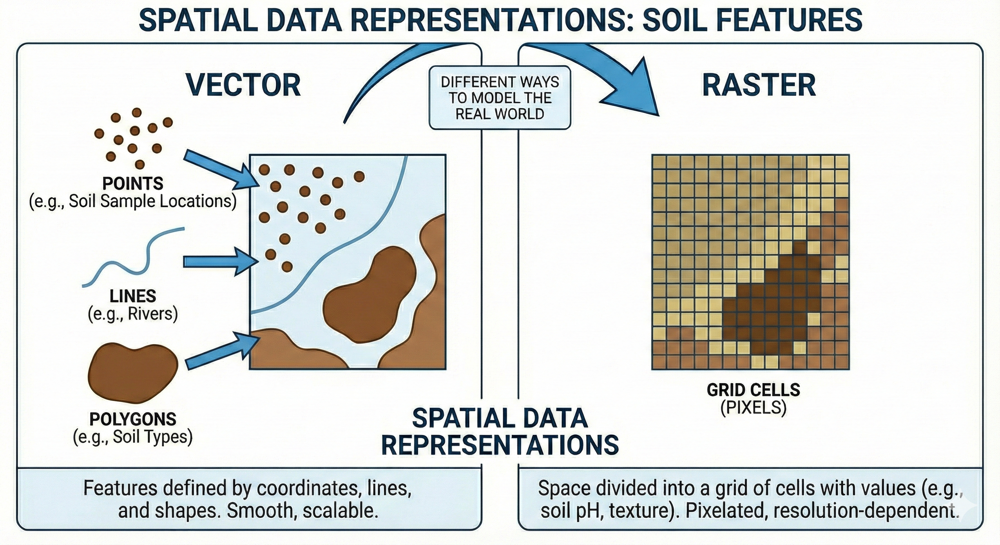
```

**Vector data** represent features as geometries (POINT, LINE, POLYGON) linked to an attribute table. They are ideal for representing discrete spatial objects such as soil sampling points, field boundaries, or landscape units.

*Table 1. Example of layer types and their associated geometry*

| Layer Type                        | Geometry |
|-----------------------------------|----------|
| Soil profile locations            | POINT    |
| Soil sampling locations           | POINT    |
| Rivers, roads                     | LINE     |
| Fields of sampling plots          | POLYGON  |
| Farms / Administrative boundaries | POLYGON  |
| Land units, physiographic regions | POLYGON  |


**Raster data** represents the landscape as a grid of equally sized cells, each storing a numeric value representing an area defined by the spatial resolution of the raster layer. Raster layers are ideal for continuous spatial phenomena such as soil properties in Digital Soil Mapping .

Examples of raster layers include:

 - Digital Elevation Models (DEM)

 - Climate variables (rainfall, temperature)

 - Remote sensing indices (NDVI, Sentinel-2 bands)

 - Soil property predictions (SOC, pH, clay%)

 - Moisture or vegetation products from satellites

Both data structures are complementary, and both are required for the creation of digital soil maps.


####  Coordinate Reference Systems (CRS) and Projections

A Coordinate Reference System (CRS) defines how spatial coordinates relate to positions on Earth. Because Earth is curved, and maps are flat, different CRS systems use different mathematical models to translate the curved space to a planar surface.

The choice of CRS has a major impact on the accuracy of distances, areas, buffer operations, overlays between layers, and spatial modelling outputs.

All spatial objects must should include a CRS as part of their metadata. Many common spatial errors come from mixing layers with different or missing CRS.


##### Geographic vs projected coordinate systems {-} 

In Geographic Coordinate Systems (GCS), coordinates are expressed in latitude and longitude with units in `degrees` (°) (a common example is `EPSG:4326 (WGS84)`).

Geographic Coordinate Systems are suitable for storing global data, but they are not appropriate for distance, area, or buffering calculations because degrees are angular units and the ground distance represented by one degree varies with latitude (Fig. \@ref(fig:degreeLat)). This variation leads to distortions in distance and area calculations.

```{r degreeLat, echo=FALSE, fig.cap="Distance distortion in GCS, where the physical distance of one degree varies by latitude", out.width='100%'}
knitr::include_graphics("images/module1/degreeEq.png")
```

To overcome these limitations, Projected Coordinate Systems (PCS) are designed to reduce distortion over a specific region by transforming the curved surface of the Earth onto a flat plane. In a PCS, coordinates are expressed in linear units (usually meters), which makes them suitable for accurate geometric operations such as distance, area, and buffering. Typical examples include UTM zones (e.g., `EPSG:32614`, `EPSG:32632`), national grid systems, and local projections optimized for area-specific precision. 

To find and compare appropriate CRS options for your data, you can explore available CRS definitions using [https://epsg.io](https://epsg.io/ "epsg.io: Coordinate Systems Worldwide").


#### Spatial Packages in R: `{sf}` and `{terra}`

##### Installing and Loading Spatial Packages {-}

`{sf}` and `{terra}` packages are available at CRAN and can be installed using the known `install.packages()` function.

```{r install-sf-terra, echo=TRUE, eval=FALSE}
  install.packages("sf")
  install.packages("terra")
```
  
Once the packages are installed, you must load them in your R session:
  
```{r load-sf-terra, echo=TRUE, eval=FALSE}
  library(sf)
  library(terra)
```


##### Working with Vector Data using `{sf}` {-}

The `{sf}` package implements the *Simple Features* standard for spatial vector data in R. A *simple feature* is a geometric object (point, line, polygon, etc.) linked to one or more **attributes** (e.g., soil type, pH, land use). 

In practice, an *`sf` object* is essentially a data frame that includes a geometry column and an associated coordinate system. Thus, it combines:\

1.  **Attributes** -- ordinary columns (e.g., plot ID, pH, SOC, soil type) just like in a regular data frame.\
2.  **Geometry column** -- typically named `geom` or `geometry`, storing coordinates and geometry type.\
3.  **CRS** -- information about the coordinate system used (e.g., WGS84, UTM), as part of the object.\


###### Importing and Exporting Vector Data {-}

Vector data represent discrete geographic features such as soil profile locations, field plots, administrative boundaries, roads, or land units.
Vector data is typically stored in formats such as Shapefile, GeoPackage, GeoJSON, or other OGC-compliant files, but can also be stored in plain files with associated coordinates such as `CSV` files.


###### Creating spatial vector objects from `CSV` files {-}

Spatial point layers in R can be created directly from regular data frames using the `{sf}` package.
The function `st_as_sf()` converts a data frame into a spatial (vector) object, as long as the data frame contains coordinate columns (e.g., longitude and latitude or projected X/Y coordinates).
To perform this conversion, users must specify the columns containing the coordinates. Even if not mandatory, it is highly recommended also to set the coordinate reference system:

Since importing a `.csv` file in R typically produces a data frame, the workflow is essentially the same as in the previous example. Once the table is loaded and includes coordinate columns (e.g., X and Y in longitude/latitude), it can be converted to an sf object using `st_as_sf()` by specifying the coordinate columns and the CRS.

```{r csv-to-sf, echo=TRUE, eval=FALSE}
# Import the previously standardized dataset for 0-30 cm depth 
output_dir <-"03_outputs/module1/"
kdata <- read.csv (paste0(output_dir,"KSSL_DSM_0-30.csv"))
# Convert to sf: create POINT geometry from lon/lat, set CRS = WGS84 (EPSG:4326)
soil_sf <- st_as_sf(kdata, coords = c("lon", "lat"), crs = 4326)
# Print object geometry
soil_sf$geometry
# Print CRS details
st_crs(soil_sf)
```

The Coordinate Reference System (CRS) has been provided as an argument within the  `st_as_sf()` function. Users can visualize CRS of sf objects with `st_crs()`. the sf object can be transformed to shapefile with `st_write`.


###### Exporting sf objects {-}
Simple features objects can be saved to files or databases using the `st_write()` function.

```{r sf-to-file, echo=TRUE, eval=FALSE}
# Export as shapefile
st_write(soil_sf, paste0(output_dir,"soil_profiles.shp"), delete_layer = TRUE) # overwrites shp

```

###### Importing Shapefiles {-}

Shapefiles can be directly imported into R using the `st_read()` function. You can also import most other vector formats with the same command, because `{sf}` automatically detects the file type.

The following chunk imports the soil sampling locations from the cleaned KSSL dataset. This layer represents individual soil pits or auger locations, with coordinates and measured properties stored in the attribute table. The chunk also plots pH values for a quick visual check of the spatial distribution of the data.

```{r shp-to-sf, echo=TRUE, eval=FALSE}
# Read the previously created shapefile containing soil profile points
soil_sf <- st_read(paste0(output_dir,"soil_profiles.shp"))
# Inspect the first rows
head(soil_sf)
# Quick visualization
plot(soil_sf["pH"], pch = 16, cex = 0.6, key.pos = 1)  # key.pos controls legend position

```

```{r shp-to-sf-hidden, echo=FALSE, eval=TRUE}
# Inspect the first rows
head(soil_sf)
# Quick visualization
plot(soil_sf["pH"], pch = 16, cex = 0.6, key.pos = 1)  # key.pos controls legend position
```


##### Setting and Reprojecting CRS for vector data {-}

It is good practice to always confirm the Coordinate Reference System (CRS) of your spatial data. If the CRS is missing or incorrectly specified, spatial operations such as buffering, distance, and overlay may fail or return misleading results.

As shown previously, the CRS can be defined when creating an sf object (e.g., with `st_as_sf()`). You can inspect the CRS of an `sf` object with `st_crs()`. If the CRS is missing, you can assign it with `st_set_crs()`. To reproject the data into a different CRS (i.e., change the coordinate values to a new reference system), use `st_transform()`.

Example: Converting the sf object `soil_sf` from Geographic WGS84 (EPSG:4326) to WGS 84 / Pseudo-Mercator (EPSG:3857), a projection commonly used for web mapping.

```{r vector-transform, echo=TRUE, eval=TRUE}
sf_3857 <- st_transform(soil_sf, 3857)

# Preview of the projected object
head(sf_3857)
```


##### Inspecting and manipulating `{sf}` Object {-}

Because `sf` objects inherit from the `data.frame` class, you can explore an sf object with the same tools as data frames (`class()`,`str()`, `summary()`), plus a few `{sf}` helpers (`st_geometry_type()`).

```{r vector-geom, echo=TRUE, eval=TRUE}
# Check structure
str(soil_sf)
# Summary of attributes + geometry
summary(soil_sf)
# Check the geometry type. Use head to avoid long printing
head(st_geometry_type(soil_sf))
# Check the CRS:
st_crs(soil_sf)
# Check the spatial extent of the object:
st_bbox(soil_sf)
```


`{sf}` objects can be manipulated in the same way as standard data frames while retaining all spatial information.
Base R and `{dplyr}` verbs such as `filter()`, `select()`, `mutate()`, can be directly applied on `sf` objects .

```{r vector-dplyr, echo=TRUE, eval=TRUE}
# Subset sf rows and columns using the pipping (%>%) operator with {dplyr}
alkaline <- soil_sf %>%
  filter(pH > 7.4) %>%
  select(ProfID, pH) %>%
  mutate(alkaline = TRUE)
# Preview alkaline data
head(alkaline)
```


##### Geometry Operations {-}

Geometry operations help you **create new geometries** (e.g., buffers) and **combine layers** (e.g., clip points to a boundary). In soil science, they are often used to define sampling influence areas, restrict data to an administrative unit, or summarize results by region.

:::warning-box
For distance and area-based operations (buffers, distances, areas), work in a Projected CRS (units in metres), not in lon/lat degrees.
Before any geometry operation, make sure both layers are in the same CRS.
:::


###### Buffering Plots (Influence Area) {-}
  
Buffers are regions created at a fixed distance around geometries (points, lines, or polygons).\
In soil applications, buffers can represent:
  
-   The influence area of a contaminating facility (polygon geometry).
-   Proximity zones around rivers or roads (line geometry).
-   Buffer zones around soil sampling points to define their spatial influence (point geometry).

The function `st_buffer()` is used for this. If the input dataset is in a Geographic Coordinate System (longitude/latitude in degrees), you should first transform it to a Projected Coordinate System (units in metres) before buffering.

```{r vector-buffer, echo=TRUE, eval=FALSE}
# Original KSSL data is in WGS84 EPSG:4326  geographic coordinates(lon/lat)
# Transform the subset of alkaline soils to NAD83 / UTM 14N (EPSG: 26914)
alkaline_utm <- st_transform(alkaline, crs = 26914)  # UTM 14N, distance in metres

# Create a 1 km buffer around each plot
plots_buffer_1k <- st_buffer(alkaline_utm, dist = 1000)

# Plot buffers (first 3 plots) and then overlay the same points
plot(st_geometry(plots_buffer_1k[1:3, ]), 
     col = rgb(0, 0, 1, 0.3), border = "blue",
     main = "Plot of first 3 alkaline soils with 1 km buffers")
# Overlay the original sample locations
plot(st_geometry(alkaline_utm[1:3, ]), 
     add = TRUE, pch = 16, col = "red")

```

```{r vector-buffer-image, echo=FALSE, eval=FALSE}
# This chunk is only to create the image. No eval or echo
png("SoilFER-Training-Resources/01_outputs/buffer_samples.png", width = 862, height = 708, res = 150)
# --- Nicer plot (with coordinates, grid, and cleaner titles) ---
# Use a tight common extent around the 3 buffers
bb  <- st_bbox(plots_buffer_1k[1:3, ])
pad <- 0.08
xpad <- as.numeric(bb$xmax - bb$xmin) * pad
ypad <- as.numeric(bb$ymax - bb$ymin) * pad
xlim <- c(bb$xmin - xpad, bb$xmax + xpad)
ylim <- c(bb$ymin - ypad, bb$ymax + ypad)

op <- par(mar = c(3.2, 3.2, 1.4, 0.8), xaxs = "i", yaxs = "i", cex.axis = 0.8)

# Buffers first
plot(st_geometry(plots_buffer_1k[1:3, ]),
     col = rgb(0, 0, 1, 0.25), border = "blue",
     xlim = xlim, ylim = ylim, asp = 1,
     axes = TRUE, xlab = "", ylab = "")

grid(nx = NULL, ny = NULL, lty = 3, col = "grey85")
title("1 km buffer around sampling sites", line = 0.2, cex.main = 0.95)
mtext("Easting (m)", side = 1, line = 2.0, cex = 0.9)
mtext("Northing (m)", side = 2, line = 2.0, cex = 0.9)

# Points on top (slightly transparent)
plot(st_geometry(alkaline_utm[1:3, ]),
     add = TRUE, pch = 16, cex = 0.5,
     col = rgb(1, 0, 0, 0.75))

legend("topright",
       legend = c("1 km buffer", "Sampling site"),
       pt.cex = c(NA, 1),
       pch = c(NA, 16),
       lwd = c(NA, NA),
       fill = c(rgb(0, 0, 1, 0.25), NA),
       border = c("blue", NA),
       bty = "n")

par(op)
dev.off()
```


```{r, echo=FALSE, fig.cap="1 km buffer around sampling points ", out.width='70%', fig.align='center'}
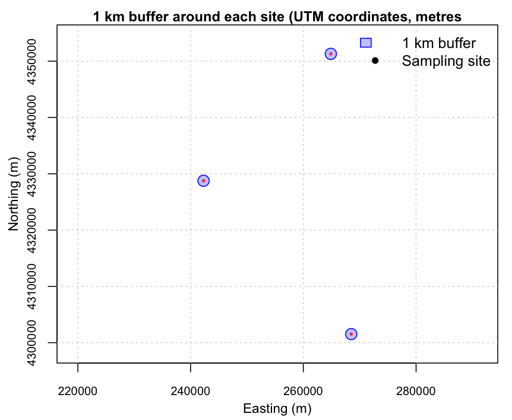
```


###### Clip Soil Data to Defined Boundaries {-}

In soil data management workflows, it is common to restrict analyses to a defined study area (e.g., a county, district, watershed, or project boundary). This helps ensure that summaries, maps, and models are computed only for the relevant spatial extent.

Two core operations are used repeatedly in Soil Data Management and Digital Soil Mapping:

* **Clip / subset by boundary** (`st_intersection()`): keeps only the features (or parts of features) that fall inside a target boundary.

* **Dissolve boundaries** (`st_union()`): merges multiple polygons into a single boundary by removing internal borders.

Use **clipping** to restrict soil profiles, samples, or observations to a target area before analysis or reporting.

Use **dissolving** to build a clean study boundary for masking, cropping, mapping, or aggregating results at a higher level.


**Example 1: Clip sampling points to one administrative unit**

In this example, we clip KSSL sampling points to Riley County. The steps are:

 - Read the administrative boundaries layer.

 - Transform it to the CRS of the soil points (so layers align).

 - Select the target polygon (Riley).

 - Clip the soil points to that polygon.

```{r vector-clip, echo=TRUE, eval=FALSE}
# Read administrative boundaries (example file)
admin <- st_read("01_data/module1/shapes/Tiger_2020_Counties.shp")
# Ensure both layers share the same CRS
admin <- st_transform(admin, st_crs(soil_sf))
# Example: select one unit (replace with your column/value)
study_area <- admin[admin$NAME == "Riley", ]
# Keep only points inside the study area
soil_clip <- st_intersection(soil_sf, study_area)
# Plot result
plot(st_geometry(study_area), col = NA, border = "black", main="Sampled soils in Riley County", cex.main = 1 )
plot(st_geometry(soil_clip), add = TRUE, pch = 16, col = "red", cex = 0.6)
```


```{r vector-clip-image, echo=FALSE, eval=FALSE}
# This chunk is only to create the image. No eval or echo
png("SoilFER-Training-Resources/01_outputs/riley_samples.png", width = 862, height = 708, res = 150)
# Ensure both layers share the same CRS
admin <- st_transform(admin, st_crs(soil_sf))
# Example: select one unit (replace with your column/value)
study_area <- admin[admin$NAME == "Riley", ]
# Keep only points inside the study area
soil_clip <- st_intersection(soil_sf, study_area)
# Plot result
plot(st_geometry(study_area), col = NA, border = "black", main="Sampled soils in Riley County", cex.main = 1 )
plot(st_geometry(soil_clip), add = TRUE, pch = 16, col = "red", cex = 0.6)
dev.off()
```

```{r, echo=FALSE, fig.cap="Sampled soils in Riley County", out.width='50%', fig.align='center'}
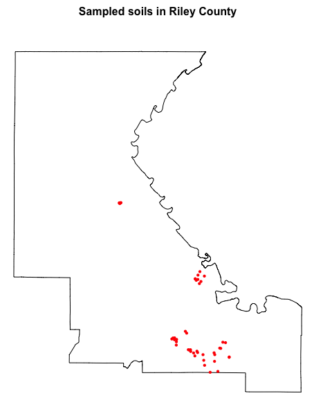
```


In this case, `soil_clip` preserves all attributes from the original sampling dataset (`soil_sf`) and includes the attributes of the administrative polygon `admin` at each point.

**Example 2: Dissolve polygons to create a single study region boundary**

Dissolving is useful when you want a single boundary for a larger study region. For example, you may want to combine all counties into a single Kansas state outline (or merge multiple polygons representing a project area).

`st_union()` merges all polygons into one geometry and removes internal borders.

```{r vector-dissolve, echo=TRUE, eval=FALSE}
# Dissolve all counties into one Kansas boundary
admin_dissolved <- st_union(admin)
# Plot comparison: before vs after dissolve
# Adjust graphics settings to 1 row x 2 columns layout with tight margins
op <- par(
  mfrow = c(1, 2),
  mar = c(0.5, 0.5, 0.1, 0.5),  # very small top margin
  xaxs = "i", yaxs = "i"
)
plot(st_geometry(admin[1]),
     col = NA, border = "black",
     axes = FALSE, asp = 1)
title("Before dissolve", line = -0.6, cex.main = 0.95)
plot(st_geometry(admin_dissolved),
     col = NA, border = "black",
     axes = FALSE, asp = 1)
title("After dissolve", line = -0.6, cex.main = 0.95)
# restore graphics settings
par(op)
```

```{r vector-dissolve-image, echo=FALSE, eval=FALSE}
# This chunk is only to create the image. No eval or echo
png("SoilFER-Training-Resources/01_outputs/dissolve_before_after.png",
    width = 1800, height = 900, res = 200)

bb <- st_bbox(admin_dissolved)
pad <- 0.02
xpad <- as.numeric(bb$xmax - bb$xmin) * pad
ypad <- as.numeric(bb$ymax - bb$ymin) * pad
xlim <- c(bb$xmin - xpad, bb$xmax + xpad)
ylim <- c(bb$ymin - ypad, bb$ymax + ypad)

op <- par(
  mfrow = c(1, 2),
  mar = c(3.0, 3.0, 1.2, 0.8),
  xaxs = "i", yaxs = "i",
  cex.axis = 0.6   # smaller tick labels
)

plot(st_geometry(admin),
     col = NA, border = "black",
     xlim = xlim, ylim = ylim,
     axes = TRUE, asp = 1,
     xlab = "", ylab = "")
grid(nx = NULL, ny = NULL, lty = 3, col = "grey85")
title("Before dissolve", line = 0.2, cex.main = 0.95)
mtext("Longitude", side = 1, line = 2.0, cex = 0.85)
mtext("Latitude",  side = 2, line = 2.0, cex = 0.85)

plot(st_geometry(admin_dissolved),
     col = NA, border = "black",
     xlim = xlim, ylim = ylim,
     axes = TRUE, asp = 1,
     xlab = "", ylab = "")
grid(nx = NULL, ny = NULL, lty = 3, col = "grey85")
title("After dissolve", line = 0.2, cex.main = 0.95)
mtext("Longitude", side = 1, line = 2.0, cex = 0.85)
mtext("Latitude",  side = 2, line = 2.0, cex = 0.85)

par(op)
dev.off()
```

```{r, echo=FALSE, fig.cap="Dissolving polygons on Kansas County vector data", out.width='100%'}
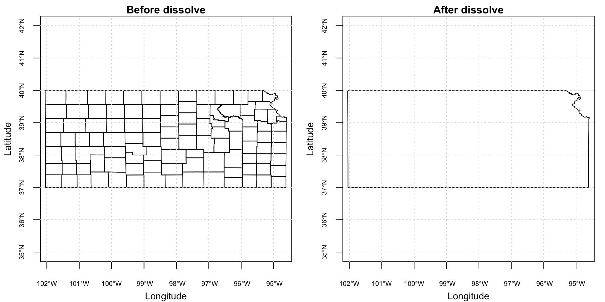
```


###### Spatial Relationships and Joins {-}

Spatial relationships help answer questions about how spatial features relate to one another (e.g., whether a point falls inside a polygon, or how far two features are apart).

**Spatial predicates** (return TRUE/FALSE relationships):

 - `st_intersects()` (touch/overlap)

 - `st_within()` (inside)

 - `st_distance()` (distance between features)

**Spatial joins** attach attributes from one layer to another:

 - `st_join()` (e.g., assign each soil profile to an administrative unit)

Example: assign each sampling point to an administrative polygon.

```{r vector-join, echo=TRUE, eval=TRUE}
# Ensure both layers share the same CRS
alkaline <- st_transform(alkaline, st_crs(admin))
# Join admin attributes to points (points inherit polygon attributes)
alkaline_with_admin <- st_join(alkaline, admin, join = st_within)
# Preview result
head(alkaline_with_admin)
```


##### Visualizing `{sf}` Objects {-}
  
As shown previously, `{sf}` objects can be quickly visualized using the base R `plot()` function. This is convenient for fast checks (e.g., verifying geometry and extent), but it offers limited control over plot appearance and legend design.

In contrast, `{ggplot2}` provides a consistent *'grammar of graphics'* that makes it easier to produce publication-ready maps. Key benefits include:

- Full control of aesthetics (colors, symbol size, line width, transparency) and clear legends.

- High-quality themes and consistent styling across figures (useful in reports and publications).

- Easy layering of multiple spatial objects (points, polygons, buffers, rasters—when combined with other tools).

- Faceting to compare maps by groups (e.g., land use class, sampling campaign, depth interval).

In `{ggplot2}`, spatial geometries are plotted with `geom_sf().`


```{r vector-plot, echo=TRUE, eval=FALSE}
library(ggplot2)
ggplot(data = soil_sf) +
  geom_sf(aes(color = pH), size = 2) +
  scale_color_viridis_c() +
  theme_minimal() +
  labs(
    title = "Soil sampling sites – pH",
    color = "pH"
  )

```

```{r vector-plot-image, echo=FALSE, eval=FALSE}
# This chunk is only to create the image. No eval or echo
png("SoilFER-Training-Resources/01_outputs/ggplot_ph.png", width = 1800, height = 900, res = 200)

ggplot(data = soil_sf) +
  geom_sf(aes(color = pH), size = 2) +
  scale_color_viridis_c() +
  theme_minimal() +
  labs(
    title = "Soil sampling sites – pH",
    color = "pH"
  )

dev.off()
```

```{r, echo=FALSE, fig.cap="Visualization of pH values with ggplot2", out.width='100%'}
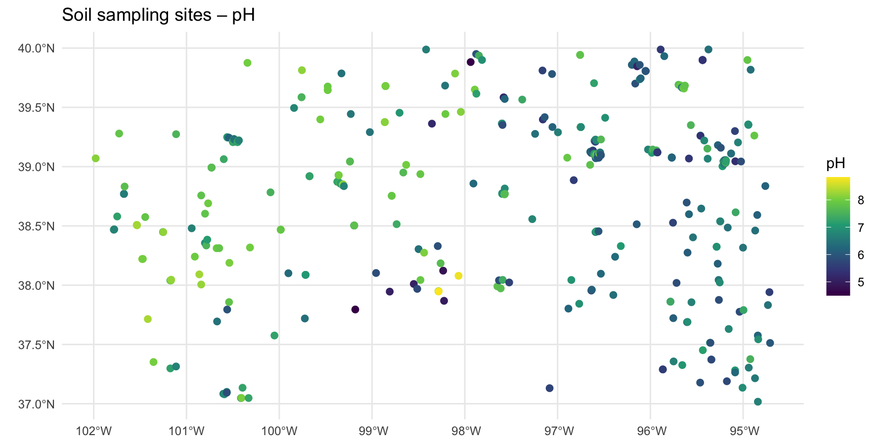
```

The possibilities for visualization with `{ggplot2}` are extensive. For more examples and options, see the `{ggplot2}` documentation and the `{sf}` vignettes on plotting with `geom_sf()`.

------------------------------------------------------------------------

### Preparing Raster Covariates

The workflows presented in this tutorial use environmental covariates as proxies to describe the spatial variation of soil properties. These covariates support two key steps:

- **Sampling design**: covariates are used to identify environmental clusters that should be sampled, helping maximize the representation of soil variability while optimizing sampling effort.

- **Digital Soil Mapping**: soil properties measured at known point locations (vector data) are related to environmental characteristics (raster covariates) to train statistical or machine learning models that predict soil properties continuously across space.

The preparation of covariates is a time-consuming task. Therefore this tutorial uses a pre-compiled set of environmental covariates to fulfil these tasks. It assembles five categories of environmental covariates cloud-optimized GeoTIFF files.

**Climate data** is sourced from two complementary products. 

  - **CHELSA** (Climatologies at High resolution for the Earth's Land Surface Areas) provides long-term bioclimatic variables including mean annual temperature (bio1), annual precipitation (bio12), and extreme temperature and precipitation metrics (bio5, bio6, bio13, bio14, bio16, bio17), alongside potential evapotranspiration computed using the Penman-Monteith method and surface wind statistics. 
  
  - **TerraClimate** contributes monthly time series of maximum and minimum temperature, precipitation, and potential evapotranspiration spanning 1981 to the present, which are exported as multi-band images for subsequent temporal aggregation in R.

**Terrain data** is derived from the USGS SRTM 30 m Digital Elevation Model, from which slope, aspect, Topographic Position Index (TPI), and hillshade are computed on-the-fly within GEE. Geomorphological landform classification at 90 m resolution is obtained from the `Geomorpho90m` dataset. Additionally, pre-computed terrain derivatives at 250 m resolution (elevation, slope, curvature, TPI, TWI) are loaded from the FAO GSP shared GEE asset library hosted at `projects/digital-soil-mapping-gsp-fao`.

**Vegetation and soil indices** are computed from Sentinel-2 Surface Reflectance imagery (Copernicus/S2\_SR\_HARMONIZED), filtered to scenes with less than 10% cloud cover and cloud-masked using the QA60 quality band. The script computes the Normalized Difference Vegetation Index (NDVI), Enhanced Vegetation Index (EVI), Normalized Difference Bareness and Soil Index (NDBSI), Redness Index, Brightness Index, NBR+, and the Visible-Near-Short-wave Infrared Index (VNSIR). Seasonal vegetation dynamics are additionally captured through MODIS FPAR mean and standard deviation layers for four three-month periods covering the full annual cycle.

**Soil Available Water Content** represent the mean available water capacity (AWC - in mm) of soil from 0 to 200 cm depth.

**Land cover** is represented by the ESA WorldCover 2021 product at 10 m resolution, from which a cropland mask is derived by isolating the cropland class (value 40) for use in masking or stratified analyses.


> Note: users need to have a google account to access the covariate data.


##### Download Covariate Rasters {-}

A dedicate Google Drive folder has been created to store large raster files used in this tutorial. Users can obtain the data directly from the folder `rasters` following link:
[https://drive.google.com/drive/folders/1K7tq9zX5HsqbqWcNoT27WtfPtehcKBCu](https://drive.google.com/drive/folders/1K7tq9zX5HsqbqWcNoT27WtfPtehcKBCu)

Data in this folder includes:

 - [**Cropland_Mask_KANSAS.tif**](https://drive.google.com/file/d/1wh6xSW03YKrCHScJJa0c_cSA1XZ8tYY-/view?usp=drive_link) (22.5 mb): Binary raster with presence (1) and absence (NA) of crops in Kansas at 20 meter resolution. This file is used as a mask to avoid non-cropped areas in the analyses. 
 - [**Environmental_Covariates_250m_KANSAS.tif**](https://drive.google.com/file/d/1wURPmPLi2LdYq6zBhZN1e91EiiZsk8oX/view?usp=drive_link) (203.2 mb): Multi-layer raster stack with climatic, remote sensing, topographic information at 250 meter resolution.
 - [**HighRes_Covariates_100m_Kansas.tif**](https://drive.google.com/file/d/1xf89gn4pBKsb5ynVIfKZd4MbT3ZL1Nf2/view?usp=drive_link) (535.6 mb). 100 m resolution rasters with remote sensing derived information.
 - [**DEM_KANSAS.tif**](https://drive.google.com/file/d/14KmmjjTfVD7jTEuQqCLkfcQmXy0VBDkA/view?usp=drive_link) (21.4 mb). 100 m resolution rasters with remote sensing derived information.
 - [**Slope_KANSAS.tif**](https://drive.google.com/file/d/1rESziVFlEvEEmrKacb88R1pKZxbrU7qS/view?usp=drive_link) (61.2 mb). 100 m resolution rasters with remote sensing derived information.
 - [**Geomorphon_Landforms_KANSAS**][@amatulli2020_geomorpho90m](https://drive.google.com/file/d/1E03U42UPl9SKMfUGZZ8qDCno2H_kPxUB/view?usp=drive_link) (14.9 mb). 90 m resolution raster of geomorphological types from Geomorpho90m – Global High-Resolution Geomorphometry Layers.
 - [**TerraClimate_AvgTemp_1981_2023_KANSAS.tif**](https://drive.google.com/file/d/1TyyErHkQeNW9Q_wchW9Fa_0UpdaWS_-_/view?usp=drive_link) (17.7 mb). 100 m TerraClimate monthly averaged Temperature rasters from 1981-2023.
 - [**TerraClimate_PET_1981_2023_KANSAS.tif**](https://drive.google.com/file/d/1b9wM3zwggBFS98pFEyWUFtpKN9ORq9we/view?usp=drive_link) (17.2 mb). 100 m TerraClimate monthly averaged Potential Evapotranspiration rasters from 1981-2023.
 - [**TerraClimate_Precip_1981_2023_KANSAS.tif**](https://drive.google.com/file/d/1xq6y8jNUjDbipXHQE1w67f_vxQeXACkH/view?usp=drive_link) (11.9 mb).  100 m TerraClimate monthly accumulated mean Precipitation rasters from 1981-2023.
 - [**sol_available.water.capacity_usda.mm_m_250m_0..200cm_1950..2017_v0.1.tif**][@gupta_zenodo_2019](https://drive.google.com/file/d/1nG0yCr-tNPzeeEvzcGrtdQxRHnQ6NMH5/view?usp=drive_link).  250-meter resolution geospatial raster dataset representing the mean available water capacity (AWC - in mm) of soil from 0 to 200 cm depth.
 - [**ESA_WorldCover_2021_KANSAS**][@zanaga2022_worldcover2021_v200](https://drive.google.com/file/d/1xq6y8jNUjDbipXHQE1w67f_vxQeXACkH/view?usp=drive_link) (11.9 mb). 10 m resolution rasters of landcover types from the European Space Agency WorldCover,  based on Sentinel-1 and Sentinel-2 data.
 
 
*Table. ESA WorldCover (global land cover) legend, the class codes and color in the Map band.*

   | Value | Class                    | Color (hex) |
   | ----: | ------------------------ | ----------- |
   |    10 | Tree cover               | `#006400`   |
   |    20 | Shrubland                | `#ffbb22`   |
   |    30 | Grassland                | `#ffff4c`   |
   |    40 | Cropland                 | `#f096ff`   |
   |    50 | Built-up                 | `#fa0000`   |
   |    60 | Bare / sparse vegetation | `#b4b4b4`   |
   |    70 | Snow and ice             | `#f0f0f0`   |
   |    80 | Permanent water bodies   | `#0064c8`   |
   |    90 | Herbaceous wetland       | `#0096a0`   |
   |    95 | Mangroves                | `#00cf75`   |
   |   100 | Moss and lichen          | `#fae6a0`   |


##### Obtain Covariate Data from Google Earth Engine (GEE) {-}
 
The data can also be generated directly using Google Earth Engine (GEE). GEE provides direct access to many environmental datasets through a unified interface, allowing analysts to extract, compute, and export ready-to-use covariate stacks for any region of interest using a single script.

The script provided with this training (`02_scripts/module1/1_gee_soilfer_env_covariates.txt`) contains step-by-step instructions to download the covariate data from the GEE platform. 

The data has been already processed for this training and is available to download from this [link](https://drive.google.com/drive/folders/1EGrkhbMTi2qglemuD_onegAqLWZb3BbT). Place these files into the `training_data` folder within `01_data/module1`and set the path for the covariate rasters and spectral data:

```{r training_dir, echo=TRUE, eval=FALSE}
# Define the relative path to the folder with the downloaded covariates
# NOTE: Adapt this path to your project structure
  training_dir <-"01_data/module1/training_data"
```
  

##### Running the GEE Script {-}

Copy the full contents of `1_gee_soilfer_env_covariates.txt` into the GEE Code Editor. Before running, review and adjust the configuration variables at the top of the script (Section 1) to match your study area and requirements.

The `aoi` variable defines the `area of interest`. For the training exercise, this is already configured to use the US Census TIGER state boundary layer:

```javascript
var aoi = ee.FeatureCollection('TIGER/2018/States')
  .filter(ee.Filter.eq('NAME', 'Kansas'));
```

To adapt the script to a different study area, replace this definition with a custom geometry or a different administrative boundary. Update `countryName` to a short descriptor used in the exported file names.

The date range for TerraClimate is controlled by `climateStartDate` and `climateEndDate`. The default configuration covers the full 1981--2023 record. For exploratory or training purposes, restricting this range (e.g., 2000--2023) reduces processing time and export file sizes.

Export spatial resolutions are defined individually for each product category, reflecting the native resolution of each data source: 250 m for the primary CHELSA/MODIS covariate stack, 100 m for high-resolution terrain and Sentinel-2 layers, 90 m for geomorphons, 20 m for the cropland mask, and 4000 m for TerraClimate time series.

Click **Run** to execute the script. Visualization layers (SRTM DEM, Sentinel-2 RGB composite, and cropland mask) will appear on the map immediately. Export tasks do not start automatically --- navigate to the **Tasks** tab in the right panel and click **Run** next to each pending task to initiate the exports to Google Drive.

:::warning-box
**Processing Time and Quotas**

Large exports, particularly **TerraClimate** time series and **Sentinel-2** layers over large regions, can take tens of minutes to several hours depending on server load and area size. GEE free-tier accounts are subject to computation quotas. If a task fails with a computation timeout or memory error, consider reducing the export resolution or splitting the time series into shorter periods. Monitor task progress in the **Tasks** tab; completed files will appear in your `GEE_Exports` Google Drive folder once finished.
:::

Once all exports are complete, download the GeoTIFF files from Google Drive to your local working directory. In subsequent modules, these rasters will be loaded into R using the `terra` package and stacked into the covariate array used in the next modules.

#### Working with Raster Data using `{terra}`

The `{terra}` package is the main framework for working with raster spatial data in R. A raster represents space as a regular grid of cells, where each cell stores a value (e.g., elevation, land cover class, rainfall, SOC prediction). Raster layers are widely used in Digital Soil Mapping both as covariates (environmental predictors) and as model outputs (predicted soil properties).

In practice, a `terra::SpatRaster` object combines:

 * Cell values: the data stored in the grid cells (continuous values like temperature, or categorical values like land cover).

 * Spatial geometry: the grid definition given by the extent (spatial coverage) and resolution (cell size).

 * CRS: the coordinate reference system used (e.g., WGS84, UTM).

 * Layers: a raster can have one layer (e.g., DEM, SOC) or multiple layers (a covariate stack).
 
 
##### Importing and Exporting Raster Data {-}

Raster files are commonly distributed as GeoTIFFs (.tif). The function `rast()` reads both single-layer and multi-layer rasters. Rasters can be exported back to disk with `writeRaster()`.


```{r read-raster, echo=TRUE, eval=FALSE}
library(terra)
# Read a single-layer raster (e.g., cropland mask or DEM)
crops <- rast(paste0(training_dir,"Cropland_Mask_KANSAS.tif"))
# Read a multi-layer raster (e.g., environmental covariates stack)
covs <- rast(paste0(training_dir,"Environmental_Covariates_250m_KANSAS.tif"))
```


To save raster data to disk use `writeRaster`:

```{r write-raster, echo=TRUE, eval=FALSE}
# Export a raster as GeoTIFF
writeRaster(crops, "03_outputs/module1/Cropland_Mask_KANSAS.tif", overwrite = TRUE) # overwrites tif
```

##### Inspecting and Exploring `SpatRaster` Objects {-}

Before analysis, inspect the spatial properties (extent, resolution, CRS), the number of layers, and the value ranges. This helps detect common issues such as mismatched CRS, unexpected resolution, incorrect extents, or missing data patterns.

```{r raster-inspection, echo=TRUE, eval=FALSE}
# Basic metadata (prints summary to console)
covs
# Number of layers
nlyr(covs)
# Spatial properties
ext(covs)
res(covs)
crs(covs)
# Layer names (multi-layer rasters)
names(covs)
# Value ranges for the first 4 layers
global(covs[[1:4]], fun = "range", na.rm = TRUE)
# Histograms of the first 4 layers
# Adjust graphics settings to 2 row x 2 columns layout with tight margins
op <- par(
  mfrow = c(2, 2),
  mar  = c(3.5, 3.5, 2.2, 1.2),  # more space around each panel
  oma  = c(1, 1, 1, 1),          # extra space around the whole figure
  mgp  = c(2.2, 0.7, 0)          # axis title/labels spacing
)

for (i in 1:4) {
  hist(covs[[i]],
       main = paste("Histogram of", names(covs)[i]),
       xlab = names(covs)[i])
}
# restore previous graphics settings
par(op)
```


```{r, echo=FALSE, fig.cap="Visualization of histograms of covariates", out.width='100%'}
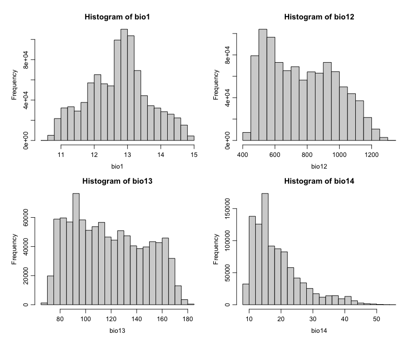
```

:::warning-box
For most raster operations, rasters should share the same CRS, resolution, and extent. If they do not, they typically need adjustment using functions such as `project()`, `resample()`, and `crop()` before combining.
:::

##### Raster Visualization {-}

Rasters can be quickly visualized using `plot()`. For multi-layer rasters, it is common to plot a subset of layers.

```{r plot-raster, echo=TRUE, eval=FALSE}
# Plot single-layer crops raster mask
plot(crops, main="Cropland Mask")
```

```{r, echo=FALSE, fig.cap="Visualization of raster crop mask", out.width='100%'}
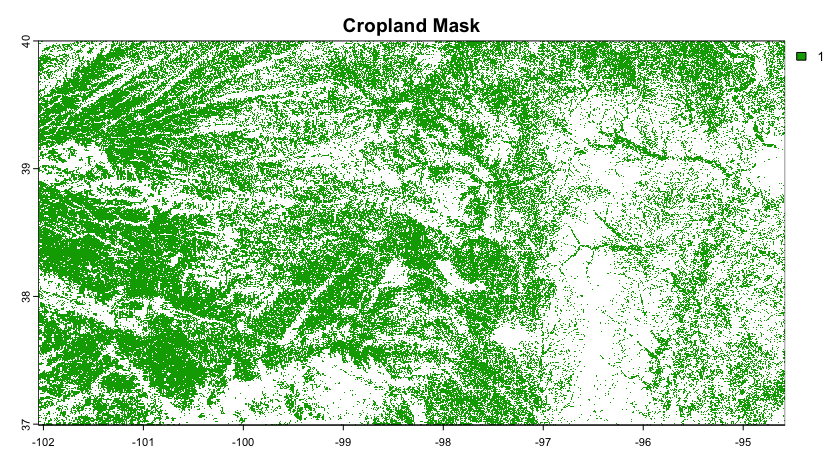
```

```{r plot-raster-covs, echo=TRUE, eval=FALSE}
# Plot a multi-layer raster (e.g., environmental covariates stack)
plot(covs)
```

```{r, echo=FALSE, fig.cap="Visualization of covariates", out.width='100%'}
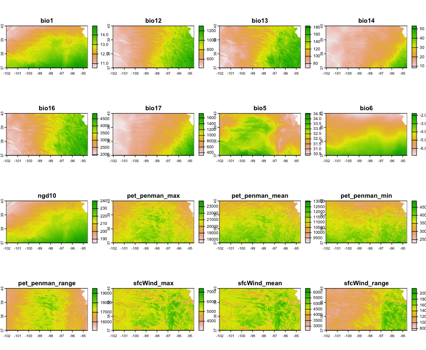
```

You can also plot specific layers by name:

```{r raster-plot-byname, echo=TRUE, eval=FALSE}
# Plot Elevation and Temperature from the covs stack
# Adjust graphics settings to 1 row x 2 columns layout with tight margins
op <- par(
  mfrow = c(1, 2),
  mar = c(0.5, 0.5, 0.5, 0.5),
  xaxs = "i", yaxs = "i"
)
plot(covs[["dtm_elevation_250m"]], main = "Elevation (DEM)", cex.main = .8)
plot(covs[["bio1"]], main = "Annual Mean Temperature", cex.main = .8)
par(op) # restore previous graphics settings
```

```{r, echo=FALSE, fig.cap="Visualization of Elevation and Temperature", out.width='100%'}
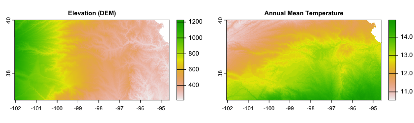
```


##### Setting and Reprojecting CRS for Raster Data {-}
Rasters also have a CRS. You can inspect it with `crs()`. To reproject a raster to a new CRS, use `project()`. Reprojection may change the grid and requires interpolation (resampling), so it is more computationally intensive than vector reprojection.

```{r raster-reproject, echo=TRUE, eval=FALSE}
# Inspect CRS
crs(covs)
# Reproject raster (example: to EPSG:3857)
covs_3857 <- project(covs, "EPSG:3857")
```


##### Spatial Operations on Rasters {-}

Raster operations are used to prepare consistent covariate stacks, restrict layers to a study area, and combine tiled outputs.

###### Merge rasters (mosaic) {-}

Adjacent raster tiles can be merged into a single, continuous layer using `mosaic()`. This is common when rasters are exported as tiles (e.g., from Google Earth Engine). In the example below, two binary cropland mask tiles are mosaicked and written as a compact GeoTIFF.

```{r raster-mosaic, echo=TRUE, eval=FALSE}
# Read input rasters (adjacent tiles)
r1 <- rast(paste0(training_dir,"Cropland_Mask_KANSAS-0000000000-0000000000.tif"))
r2 <- rast(paste0(training_dir,"Cropland_Mask_KANSAS-0000000000-0000023296.tif"))
# Mosaic into a single raster
m <- mosaic(r1, r2, fun = "max")
# Cast to integer to optimize file size (not valid for non-integer continuous data)
m <- as.int(m)
# Write output with compression to reduce file size
writeRaster(m,"03_outputs/module1/Cropland_Mask_KANSAS.tif", overwrite = TRUE,
  wopt = list(datatype = "INT1U",  # Byte (0–255); NA retained as NoData
    gdal = c("COMPRESS=DEFLATE", "PREDICTOR=2", "ZLEVEL=9", "TILED=YES")
  )
)
```

 
###### Crop and mask to study area (`crop()`, `mask()`) {-}

Use `crop()` to reduce the raster extent, and `mask()` to set values outside the boundary to NA.

```{r raster-crop, echo=TRUE, eval=FALSE}
# Crop and mask covariates to the extent of Riley
# Align CRS of both datasets
admin <- st_transform(admin, crs(covs))
# Crop covariates to the extent of the county
covs_crop <- crop(covs, admin[admin$NAME=="Riley",])
# Mask covariates
covs_mask <- mask(covs_crop, admin[admin$NAME=="Riley",])

# Plot covariate (bio1 = temperature) in Riley County
# Adjust graphics settings to 1 row x 2 columns layout with tight margins
op <- par(
  mfrow = c(1, 2),
  mar = c(0.5, 0.5, 0.5, 0.5),
  xaxs = "i", yaxs = "i"
)
plot(covs_crop[["bio1"]], main= "Crop", cex.main = 1)
plot(covs_mask[["bio1"]], main= "Mask", cex.main = 1)
# restore previous graphics settings
par(op) 

```


```{r, echo=FALSE, fig.cap="Differences of Crop and Mask outputs in raster data", out.width='80%'}
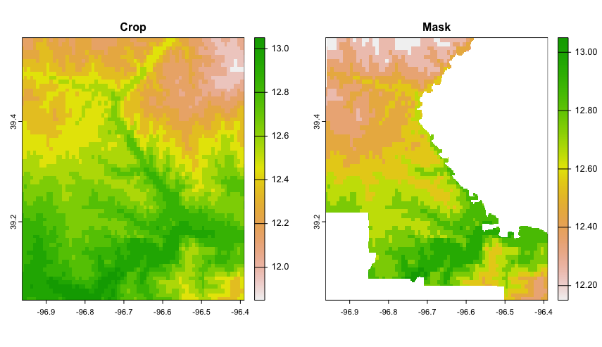
```


:::warning-box
**`crop()` and `mask()` are complementary operations.**

- `crop()`  reduces a raster to the extent of a vector polygon (it keeps all cells within the polygon’s bounding box), while `mask()` retains only the cells inside the polygon and sets values outside to `NA`.

- If you want to limit a raster to a specific boundary and keep only the data within that area, first apply `crop()`  and then `mask()`.

:::

###### Resampling and alignment (`resample()`) {-}

When combining rasters, they often need to be aligned to a common grid (same origin, resolution, and extent). The function `resample()` transfers values from one `SpatRaster` to the grid of another.

A key argument is method, which controls how new cell values are computed. Use `method = "near"` (nearest neighbour) for categorical/class rasters (e.g., land cover, masks) to avoid creating artificial mixed classes. Use `method = "bilinear"` (the default for numeric rasters) for continuous variables (e.g., temperature, elevation), where interpolation is appropriate.

```{r raster-resample, echo=TRUE, eval=FALSE}
# Align raster of crops to the grid of covariates
 crops_aligned <- resample(crops, covs, method = "near")
# Spatial properties of aligned crops and covariates are equal
ext(covs)
ext(crops_aligned)
res(covs)
res(crops_aligned)

```

Other methods (e.g., "cubic", "cubicspline", "lanczos") can produce smoother results for continuous surfaces, while summary methods such as "sum", "min", or "average" are useful when aggregating values from multiple input cells into larger output cells.

###### Combine and remove rasters in a raster stack {-}

Rasters with the same grid definition (same CRS, origin, resolution, and extent) can be combined into a single multi-layer `SpatRaster` (a 'stack'). This is useful for building covariate stacks for raster operations in Digital Soil Mapping.

```{r raster-combine, echo=TRUE, eval=FALSE}
# Set a clear layer name for the aligned cropland mask
names(crops_aligned) <- "crops"
# Add the cropland layer to the covariate stack
covs <- c(covs,crops_aligned)
# Check layer names
names(covs)
```

Layers can also be removed from the stack by subsetting the layers you want to keep.

```{r raster-remove, echo=TRUE, eval=FALSE}
# Remove "crops" from the stack
covs <- covs[[names(covs) != "crops"]]
# Check layer names
names(covs)
```

###### Raster Algebra {-}

Raster algebra creates raster layers by applying cell by cell mathematical or logical operations on existing rasters. It is used to derive new raster products such as indices, threshold-based masks, or reclassified maps. Rasters must have the same definition (CRS, origin, resolution, and extent).


```{r raster-algebra, echo=TRUE, eval=FALSE}
# Example: classify a continuous covariate into two classes
high_temperature <- covs[[1]] > 12
# Adjust graphics settings to 1 row x 2 columns layout with tight margins
op <- par(
  mfrow = c(1, 2),
  mar = c(0.5, 0.5, 0.5, 0.5),
  xaxs = "i", yaxs = "i"
)
plot(covs[["bio1"]], main= "Annual Mean Temperature", cex.main = .8)
plot(high_temperature, main= "High Temperature (>12ºC)", cex.main = .8)
par(op) # restore previous graphics settings
```

```{r, echo=FALSE, fig.cap="Reclassification of raster values with map algebra", out.width='100%'}
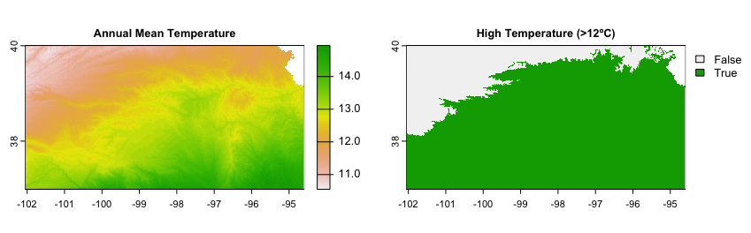
```


###### Combining environmental (Raster) and soil (Vector) information {-}

In Digital Soil Mapping, the calibration of statistical model need to link the analytical properties of soils with the environmental covariates. This is done by their overlapping position. To link soil observations (points) with environmental covariates (rasters), extract raster values at sample locations using `extract()`.

```{r raster-extract, echo=TRUE, eval=FALSE}
# Extract covariate values at point locations (soils_sf)
cov_values <- extract(covs, soil_sf)
```


The new object `cov_values` is a data frame which does not have the original data of the sf object `soil_sf`. A simple column bind command (`cbind`) can be used bind covariates to `soil_sf`, which remains an sf object keeping geometry (coordinates) and all original columns, plus the covariate columns.

```{r raster-bind, echo=TRUE, eval=FALSE}
# cov_values includes an ID column in the first column
soil_sf <- cbind(soil_sf, cov_values[ , -1, drop = FALSE])

```

This dataset contains all the information to be used in further analyses of Sampling Design and calibration of Digital Soil Mapping models.


#### Calculation of Soil–Climate Rasters (Newhall Simulation Model)

The Newhall Simulation Model (NSM) is a water-balance–based model originally developed to estimate soil moisture and soil temperature regimes from climate and site characteristics[@NewhallBerdanier1996]. It simulates the seasonal dynamics of soil water storage and temperature using monthly climate inputs and simple soil physical assumptions. The resulting regime classes (e.g., ustic, udic, xeric; and temperature regimes such as mesic or thermic) are widely used in soil survey and soil classification contexts, and they are also useful as environmental descriptors in DSM workflows.

In this tutorial, we use the R implementation of the NSM available in the `{jNSMR}` package.

The model requires several raster layers as inputs:

 * Monthly precipitation (pJan … pDec): drives water inputs into the soil water balance.

 * Monthly temperature (tJan … tDec): controls evapotranspiration demand and soil temperature dynamics.


 In addition to monthly precipitation and temperature, the Newhall Simulation Model also requires site descriptors that influence soil water balance and seasonality:

 * Elevation (DEM): to account for altitude-related effects on temperature (and therefore evapotranspiration and soil temperature patterns).

 * Available Water Capacity (AWC): to represent, in mm, how much water the soil can store (typically for a reference depth, e.g., 0–200 cm), which controls how quickly soils dry after rainfall.

 * Longitude and latitude: to provide each grid cell’s geographic position, supporting calculations that depend on seasonal timing and and solar geometry (e.g., daylength patterns and the timing of solstices used in some Newhall metrics such as 'days after summer solstice' or 'after winter solstice').
 
This workflow processes monthly temperature and precipitation data from large time series (1981--2023), computes long-term monthly averages, and prepares all the above described rasters in a stack to run the Newhall soil–climate model (via `{jNSMR}`). The output includes soil-climate diagnostics and regime classifications (e.g., temperature and moisture regimes), which can be used as covariates in Sampling Design and Digital Soil Mapping.

##### Environment setup {-}
 
The first step is to prepare the Environment setup (loading packages, define path to data files, and set the CRS).

```{r newhall-setup, echo=TRUE, eval=FALSE}
# Packages
library(terra)
library(sf)
library(dplyr)
library(jNSMR)

# Target CRS for the workflow (use a projected CRS for analysis)
epsg <- "EPSG:3857"   # Web Mercator (meters). Replace if needed.
agg.factor <- 1       # Optional aggregation to speed up Newhall calculations (1 = no aggregation)

```

##### Prepare monthly average rasters of climatic data {-}

TerraClimate files contains large time series (1981-2020) of climatic records. Monthly temperature and precipitation averages from these series must be calculated as independent raster files. Temperature in this dataset if scaled (e.g., ×10) to avoid decimal point data and save storage space this it has to be adjusted to real values. The following chunk computes the averages for every month across all years, producing a 12-layer raster stack of monthly averages.

```{r newhall-t-p-avg, echo=TRUE, eval=FALSE}
# Monthly temperature time series (multi-year, monthly layers)
tmp <- rast(paste0(training_dir,"TerraClimate_AvgTemp_1981_2023_KANSAS.tif"))

# Number of years in the stack (assuming complete years)
nyears <- nlyr(tmp) / 12

# Monthly means across all years
temp_list <- vector("list", 12)
tmp_ref <- tmp[[1]]  # reference layer for initializing
for(i in 1:12){
  var_sum <- tmp_ref * 0
  k <- i
  for(j in 1:nyears){
    var_sum <- var_sum + tmp[[k]]
    k <- k + 12
  }
  temp_list[[i]] <- var_sum / nyears
}
# Convert to stack
Temp_Stack <- rast(temp_list) * 0.1  # convert scaled values to °C (×0.1)
# Write to disk
writeRaster(Temp_Stack, "03_outputs/module1/Temp_Stack_monthlyMean.tif", overwrite = TRUE)


# Monthly precipitation time series (multi-year, monthly layers)
prec_mm <- rast(paste0(training_dir,"TerraClimate_Precip_1981_2023_KANSAS.tif"))
# Number of years in the stack (assuming complete years
nyears <- nlyr(prec_mm) / 12
# Monthly means across all years
prec_list <- vector("list", 12)
pre_ref <- prec_mm[[1]] # reference layer for initializing
for(i in 1:12){
  var_sum <- pre_ref * 0
  k <- i
  for(j in 1:nyears){
    var_sum <- var_sum + prec_mm[[k]]
    k <- k + 12
  }
  prec_list[[i]] <- var_sum / nyears
}
# Convert to stack
Prec_Stack <- rast(prec_list)
# Write to disk
writeRaster(Prec_Stack, "03_outputs/module1/Prec_Stack_monthlyMean.tif", overwrite = TRUE)
```

##### Prepare monthly average stack of climatic data {-}

NSM expects monthly precipitation and temperature layers with specific, predefined layer names.

```{r newhall-stack, echo=TRUE, eval=FALSE}
# Load outputs (reuse objects from above)
Prec_Stack <- rast("03_outputs/module1/Prec_Stack_monthlyMean.tif")
Temp_Stack <- rast("03_outputs/module1/Temp_Stack_monthlyMean.tif")


names(Prec_Stack) <- c("pJan","pFeb","pMar","pApr","pMay","pJun","pJul","pAug","pSep","pOct","pNov","pDec")
names(Temp_Stack) <- c("tJan","tFeb","tMar","tApr","tMay","tJun","tJul","tAug","tSep","tOct","tNov","tDec")

combined_stack <- c(Prec_Stack, Temp_Stack)
writeRaster(combined_stack, "03_outputs/module1/climate_vars.tif", overwrite = TRUE)
```


##### Prepare site descriptors that influence soil water balance and seasonality {-}

In addition to monthly precipitation and temperature, NSM uses a number of site descriptors influencing soil climate:

 - Elevation (DEM).

 - Available Water Capacity (AWC).

 - Longitude and latitude.
 
 These raster layers are obtained from different sources thus their geometry have to be harmonized to create a unique raster stack for the calculations. 
 
 
```{r newhall-resample, echo=TRUE, eval=FALSE}
# DEM
# Read raster
elev <- rast(paste0(training_dir,"DEM_KANSAS.tif"))
# Align CRS to the common EPSG
if(crs(elev) != epsg) elev <- project(elev, epsg, method = "near")

# AWC (0–200 cm, in mm)
# Read raster
awc <- rast(paste0(training_dir,"awc_KANSAS.tif"))
# Align CRS to the common EPSG
if(crs(awc) != epsg) awc <- project(awc, epsg, method = "near")
# Align geometries with the DEM raster
awc <- resample(awc, elev)
# Define name
names(awc) <- "awc"

# Temperature and Precipitation
# Read climate stack
newhall <- rast("03_outputs/module1/climate_vars.tif")
# Align CRS to the common EPSG
if(crs(newhall) != epsg) newhall <- project(newhall, epsg, method = "near")
# Align geometries with the DEM raster
newhall <- resample(newhall, elev)

# Longitude and Latitude 
# calculate lon/lat from the climate stack
newhall$lonDD <- init(newhall[[1]], "x")
newhall$latDD <- init(newhall[[1]], "y")

# Mask climate stack to DEM valid area and add DEM/AWC to the stack
newhall <- mask(newhall, elev)
newhall$awc  <- awc
newhall$elev <- elev

# Save full NSM input stack
writeRaster(newhall, "03_outputs/module1/climate_newhall_vars.tif", overwrite = TRUE)
```

##### Calculate NSM outputs {-}

Depending on resolution and extent, the calculation of the NSM can take hours. To reduce runtime you may aggregate the input stack (optional), then run `newhall_batch()` with multiple cores.

```{r newhall-compute, echo=TRUE, eval=FALSE}
# Read the full Newhall input stack
newhall <- rast("03_outputs/module1/cclimate_newhall_vars.tif")

# Optional: aggregate to speed up (e.g., fact = 2, 3, ...)
# newhall <- aggregate(newhall, fact = agg.factor)

system.time({
  newhall_results <- jNSMR::newhall_batch(newhall, cores = 4)
})
```

##### Inspect and export results (compact outputs) {-}

The NSM output includes the following layers:

```{r newhall-layer-table, echo=FALSE, message=FALSE, warning=FALSE}
library(knitr)
library(dplyr)
library(tibble)

newhall_layers <- tribble(
  ~layer, ~units, ~description,
  "annualRainfall", "mm/yr", "Total precipitation accumulated over the year.",
  "waterHoldingCapacity", "mm", "Soil water-holding capacity used by the model (plant-available storage over the modeled profile/control section).",
  "annualWaterBalance", "mm/yr", "Net annual water balance (precipitation − potential evapotranspiration) summed over the year; positive = surplus, negative = deficit.",
  "annualPotentialEvapotranspiration", "mm/yr", "Total annual potential evapotranspiration (atmospheric evaporative demand) summed over the year.",
  "summerWaterBalance", "mm (summer period)", "Net water balance during the model’s summer period (precipitation − potential evapotranspiration) for that season.",
  "dryDaysAfterSummerSolstice", "days", "Number of days classified as dry after the summer solstice (indicator of summer dryness duration).",
  "moistDaysAfterWinterSolstice", "days", "Number of days classified as moist after the winter solstice (indicator of post-winter moisture duration).",
  "numCumulativeDaysDry", "days", "Cumulative number of dry days across the year (sum of days meeting the model’s dry condition).",
  "numCumulativeDaysMoistDry", "days", "Cumulative number of moist-dry (intermediate) days across the year.",
  "numCumulativeDaysMoist", "days", "Cumulative number of moist days across the year.",
  "numCumulativeDaysDryOver5C", "days", "Cumulative number of dry days when temperature is > 5 °C.",
  "numCumulativeDaysMoistDryOver5C", "days", "Cumulative number of moist-dry days when temperature is > 5 °C.",
  "numCumulativeDaysMoistOver5C", "days", "Cumulative number of moist days when temperature is > 5 °C.",
  "numConsecutiveDaysMoistInSomeParts", "days", "Consecutive days when the soil is moist in some part of the control section (persistence of partial-profile moisture).",
  "numConsecutiveDaysMoistInSomePartsOver8C", "days", "Consecutive days when the soil is moist in some part of the control section and temperature is > 8 °C.",
  "temperatureRegime", "class", "Categorical soil temperature regime output (e.g., mesic, thermic), derived from the model’s temperature criteria.",
  "moistureRegime", "class", "Categorical soil moisture regime output (e.g., udic, ustic, xeric), derived from the model’s moisture criteria.",
  "regimeSubdivision1", "class", "Van Wambeke modifier (Part 1): a simple qualifier such as Wet/Dry/Typic/Weak/Extreme that refines the moisture regime.",
  "regimeSubdivision2", "class", "Van Wambeke base term (Part 2): the main regime term (often Temp* or Trop* forms like Tempustic/Tropustic or Tempudic/Tropudic). Combine with Part 1 to get the full label (e.g., 'Wet Tempustic')."
)
kable(
  newhall_layers,
  col.names = c("Layer", "Units", "Description"),
  align = c("l", "l", "l")
)
```

The final step is to inspect, mask, and export NSM outputs for use in subsequent analyses.  
We mask the model outputs using the annual rainfall layer as a validity template, which helps remove spurious values in areas where the climate inputs are undefined (e.g., open water or NoData zones in the precipitation surface).

```{r newhall-export, echo=TRUE, eval=FALSE}

# Build a validity mask from the precipitation layer
mask_valid <- !is.na(newhall_results$annualRainfall)
# Apply the mask to all NSM layers
results <- mask(newhall_results, mask_valid)
# Quick inspection
# -------------------------------------------------------------------
names(results)
plot(results[1:6])

# Export to GeoTIFF
writeRaster(results, "03_outputs/module1/newhall.tif", overwrite = TRUE)

# Optional: compact integer exports
#    Multiply by 10 to preserve 1 decimal place, then store as integer.
#    (Useful to reduce file size when decimals are not critical.)

results_intx10 <- app(results, function(x) as.integer(round(x * 10)))
writeRaster(results_intx10, "03_outputs/module1/newhall_intx10.tif", overwrite = TRUE)

```

The raster stack `newhall_results` contains the NSM outputs, which can be used as covariates in both the Sampling Design and Digital Soil Mapping workflows.
 

### References {-}


<!--chapter:end:01-Intro-to-Soil-Data-Preparation-Spatial-Data.Rmd-->

# Sampling design for soil surveys

## Introduction {#introduction-ssd}

Soil surveys play a critical role in environmental monitoring, evaluating soil degradation, and formulating sustainable land use strategies [@bui2020]. They offer essential information on soil characteristics, including texture, structure, pH levels, organic matter content, nutrient availability, and other physicochemical attributes of interest. These data are essential for making informed choices about crop selection, fertilizer use, irrigation planning, and soil conservation and management strategies. Therefore, soil information and data are key components in any comprehensive soil survey that supplies necessary information for soil management decisions at local to global scales. In this sense, the Soil Mapping for Resilient Agrifood Systems (SoilFER) framework aims to provide open-access soil information system to support the formulation of digital soil maps, fertiliser recommendations, establish crop suitability, determine soil quality indicators, assess soil health, implement soil conservation practices, and create a national soil spectral library.

State-of-the-art soil sampling protocols adopt a systematic approach that considers factors such as soil variability, sampling depth, land-use, farming activities, and sampling density [@brevik2016; @clay2018; @morton2000; @norris2020]. This chapter provides general guidance on soil sampling design methodologies to ensure precision, reproducibility, and reliability in the collection of soil samples for digital soil mapping and monitoring. It presents a three-stage hierarchical hybrid method incorporating both probability and non-probability sampling for soil mapping and monitoring within the SoilFER framework. At the first and second hierarchical levels, the primary and secondary sampling units are selected using a covariate space coverage sampling method based on environmental covariates (model-based). At the third hierarchical level, the tertiary sampling units are selected using simple random sampling without replacement (design-based). This sampling approach standardises soil sampling methodologies across the countries participating in the project.

## Sampling methodologies for soil spatial survey {#sampling-theory}

Soil monitoring and mapping are essential to understand soil variability and manage soil resources efficiently. In this context, it is important to understand the basics of choosing a sampling methodology that best fits the project's objectives, whether focused on mapping, monitoring, or a combination of both. This section provides an overview of key sampling design concepts, presented in a manner accessible for both academic and non-academic audiences. Let's take a look!

### Selection of the sampling methodology {#selection-methods}

**Purposive** (also known as *traditional* or *expert*) and **probability sampling** are the most used methods for selecting sampling units in soil surveys. Both methods differ basically in their objectives. In simple terms, *expert* sampling involves selecting specific points along a slope or landscape feature, either at individual locations or along transects, such as a [catena]{.underline} or [toposequence]{.underline}. This approach aims to capture the relationships between the variation in soil properties and the different geographical features that make up the landscape. This concept has been widely used as stated in the literature for soil mapping [@borden2020; @gobin2000; @milne1936]. This selection method effectively captures local variations in soil properties and is useful for understanding how these properties change in relation to terrain and hydrological characteristics. However, this sampling method may not always reflect the overall variability of soil properties across the entire study area. Moreover, implementing this approach generally requires significant effort, time, and funding, particularly for large study areas.

On the other hand, ***probability sampling*** assigns a known probability of selection to each sampling unit, ensuring that each sampling unit has a chance of being included in the sample. This approach focuses on obtaining representative samples to make unbiased inferences about the entire population under study [@degruijter2006]. This method requires careful planning and implementation to ensure that the sampling design is both *unbiased* and *representative* of the population. In addition, its implementation can be more complex compared to the expert sampling method. However, its main advantage is that every sampling unit has a chance of being included in the sample, resulting in a more representative sample of the variability in the study area. Additionally, it allows statistical inferences about the entire population from the sample. This last aspect, if not the most important, allows soil surveyors to monitor and better report the current and future status of soil properties. In general, traditional/expert (i.e., *non-probabilistic*) sampling is less flexible than *probabilistic* sampling since the latter allows for both types of inference methods, as we will see in the next subsection.

### Inference Methods {#inference-methods}

Two primary statistical inference methods are used in soil survey: *design*- and *model*-based inference approaches [@degruijter2006]. **Design-based** inference utilises the sample design to make inferences about the entire population including probabilities of the sampling units. This approach is suitable for estimating global quantities, such as means and totals, or local quantities for large domains based on the design of the sampling scheme. Briefly, global quantities encompass the spatial cumulative distribution function of the response variable in the sampling universe, or quantities derived from it, such as quantiles, median, mean, and standard deviation. Local quantities, on the other hand, pertain to individual estimates within sub-areas of the sampling universe, also known as domains. **Model-based** inference uses statistical models to make inferences about unsampled locations based on the relationships observed in the sampled data. This approach is valuable for predicting soil properties at unsampled locations, especially in areas where sampling is limited. Further information about design- and model-based approaches can be found in @brus2021. In simple words, the difference between them lies in where the uncertainty comes from and how conclusions are drawn.

For instance, *design-based inference*, sampling locations are selected using a probability sampling design, such as simple random sampling without replacement. Every location in the study area has a known and non-zero probability of being selected. In this framework, randomness arises from the sampling process itself. The sampled data are then used to estimate characteristics of the entire study area. The validity of the results therefore depends on how well the sampling design was constructed and implemented. If the design is appropriate and correctly applied, the resulting estimates are unbiased, regardless of the spatial pattern of the soil property. Design-based inference can also be used to estimate values for sub-areas, or domains, provided that the sampling design ensures sufficient representation within those areas. In simple terms, the sample represents the whole study area if the sampling is random and properly designed. This approach is particularly useful for estimating population summaries (i.e., monitoring), such as mean soil organic carbon or total nutrient stocks.

In contrast, *model-based inference* begins by collecting soil samples at selected locations and then fitting a statistical model that relates soil properties to environmental covariates, such as elevation, slope, or climate variables. The fitted model is subsequently used to predict soil properties at unsampled locations. In this case, randomness arises from the assumptions of the statistical model rather than from the sampling design. The validity of the inference depends on how well the model captures the relationship between the soil property and the explanatory variables (i.e., environmental covariates). If the model is appropriate, it can be used to generate continuous prediction maps across the entire study area. In simple terms, soil properties can be predicted everywhere if the model correctly describes the underlying relationships. This approach is particularly useful for spatial prediction and for filling gaps in areas where no samples were collected.

**Summary**

-   Monitoring: design-based inference is generally preferred.

-   Mapping: model-based inference is generally preferred.

-   Hybrid designs: combine both strenghts.

### Purpose of Sampling {#sampling-purpose}

Bounding together selection and inference methods, one can better determine which one of those combinations works best for their project goals. The choice of sampling method in soil survey and monitoring depends on the survey's purpose [@brus2022]. For monitoring soil properties over time, design-based inference and probability sampling selection are suitable. These methods allow for the unbiased estimation of changes in soil properties at specific locations over time. For mapping soil properties across a landscape, model-based inference and non-probabilistic sampling are more appropriate. These methods allow for the spatial prediction of soil properties at unsampled locations based on the relationships observed in the sampled data. Monitoring differs from estimating soil parameters of domains at a given point in time. However, similar to monitoring, design-based inference and probability sampling are the most suitable methods for estimating soil properties within a certain domain. These approaches ensure that the estimates of soil parameters (e.g., mean, variance, mode, median) are unbiased and representative of the study area.

### Sampling Design Types {#design-types}

The sequence of decision-making for a soil survey or monitoring project should follow a logical order to ensure that the objectives of the project are met effectively. *Begin by defining the purpose of the project*. Determine whether the goal is to monitor changes in soil properties over time or to map them across landscape. *Based on the purpose*, one can choose an appropriate *selection method*. After that, one can select the *inference method* which best suits the project. For instance, if the goal is monitoring, consider probability sampling. For mapping, consider either non-probability or probability methods. Once the *purpose, selection* and *inference methods* are defined, one can select the [*appropriate sampling design*]{.underline}.

Before diving into the types of sampling design, it is important to take into consideration the stratification of the sampling universe. Stratification involves dividing the sampling universe into strata or sub-areas based on certain criteria, such as soil-climate types or land-use. This approach can increase the efficiency of the sampling design by obtaining separate estimates for each stratum, leading to more precise estimates for specific regions of interest (ROI). For example, if the ROI has distinct soil types, stratifying the sample by soil type can ensure that each soil type is adequately represented in the sample. Another example is using explanatory variables (i.e., environmental covariates) from remote sensing as a means of spatial coverage and stratification.

Stratification is not a separate sampling design type rather it is a structural feature that can be incorporated into different sampling designs to improve efficiency, representativeness, and precision. In other words, stratification modifies how a design is implemented, not the fundamental logic of the design itself. For clarity, sampling design types can be broadly grouped according to whether the primary objective is monitoring or mapping (Table \@ref(tab:design-comparison)). For monitoring, one can certainly choose among simple random sampling (SRS), stratified SRS, or two-stage cluster random sampling. In SRS, each sampling unit in the ROI has equal probability of being selected. This approach is straightforward and easy to implement but may not account for spatial variability in soil properties. Stratified simple random sampling divides the ROI into strata based on certain criteria, such as soil-climate types or land-use. Then, SRS is conducted within each stratum. This method ensures that each stratum is adequately represented in the sample, leading to more precise estimates for specific ROI. Finally, two-stage cluster random sampling, the sampling units are grouped into clusters, and then clusters are randomly selected for sampling. This method is useful for large study areas where it may be impractical to sample every unit individually.

An important concept that can be incorporated into these probability-based designs is balanced acceptance sampling (BAS) [@robertson2013]. BAS is not a separate design category but rather a strategy that promotes spatial balance within a probability sampling framework. It can be applied within simple random, stratified, or cluster sampling to ensure that selected sampling units are well distributed across the study area or across strata. By improving spatial balance, BAS can enhance representativeness and reduce estimation variance while preserving the benefits of probability-based inference. In a stratified sampling design, BAS would aim to balance the number of sampling points across strata. In a two-stage cluster random sampling design, BAS would involve ensuring a balanced selection of clusters from each stratum. In essence, BAS is a principle or strategy that can be incorporated into various sampling design types to reduce bias in the estimation of soil properties.

If the main goal of a sampling design is to map soil properties, non-probability methods such as conditioned Latin Hypercube sampling [@minasny2006], catena or topo-sequence sampling [@milne1936], grid sampling, or covariate space coverage sampling [@brus2018; @degruijter2006] are the most suitable choices. Conditioned Latin Hypercube sampling (CLHS) selects sampling points that ensure a representative distribution of soil properties across the study area. This approach is particularly useful for capturing spatial variability within the explanatory variables that describe the pattern of the response variable, leading to more accurate soil property maps. Catena or topo-sequence sampling was already discussed in section \@ref(selection-methods). Covariate space coverage sampling (CSCS) selects sampling points to provide complete spatial coverage of the ROI. @ma2020 compared the efficiency of SRS, CLHS, and CSCS, being the latter the most efficient.

In addition to the aforementioned methods, there are sampling approaches designed to produce samples that are evenly distributed across the study area, known as spatially balanced designs. These methods ensure that all areas are considered for inclusion in fieldwork, often requiring fewer samples compared to simple random sampling (SRS). Generalized Random Tessellation Stratified (GRTS) sampling [@stevens1999] and BAS are two popular approaches within the balanced sampling framework. The rationale behind these methods is that for estimating overall properties over a landscape, such as mean soil carbon, the estimate is most reliable when samples cover all areas of interest. While SRS, GRTS, and BAS are among the many sampling methods available, each with its own set of advantages and disadvantages, selecting the most suitable method can be daunting for field scientists. They often need to choose sites for fieldwork while adhering to constraints such as budget and time. For instance, the GRTS method can be used to provide a spatially balanced, probability sample with design-based, unbiased variance estimators with a minimum sample size.

```{r design-comparison, echo=FALSE, warning=FALSE}
library(knitr)
design_types <- data.frame(
  "Sampling Design" = c("Simple Random (SR)", "Stratified Simple Random (SSR)", 
                        "Two-Stage Cluster Random (TSCR)", "Conditioned Latin Hypercube (CLH)", 
                        "Catena/Toposequence (CT)", "Covariate Space Coverage (CSC)",
                        "Generalized Tessellation Stratified (GRT)", "Balanced Acceptance (BA)"),
  "Purpose" = c("Monitoring", "Monitoring", "Monitoring", "Mapping", "Mapping", "Mapping", "Both", "Both"),
  "Pros" = c("Simple, unbiased", "Better precision per stratum", "Cost-effective for large areas",
             "Environmental representativeness", "Captures terrain relationships", 
             "Most efficient for mapping", "Spatially balanced", "Reduces bias"),
  "Cons" = c("May miss rare features", "Requires prior stratification", "Higher variance",
             "Complex implementation", "Subjective, labor-intensive", "Computationally intensive",
             "Complex variance estimation", "Requires careful planning")
)

colnames(design_types)[1] <- "Sampling Design"

kable(design_types, caption = "Short description of pros and cons within each soil sampling design type")
```

### Example: Soils4Africa Sampling Design {#soils4africa-example}

The EU-funded project Soils4Africa[^02-soil-sampling-design-1] aimed to provide open-access information about the condition and spatio-temporal dynamics of African soils, accompanied by a methodology for repeated soil monitoring and mapping across the African continent to support sustainable agriculture in Africa. The project's purpose was to monitor and map African Soils. Given this purpose, probability sampling was identified as the most suitable selection method. This method allowed both inference methods, design- and model-based mapping. Once the purpose, selection and inference methods are defined, the final step was to choose the appropriate sampling design, which was a three-stage random sampling. The sampling design was based in a hierarchical sampling method with involves the selection of sampling sites at three scale levels:

[^02-soil-sampling-design-1]: Soils4Africa Project Secretariat. Avaliable at: <https://www.soils4africa-h2020.eu/>

**Primary Sampling Units (PSUs)**: PSUs constitute the broadest spatial units within the study area, typically defined based on geographical, administrative, ecological boundaries, or soil management types. The size of each PSU is 4 square kilometers (2 × 2 km grid cells). The total number of PSUs selected depends on the sample size and ideally should be sufficient to cover the range of environmental gradients present in the study area.

**Secondary Sampling Units (SSUs)**: Within each PSU, a predefined number of SSUs are selected for detailed sampling. SSUs offer a finer resolution level of sampling within each PSU. The size of an SSU is determined based on the need to capture localized environmental conditions and variability. In this case the size of the SSUs is 1 hectare (100 × 100 m grid cells). This approach involves a random selection of 7 SSUs per PSU to ensure a comprehensive coverage of the PSU's environmental diversity. Four of these SSU are target SSUs and 3 are alternative SSUs to be used as replacement areas due to potential sampling challenges encountered in the field.

**Tertiary Sampling Units (TSUs)**: TSUs represent the most detailed level of sampling, focusing on specific points within SSUs. The number of TSUs within each SSU is 3, one which acts as the primary target point and 2 as replacement points for the primary point.

The sampling design in Soils4Africa proceeds as follows: (i) a first selection of PSUs is made using a stratified random sampling on farming systems strata. The farming system classification data comes from the FAO farming systems map for Africa which provides information for 46 different farming classes or stratum. (ii) Within each of the selected PSUs, a second sampling level is done upon a regular division of the PSU into cells of 1 ha, the SSU. For each PSU, 4 random SSUs are selected for sampling and 3 additional cells are stored as alternative cells. These cells are used as replacements in case some of the target SSUs cannot be sampled for some reason. The selection of SSUs is done by simple random sampling within the PSU. (iii) Within each SSU, 3 simple random sampling points are located. The first point serves as the target point to be sampled and the remaining 2 are stored as replacement points to be used as in the previous step. This Hierarchical Sampling design helps reduce bias in the data, allowing for accurate assessments of soil constraints, quantification of risk factors, and reliable evaluations of changes in soil health/quality.

## SoilFER Sampling Design {#soilfer-design}

The SoilFER spatial soil sampling campaign is designed to support both monitoring and mapping objectives by integrating land-use stratification and environmental covariate information within a unified sampling framework. The survey aims to estimate population-level means and totals for a defined set of target soil properties and soil quality indicators across three principal land-use domains, namely croplands (85%), grasslands (10%), and forests (5%), within each participating country. The percentages for each domain are relative to the total sampling points, considering the sampling density required for high-resolution digital soil maps. Once the purpose was defined, the most suitable selection method identified was probability sampling, which allows for both design- and model-based inference methods. Given the purpose, selection and inference methods, the final step was to choose the appropriate sampling design. Like the Soils4Africa project, the SoilFER project employs three sampling units, which are discrete entities in space, and thus a three-stage hierarchical hybrid method incorporating both probability and non-probability sampling was selected for mapping and monitoring within the SoilFER sampling design.

In the literature, covariate space coverage (CSC) sampling has proven to be more efficient than other approaches for mapping a continuous soil property or class [@brus2018; @degruijter2006; @ma2020; @schmidinger2024]. Therefore, in the SoilFER sampling design, the first stage or first hierarchical level selects the primary sampling units (PSUs) (i.e., 2km × 2km) using a CSC sampling method, or k-means sampling if you will (i.e., model-based). K-means is an unsupervised clustering method used when no response variable is available, partitioning data into k groups by maximizing similarity within groups and differences between them. Like the selection of PSUs, the second hierarchical level selects the secondary sampling units (SSUs) (i.e., 100m × 100m) using CSC sampling and a second set of environmental covariates (i.e., model-based). Lastly, the third hierarchical levels select the tertiary sampling units using simple random sampling without replacement (i.e., design-based). This multi-stage sampling framework enhances both spatial representativeness and statistical reliability.

### Soil Properties {#soil-properties}

Understanding and assessing soil properties are critical for evaluating soil health, guiding fertiliser recommendations, and informing land management decisions. In the SoilFER project, both chemical and physical soil attributes are measured to provide a comprehensive evaluation of soil quality and health (Table \@ref(tab:soil-properties)). Some key chemical properties include soil organic carbon, pH, cation exchange capacity, and nutrient levels such as nitrogen, phosphorus, and potassium. On the physical side, attributes like soil texture, soil depth, rockiness of surface soil, drainage, surface cracks, soil color, soil erosion and gypsum content are analyzed to understand soil structure, compaction, and water infiltration rates. Collectively, these attributes offer valuable insights into the soil's ability to support plant growth, resist erosion, and store carbon, making them indispensable for both mapping soil health and tailoring site-specific fertilizer recommendations. While biological indicators are widely recognised as important components of soil health assessment, they are not included in the current survey framework. Their omission reflects considerations related to methodological harmonisation, analytical complexity, and resource allocation within a large-scale, multi-country implementation. Biological measurements often require specialised laboratory protocols, strict sample handling procedures, and advanced analytical infrastructure to ensure comparability across regions. Given the project's emphasis on harmonised, scalable, and operationally feasible methodologies, the present design prioritises chemical and physical indicators that can be consistently standardised across participating countries.

```{r soil-properties, echo=FALSE, warning=FALSE}
properties <- data.frame(
  Category = c(rep("Chemical", 8), rep("Physical", 8)),
  Property = c("Soil Organic Carbon", "pH", "Cation Exchange Capacity", "Total Nitrogen",
               "Available Phosphorus", "Exchangeable Potassium", "Micronutrients", "Electrical Conductivity",
               "Soil Texture", "Soil Depth", "Rockiness", "Drainage", "Surface Cracks", 
               "Soil Color", "Erosion", "Gypsum Content"),
  Unit = c("%", "pH units", "cmol(+)/kg", "%", "mg/kg", "cmol(+)/kg", "mg/kg", "dS/m",
           "% sand/silt/clay", "cm", "% coverage", "class", "present/absent", 
           "Munsell", "severity class", "%")
)

kable(properties, caption = "Some of the chemical and physical soil properties to be quantified in the SoilFER project")
```

::: warning-box
**Note**: Both wet and dry chemistry (i.e., infrared spectroscopy) will be conducted in the laboratory for soil analysis as part of the SoilFER project. These methods are not listed here, as a standard operating procedure exists for each one of them.
:::

### Environmental Covariates {#env-covariates}

Environmental covariates, also referred to as explanatory or environmental variables or simply covariates, are essential for understanding the spatial variability of soil properties and landscape processes. The SoilFER sampling design incorporates **85 environmental covariates** (Table \@ref(tab:psu-covariates)) to optimise the identification and allocation of PSUs (2km × 2km) across diverse landscapes at a national scale. As SoilFER targets soil mapping at national scale, the first set of environmental covariates have pixel resolution varying from 250 m to 1 km. To align with the PSU size (2km × 2km), these covariates were upscaled to ensure that each PSU is represented by a single aggregated value per covariate. This resolution provides a balance between sufficient spatial detail and computational efficiency, ensuring accurate large-scale mapping while manageable computational processing requirements, ensuring efficient data handling and analysis. Moreover, this comprehensive set of covariates ensures that the selected PSUs capture the full range of environmental conditions and soil diversity within a country.

Additionally, a second set of **24 environmental covariates** (Table \@ref(tab:ssu-covariates)) is used to refine site selection at farm level. This high-resolution dataset (e.g., ≤ 90 m pixel resolution) was upscaled to match the SSU size (100m × 100m), ensuring that each SSU is characterized by a single representative value for each covariate. This significantly enhances the precision of SSU selection by capturing finer spatial variability. If additional high-resolution environmental covariates are available for a given country, it is highly recommended to incorporate them into the analysis to further improve sampling precision. These two sets of environmental covariates were carefully chosen based on their relevance to soil formation processes, spatial variability, and their role as proxies for key soil properties. Further information on how to retrieve these environmental covariates can be found in the SoilFER GitHub repository.

```{r psu-covariates, echo=FALSE, warning=FALSE}
 library(knitr)

# Define number of variables per source
n_chelsa  <- 16
n_modis   <- 32
n_olm     <- 10
n_lc      <- 10
n_newhall <- 17

# Create source and resolution vectors
src <- c(
  rep("CHELSA Climate", n_chelsa),
  rep("MODIS Vegetation", n_modis),
  rep("OpenLandMap Terrain", n_olm),
  rep("Land Cover", n_lc),
  rep("Newhall Soil Climate", n_newhall)
)

res <- c(
  rep("250–1000 m", n_chelsa),
  rep("250–500 m", n_modis),
  rep("250 m", n_olm),
  rep("250–1000 m", n_lc),
  rep("~4 km", n_newhall)
)

# Define variable names (example subset)
vars <- c(
  "bio1 – Annual Mean Temperature",
  "bio5 – Max Temperature (Warmest Month)",
  "bio6 – Min Temperature (Coldest Month)",
  "bio12 – Annual Precipitation",
  "bio13 – Precipitation (Wettest Month)",
  "bio14 – Precipitation (Driest Month)",
  "bio16 – Precipitation (Wettest Quarter)",
  "bio17 – Precipitation (Driest Quarter)",
  "Growing Degree Days",
  "Potential Evapotranspiration",
  "Surface Wind Speed",
  "NDVI (Quarterly Mean/SD)",
  "FPAR (Quarterly Mean/SD)",
  "LST Day (Quarterly Mean/SD)",
  "Elevation",
  "Slope",
  "Aspect",
  "Topographic Wetness Index",
  "Crop Proportion",
  "Forest Cover",
  "Grassland Cover",
  "Temperature Regime",
  "Moisture Regime",
  "Annual Water Balance"
)

# Expand variable list to full length if needed
if (length(vars) < length(src)) {
  vars <- c(vars, rep("Additional derived covariate", length(src) - length(vars)))
}

psu_covs <- data.frame(
  Source = src,
  Variable = vars,
  Resolution = res,
  stringsAsFactors = FALSE
)

kable(
  psu_covs,
  caption = "Environmental covariates used to delineate the primary sampling units"
)
```

> **Note**: NSM, Normalized Soil Moisture; SWIR, Shortwave Infrared. Full list contains 85 variables.

```{r ssu-covariates, echo=FALSE, warning=FALSE}
library(knitr)

ssu_covs <- data.frame(
  Source = c(
    rep("SRTM Terrain", 5),
    rep("Sentinel-2 Spectral", 10),
    rep("Sentinel-2 Indices", 6),
    rep("Geomorphology", 3)
  ),
  Variable = c(
    # SRTM Terrain (5)
    "Elevation", "Slope", "Aspect", "Topographic Position Index", "Hillshade",
    
    # Sentinel-2 Spectral Bands (10)
    "B2 (Blue)", "B3 (Green)", "B4 (Red)",
    "B5 (Red Edge 1)", "B6 (Red Edge 2)", "B7 (Red Edge 3)",
    "B8 (NIR)", "B8A (NIR Narrow)",
    "B11 (SWIR 1)", "B12 (SWIR 2)",
    
    # Sentinel-2 Indices (6)
    "NDVI", "EVI", "NDBSI",
    "Brightness Index", "Redness Index", "VNSIR",
    
    # Geomorphology (3)
    "Geomorphon Class", "Landform Type", "Terrain Unit"
  ),
  Resolution = c(
    rep("90-100 m", 5),
    rep("10-20 m", 10),
    rep("10-20 m", 6),
    rep("90 m", 3)
  ),
  stringsAsFactors = FALSE
)

kable(
  ssu_covs,
  caption = "Environmental covariates used to delineate the secondary sampling units"
)
```

### Understanding the Methodology {#methodology}

The SoilFER sampling design methodology follows a hierarchical sampling approach with three levels of increasing spatial resolution: Primary Sampling Units (PSUs), Secondary Sampling Units (SSUs), and Tertiary Sampling Units (TSUs) (Figure \@ref(fig:three-stage)). This design is similar to the Soils4Africa project but differs in two key aspects. First, we use covariate space coverage (CSC) to select PSUs [@brus2022], whereas Soils4Africa employed stratified random sampling at this stage. At the first hierarchical level, CSC is used to select PSUs (2km × 2km areas), ensuring a well-distributed spread across the covariate space to maximise environmental variation and represent soil diversity across the region at national scale. Second key aspect, we select SSUs using CSC rather than simple random sampling, as done in Soils4Africa. At this second hierarchical level, CSC is applied to select SSUs (100m × 100m) based on a refined set of environmental covariates at farm scale. It is of note that each project adopted a methodology tailored to its specific objectives/purposes, ensuring that the sampling design aligns with its intended goals. Each PSU contains multiple SSUs, each measuring 100m × 100m, and each SSU consists of three TSUs, each measuring 20m × 20m. This structured yet flexible sampling design captures soil variability across different spatial scales (Figure \@ref(fig:three-stage)).

```{r three-stage, echo=FALSE, fig.cap="Example of a primary sampling unit with eight secondary sampling units, each containing three tertiary sampling units. Target units or points are in green, and replacements are in red.", out.width='100%'}
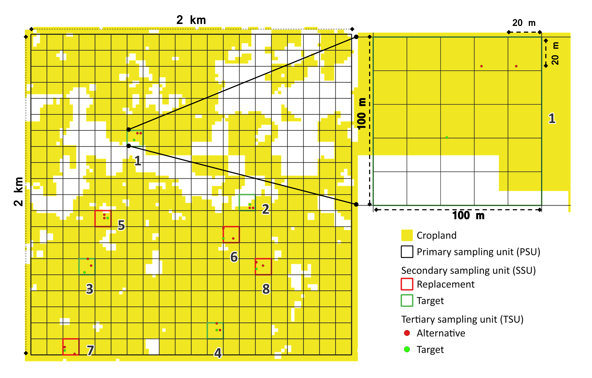

```

#### PSU Selection Process {#psu-selection-process}

The process of selecting the PSUs is summarized as follows:

**Step 1: Create 2km × 2km Grid** (Figure \@ref(fig:grid-creation)) - A 2km × 2km grid covering the entire region of interest (ROI) is created - This grid serves as the foundational structure for stratification and spatial analysis

**Step 2: Overlay Land Use and Protected Areas** (Figure \@ref(fig:grid-overlay)) - Land-use and land cover (LULC) mask layer identifying cropland, forest, or grassland is overlaid - Protected area boundaries are incorporated - Grid cells where cropland, forest, or grassland cover more than 10% (or specified percentage) are retained - This ensures that only PSUs containing target land uses are selected

**Step 3: Apply Covariate Space Coverage** (Figure \@ref(fig:csc-application)) - PSUs are selected through CSC sampling using 85 environmental covariates - Covariates are resampled to 250m resolution - Principal Component Analysis (PCA) transforms covariates into PC layers - PC layers accounting for up to 99% of variance are retained - PC layers are upscaled to 2km × 2km resolution

**Step 4: Determine Optimal Sample Size** - Optimal number of PSUs determined using divergence metrics - Kullback-Leibler Divergence (KLD) quantifies how well sampled data represent full environmental covariate space - Unlike Jensen-Shannon methods, KLD does not overestimate optimal sample size [@saurette2023]

**Step 5: Perform K-means Clustering** - K-means clustering creates homogeneous clusters (strata) - Number of clusters equals total number of PSUs to be sampled - Legacy point data can be incorporated (clusters fixed at legacy locations) - Mean Squared Shortest Distance (MSSD) in covariate space is calculated - Process repeated 10 times, retaining trial with minimum MSSD

**Step 6: Select Target and Replacement PSUs** (Figure \@ref(fig:psu-selection)) - PSUs allocated by minimizing MSSD within environmental covariate space - Output: N PSUs where N equals total number of samples - Replacement PSUs calculated by randomly selecting grid cells within same cluster class

```{r grid-creation, echo=FALSE, fig.cap="A 2×2 km grid is created across the region of interest.", out.width='80%'}
knitr::include_graphics("images/module2/fig_2_grid_creation.png")
```

```{r grid-overlay, echo=FALSE, fig.cap="The grid is overlaid with legacy point data, crop layer data and protected area boundaries.", out.width='80%'}
knitr::include_graphics("images/module2/fig_3_grid-overlay.png")
```

```{r csc-application, echo=FALSE, fig.cap="PSUs located in non-protected areas and containing more than 10% or any specified percentage of crop coverage are selected. The Covariate Space Coverage sampling method, incorporating 85 environmental covariates, is applied to identify target and replacement PSUs.", out.width='80%'}
knitr::include_graphics("images/module2/Fig_4_csc-application.png")
```

```{r psu-selection, echo=FALSE, fig.cap="The selected target and replacement PSUs.", out.width='80%'}
knitr::include_graphics("images/module2/fig_5_psu-selection.png")
```

#### SSU and TSU Selection Process {#ssu-tsu-selection}

**Stage 2: Secondary Sampling Units (SSUs)**

The second stage involves selecting SSUs using Covariate Space Coverage Sampling (CSCS) based on 24 high-resolution environmental covariates. Each SSU represents a 100m × 100m (1 hectare) area divided into 25 regular sampling plots of 20m × 20m (Figure \@ref(fig:ssu-detail)).

**Selection scheme**: - 8 SSUs selected from each PSU - 4 target SSUs (1-4): where samples will be collected\
- 4 replacement SSUs (5-8): pre-identified substitutes - Replacement SSUs directly linked to targets (one-to-one basis): - SSU 5 replaces SSU 1 - SSU 6 replaces SSU 2 - SSU 7 replaces SSU 3 - SSU 8 replaces SSU 4

If all SSUs within a target PSU are exhausted, missing SSUs must be selected from the designated PSU replacement. The designated PSU replacements were selected with the same spatial variability as their PSU targets.

```{r ssu-detail, echo=FALSE, fig.cap="Single primary sampling unit displaying secondary sampling units (a), and a zoomed-in view of a secondary sampling unit with tertiary sampling units (b).", out.width='100%'}
knitr::include_graphics("images/module2/Fig_6_ssu_detail.png")
```

**Stage 3: Tertiary Sampling Units (TSUs)**

The third and final stage involves selecting TSUs using **simple random sampling without replacement**. Each SSU contains 25 possible TSUs of 20m × 20m, corresponding to the pixel size of the crop raster layer.

**Selection scheme**: - 3 TSUs per SSU: - 1 target TSU (primary sampling location) - 2 replacement TSUs (alternatives) - If a TSU is unsuitable, any replacement can be used - If all TSUs within an SSU are unsuitable, entire SSU is rejected

**Soil sampling protocol**: - Sampling conducted strictly at designated TSU locations - **Maximum shift**: 10 metres from defined coordinates

#### Site Identification System {#site-id}

The final site ID is an alphanumeric identifier structured as follows (Figure \@ref(fig:site-id)):

**Format**: `AAA####-#-#X`

Where: - `AAA` = Three-letter country ISO code (e.g., KEN for Kenya) - `####` = Primary Sampling Unit number (zero-padded, e.g., 0001) - First `#` = Secondary Sampling Unit number (1-8) - Second `#` = Tertiary Sampling Unit number (1-3) - `X` = Land use type code: - `C` = Cropland - `G` = Grassland - `F` = Forest

**Example**: `KEN0001-1-1C` - Country: Kenya - PSU: 1 - SSU: 1 (target) - TSU: 1 (target) - Land use: Cropland

```{r site-id, echo=FALSE, fig.cap="Deciphering the site identification.", out.width='100%'}
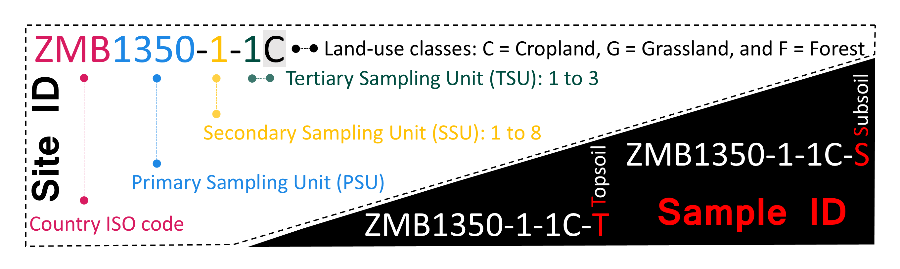
```

## Tutorial using R {#tutorial}

This tutorial is designed for users with a basic understanding of R programming and provides a comprehensive guide to implementing a soil sampling design for soil monitoring and mapping. All scripts and data are available in the [SoilFER Training Resources](https://github.com/SoilFER/SoilFER-Training-Resources/tree/main) GitHub repository specifically within the [scripts](02_scripts/module2) and [initial data](01_data/module2) directories.

::: {style="background-color:#fff9c4;border-left:4px solid #fbc02d; padding:10px; font-size:0.9em;"}
**💡 Note**: Ensure you have the `tinytex`, `knitr`, `rmarkdown`, and `rstudioapi` R packages installed to successfully run and render R Markdown documents before running this script. Additionally, install tinytex by running `tinytex::install_tinytex()` to enable LaTeX support for PDF generation.
:::

### Setting up the environment {#setup}

First, set the working directory to the location of your R script. This ensures that all paths in the script are relative to the script's location.

```{r setup-wd, eval=FALSE}
setwd(dirname(rstudioapi::getActiveDocumentContext()$path))
setwd("../") # Move wd down to the main folder
getwd()
```

### Install required libraries {#install-libraries}

The script uses several R libraries, each serving a specific purpose (Table \@ref(tab:r-libraries)).

```{r r-libraries, echo=FALSE}
libraries <- data.frame(
  Package = c("sp", "terra", "raster", "sf", "sgsR", "entropy", "tripack", "tibble",
              "manipulate", "dplyr", "synoptReg", "doSNOW", "Rfast", "fields", 
              "ggplot2", "rassta"),
  Purpose = c("Spatial data classes", "Raster data manipulation", "Legacy raster support",
              "Simple features (vector data)", "Spatial sampling", "Entropy calculations",
              "Triangulation", "Data frames", "Interactive plotting", "Data manipulation",
              "PCA for rasters", "Parallel processing", "Fast R functions", 
              "Distance calculations", "Visualization", "Terrain analysis")
)

kable(libraries, caption = "Summary of required R libraries and their purposes for SoilFER sampling design")
```

Some libraries might need to be installed from GitHub. Uncomment and run the lines below if needed:

```{r install-packages, eval=FALSE}
# Install synoptReg package from GitHub
# install.packages("remotes") # Install remotes if not installed
# remotes::install_github("lemuscanovas/synoptReg")

packages <- c("sp", "terra", "raster", "sf", "sgsR", "entropy", 
              "tripack", "tibble", "manipulate", "dplyr", "synoptReg", 
              "doSNOW", "Rfast", "fields", "ggplot2", "rassta")

invisible(lapply(packages, library, character.only = TRUE))

rm(packages)
```

::: {style="background-color:#fff9c4;border-left:4px solid #fbc02d; padding:10px; font-size:0.9em;"}
**Alternative method**: In RStudio, use the **Packages** tab in the bottom-right pane → click **Install** → type package name → ensure "Install dependencies" is checked → click **Install**.
:::

### Define variables and parameters {#define-parameters}

Several variables and parameters must be defined to establish a consistent framework for the script.

#### Country ISO code

```{r iso-code, eval=FALSE}
ISO.code <- "KANSAS"  
```

::: {style="background-color:#fff9c4;border-left:4px solid #fbc02d; padding:10px; font-size:0.9em;"}
**💡 Note**: Use the Alpha-3 ISO code for your country of interest.
:::

#### Land-use type

The SoilFER project focuses on three primary land-use types: croplands (85%), grasslands (10%), and forests (5%).

```{r landuse, eval=FALSE}
landuse <- "crops"  # Options: "crops", "grassland", "forest"
```

#### File paths

```{r file-paths, eval=FALSE}
# Path to data folders
raster.path <- "data/rasters/"
shp.path <- "data/shapes/"
other.path <- "data/other/"
landuse_dir <- paste0("data/results/", landuse, "/")
   
# Check if the directory exists; if not, create it
dir.create(other.path, showWarnings = FALSE, recursive = TRUE)
dir.create("results",  showWarnings = FALSE, recursive = TRUE)
if (!file.exists(landuse_dir)) dir.create(landuse_dir)
results.path <- landuse_dir
```

#### Coordinate reference system

```{r crs, eval=FALSE}
epsg <- "EPSG:3857"  # NAD27 UTM Zone 14N – adjust for your study area
# Find your CRS at: https://epsg.io/
```

#### Sample size calculation

```{r sample-size, eval=FALSE}
# Manual set-up
nsamples <- 300  # Total sampling sites
share <- 0.80    # 80% for this land use (croplands)
nsites <- nsamples * share  # Final number of sites

```

::: {style="background-color:#fff9c4;border-left:4px solid #fbc02d; padding:10px; font-size:0.9em;"}
**💡 Note**: Optimal sample size (N) is calculated statistically later.
:::

#### Sampling unit definitions

```{r sampling-units, eval=FALSE}
# Define PSU and SSU sizes 
psu_size <- 2000   # PSU: 2km × 2 km
ssu_size <- 100    # SSU: 100m × 100m = 1 ha

# Define number of target and alternative SSUs at each PSU
num_primary_ssus     <- 4   # Target SSUs per PSU
num_alternative_ssus <- 4   # Replacement SSUs per PSU
number_TSUs          <- 3   # TSU points per SSU
```

#### Algorithm parameters

```{r algorithm-params, eval=FALSE}
iterations   <- 10   # K-means random starts
percent_crop <- 20   # Minimum crop coverage for PSU selection (%)
```

### Custom functions {#custom-functions}

#### Covariate Space Coverage (CSIS)

The CSIS function is the backbone of clustering sampling units in covariate space. It ensures optimal distribution while considering any fixed legacy data.

**How it works**:

1.  **Input parameters**:
    -   `fixed`: Preselected (legacy) sampling points
    -   `nsup`: Number of additional (new) sampling points to select
    -   `nstarts`: Number of random starting points for clustering
    -   `mygrd`: Grid of covariate data for ROI
2.  **Workflow**:
    -   Extract fixed points and exclude from grid
    -   Randomly initialize new sampling points
    -   Combine fixed and new centers
    -   Compute distances and assign points to nearest cluster
    -   Update cluster centers iteratively until convergence
    -   Calculate Mean Squared Shortest Distance (MSSSD)
    -   Save best clustering result

```{r csis-function, eval=FALSE}
## This function performs constrained k-means clustering
CSIS <- function(fixed, nsup, nstarts, mygrd) {
  # Args:
  #   fixed: Data frame of fixed legacy points
  #   nsup: Number of supplementary points to select
  #   nstarts: Number of random starts for optimization
  #   mygrd: Grid of all potential sampling locations
  
  n_fix <- nrow(fixed)
  p <- ncol(mygrd)
  units <- fixed$units
  mygrd_minfx <- mygrd[-units, ]
  MSSSD_cur <- NA
  
  for (s in 1:nstarts) {
    units <- sample(nrow(mygrd_minfx), nsup)
    centers_sup <- mygrd_minfx[units, ]
    centers <- rbind(fixed[, names(mygrd)], centers_sup)
    
    repeat {
      D <- rdist(x1 = centers, x2 = mygrd)
      cluster <- apply(X = D, MARGIN = 2, FUN = which.min) %>% as.factor(.)
      centers_cur <- centers
      
      for (i in 1:p) {
        centers[, i] <- tapply(mygrd[, i], INDEX = cluster, FUN = mean)
      }
      
      # Restore fixed centers (legacy data points don't move)
      centers[1:n_fix, ] <- centers_cur[1:n_fix, ]
      
      # Check convergence
      sumd <- diag(rdist(x1 = centers, x2 = centers_cur)) %>% sum(.)
      if (sumd < 1E-12) {
        D <- rdist(x1 = centers, x2 = mygrd)
        Dmin <- apply(X = D, MARGIN = 2, FUN = min)
        MSSSD <- mean(Dmin^2)
        
        if (s == 1 | MSSSD < MSSSD_cur) {
          centers_best <- centers
          clusters_best <- cluster
          MSSSD_cur <- MSSSD
        }
        break
      }
    }
    print(paste0(s," out of ",nstarts))
  }
  list(centers = centers_best, cluster = clusters_best)
}
```

::: {style="background-color:#fff9c4;border-left:4px solid #fbc02d; padding:10px; font-size:0.9em;"}
**💡 Note**: This function creates spatially balanced sampling designs by considering existing sampling points and covariate distributions.
:::

#### K-means with progress reporting

```{r kmeans-progress-function}
kmeans_with_progress <- function(data, centers, iter.max = 10000, nstart = 100) {
  # Provides visual feedback during long k-means operations
  best_result <- NULL
  best_totss <- Inf
  
  cat("Running k-means clustering with", nstart, "random starts...\n")
  
  for (s in 1:nstart) {
    result <- kmeans(data, centers = centers, iter.max = iter.max, nstart = 1)
    
    if (result$tot.withinss < best_totss) {
      best_result <- result
      best_totss <- result$tot.withinss
    }
    
    print(paste0(s, " out of ", nstart))
  }
  
  cat("Best tot.withinss:", best_totss, "\n")
  return(best_result)
}
```

#### TSU generation

This function generates TSUs within SSUs, ensuring random distribution while respecting land-use constraints.

```{r tsu-function, eval=FALSE}
## This function creates random point samples within each SSU polygon
generate_tsu_points_within_ssu <- function(ssu, number_TSUs, index, ssu_type, crops) {
  # Args:
  #   ssu: Single SSU polygon (sf object)
  #   number_TSUs: Number of points to generate
  #   index: SSU identifier
  #   ssu_type: "Target" or "Replacement"
  #   crops: Crop mask raster (20m resolution)
  
  ssu_vect <- vect(ssu)
  
  # Validate geometry
  if (is.null(ssu_vect) || nrow(ssu_vect) == 0 || is.na(ext(ssu_vect))) {
    warning(paste("SSU", index, "has invalid geometry. Skipping TSU generation."))
    return(NULL)
  }
  
  # Clip crop raster to SSU
  clipped_lu <- try(crop(crops, ssu_vect), silent = TRUE)
  if (inherits(clipped_lu, "try-error") || is.null(clipped_lu)) {
    warning(paste("SSU", index, "could not crop land use raster. Skipping."))
    return(NULL)
  }
  
  # Sample points (tries two methods)
  sampled_points <- try(sample_srs(clipped_lu, nSamp = number_TSUs), silent = TRUE)
  if (inherits(sampled_points, "try-error") || is.null(sampled_points) || nrow(sampled_points) == 0) {
    sampled_points <- try(spatSample(clipped_lu, size = number_TSUs, na.rm = TRUE, method = "random"), silent = TRUE)
  }
  
  if (inherits(sampled_points, "try-error") || is.null(sampled_points) || nrow(sampled_points) == 0) {
    warning(paste("SSU", index, "failed to generate TSUs. Skipping."))
    return(NULL)
  }
  
  # Add metadata
  sampled_points$PSU_ID <- selected_psu$ID
  sampled_points$SSU_ID <- index
  sampled_points$TSU_ID <- seq_len(nrow(sampled_points))
  sampled_points$SSU_Type <- ssu_type
  sampled_points$TSU_Name <- paste0(sampled_points$PSU_ID, ".", index, ".", seq_len(nrow(sampled_points)))
  
  return(sampled_points)
}
```

### Load country boundaries and legacy data {#load-boundaries}

Load and transform country boundaries and legacy soil data to the desired CRS:

```{r load-boundaries, eval=FALSE}
# Purpose: Import study area boundaries and existing soil sample locations

# Load country/region boundaries
country_boundaries <- file.path(paste0(shp.path,"roi_kansas_us_epsg_4326.shp"))
country_boundaries <- sf::st_read(country_boundaries, quiet=TRUE)

# Reproject if necessary
if(crs(country_boundaries)!=epsg){
  country_boundaries <- country_boundaries %>%
    st_as_sf() %>% sf::st_transform(crs=epsg)
}

# Load legacy soil data (optional - existing sample points)
legacy <- file.path(paste0(shp.path,"soil_legacy_data_kansas_epsg_4326.shp"))

if(file.exists(legacy)){
  legacy <- sf::st_read(legacy, quiet=TRUE)
  if(crs(legacy)!=epsg){
    legacy <- legacy %>% sf::st_transform(crs=epsg)
  }
} else {
  rm(legacy)  # Remove if doesn't exist
} 

# Clean legacy data
if(exists("legacy")){
  legacy <- dplyr::select(legacy, geometry)
  legacy <- legacy[!duplicated(st_geometry(legacy)), ]  # Remove duplicates
}
```

::: {style="background-color:#fff9c4;border-left:4px solid #fbc02d; padding:10px; font-size:0.9em;"}
**💡 Note**: Always verify that all geospatial datasets use the same CRS before performing spatial operations. Misaligned CRSs can lead to incorrect analyses.
:::

#### Visualize boundaries and legacy data

```{r viz-boundaries, eval=FALSE}
# Visualize boundaries and legacy points
ggplot() +
  geom_spatvector(data = country_boundaries, fill = NA, color = "black") +
  geom_spatvector(data = legacy, aes(geometry = geometry), size = 0.7, color = "red") +
  theme_minimal()
```

```{r legacy-map, echo=FALSE, fig.cap="Grey rectangle outlines the region of interest, while red dots represent the geolocations of the legacy data points.", out.width='100%'}
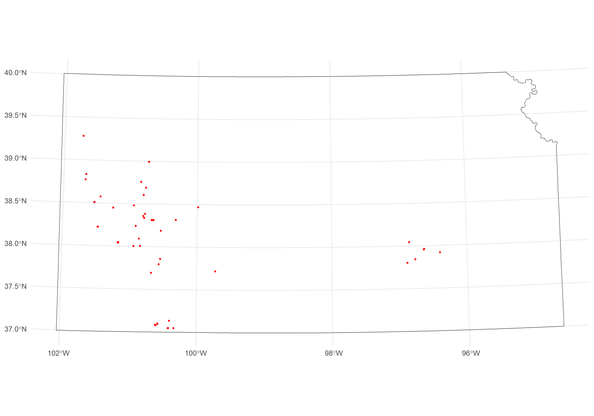
```

### Load environmental covariates for PSUs {#load-covariates-psu}

In many sampling campaigns, not all areas within the country or region of interest are suitable for fieldwork. Protected areas may be legally restricted, steep terrain may be unsafe or inaccessible, and other constraints (e.g., water bodies, urban zones) can reduce the feasible sampling space. For this reason, SoilFER treats “exclusion layers” as optional inputs that refine the accessible area without changing the overall survey objective. When an exclusion layer is available, it is loaded, reprojected to the common CRS used in the project, and then converted into a mask that can be applied to the sampling universe. If a layer is not available, the script continues without it, ensuring that the workflow remains robust across countries with different data availability.

In addition to exclusion layers, ancillary datasets such as geology or geomorphology can be used for stratification. These layers do not exclude areas from sampling; instead, they provide categorical information that may help define strata or interpret spatial patterns during mapping and analysis.

#### Protected areas mask (exclude from sampling)

This chunk checks whether a protected-areas shapefile exists. If it does, the polygons are read, transformed to the project CRS if needed, dissolved into a single geometry, and then subtracted from the country boundary. The result is a “non-protected” mask representing areas where sampling is allowed.

```{r load-protected-areas, eval=FALSE}
# Protected areas (areas to EXCLUDE from sampling)
npa <- file.path(paste0(shp.path,"protected_areas_epsg_4326.shp"))

if(file.exists(npa)){
  npa <- sf::st_read(npa, quiet = FALSE)
  if(crs(npa)!=epsg){
    npa <- npa %>% sf::st_transform(crs = epsg)
  }
  npa <- sf::st_union(npa)
  npa <- sf::st_difference(country_boundaries, npa)  # Create "non-protected" mask
} else {
  rm(npa)
}
```

```{r viz-npa, eval=FALSE}
ggplot() +
  geom_sf(data = npa, fill = "grey90", color = "black", linewidth = 0.3) +
  coord_sf(datum = NA) +
  labs(title = "Accessible area mask (non-protected in grey)") +
  theme_minimal(base_size = 11)
```

```{r npa-map, echo=FALSE, fig.cap="Protected areas (empty shapes)", out.width='100%'}
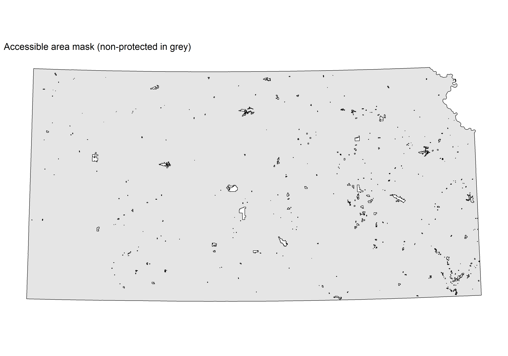
```

#### Slope mask (exclude steep terrain)

This chunk checks whether a pre-processed binary slope raster exists. If it does, the raster is loaded, reprojected to the project CRS if needed, normalised to a strict binary mask (1/NA) by dividing by itself, and then clipped to the country boundary. The result is a raster where cells with value 1 represent accessible slopes and all excluded cells are NA. If the file is not found the object is removed so downstream code knows no slope filter applies.

::: {style="background-color:#fff9c4;border-left:4px solid #fbc02d; padding:10px; font-size:0.9em;"}
💡 **Note:** The slope mask must be prepared before running this script. In QGIS, use the Raster Calculator with the formula ("[Slope\@1](mailto:Slope@1){.email}" \<= 30) \* 1 to create a binary raster (1: accessible, 0: excluded), then use the Set Null tool to convert 0 to NA.\
Threshold guidelines: gentle terrain 0-15%, moderate terrain 15-30% (typical field-work threshold), steep terrain \> 30% (usually excluded).
:::

```{r load-slope-mask, eval=FALSE}
slope <- file.path(paste0(raster.path,"slope_mask_epsg_4326.tif"))

if(file.exists(slope)){
  slope <- rast(slope)
  if(crs(slope)!=epsg){
    slope <- project(slope, epsg, method="near")
  }
  slope <- slope/slope  # Convert to binary mask
  slope <- terra::mask(slope, country_boundaries)
} else {
  rm(slope)
}
```

```{r viz-slope, eval=FALSE}
plot(slope,
     col = "#66c2a5",
     legend = FALSE,
     main = "Slope accessibility mask in green")
```

```{r slope-map, echo=FALSE, fig.cap="Slope accessibility areas", out.width='100%'}
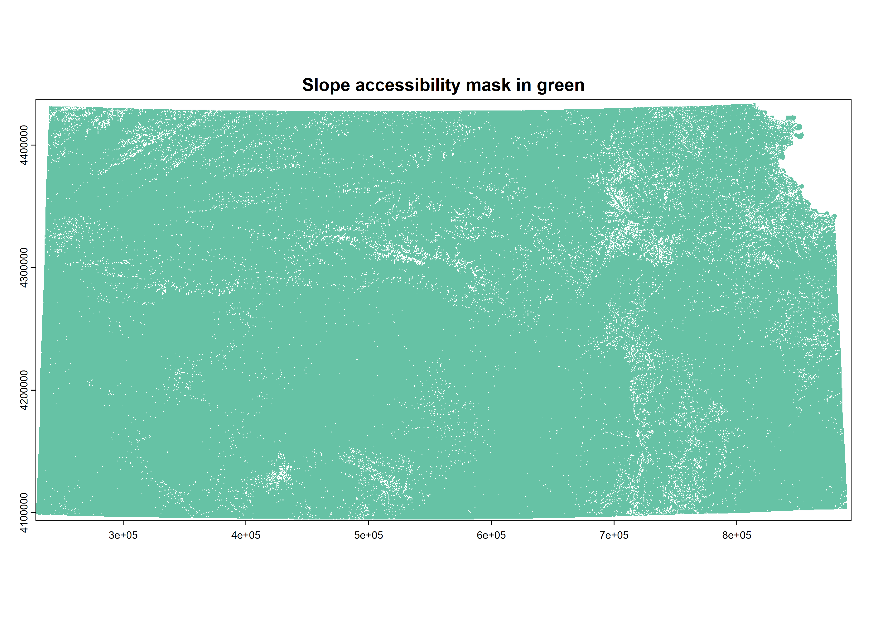
```

#### Ecoregions / Geology data (for stratification)

This chunk checks whether an ecoregions shapefile exists. If it does, the polygons are read, reprojected to the project CRS if needed, and a numeric GEO field is created by converting the ecoregion name column to a factor and then to an integer. This numeric encoding is required for rasterization and dummy-variable conversion in later steps. If the file is not found the object is removed so downstream code knows no geology stratification applies.

::: {style="background-color:#fff9c4;border-left:4px solid #fbc02d; padding:10px; font-size:0.9em;"}
💡 **Note**: For Kansas, ecoregion boundaries (*US_L3NAME* field) are used as a geology proxy. For other study areas, replace the shapefile path and update geo.classes to match the field name containing your geological or ecoregion classification. Any polygon layer with a categorical attribute can be used here.
:::

```{r load-geology-ecoreg, eval=FALSE}
# Geology data (for stratification) - If available
geo <- file.path(paste0(shp.path,"ecoregions_kansas_epsg_4326.shp"))
geo.classes <- "US_L3NAME"  # Field name for geology classes

if(file.exists(geo)){
  geo <- sf::st_read(geo, quiet=TRUE)
  if(crs(geo)!=epsg){
    geo <- geo %>% sf::st_transform(crs=epsg)
  }
  geo$GEO <- as.numeric(as.factor(geo[[geo.classes]]))
} else {
  rm(geo)
}
```

```{r viz-geo-eco, eval=FALSE}
ggplot() +
  geom_sf(data = geo, aes(fill = US_L3NAME), color = "black", linewidth = 0.2) +
  labs(title = "Level III Ecoregions",
       fill = "Ecoregion (US_L3NAME)") +
  theme_minimal(base_size = 11) +
  theme(legend.position = "right")
```

```{r geo-eco-map, echo=FALSE, fig.cap="Ecoregions", out.width='100%'}
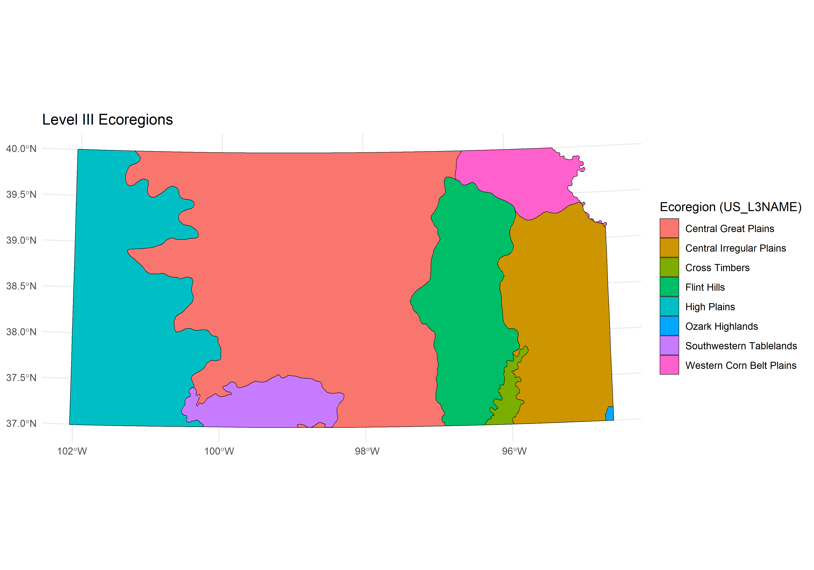
```

#### Geomorphology data (for stratification)

This chunk checks whether a geomorphology file exists and handles two possible formats. If the file is a raster (.tif), it is loaded, renamed to GEOMORPH, and reprojected if needed. If it is a shapefile (.shp), it is read as a vector, reprojected if needed, and a numeric GEOMORPH field is created by encoding the class column as integers. In both cases the result is clipped to the country boundary. If the file is not found the object is removed so downstream code knows no geomorphology stratification applies.

::: {style="background-color:#fff9c4;border-left:4px solid #fbc02d; padding:10px; font-size:0.9em;"}
💡 **Note**: For Kansas, the geomorphology raster is exported from Google Earth Engine (GEE_Exports/) using the Geomorphon landform classification. Both raster (.tif) and vector (.shp) formats are supported. Update the file path and geomorph.classes field name to match your dataset. If using a shapefile, ensure the classification column contains categorical landform labels that can be factorised into integer codes.
:::

```{r load-geomorph, eval=FALSE}
# Geomorphology data (for stratification) - if available
geomorph <- file.path(paste0(raster.path, "/GEE_Exports/Geomorphon_Landforms_KANSAS.tif"))
geomorph.classes <- "Class"  # Field name for geomorphology classes (shapefile only)

if (file.exists(geomorph)) {
  file_extension <- tools::file_ext(geomorph)

  if (file_extension == "tif") {
    geomorph <- rast(geomorph)
    names(geomorph) <- "GEOMORPH"
    if (crs(geomorph) != epsg) {
      geomorph <- project(geomorph, epsg, method = "near")
    }
  } else if (file_extension == "shp") {
    geomorph <- sf::st_read(geomorph, quiet = TRUE)
    if (sf::st_crs(geomorph)$epsg != epsg) {
      geomorph <- sf::st_transform(geomorph, crs = epsg)
    }
    geomorph$GEOMORPH <- as.numeric(as.factor(geomorph[[geomorph.classes]]))  # Encode as integers
  }

  geomorph <- terra::mask(geomorph, country_boundaries)
} else {
  rm(geomorph)
}
```

```{r viz-geomorph, eval=FALSE}
# Create a class lookup table (Geomorpho90m / geomorphons)
geomorph_lut <- data.frame(
  value = 1:10,
  class = c(
    "Flat",
    "Peak / summit",
    "Ridge",
    "Shoulder",
    "Spur",
    "Slope",
    "Hollow",
    "Footslope",
    "Valley",
    "Pit / depression"
  )
)

# Semantically meaningful colors: warm tones for highs, cool tones for lows
geomorph_colors <- c(
  "Flat"             = "#F5F5DC",  # beige      – level ground
  "Peak / summit"    = "#8B0000",  # dark red   – highest points
  "Ridge"            = "#CD5C5C",  # indian red – elongated highs
  "Shoulder"         = "#D2691E",  # chocolate  – convex upper slopes
  "Spur"             = "#DAA520",  # goldenrod  – diverging slopes
  "Slope"            = "#6B8E23",  # olive      – planar slopes
  "Hollow"           = "#4682B4",  # steel blue – converging slopes
  "Footslope"        = "#5F9EA0",  # cadet blue – concave lower slopes
  "Valley"           = "#00008B",  # dark blue  – linear lows
  "Pit / depression" = "#191970"   # midnight   – lowest points
)

# Attach labels to the raster as categories
geomorph_cat <- as.factor(geomorph)
levels(geomorph_cat) <- list(data.frame(
  ID    = geomorph_lut$value,
  class = geomorph_lut$class
))

par(mar = c(3, 3, 4, 3), bg = "white")

plot(
  geomorph_cat,
  col  = geomorph_colors[levels(geomorph_cat)[[1]]$class],
  main = "Geomorphology",
  axes = FALSE,
  box = FALSE,
  plg = list(
    inset = c(0.02, 0.03),
    cex = 0.75,
    title = "Geomorphons",
    bty = "n"
  )
)

```

```{r geomorph-map, echo=FALSE, fig.cap="Geomorphology retrieved from GEE", out.width='100%'}
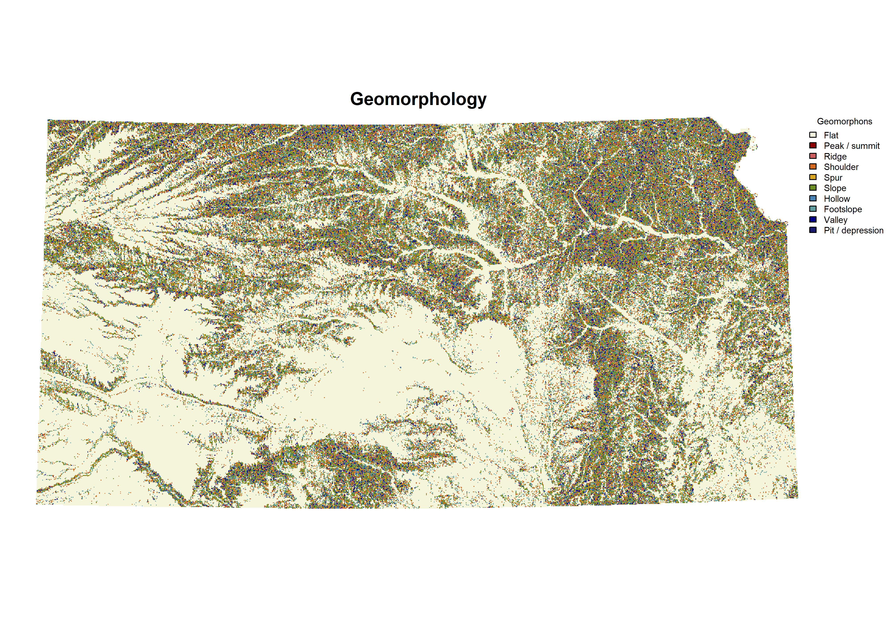
```

#### Environmental covariates created/retrieved from previous Chapter

This section loads and prepares the environmental covariates used to delineate Primary Sampling Units (PSUs). These variables define the environmental space within which PSUs are distributed. First, the script locates and loads the environmental raster stack exported from Google Earth Engine (GEE). The raster file contains multiple environmental layers (e.g., climate, terrain, vegetation indices) at 250 m resolution. Second, the coordinate reference system (CRS) is checked. If the raster CRS does not match the project CRS (epsg), the data are reprojected using nearest-neighbour interpolation to preserve categorical values. Third, the raster stack is resampled to the PSU spatial resolution (2 km). A template raster is created using the desired PSU grid size (psu_size). The environmental layers are then aggregated to this coarser resolution using bilinear interpolation. This ensures that environmental variability is represented at the same spatial scale at which PSUs will be defined. It is essential that the aggregation resolution matches the PSU size; otherwise, inconsistencies may arise between environmental stratification and sampling unit geometry. Finally, the raster stack is masked to the country boundary, ensuring that environmental data are retained only within the region of interest.

```{r load-main-covs, eval=FALSE}
# Purpose: Load environmental data at 2km resolution for PSU selection from GEE code
# Note: These covariates determine WHERE PSUs are placed

cov.dat <- list.files(paste0(raster.path, "GEE_Exports/"), 
                      pattern = "Environmental_Covariates_250m_KANSAS.tif$",  
                      recursive = TRUE, full.names = TRUE)
cov.dat <- terra::rast(cov.dat)

# Reproject if necessary
if(crs(cov.dat)!=epsg){
  cov.dat <- terra::project(cov.dat, epsg, method="near")
}

# Resample to PSU resolution (2km)
# IMPORTANT: This aggregation must match your PSU size
psu_size_template <- rast(ext(cov.dat), resolution = psu_size, crs = crs(cov.dat))
cov.dat <- resample(cov.dat, psu_size_template, method = "bilinear")
cov.dat <- terra::mask(cov.dat, country_boundaries)
```

```{r table-main-covs, echo=FALSE}
cov_table <- data.frame(
  Category = c(
    rep("Climate (CHELSA)", 8),
    rep("Energy & Water Balance", 8),
    rep("Vegetation Indices (MODIS)", 24),
    rep("Land Cover", 6),
    rep("Terrain Derivatives (DTM)", 12)
  ),
  Variable = c(
    # Climate
    "bio1", "bio5", "bio6", "bio12", "bio13", "bio14", "bio16", "bio17",
    
    # Energy & water
    "ngd10", "pet_penman_max", "pet_penman_mean", "pet_penman_min",
    "pet_penman_range", "sfcWind_max", "sfcWind_mean", "sfcWind_range",
    
    # Vegetation
    "fpar_*_mean/sd", 
    "lstd_*_mean/sd",
    "ndlst_*_mean/sd",
    "ndvi_*_mean/sd",
    "snow_cover",
    "swir_060708_500m_mean",
    rep("", 18),  # placeholder to align count
    
    # Land cover
    "crops", "flooded_vegetation", "grass",
    "shrub_and_scrub", "trees", "",
    
    # Terrain
    "dtm_elevation_250m",
    "dtm_slope_250m",
    "dtm_tpi_250m",
    "dtm_twi_500m",
    "dtm_curvature_250m",
    "dtm_upslopecurvature_250m",
    "dtm_downslopecurvature_250m",
    "dtm_vbf_250m",
    "dtm_mrn_250m",
    "dtm_dvm_250m",
    "dtm_dvm2_250m",
    ""
  )
)

kable(
  subset(cov_table, Variable != ""),
  caption = "Environmental covariates used for Primary Sampling Unit (PSU) delineation."
)
```

::: {style="background-color:#fff9c4;border-left:4px solid #fbc02d; padding:10px; font-size:0.9em;"}
**💡 Note**: Initial number of environmental covariates is 66.
:::

#### Load and process soil-climate data (Newhall)

The Newhall soil-climate dataset provides categorical (i.e., regime classes) and continuous variables describing soil temperature and moisture regimes. This section loads the Newhall raster, ensures it matches the project CRS, removes layers that are not required, and then harmonises all remaining layers to the same grid as the environmental covariates (cov.dat). Categorical layers are resampled using nearest-neighbour interpolation to preserve class identities, whereas continuous layers can be resampled with default interpolation.

```{r load-newhall, eval=FALSE}
# Load and process soil climate data
newhall <- list.files(raster.path, pattern = "newhall.tif$", recursive = TRUE, full.names = TRUE)
newhall <- terra::rast(newhall)

if(crs(newhall)!=epsg){
  newhall <- terra::project(newhall, epsg, method="near")
}

# Remove unnecessary layers
newhall$regimeSubdivision1 <- NULL
newhall$regimeSubdivision2 <- NULL

# Process categorical variables (preserve factor levels)
temperatureRegime <- project(newhall$temperatureRegime, cov.dat, method = "near")
moistureRegime <- project(newhall$moistureRegime, cov.dat, method = "near")

newhall$temperatureRegime <- NULL
newhall$moistureRegime <- NULL
newhall <- terra::resample(newhall, cov.dat)
```

#### Convert soil-climate regimes to dummy variables

The Newhall soil-climate dataset includes categorical variables describing soil temperature and moisture regimes. Since these are nominal classes (e.g., mesic, thermic, ustic), they cannot be directly used in most statistical or machine-learning models. To incorporate them as predictors in the PSU selection workflow, each regime class is converted into a set of binary (dummy) variables. Each dummy layer represents the presence (1) or absence (0) of a specific regime class.

```{r dummy-vars, eval=FALSE}
# Convert to dummy variables (one column per category)
temperatureRegime <- as.factor(temperatureRegime)
temperatureRegime <- dummies(ca.rast = temperatureRegime, preval = 1, absval = 0)
moistureRegime <- as.factor(moistureRegime)
moistureRegime <- dummies(ca.rast = moistureRegime, preval = 1, absval = 0)
```

#### Integrating all layers and finalising the Covariate Stack

At this stage, all continuous and categorical environmental predictors are combined into a single covariate stack (cov.dat). This stack defines the environmental feature space used for PSU placement. Optional stratification layers such as geology and geomorphology can be included when available. Because these layers are categorical, they are first rasterised to the covariate grid and then converted to dummy variables (one binary layer per class). Before merging, all optional layers are checked and harmonised to ensure they match the covariate stack in extent and resolution. Finally, the complete stack is cropped and masked to the study boundary and written to disk for reuse.

```{r merge-covs, eval=FALSE}
# Merge all covariates
cov.dat <- c(cov.dat, newhall, temperatureRegime, moistureRegime)

# Add geology if available
if(exists("geo")){
  geo <- rasterize(as(geo,"SpatVector"), cov.dat, field="GEO")
  geo <- dummies(ca.rast = geo$GEO, preval = 1, absval = 0)
  cov.dat <- c(cov.dat, geo)
}

# Add geomorphology if available
if (exists("geomorph")) {
  if (!inherits(geomorph, "SpatRaster")) {
    geomorph <- rasterize(as(geomorph, "SpatVector"), cov.dat, field = "GEOMORPH")
  }
  geomorph <- dummies(ca.rast = geomorph$GEOMORPH, preval = 1, absval = 0)
  
  # Ensure matching extents
  if (!identical(ext(cov.dat), ext(geomorph))) {
    geomorph <- extend(geomorph, cov.dat)
  }
  if (!all(res(cov.dat) == res(geomorph))) {
    geomorph <- resample(geomorph, cov.dat, method = "near")
  }
  
  cov.dat <- c(cov.dat, geomorph)
}

# Clean up
rm(newhall, geomorph)
gc()

# Crop to study area
cov.dat <- crop(cov.dat, country_boundaries, mask=TRUE, overwrite=TRUE)
## Saving the covariate stack if R clashes
writeRaster(cov.dat, paste0(raster.path,"cov_dat_stack_psus.tif"), overwrite=TRUE)

# Reload if needed
# cov.dat <- rast(paste0(raster.path, "cov_dat_stack_psus.tif"))

```

```{r table-final-covs, echo=FALSE}
cov_summary <- data.frame(
  Category = c(
    "Climate (CHELSA bioclim)",
    "Energy & Atmospheric Variables",
    "Vegetation Indices (MODIS seasonal)",
    "Land Cover",
    "Terrain Derivatives (DTM)",
    "Soil Climate (Newhall continuous)",
    "Soil Climate Regimes (Dummy variables)",
    "Geology (Dummy variables)",
    "Geomorphology (Dummy variables)"
  ),
  Description = c(
    "Temperature and precipitation bioclimatic variables (bio1–bio17)",
    "Growing degree days, PET, wind statistics",
    "FPAR, LST day/night, NDVI (seasonal mean and SD)",
    "Fractional land cover classes (crops, trees, grass, etc.)",
    "Elevation, slope, curvature, TPI, TWI, VBF and derivatives",
    "Water balance and moisture/temperature regime metrics",
    "Binary layers representing temperature and moisture regime classes",
    "Binary layers representing geology/ecoregion classes",
    "Binary layers representing geomorphon landform classes"
  ),
  Number_of_Layers = c(
    8,   # bio variables
    8,   # energy variables
    32,  # vegetation metrics
    6,   # land cover
    12,  # terrain
    15,  # Newhall continuous
    6,   # regime dummies
    8,   # GEO dummies
    10   # geomorph dummies
  )
)

names(cov_summary)[3] <- "Number of layers"

kable(cov_summary, caption = "Summary of environmental covariates included in the PSU selection stack (2 km resolution).")

```

::: {style="background-color:#fff9c4;border-left:4px solid #fbc02d; padding:10px; font-size:0.9em;"}
**💡 Note**: **Stacking** is the process of combining multiple spatial data layers (raster datasets) into a single multi-layer object. This is useful when multiple variables need to be analysed together. The final dataset comprises 85 environmental covariates, which expand to 105 raster layers after converting categorical variables into dummy (binary) layers.
:::

### Principal Component Analysis (PCA) {#pca}

Environmental covariates such as satellite-derived spectral indices often exhibit strong inter-correlation because they are calculated from overlapping spectral bands and capture related biophysical properties (e.g., vegetation vigor, moisture content, surface reflectance characteristics). Such redundancy can inflate dimensionality and negatively affect clustering or classification procedures. To address this issue, a Principal Component Analysis (PCA) was applied to the standardised environmental covariate raster stack. Standardisation ensured that indices with different value ranges contributed equally to the analysis.

The PCA transforms correlated indices into orthogonal components representing dominant gradients across the landscape. These components summarise major patterns in surface reflectance and vegetation structure while removing multicollinearity among indices. Only the minimum number of principal components explaining more than **99% of the cumulative** variance were retained. This threshold preserves nearly all information while substantially reducing data dimensionality and computational burden. The resulting principal component rasters were then exported for subsequent spatial clustering and landscape characterisation.

```{r pca, eval=FALSE}
pca <- scale(cov.dat)
pca <- synoptReg::raster_pca(pca)  # Fast PCA for rasters

cov.dat <- pca$PCA

# Keep only components explaining 99% of variance
n_comps <- first(which(pca$summaryPCA[3,] > 0.99))
cov.dat <- pca$PCA[[1:n_comps]]

cat(sprintf("Using %d principal components (explaining >99%% variance)\n", n_comps))

# Save PCA results
writeRaster(cov.dat, paste0(results.path,"PCA_projected.tif"), overwrite=TRUE)
rm(pca)

# Reload for further processing
# Why this is useful:
#  - Previous sections (data loading, PCA) can take 30+ minutes
#  - If script crashes or needs modification, you can load here
#  - If the file exists in the folder from previous processing
# cov.dat <- rast(paste0(results.path,"PCA_projected.tif"))

# Reproject if necessary
if(crs(cov.dat)!=epsg){
  cov.dat <- terra::project(cov.dat, epsg, method="near")
}

```

```{r viz-pcas, eval=FALSE}
# Visualising maps from PC1-PC3
# Consistent color scale across PC1–PC3
minmax_vals <- minmax(pca$PCA[[1:3]])
zlim_vals <- range(minmax_vals)

cols <- hcl.colors(100, "Blue-Red 3", rev = TRUE)

par(mfrow = c(1,3), mar = c(3,3,3,6))  # extra space for legend

plot(pca$PCA[[1]],
     col = cols,
     zlim = zlim_vals,
     main = "PC1",
     axes = FALSE,
     box = FALSE,
     plg = list(title = "PC value"))

plot(pca$PCA[[2]],
     col = cols,
     zlim = zlim_vals,
     axes = FALSE,
     box = FALSE,
     main = "PC2",
     plg = list(title = "PC value"))

plot(pca$PCA[[3]],
     col = cols,
     zlim = zlim_vals,
     main = "PC3",
     axes = FALSE,
     box = FALSE,
     plg = list(title = "PC value"))

# Plot cumulative variance
cum_var <- pca$summaryPCA["Cumulative", ]

plot(cum_var,
     type = "l",
     lwd = 2,
     xlab = "Principal Component",
     ylab = "Cumulative Variance Explained",
     main = "Cumulative Variance")

abline(h = 0.99, col = "red", lty = 2)

```

```{r vis-pca-maps, echo=FALSE, fig.cap="Spatial distribution of the first three principal components (PC1-PC3).", out.width='100%'}
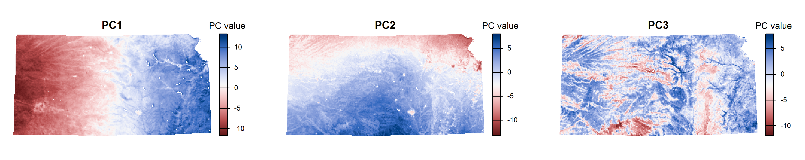
```

```{r cum-var-pca-plot, echo=FALSE, fig.cap="Cumulative variance explained.", out.width='100%'}
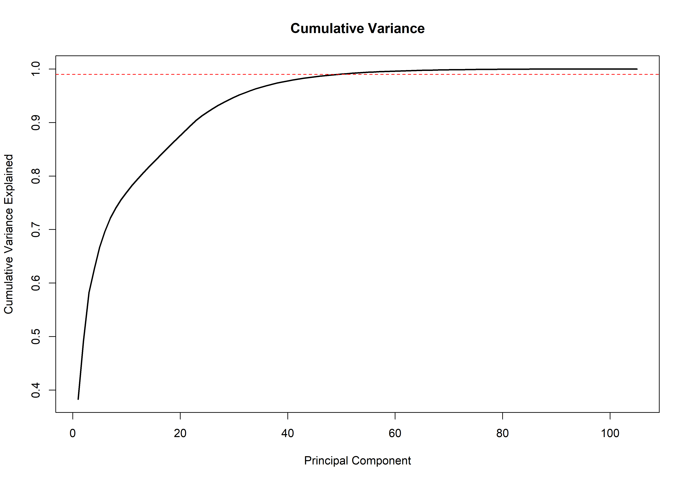
```

### Load and prepare land-use data {#sec-landuse}

This section defines the sampling universe. That is the spatial area where sampling units are allowed to be placed. Two spatial resolutions are used:

-   20 m resolution: precise placement of Temporary Sampling Units (TSUs),

-   100 m resolution: filtering and aggregation for Primary Sampling Units (PSUs).

The cropland raster is loaded and converted to a binary mask where: 1 = cropland and NA = non-cropland. This ensures that subsequent sampling occurs only within agricultural areas.

```{r load-crop-mask-landuse, eval=FALSE}
# Define file path
landuse_file <- file.path(paste0(raster.path,"Cropland_Mask_KANSAS_merged.tif"))

# Load raster
crops <- rast(landuse_file)

# Convert to binary mask (1 = crop, NA = other)
crops <- crops / crops
names(crops) <- "lu"

```

The land-use raster is reprojected to match the coordinate reference system (CRS) used throughout the analysis. Nearest-neighbor interpolation is applied to preserve categorical values.

```{r reproj-crop-mask-landuse, eval=FALSE}
if(crs(crops) != epsg){
  crops <- terra::project(crops, epsg, method = "near")
}

# Display raster info
crops

```

```{r table-crop-raster-info, echo=FALSE}
meta <- data.frame(
  Property = c("Class",
               "Dimensions (rows, cols, layers)",
               "Resolution (x, y)",
               "Extent (xmin, xmax, ymin, ymax)",
               "Coordinate Reference System",
               "Value Range"),
  Value = c(
    "SpatRaster",
    "21007 × 40716 × 1",
    "16.32943 × 16.32943",
    "228591.3, 893460.4, 4093884, 4436916",
    "NAD27 / UTM zone 14N (EPSG:26714)",
    "1–1 (binary mask)"
  )
)

kable(meta, caption = "Metadata of the cropland mask raster.")
```

```{r cropland-original, echo=FALSE, fig.cap="Spatial distribution of crops represented at the original pixel resolution (i.e., 16-meter pixel resolution).", out.width='100%'}
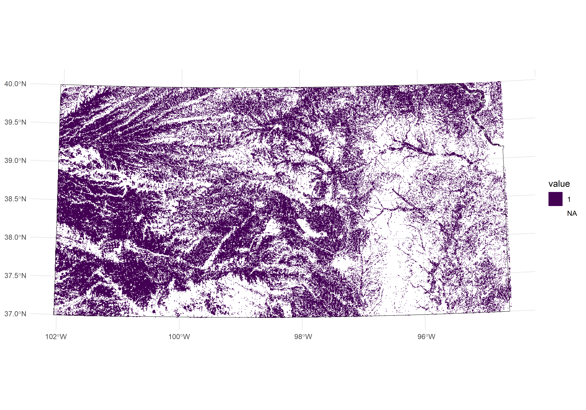
```

The raster is resampled to 20 m resolution, which determines the spatial precision of TSU placement. This resolution directly controls sampling accuracy. Nearest-neighbor resampling is used to maintain categorical integrity.

```{r resampled-crop-mask-landuse, eval=FALSE}
# Create 20 m template
lulc_size_template <- rast(ext(crops), resolution = 20, crs = crs(crops))

crops <- as.factor(crops)
crops <- resample(crops, lulc_size_template, method = "near")

```

Optional spatial masks are applied: (i) npa excludes protected or restricted areas and (ii) slope excludes unsuitable terrain. These masks refine the sampling universe to feasible agricultural locations, increasing the likelihood that soil surveyors will be able to access the selected sites.

```{r optional-npa-slope-crop-mask-landuse, eval=FALSE}
if(exists("npa")){
  crops <- mask(crops, npa)
}

if(exists("slope")){
  slope <- resample(slope, crops, method="near")
  crops <- crops * slope
}

# rm(npa, slope)
```

```{r table-crop-raster-info2, echo=FALSE}
meta <- data.frame(
  Property = c("Class",
               "Dimensions (rows, cols, layers)",
               "Resolution (x, y)",
               "Extent (xmin, xmax, ymin, ymax)",
               "Coordinate Reference System",
               "Value Range"),
  Value = c(
    "SpatRaster",
    "17152 × 33243 × 1",
    "20.00027 × 19.99955",
    "228591.3, 893460.4, 4093884, 4436916",
    "NAD27 / UTM zone 14N (EPSG:26714)",
    "1–1 (binary mask)"
  )
)

kable(meta, caption = "Metadata of the resampled cropland mask raster.")
```

```{r cropland-20m, echo=FALSE, fig.cap="Spatial distribution of crops represented at 20-meter pixel resolution and excluding protected-areas and unaccessible slopes.", out.width='100%'}
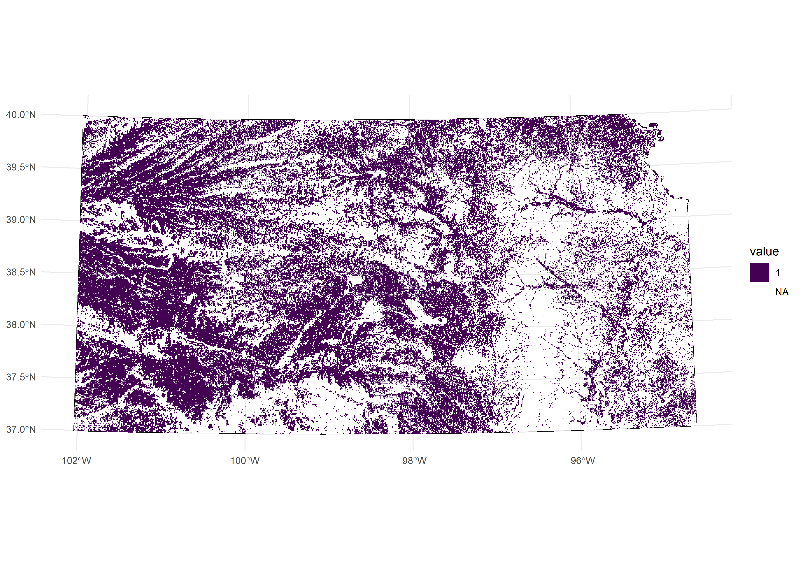
```

The processed 20 m cropland mask is saved and reloaded to ensure consistency and memory stability.

```{r save-load-crop-mask-20m-landuse, eval=FALSE}
# Save 20m resolution crop mask
writeRaster(crops, paste0(raster.path,"crop_mask_20m_clean.tif"), overwrite=TRUE)
# Same situation as loading "cov.dat"
crops <- rast(paste0(raster.path,"crop_mask_20m_clean.tif"))
```

*Aggregate to 100 m resolution*

Resampling to 100 m resolution significantly optimises processing speed and reduces storage requirements.The 20 m raster is aggregated to 100 m resolution using the modal (majority) value. This coarser layer is used for PSU filtering and landscape-scale stratification at 1 ha (100 m x 100 m).

```{r aggregate-100m, eval=FALSE}
# Create 100m resolution version for PSU filtering
# Aggregate: (20m × 5) = 100m pixels
lu <- aggregate(crops, 5, fun=modal, cores = 4, na.rm=T)
names(lu) <- "lu"
writeRaster(lu, paste0(raster.path,"crop_mask_100m.tif"), overwrite=TRUE)
# Same situation as loading "cov.dat"
# lu <- rast(paste0(raster.path,"crop_mask_100m.tif"))

# Filter legacy data to crop areas
if (exists("legacy")){
  legacy$INSIDE <- terra::extract(crops, legacy) %>% dplyr::select(lu)
  legacy <- legacy[!is.na(legacy$INSIDE),] %>% dplyr::select(-"INSIDE")
}

# Display new resolution
lu

# Visualize (it takes a few minutes)
ggplot() +
  geom_spatraster(data = as.factor(crops)) +
  scale_fill_viridis_d(na.value = "transparent") +
  geom_spatvector(data = country_boundaries, fill = NA, color = "black") +
  geom_spatvector(data = legacy, size = 0.7, color = "red") +
  theme_minimal()
```

```{r table-crop-raster-100m-info, echo=FALSE}
meta <- data.frame(
  Property = c("Class",
               "Dimensions (rows, cols, layers)",
               "Resolution (x, y)",
               "Extent (xmin, xmax, ymin, ymax)",
               "Coordinate Reference System",
               "Value Range"),
  Value = c(
    "SpatRaster",
    "3431 × 6649 × 1",
    "100.0014 × 99.99777",
    "228591.3, 893500.4, 4093824, 4436916",
    "NAD27 / UTM zone 14N (EPSG:26714)",
    "1–1 (binary mask)"
  )
)

kable(meta, caption = "Metadata of the resampled cropland mask raster at 100-metre pixel resolution.")
```

```{r cropland-100m, echo=FALSE, fig.cap="Spatial distribution of crops aggregated/upscaled from the original 20-meter pixel resolution to a coarser 100-meter pixel resolution for improved visualization and analysis.", out.width='100%'}

```

### Create Primary Sampling Units (PSU Grid) {#create-psu-grid}

A regular grid of PSUs was generated across the study area to establish a structured spatial sampling framework. PSUs represent fixed-area spatial units that serve as the primary level of sampling allocation and spatial stratification. A square grid with a resolution of 2 × 2 km was selected to balance spatial coverage and computational efficiency. This grid size ensures adequate representation of landscape variability, compatibility with aggregated environmental layers and operational feasibility for field-based sampling.

The grid was generated using the national boundary as a spatial reference and subsequently clipped to the study area to exclude regions outside the country limits. Each PSU was assigned a unique identifier to facilitate spatial indexing and downstream analyses. This PSU framework provides the foundation for hierarchical sampling, where finer-scale SSUs are nested within selected PSUs.

```{r generate-grid, eval=FALSE}
# Purpose: Create 2×2 km grid covering the study area

psu_grid <- st_make_grid(country_boundaries, cellsize = c(psu_size, psu_size), square = TRUE)
psu_grid <- st_sf(geometry = psu_grid)
psu_grid$ID <- 1:nrow(psu_grid)

# Clip to country boundary
psu_grid <- psu_grid[country_boundaries[1],]  # TIME CONSUMING!
write_sf(psu_grid, paste0(results.path,"../grid2k.shp"), overwrite=TRUE)

# Or load pre-saved grid (much faster)
# psu_grid <- sf::st_read(file.path(paste0(results.path,"../grid2k.shp")))

```

### Select PSUs with sufficient land-use coverage {#select-psus}

Not all 2 × 2 km PSUs contain enough cropland to justify sampling. This section quantifies cropland coverage within each PSU using the 100 m cropland mask and retains only those PSUs that exceed a minimum cropland threshold (e.g., 20%). Filtering PSUs in this way focuses sampling effort on agriculturally relevant areas and avoids allocating field effort to largely non-crop cells.

`terra::extract()` returns raster values per PSU polygon. Because `lu` is a binary cropland mask at 100 m resolution, summing `lu` within each PSU counts the number of 100 m cropland pixels. A 2 km PSU contains $(2000/100)^2 = 20^2 = 400$ pixels, so cropland percentage is computed as:

$$\% \text{cropland} = \frac{\sum lu}{400} \times 100$$

```{r calc-lu-percent, eval=FALSE}
# Purpose: Keep only PSUs with sufficient cropland
# Why: No point sampling in PSUs with <20% crops

# Extract crop percentage for each PSU
extracted_values <- terra::extract(lu, psu_grid)

crop_perc <- extracted_values %>%
  group_by(ID) %>%
  summarize(crop_perc = sum(lu, na.rm = TRUE)*100/400)  # 400 = total of 100m pixels in 2km PSU

rm(extracted_values)

# Join back to PSU grid
psu_grid$crop_perc <- crop_perc$crop_perc
write_sf(psu_grid, file.path(paste0(results.path,"/psu_grid_counts.shp")), overwrite=TRUE)

# Reload and ensure correct projection (if R crashes!)
## Same as cov.dat and land use data
# psu_grid <- sf::st_read(file.path(paste0(results.path,"/psu_grid_counts.shp")))
# if(crs(psu_grid)!=epsg){
#   psu_grid <- psu_grid %>% sf::st_transform(crs=epsg)
# }
```

*Visualize cropland coverage*

```{r vis-grid-lu, eval=FALSE}
# Visualize crop coverage
ggplot() +
  geom_sf(data = psu_grid, aes(fill = crop_perc)) +
  scale_fill_distiller(palette = "Spectral") +
  labs(title = "Crop Coverage by PSU", fill = "% Cropland") +
  theme_minimal()

```

```{r vis-grid-lu-fig, echo=FALSE, fig.cap="Percentage of cropland within each 2 x 2 km primary sampling unit (PSU), calculated from the 100 m cropland mask.", out.width='100%'}
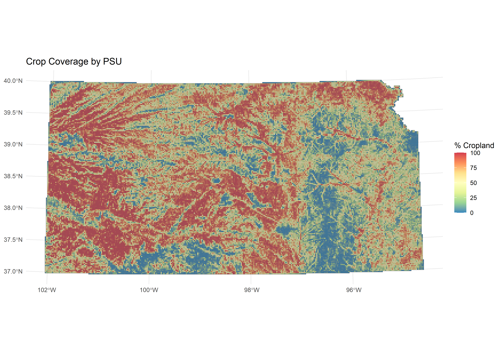
```

*Filter PSUs based on cropland threshold*

Only PSUs exceeding the minimum cropland threshold (`percent_crop`) are retained for subsequent TSU placement and sampling. This ensures that sampling effort is concentrated in PSUs where cropland is sufficiently prevalent to meet study objectives.

```{r filter-psus, eval=FALSE}
psu_grid <- psu_grid[psu_grid$crop_perc > percent_crop, "ID"]

cat(sprintf("Retained %d PSUs with > %d%% crop coverage\n", 
            nrow(psu_grid), percent_crop))
```

*Rasterize PSUs for Covariate Space Coverage*

The vector-based PSU grid is converted into raster format to enable efficient extraction and aggregation of environmental covariates. Rasterizing PSUs ensures spatial alignment with environmental covariates and allows cell-based operations for subsequent analysis (e.g., facilitating accurate clustering).

```{r rasterize-psus, eval=FALSE}
# Purpose: Convert vector PSUs to raster format for covariate extraction

template <- rast(vect(psu_grid), res = psu_size)
template <- rasterize(vect(psu_grid), template, field = "ID")

# Crop covariates to eligible PSUs only
cov.dat <- crop(cov.dat, psu_grid, mask=TRUE)
PSU.r <- resample(cov.dat, template)
```

### Calculate optimal sample size {#sec-optimal-sample-size}

After rasterizing the PSUs for covariate space coverage, the optimal sample size is determined based on divergence metrics [@saurette2023]. This section determines the optimal number of PSUs required to adequately represent environmental variability across the study area. Rather than selecting a sample size arbitrarily, a data-driven optimisation approach is applied to identify the point at which increasing the number of PSUs yields diminishing returns in environmental coverage.

```{r load-opt-sample, eval=FALSE}
# Purpose: Determine how many PSUs needed for representative coverage
# What this does:
#  - Tests different sample sizes (50, 75, 100, ... up to 3000 PSUs)
#  - Measures how well each sample size represents environmental variability
#  - Identifies the "sweet spot" where adding more PSUs gives diminishing returns
#  - Uses Kullback-Leibler divergence to compare sample vs population distributions
#
# Method: Feature Space Coverage (FCS) algorithm
#  - Iteratively samples PSUs and compares to full covariate space
#  - Repeats 4 times per sample size to ensure stability
#  - Selects optimal N where coverage reaches 95% of maximum
#
# COMPUTATION TIME: 
#  - Small areas (<1000 PSUs): 2-6 hours
#  - Medium areas (1000-5000 PSUs): 6-24 hours  
#  - Large areas (>5000 PSUs): 1-3 days
#  - Depends on: # of PSUs, # of covariates, CPU cores available
#
# SKIP THIS SECTION IF:
#  - You already ran it and saved the result (optimal_N_KLD.RDS exists)
#  - You have a predetermined sample size (e.g., budget constraints)
#  - Running quick tests (use arbitrary N like 50-100 PSUs)
#

source("scripts/opt_sample.R")  # Load optimization functions

psu.r.df <- data.frame(PSU.r)

# Optimization parameters
initial.n <- 50
final.n <- 3000
by.n <- 25
iters <- 4

# Run optimization (can take several minutes)
opt_N_fcs <- opt_sample(alg="fcs",
                        s_min=initial.n,
                        s_max=final.n,
                        s_step=by.n,
                        s_reps=iters,
                        covs = psu.r.df,
                        cpus=4,
                        conf=0.95)

optimal_N_KLD <- opt_N_fcs$optimal_sites[1,2]
cat(sprintf("Optimal sample size: %d PSUs\n", optimal_N_KLD))

saveRDS(optimal_N_KLD, paste0(results.path,"../optimal_N_KLD.RDS"))
```

::: {style="background-color:#fff9c4;border-left:4px solid #fbc02d; padding:10px; font-size:0.9em;"}
**💡 Note**: The optimal sample size is based on Kullback-Leibler Divergence, which does not overestimate like Jensen-Shannon methods.
:::

### Select PSUs using Covariate Space Coverage (CSC) {#sec-select-psus-csc}

After determining the target number of PSUs, the next step is to select PSU locations that maximise environmental diversity across the study area. The goal is not random spatial coverage, but coverage of the multivariate covariate space so that sampled PSUs collectively represent the dominant environmental gradients captured by the covariates (i.e., PCA components).

This section implements a CSC strategy using clustering in standardised covariate space. Selected PSUs correspond to cluster representatives and are interpreted as locations that best capture distinct portions of the environmental feature space. Sampling effort is allocated according to land-use priorities. In this example, the majority of PSUs are assigned to cropland. A buffer can be included to maintain the final target after excluding PSUs that fail feasibility checks later in the workflow.

```{r prepare-csc, eval=FALSE}
# You can use the file from the repository for this exercise. 
optimal_N_KLD <- readRDS(paste0(results.path,"../optimal_N_KLD.RDS"))

# Proportional allocation by land-use class (adjust to study objectives)
crop_prop   <- 0.85
grass_prop  <- 0.10
forest_prop <- 0.05

# Number of PSUs allocated to cropland
n.psu <- round(optimal_N_KLD * crop_prop, 0)

# Optional buffer to account for exclusions during later steps
n.psu <- round(optimal_N_KLD * crop_prop * 1.15, 0)

cat(sprintf("Targeting %d PSUs for %s\n", n.psu, landuse)) # 412
```

*Prepare PSU-level*

Clustering is performed in standardised covariate space to ensure that each covariate contributes comparably. The resulting matrix (`mygrd`) represents each PSU as a point in multivariate feature space.

```{r prepare-psu-level, eval=FALSE}
PSU.df <- as.data.frame(PSU.r, xy=T)
covs <- names(cov.dat)
mygrd <- data.frame(scale(PSU.df[, covs]))
```

*Constrained clustering to respect legacy samples*

If legacy sampling locations are available, they are incorporated using constrained clustering so that previously sampled PSUs remain part of the final design. Legacy points are matched to their nearest PSU representation and treated as fixed elements in the clustering solution. If no legacy data exist, standard k-means clustering is used to partition covariate space into *n* clusters.

```{r constr-psu-csc-legacy, eval=FALSE}
# If legacy data exists, use constrained clustering
if (exists("legacy")){
  legacy <- st_filter(legacy, psu_grid)
  legacy_df <- st_coordinates(legacy)
  
  # Find nearest PSU for each legacy point
  units <- numeric(nrow(legacy_df))
  for (i in 1:nrow(legacy_df)) {
    distances <- sqrt((PSU.df$x - legacy_df[i, "X"])^2 + (PSU.df$y - legacy_df[i, "Y"])^2)
    units[i] <- which.min(distances)
  }
  
  fixed <- unique(data.frame(units, scale(PSU.df[, covs])[units, ]))
  
  # Run constrained clustering
  res <- CSIS(fixed = fixed, nsup = n.psu, nstarts = iterations, mygrd = mygrd)
  
} else {
  # No legacy data: standard k-means
  res <- kmeans_with_progress(mygrd, centers = n.psu, iter.max = 10000, nstart = iterations)
}
```

::: {style="background-color:#fff9c4;border-left:4px solid #fbc02d; padding:10px; font-size:0.9em;"}
**💡 Note**: Progress is printed as "X out of Y" for each clustering iteration.
:::

*Select representative PSUs from cluster centers*

Cluster centers exist in covariate space, not geographic space. Therefore, for each cluster center, the PSU with the minimum Euclidean distance in standardized covariate space is selected. These PSUs form the CSC sample because they are the closest realizations of the cluster “typical” environmental conditions.

```{r sel-repr-psus-cluster-centre, eval=FALSE}
# Assign cluster IDs
PSU.df$cluster <- res$cluster

# Find PSU closest to each cluster center (these become sample locations)
D <- rdist(x1 = res$centers, x2 = scale(PSU.df[, covs]))
units <- apply(D, MARGIN = 1, FUN = which.min)

myCSCsample <- PSU.df[units, c("x", "y", covs)]
```

*Label legacy vs new selections and convert to spatial format*

Selections are labeled to distinguish previously sampled PSUs (“legacy”) from newly proposed PSUs (“new”). The selected PSU representatives are then converted into an `sf` point layer for spatial overlay and mapping.

```{r label-legacy-new-psus, eval=FALSE}
# Label legacy vs new PSUs
if (exists("legacy")){
  myCSCsample$type <- c(rep("legacy", nrow(fixed)), rep("new", length(units)-nrow(fixed)))
} else {
  myCSCsample$type <- "new"
}

# Convert to spatial object
myCSCsample <- myCSCsample %>%
  st_as_sf(coords = c("x", "y"), crs = epsg)

# Separate legacy and new
if (exists("legacy")){
  legacy <- myCSCsample[myCSCsample$type=="legacy",]
}
new <- myCSCsample[myCSCsample$type=="new",]
```

*Identify target PSU polygons*

Selected PSU representative points are intersected with the PSU polygon grid to recover the corresponding PSU IDs. The resulting polygon layer (`target.PSUs`) defines the final set of target PSUs for subsequent TSU placement.

```{r id-target-psu-pol, eval=FALSE}
# Extract target PSU IDs
PSUs <- sf::st_intersection(psu_grid, new) %>% dplyr::select(ID)
target.PSUs <- psu_grid[psu_grid$ID %in% PSUs$ID,] %>% dplyr::select(ID)

cat(sprintf("Selected %d target PSUs\n", nrow(target.PSUs)))
```

::: {style="background-color:#e3f2fd;border-left:4px solid #1e88e5; padding:10px; font-size:0.9em;"}
*Output*: The procedure returns ***n*** **target PSUs**, where *n* corresponds to the allocated sample size determined in the optimization step. These PSUs represent environmentally diverse sampling locations that collectively achieve the desired level of feature space coverage.
:::

*Visualise final outputs*

```{r vis-selected-psus-outputs, eval=FALSE}
ggplot() +
  geom_raster(data = as.data.frame(PSU.r$PC1, xy = TRUE), aes(x = x, y = y, fill = PC1)) +
  scale_fill_viridis_c() +
  geom_sf(data = target.PSUs, color = "#101010", fill = NA, lwd = 0.8) +
  geom_sf(data = new[1], color = "#D81B60", size = 0.5, shape = 19) +
  labs(title = "Target Primary Sampling Units") +
  theme_minimal()
```

```{r psu-selected-map, echo=FALSE, fig.cap="Distribution of selected target Primary Sampling Units over the covariate space coverage.", out.width='100%'}
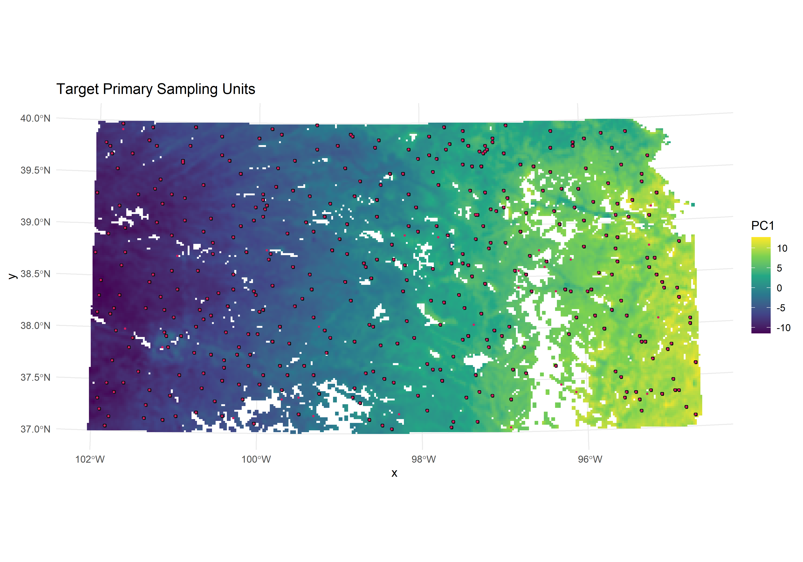
```

### Compute SSUs and TSUs {#compute-ssu-tsu}

Now we generate Secondary Sampling Units (100m × 100m) within each PSU and Tertiary Sampling Units (20m × 20m points) within each SSU.

*Load high-resolution covariates*

This section loads the high-resolution covariate raster stack (100 m) used to guide Secondary Sampling Unit (SSU) selection within each selected PSU. These covariates are distinct from the PSU-level covariates used earlier for PSU selection. At this stage, the objective is to capture within-PSU heterogeneity and support clustering or stratification at the SSU scale.

```{r load-highres, eval=FALSE}
# Purpose: Load 100m resolution data for SSU clustering WITHIN each PSU
# Note: Different from PSU covariates - these determine SSU placement

cov.dat.ssu <- terra::rast(paste0(raster.path, "HighRes_Covariates_100m_KANSAS_merged.tif"))
names(cov.dat.ssu) <- gsub("(^\\d+_?S2_|^\\d+_|^S2_)", "", names(cov.dat.ssu))

if(crs(cov.dat.ssu)!=epsg){
  cov.dat.ssu <- terra::project(cov.dat.ssu, epsg, method="near")
}

# Check for and replace NA values
# Why: NA values cause complete.cases() to remove SSUs unnecessarily
# Solution: Replace NA with 0 (assumes missing data = no feature present)
if (any(is.na(values(cov.dat.ssu)))) {
  cat("Found NA values in SSU covariates. Replacing with 0...\n")
  na_count <- sum(is.na(values(cov.dat.ssu)))
  total_count <- ncell(cov.dat.ssu) * nlyr(cov.dat.ssu)
  cat(sprintf("Replacing %d NA values (%.2f%% of data)\n", 
              na_count, (na_count/total_count)*100))
  
  cov.dat.ssu[is.na(cov.dat.ssu)] <- 0
  
  cat("NA values replaced with 0\n\n")
} else {
  cat("No NA values found in SSU covariates\n\n")
}

writeRaster(cov.dat.ssu, paste0(raster.path,"cov_dat_ssu_100m_clean.tif"), overwrite=TRUE)
# Load if needed. Similar process to cov.dat and land use vars.
# cov.dat.ssu <- rast(paste0(raster.path,"cov_dat_ssu_100m_clean.tif"))
```

```{r, table-high-res-vars-ssus, eval=FALSE}

ssu_vars <- data.frame(
  Category = c(
    rep("Topography", 5),
    rep("Sentinel-2 Spectral Bands", 10),
    rep("Spectral Indices", 7)
  ),
  Variable = c(
    "SRTM_DEM", "Slope", "Aspect", "TPI", "Hillshade",
    "B2_Blue", "B3_Green", "B4_Red", "B5_RedEdge1", "B6_RedEdge2",
    "B7_RedEdge3", "B8_NIR", "B8A_NarrowNIR", "B11_SWIR1", "B12_SWIR2",
    "NDVI", "EVI", "NDBSI", "Redness_Index", "Brightness_Index",
    "NBRplus", "VNSIR"
  ),
  Description = c(
    "Digital Elevation Model (SRTM)",
    "Terrain slope derived from DEM",
    "Terrain aspect (orientation)",
    "Topographic Position Index",
    "Hillshade derived from DEM",
    "Blue band (490 nm)",
    "Green band (560 nm)",
    "Red band (665 nm)",
    "Red-edge band 1 (705 nm)",
    "Red-edge band 2 (740 nm)",
    "Red-edge band 3 (783 nm)",
    "Near-Infrared band (842 nm)",
    "Narrow Near-Infrared band (865 nm)",
    "Shortwave Infrared 1 (1610 nm)",
    "Shortwave Infrared 2 (2190 nm)",
    "Normalized Difference Vegetation Index",
    "Enhanced Vegetation Index",
    "Normalized Difference Bare Soil Index",
    "Redness spectral index",
    "Brightness index (composite reflectance)",
    "Normalized Burn Ratio (extended form)",
    "Visible and near-infrared spectral index"
  )
)

kable(ssu_vars,
      caption = "High-resolution (100 m) covariates used for SSU-level clustering.")

```

*Core process of generating SSUs and TSUs*

This section implements the core step of the three-stage sampling design. For each selected PSU, a grid of SSUs is generated and filtered to retain agriculturally valid units. SSU-level environmental covariates are then used to cluster SSUs and select a fixed number of target and replacement SSUs that represent within-PSU variability. Finally, TSU point locations are generated within each selected SSU, constrained to cropland pixels.

For each PSU in `target.PSUs`, the workflow proceeds as follows:

-   Create SSU grid at 100 m resolution and clip it to the PSU boundary.

-   Quantify cropland availability per SSU using the 20 m cropland mask and remove SSUs with insufficient valid crop pixels.

-   Extract SSU-level covariates (100 m covariate stack) and prepare a standardized feature matrix for clustering.

-   Cluster SSUs (k-means) to represent within-PSU environmental variation and select:

    -   one SSU closest to each cluster center (Target SSUs), and

    -   the second closest SSU (Replacement SSUs).

-   Generate TSU points inside each target and replacement SSU, restricted to cropland cells.

::: {style="background-color:#fff9c4;border-left:4px solid #fbc02d; padding:10px; font-size:0.9em;"}
*Quality control*: PSUs that fail any criterion (e.g., too few SSUs, covariate mismatches, incomplete cases, TSU generation failure) are skipped and recorded.
:::

```{r process-ssus-tsus-target, eval=FALSE}
# Purpose: Within each target PSU, create SSUs and TSUs
# This is the CORE of the three-stage sampling design

# Initialize storage
all_psus_tsus <- list()
selected_ssus <- list()
skipped_psus <- c()

# MAIN LOOP: Process each target PSU
# MAIN LOOP: Process each target PSU to generate SSUs and TSUs
for (psu_id in 1:nrow(target.PSUs)) {
  
  # Select current PSU
  selected_psu <- target.PSUs[psu_id, ]
  
  # STEP 1: Generate 100m×100m SSU grid within the PSU boundary
  ssu_grid <- st_make_grid(selected_psu, cellsize = c(ssu_size, ssu_size), square = TRUE)
  ssu_grid_sf <- st_sf(geometry = ssu_grid)
  
  # Clip SSU grid to exact PSU boundary (removes partial cells outside PSU)
  ssu_grid_sf <- suppressWarnings(st_intersection(ssu_grid_sf, st_geometry(selected_psu)))
  
  # Convert to terra vector format for raster extraction
  ssu_grid_vect <- vect(ssu_grid_sf)
  
  # STEP 2: Calculate crop percentage for each SSU
  # Extracts from 20m resolution crop raster and calculates % coverage
  extracted_values <- extract(crops, ssu_grid_vect, fun = function(x) {
    sum(x > 0, na.rm = TRUE) / length(x) * 100
  })
  
  # Debug output: show range of crop coverage in this PSU
  cat(sprintf("\nPSU %d \n lu values range: %.2f to %.2f\n", 
              psu_id, min(extracted_values[,2]), max(extracted_values[,2])))
  
  # STEP 3: Verify extraction succeeded and assign crop values
  if (ncol(extracted_values) >= 2) {
    ssu_grid_sf$lu <- extracted_values[, 2]
    
    # STEP 4: Handle split geometries from st_intersection
    # st_intersection sometimes creates MULTIPOLYGON - we need to merge them back
    ssu_grid_sf$ssu_temp_id <- 1:nrow(ssu_grid_sf)  # Track original SSU IDs
    ssu_grid_sf <- st_cast(ssu_grid_sf, "POLYGON")  # Split any MULTIPOLYGONs
    
    # Merge split parts back to single polygons per SSU
    ssu_grid_sf <- ssu_grid_sf %>%
      group_by(ssu_temp_id, lu) %>%
      summarise(geometry = st_union(geometry), .groups = "drop") %>%
      select(-ssu_temp_id)  # Remove temporary ID
    
    # Store count before filtering for reporting
    total_ssus_before <- nrow(ssu_grid_sf)
    
    # STEP 5: Filter SSUs by actual 20m crop pixel count
    # This is more accurate than percentage and prevents TSU generation failures
    cat("Checking crop pixel availability for TSU generation...\n")
    ssu_grid_sf$crop_pixel_count <- sapply(1:nrow(ssu_grid_sf), function(i) {
      ssu_geom <- ssu_grid_sf[i, ]
      ssu_vect <- vect(ssu_geom)
      
      # Crop the 20m raster to this SSU and count valid pixels
      ssu_crop <- try(crop(crops, ssu_vect, mask = TRUE), silent = TRUE)
      if (inherits(ssu_crop, "try-error") || is.null(ssu_crop)) return(0)
      
      crop_vals <- values(ssu_crop, mat = FALSE)
      sum(crop_vals > 0, na.rm = TRUE)
    })
    
    # Minimum pixels needed: number of TSUs + safety buffer
    min_crop_pixels <- number_TSUs + 5
    ssu_grid_sf <- ssu_grid_sf[ssu_grid_sf$crop_pixel_count >= min_crop_pixels, ]
    
    # Report how many SSUs were removed
    cat(sprintf("SSUs after crop pixel filter: %d (removed %d)\n",
                nrow(ssu_grid_sf), total_ssus_before - nrow(ssu_grid_sf)))
    
  } else {
    # Extraction failed - skip this PSU
    warning(paste("PSU", psu_id, "returned insufficient extracted values. Skipping."))
    skipped_psus <- c(skipped_psus, psu_id)
    next
  }
  
  # Progress indicator
  cat(sprintf("\rProgress: %.2f%% (%d out of %d)\n", 
              (psu_id / nrow(target.PSUs)) * 100, psu_id, nrow(target.PSUs)))
  flush.console()
  
  # STEP 6: Check if enough SSUs remain for clustering
  total_ssus <- nrow(ssu_grid_sf)
  min_required_ssus <- max(num_primary_ssus + num_alternative_ssus, 8)  # Default: 4+4=8
  
  if (total_ssus < min_required_ssus) {
    warning(paste("PSU", psu_id, "has only", total_ssus, 
                  "usable SSUs (min required:", min_required_ssus, "). Skipping."))
    skipped_psus <- c(skipped_psus, psu_id)
    next
  }
  
  # STEP 7: Extract 100m environmental covariates for each SSU
  ssu_grid_vect_filtered <- vect(ssu_grid_sf)
  ssu_covariates <- terra::extract(cov.dat.ssu, ssu_grid_vect_filtered, df = TRUE)
  
  # Aggregate covariates if any SSUs were split (collapse to one row per SSU)
  ssu_covariates <- ssu_covariates %>%
    group_by(ID) %>%
    summarise(across(everything(), ~mean(.x, na.rm = TRUE)))
  
  # Verify SSU count matches covariate count (critical for alignment)
  if (nrow(ssu_covariates) != nrow(ssu_grid_sf)) {
    warning(sprintf("PSU %d: Mismatch in SSU and covariate rows (%d vs %d). Skipping.", 
                    psu_id, nrow(ssu_grid_sf), nrow(ssu_covariates)))
    skipped_psus <- c(skipped_psus, psu_id)
    next
  }
  
  # STEP 8: Prepare covariates for k-means clustering
  # Combine spatial data with environmental covariates
  ssu_data <- cbind(ssu_grid_sf, ssu_covariates[, -1])
  ssu_data_values <- st_drop_geometry(ssu_data)
  
  # Separate categorical variables (don't scale these)
  exclude <- grep("^geomorph_|^lu$", names(ssu_data_values), value = TRUE)
  to_scale <- ssu_data_values[, !names(ssu_data_values) %in% exclude]
  to_keep  <- ssu_data_values[, names(ssu_data_values) %in% exclude, drop = FALSE]
  
  # Remove columns with all NA values
  to_scale <- to_scale[, colSums(!is.na(to_scale)) > 0, drop = FALSE]
  
  # Identify zero-variance columns (would cause scaling errors)
  zero_variance_cols <- sapply(to_scale, function(x) sd(x, na.rm = TRUE) == 0)
  zero_variance_cols[is.na(zero_variance_cols)] <- TRUE
  
  # Scale only non-zero-variance columns
  scaled_part <- to_scale
  if (any(!zero_variance_cols)) {
    scaled_part[, !zero_variance_cols] <- scale(to_scale[, !zero_variance_cols])
  }
  
  # STEP 9: Remove incomplete cases and keep ssu_data aligned
  mygrd_ssu <- cbind(to_keep, scaled_part)
  complete_rows <- complete.cases(mygrd_ssu)
  mygrd_ssu <- mygrd_ssu[complete_rows, ]
  ssu_data <- ssu_data[complete_rows, ]  # CRITICAL: Keep aligned with mygrd_ssu!
  
  # Verify enough SSUs remain after removing incomplete cases
  if (nrow(mygrd_ssu) < 4) {
    warning(paste("PSU", psu_id, "has too few SSUs (", nrow(mygrd_ssu), ") to form 4 clusters. Skipping."))
    skipped_psus <- c(skipped_psus, psu_id)
    next
  }
  
  # STEP 10: Cluster SSUs using k-means
  # Number of clusters = number of target SSUs needed
  optimal_k <- num_primary_ssus
  
  kmeans_result <- kmeans(mygrd_ssu[, -1, drop = FALSE], centers = optimal_k, iter.max = 10000, nstart = 10)
  ssu_data$cluster <- as.factor(kmeans_result$cluster)
  
  # STEP 11: Select SSUs closest to cluster centers
  # These become target and replacement SSUs
  D <- rdist(x1 = kmeans_result$centers, x2 = mygrd_ssu[, -1, drop = FALSE])
  target_units <- apply(D, 1, function(x) order(x)[1])      # 1st closest = target
  replacement_units <- apply(D, 1, function(x) order(x)[2]) # 2nd closest = replacement
  
  # Verify we got enough SSUs
  if (length(target_units) < num_primary_ssus || length(replacement_units) < num_alternative_ssus) {
    warning(sprintf("PSU %d did not yield", num_primary_ssus ,"target and", num_alternative_ssus, "replacement SSUs. Skipping.", psu_id))
    skipped_psus <- c(skipped_psus, psu_id)
    next
  }
  
  # STEP 12: Extract selected SSUs and add metadata
  target_ssus <- ssu_data[target_units, ]
  replacement_ssus <- ssu_data[replacement_units, ]
  
  target_ssus$SSU_Type <- "Target"
  replacement_ssus$SSU_Type <- "Replacement"
  target_ssus$SSU_ID <- 1:nrow(target_ssus)
  replacement_ssus$SSU_ID <- (nrow(target_ssus) + 1):(2 * nrow(target_ssus))
  
  # Link each replacement SSU to its corresponding target SSU (same cluster)
  replacement_ssus$replacement_for <- sapply(replacement_ssus$cluster, function(cl) {
    matched <- target_ssus$SSU_ID[target_ssus$cluster == cl]
    if (length(matched) > 0) return(matched[1]) else return(NA)
  })
  
  target_ssus$replacement_for <- NA
  
  # Add PSU identifier
  psu_actual_id <- selected_psu$ID
  target_ssus$PSU_ID <- psu_actual_id
  replacement_ssus$PSU_ID <- psu_actual_id
  
  # Combine target and replacement SSUs
  combined_ssus <- rbind(target_ssus, replacement_ssus)
  
  # STEP 13: Final check - must have exactly expected number of SSUs
  if (nrow(combined_ssus) != (num_primary_ssus + num_alternative_ssus)) {
    warning(sprintf("PSU %d has %d SSUs instead of", num_primary_ssus + num_alternative_ssus, ". Skipping.", psu_id, nrow(combined_ssus)))
    skipped_psus <- c(skipped_psus, psu_id)
    next
  }
  
  # Store SSUs for this PSU
  selected_ssus[[psu_id]] <- combined_ssus
  
  # STEP 14: Generate TSU point samples within each SSU
  primary_tsus <- lapply(1:nrow(target_ssus), function(i) {
    generate_tsu_points_within_ssu(target_ssus[i, ], number_TSUs, target_ssus$SSU_ID[i], "Target", crops)
  })
  
  alternative_tsus <- lapply(1:nrow(replacement_ssus), function(i) {
    generate_tsu_points_within_ssu(replacement_ssus[i, ], number_TSUs, replacement_ssus$SSU_ID[i], "Replacement", crops)
  })
  
  # STEP 15: Verify all TSUs were generated successfully
  all_tsus <- c(primary_tsus, alternative_tsus)
  tsu_counts <- sapply(all_tsus, function(x) if(is.null(x)) 0 else nrow(x))
  
  # Check: each SSU must have exactly number_TSUs points
  if (any(tsu_counts != number_TSUs)) {
    warning(sprintf("PSU %d: TSU generation failed for some SSUs. Expected %d TSUs per SSU, got: %s. Skipping.", 
                    psu_id, number_TSUs, paste(tsu_counts, collapse=",")))
    skipped_psus <- c(skipped_psus, psu_id)
    # Remove this PSU from selected SSUs (failed at final step)
    selected_ssus[[psu_id]] <- NULL
    next
  }
  
  # Store all TSUs for this PSU
  all_psus_tsus[[psu_id]] <- do.call(rbind, Filter(Negate(is.null), all_tsus))
}
```

::: {style="background-color:#e8f5e9;border-left:4px solid #43a047; padding:10px; font-size:0.9em;"}
*Processing Summary*:\
For each PSU, the loop reports:

-   The range of cropland coverage across generated SSUs (`lu` values range).
-   The number of SSUs remaining after enforcing the minimum crop pixel threshold.
-   The number of SSUs removed due to insufficient cropland.
-   A real-time progress indicator showing the percentage completed and the current PSU index.

*Example:*\
For *PSU 20*, cropland coverage ranged from **0% to 100%**. After applying the crop pixel filter, **278 SSUs** remained and **122 SSUs** were removed. At this point, the overall progress was **5.32% (20 out of 376 PSUs processed)**.

This detailed reporting ensures transparency of SSU filtering and allows monitoring of computational progress during execution.
:::

```{r summary-process-ssus-tsus-target, eval=FALSE}
# Summary
cat(sprintf("Successfully processed: %d PSUs\n", length(selected_ssus)))
cat(sprintf("Skipped: %d PSUs\n", length(skipped_psus)))
if (length(skipped_psus) > 0) {
  cat(sprintf("Skipped PSU IDs: %s\n", paste(skipped_psus, collapse = ", ")))
}
```

*Combine and structure SSUs and TSUs*

This section consolidates the TSU point samples generated across all processed PSUs into a single, well-structured spatial dataset. SSU metadata (e.g., target vs replacement status and replacement links) are joined to each TSU to support field implementation, traceability, and downstream reporting.

```{r combine-ssu-tsu, eval=FALSE}
# Purpose: Merge all TSUs into single spatial dataset with proper structure

all_ssus <- do.call(rbind, selected_ssus)
all_ssus <- all_ssus %>% mutate_at(vars(PSU_ID, SSU_ID), as.numeric)

all_tsus <- do.call(rbind, all_psus_tsus)
all_tsus <- all_tsus %>% mutate_at(vars(PSU_ID, SSU_ID), as.numeric)

# Join TSU and SSU metadata
all_tsus <- st_join(all_tsus, all_ssus[c("PSU_ID", "SSU_ID", "SSU_Type", "replacement_for")])

all_tsus <- all_tsus %>%
  select(PSU_ID = PSU_ID.x, SSU_ID = SSU_ID.y, SSU_Type = SSU_Type.y,
         Replacement_for = replacement_for, TSU_ID, geometry)

# Label TSU types (Target = primary sample, Alternative = backup)
all_tsus <- all_tsus %>%
  group_by(PSU_ID) %>%
  filter(n() == (num_primary_ssus + num_alternative_ssus) * number_TSUs) %>%  # 24 for default
  group_by(PSU_ID, SSU_ID) %>%
  mutate(TSU_Type = ifelse(row_number() == 1, "Target", "Alternative")) %>%
  ungroup()

all_tsus$PSU_Type <- "Target"

all_tsus <- all_tsus %>%
  dplyr::select("PSU_ID", "SSU_ID", "SSU_Type", "Replacement_for", 
                "TSU_ID", "TSU_Type", "geometry")

# Count target samples
n_target_tsus <- all_tsus %>%
  filter(SSU_Type == "Target" & TSU_Type == "Target") %>%
  distinct(PSU_ID, SSU_ID) %>%
  nrow()

cat(sprintf("\nTotal target sampling locations: %d\n", n_target_tsus))
```

::: {style="background-color:#e3f2fd;border-left:4px solid #1e88e5; padding:10px; font-size:0.9em;"}
*Output*: The resulting dataset (`all_tsus`) is the finalised TSU sampling frame, where each point includes its PSU and SSU identifiers, SSU status (target vs replacement), and TSU status (target vs alternative). This structure supports both field navigation and reproducible linking of observations to the sampling design.
:::

*Visualise final outputs*

```{r vis-sampling-design-target-outputs, eval=FALSE}
ggplot() +
  geom_raster(data = as.data.frame(PSU.r$PC1, xy = TRUE), aes(x = x, y = y, fill = PC1)) +
  scale_fill_viridis_c() +
  geom_sf(data = target.PSUs, color = "#101010", fill = NA, lwd = 0.8) +
  geom_sf(data = new[1], color = "#D81B60", size = 0.5, shape = 19) +
  labs(title = "Target Primary Sampling Units") +
  theme_minimal()
```

```{r plot-sampling-design-target-outputs, echo=FALSE, fig.cap="Illustration of the hierarchical three-stage sampling design showing the PSU boundary, selected SSUs (i.e., target and replacement), and TSU point locations within a representative PSU.", out.width='100%'}
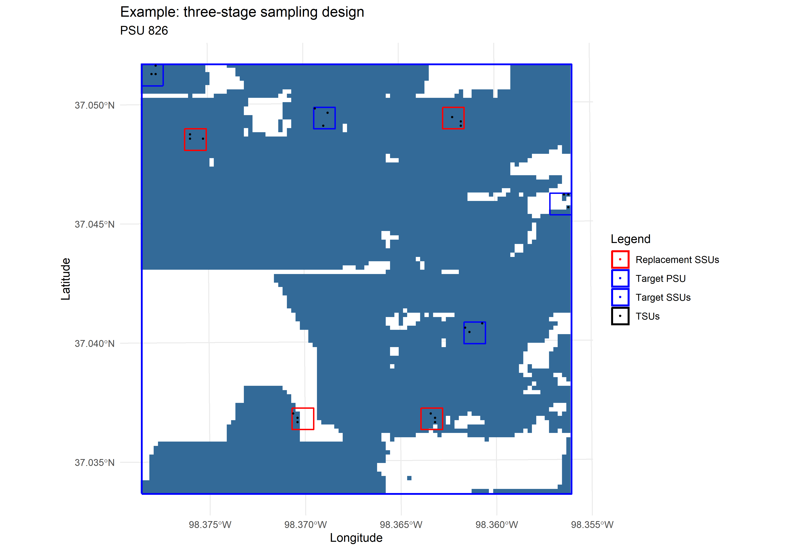
```

*Export sampling units*

This section prepares and exports the final spatial layers required for field implementation. Specifically, cluster information is attached to PSUs and TSUs, a consistent sampling order and unique site identifiers are generated, and the finalized PSU/TSU layers are written to disk as shapefiles plus a raster of clusters for reference.

```{r export-all-target-psus, eval=FALSE}
# Purpose: Save all shapefiles for field work

# Add cluster information
dfr <- PSU.df[,c("x","y","cluster")]
dfr$cluster <- as.numeric(dfr$cluster)
dfr <- rasterFromXYZ(dfr)
crs(dfr) <- epsg

valid.PSU_clusters <- target.PSUs %>% 
  mutate(cluster = extract(dfr, target.PSUs, fun = mean, na.rm = TRUE))

all.PSU_clusters <- psu_grid %>% 
  mutate(cluster = extract(dfr, psu_grid, fun = mean, na.rm = TRUE))

all.PSU_clusters <- na.omit(all.PSU_clusters)

valid.PSU_clusters <- valid.PSU_clusters %>% rename(Replace_ID = cluster)

# Join cluster info to TSUs
all_tsus <- st_join(all_tsus, valid.PSU_clusters)

# Add sampling order
all_tsus <- all_tsus %>%
  group_by(PSU_ID) %>%
  mutate(order = match(SSU_ID, unique(SSU_ID))) %>%
  ungroup()

# Create unique site IDs
# Format: [COUNTRY CODE][PSU ID]-[SSU ID]-[TSU ID][LAND USE]
# Example: KANSAS0001-1-1C (PSU 1, SSU 1, TSU 1, Cropland)
all_tsus$site_id <- paste0(ISO.code, sprintf("%04d", all_tsus$PSU_ID), 
                           "-", all_tsus$SSU_ID, 
                           "-", all_tsus$TSU_ID, "C")  # C for Cropland

# Filter valid PSUs (those with complete TSU sets)
psus_with_tsus <- unique(all_tsus$PSU_ID)
valid.PSU_clusters_filtered <- valid.PSU_clusters %>%
  filter(ID %in% psus_with_tsus)

# Export shapefiles
write_sf(valid.PSU_clusters_filtered, 
         paste0(results.path,"/PSUs_target.shp"), overwrite=TRUE)
write_sf(all_tsus, 
         paste0(results.path,"/TSUs_target.shp"), overwrite=TRUE)
write_sf(all.PSU_clusters, 
         paste0(results.path,"/PSU_pattern_cl.shp"), overwrite=TRUE)
writeRaster(dfr, paste0(results.path,"/clusters.tif"), overwrite=TRUE)

```

### Compute Alternative PSUs {#alternative-psus}

Field sampling designs typically require contingency options because some target PSUs may become inaccessible (e.g., access restrictions, flooded roads, crop harvest, safety constraints). To maintain environmental representativeness while providing operational flexibility, a replacement PSU is selected for each target PSU cluster. Replacements are chosen from the same cluster as the target PSU, ensuring that the replacement PSU is environmentally similar in the multivariate covariate space.

Generate replacement PSUs from the same environmental clusters as targets.

```{r compute-replacements, eval=FALSE}
# Purpose: For each target PSU, find a similar replacement in same cluster
# Why: Field teams need backups if target PSU becomes inaccessible

# Find PSUs NOT selected as targets
remaining.PSU_clusters <- all.PSU_clusters %>%
  filter(!(ID %in% valid.PSU_clusters$ID))

# Get unique cluster IDs from targets
unique_cluster <- distinct(valid.PSU_clusters, Replace_ID)$Replace_ID

# Sample one replacement per cluster
sampled_indices <- integer(0)

for (clust in unique_cluster) {
  candidates_indices <- which(remaining.PSU_clusters$cluster == clust)
  
  if (length(candidates_indices) > 0) {
    sampled_index <- sample(candidates_indices, size = 1)
    sampled_indices <- c(sampled_indices, sampled_index)
  }
}

replacements <- remaining.PSU_clusters[sampled_indices, ]

cat(sprintf("Selected %d replacement PSUs\n", nrow(replacements)))
```

::: {style="background-color:#e3f2fd;border-left:4px solid #1e88e5; padding:10px; font-size:0.9em;"}
*Output*: The object replacements contains one backup PSU per target cluster, where available. These replacement PSUs can be used by field teams if a target PSU cannot be sampled, while preserving the intended environmental coverage of the sampling design.
:::

*Generating SSUs and TSUs for replacement PSUs*

Following the same procedure used for the target PSUs, SSUs and TSUs are generated within each replacement PSU. This ensures that backup PSUs are fully prepared for field deployment and maintain consistency with the three-stage sampling design. The process replicates SSU grid creation, covariate-based clustering, and TSU point generation, guaranteeing that replacement PSUs are operationally equivalent to their corresponding target PSUs.

```{r replac-psus-ssus-tsus, eval=FALSE}
# Purpose: Create same sampling structure in replacement PSUs
# Note: Code is identical to target PSU loop (Section 15)

alt_psus_tsus_sf <- list()
selected_ssus_sf <- list()
skipped_psus_sf <- c()

# DUPLICATE OF MAIN LOOP FOR REPLACEMENTS
# (See Section 15 for detailed comments)
for (psu_id in 1:nrow(replacements)) {
  selected_psu <- replacements[psu_id, ]
  
  # Generate SSUs within the selected PSU
  ssu_grid <- st_make_grid(selected_psu, cellsize = c(ssu_size, ssu_size), square = TRUE)
  ssu_grid_sf <- st_sf(geometry = ssu_grid)
  ssu_grid_sf <- suppressWarnings(st_intersection(ssu_grid_sf, st_geometry(selected_psu)))
  ssu_grid_vect <- vect(ssu_grid_sf)
  
  # Extract land use values (LU)
  extracted_values <- extract(crops, ssu_grid_vect, fun = function(x) {
    sum(x > 0, na.rm = TRUE) / length(x) * 100
  })
  
  # ADD THIS DEBUG LINE:
  cat(sprintf("\nPSU %d\n lu values range: %.2f to %.2f\n", 
              psu_id, min(extracted_values[,2]), max(extracted_values[,2])))
  
  # Defensive check: ensure extracted_values has at least 2 columns
  if (ncol(extracted_values) >= 2) {
    ssu_grid_sf$lu <- extracted_values[, 2]
    
    # FIX: Handle MULTIPOLYGON geometries that cause row mismatches
    ssu_grid_sf$ssu_temp_id <- 1:nrow(ssu_grid_sf)
    ssu_grid_sf <- st_cast(ssu_grid_sf, "POLYGON")
    
    # Group split geometries back together
    ssu_grid_sf <- ssu_grid_sf %>%
      group_by(ssu_temp_id, lu) %>%
      summarise(geometry = st_union(geometry), .groups = "drop") %>%
      select(-ssu_temp_id)
    
    # Store count before filtering
    total_ssus_before <- nrow(ssu_grid_sf)
    
    # ONLY USE THIS FILTER: Direct pixel count (accurate!)
    cat("Checking crop pixel availability for TSU generation...\n")
    ssu_grid_sf$crop_pixel_count <- sapply(1:nrow(ssu_grid_sf), function(i) {
      ssu_geom <- ssu_grid_sf[i, ]
      ssu_vect <- vect(ssu_geom)
      ssu_crop <- try(crop(crops, ssu_vect, mask = TRUE), silent = TRUE)
      if (inherits(ssu_crop, "try-error") || is.null(ssu_crop)) return(0)
      crop_vals <- values(ssu_crop, mat = FALSE)
      sum(crop_vals > 0, na.rm = TRUE)
    })
    
    min_crop_pixels <- number_TSUs + 5
    ssu_grid_sf <- ssu_grid_sf[ssu_grid_sf$crop_pixel_count >= min_crop_pixels, ]
    
    cat(sprintf("SSUs after crop pixel filter: %d (removed %d)\n",
                nrow(ssu_grid_sf), total_ssus_before - nrow(ssu_grid_sf)))
    
  } else {
    warning(paste("PSU", psu_id, "returned insufficient extracted values. Skipping."))
    skipped_psus_sf <- c(skipped_psus_sf, psu_id)
    next
  }
  
  cat(sprintf("\rProgress: %.2f%% (%d out of %d)\n", 
              (psu_id / nrow(replacements)) * 100, psu_id, nrow(replacements)))
  flush.console()
  
  # Count available SSUs
  total_ssus <- nrow(ssu_grid_sf)
  min_required_ssus <- max(num_primary_ssus + num_alternative_ssus, 8)  # 4 clusters x 2 SSUs each
  
  if (total_ssus < min_required_ssus) {
    warning(paste("PSU", psu_id, "has only", total_ssus, 
                  "usable SSUs (min required:", min_required_ssus, "). Skipping."))
    skipped_psus_sf <- c(skipped_psus_sf, psu_id)
    next
  }
  
  # Extract covariates
  # Convert filtered SSU grid to vector and extract covariates *after filtering*
  ssu_grid_vect_filtered <- vect(ssu_grid_sf)
  ssu_covariates <- terra::extract(cov.dat.ssu, ssu_grid_vect_filtered, df = TRUE)
  
  ssu_covariates <- ssu_covariates %>%
    group_by(ID) %>%
    summarise(across(everything(), ~mean(.x, na.rm = TRUE)))
  
  # Ensure alignment by checking row counts before binding
  if (nrow(ssu_covariates) != nrow(ssu_grid_sf)) {
    warning(sprintf("PSU %d: Mismatch in SSU and covariate rows (%d vs %d). Skipping.", 
                    psu_id, nrow(ssu_grid_sf), nrow(ssu_covariates)))
    skipped_psus_sf <- c(skipped_psus_sf, psu_id)
    next
  }
  
  ssu_data <- cbind(ssu_grid_sf, ssu_covariates[, -1])
  ssu_data_values <- st_drop_geometry(ssu_data)
  
  exclude <- grep("^geomorph_|^lu$", names(ssu_data_values), value = TRUE)
  to_scale <- ssu_data_values[, !names(ssu_data_values) %in% exclude]
  to_keep  <- ssu_data_values[, names(ssu_data_values) %in% exclude, drop = FALSE]
  
  to_scale <- to_scale[, colSums(!is.na(to_scale)) > 0, drop = FALSE]
  zero_variance_cols <- sapply(to_scale, function(x) sd(x, na.rm = TRUE) == 0)
  zero_variance_cols[is.na(zero_variance_cols)] <- TRUE
  
  scaled_part <- to_scale
  if (any(!zero_variance_cols)) {
    scaled_part[, !zero_variance_cols] <- scale(to_scale[, !zero_variance_cols])
  }
  
  mygrd_ssu <- cbind(to_keep, scaled_part)
  complete_rows <- complete.cases(mygrd_ssu)
  mygrd_ssu <- mygrd_ssu[complete_rows, ]
  # Also filter ssu_data to match
  ssu_data <- ssu_data[complete_rows, ]
  
  if (nrow(mygrd_ssu) < 4) {
    warning(paste("PSU", psu_id, "has too few SSUs (", nrow(mygrd_ssu), ") to form 4 clusters. Skipping."))
    skipped_psus_sf <- c(skipped_psus_sf, psu_id)
    next
  }
  
  # Fixed number of clusters
  optimal_k <- num_primary_ssus
  
  kmeans_result <- kmeans(mygrd_ssu[, -1, drop = FALSE], centers = optimal_k, iter.max = 10000, nstart = 10)
  ssu_data$cluster <- as.factor(kmeans_result$cluster)
  
  # Compute distances and pick SSUs closest to centers
  D <- rdist(x1 = kmeans_result$centers, x2 = mygrd_ssu[, -1, drop = FALSE])
  target_units <- apply(D, 1, function(x) order(x)[1])
  replacement_units <- apply(D, 1, function(x) order(x)[2])
  
  if (length(target_units) < num_primary_ssus || length(replacement_units) < num_alternative_ssus) {
    warning(sprintf("PSU %d did not yield", num_primary_ssus ,"target and", num_alternative_ssus, "replacement SSUs. Skipping.", psu_id))
    skipped_psus_sf <- c(skipped_psus_sf, psu_id)
    next
  }
  
  target_ssus <- ssu_data[target_units, ]
  replacement_ssus <- ssu_data[replacement_units, ]
  
  target_ssus$SSU_Type <- "Target"
  replacement_ssus$SSU_Type <- "Replacement"
  target_ssus$SSU_ID <- 1:nrow(target_ssus)
  replacement_ssus$SSU_ID <- (nrow(target_ssus) + 1):(2 * nrow(target_ssus))
  
  replacement_ssus$replacement_for <- sapply(replacement_ssus$cluster, function(cl) {
    matched <- target_ssus$SSU_ID[target_ssus$cluster == cl]
    if (length(matched) > 0) return(matched[1]) else return(NA)
  })
  
  target_ssus$replacement_for <- NA
  
  # Add PSU_ID and combine
  psu_actual_id <- selected_psu$ID
  target_ssus$PSU_ID <- psu_actual_id
  replacement_ssus$PSU_ID <- psu_actual_id
  # Combine SSUs
  combined_ssus <- rbind(target_ssus, replacement_ssus)
  
  # CHECK: Must have exactly 8 SSUs (4 target + 4 replacement)
  if (nrow(combined_ssus) != (num_primary_ssus + num_alternative_ssus)) {
    warning(sprintf("PSU %d has %d SSUs instead of", num_primary_ssus + num_alternative_ssus, ". Skipping.", psu_id, nrow(combined_ssus)))
    skipped_psus_sf <- c(skipped_psus_sf, psu_id)
    next
  }
  
  # Store only if we have exactly 8 SSUs
  selected_ssus_sf[[psu_id]] <- combined_ssus
  
  ### Generate TSUs ###
  primary_tsus <- lapply(1:nrow(target_ssus), function(i) {
    generate_tsu_points_within_ssu(target_ssus[i, ], number_TSUs, target_ssus$SSU_ID[i], "Target", crops)
  })
  
  alternative_tsus <- lapply(1:nrow(replacement_ssus), function(i) {
    generate_tsu_points_within_ssu(replacement_ssus[i, ], number_TSUs, replacement_ssus$SSU_ID[i], "Replacement", crops)
  })
  
  # CHECK: Verify all TSUs were generated successfully
  all_tsus <- c(primary_tsus, alternative_tsus)
  tsu_counts <- sapply(all_tsus, function(x) if(is.null(x)) 0 else nrow(x))
  
  # Each SSU should have exactly number_TSUs (3) TSUs
  if (any(tsu_counts != number_TSUs)) {
    warning(sprintf("PSU %d: TSU generation failed for some SSUs. Expected %d TSUs per SSU, got: %s. Skipping.", 
                    psu_id, number_TSUs, paste(tsu_counts, collapse=",")))
    skipped_psus_sf <- c(skipped_psus_sf, psu_id)
    # Remove this PSU from selected_ssus
    selected_ssus_sf[[psu_id]] <- NULL
    next
  }
  
  alt_psus_tsus_sf[[psu_id]] <- do.call(rbind, Filter(Negate(is.null), all_tsus))
}

cat(sprintf("Replacement PSUs: %d successful, %d skipped\n", 
            length(selected_ssus_sf), length(skipped_psus_sf)))


## Structuring the dataset
all_ssus_combined_sf <- do.call(rbind, selected_ssus_sf)
all_ssus_combined_sf <- all_ssus_combined_sf %>%
  mutate_at(vars(PSU_ID, SSU_ID), as.numeric)

alt_tsus_combined_sf <- do.call(rbind, alt_psus_tsus_sf)
alt_tsus_combined_sf <- alt_tsus_combined_sf %>%
  mutate_at(vars(PSU_ID, SSU_ID), as.numeric)

alt_tsus_combined_sf <- st_join(alt_tsus_combined_sf, 
                                all_ssus_combined_sf[c("PSU_ID", "SSU_ID", "SSU_Type", "replacement_for")])

alt_tsus_combined_sf <- alt_tsus_combined_sf %>%
  select(PSU_ID = PSU_ID.x, SSU_ID = SSU_ID.y, SSU_Type = SSU_Type.y,
         Replacement_for = replacement_for, TSU_ID, geometry)

alt_tsus_combined_sf <- alt_tsus_combined_sf %>%
  group_by(PSU_ID) %>%
  filter(n() == (num_primary_ssus + num_alternative_ssus) * number_TSUs) %>%
  group_by(PSU_ID, SSU_ID) %>%
  mutate(TSU_Type = ifelse(row_number() == 1, "Target", "Alternative")) %>%
  ungroup()

alt_tsus_combined_sf$PSU_Type <- "Replacement"

alt_tsus_combined_sf <- alt_tsus_combined_sf %>%
  dplyr::select("PSU_ID", "SSU_ID", "SSU_Type", "Replacement_for", 
                "TSU_ID", "TSU_Type", "geometry")

n_replacement_tsus <- alt_tsus_combined_sf %>%
  filter(SSU_Type == "Target" & TSU_Type == "Target") %>%
  distinct(PSU_ID, SSU_ID) %>%
  nrow()

cat(sprintf("Total replacement sampling locations: %d\n", n_replacement_tsus))
```

*Export the replacement PSUs*

This section exports the finalized spatial layers for replacement PSUs and their associated SSU/TSU sampling points.

```{r exp-replc-psus-ssus-tsus, eval=FALSE}
replacements <- replacements %>% rename(Replace_ID = cluster)

alt_tsus_combined_sf <- st_join(alt_tsus_combined_sf, replacements)

alt_tsus_combined_sf <- alt_tsus_combined_sf %>%
  group_by(PSU_ID) %>%
  mutate(order = match(SSU_ID, unique(SSU_ID))) %>%
  ungroup()

# Create site IDs
alt_tsus_combined_sf$site_id <- paste0(ISO.code, sprintf("%04d", alt_tsus_combined_sf$PSU_ID), 
                                       "-", alt_tsus_combined_sf$SSU_ID, 
                                       "-", alt_tsus_combined_sf$TSU_ID, "C")

# Filter and export
psus_with_tsus_sf <- unique(alt_tsus_combined_sf$PSU_ID)
replacements_filtered <- replacements %>%
  filter(ID %in% psus_with_tsus_sf)

write_sf(replacements_filtered, 
         paste0(results.path,"/PSUs_replacements.shp"), overwrite=TRUE)
write_sf(alt_tsus_combined_sf, 
         paste0(results.path,"/TSUs_replacements.shp"), overwrite=TRUE)

```

### Assign Country-Wide Unique IDs {#assign-unique-ids}

This part combines the sites generated separately for cropland (C), grassland (G), and forest (F) into a single, field-ready dataset. The goal is to (1) merge all target and replacement PSUs/TSUs across land-use types and (2) assign country-wide unique IDs so every site has one consistent identifier regardless of land-use.

*Setup for merging*

This step creates an output folder for merged products and loads administrative boundaries, which are later used to compute summary statistics by province.

```{r setup-country-wide-id, eval=FALSE}
# Define folder for merged outputs
folder <- "results/"
folder_all <- paste0(folder, "all/")

if (!file.exists(folder_all)){
  dir.create(folder_all)
}

# Load country boundaries (for provincial statistics)
country_boundaries <- sf::st_read(paste0(folder,"../shapes/roi_kansas_adm2_us_epsg_4326.shp"), quiet=TRUE)
country_boundaries$country <- ISO.code
head(country_boundaries, 5)
country_boundaries$province <- country_boundaries$NAM_2

if(crs(country_boundaries)!=epsg){
  country_boundaries <- country_boundaries %>%
    st_as_sf() %>% sf::st_transform(crs=epsg)
}


```

*Import all land-use shapefiles*

Here, all available shapefiles are loaded for each land-use type. Files are loaded only if they exist, allowing the workflow to run even if one land-use type was not produced. Each dataset is tagged with a land-use code (`lulc`): C, G, or F.

```{r import-country-wide-ids, eval=FALSE}

# Initialize empty lists
psus_target_list <- list()
tsus_target_list <- list()
psus_repl_list <- list()
tsus_repl_list <- list()

# Define land use types to check
landuse_types <- c("cropland", "grassland", "forest")
landuse_codes <- c("C", "G", "F")

# TARGET PSUs - Load only if files exist
for (i in seq_along(landuse_types)) {
  file_path <- paste0(folder, landuse_types[i], "/PSUs_target.shp")
  
  if (file.exists(file_path)) {
    temp_psu <- sf::st_read(file_path, quiet = TRUE)
    temp_psu$lulc <- landuse_codes[i]
    psus_target_list[[landuse_types[i]]] <- temp_psu
    cat(sprintf("  ✓ Loaded %s (%d PSUs)\n", landuse_types[i], nrow(temp_psu)))
  } else {
    cat(sprintf("  ✗ Skipped %s (file not found)\n", landuse_types[i]))
  }
}

# TARGET TSUs - Load only if files exist
for (i in seq_along(landuse_types)) {
  file_path <- paste0(folder, landuse_types[i], "/TSUs_target.shp")
  
  if (file.exists(file_path)) {
    temp_tsu <- sf::st_read(file_path, quiet = TRUE)
    temp_tsu$lulc <- landuse_codes[i]
    tsus_target_list[[landuse_types[i]]] <- temp_tsu
    cat(sprintf("  ✓ Loaded %s (%d TSUs)\n", landuse_types[i], nrow(temp_tsu)))
  } else {
    cat(sprintf("  ✗ Skipped %s (file not found)\n", landuse_types[i]))
  }
}

# REPLACEMENT PSUs - Load only if files exist
for (i in seq_along(landuse_types)) {
  file_path <- paste0(folder, landuse_types[i], "/PSUs_replacements.shp")
  
  if (file.exists(file_path)) {
    temp_psu <- sf::st_read(file_path, quiet = TRUE)
    temp_psu$lulc <- landuse_codes[i]
    psus_repl_list[[landuse_types[i]]] <- temp_psu
    cat(sprintf("  ✓ Loaded %s (%d PSUs)\n", landuse_types[i], nrow(temp_psu)))
  } else {
    cat(sprintf("  ✗ Skipped %s (file not found)\n", landuse_types[i]))
  }
}

# REPLACEMENT TSUs - Load only if files exist
for (i in seq_along(landuse_types)) {
  file_path <- paste0(folder, landuse_types[i], "/TSUs_replacements.shp")
  
  if (file.exists(file_path)) {
    temp_tsu <- sf::st_read(file_path, quiet = TRUE)
    temp_tsu$lulc <- landuse_codes[i]
    tsus_repl_list[[landuse_types[i]]] <- temp_tsu
    cat(sprintf("  ✓ Loaded %s (%d TSUs)\n", landuse_types[i], nrow(temp_tsu)))
  } else {
    cat(sprintf("  ✗ Skipped %s (file not found)\n", landuse_types[i]))
  }
}

```

::: {style="background-color:#fff9c4;border-left:4px solid #fbc02d; padding:10px; font-size:0.9em;"}
*Note*: The script loads shapefiles only when they exist. This makes the merging step robust if one land-use type was not generated.
:::

*Merge land-use types*

All loaded layers are merged into single target and replacement datasets. A short summary is printed to confirm the number of PSUs and TSUs contributed by each land-use type.

```{r merge-country-wide-ids, eval=FALSE}
# Merge TARGET PSUs
psus_target <- sf::st_as_sf(data.table::rbindlist(psus_target_list))
cat(sprintf("✓ Merged %d target PSUs from %d land use type(s)\n", 
            nrow(psus_target), length(psus_target_list)))

# Merge TARGET TSUs
tsus_target <- sf::st_as_sf(data.table::rbindlist(tsus_target_list))
cat(sprintf("✓ Merged %d target TSUs from %d land use type(s)\n", 
            nrow(tsus_target), length(tsus_target_list)))

# Merge REPLACEMENT PSUs (if any exist)
if (length(psus_repl_list) > 0) {
  psus_repl <- sf::st_as_sf(data.table::rbindlist(psus_repl_list))
  cat(sprintf("✓ Merged %d replacement PSUs from %d land use type(s)\n", 
              nrow(psus_repl), length(psus_repl_list)))
} else {
  warning("No replacement PSU files found - skipping replacement PSU merge")
}

# Merge REPLACEMENT TSUs (if any exist)
if (length(tsus_repl_list) > 0) {
  tsus_repl <- sf::st_as_sf(data.table::rbindlist(tsus_repl_list))
  cat(sprintf("✓ Merged %d replacement TSUs from %d land use type(s)\n", 
              nrow(tsus_repl), length(tsus_repl_list)))
} else {
  warning("No replacement TSU files found - skipping replacement TSU merge")
}

# Summary by land-use
for (lu in unique(psus_target$lulc)) {
  lu_name <- switch(lu,
                    "C" = "Cropland",
                    "G" = "Grassland", 
                    "F" = "Forest",
                    lu)
  n_psus <- sum(psus_target$lulc == lu)
  n_tsus <- sum(tsus_target$lulc == lu)
  cat(sprintf("  %s: %d PSUs, %d TSUs\n", lu_name, n_psus, n_tsus))
}

```

*Create unique PSU IDs and link replacements*

To avoid duplicate PSU IDs across land-use types, target PSUs are assigned country-wide sequential PSU IDs. Replacement PSUs continue numbering after the target PSUs. Finally, each target PSU is linked to its corresponding replacement PSU using a shared key (cluster + land-use code).

```{r create-country-wide-site-id, eval=FALSE}
# TARGET
# Purpose: Assign sequential IDs across all land uses
# ID Structure: Country-wide sequential number

# Create composite ID (cluster + land use)
psus_target$PSU_R_LULC_ID <- paste0(psus_target$Replace_ID, "-", psus_target$lulc)

# Assign sequential country-wide IDs
psus_target[[paste0(ISO.code,"_PSU_ID")]] <- 1:nrow(psus_target)

psus_target <- psus_target %>%
  select(ID, Replace_ID, lulc, PSU_R_LULC_ID, 
         all_of(paste0(ISO.code, "_PSU_ID")), everything())

cat(sprintf("Assigned %d unique PSU IDs\n", nrow(psus_target)))

# REPLACEMENT
psus_repl$PSU_R_LULC_ID <- paste0(psus_repl$Replace_ID, "-", psus_repl$lulc)

# Continue numbering after target PSUs
start_id <- nrow(psus_target) + 1
psus_repl[[paste0(ISO.code,"_PSU_ID")]] <- start_id:(start_id + nrow(psus_repl) - 1)

psus_repl <- psus_repl %>%
  select(ID, Replace_ID, lulc, PSU_R_LULC_ID, 
         all_of(paste0(ISO.code, "_PSU_ID")), everything())

# LINK
# Purpose: Each target PSU knows its replacement PSU ID

# Match replacement IDs to targets
index <- match(psus_target$PSU_R_LULC_ID, psus_repl$PSU_R_LULC_ID)
psus_target[["PSU_R_ID"]] <- psus_repl[[paste0(ISO.code,"_PSU_ID")]][index]

psus_target <- psus_target %>%
  select(ID, Replace_ID, lulc, PSU_R_LULC_ID, PSU_R_ID, 
         all_of(paste0(ISO.code, "_PSU_ID")), everything())
```

*Assign unified site IDs to TSUs*

TSUs are assigned final site identifiers that are unique at the country scale and consistent across land-use types. These are the IDs intended for field teams.

```{r assign-country-wide-site-id, eval=FALSE}
# TARGET
# Purpose: Create site-level unique identifiers
# ID Format: COUNTRY[####]-[#]-[#]L
# Example: TUN0001-1-1C = Tunisia, PSU 1, SSU 1, TSU 1, Cropland

# Create matching key
psus_target$PSU_T_LULC_ID <- paste0(psus_target$ID, "-", psus_target$lulc)
tsus_target$PSU_T_LULC_ID <- paste0(tsus_target$PSU_ID, "-", tsus_target$lulc)

# Transfer PSU IDs to TSUs
index <- match(tsus_target$PSU_T_LULC_ID, psus_target$PSU_T_LULC_ID)
tsus_target[[paste0(ISO.code,"_PSU_ID")]] <- psus_target[[paste0(ISO.code,"_PSU_ID")]][index]
tsus_target[["PSU_R_ID"]] <- psus_target[["PSU_R_ID"]][index]

# Clean up column names
tsus_target <- tsus_target %>%
  rename_with(~ str_replace_all(., c("Typ" = "Type", "^Rplcmn_" = "SSU_Repl")))

tsus_target$PSU_Type <- "Target"

tsus_target <- tsus_target %>%
  select(all_of(paste0(ISO.code, "_PSU_ID")), PSU_Type, order, 
         SSU_Type, SSU_Repl, TSU_ID, TSU_Type, site_id, lulc, PSU_R_ID)

# Rename for clarity
names(tsus_target) <- gsub(paste0(ISO.code, "_PSU_ID"), "PSU_ID", names(tsus_target))
names(tsus_target) <- gsub("order", "SSU_ID", names(tsus_target))

# FINAL SITE ID GENERATION
# This is the ID field teams will use in the field
tsus_target$site_id <- paste0(ISO.code, sprintf("%04d", tsus_target$PSU_ID), 
                              "-", tsus_target$SSU_ID, 
                              "-", tsus_target$TSU_ID, tsus_target$lulc)

cat(sprintf("Created %d unique site IDs\n", nrow(tsus_target)))

# REPLACEMENT
# Purpose: Create site-level unique identifiers
# ID Format: COUNTRY[####]-[#]-[#]L
# Example: TUN0001-1-1C = Tunisia, PSU 1, SSU 1, TSU 1, Cropland

# Create matching key
psus_target$PSU_T_LULC_ID <- paste0(psus_target$ID, "-", psus_target$lulc)
tsus_target$PSU_T_LULC_ID <- paste0(tsus_target$PSU_ID, "-", tsus_target$lulc)

# Transfer PSU IDs to TSUs
index <- match(tsus_target$PSU_T_LULC_ID, psus_target$PSU_T_LULC_ID)
tsus_target[[paste0(ISO.code,"_PSU_ID")]] <- psus_target[[paste0(ISO.code,"_PSU_ID")]][index]
tsus_target[["PSU_R_ID"]] <- psus_target[["PSU_R_ID"]][index]

# Clean up column names
tsus_target <- tsus_target %>%
  rename_with(~ str_replace_all(., c("Typ" = "Type", "^Rplcmn_" = "SSU_Repl")))

tsus_target$PSU_Type <- "Target"

tsus_target <- tsus_target %>%
  select(all_of(paste0(ISO.code, "_PSU_ID")), PSU_Type, order, 
         SSU_Type, SSU_Repl, TSU_ID, TSU_Type, site_id, lulc, PSU_R_ID)

# Rename for clarity
names(tsus_target) <- gsub(paste0(ISO.code, "_PSU_ID"), "PSU_ID", names(tsus_target))
names(tsus_target) <- gsub("order", "SSU_ID", names(tsus_target))

# FINAL SITE ID GENERATION
# This is the ID field teams will use in the field
tsus_target$site_id <- paste0(ISO.code, sprintf("%04d", tsus_target$PSU_ID), 
                              "-", tsus_target$SSU_ID, 
                              "-", tsus_target$TSU_ID, tsus_target$lulc)

cat(sprintf("Created %d unique site IDs\n", nrow(tsus_target)))

```

::: {style="background-color:#e3f2fd;border-left:4px solid #1e88e5; padding:10px; font-size:0.9em;"}
*Output*: The final site_id is the identifier used in the field. It encodes country, PSU, SSU, TSU, and land use (e.g., KANS0001-1-1C).
:::

*Export merged shapefiles*

All field-ready shapefiles are exported into a single folder (`results/all/`).

```{r export-country-wide-site-id, eval=FALSE}
# Purpose: Save final, field-ready shapefiles

# TARGET PSUs (simplified)
psus_target_export <- psus_target %>%
  select(PSU_ID = all_of(paste0(ISO.code, "_PSU_ID")), 
         Replace_ID = PSU_R_ID, lulc)

write_sf(psus_target_export, paste0(folder_all, "all_psus_target.shp"), overwrite = T)

# REPLACEMENT PSUs
psus_repl_export <- psus_repl %>%
  select(Replace_ID = all_of(paste0(ISO.code, "_PSU_ID")), lulc)

write_sf(psus_repl_export, paste0(folder_all, "all_psus_replacements.shp"), overwrite = T)

# TARGET TSUs
names(tsus_target) <- gsub("PSU_R_ID", "Replace_ID", names(tsus_target))

write_sf(tsus_target, paste0(folder_all, "all_tsus_target.shp"), overwrite = T)

# REPLACEMENT TSUs
names(tsus_repl) <- gsub("PSU_T_ID", "PSU_Target_ID", names(tsus_repl))

write_sf(tsus_repl, paste0(folder_all, "all_tsus_replacements.shp"), overwrite = T)

cat("\n✓ All merged shapefiles exported to:", folder_all, "\n")

```

*(Optional) Summary statistics*

Finally, summary tables and figures are produced to report how many unique sampling sites were generated by land use (and optionally by province). These summaries provide a quick check that the merged design matches expected allocation targets.

```{r summary-country-wide-site-id, eval=FALSE}

# Purpose: Create distribution tables and graphs

# Extract unique target sites only (1 per SSU)
tsus_uniq_sites <- dplyr::filter(tsus_target, 
                                 SSU_Type == "Target" & TSU_Type == "Target")

# Join with provinces
tsus_uniq_sites <- sf::st_join(tsus_uniq_sites, country_boundaries)
tsus_uniq_sites <- tsus_uniq_sites %>%
  dplyr::select(c(site_id, country, province, lulc, geometry))

# Country-level statistics
sites_distribution <- as.data.frame(tsus_uniq_sites) %>%
  group_by(country, lulc) %>%
  summarise(Sites = n(), .groups = "drop")

print(sites_distribution)

# Visualize country distribution
custom_colors <- RColorBrewer::brewer.pal(3, "BrBG")

ggplot(sites_distribution, aes(x = lulc, y = Sites, fill = lulc)) +
  geom_bar(stat = "identity", width = 0.7) +
  geom_text(aes(label = Sites), vjust = -0.5, size = 4) +
  labs(title = "Sampling Site Distribution by Land Use",
       x = "Land Use", y = "Number of Sites", fill = "Land Use") +
  scale_x_discrete(labels = c("C" = "Cropland", "F" = "Forest", "G" = "Grassland")) +
  scale_fill_manual(values = custom_colors, 
                    labels = c("C" = "Cropland", "F" = "Forest", "G" = "Grassland")) +
  ylim(0, max(sites_distribution$Sites) * 1.2) +
  theme_minimal() +
  theme(plot.title = element_text(hjust = 0.5, size = 16, face = "bold"),
        axis.text = element_text(size = 12),
        legend.position = "top")

# Province-level statistics
sites_distribution_prov <- as.data.frame(tsus_uniq_sites) %>%
  group_by(province, lulc) %>%
  summarise(Sites = n(), .groups = "drop")

print(sites_distribution_prov)

# Visualize provincial distribution
ncolors <- length(unique(sites_distribution_prov$province))
custom_colors_prov <- colorRampPalette(brewer.pal(11, "Spectral"))(ncolors)

ggplot(sites_distribution_prov, aes(x = lulc, y = Sites, fill = province)) +
  geom_bar(stat = "identity", position = "dodge", width = 0.7) +
  geom_text(aes(label = Sites), 
            position = position_dodge(width = 0.7), 
            vjust = -0.5, size = 3) +
  labs(title = "Site Distribution by Province and Land Use",
       x = "Land Use", y = "Number of Sites", fill = "Province") +
  scale_x_discrete(labels = c("C" = "Cropland", "F" = "Forest", "G" = "Grassland")) +
  scale_fill_manual(values = custom_colors_prov) +
  ylim(0, max(sites_distribution_prov$Sites) * 1.2) +
  theme_minimal() +
  theme(plot.title = element_text(hjust = 0.5, size = 16, face = "bold"),
        legend.position = "top")

```

### Field sampling protocol {#field-protocol}

This section provides step-by-step guidance for conducting soil sampling in the field, from GPS device preparation to data recording and quality control. All sampling locations are defined by the Tertiary Sampling Units (TSUs) generated in previous sections.

*GPS device preparation abd export to GPX format*

Before heading to the field, sampling points must be exported in GPX format and loaded onto a GPS device. This ensures that field teams can navigate precisely to each TSU location regardless of mobile network availability. Only primary target TSUs are exported, one per SSU, to keep navigation straightforward. The output file `field_sampling_points.gpx` contains all waypoints labelled by their `site_id` (e.g., `KAN0001-1-1C`), which must match field records exactly.

```{r export-gpx, eval=FALSE}
# Load target TSUs
tsus_field <- st_read("results/all/all_tsus_target.shp")

# Filter to primary targets only (1 per SSU)
tsus_field <- tsus_field %>%
  filter(SSU_Type == "Target" & TSU_Type == "Target")

# Transform to WGS84 (required for GPS)
tsus_field_wgs84 <- st_transform(tsus_field, crs = 4326)

# Export to GPX
st_write(tsus_field_wgs84, 
         "results/all/field_sampling_points.gpx", 
         driver = "GPX", 
         delete_dsn = TRUE)

cat(sprintf("✓ Exported %d waypoints to GPX\n", nrow(tsus_field_wgs84)))
```

*Load onto GPS device*

Once exported, transfer the GPX file to your GPS device following these steps:

1.  Connect the GPS device to your computer via USB.
2.  Copy `field_sampling_points.gpx` to the GPS memory (typically under `GPX/` or `Waypoints/`).
3.  Open the waypoints in the GPS software and confirm they appear on the map.
4.  Waypoint names correspond to `site_id` values (e.g., `KAN0001-1-1C`) — verify a sample of these before departure.

::: {style="background-color:#e3f2fd;border-left:4px solid #1e88e5; padding:10px; font-size:0.9em;"}
*Tip*: Always confirm waypoints are visible on the device map before leaving for the field. Bring a printed map as a backup.
:::

*Sampling Procedure*

Further information on the procedures can be found on the SoilFER soil survey protocol. Data recording and control should be carried out both during and after fieldwork in the KoboToolBox to minimise data loss and ensure the integrity of the final soil sampling campaign.

**During field work:**

-   Verify land-use matches expected type;

-   Document if alternative TSU used and reason;

-   Take geotagged photos at each site;

-   Record actual GPS coordinates;

-   Note any anomalies or challenges.

**Post-field QC:**

-   Check for duplicate `site_id` entries;

-   Verify all mandatory fields completed;

-   Cross-reference photos with field records;

-   Flag sites with large GPS deviation (\>30m from waypoint).

### Appendices {.unnumbered}

#### Appendix A: Software and Data Sources {.unnumbered}

*Software requirements*

-   **R** (version ≥ 4.0): <https://www.r-project.org/>
-   **RStudio**: <https://posit.co/products/open-source/rstudio/>
-   **Google Earth Engine**: <https://earthengine.google.com/>
-   **QGIS** (optional): <https://qgis.org/>

*Data sources*

**Global Datasets:** - CHELSA Climate: <https://chelsa-climate.org/> - TerraClimate: <https://www.climatologylab.org/terraclimate.html> - MODIS: <https://lpdaac.usgs.gov/products/mod13q1v006/> - Sentinel-2: <https://scihub.copernicus.eu/> - SRTM DEM: <https://earthexplorer.usgs.gov/> - ESA WorldCover: <https://esa-worldcover.org/> - SoilGrids: <https://soilgrids.org/> - Geomorpho90m: <https://www.geomorpho90m.org/>

**Administrative Boundaries:** - GADM: <https://gadm.org/> - Natural Earth: <https://www.naturalearthdata.com/>

#### Appendix B: Troubleshooting Common Issues {.unnumbered}

*Memory issues*

**Problem**: R runs out of memory during processing

**Solution**:

```{r memory-fix, eval=FALSE}
# Increase memory limit (Windows)
memory.limit(size = 32000)  # 32 GB

# Use terra instead of raster (more efficient)
# Process data in chunks
# Close unnecessary applications
```

*CRS misalignment*

**Problem**: Spatial layers don't overlap correctly

**Solution**:

```{r crs-fix, eval=FALSE}
# Always check CRS
sf::st_crs(your_data)
terra::crs(your_raster)

# Reproject if needed
your_data <- sf::st_transform(your_data, crs = target_crs)
your_raster <- terra::project(your_raster, target_crs)
```

*Empty geometry*

**Problem**: SSU or TSU generation fails

**Solution**:

```{r geometry-fix, eval=FALSE}
# Check for valid geometries
st_is_valid(your_sf_object)

# Fix invalid geometries
your_sf_object <- st_make_valid(your_sf_object)

# Remove empty geometries
your_sf_object <- your_sf_object[!st_is_empty(your_sf_object), ]
```

#### Appendix C: Acronyms and Abbreviations {.unnumbered}

```{r acronyms, echo=FALSE}
acronyms <- data.frame(
  Acronym = c("AOI", "AWC", "BAS", "CHELSA", "CLHS", "CRS", "CSC", "CSCS", 
              "DEM", "DSM", "EVI", "FAO", "FPAR", "GEE", "GRTS", "ISO",
              "KLD", "JSD", "LULC", "MAST", "MODIS", "MSSD", "MSSSD", "NDVI",
              "NSM", "PCA", "PC", "PET", "PSU", "ROI", "SoilFER", "SRS",
              "SRTM", "SSU", "SWIR", "TPI", "TSU", "TWI", "VACS"),
  Definition = c("Area of Interest", "Available Water Capacity", "Balanced Acceptance Sampling",
                 "Climatologies at High resolution for the Earth's Land Surface Areas",
                 "Conditioned Latin Hypercube Sampling", "Coordinate Reference System",
                 "Covariate Space Coverage", "Covariate Space Coverage Sampling",
                 "Digital Elevation Model", "Digital Soil Mapping", "Enhanced Vegetation Index",
                 "Food and Agriculture Organization", "Fraction of Photosynthetically Active Radiation",
                 "Google Earth Engine", "Generalized Random Tessellation Stratified",
                 "International Organization for Standardization",
                 "Kullback-Leibler Divergence", "Jensen-Shannon Divergence",
                 "Land Use and Land Cover", "Mean Annual Soil Temperature",
                 "Moderate Resolution Imaging Spectroradiometer",
                 "Mean Squared Shortest Distance", "Mean Squared Shortest Scaled Distance",
                 "Normalized Difference Vegetation Index", "Normalized Soil Moisture",
                 "Principal Component Analysis", "Principal Component",
                 "Potential Evapotranspiration", "Primary Sampling Unit",
                 "Region of Interest", "Soil Mapping for Resilient Agrifood Systems",
                 "Simple Random Sampling", "Shuttle Radar Topography Mission",
                 "Secondary Sampling Unit", "Shortwave Infrared",
                 "Topographic Position Index", "Tertiary Sampling Unit",
                 "Topographic Wetness Index", "Vision for Adapted Crops and Soils")
)

kable(acronyms, caption = "List of acronyms and abbreviations used in this manual")
```

*For questions, technical support, or to report issues, please visit the [SoilFER GitHub repository](https://github.com/SoilFER/SoilFER-Training-Manual) or contact the SoilFER team at FAO.*

## References {.unnumbered}


<!--chapter:end:02-Soil-Sampling-Design.Rmd-->

# Digital Soil Mapping

```{r setup-ch3, include=FALSE}
knitr::opts_chunk$set(echo = TRUE, message = FALSE, warning = FALSE,
                      fig.width = 10, fig.height = 7)

RESOURCES_ROOT <- normalizePath(file.path(here::here(), "../SoilFER-Training-Resources"))
OUTPUTS_DIR    <- file.path(RESOURCES_ROOT, "03_outputs", "module3")
FIGURES_DIR    <- "images/module3"

TERRA_TMPDIR <- file.path(tempdir(), "terra_module3")
dir.create(TERRA_TMPDIR, showWarnings = FALSE, recursive = TRUE)
if (requireNamespace("terra", quietly = TRUE))
  terra::terraOptions(tempdir = TERRA_TMPDIR)

set.seed(2024)
```


## Fundamentals of Digital Soil Mapping

### Introduction to Digital Soil Mapping

Digital soil mapping (DSM) is a modern approach that uses quantitative methods to create soil maps. It combines field observations, laboratory data, and environmental information within a spatial framework [@Lagacherie2008]. DSM represents a significant change from traditional soil survey, where maps were created based mainly on expert knowledge and manual interpretation of landscapes.

Traditional soil survey relied on a soil surveyor's conceptual model of the landscape. Surveyors used aerial photographs, satellite images, and field observations to identify soil patterns. However, this approach had important limitations: maps were subjective, difficult to update, and lacked quantitative measures of uncertainty [@Minasny2016].

The evolution towards digital methods began in the 1970s when researchers started using computers to store and analyse soil data. @Webster1979 demonstrated early digital soil cartography in England, while soil information systems were developed to manage soil databases. During the 1980s, the development of geographic information systems (GIS) and geostatistics provided new tools for spatial analysis. The 1990s brought advances in digital terrain modelling, data mining, and machine learning methods such as classification trees and neural networks.

The success of DSM in the early 2000s resulted from several factors: increased availability of digital elevation models and satellite imagery, greater computing power, development of data mining tools, and a growing global demand for soil information with uncertainty estimates [@Minasny2016]. Universities and research centres began producing soil maps that were previously only made by national survey agencies.

Today, DSM is defined as the creation of spatial soil information systems using field and laboratory observations combined with spatial inference methods [@Lagacherie2006]. The theoretical framework for DSM was formalised in 2003, establishing the conceptual basis that guides current practice.

### The SCORPAN Framework

The conceptual and methodological foundations of DSM were formalised by the *scorpan* framework [@McBratney2003]. This model represents a quantitative expansion of the classical factors of soil formation originally proposed by Dokuchaev in 1883 and later refined by @Jenny1941. While Jenny's *clorpt* model (climate, organisms, relief, parent material, time) was developed to explain soil genesis, the *scorpan* framework transforms this explanatory approach into an empirical predictive tool for spatial mapping.

The fundamental distinction between the two frameworks lies in their purpose. Jenny's model describes how soils form through the interaction of environmental factors over time—it is a qualitative, theoretical framework. The *scorpan* approach, in contrast, does not attempt to explain soil formation mechanistically but rather exploits empirical relationships between soil and environmental variables for prediction [@McBratney2003]. As noted by the authors, the direction of causality is not considered: where evidence of a relationship exists, it can be used for prediction regardless of whether the factor causes or is caused by soil properties.

The *scorpan* acronym identifies seven environmental factors that influence soil distribution:

-   **s**: soil—other properties of the soil at a point, including information from prior maps, proximal or remote sensing, or expert knowledge
-   **c**: climate—properties of the environment such as precipitation, temperature, and evapotranspiration
-   **o**: organisms—vegetation, fauna, or human activity, often represented by land cover or spectral indices
-   **r**: relief—topographic attributes derived from digital elevation models
-   **p**: parent material—lithology and geological substrate
-   **a**: age—the time factor representing soil development duration or geomorphic surface age
-   **n**: space—spatial position expressed as geographic coordinates

Two additional factors distinguish *scorpan* from Jenny's original formulation. First, soil itself (s) is included as a predictor because soil properties can be predicted from other soil attributes measured at the same location or from existing soil maps. Second, the spatial factor (n) explicitly incorporates geographic position, which captures spatial trends and autocorrelation not explained by the other environmental factors [@McBratney2003]. The spatial coordinates can be used directly or transformed into derived variables such as distance to coast or distance from discharge areas.

The general pedometric model is formulated as:

$$S_c = f(s, c, o, r, p, a, n) + \varepsilon$$

or for soil attributes:

$$S_a = f(s, c, o, r, p, a, n) + \varepsilon$$

This can be expressed more compactly as:

$$S = f(Q) + \varepsilon$$

where $S$ denotes a soil class ($S_c$) or attribute ($S_a$) at a specific location, $f(Q)$ represents a deterministic function of the *scorpan* covariates, and $\varepsilon$ represents the spatially autocorrelated residual. The complete methodological approach is termed *scorpan-SSPFe* (Soil Spatial Prediction Function with spatially autocorrelated errors), where deterministic predictions from $f(Q)$ are complemented by geostatistical modelling of residuals to account for spatial structure not captured by the covariates [@McBratney2003].

Each *scorpan* factor is represented by one or more environmental covariates. For example, climate (c) may be represented by mean annual precipitation and temperature; relief (r) by slope, aspect, curvature, and terrain wetness index; and organisms (o) by satellite-derived vegetation indices such as NDVI. The selection of covariates depends on data availability, mapping scale, and the soil property being predicted.

The *scorpan-SSPFe* approach represents a paradigm shift in soil mapping [@McBratney2003]. While the conventional Jenny model follows a deductive-nomological framework, the *scorpan* approach follows an inductive-statistical model of explanation. Both frameworks share the same ontological basis—soil as a function of environment—but differ fundamentally in methodology and apparatus. The *scorpan* approach requires digital data, computing resources, and statistical methods for fitting $f()$, whereas traditional mapping relies primarily on expert mental models and field interpretation.

### Statistical Theory for Predictive Soil Mapping

The spatial heterogeneity of soil properties results from complex interactions among soil-forming factors that are often only partially characterised. While the deterministic influences of climate, organisms, relief, parent material, and time are well-recognised, their synergistic interaction over pedogenic timescales presents significant challenges for mechanistic modelling [@HeuvelinkWebster2001]. Soil varies continuously in space and time, and any description of this variation is inevitably incomplete. Soil scientists must therefore represent this variation using models that combine deterministic and stochastic components [@HeuvelinkWebster2001].

#### Mechanistic versus Empirical Approaches

Mechanistic modelling (also referred to as process-based or white-box modelling) involves the mathematical representation of soil systems based on known physical, chemical, and biological processes. Unlike empirical models that rely on statistical correlations, mechanistic models attempt to simulate the actual mechanisms of soil formation and function—such as water movement, solute transport, organic matter decomposition, and soil erosion—over time and space [@Wadoux2021]. These models typically use systems of differential equations to describe the state of the soil system and its evolution.

@Wadoux2021 distinguish between mechanistic and functional (empirical) models for soil mapping. Mechanistic models have structures based on mechanisms derived from knowledge of physical processes and soil chemical and biological reactions. Examples include soil erosion and deposition models, soil-landscape evolution models, and soil carbon dynamics models. However, the main problems with mechanistic approaches are that they require adequate mechanistic understanding of major soil processes, need extensive input data that are often unavailable, have many parameters that are difficult to infer, are computationally challenging, and typically do not quantify prediction uncertainty.

Although advancements have been made in modelling vertical soil variation through process-based approaches, these methods remain primarily experimental and are not yet suitable for large-scale operational soil mapping [@Zhang2024]. Consequently, most operational DSM follows an **empirical approach**. Instead of simulating every physical process, empirical models use statistical relationships between soil properties and environmental covariates to make predictions [@McBratney2003].

Recent research has explored hybrid approaches that integrate process-oriented (PO) and machine learning (ML) models. @Zhang2024 proposed a framework where PO model outputs serve as additional covariates for ML models, combining the ability of PO models to capture temporal dynamics with the spatial prediction accuracy of ML models. This integration represents a promising avenue for dynamic soil mapping that addresses one of the ten challenges for the future of pedometrics [@Wadoux2021].

#### Sources of Residual Variance

Regression models frequently account for only a portion of the total soil variance. This limitation arises from several factors [@Hengl2007; @Wadoux2021]:

1. **Model structure limitations**: The deterministic model structure may fail to represent actual mechanistic pedogenic processes adequately.
2. **Missing causal factors**: Models often exclude significant causal factors that influence soil variation.
3. **Covariate limitations**: Environmental covariates serve as incomplete proxies for true soil-forming factors (see section below).
4. **Measurement errors**: Covariates contain inherent measurement errors or suffer from scale (support) mismatches relative to soil observations.
5. **Spatial scale effects**: Soil properties vary at spatial scales from the atomic to the global, and the factors causing variation at one scale may differ from those at other scales [@Wadoux2021].

Given these constraints, soil spatial models often exhibit substantial residual variance. When these residuals demonstrate spatial autocorrelation—quantifiable through variogram analysis—the application of kriging techniques to the residuals can significantly improve prediction accuracy [@McBratney2003; @Hengl2007].

#### Covariates as Proxies of Soil-Forming Factors

In DSM, we use the terms **proxy** and **covariate** when referring to environmental data layers used to predict soil properties. A proxy is an indirect measurement of a variable that is difficult to measure directly. Since we cannot measure the exact historical climate or the precise biological activity that has occurred at every location over millennia, we use available data that correlates with these processes [@McBratney2003].

For example, a **Normalized Difference Vegetation Index (NDVI)** map derived from satellite imagery is not the "organisms" factor itself but serves as a proxy for vegetation biomass and productivity, which influences organic matter inputs to the soil.

While the *scorpan* framework is based on soil-forming factors, the digital layers we input into models are mathematical representations rather than the physical factors themselves. There are four primary reasons for this distinction [@Lagacherie2008; @Kempen2009]:

1. **Temporal mismatch**: Soil formation occurs over centuries or millennia, but most climate covariates are based on the last 30 to 50 years of data. These represent proxies for the long-term climate that actually formed the soil.
2. **Information loss and simplification**: A Digital Elevation Model represents relief, but it is a grid of numbers representing average heights within pixels. It misses fine-scale terrain nuances that influence water flow and erosion.
3. **Measurement error**: Every digital layer contains inherent errors. Satellite sensors have noise, and climate station data are interpolated across spatial gaps.
4. **Indirect correlation**: Often, a covariate represents multiple factors simultaneously. Elevation (relief) correlates strongly with temperature (climate), making it a statistical surrogate rather than a pure physical factor.

#### The Universal Model of Soil Variation

In DSM, we mathematically decompose soil variation into distinct components to better understand and predict soil patterns. This decomposition follows the **Universal Model of Soil Variation** [@Webster2007; @HeuvelinkWebster2001]:

$$Z(s) = m(s) + \varepsilon'(s) + \varepsilon''(s)$$

Where:

- $Z(s)$: The value of a soil property at a specific location ($s$)
- $m(s)$: The **deterministic component** (trend)—the part of soil variation explained using environmental covariates
- $\varepsilon'(s)$: The **spatially correlated stochastic component**—variation that follows a spatial pattern but is not captured by covariates
- $\varepsilon''(s)$: The **pure noise**—measurement errors and fine-scale variation

This decomposition provides the theoretical foundation for hybrid interpolation methods such as regression-kriging, where the trend $m(s)$ is modelled as a function of environmental covariates and the spatially correlated residual $\varepsilon'(s)$ is interpolated using kriging [@Hengl2007; @Odeh1995].

@Hengl2007 demonstrated that regression-kriging explicitly separates trend estimation from residual interpolation, allowing the use of arbitrarily complex regression forms. The method can be expressed as:

$$\hat{Z}(s_0) = \hat{m}(s_0) + \hat{\varepsilon}'(s_0)$$

where $\hat{m}(s_0)$ is predicted from the regression model and $\hat{\varepsilon}'(s_0)$ is obtained by kriging the regression residuals.

#### Extending the Model: Space, Depth, and Time (3D+T)

While a 2D map describes soil variation at a single depth layer, soils are three-dimensional bodies that change over time. The Universal Model can be generalised to include depth ($d$) and time ($t$) [@HeuvelinkWebster2001]:

$$Z(s, d, t) = m(s, d, t) + \varepsilon'(s, d, t) + \varepsilon''(s, d, t)$$

This **3D+T (spatio-temporal)** model allows tracking how soil properties change with depth and evolve over time. @Heuvelink2016 noted that 3D kriging, where depth is treated as a third dimension, has important advantages because predictions at any depth interval can be made. However, modelling vertical variation realistically is challenging due to zonal and geometric anisotropies and discontinuities at horizon boundaries. Soil observations are typically averages over depth intervals and cannot be treated as vertical points. Mass-preserving splines have been developed to address this issue [@Bishop1999; @Orton2014], though they introduce additional uncertainties.

::: Highlights
**Example: Weekly Soil Moisture Mapping**
A classic example of the need for spatio-temporal modelling is **soil moisture**. Unlike soil texture (which changes very slowly over decades), soil moisture fluctuates daily or weekly based on rainfall and evaporation. Creating weekly maps of soil moisture requires a space-time framework considering location ($s$), time ($t$), and depth ($d$) simultaneously.
:::

However, moving from 2D to 3D+T significantly increases analytical complexity. Each additional dimension requires more model parameters to be estimated, and the data requirements increase substantially.

> **2D+T and 3D+T models**: Because data requirements for 2D+T and 3D+T models are high, they remain experimental in many regions. For most projects, focusing on high-quality 2D or 3D (depth-only) mapping is the standard starting point. Recent developments in integrating process-oriented models with machine learning offer promising approaches for capturing temporal dynamics while maintaining spatial prediction accuracy [@Zhang2024].

### Types of Soil Variables

Soil variables are classified into two fundamental categories based on their mathematical nature, and this distinction has important implications for the choice of prediction methods [@McBratney2003]:

**Continuous Variables (Soil Properties):** These are attributes measured on a numerical scale that can take any value within a range. Common examples include clay content (%), soil organic carbon concentration (g kg⁻¹), pH, bulk density (g cm⁻³), and cation exchange capacity (cmol kg⁻¹). From a pedological perspective, these properties typically change gradually across space, reflecting the continuous nature of soil variation [@HeuvelinkWebster2001]. However, some properties may exhibit abrupt changes at lithological boundaries or landscape discontinuities.

**Categorical Variables (Soil Classes):** These represent qualitative groups or discrete soil attributes. Examples include soil taxonomic units (e.g., Mollisol, Alfisol), drainage classes, or horizon designations. Traditional soil classification follows a "top-down" model where soils are divided into mutually exclusive classes with sharp conceptual boundaries [@Odgers2011]. However, the intrinsic variability of soil means that soil usually does not exist as discrete bodies with sharp boundaries between them—either physical boundaries in the natural landscape or conceptual boundaries in the feature space [@HeuvelinkWebster2001; @Odgers2011].

**The Soil Continuum Problem:** In reality, soil grades more or less gradually from one class to another, both in the landscape and in feature space [@Odgers2011]. This has led to the development of continuous classification approaches using fuzzy set theory, where objects can belong to multiple classes with membership values that sum to one [@HeuvelinkWebster2001]. Fuzzy classification provides a more realistic representation of soil variation by quantifying the degree of similarity between soil profiles and class centroids.

### Prediction Methods

The mathematical nature of soil variables determines the type of statistical method used to create predictive maps [@McBratney2003]:

**Regression for Continuous Properties:** For continuous variables, regression algorithms establish numerical relationships between soil properties and environmental covariates. Methods range from linear approaches (ordinary least squares, generalised linear models) to non-linear techniques (generalised additive models, regression trees, neural networks, and ensemble methods such as Random Forest). The advantage of tree-based methods over linear models is their ability to handle nonlinearity and non-additive behaviour without requiring interactions to be pre-specified [@Breiman1984; @McBratney2003].

**Classification for Soil Classes:** For categorical variables, classification algorithms calculate the probability of a location belonging to specific soil classes. Methods include discriminant analysis, logistic regression, classification trees, and machine learning classifiers. Rather than producing a single "hard" classification, modern approaches often output class membership probabilities for each location, providing a richer representation of prediction uncertainty [@McBratney2003; @Kempen2009].

**Hybrid Approaches:** Some methods can handle both continuous and categorical data simultaneously. Classification and regression trees (CART) exemplify this flexibility, automatically determining splitting variables and points based on the data structure [@Breiman1984]. Tree-based models are particularly valued for their interpretability compared to methods like neural networks or generalised additive models [@McBratney2003].

### Nonlinearity and Uncertainty

A fundamental characteristic of soil-environment relationships is that they are often **non-linear and complex** [@Minasny2016]. Environmental factors do not always influence soil properties in simple, linear ways. Terrain attributes may have threshold effects, climate interactions may be multiplicative, and biological processes introduce additional complexity. Because predictive models are simplified representations of natural processes, they are never fully accurate.

Unlike traditional soil maps that provide a single deterministic view, digital soil mapping enables the quantification of **prediction uncertainty**. This means that for every prediction, we can provide measures of confidence indicating where the model is reliable and where additional data might be needed [@Padarian2023; @Styc2021]. Uncertainty can be expressed through:

- **Prediction intervals**: Upper and lower bounds within which the true value is expected to fall with a specified probability (e.g., 90% confidence interval)
- **Standard deviation or variance**: Measures of prediction spread around the mean estimate
- **Prediction interval coverage probability (PICP)**: Assessment of whether stated confidence intervals actually contain the expected proportion of true values [@Styc2021]

However, @Padarian2023 noted that uncertainty estimates remain underutilised in practice. Around 50% of DSM studies still do not report uncertainty assessments, and end users often find uncertainty maps difficult to interpret alongside target variable maps. This challenge has motivated new approaches for communicating uncertainty, including variable-resolution maps where pixel size encodes prediction confidence.

------------------------------------------------------------------------

## Practical Implementation Example

------------------------------------------------------------------------

### Overview

This section is a step-by-step companion to the script
`modelling_&_mapping_v2.R`. Its goal is to bridge the transition from
the soil data and environmental covariates explored in the preceding
chapters to the full prediction workflow: a map of the target soil
property and a map of its associated uncertainty.

The script focuses on **continuous soil variables** — the most common
case in DSM, covering properties such as soil organic carbon (SOC), clay
content, and bulk density. The workflow is divided into two
sessions:

- **Session 1**: data preparation, covariate selection, model training,
  and cross-validation accuracy assessment.
- **Session 2**: spatial prediction across the study area and generation
  of the final maps.

> **How to use this guide.** Open the R script alongside this chapter.
> Read each section here *before* running the corresponding block in the
> script. Section numbers match the numbered comments in the script.
> Code blocks are shown for reference — run them from the script in
> RStudio, not from this document.


### Setup and Packages

```{r s1-setup, eval=FALSE}
rm(list = ls())
gc()

library(tidyverse)
library(caret)
library(terra)
library(Boruta)
library(ranger)
library(mapview)

Sys.setenv(PROJ_LIB = "")  
Sys.setenv(PROJ_DATA = system.file("proj", package = "terra"))
```

`rm(list = ls())` removes every object from memory; `gc()` releases unused RAM. Starting clean prevents objects from a previous session from silently affecting results.

Each package has a specific role:

| Package | Role |
|---------|------|
| **tidyverse** | Reading CSV files, manipulating tables, plotting |
| **terra** | Reading and writing raster and vector spatial data |
| **caret** | Model training, cross-validation, hyperparameter tuning |
| **ranger** | Fast Random Forest implementation used by caret internally |
| **Boruta** | Feature selection: identifies which covariates genuinely help |
| **mapview** | Quick interactive maps for visual quality checks in RStudio |

The two `Sys.setenv()` lines reset the PROJ database path to terra's bundled copy. PROJ defines coordinate reference systems; conflicting paths left by other packages cause cryptic reprojection errors.

```{r s1-dirs, eval=FALSE}
setwd(dirname(rstudioapi::getActiveDocumentContext()$path))
setwd("../../")

for (d in c("03_outputs/module3/models/", 
            "03_outputs/module3/validation/", 
            "03_outputs/module3/tiles/",
            "03_outputs/module3/maps/",
            "03_outputs/module3/maps/aoa/",
            "terra_tmp")) {
  if (!dir.exists(d)) dir.create(d, recursive = TRUE)
}

terraOptions(progress = 1, memfrac = 0.6, tempdir = file.path(getwd(), "terra_tmp"))
```

`setwd()` navigates from the script folder up two levels to the project root, making all subsequent file paths relative and portable. The `for` loop pre-creates every output folder needed by the workflow. `terraOptions()` enables a progress bar, allows terra to use 60% of available RAM before spilling to disk, and redirects large temporary raster files to a known folder inside the project.


Let me check the Excel file for the official descriptions:

Here is the complete Section 2 ready to copy-paste:

---

### Load covariates 

The environmental covariates are the *predictors* in the DSM model — the Q factor in 
the S = f(Q) relationship introduced in Part I. They are stored as a multi-layer raster 
stack (`.tif`) where each layer represents one spatially continuous variable.

```{r load-covs, eval=FALSE}
covs <- rast("01_data/module1/training_data/Environmental_Covariates_250m_KANSAS.tif")

cov_names <- names(covs)

covs[[1]]   # resolution, extent, CRS of the first layer
nlyr(covs)  # total number of layers
plot(covs[[1]])
```

`rast()` reads the file as a `SpatRaster` object (the terra equivalent of a raster 
brick). The double-bracket operator `[[i]]` extracts a single layer by index or name 
and returns a `SpatRaster`; the single-bracket `[i]` returns a subset of the stack 
(still a multi-layer object). Use `[[]]` when you want to inspect or operate on one 
layer.

The stack contains **29 covariates** at 250 m resolution, organised into four 
SCORPAN-proxy groups:

```{r cov-table, eval=TRUE, echo=FALSE}
cov_df <- data.frame(
  Name = c(
    "bio1", "bio5", "bio6", "bio12", "bio13", "bio14", "bio16", "bio17",
    "ngd10",
    "pet_penman_max", "pet_penman_mean", "pet_penman_min", "pet_penman_range",
    "sfcWind_max", "sfcWind_mean", "sfcWind_range",
    "fpar_030405_500m_mean", "fpar_030405_500m_sd",
    "fpar_060708_500m_mean", "fpar_060708_500m_sd",
    "fpar_091011_500m_mean", "fpar_091011_500m_sd",
    "fpar_120102_500m_mean", "fpar_120102_500m_sd",
    "dtm_elevation_250m", "dtm_slope_250m",
    "dtm_curvature_250m", "dtm_tpi_250m", "dtm_twi_500m"
  ),
  SCORPAN = c(
    rep("Climate (C)", 8),
    "Climate (C)",
    rep("Climate (C)", 4),
    rep("Climate (C)", 3),
    rep("Organism (O)", 8),
    rep("Relief (R)", 5)
  ),
  Description = c(
    "Annual mean temperature (°C × 10)",
    "Max temperature of warmest month (°C × 10)",
    "Min temperature of coldest month (°C × 10)",
    "Annual precipitation (mm)",
    "Precipitation of wettest month (mm)",
    "Precipitation of driest month (mm)",
    "Precipitation of wettest quarter (mm)",
    "Precipitation of driest quarter (mm)",
    "Number of growing degree days above 10 °C",
    "Maximum potential evapotranspiration — Penman (mm)",
    "Mean potential evapotranspiration — Penman (mm)",
    "Minimum potential evapotranspiration — Penman (mm)",
    "Range of potential evapotranspiration — Penman (mm)",
    "Maximum surface wind speed (m s⁻¹)",
    "Mean surface wind speed (m s⁻¹)",
    "Range of surface wind speed (m s⁻¹)",
    "Mean FPAR — spring (Mar–May), 500 m",
    "SD of FPAR — spring (Mar–May), 500 m",
    "Mean FPAR — summer (Jun–Aug), 500 m",
    "SD of FPAR — summer (Jun–Aug), 500 m",
    "Mean FPAR — autumn (Sep–Nov), 500 m",
    "SD of FPAR — autumn (Sep–Nov), 500 m",
    "Mean FPAR — winter (Dec–Feb), 500 m",
    "SD of FPAR — winter (Dec–Feb), 500 m",
    "Elevation (m asl), 250 m",
    "Slope (°), 250 m",
    "Surface curvature (plan + profile), 250 m",
    "Topographic Position Index (TPI), 250 m",
    "Topographic Wetness Index (TWI), 500 m"
  )
)

knitr::kable(cov_df, col.names = c("Layer name", "SCORPAN group", "Description"),
             align = c("l", "l", "l"))
```

FPAR (Fraction of Photosynthetically Active Radiation) captures seasonal vegetation 
dynamics and is a proxy for the **Organism** factor. Terrain derivatives (elevation, 
slope, curvature, TPI, TWI) represent **Relief**, which controls lateral water 
redistribution — a key driver of SOC accumulation.

Here is Section 3, ready to copy-paste:

---


### Load and transform soil data 

The soil observations come from the KSSL dataset prepared in Module 1. The file 
contains one row per sample, with columns for coordinates, texture fractions, and SOC.

```{r load-soil, eval=FALSE}
dat <- read_csv("03_outputs/module1/KSSL_DSM_0-30.csv")

dat
summary(dat)
```

#### Estimate bulk density with a pedotransfer function

A **pedotransfer function (PTF)** predicts a soil property that is difficult or 
expensive to measure directly from properties that are routinely available. Here we 
use the Saxton equation to derive bulk density (BD, g cm⁻³) from sand, clay, and SOC:

```{r ptf-bd, eval=FALSE}
dat <- dat %>%
  mutate(BD = 1.35 + 0.0045 * Sand + 0.0035 * Clay - 0.06 * 1.72 * SOC)
```

The `%>%` pipe passes `dat` as the first argument to `mutate()`, which adds the new 
column `BD` without touching the existing columns. This keeps the transformation 
readable and chainable.

> **Bonus track (commented out in the script):** the same PTF framework can be 
> extended to estimate Available Water Capacity (AWC) using the Rawls & Saxton (1982) 
> equations. The commented block derives wilting point (WP) and field capacity (FC) 
> from sand, clay, and organic matter, then calculates AWC = FC − WP. Uncomment it if 
> AWC is a target variable or a covariate in your project.


### Merge soil data and covariate values

To link each soil observation to its environmental context, we convert the dataframe to a spatial object, reproject it to match the covariate CRS, and extract the raster values at each sample location.

```{r merge-data, eval=FALSE}
dat_pts <- vect(dat, geom = c("lon", "lat"), crs = "epsg:4326")
dat_pts <- terra::project(dat_pts, covs)
mapview(dat_pts, cex = 1.5)

extracted_covs <- terra::extract(x = covs, y = dat_pts, xy = TRUE, ID = FALSE)
summary(extracted_covs)
dat <- as.data.frame(dat_pts)
dat_cov <- bind_cols(dat, extracted_covs)
```

`vect()` creates a `SpatVector` (the terra class for vector data) from the longitude and latitude columns, assigning geographic coordinates (EPSG:4326). `terra::project()` then reprojects the points to the same CRS as `covs` — this step is essential: if the CRS of the points does not match the raster, `extract()` will return all `NA`. `mapview()` opens an interactive map to visually verify that the points fall within the study area.

`terra::extract()` samples the raster stack at each point location and returns a dataframe with one row per point and one column per covariate layer. Setting `xy = TRUE` appends the projected coordinates, and `ID = FALSE` drops the auto-generated row-index column. Finally, `bind_cols()` joins the covariate values to the soil data, producing `dat_cov` — the complete modelling dataset that links S (soil observation) to Q (environmental covariates), as in the S = f(Q) formulation from Part I.


### Feature selection with Boruta

Before training the model, we identify which covariates carry genuine predictive signal for SOC. Including irrelevant predictors inflates model complexity and can reduce accuracy.

```{r boruta-prep, eval=FALSE}
target <- "SOC"

d <- dat_cov %>%
  dplyr::select(all_of(target), all_of(cov_names)) %>%
  na.omit() %>%
  as.data.frame()
```

`na.omit()` removes rows where any covariate value is missing (e.g. points that fall outside the raster extent). The result `d` is the clean training table used throughout the modelling workflow.

```{r boruta-run, eval=FALSE}
set.seed(1)
boruta_result <- Boruta(
  y = d[, target],
  x = d[, cov_names],
  maxRuns = 25,
  doTrace = 1
)
```

**How Boruta works.** Boruta is a wrapper around Random Forest that tests each variable against a set of *shadow variables* — permuted (shuffled) copies of the originals that have no real relationship with the target. In each iteration, a Random Forest is trained on the original predictors plus their shadows. A predictor is classified as:

- **Confirmed** (green): its importance is consistently higher than the best shadow variable.
- **Rejected** (red): its importance is consistently lower.
- **Tentative** (yellow): the test is inconclusive after all runs.

`maxRuns = 25` sets the number of Random Forest iterations. For a final analysis, increase this to at least 100 to stabilise decisions on tentative variables.

```{r boruta-plot, eval=TRUE, echo=FALSE, fig.cap="Boruta feature selection for SOC. Green = confirmed, red = rejected, yellow = tentative, blue = shadow variables."}
knitr::include_graphics("images/module3/boruta_SOC.png")
```

```{r boruta-select, eval=FALSE}
selected_features <- getSelectedAttributes(boruta_result, withTentative = TRUE)
```

`getSelectedAttributes()` returns the names of confirmed predictors. Setting `withTentative = TRUE` also includes tentative ones — a conservative choice that avoids discarding potentially useful variables.

> **Feature selection in DSM: two schools of thought.** The field is divided on how to approach predictor selection. One tradition favours *expert-guided selection*: the practitioner chooses covariates based on known soil-forming processes, keeping the predictor set small, interpretable, and grounded in pedological theory. The opposing view argues for *data-driven inclusion*: feed all available covariates to the model and let the algorithm determine relevance — a pragmatic position when the environmental drivers of a given soil property are poorly understood or when the goal is purely predictive accuracy. Boruta sits between these extremes: it is automated and data-driven, but its output can still be audited against expert knowledge (e.g. rejecting a confirmed variable that has no plausible mechanistic link to the target, or overriding a rejection for a variable known to be important). In practice, the best approach depends on the study objective, the quality of the covariates, and the sample size available for model training.


---

### Train the Quantile Regression Forest model

#### From Random Forest to Quantile Regression Forest

A standard Random Forest predicts the **expected value** (the mean) of the target variable at each new location. Each tree in the forest produces an estimate, and the final prediction is their average. This single number is useful, but it hides something important: it tells us *what* the model predicts, but not *how confident* we should be in that prediction.

**Quantile Regression Forest (QRF)** solves this by changing what each tree stores at its terminal nodes. Instead of keeping only the mean of the training observations that fall into a leaf, QRF retains *all individual values*. This seemingly small change has a powerful consequence: at any new location, the model can reconstruct the full conditional distribution of the target — not just its centre, but its spread, its skewness, and any quantile of interest.

In practice, this means QRF can produce **prediction intervals**. Rather than saying "SOC here is 25 g kg⁻¹", the model can say "SOC here is 25 g kg⁻¹, and there is a 90% probability it falls between 18 and 34 g kg⁻¹". A narrow interval signals high confidence; a wide interval is the model's way of saying, transparently, that the environmental conditions at that location are poorly represented in the training data or that the local signal is inherently noisy.

Applied across the entire study area, this produces two complementary maps: a **mean prediction map** (the best estimate of SOC) and an **uncertainty map** (the conditional standard deviation, σ). Together they operationalise the Universal Model of Soil Variation introduced in Part I: ẑ(s) = m(s) ± σ(s). The uncertainty map is not a by-product — it is a primary output that guides interpretation, identifies where additional sampling is most needed, and supports risk-aware decision making.

The `ranger` package makes QRF computationally feasible at the scale of regional DSM studies. Enabling it requires a single argument: `quantreg = TRUE`.

#### Cross-validation setup 

Before training, we define how the model will be evaluated during hyperparameter tuning. Repeated k-fold cross-validation splits the dataset into *k* folds, trains on *k* − 1 and tests on the held-out fold, then repeats the whole cycle several times to reduce variance in the performance estimate.

```{r cv-control, eval=FALSE}
cv_control <- trainControl(
  method = "repeatedcv",
  number = 5,
  repeats = 5,
  savePredictions = TRUE
)
```

`savePredictions = TRUE` stores the out-of-fold predictions for every hyperparameter combination, which we will use in Section 7 to compute validation metrics without re-running the model.

> **Limitation: standard CV assumes spatial independence.** Random fold assignment means a training fold and its test fold may contain samples that are geographically close, allowing the model to exploit spatial autocorrelation. This leads to over-optimistic accuracy estimates. Spatial cross-validation (e.g. `CAST::CreateSpacetimeFolds()`) addresses this by grouping spatially proximate samples into the same fold. For this training exercise we use standard CV; keep this limitation in mind when interpreting results.

#### Hyperparameter grid 

| Parameter | Meaning |
|-----------|---------|
| **mtry** | Number of covariates randomly sampled at each split |
| **min.node.size** | Minimum number of observations in a terminal node |
| **splitrule** | Split criterion: `variance` (standard RF) or `extratrees` (random splits — faster, sometimes more accurate) |

```{r tune-grid, eval=FALSE}
mtry_base <- round(length(selected_features) / 3)
tune_grid <- expand.grid(
  mtry          = c(mtry_base - round(mtry_base / 2),
                    mtry_base,
                    mtry_base + round(mtry_base / 2)),
  min.node.size = 5,
  splitrule     = c("variance", "extratrees")
)
```

`mtry` is initialised around the rule-of-thumb p/3 (where p is the number of selected features) and explored at three levels. `expand.grid()` produces every combination, yielding six candidate configurations.

#### Train the model

```{r train-model, eval=FALSE}
model <- caret::train(
  y           = d[, target],
  x           = d[, selected_features],
  method      = "ranger",
  quantreg    = TRUE,
  importance  = "permutation",
  trControl   = cv_control,
  tuneGrid    = tune_grid,
  num.threads = max(1, parallel::detectCores() - 1)
)

model
model$bestTune
```

`importance = "permutation"` measures how much accuracy drops when each predictor is randomly shuffled — a reliable, model-agnostic importance measure. `num.threads` uses all but one CPU core; adjust downward if the machine is needed for other tasks during training.

```{r varimp-plot, eval=TRUE, echo=FALSE, fig.cap="Permutation-based variable importance for the SOC model. Longer bars indicate stronger predictive contribution."}
knitr::include_graphics("images/module3/varImp_SOC.png")
```

Variable importance ranks predictors by their contribution to model accuracy. In SOC models, climate and vegetation indices (FPAR) typically dominate, while terrain attributes play a secondary role — though this balance varies by region and target depth.


### Accuracy assessment

Cross-validation accuracy is extracted from the predictions stored during training. Because `caret` evaluates every hyperparameter combination, we filter to the rows corresponding to the best configuration identified by `model$bestTune`.

```{r cv-preds, eval=FALSE}
cv_preds <- model$pred %>%
  filter(mtry          == model$bestTune$mtry,
         splitrule     == model$bestTune$splitrule,
         min.node.size == model$bestTune$min.node.size)

obs_vals  <- cv_preds$obs
pred_vals <- cv_preds$pred
```

The `eval()` function, loaded from `eval.RData`, implements the accuracy framework proposed by @Wadoux2021integrated. It computes six complementary metrics from the vectors of observed (z) and predicted (ẑ) values:

```{r accuracy, eval=FALSE}
load("02_scripts/module3/eval.RData")
accuracy <- eval(pred_vals, obs_vals)[, 1:6]
accuracy
```

```{r accuracy-table, eval=TRUE, echo=FALSE}
acc_path <- file.path(OUTPUTS_DIR, "validation", "accuracy.csv")
if (file.exists(acc_path)) {
  acc <- read.csv(acc_path)
  knitr::kable(acc, digits = 3,
               caption = "Cross-validation accuracy metrics for the SOC model (Wadoux et al., 2021).")
} else {
  message("accuracy.csv not found — run Section 7 of the script first.")
}
```

**Mean Error (ME)** measures systematic bias — the average signed difference between predictions and observations:

$$ME = \frac{1}{n}\sum_{i=1}^{n}(\hat{z}_i - z_i)$$

A positive ME means the model systematically over-predicts; a negative ME means it under-predicts. Values near zero are desirable, but ME alone can be misleading: large positive and negative errors can cancel out.

**Mean Absolute Error (MAE)** avoids cancellation by averaging the absolute deviations:

$$MAE = \frac{1}{n}\sum_{i=1}^{n}|\hat{z}_i - z_i|$$

MAE is in the same units as the target variable and is straightforward to interpret: on average, predictions deviate from observations by this amount.

**Root Mean Squared Error (RMSE)** also measures average error magnitude but penalises large errors more heavily than small ones by squaring the deviations before averaging:

$$RMSE = \sqrt{\frac{1}{n}\sum_{i=1}^{n}(\hat{z}_i - z_i)^2}$$

RMSE is more sensitive to outliers than MAE. When RMSE >> MAE, a few large errors dominate the total error budget. Comparing both metrics together reveals the error distribution.

**Pearson correlation coefficient (r)** measures the strength and direction of the linear relationship between observed and predicted values:

$$r = \frac{\sum_{i=1}^{n}(z_i - \bar{z})(\hat{z}_i - \bar{\hat{z}})}{\sqrt{\sum_{i=1}^{n}(z_i - \bar{z})^2 \cdot \sum_{i=1}^{n}(\hat{z}_i - \bar{\hat{z}})^2}}$$

Values range from −1 to 1. Note that r measures association, not agreement: a model that consistently predicts twice the observed value would have r = 1 but poor accuracy. It should always be read alongside bias metrics.

**Coefficient of determination (R²)** quantifies the proportion of variance in the observations explained by the model:

$$R^2 = 1 - \frac{\sum_{i=1}^{n}(z_i - \hat{z}_i)^2}{\sum_{i=1}^{n}(z_i - \bar{z})^2}$$

Unlike r, R² is sensitive to systematic bias. A model with no bias and perfect correlation yields R² = 1; a model that predicts the observed mean for every point yields R² = 0.

**Model Efficiency Coefficient (MEC)** — also known as the Nash-Sutcliffe efficiency — is the most demanding of the six metrics. It compares the model's squared errors against the squared deviations from the observed mean, i.e. the error one would incur by always predicting $\bar{z}$:

$$MEC = 1 - \frac{\sum_{i=1}^{n}(z_i - \hat{z}_i)^2}{\sum_{i=1}^{n}(z_i - \bar{z})^2}$$

MEC = 1 is a perfect model. MEC = 0 means the model is no better than simply predicting the mean everywhere. **MEC < 0** means the observed mean is a better predictor than the model — a clear sign of model failure. MEC is particularly informative in DSM because it directly benchmarks the spatial model against the null case of no spatial structure.

> **Tip:** In practice, a MEC above 0.5 is often considered acceptable for DSM models of highly variable soil properties like SOC. Values above 0.7 indicate good model skill. If MEC is close to zero or negative, revisit the covariate stack — the predictors may not capture the main drivers of spatial variability at the target depth.

#### Observed vs predicted plot 

```{r scatter-code, eval=FALSE}
residuals <- tibble(Observed = obs_vals, Predicted = pred_vals)
g_scatter <- ggplot(residuals, aes(x = Observed, y = Predicted)) +
  geom_point(alpha = 0.3) +
  geom_abline(slope = 1, intercept = 0, color = "red", linewidth = 1) +
  ylim(c(min(residuals$Observed), max(residuals$Observed))) +
  theme(aspect.ratio = 1) +
  coord_fixed() +
  labs(title = paste("Observed vs Predicted -", target)) +
  theme_minimal()

g_scatter
```

```{r scatter-plot, eval=TRUE, echo=FALSE, fig.cap="Observed vs predicted SOC values from cross-validation. The red line is the 1:1 line; a perfect model places all points on it."}
knitr::include_graphics("images/module3/scatterplot_SOC.png")
```

A common pattern in cross-validated scatterplots is **regression to the mean**: very high observed values tend to be under-predicted and very low values tend to be over-predicted. This reflects the model's limited ability to extrapolate beyond the range well-represented in the training data, and is expected behaviour rather than a model failure. Wide scatter at intermediate values indicates that the covariates do not fully capture local SOC variability at those concentrations.

#### Save outputs 

```{r save-outputs, eval=FALSE}
write_csv(accuracy, "03_outputs/module3/validation/accuracy.csv")
saveRDS(model, paste0("03_outputs/module3/models/ranger_model_", target, ".rds"))
```

`write_csv()` saves the accuracy table for reporting and reproducibility. `saveRDS()` serialises the full caret model object — including the trained ranger forest, CV results, and tuning history. Session 2 reloads it with `readRDS()` to run spatial prediction without retraining.

> **Limitation:** Cross-validation accuracy reflects performance on the training dataset, not on locations that are environmentally different from the sampled area. If the study region contains landscapes that are underrepresented in the samples (e.g. poorly drained soils, organic-rich wetland patches), the actual map error in those areas will be higher than the reported CV metrics suggest.


### Reload the workspace

Session 2 is designed to be **self-contained**: it reloads all necessary objects from disk so you can run spatial prediction independently, without re-running Session 1. This is important in practice — model training can take hours, and you may want to experiment with prediction parameters without repeating the full workflow.

```{r s2-setup, eval=FALSE}
library(tidyverse)
library(caret)
library(terra)
library(ranger)

Sys.setenv(PROJ_LIB = "")
Sys.setenv(PROJ_DATA = system.file("proj", package = "terra"))

setwd(dirname(rstudioapi::getActiveDocumentContext()$path))
setwd("../../")

covs    <- rast("01_data/module1/training_data/Environmental_Covariates_250m_KANSAS.tif")
cov_names <- names(covs)
target  <- "SOC"
model   <- readRDS(paste0("03_outputs/module3/models/ranger_model_", target, ".rds"))
```

`readRDS()` reconstructs the full caret model object exactly as it was when saved, including the trained ranger forest and the optimal hyperparameter configuration.


### Spatial prediction (tiled) 

Predicting SOC across the full study area requires applying the model to every pixel of the covariate stack. For large rasters this is memory-intensive: loading the full stack and computing predictions simultaneously can exhaust available RAM. The solution is **tiled prediction** — splitting the study area into a grid of smaller tiles, predicting each tile independently, and mosaicking the results at the end.

#### Create tile grid 

```{r make-tiles, eval=FALSE}
r    <- covs[[1]]
t    <- rast(nrows = 5, ncols = 10, extent = ext(r), crs = crs(r))
tile <- makeTiles(r, t, overwrite = TRUE,
                  filename = "03_outputs/module3/tiles/tiles.tif")

rast(tile[1]) %>% plot
```

`makeTiles()` divides the extent of a reference raster (`r`, here the first covariate layer) into a grid defined by `t` — a template raster with 5 rows and 10 columns of tiles. It writes one small `.tif` per tile and returns a vector of file paths. The grid here produces 50 tiles; each tile is a manageable chunk of the full extent.

> **Tip:** The right number of tiles depends on your available RAM and the number of covariate layers. A rough guide: if `nlyr(covs) × nrow_tile × ncol_tile × 4 bytes` exceeds ~60% of your free RAM, increase the number of tiles. You can inspect tile dimensions with `rast(tile[1])` before committing to the full prediction loop.

#### Prepare model for prediction 

```{r pred-setup, eval=FALSE}
ranger_model <- model$finalModel

pfun <- function(...) {
  predict(...)$predictions |> t()
}

gdal_opts <- c("COMPRESS=LZW", "TILED=YES", "BIGTIFF=IF_SAFER")
```

`model$finalModel` extracts the raw ranger model from the caret wrapper — needed because `terra::interpolate()` calls `predict()` directly on the model object. The custom prediction function `pfun` wraps this call and transposes the output matrix (`t()`): ranger returns quantile predictions in a format where rows are quantiles and columns are pixels, but terra expects the opposite orientation.

`gdal_opts` sets three GDAL write options applied when saving rasters to disk: LZW lossless compression reduces file size significantly, tiled storage accelerates partial reads (e.g. when zooming in a GIS), and `BIGTIFF=IF_SAFER` automatically uses the BigTIFF format if the output exceeds 4 GB.

#### Prediction for one tile 

Before running the full loop, we test the prediction pipeline on a single tile. This lets you verify that the output looks correct and estimate processing time per tile.

```{r pred-tile1, eval=FALSE}
t1       <- rast(tile[1])
covs_t1  <- crop(covs, t1)

pred_mean_t1 <- terra::interpolate(covs_t1,
                                   model = ranger_model,
                                   fun   = pfun,
                                   na.rm = TRUE,
                                   type  = "quantiles",
                                   what  = mean)

pred_sd_t1   <- terra::interpolate(covs_t1,
                                   model = ranger_model,
                                   fun   = pfun,
                                   na.rm = TRUE,
                                   type  = "quantiles",
                                   what  = sd)

pred_cv_t1 <- pred_sd_t1 / pred_mean_t1

mapview(pred_mean_t1)
```

`terra::interpolate()` applies the model to every pixel of the covariate tile. The `what` argument controls which summary of the quantile distribution is computed: `what = mean` returns the conditional mean (the best-estimate prediction map), and `what = sd` returns the conditional standard deviation (the uncertainty map). These correspond directly to m(s) and σ(s) in the Universal Model of Soil Variation.

```{r tile1-mean, eval=TRUE, echo=FALSE, fig.cap="SOC mean prediction for tile 1 (g/kg)."}
mean_tile_path <- file.path(OUTPUTS_DIR, "tiles", "SOC_mean_1.tif")
if (file.exists(mean_tile_path)) {
  r_mean_t1 <- terra::rast(mean_tile_path)
  terra::plot(r_mean_t1, main = "SOC mean — tile 1 (g/kg)",
              col = hcl.colors(100, "Viridis"))
} else {
  message("SOC_mean_1.tif not found — run Section 8.3 of the script first.")
}
```

```{r tile1-sd, eval=TRUE, echo=FALSE, fig.cap="SOC prediction uncertainty (SD) for tile 1 (g/kg)."}
sd_tile_path <- file.path(OUTPUTS_DIR, "tiles", "SOC_sd_1.tif")
if (file.exists(sd_tile_path)) {
  r_sd_t1 <- terra::rast(sd_tile_path)
  terra::plot(r_sd_t1, main = "SOC uncertainty (SD) — tile 1 (g/kg)",
              col = hcl.colors(100, "Inferno"))
} else {
  message("SOC_sd_1.tif not found — run Section 8.3 of the script first.")
}
```

> **Reading the uncertainty map:** high SD values indicate locations where the model is less confident — typically at the extremes of the environmental gradient, in areas with few nearby training samples, or where the covariate combination is unlike anything seen during training. These areas should be prioritised for additional soil sampling in future surveys.

#### Prediction at all tiles

Once the single-tile test is satisfactory, run the loop over all tiles:

```{r pred-loop, eval=FALSE}
for (j in seq_along(tile)) {
  print(paste("Processing tile", j, "of", length(tile)))

  t_j        <- rast(tile[j])
  covs_tile  <- crop(covs, t_j)

  mean_file <- paste0("03_outputs/module3/tiles/", target, "_mean_", j, ".tif")
  terra::interpolate(covs_tile, model = ranger_model, fun = pfun,
                     na.rm = TRUE, type = "quantiles", what = mean,
                     filename = mean_file, overwrite = TRUE,
                     wopt = list(datatype = "FLT4S", gdal = gdal_opts))

  sd_file <- paste0("03_outputs/module3/tiles/", target, "_sd_", j, ".tif")
  terra::interpolate(covs_tile, model = ranger_model, fun = pfun,
                     na.rm = TRUE, type = "quantiles", what = sd,
                     filename = sd_file, overwrite = TRUE,
                     wopt = list(datatype = "FLT4S", gdal = gdal_opts))
}
```

`paste0()` constructs the output file path dynamically for each tile index `j`. Writing directly to disk with `filename =` means terra never holds the full prediction in memory — each tile is computed and saved before moving to the next.

> **Processing time:** with 50 tiles and a moderately sized training dataset, this loop typically takes 20–60 minutes depending on the number of trees, the tile size, and available CPU cores. Note that `terra::interpolate()` is single-threaded per tile; running tiles in parallel requires an explicit parallelisation wrapper (e.g. `foreach` + `doParallel`).


### Mosaic tiles into final maps 

```{r mosaic-mean, eval=FALSE}
mean_tiles   <- list.files("03_outputs/module3/tiles/",
                            pattern    = paste0("^", target, "_mean_.*\\.tif$"),
                            full.names = TRUE)

mean_rasters <- lapply(mean_tiles, rast)
pred_mean    <- mosaic(sprc(mean_rasters))
names(pred_mean) <- paste0(target, "_mean")

writeRaster(pred_mean,
            paste0("03_outputs/module3/maps/mean_", target, ".tif"),
            overwrite = TRUE,
            wopt = list(datatype = "FLT4S", gdal = gdal_opts))

sd_tiles   <- list.files("03_outputs/module3/tiles/",
                          pattern    = paste0("^", target, "_sd_.*\\.tif$"),
                          full.names = TRUE)

sd_rasters <- lapply(sd_tiles, rast)
pred_sd    <- mosaic(sprc(sd_rasters))
names(pred_sd) <- paste0(target, "_sd")

writeRaster(pred_sd,
            paste0("03_outputs/module3/maps/sd_", target, ".tif"),
            overwrite = TRUE,
            wopt = list(datatype = "FLT4S", gdal = gdal_opts))

plot(pred_mean, main = paste("Mean", target), col = hcl.colors(100, "Viridis"))
plot(pred_sd,   main = paste("SD",   target), col = hcl.colors(100, "Inferno"))
```

`list.files()` with a regular expression pattern collects all mean (or SD) tile files in the correct order. `sprc()` wraps the list of `SpatRaster` objects into a `SpatRasterCollection`, and `mosaic()` assembles them into a single seamless raster by averaging overlapping pixels (where tiles share edges). `writeRaster()` saves the final maps with the same GDAL options used during tiled prediction.

> **Note:** the original script contains a typo in the SD output path (`outputs/maps/continuous/sd_`). The corrected path used here (`03_outputs/module3/maps/sd_`) matches the directory structure created in Section 1 and is consistent with the mean map path.

> **What you have produced:** at the end of this workflow you have two wall-to-wall rasters covering the study area — a map of predicted SOC (g/kg) and a map of its uncertainty (SD, g/kg). Together they constitute a complete DSM output ready for agronomic interpretation, soil carbon stock estimation, or as a baseline for monitoring change over time.


### References {-}

<!--chapter:end:03-Digital-soil-mapping.Rmd-->

# Soil Spectroscopy for Digital Soil Mapping

*Alexandre Wadoux and Leonardo Ramirez-Lopez*

```{r setup, include=FALSE}
required_packages <- c(
  "terra", "ranger", "dplyr", "ggplot2",
  "prospectr", "matrixStats", "DiagrammeR",
  "DiagrammeRsvg", "rsvg"
)

dir.create("images/module4", recursive = TRUE, showWarnings = FALSE)

missing <- required_packages[!sapply(required_packages, requireNamespace, quietly = TRUE)]
if (length(missing) > 0) install.packages(missing)

library(terra)
library(ranger)
library(dplyr)
library(ggplot2)
library(prospectr)
library(matrixStats)
library(DiagrammeR)
library(DiagrammeRsvg)
library(rsvg)

knitr::opts_chunk$set(
  echo = TRUE,
  eval = FALSE,
  message = FALSE,
  warning = FALSE, 
  fig.align = 'center'
)
```

## Introduction 

Digital soil mapping (DSM) relies heavily on laboratory analyses to measure and characterize soil properties at sampled locations, which are then used as reference observations for training and validating spatial prediction models. Although highly accurate, conventional laboratory methods are slow and costly, creating a bottleneck that restricts timely data production for DSM. For example, conventional soil organic carbon reference methods, such as dry combustion and wet oxidation, require specialized infrastructure, trained personnel, and consumables, leading to long turnaround times and substantial per-sample costs [@wu2025assessing]. In this context, sensing technologies such as diffuse reflectance spectroscopy can complement laboratory analysis by reducing analytical costs and enabling soil property observations to be generated more rapidly and at greater spatial density. For these reasons, diffuse reflectance spectroscopy has gained substantial attention in the soil science community as a tool for enhancing soil characterization [@peng2025spectroscopic].

In soil applications, diffuse reflectance spectroscopy (DRS) is a maturing spectroscopic approach focused on extracting information from the interaction between soil samples and electromagnetic radiation. The chemical composition and physical structure of soil determine how electromagnetic radiation is absorbed and scattered. Consequently, soil composition and physical properties can be inferred by analyzing reflected energy. DRS sensors record reflected energy across multiple wavelengths, producing spectra that are typically converted from reflectance to absorbance. Soil property quantification with DRS relies on empirical calibration models, usually built with regression methods that link spectral measurements to laboratory reference data. Once suitable calibration models are available for multiple soil properties, they can be applied to a new soil spectrum to predict those properties simultaneously.

DRS methods used in soil science are commonly grouped into visible–near infrared (vis–NIR), shortwave infrared (SWIR), and mid-infrared (MIR) regions. The vis–NIR and SWIR regions are used in both laboratory and field applications, supported by the availability of portable instruments. These regions show a high sensitivity to soil organic matter, moisture, iron oxides, and texture-related features. MIR spectroscopy is more commonly conducted under laboratory conditions and often provides sharper absorption features associated with mineralogical and chemical soil attributes. In all these regions, spectral measurements of a soil sample can typically be acquired within seconds to a few minutes.

There is broad consensus that DRS complements rather than replaces soil laboratory analyses [@viscarra2022diffuse, @chen2023integrating], increasing analytical throughput while retaining the validity of reference procedures. For DSM, this means that spectroscopy can expand soil property datasets and improve mapping workflows while reducing cost and logistical constraints. This is true when the empirical models that translate spectra into soil property predictions have been properly calibrated and validated. It is important to note, however, that developing these models can still be laborious, time-consuming, and costly, a limitation that is rarely acknowledged in the soil spectroscopy literature. In this respect, pre-existing soil spectral libraries containing reference samples offer an opportunity to reduce calibration effort when developing new models for a specific area or application.

> _DRS can be a time- and cost-effective tool for soil analysis, as numerous studies have reported. However, this is mainly true when suitable predictive models have already been calibrated and validated. When models need to be developed from scratch, the process of generating reference data, calibrating robust models, and validating their performance can itself be costly and time-consuming. This limitation is often insufficiently acknowledged in the soil spectroscopy literature [@RamirezLopez2026Liblex]._


### Rationale 

The use of DRS-inferred soil properties offers a cost- and time-efficient pathway to substantially increase the number of observations available for DSM model calibration [@ramirez2019robust]. This directly supports the collection of spatially dense datasets at field to regional scales. By augmenting conventional laboratory datasets with larger volumes of DRS-inferred observations, DSM workflows can benefit from more input data, which may improve map accuracy at lower overall cost.

> <span style="font-weight:700;">Cost perspective:</span> DRS reduces costs mainly by lowering the marginal cost of additional soil observations. Laboratory analyses are still needed for calibration and validation, but once reliable models are available, each new spectrum can provide predictions for one or several soil properties. In repeated large-scale soil monitoring, the cost benefit depends on whether prediction errors are acceptable for the intended decision. For example, @breure2026evaluating assessed VNIRS for SOC prediction in a repeated European soil survey and showed that, under favourable assumptions, replacing (most of the) dry-combustion measurements with VNIRS in a second survey campaign could reduce analytical costs. This makes DRS especially useful in DSM workflows, where increasing sampling density and monitoring frequency can be more important than analysing every sample only by conventional methods, as also shown by @malone2022digital.

### Including Spectroscopic Predictions in Digital Soil Mapping

In DSM workflows that incorporate DRS, spectroscopically derived soil property estimates should be treated as model-based predictions with associated uncertainty, rather than as error-free measurements. Unlike conventional laboratory analyses, spectroscopy does not directly measure soil properties; it generates predictions from statistical models calibrated to capture relationships between spectral responses and reference measurements. Consequently, each DRS estimate is associated with uncertainty that is usually larger than that of conventional laboratory measurements. When DRS-inferred data are incorporated into DSM workflows, this additional source of uncertainty should therefore be explicitly acknowledged [@takoutsing2022accounting]. Treating DRS predictions as error-free observations may lead to biased spatial models, propagation of systematic spectroscopic errors, and overconfident DSM predictions [@van2022measurement].

Different methodological strategies have been proposed to propagate or account for uncertainty in soil property observations used in DSM, depending on the modeling framework adopted. In geostatistical mapping, observation-level uncertainty in soil property data has been incorporated into spatial covariance structures [@ramirez2019robust; @takoutsing2022accounting]. In machine-learning-based DSM, the literature remains more limited, although several studies have explored weighting schemes to reflect differences in data quality. For example, weights derived from DRS prediction uncertainty have been used in convolutional neural networks and random forest models by modifying the loss function during model calibration [@wadoux2019multi; @hengl2018random]. More recently, error-filtered machine learning frameworks have been proposed in which observation-level uncertainty is explicitly integrated into likelihood-based estimation, with improved predictive performance when observation errors are substantial [@van2022measurement].

A prerequisite for accounting for uncertainty in DRS predictions within DSM is that each observation includes an associated uncertainty estimate. In practice, DRS should provide not only a predicted soil property value, such as soil organic carbon content, but also an uncertainty metric, typically expressed as a prediction standard deviation or variance.

This is illustrated in Figure \@ref(fig:fig-uncertainty), which provides a conceptual representation of soil property observations obtained using conventional laboratory analysis and DRS. The laboratory measurement is shown as a narrow probability distribution centered on the reference value, reflecting relatively low analytical uncertainty. In contrast, the DRS-inferred value is represented by a wider probability distribution centered on the model prediction, reflecting larger prediction uncertainty. The dashed vertical lines denote the corresponding point estimates, while the horizontal arrows represent their standard deviations, $\sigma_{\mathrm{lab}}$ and $\sigma_{\mathrm{spectroscopy}}$. The displacement between the two distributions illustrates that spectroscopic predictions may differ systematically from reference measurements, introducing prediction bias in addition to random uncertainty.

DRS predictions of soil properties are generally less accurate than conventional laboratory measurements. However, their lower cost and higher analytical throughput can enable the acquisition of spatially denser datasets, which may improve the characterization of spatial variation and soil–environment relationships, provided that the associated prediction uncertainty is explicitly considered. In the practical section that follows, we illustrate this concept using an example of DSM implemented with a random forest model.

```{r fig-uncertainty, echo = FALSE, eval = TRUE, fig.cap="Conceptual illustration of measurement and prediction uncertainty. Narrow distributions represent wet-chemistry observations with lower analytical uncertainty, whereas wider distributions represent DRS predictions with larger associated standard deviations. Horizontal arrows indicate one standard deviation around the estimated value.", fig.width=6.5, fig.height=4.5}

library(ggplot2)

wet_mean <- 18.5
wet_sd <- 0.4
spec_mean <- 17.8
spec_sd <- 1.2

x <- seq(
  min(wet_mean - 4*wet_sd, spec_mean - 4*spec_sd),
  max(wet_mean + 4*wet_sd, spec_mean + 4*spec_sd),
  length.out = 1000
)

col_wet <- "#4E84A8" # steel blue
col_spec <- "#C1614A" # muted terracotta

df <- rbind(
  data.frame(x = x, density = dnorm(x, wet_mean, wet_sd), method = "Wet chemistry"),
  data.frame(x = x, density = dnorm(x, spec_mean, spec_sd), method = "DRS predictions")
)

means_df <- data.frame(
  mean = c(wet_mean, spec_mean),
  sd = c(wet_sd, spec_sd),
  method = c("Wet chemistry", "DRS predictions")
)

ymax <- max(df$density)

ggplot(df, aes(x = x, y = density, colour = method, fill = method)) +
  
  geom_rect(
    data = means_df,
    aes(xmin = mean - sd, xmax = mean + sd, ymin = 0, ymax = Inf, fill = method),
    alpha = 0.12, inherit.aes = FALSE
  ) +
  
  geom_area(alpha = 0.20, position = "identity") +
  geom_line(linewidth = 1.0) +
  
  geom_vline(
    data = means_df,
    aes(xintercept = mean, colour = method),
    linetype = "dashed", linewidth = 0.7, show.legend = FALSE
  ) +
  
  # sigma_DRS arrow (placed low, well left of the wet-chem peak)
  annotate(
    "segment",
    x = spec_mean - spec_sd, xend = spec_mean + spec_sd,
    y = ymax * 0.38, yend = ymax * 0.38,
    colour = col_spec, linewidth = 0.8,
    arrow = arrow(ends = "both", length = unit(0.12, "cm"), type = "closed")
  ) +
  annotate(
    "text",
    x = spec_mean - spec_sd - 0.15, y = ymax * 0.38,
    label = expression(sigma[DRS]),
    colour = col_spec, size = 4.2, hjust = 1
  ) +
  
  # sigma_wet arrow (placed high, anchored right of its own peak)
  annotate(
    "segment",
    x = wet_mean - wet_sd, xend = wet_mean + wet_sd,
    y = ymax * 0.72, yend = ymax * 0.72,
    colour = col_wet, linewidth = 0.8,
    arrow = arrow(ends = "both", length = unit(0.12, "cm"), type = "closed")
  ) +
  annotate(
    "text",
    x = wet_mean + wet_sd + 0.15, y = ymax * 0.72,
    label = expression(sigma["wet chem."]),
    colour = col_wet, size = 4.2, hjust = 0
  ) +
  
  scale_colour_manual(
    values = c("Wet chemistry" = col_wet, "DRS predictions" = col_spec)
  ) +
  scale_fill_manual(
    values = c("Wet chemistry" = col_wet, "DRS predictions" = col_spec)
  ) +
  
  labs(
    x = "Soil property value", 
    y = "Probability density", 
    colour = NULL, 
    fill = NULL
  ) +
  
  theme_classic(base_size = 13) +
  theme(
    legend.position = "top",
    legend.key.size = unit(0.9, "lines"),
    legend.text = element_text(size = 11),
    axis.line = element_line(colour = "grey40"),
    panel.grid.major.y = element_line(colour = "grey92", linewidth = 0.4), 
    axis.text = element_blank(),
    axis.ticks = element_blank(),
    panel.border = element_rect(colour = "grey40", fill = NA, linewidth = 0.5)
  )
```


## Workflow overview  

In this practical section, we illustrate how DRS-derived soil property estimates can complement conventional laboratory analyses in the production of digital soil maps. The methodology is demonstrated using the Kansas, USA, dataset introduced in Chapter \@ref(digital-soil-mapping). In addition to the soil property variables used in the DSM example, this dataset includes mid-infrared DRS measurements that were not used previously.

Figure \@ref(fig:fig-dsm-workflow) presents the conceptual workflow used in this section. The colors distinguish the main groups of steps:

- <span style="color:#4E84A8; font-weight:700;">Blue boxes</span> represent field sampling and laboratory reference analysis. These steps provide the measured soil property data used as calibration targets, either to fit a DRS calibration model or to support DSM.

- <span style="color:#C1614A; font-weight:700;">Terracotta boxes</span> correspond to the DRS component. This includes spectral acquisition, calibration modeling, and the generation of spectroscopically predicted soil properties with associated uncertainty, expressed as the prediction error standard deviation. These predictions are treated as an additional source of soil information in the DSM step.

- <span style="color:#7B6D9E; font-weight:700;">Purple boxes</span> indicate the data integration stage. Here, laboratory observations and DRS predictions are combined into a single dataset.

- <span style="color:#4E8A6A; font-weight:700;">Green boxes</span> represent the spatial modeling stage, or DSM. Environmental covariates are used together with soil observations to fit spatial prediction models. The uncertainty associated with spectroscopic predictions is used to down-weight these observations relative to laboratory measurements. The final outputs are continuous soil property maps and corresponding uncertainty maps.

All main steps in this workflow are implemented and illustrated using R in the following subsections.

```{r fig-dsm-workflow, echo=FALSE, message=FALSE, warning=FALSE, out.width="80%", fig.cap="Conceptual workflow for integrating spectroscopically predicted soil data into digital soil mapping.", eval=TRUE}
library(DiagrammeR)
library(DiagrammeRsvg)
library(rsvg)

g <- grViz("
digraph dsm_workflow {

  graph [layout = dot, rankdir = TB, nodesep = 0.3, ranksep = 0.2
         bgcolor = '#FFFFFF']

  node [shape = box,
        style = 'rounded,filled',
        penwidth = 1.5,
        fontname = 'Helvetica Neue',
        fontsize = 10,
        margin = 0.2]

  edge [arrowsize = 0.7,
        penwidth = 1.2,
        color = '#B0B8C1']

  sampling [label = 'Soil sampling',                              fillcolor = '#D6E8F2', color = '#4E84A8', fontcolor = '#1A3D52']
  lab      [label = 'Lab analysis',                               fillcolor = '#D6E8F2', color = '#4E84A8', fontcolor = '#1A3D52']
  spectra  [label = 'Spectral scanning',                          fillcolor = '#F2DDD9', color = '#C1614A', fontcolor = '#5C2518']
  calib    [label = 'Calibration model',                          fillcolor = '#F2DDD9', color = '#C1614A', fontcolor = '#5C2518']
  pred     [label = 'Spectroscopic predictions\\n(+ uncertainty)', fillcolor = '#F2DDD9', color = '#C1614A', fontcolor = '#5C2518']
  harmon   [label = 'Data harmonisation\\n/ weighting',           fillcolor = '#E2DDED', color = '#7B6D9E', fontcolor = '#312650']
  covars   [label = 'Environmental covariates',                   fillcolor = '#D8E8DF', color = '#4E8A6A', fontcolor = '#1A3D2A']
  dsm      [label = 'DSM model',                                  fillcolor = '#D8E8DF', color = '#4E8A6A', fontcolor = '#1A3D2A']
  maps     [label = 'Predicted soil maps',                        fillcolor = '#D8E8DF', color = '#4E8A6A', fontcolor = '#1A3D2A']

  sampling -> lab
  sampling -> spectra

  lab -> calib
  spectra -> calib

  calib -> pred
  lab -> harmon
  pred -> harmon

  covars -> dsm
  harmon -> dsm

  dsm -> maps
}
")
out_png <- "images/module4/fig_dsm_workflow.png"
tmp_svg <- tempfile(fileext = ".svg")
export_svg(g) |> writeLines(tmp_svg)
rsvg_png(tmp_svg, out_png, width = 1400)
knitr::include_graphics(out_png)
```

## Generating DRS-derived soil property observations for DSM

In this section, we convert DRS measurements into soil property estimates that can be used as additional observations in DSM. The key requirement is that, for each soil sample, the spectroscopic modeling step provides both a predicted value of the target soil property and an estimate of prediction uncertainty. This follows the approach introduced in the Soil Spectroscopy Training Material (@Wadoux2025FAO, Section 4.3.3), where uncertainty is quantified at the sample level.

For DSM applications, these outputs can be treated similarly to laboratory observations. However, unlike laboratory data, DRS predictions are associated with explicit model-based uncertainty. This uncertainty information can later be used during data integration and spatial modeling.

In the following subsections, we demonstrate how to (i) import and visualize the spectral data, (ii) apply basic spectral preprocessing, (iii) build a spectroscopic prediction model with uncertainty, (iv) define laboratory measurement uncertainty, and (v) harmonize soil property predictions and uncertainties to a standard depth interval.

### How to get the data

This module uses two input files, both of which are distributed via the Google Drive folder described in Section \@ref(required-downloads):

- `MIR_KANSAS_data.xlsx`: an excel spreadsheet containing mid-infrared (MIR) spectra and associated soil reference measurements for soil samples collected across Kansas, USA. This file is loaded as the primary analytical dataset for spectral modelling and soil property prediction.

- `Environmental_Covariates_250m_KANSAS.tif`: a multi-band raster file containing environmental covariates at 250 m spatial resolution derived from remote sensing and climate products. These covariates follow the SCORPAN framework and are used as predictors for digital soil mapping across the Kansas study area.

Both files must be placed in the `01_data/module1/training_data/` folder of the project directory before running any code in this module, as all scripts reference that location via relative paths. Refer to Section \@ref(required-downloads) for step-by-step download and setup instructions.

### Main R package sused here

The main R packages used in this section are:

* `prospectr`: used for handling and preprocessing the DRS spectra to enhance their quality. This package is also used for representative sample selection.

* `ranger`: used to fit random forest and quantile regression forest models. In this section, it is used both to predict SOC from DRS spectra and to estimate prediction uncertainty.

* `aqp`: used to represent soil profiles and horizons in a structured way, allowing SOC values and their uncertainties to be harmonized to a standard depth interval.

* `terra`: used to handle spatial raster data, including environmental covariates, extraction of covariate values at soil sampling locations, and prediction of SOC maps.

### Load and plot the DRS data

First, we import the DRS dataset and prepare it for analysis. This dataset contains absorbance measurements collected in the mid-infrared (MIR) region of the electromagnetic spectrum, over the wavenumber range starting from apprximately 4000 cm$^{-1}$ up to apprximately 400 cm$^{-1}$ at an approximated resolution of 1.93 cm$^{-1}$. This resulted in 1764 spectral variables. Note that this region corresponds to wavelengths of approximately 2500–25000 nm. These measurements were collected under laboratory conditions using air-dried soil samples. Additional details on the DRS measurements are provided in @dangal2019accurate.


> <span  style="font-weight:700;">NOTE:</span> _MIR spectra show strong, well-defined absorption features associated with molecular vibrations in soil minerals and organic compounds. This makes MIR spectroscopy sensitive to properties such as soil organic carbon, clay minerals, carbonates, and some nutrients.
Although this example uses MIR spectra, the workflow can also be applied to vis–NIR or SWIR data, provided suitable calibration models and uncertainty estimates are available._


Let's start by loading the data:

```{r message=FALSE, warning=FALSE, eval=TRUE}
library(readxl)
library(dplyr)

# Read MIR spectral dataset (Kansas example)
original_dat <- read_excel(
  "../SoilFER-Training-Resources/01_data/module1/training_data/MIR_KANSAS_data.xlsx",
  .name_repair = "minimal",
  na = c("", "NA", "N/A", "NaN"),
  progress = FALSE
)

original_dat <- as.data.frame(original_dat)

# dimensions of the dataset (number of samples and variables)
dim(original_dat)

# number of duplicate sample IDs (i.e. repeated measurements for 
# the same soil sample)a
sum(duplicated(original_dat$smp_id))
```
The loaded dataset contains both DRS variables and non-DRS variables. The first step is therefore to separate the spectral data from the rest of the soil dataset. To do this, we create a data frame containing the non-spectral variables and store the DRS variables as a spectral matrix. This structure allows the spectra to be handled separately for preprocessing and modeling, while keeping them linked to the corresponding soil samples.

The spectral variables can be identified from the column names. These can be inspected using `colnames(dat)`. In this dataset, spectral columns follow a consistent naming pattern: they start with the prefix `X`, followed by numeric values representing the original wavenumbers. For example, a column named `X3999.7` corresponds to a spectral variable measured at approximately 3999.7 cm$^{-1}$.

We use this pattern to separate the spectral variables from the remaining soil data. The `X` prefix is then removed so that the column names can be converted into numeric wavenumber values. These values are stored in `original_wavs` and used later for plotting, resampling, and spectral preprocessing.

```{r message=FALSE, warning=FALSE, eval=TRUE}
# Identify spectral columns
# Spectral variables start with "X" followed by at least three digits.
spc_cols <- grep("^X[0-9]{3,}", colnames(original_dat))
```

In the above code, the regular expression `^X[0-9]{3,}` selects columns whose names start with `X` followed by at least three digits. In this dataset, those columns correspond to MIR absorbance values measured at different wavenumbers. We use that to extract the spectral matrix and convert the column names to numeric wavenumber values:

```{r message=FALSE, warning=FALSE, eval=TRUE}
# Extract the spectral matrix
spc_original <- original_dat[, spc_cols]

# Remove the "X" prefix from spectral column names
colnames(spc_original) <- gsub("^X", "", colnames(spc_original))

# Convert spectral column names to numeric wavenumber values
original_wavs <- as.numeric(colnames(spc_original))

# Check the spectral range
range(original_wavs)
```

Because the spectra are recorded at high spectral resolution, the spectral matrix contains many highly correlated variables. Before modeling, we therefore resample the spectra to a coarser wavenumber grid. This reduces computational demand while preserving the main absorption features. In this case, we resample the spectra to a resolution of 8 cm$^{-1}$ using `prospectr::resample()`. Since the original spectra do not extend exactly to 4000 cm$^{-1}$, we avoid extrapolation (highly recommended for all cases) and resample only up to 3992 cm$^{-1}$. This results in a new spectral matrix with 425 spectral variables, which is more manageable for modeling while still capturing the key spectral information:

```{r message=FALSE, warning=FALSE, eval=FALSE}
# In case you do not have the prospectr ackage alerady installed
# please run the following line
install.packages("prospectr")
```

```{r message=FALSE, warning=FALSE, eval=TRUE}
library(prospectr)
# Define a new regular spectral grid for resampling
wavs <- seq(600, 3992, by = 8)
# Resample spectra to the new wavelength grid
spc_resampled <- prospectr::resample(
  spc_original,
  wav = original_wavs,
  new.wav = wavs
)
# check the dimensions
dim(spc_resampled)
```

Now we can plug this resampled spectral matrix into the non-DRS part of the dataframe:
```{r message=FALSE, warning=FALSE, eval=TRUE, results='hide'}
# extract non-spectral variables into a new dataframe
repeated_dat <- original_dat[, -spc_cols]

# in the main dataframe create a new variable called spc 
# containing the matrix of spectra 
repeated_dat$spc <- spc_resampled

# make some checks
colnames(repeated_dat)
dim(repeated_dat)
dim(repeated_dat$spc)
```

The data contains repeated measurements for each soil sample, which is common in spectroscopic datasets to account for measurement variability. To simplify the analysis, we start by averaging replicated spectral measurements so that each soil sample is represented by a single spectrum.

```{r message=FALSE, warning=FALSE, eval=TRUE, results = 'hide'}
# Average replicate spectra by sample ID
spc_avg <- aggregate(
  repeated_dat$spc,
  by = list(smp_id = repeated_dat$smp_id),
  FUN = mean
)
# order the resuslts by sample ID to ensure correct alignment with the main 
# dataset later on
spc_avg <- spc_avg[order(spc_avg$smp_id),  ]

# aggregate() prepends smp_id as first column; extract the spectral matrix
rownames(spc_avg) <- spc_avg$smp_id
spc_avg <- as.matrix(spc_avg[, -1])

# Drop duplicate non-spectral rows (keep first occurrence per sample)
dat <- repeated_dat[!duplicated(repeated_dat$smp_id), ]
dat <- dat[order(dat$smp_id), ]

# Verify that sample IDs are aligned before overwriting spectra
stopifnot(all(rownames(spc_avg) == dat$smp_id))

# Overwrite spectra with the averaged matrix
dat$spc <- spc_avg

# check dimensions of the final dataset
dim(dat)
```

Now let's plot the spectra (Figure \@ref(fig:fig-spectra)) that we have so far:
```{r fig-spectra, message=FALSE, warning=FALSE, eval=TRUE, out.width="80%", fig.cap="Resampled and aggreagted MIR sectra."}
matplot(
  wavs,
  t(dat$spc),
  type = "l",
  lty = 1,
  xlim = c(4000, 500),
  xlab = expression(Wavenumber~(cm^{-1})),
  ylab = "Absorbance",
  col = rgb(0.8, 0, 0, 0.3)
)
grid(lty = 1)
```

A unique profile identifier is also created to group horizons belonging to the same soil profile:

```{r message=FALSE, warning=FALSE, eval=TRUE, results = 'hide'}
# Create unique profile IDs for each coordinate pair
coords <- paste(dat$Long_Site.x, dat$Lat_Site.x, sep = "_")
prof_num <- match(coords, unique(coords))

dat$ProfID <- sprintf("PROF%04d", prof_num)
```

### Preprocessing of the soil spectra

Raw soil spectra often require preprocessing before modeling. The objective is to reduce instrumental or measurement artifacts while preserving the chemical information relevant for prediction.

A first step is always to inspect the spectra visually. This helps identify evident noise, baseline shifts, outliers, or unstable regions at the edges of the spectral range. Edge noise can occur because DRS detectors often have lower sensitivity near the limits of their operating range. When this occurs, it is common practice to trim the affected regions before modeling. In this example, we do not trim the spectra, but this should be considered for other datasets.

Spectra can also be affected by variation in instrument response, sample presentation, particle size, packing density, and measurement conditions. These effects may introduce additive or multiplicative changes in the spectra, even when the same sample is measured more than once. Common preprocessing methods used to reduce these effects include:

- **Smoothing**, such as moving average or Savitzky–Golay filtering, to reduce high-frequency noise.

- **Scatter correction**, such as standard normal variate (SNV) or multiplicative scatter correction (MSC), to reduce multiplicative effects.

- **Derivatives**, often combined with smoothing, to reduce baseline effects and enhance spectral features.

Derivatives should be used with caution because they can also amplify noise. The choice of preprocessing method should therefore depend on the spectral region, the quality of the measurements, and the modeling objective.

Please see the [`prospectr` package vignettes](https://CRAN.R-project.org/package=prospectr) for additional examples on prepossessing methods for DRS.

> <span  style="font-weight:700;">NOTE:</span> _Scatter correction methods may sometimes appear to reduce model accuracy during internal validation, especially when calibration and validation samples come from the same instrument, preparation protocol, and measurement conditions. In such cases, raw or lightly smoothed spectra may preserve dataset-specific variation that improves apparent performance. However, this variation may not be chemically meaningful and can make the model more sensitive to changes in particle size, packing density, sample presentation, instrument response, or acquisition conditions. Carefully selected scatter correction methods, such as SNV or MSC, may therefore produce models that are slightly less accurate in the short term but more robust when applied to new samples, instruments, or measurement settings. For this reason, scatter correction should be evaluated not only in terms of cross-validation accuracy, but also in terms of expected model transferability and long-term stability._

In this example, we first apply a Savitzky–Golay first derivative to reduce baseline effects and enhance spectral features, followed by standard normal variate (SNV) correction to reduce multiplicative scatter effects. Let's first look in detail what these two pretreatments would do to a single spectrum. In `savitzkyGolay()`, `m = 1` specifies the first derivative, `p = 1` sets the polynomial order used within the moving window, and `w = 25` defines the window size in spectral variables. The optimal preprocessing strategy should, however, be evaluated for each dataset. Let's take the very first spectrum (Figure \@ref(fig:fig-first-spectrum))  in our dataset and see what happen step-by-step:

```{r fig-first-spectrum, message=FALSE, warning=FALSE, eval =TRUE, fig.cap = "The first spectrum in the dataset before preprocessing."}
# apply standard normal variate (SNV) correction followed by 
# a Savitzky–Golay first derivative
a_spectrum  <- dat$spc[1, ]
plot(
  wavs,
  a_spectrum,
  type = "l",
  lty = 1,
  xlim = c(4000, 500),
  xlab = expression(Wavenumber~(cm^{-1})),
  ylab = "Absorbance", 
  col = rgb(0.3, 0, 0.8)
)
```
Then let's see what happen when the first derivative spectrum (Figure \@ref(fig:fig-first-spectrum-der) using the Savitzky–Golay method) is applied to the same spectrum:

```{r fig-first-spectrum-der, message=FALSE, warning=FALSE, eval =TRUE, fig.cap = "The first spectrum after applying Savitzky–Golay first derivative transformation."}
# apply standard normal variate (SNV) correction followed by 
# a Savitzky–Golay first derivative
a_spectrum_first_der  <- prospectr::savitzkyGolay(
  a_spectrum, # the spectrum
  m = 1, # the derivative order 
  p = 1, # the polynomial order used within the moving window 
  w = 25 # the window size in spectral variables
)
# the wavenumber values for the first derivative spectrum are trimmed as a 
# result of the moving window. We can get the wavenumber values for the first 
# derivative spectrum as follows:
der_wavs <- as.numeric(names(a_spectrum_first_der))
plot(
  der_wavs,
  a_spectrum_first_der,
  type = "l",
  lty = 1,
  xlim = c(4000, 500),
  xlab = expression(Wavenumber~(cm^{-1})),
  ylab = "First derivative absorbance",
  col = rgb(0, 0.3, 0.8)
)
```

A first derivative describes how quickly the spectral signal changes from one wavenumber to the next. Instead of working with the original absorbance values, it highlights the local slope of the spectrum, which can help reduce baseline effects and make spectral features more visible. The Savitzky--Golay method estimates this slope using a small moving window rather than a simple point-to-point subtraction, making the derivative less sensitive to noise. In `savitzkyGolay()`, `w = 25` defines the window size, `p = 1` fits a straight line within each window, and `m = 1` requests the first derivative. Because the window cannot be centered at the edges of the spectrum, some variables are lost at both ends; this is why we extract the new wavenumber values after applying the derivative. We can see in Figure \@ref(fig:fig-first-spectrum-der) that the first derivative spectrum has a different shape than the original spectrum, with enhanced peaks and reduced baseline effects. 

Finally, let's see what happen when we apply SNV correction to the first derivative spectrum (Figure \@ref(fig:fig-first-spectrum-der-snv)): 

```{r fig-first-spectrum-der-snv, message=FALSE, warning=FALSE, eval =TRUE, fig.cap = "The first spectrum after applying Savitzky–Golay first derivative and standard normal variate (SNV) correction."}
# apply standard normal variate (SNV) correction followed by 
# a Savitzky–Golay first derivative
a_spectrum_first_der_snv <- prospectr::standardNormalVariate(
  matrix(a_spectrum_first_der, nrow = 1)
)

plot(
  der_wavs,
  a_spectrum_first_der_snv,
  type = "l",
  lty = 1,
  xlim = c(4000, 500),
  xlab = expression(Wavenumber~(cm^{-1})),
  ylab = "SNV of first derivative absorbance",
  col = rgb(0.8, 0.3, 0)
)
```

SNV correction standardizes each spectrum individually. It subtracts the average value of the spectrum and divides by its standard deviation, so the transformed spectrum is centered around zero and expressed on a comparable scale. In Figure @ref(fig:fig-first-spectrum-der-snv), the main shape of the derivative spectrum is preserved, but the vertical scale changes. This is expected: SNV does not create new spectral features; it mainly reduces differences caused by overall signal intensity, sample packing, particle size, or other multiplicative effects. After SNV, the y-axis no longer represents absorbance directly, but standardized derivative values.

Now that we have seen what the pretreatments do, lets aply them to the entire spectra:

```{r message=FALSE, warning=FALSE, eval =TRUE}
# apply standard normal variate (SNV) correction followed by 
# a Savitzky–Golay first derivative
dat$spc_processed  <- dat$spc |> 
  prospectr::savitzkyGolay(m = 1, p = 1, w = 25) |> 
  prospectr::standardNormalVariate() 

# get the wavenumber values for the processed spectra
wavs_processed <- as.numeric(colnames(dat$spc_processed))
```


Now let's visualise the processed spectra (Figure \@ref(fig:fig-spectra-processed)) that we have so far:
```{r fig-spectra-processed, message=FALSE, warning=FALSE, eval=TRUE, out.width="80%", fig.cap = "Processed MIR spectra after standard normal variate correction and Savitzky–Golay first-derivative transformation."}
matplot(
  wavs_processed,
  t(dat$spc_processed),
  type = "l",
  lty = 1,
  xlim = c(4000, 500),
  xlab = expression(Wavenumber~(cm^{-1})),
  ylab = "SNV of first derivative absorbance", 
  col = rgb(0.3, 0, 0.8, 0.3)
)
grid(lty = 1)
```


This basic exploratory step helps verify that the spectra have been imported and processed correctly. In a full analysis, this stage can also be used to screen for unusual spectra or potential measurement issues before fitting the calibration model. The dataset is now ready for statistical modeling.


### SOC prediction from DRS spectra with uncertainty estimation

#### A quick note on calibration sampling

Calibration sampling refers to the process of selecting the samples that will be used to build a  calibration model. This step is important because the model can only learn from the samples included in the calibration set. If these samples cover the main types of spectra present in the dataset, the model is more likely to work well on new samples.

A common strategy is therefore to select samples that are spectrally representative of the full dataset. This means selecting samples that cover the main patterns of spectral variation, rather than choosing many samples that look very similar to each other. One method for doing this is $k$-means sampling, also known as the Næs approach. This method divides the spectral space into $k$ groups, or clusters, and selects the sample closest to the center of each cluster. In this way, the selected samples are spread across the main regions of the dataset.

Figure @ref(fig:fig-cal-sampling) illustrates this idea using a simple synthetic dataset with two dimensions. In this example, the points can be imagined as samples distributed across a two-dimensional space (X and Y coordinates). The full dataset contains 900 points, and the task is to select representative subsets of different sizes. The figure shows the samples selected by $k$-means sampling when the target is to select 9, 45, 81, 117, 153, 189, 225, 261, and 297 samples. The red points indicate the samples selected for calibration.

This example shows how $k$-means sampling helps distribute the calibration samples across the dataset. In DRS, the same idea is applied to spectral data: the selected samples should cover the main spectral diversity, which can help produce calibration models that are more robust and more useful for prediction.


```{r fig-cal-sampling, echo = FALSE, message=FALSE, warning=FALSE, eval=TRUE, fig.cap = "Example of $k$-means sampling for spectroscopic data. The plot shows the distribution of samples in the space of the first two principal components of the processed spectra. The red points indicate the samples selected for calibration using $k$-means sampling with $k = 85$ cluster centres."}
library(prospectr)

# Synthetic grid dataset with jitter
set.seed(1002)
grid_xy <- expand.grid(x1 = 1:30, x2 = 1:30)
X_synthetic <- data.frame(
  x1 = grid_xy$x1 + rnorm(nrow(grid_xy), 0, 0.3),
  x2 = grid_xy$x2 + rnorm(nrow(grid_xy), 0, 0.3)
)

ss <- seq(9, 300, by = 36)
kms_synthetic <- NULL
for (i in ss) {
  kms_synthetic[[which(ss == i)]] <- naes(X = X_synthetic, k = i, iter.max = 100)
}

par(mfrow = c(3, 3), mar = c(2, 2, 2, 1))

for (i in seq_along(ss)) {
  plot(
    X_synthetic,
    col  = rgb(0, 0, 0, 0.3), pch = 19, cex = 0.5,
    main = paste0("seed = ", ss[i]),
    xlab = "", ylab = ""
  )
  grid()
  points(X_synthetic[kms_synthetic[[i]]$model, ],
         col = "red", pch = 19, cex = 0.7)
}

par(mfrow = c(1, 1))
```

Please see the [`prospectr` package vignettes](https://CRAN.R-project.org/package=prospectr) for additional examples of calibration sample selection for DRS.


#### Select a representative subset of calibration samples for model fitting

The objective is to use a small but representative subset of samples to calibrate a DRS model for predicting SOC. The remaining samples are then treated as if their SOC content were unknown and predicted using the calibrated model. This simulates a practical scenario in which conventional laboratory analysis is performed on a limited subset, while DRS extends soil property information to a larger number of samples.

> _The rationale is to simulate a cost-efficient scenario in which conventional laboratory analysis is performed only on a limited, representative subset of samples, while DRS is used to extend soil property information to a larger number of samples through model-based prediction._

Here, approximately 20% of the dataset is used for calibration. The calibration subset was selected using the $k$-means sampling algorithm for spectroscopic data [@naes1987design], implemented in the `naes()` function of the `prospectr` package. This method partitions the spectral space into $k$ clusters and selects the sample closest to each cluster centroid, ensuring that the selected subset is well distributed across the main axes of spectral variation. Such a strategy has been shown to provide representative calibration sets that reduce generalization error [@ramirez2014sampling].

The selection operates at the individual sample level using the first 10 principal components of the processed spectra. Once the $k$ samples are selected, all remaining horizon samples belonging to the same soil profiles as the selected samples are also included in the calibration set. This profile-completion step serves two purposes: it avoids splitting a soil profile between calibration and prediction subsets, which would constitute information leakage, and it naturally increases the calibration set size beyond $k$ since profiles typically contain multiple horizons. The target of $k = 85$ cluster centres was chosen so that the resulting profile-completed calibration set contains approximately 20% of the total samples.


```{r message=FALSE, warning=FALSE, eval=TRUE}
# Target number of cluster centres
n_cal <- 85

# Select spectrally representative samples using k-means sampling
# in the space of the first 10 principal components
set.seed(201909)
kms <- prospectr::naes(
  dat$spc_processed,
  k = n_cal,
  pc = 10,
  iter.max = 1000
)

# Expand the selection to include all horizon samples from the profiles
# of the selected samples. This avoids splitting a soil profile between
# calibration and prediction subsets, which would constitute information
# leakage. Profiles typically contain multiple horizons, so the final
# calibration set will be larger than n_cal.
kms_samples <- which(dat$ProfID %in% unique(dat$ProfID[kms$model]))
```

The `kms_samples` vector contains the indices of the samples selected for model calibration. The remaining samples are treated as if their SOC content were unknown and are predicted using the calibrated DRS model. So we split the data into calibration and prediction subsets:

```{r message=FALSE, warning=FALSE, eval=TRUE}
dat_cal <- dat[kms_samples, ]
dat_pred <- dat[-kms_samples, ]
```

#### Model calibration

In DRS, a model can be seen as a "translator" that converts spectral data into something more meaningful to a soil scientist, such as a soil property value, for example soil organic carbon or organic matter content. This translation is usually done with a statistical model. In general terms, this can be written as:

$$
\text{soil property value} = f(\text{DRS spectrum}) + \epsilon
$$

where $f$ is the model that links the spectrum to the soil property, and $\epsilon$ represents the prediction error. In other words, the model tries to learn how changes in the spectrum are related to changes in the soil property of interest.

Different statistical and machine-learning approaches can be used to build this translator. Some of the most common are:

- Partial least squares (PLS) regression: This is one of the standard methods used to calibrate DRS models. PLS is useful because spectra contain many highly correlated variables. For example, a spectrum is a continuous signal, so the absorbance at one wavelength or wavenumber is usually very similar to the absorbance at neighboring positions. This high redundancy can be difficult for some statistical methods. PLS handles this by summarizing the original spectral variables into a smaller set of new, uncorrelated variables that capture the main spectral variation relevant for prediction.

- Neural networks: These are non-linear machine-learning models that can capture complex relationships between spectra and soil properties. They can be very powerful, especially when the relationship is not well described by a linear model. However, they usually require larger datasets and careful tuning to avoid overfitting.

- Random forests: This is an ensemble learning method that builds many decision trees and averages their predictions. Random forests can capture non-linear relationships and interactions between spectral variables. They are often robust and flexible, although they are usually less common than PLS in traditional soil spectroscopy workflows.

In this section, we calibrate a random forest (RF) model to predict SOC from DRS spectra. Specifically, we use a *quantile regression forest* because it provides a prediction distribution for each sample, rather than only a single point estimate. This allows us to obtain both the predicted SOC value and an associated uncertainty estimate, expressed here as the prediction standard deviation. This uncertainty is needed because the DRS-derived predictions will later be used as weighted observations in the DSM workflow.

> <span style="font-weight:700;">Why quantile regression forests?</span>
A standard random forest gives one predicted SOC value for each spectrum. Here, however, we also need to know how uncertain that prediction is, because DRS-derived values will later be combined with laboratory measurements in the DSM model. Quantile regression forests are useful because they provide a range of possible SOC values for each sample and indicate which values are more or less likely. From this range, we calculate the average prediction and its prediction standard deviation. This allows less certain DRS predictions to receive lower weight during spatial modelling.


For the RF modeling step, we use the `ranger` package [@wright2017ranger].

Prediction uncertainty is quantified by the model using the conditional distribution of the predictions. This approach is described in detail for soil DRS data by @wadoux2025uncertainty. From this model distribution, a mean predicted value, a prediction variance, and a prediction standard deviation are calculated for each soil sample. These quantities represent the required outputs of the DRS modeling step for DSM.

To obtain an assessment of model performance, cross-validation is done at the soil profile level. This avoids using horizons from the same profile in both training and testing subsets. For each validation fold, the model is trained on a subset of profiles and used to predict SOC for the remaining profiles.

Model performance is evaluated using cross-validation at the soil profile level. All horizons from the same profile are assigned to the same fold, so that horizons from one profile are never split between calibration and validation subsets. In each iteration, one fold of profiles is left out, the RF model is calibrated using the remaining profiles, and SOC is predicted for the excluded profiles. This avoids pseudo-replication and provides a more realistic assessment of model performance. The predicted SOC values are then compared with the laboratory reference values to compute performance metrics such as bias, root mean squared error (RMSE), and $R^2$. The validation results are visualized by plotting predicted SOC values against the corresponding laboratory reference measurements, with error bars indicating the prediction standard deviation for each sample.


Table \@ref(tab:tab-model-metrics) summarises the metrics used in this section to evaluate DRS predictions and digital soil mapping (DSM) models.


```{r tab-model-metrics, echo=FALSE}
metrics <- data.frame(
  Metric = c("Bias", "RMSE", "$R^2$", "NSE", "wNSE", "DRS prediction uncertainty"),
  `What it tells you` = c(
    "Average tendency to over- or under-predict",
    "Typical prediction error, expressed in the units of the soil property",
    "Proportion of variation in the reference data explained by the model",
    "Predictive performance relative to simply using the mean of the observations as a baseline",
    "Weighted version of NSE that accounts for differences in observation uncertainty",
    "Uncertainty associated with each spectroscopic prediction, expressed here as a prediction standard deviation"
  ),
  `How to interpret it` = c(
    "Values close to 0 are preferred. Positive values indicate over-prediction; negative values indicate under-prediction.",
    "Lower values indicate better accuracy. RMSE should be interpreted relative to the range and practical relevance of the soil property. Note that this should not be interpreted as the maximal error you can expect.",
    "Higher values indicate stronger agreement, but a high $R^2$ does not necessarily imply low prediction error.",
    "Values close to 1 indicate good predictive performance. Values near 0 indicate performance similar to using the mean. Values below 0 indicate poor performance.",
    "Values close to 1 are preferred. More reliable observations contribute more strongly to the assessment.",
    "Larger values indicate less confident DRS predictions and can be used to down-weight observations in DSM."
  ),
  check.names = FALSE
)
knitr::kable(
  metrics,
  caption = "Summary of model performance and uncertainty metrics used to evaluate DRS predictions and DSM models.",
  escape = FALSE
)
```

Let's first define the fold structure for cross-validation. We assign folds at the profile level to ensure that all horizons from the same soil profile are kept together in either the training or test set, preventing information leakage and providing a more realistic evaluation of model performance.

```{r message=FALSE, warning=FALSE, eval=TRUE}
# set.seed() makes the random assignment reproducible: rerunning the
# script always produces the same fold structure. The value 123 is arbitrary.
set.seed(14092019) # just any number

# 10 folds
nfolds <- 10
# We assign folds at the profile level because observations within a
# profile are depth-wise measurements of the same soil column... they
# are not independent. Splitting at the observation level would leak
# information from the same profile into both training and test sets.
cal_profile_ids <- unique(dat_cal$ProfID)
fold_index  <- sample(rep(1:nfolds, length.out = length(cal_profile_ids)))

# Each observation inherits the fold of its parent profile
dat_cal$fold <- fold_index[match(dat_cal$ProfID, cal_profile_ids)]
```

Now we can proceed with the modeling. In this implementation  for each fold we use the option `quantreg = TRUE` which enables estimation of the conditional distribution of SOC rather than only a single point prediction. The forest was grown with 3500 trees, bootstrap sampling with replacement, and a minimum node size of 10. Splits were selected using the maximally selected rank statistic (`splitrule = "maxstat"`), and a fixed seed was used for reproducibility. For each held-out sample, 100 values were drawn from the estimated conditional distribution and summarised by their mean, variance, and standard deviation. Further details on the `ranger` implementation and this uncertainty-aware modelling approach are provided by @wright2017ranger and @wadoux2025uncertainty.

```{r message=FALSE, warning=FALSE, eval=TRUE, results = 'hide'}
# Load the ranger package for quantile forest modeling 
library(ranger)
library(matrixStats)

# Prepare storage vectors for CV predictions and uncertainty
SOC_predRF <- rep(NA_real_, nrow(dat_cal))  # mean prediction
SOC_varRF <- rep(NA_real_, nrow(dat_cal))  # predictive variance
SOC_sdRF <- rep(NA_real_, nrow(dat_cal))  # predictive standard deviation

# Run 10-fold cross-validation
for (k in seq_len(nfolds)) {
  cat("\rProcessing fold", k, "out of 10")
  # Test set: all samples belonging to fold k
  test_rows <- which(dat_cal$fold == k)
  # Training set: all remaining samples
  train_rows <- which(dat_cal$fold != k)
  # Fit quantile random forest on training data
  model <- ranger(
    x = dat_cal$spc_processed[train_rows, ],
    y = dat_cal$SOC[train_rows],
    quantreg = TRUE,
    num.trees = 3500,
    sample.fraction = 1,
    replace = TRUE,
    splitrule = "maxstat",
    min.node.size = 10, 
    seed = 201909
  )
  
  # Predict by drawing samples from the conditional distribution
  pred_matrix <- predict(
    model,
    data = dat_cal$spc_processed[test_rows, ],
    type = "quantiles",
    what = function(x) sample(x, 100, replace = TRUE)
  )$predictions
  
  # Store prediction summary statistics
  SOC_predRF[test_rows] <- rowMeans(pred_matrix)
  SOC_varRF[test_rows] <- rowVars(pred_matrix)
  SOC_sdRF[test_rows] <- sqrt(SOC_varRF[test_rows])
}

# Save predictions back into the dataset
dat_cal$SOC_predRF <- SOC_predRF
dat_cal$SOC_varRF <- SOC_varRF
dat_cal$SOC_sdRF <- SOC_sdRF
```

Figure \@ref(fig:fig-val-plot) shows the validation plot of predicted SOC values against laboratory reference measurements. Error bars represent the prediction standard deviation for each sample, providing a visual representation of the uncertainty associated with each prediction. 

```{r echo=TRUE, message=FALSE, warning=FALSE, eval=FALSE}
xy_lims <- range(dat_cal$SOC_predRF, dat_cal$SOC)
# Validation plot
plot(
  x = dat_cal$SOC_predRF,
  y = dat_cal$SOC,
  xlab = "Predicted SOC (%)",
  ylab = "Measured SOC (%)",
  xlim = xy_lims,
  ylim = xy_lims,
  col = rgb(0, 0, 0, 0.5), 
  pch = 16, 
  cex = 1.5
)

# add the error bars representing the prediction standard deviation
arrows(
  x0 = dat_cal$SOC_predRF - dat_cal$SOC_sdRF,
  y0 = dat_cal$SOC,
  x1 = dat_cal$SOC_predRF + dat_cal$SOC_sdRF,
  y1 = dat_cal$SOC,
  code = 3,
  length = 0,
  col = rgb(0, 0, 0, 0.5)
)

abline(0, 1, col = col_ref, lwd = 1.5, lty = 2)
grid(col = rgb(0.8, 0.8, 0.8, 0.6), lty = 1)
```

```{r fig-val-plot, echo=FALSE, message=FALSE, warning=FALSE, eval=TRUE,  fig.cap="Validation plot of predicted SOC values against laboratory reference measurements. Error bars represent the prediction standard deviation for each sample. The dashed line indicates the 1:1 relationship, which represents perfect agreement between predictions and measurements."}
col_errbar <- rgb(0.20, 0.45, 0.70, 0.35) # steel blue, low alpha
col_points <- rgb(0.15, 0.15, 0.15, 0.75) # near-black
col_ref <- rgb(0.50, 0.50, 0.50, 0.90) # mid grey

xy_lims <- range(dat_cal$SOC_predRF, dat_cal$SOC)
plot(
  x = xy_lims,
  y = xy_lims,
  xlab = "Predicted SOC (%)",
  ylab = "Measured SOC (%)",
  xlim = xy_lims,
  ylim = xy_lims,
  pch = 16,
  col = NA
)
arrows(
  x0 = dat_cal$SOC_predRF - dat_cal$SOC_sdRF,
  y0 = dat_cal$SOC,
  x1 = dat_cal$SOC_predRF + dat_cal$SOC_sdRF,
  y1 = dat_cal$SOC,
  code = 3,
  length = 0,
  col = col_errbar
)
points(
  x = dat_cal$SOC_predRF,
  y = dat_cal$SOC,
  pch = 16,
  col = col_points
)
abline(0, 1, col = col_ref, lwd = 1.5, lty = 2)
grid(col = rgb(0.8, 0.8, 0.8, 0.6), lty = 1)
```

The root mean squared error (RMSE) of such type of quantification models can be computed as follows:
```{r echo=TRUE, message=FALSE, warning=FALSE, eval=TRUE}
drs_rmse <- sqrt(mean((dat_cal$SOC_predRF - dat_cal$SOC)^2, na.rm = TRUE))
cat("DRS model RMSE:", round(drs_rmse, 3), "% SOC\n")
```

The final model is fitted using all the calibration data at once:

```{r message=FALSE, warning=FALSE, eval=TRUE}
final_drs_model <- ranger(
  x = dat_cal$spc_processed,
  y = dat_cal$SOC,
  quantreg = TRUE,
  num.trees = 3500,
  sample.fraction = 1,
  replace = TRUE,
  splitrule = "maxstat",
  min.node.size = 10, 
  seed = 201909
)
```


#### DRS-based prediction and uncertainty estimation for non-calibration samples

The prediction in the remaining 80% of the samples is done by applying the final DRS model to the processed spectra of the prediction subset. The same approach is used to obtain both predicted SOC values and associated uncertainty estimates for these samples:

```{r message=FALSE, warning=FALSE, eval=TRUE}
# Predict for the remaining samples using the final model
drs_soc_preds <- predict(
  final_drs_model,
  data = dat_pred$spc_processed,
  type = "quantiles",
  what = function(x) sample(x, 100, replace = TRUE)
)$predictions
  
# Store prediction summary statistics
dat_pred$SOC_predRF <- rowMeans(drs_soc_preds)
dat_pred$SOC_varRF <- rowVars(drs_soc_preds)
dat_pred$SOC_sdRF <- sqrt(dat_pred$SOC_varRF)
```

## Assembling the augmented dataset of laboratory measurements and DRS-based predictions

For DSM, we assemble a final spatial modelling dataset for SOC using two sources of information:

- **Laboratory SOC measurements** for the samples used to calibrate the DRS model. These samples represent approximately 20% of the original dataset. Because these values are assumed to be available from conventional laboratory analysis, they are retained in preference to DRS-based predictions.

- **DRS-based SOC predictions** for the remaining samples, which were not used in the calibration of the DRS model. As described above, these samples are treated as if laboratory SOC values were unavailable. Their SOC values are therefore estimated entirely from the DRS model. This setup simulates a realistic application scenario in which DRS is used to increase the number of SOC observations available for DSM.

```{r message=FALSE, warning=FALSE, eval=TRUE}
# Extract metadata for the augmented dataset
dat_augmented <- dat[, c(
  "smp_id", "ProfID", "Long_Site.x", "Lat_Site.x", 
  "Top_depth_cm.x", "Bottom_depth_cm.x"
  )
]

# Initialise SOC values and associated standard deviations
dat_augmented$SOC <- NA
dat_augmented$SOC_sd <- NA

# Add laboratory SOC values for the samples used to calibrate the DRS model
dat_augmented$SOC[kms_samples] <- dat$SOC[kms_samples]

# Add DRS-based SOC predictions for the remaining samples
dat_augmented$SOC[-kms_samples] <- dat_pred$SOC_predRF 
```

Add the deviations from the DRS model as the uncertainty of the DRS-based predictions:
```{r message=FALSE, warning=FALSE, eval=TRUE}
dat_augmented$SOC_sd[-kms_samples] <- dat_pred$SOC_sdRF 
```
## Uncertainty of the conventional laboratory measurement

The SOC concentrations in the dataset used here were determined by high-temperature dry combustion, one of the most precise laboratory approaches for SOC quantification and the standard reference method for this property.

Quantifying laboratory measurement uncertainty in the absence of replicate measurements requires an external reference. @stevens2013prediction assessed the reproducibility of dry combustion SOC analysis across a large harmonised European soil survey and reported a standard error of laboratory (SEL) of approximately 2 g C kg⁻¹ for mineral soils overall (equivalent to 0.2% SOC). This value reflects intermediate precision under standardised conditions in an accredited laboratory and represents a realistic but optimistic estimate of the analytical component of uncertainty, excluding sampling and preparation variability.

For this dataset, which was similarly analysed under standardised laboratory conditions [@dangal2019accurate], we adopt a constant absolute uncertainty of $\sigma_{\text{lab}} = 0.15$% SOC as a pragmatic approximation consistent with the published literature. A constant rather than proportional error model is used here because a proportional formulation (where $\sigma = CV \times y_i$) causes low-SOC observations to receive disproportionately high weights during model calibration, irrespective of their actual reliability. In practical applications, laboratory-specific replicate measurements should be used to derive empirical uncertainty estimates.

```{r message=FALSE, warning=FALSE, eval=TRUE}
# Constant absolute laboratory uncertainty: 0.15% SOC
# Based on Stevens et al. (2013), SEL ≈ 2 g C kg-1 for mineral soils
dat$SOC_sd <- 0.15
```

The same value is assigned to the laboratory observations in the augmented dataset:

```{r message=FALSE, warning=FALSE, eval=TRUE}
dat_augmented$SOC_sd[kms_samples] <- 0.15
```

## Depth harmonization of predictions and uncertainties

Digital soil mapping often requires soil properties to be expressed for standard depth intervals, such as 0–30 cm. However, field observations and DRS predictions are typically available at the horizon level, with horizons varying in thickness. In this step, SOC values and their associated uncertainties are aggregated to the 0–30 cm interval using depth-weighted averaging. Profiles that do not fully cover the target interval are excluded. This harmonization is applied to both the reference dataset, which contains laboratory measurements only, and the augmented dataset, which combines laboratory measurements with DRS-based predictions.

We first load the `aqp` package and convert both datasets to `SoilProfileCollection` objects, which store horizon-level data in a structured format that supports depth-based operations:

```{r dh-build-spc, message=FALSE, warning=FALSE, eval=TRUE}
library(aqp)

depths(dat) <- ProfID ~ Top_depth_cm.x + Bottom_depth_cm.x
depths(dat_augmented) <- ProfID ~ Top_depth_cm.x + Bottom_depth_cm.x
```

Combining uncertainty estimates across horizons requires variance propagation. For a depth-weighted average $\hat{y} = \sum_i w_i y_i / \sum_i w_i$, where $w_i$ is the thickness of horizon $i$ within the target interval, the aggregated standard deviation is $\sigma = \sqrt{\sum_i w_i^2 \sigma_i^2} / \sum_i w_i$. The helper function below implements this for an arbitrary depth interval, returning `NA` for profiles that do not fully cover it:

```{r dh-helper-fn, message=FALSE, warning=FALSE, eval=TRUE}
weighted_sd_0_30 <- function(top, bottom, sd, z1 = 0, z2 = 30) {
  w    <- pmax(0, pmin(bottom, z2) - pmax(top, z1))
  keep <- w > 0 & !is.na(sd)
  w    <- w[keep]
  sd   <- sd[keep]
  if (sum(w) < (z2 - z1)) return(NA)
  sqrt(sum((w * sd)^2)) / sum(w)
}
```

### Reference dataset

The reference dataset contains laboratory SOC measurements only. We compute the depth-weighted mean SOC and its associated uncertainty (approximated as 3% of the measured value, as defined earlier) for the 0–30 cm interval:

```{r dh-ref, message=FALSE, warning=FALSE, eval=TRUE}
soc_mean_ref <- profileApply(dat, function(p) {
  h <- horizons(p)
  w <- pmax(0, pmin(h$Bottom_depth_cm.x, 30) - pmax(h$Top_depth_cm.x, 0))
  keep <- w > 0 & !is.na(h$SOC)
  if (sum(w[keep]) < 30) return(NA)
  sum(w[keep] * h$SOC[keep]) / sum(w[keep])
})

soc_sd_ref <- horizons(dat) |>
  as.data.frame() |>
  group_by(ProfID) |>
  summarise(
    SOC_sd_0_30 = weighted_sd_0_30(Top_depth_cm.x, Bottom_depth_cm.x, SOC_sd),
    .groups = "drop"
  )

coords_ref <- as.data.frame(dat)[, c("ProfID", "Lat_Site.x", "Long_Site.x")]
coords_ref <- coords_ref[!duplicated(coords_ref$ProfID), ]

soc_ref_0_30_xy <- soc_sd_ref |>
  mutate(SOC_0_30 = soc_mean_ref) |>
  select(ProfID, SOC_0_30, SOC_sd_0_30) |>
  merge(coords_ref, by = "ProfID", all.x = TRUE)

head(soc_ref_0_30_xy)
```

### Augmented dataset

The augmented dataset combines laboratory measurements with DRS-based predictions. The single `SOC_sd` column carries the appropriate uncertainty for each observation (laboratory analytical error for reference samples, RF prediction uncertainty for DRS-predicted samples) so the same function applies without modification:

```{r dh-aug, message=FALSE, warning=FALSE, eval=TRUE}
soc_mean_aug <- profileApply(
  dat_augmented, 
  function(p) {
    h <- horizons(p)
    w <- pmax(0, pmin(h$Bottom_depth_cm.x, 30) - pmax(h$Top_depth_cm.x, 0))
    keep <- w > 0 & !is.na(h$SOC)
    if (sum(w[keep]) < 30) 
      return(NA)
    sum(w[keep] * h$SOC[keep]) / sum(w[keep])
  }
)

soc_sd_aug <- horizons(dat_augmented) |>
  as.data.frame() |>
  group_by(ProfID) |>
  summarise(
    SOC_sd_0_30 = weighted_sd_0_30(Top_depth_cm.x, Bottom_depth_cm.x, SOC_sd),
    .groups = "drop"
  )

coords_aug <- as.data.frame(dat_augmented)[, c("ProfID", "Lat_Site.x", "Long_Site.x")]
coords_aug <- coords_aug[!duplicated(coords_aug$ProfID), ]

soc_aug_0_30_xy <- soc_sd_aug |>
  mutate(SOC_0_30 = soc_mean_aug) |>
  select(ProfID, SOC_0_30, SOC_sd_0_30) |>
  merge(coords_aug, by = "ProfID", all.x = TRUE)

head(soc_aug_0_30_xy)
```
Figure \@ref(fig:fig-soc-distributions) illustrates the empirical probability distributions of SOC values in the reference and augmented datasets after depth harmonization. These two distributions are very similar and have comparable means and standard deviations, indicating that the DRS-based predictions are consistent with the laboratory measurements in terms of their central tendency and variability. 

```{r echo = TRUE, eval = FALSE}
dens_ref <- density(soc_ref_0_30_xy$SOC_0_30, na.rm = TRUE)
dens_aug <- density(soc_aug_0_30_xy$SOC_0_30, bw = dens_ref$bw, na.rm = TRUE)

plot(
  dens_ref$x, 
  dens_ref$y, 
  type = "l", 
  col = "#4E84A8", 
  lwd = 2, 
  ylab = "Density",
  xlab = "SOC, %"
)
lines(
  dens_aug$x, 
  dens_aug$y, 
  col = "#C1614A", 
  lwd = 2
)
legend(
  "topright",
  legend = c("Conventional lab", "DRS-augmented"),
  col    = c("#4E84A8", "#C1614A"),
  lwd    = 2,
  bty    = "n"
)
```

```{r fig-soc-distributions, echo = FALSE, eval = TRUE, fig.cap="Empirical distributions of depth-harmonised SOC (0–30 cm) for the reference dataset (conventional laboratory measurements only) and the augmented dataset (laboratory measurements combined with DRS-based predictions).", fig.width=6.5, fig.height=4.5}

col_wet <- "#4E84A8" # steel blue
col_spec <- "#C1614A" # muted terracotta

dens_ref <- density(soc_ref_0_30_xy$SOC_0_30, na.rm = TRUE)
dens_aug <- density(soc_aug_0_30_xy$SOC_0_30, bw = dens_ref$bw, na.rm = TRUE)

df <- rbind(
  data.frame(x = dens_ref$x, density = dens_ref$y, method = "Conventional lab"),
  data.frame(x = dens_aug$x, density = dens_aug$y, method = "DRS-augmented")
)

means_df <- data.frame(
  mean = c(wet_mean, spec_mean),
  sd = c(wet_sd, spec_sd),
  method = c("Conventional lab", "DRS-augmented")
)

ymax <- max(df$density)

ggplot(df, aes(x = x, y = density, colour = method, fill = method)) +
  geom_area(alpha = 0.20, position = "identity") +
  geom_line(linewidth = 1.0) +
  scale_colour_manual(
    values = c("Conventional lab" = col_wet, "DRS-augmented" = col_spec)
  ) +
  scale_fill_manual(
    values = c("Conventional lab" = col_wet, "DRS-augmented" = col_spec)
  ) +
  labs(
    x = "SOC, %", 
    y = "Probability density", 
    colour = NULL, 
    fill = NULL
  ) +
  
  theme_classic(base_size = 13) +
  theme(
    legend.position = "top",
    legend.key.size = unit(0.9, "lines"),
    legend.text = element_text(size = 11),
    axis.line = element_line(colour = "grey40"),
    panel.grid.major.y = element_line(colour = "grey92", linewidth = 0.4), 
    panel.border = element_rect(colour = "grey40", fill = NA, linewidth = 0.5)
  )
```


Note that the depth harmonisation step propagates horizon-level uncertainties through a variance-weighted formula, which reduces the aggregated standard deviation for profiles with multiple horizons as a mathematical artefact rather than a reflection of improved data quality. To avoid this distortion, the laboratory uncertainty is reassigned directly at the profile level before weighting:

```{r eval=TRUE}
# Based on Stevens et al. (2013), SEL ≈ 2 g C kg-1 for mineral soils
soc_ref_0_30_xy$SOC_sd_0_30 <- 0.15
soc_aug_0_30_xy$SOC_sd_0_30[
  soc_aug_0_30_xy$ProfID %in% unique(dat$ProfID[kms_samples])
] <- 0.15
```


## Digital soil mapping 

### Preparation of the covariates

At this stage, the environmental covariates are prepared exactly as in the training material, so the same workflow can be followed here. The objective is to align the soil observations with the raster covariate stack and extract the values of all environmental predictors for each sampling location. These predictors will later be used in the modeling step.

The procedure involves four main operations:

- loading the raster stack of environmental covariates,

- converting the soil profile summaries into a spatial point object,

- reprojecting the points so that they match the coordinate reference system of the covariates,

- extracting raster values at each soil observation location and attaching them to the point data.

This produces a spatial dataset in which each soil observation is associated with the full set of environmental predictors.

```{r message=FALSE, warning=FALSE, eval=TRUE, results = 'hide'}
library(terra)
# Load environmental covariates
covs <- rast(
  "../SoilFER-Training-Resources/01_data/module1/training_data/Environmental_Covariates_250m_KANSAS.tif"
)
cov_names <- names(covs)

# Reference dataset (laboratory measurements only)
soil_pts_ref <- vect(
  soc_ref_0_30_xy,
  geom = c("Long_Site.x", "Lat_Site.x"),
  crs = "EPSG:4326"
)
soil_pts_ref <- project(soil_pts_ref, covs)
soil_pts_ref <- cbind(soil_pts_ref, terra::extract(covs, soil_pts_ref)[, -1])

# Augmented dataset (laboratory + DRS-based predictions)
soil_pts_aug <- vect(
  soc_aug_0_30_xy,
  geom = c("Long_Site.x", "Lat_Site.x"),
  crs = "EPSG:4326"
)
soil_pts_aug <- project(soil_pts_aug, covs)
soil_pts_aug <- cbind(soil_pts_aug, terra::extract(covs, soil_pts_aug)[, -1])
```

```{r}
# Optional check: plot sample locations
plot(soil_pts_ref, cex = 0.7, col = "red")
```

### DSM model training of SOC with DRS-augmented data

In this section, we demonstrate how DRS predictions can be integrated into DSM modeling. The idea is that each observation, whether derived from laboratory analysis or DRS, is associated with a sample-specific uncertainty estimate. This uncertainty can be used to control the relative influence of each observation during model training. A practical way to do this is through case weighting. Observations with lower uncertainty are assigned higher statistical weight, while observations with higher uncertainty contribute less to the fitted model. 

In the following example, we again use _quantile regression forests_, this time to map SOC following a workflow similar to the previous DSM examples. The workflow includes deriving uncertainty-based weights, fitting models with and without spectroscopic data, and comparing the resulting spatial predictions.

#### Deriving observation weights

Weights are derived from the uncertainty estimates obtained in the previous section. A simple and commonly used formulation assigns each observation a weight equal to the inverse of its variance:

$$w_i = \frac{1}{\sigma_i^2}$$

Observations with smaller uncertainty receive larger weights and therefore contribute more to model calibration. Weights are computed separately for each dataset:

- for the reference dataset, $\sigma_i$ is the depth-harmonized laboratory analytical uncertainty;

- for the augmented dataset, $\sigma_i$ is either the laboratory analytical uncertainty or the DRS prediction uncertainty, depending on the source of each observation.

Weights are then normalized by dividing by the maximum weight within each dataset, so that the most precise observation receives a weight of one and all others are expressed relative to it:

$$w_i^{\text{norm}} = \frac{w_i}{\max(w)}$$

```{r dh-weights, message=FALSE, warning=FALSE, eval=TRUE, results='hide'}
# Compute inverse-variance weights
soil_pts_ref$weight <- 1 / soil_pts_ref$SOC_sd_0_30^2
soil_pts_aug$weight <- 1 / soil_pts_aug$SOC_sd_0_30^2

# Normalise by the maximum weight within each dataset
soil_pts_ref$weight <- soil_pts_ref$weight / max(soil_pts_ref$weight, na.rm = TRUE)
soil_pts_aug$weight <- soil_pts_aug$weight / max(soil_pts_aug$weight, na.rm = TRUE)

summary(soil_pts_ref$weight)
summary(soil_pts_aug$weight)
```


#### Baseline DSM model using laboratory data

Before integrating DRS-derived information, we first fit a baseline DSM model using laboratory SOC observations only. Environmental covariates representing soil-forming factors are used as predictors in a random forest model. This provides a reference spatial prediction of SOC across the study area, against which models incorporating spectroscopic data can be compared. The resulting baseline SOC map is shown in Figure \@ref(fig:fig-mod-baseline) and was generated using the following code:

```{r mod-baseline, message=FALSE, warning=FALSE, eval=TRUE, results='hide'}
library(ranger)

# Prepare modeling table
soil_df_ref <- as.data.frame(soil_pts_ref, geom = "XY")[ ,
  c("x", "y", "SOC_0_30", "SOC_sd_0_30", "weight", cov_names)
]
soil_df_ref <- soil_df_ref[!is.na(soil_df_ref$SOC_0_30), ]

# Fit baseline random forest model using laboratory SOC
form <- as.formula(
  paste("SOC_0_30 ~", paste(cov_names, collapse = " + "))
)

mod_ref <- ranger(
  formula = form,
  data = soil_df_ref,
  case.weights = soil_df_ref$weight,
  replace = FALSE,
  sample.fraction = 0.632,
  num.trees = 500,
  seed = 201909
)

# Predict SOC across the covariate raster stack
soc_map_ref <- predict(covs, mod_ref, na.rm = TRUE)
```

```{r}
# Plot baseline SOC map
plot(soc_map_ref, main = "Baseline SOC map (laboratory observations only)", range = c(0, 4))
```


#### DSM model using DRS-augmented data

The augmented dataset combines laboratory SOC measurements with DRS-based predictions, increasing the number of observations available for model calibration. The modeling procedure follows the same structure as the baseline, with one difference: observation weights derived from the unified `SOC_sd` column are passed to the model, so that laboratory measurements and DRS predictions contribute proportionally to their respective uncertainties. The resulting SOC map is shown in Figure \@ref(fig:fig-mod-augmented) and was generated using the following code:

```{r mod-augmented, message=FALSE, warning=FALSE, eval=TRUE, results='hide'}
# Prepare modeling table
soil_df_aug <- as.data.frame(soil_pts_aug, geom = "XY")[,
  c("x", "y", "SOC_0_30", "SOC_sd_0_30", "weight", cov_names)
]

# Remove profiles with missing SOC
soil_df_aug <- soil_df_aug[!is.na(soil_df_aug$SOC_0_30), ]

# Fit random forest model using the augmented dataset
mod_aug <- ranger(
  formula = form,
  data = soil_df_aug,
  case.weights = soil_df_aug$weight,
  replace = FALSE,
  sample.fraction = 0.632,
  num.trees = 500,
  seed = 201909
)

# Predict SOC across the covariate raster stack
soc_map_aug <- predict(covs, mod_aug, na.rm = TRUE)
```

```{r}
# Plot augmented SOC map
plot(soc_map_aug, main = "SOC map (DRS-augmented dataset)", range = c(0, 4))
```

The difference between the augmented and baseline SOC maps can be visualized to identify areas where the inclusion of DRS-based predictions has a notable impact on the spatial predictions. This is done by simply subtracting the baseline map from the augmented map:

```{r}
diff_map <- soc_map_aug - soc_map_ref

plot(
  diff_map,
  main   = "Difference (augmented - baseline)",
  col    = rev(hcl.colors(100, "RdBu")),
  range = c(-1.5, 1.5)
)
```

Figure \@ref(fig:fig-dsm-ref-aug) presents the three maps side by side for direct comparison. The left panel shows the baseline SOC predictions based on laboratory observations only, the middle panel shows the SOC predictions from the DRS-augmented model, and the right panel shows the difference between the two (augmented minus baseline). All maps use the same color scale to facilitate visual comparison.

```{r fig-dsm-ref-aug, echo = FALSE, message=FALSE, warning=FALSE, eval=TRUE, fig.cap = "SOC predictions from the baseline model (top) and the DRS-augmented model (middle), and their difference (augmented minus baseline, bottom).", results='hide'}
library(ggplot2)
library(ggpubr)

df_ref <- as.data.frame(soc_map_ref, xy = TRUE, na.rm = TRUE)
df_aug <- as.data.frame(soc_map_aug, xy = TRUE, na.rm = TRUE)
df_diff <- as.data.frame(soc_map_aug - soc_map_ref, xy = TRUE, na.rm = TRUE)

names(df_ref)[3] <- "SOC"
names(df_aug)[3] <- "SOC"
names(df_diff)[3] <- "SOC"

# Shared theme
map_theme <- theme_void() +
  theme(
    legend.position = "right",
    legend.key.width = unit(1.0, "cm"),
    legend.key.height = unit(0.3, "cm"),
    legend.text = element_text(size = 7),
    legend.title = element_text(size = 8),
    strip.text = element_text(size = 9),
    plot.title = element_text(hjust = 0.5, size = 9),
    plot.margin = margin(0, 0, 0, 0)
  )

p_ref <- ggplot(df_ref, aes(x, y, fill = SOC)) +
  geom_raster() +
  scale_fill_viridis_c(limits = c(0, 4), name = "SOC (%)") +
  coord_equal() + map_theme + ggtitle("Baseline (lab only)")

p_aug <- ggplot(df_aug, aes(x, y, fill = SOC)) +
  geom_raster() +
  scale_fill_viridis_c(limits = c(0, 4), name = "SOC (%)") +
  coord_equal() + map_theme + ggtitle("Augmented (lab + DRS)")

p_diff <- ggplot(df_diff, aes(x, y, fill = SOC)) +
  geom_raster() +
  scale_fill_gradient2(
    low = "#2166ac",
    mid = "white",
    high = "#d6604d",
    midpoint = 0,
    limits = c(-1.5, 1.5),
    name = "Difference (%)"
  ) +
  coord_equal() + map_theme + ggtitle("Difference (augmented - baseline)")

ggarrange(p_ref, p_aug, p_diff, ncol = 1, nrow = 3)
```

### Model validation

The predictive performance of both DSM models is evaluated using cross-validation. Because the augmented dataset combines laboratory measurements and DRS-derived predictions, validation must account for observation-specific uncertainty. Treating all observations as equally reliable would be inconsistent with the weighting strategy applied during model calibration. Validation statistics are therefore computed using the same inverse-variance weights, so that precise observations contribute more to the performance assessment than uncertain ones.

#### Weighted performance metrics

Three weighted metrics are used. Each extends a standard DSM validation statistic by incorporating observation weights $w_i$.

The weighted mean error ($\text{ME}_w$) measures signed prediction bias:

$$\text{ME}_w = \frac{\sum_{i=1}^{n} w_i \left( \hat{z}(s_i) - z(s_i) \right)}{\sum_{i=1}^{n} w_i}$$

The weighted root mean squared error ($\text{RMSE}_w$) quantifies overall prediction error, penalising large deviations more than small ones:

$$\text{RMSE}_w = \sqrt{\frac{\sum_{i=1}^{n} w_i \left( \hat{z}(s_i) - z(s_i) \right)^2}{\sum_{i=1}^{n} w_i}}$$

The weighted Nash–Sutcliffe efficiency ($\text{NSE}_w$) evaluates predictive skill relative to the weighted mean of observed values $\bar{z}_w = \sum_i w_i z(s_i) / \sum_i w_i$:

$$\text{NSE}_w = 1 - \frac{\sum_{i=1}^{n} w_i \left( \hat{z}(s_i) - z(s_i) \right)^2}{\sum_{i=1}^{n} w_i \left( z(s_i) - \bar{z}_w \right)^2}$$

Values of $\text{NSE}_w$ close to 1 indicate good predictive performance; negative values indicate the weighted mean is a better predictor than the model.

```{r val-functions, message=FALSE, warning=FALSE, eval=TRUE}
wME <- function(obs, pred, w) {
  sum(w * (pred - obs), na.rm = TRUE) / sum(w, na.rm = TRUE)
}

wRMSE <- function(obs, pred, w) {
  sqrt(sum(w * (pred - obs)^2, na.rm = TRUE) / sum(w, na.rm = TRUE))
}

wNSE <- function(obs, pred, w) {
  zbar_w <- sum(w * obs, na.rm = TRUE) / sum(w, na.rm = TRUE)
  num <- sum(w * (pred - obs)^2, na.rm = TRUE)
  den <- sum(w * (obs - zbar_w)^2, na.rm = TRUE)
  1 - num / den
}
```

#### Cross-validating the models

Model performance is assessed using 10-fold cross-validation, applied separately to the reference and augmented datasets. In each fold, the model is trained on the remaining observations and used to predict SOC for the withheld fold. Weighted performance metrics are then computed using the same inverse-variance weights used during model calibration, so that the validation reflects the same data quality assumptions as the fitted models.

```{r val-cv, message=FALSE, warning=FALSE, eval=TRUE, results='hide'}
run_cv <- function(data, response, predictors, nfolds = 10, seed = 201909) {
  set.seed(seed)
  n <- nrow(data)
  fold_id <- sample(rep(seq_len(nfolds), length.out = n))
  cv_pred <- rep(NA_real_, n)
  form <- as.formula(paste(response, "~", paste(predictors, collapse = " + ")))
  
  for (fold in seq_len(nfolds)) {
    train <- data[fold_id != fold, ]
    test <- data[fold_id == fold, ]
    mod <- ranger(
      formula = form,
      data = train,
      case.weights = train$weight,
      replace = FALSE,
      sample.fraction = 0.632,
      seed = seed
    )
    cv_pred[fold_id == fold] <- predict(mod, data = test)$predictions
  }
  
  data.frame(
    obs = data[[response]],
    pred = cv_pred,
    weight = data$weight
  )
}

cv_ref <- run_cv(soil_df_ref, response = "SOC_0_30", predictors = cov_names)
cv_aug <- run_cv(soil_df_aug, response = "SOC_0_30", predictors = cov_names)
```

The weighted performance metrics are computed for each model and assembled into a comparison table:

```{r val-metrics, message=FALSE, warning=FALSE, eval=TRUE}
compute_metrics <- function(cv) {
  data.frame(
    wME = round(wME(cv$obs,   cv$pred, cv$weight), 3),
    wRMSE = round(wRMSE(cv$obs, cv$pred, cv$weight), 3),
    wNSE = round(wNSE(cv$obs,  cv$pred, cv$weight), 3)
  )
}

metrics <- rbind(
  data.frame(Model = "Reference (lab only)",  compute_metrics(cv_ref)),
  data.frame(Model = "Augmented (lab + DRS)", compute_metrics(cv_aug))
)

metrics
```

## Additional activities for further exploration

### What is the optimal number of samples for DRS model calibration?

Two fundamental questions arise in any DRS-augmented DSM workflow (and even in just any scenario where DRS is to be applied for the first time): how many samples are needed to calibrate a reliable spectroscopic model, and which samples should be selected? In the practical exercise above, 20% of the available samples were arbitrarily designated as the calibration set. That is pragmatic choice to simulate a cost-efficient scenario, but not one derived from a principled analysis of the data.

A key advantage of DRS is that spectral measurements are rapid and inexpensive. A large number of soil samples can therefore be scanned before any conventional laboratory analysis is committed to. This creates a practical opportunity: spectral information from the full sample set can be used to decide which samples are most informative for calibration, and only those samples need to be sent for conventional analysis. The calibration set selection problem can thus be framed entirely in terms of the spectra, without prior knowledge of the response variable. This strategy relies on the assumption that soil DRS spectra contain sufficient information about the underlying soil variability to support the selection of representative calibration samples.

@ramirez2014sampling proposed a data-driven approach to identify both the optimal calibration set size and the most representative sampling algorithm. The core idea is to compare the statistical distribution of the candidate calibration set against the distribution of the full sample population in the principal component space of the spectra. The mean squared distance (MSD) between kernel density estimates of the two distributions is used as a measure of representativeness:

$$\text{msd} = \frac{1}{k} \sum_{j=1}^{k} \int_a^b \left( P_p(x_j) - P_s(x_j \in cs) \right)^2 dx_j$$

where $P_p(x_j)$ is the density of the $j$th principal component in the full population, $P_s(x_j \in cs)$ is the density in the calibration subset, and $k$ is the number of retained components. As the calibration set size increases, the MSD decreases and eventually stabilises (the point of stabilisation indicates the minimum number of samples needed to adequately represent the spectral population). This approach requires no reference measurements and can be applied directly to the scanned spectra before any laboratory analysis is carried out.

The workflow for identifying the optimal calibration set size is illustrated in \@ref(fig:fig-msd-workflow). 

```{r fig-msd-workflow, echo=FALSE, message=FALSE, warning=FALSE, out.width="50%", eval=TRUE, fig.cap="Workflow for identifying the optimal calibration set size using the mean squared distance between spectral density estimates."}
library(DiagrammeR)
library(DiagrammeRsvg)
library(rsvg)

g <- grViz("
digraph msd_workflow {

 graph [layout = dot, rankdir = TB, nodesep = 0.3, ranksep = 0.2,
 bgcolor = '#FFFFFF']

 node [shape = box,
 style = 'rounded,filled',
 penwidth = 1.5,
 fontname = 'Helvetica Neue',
 fontsize = 10,
 margin = 0.2]

 edge [arrowsize = 0.7,
 penwidth = 1.2,
 color = '#B0B8C1']

 spectra [label = 'Processed MIR spectra\n(full dataset)',
 fillcolor = '#F2DDD9', color = '#C1614A', fontcolor = '#5C2518']
 pca [label = 'PCA\n(10 components, scaled scores)',
 fillcolor = '#F2DDD9', color = '#C1614A', fontcolor = '#5C2518']
 kde_full [label = 'KDE of full population\n(fixed bandwidth per PC)',
 fillcolor = '#E2DDED', color = '#7B6D9E', fontcolor = '#312650']
 loop [label = 'For each set size k\n(repeated 10 times)',
 fillcolor = '#E2DDED', color = '#7B6D9E', fontcolor = '#312650']
 sample [label = 'k-means sampling\n(profile-completed)',
 fillcolor = '#E2DDED', color = '#7B6D9E', fontcolor = '#312650']
 kde_sub [label = 'KDE of calibration subset\n(same bandwidth and grid)',
 fillcolor = '#E2DDED', color = '#7B6D9E', fontcolor = '#312650']
 msd [label = 'MSD between subset\nand full-population KDEs',
 fillcolor = '#E2DDED', color = '#7B6D9E', fontcolor = '#312650']
 plot2 [label = 'Plot: MSD vs\ncalibration set size',
 fillcolor = '#D8E8DF', color = '#4E8A6A', fontcolor = '#1A3D2A']
 optimal [label = 'Optimal calibration\nset size',
 fillcolor = '#D8E8DF', color = '#4E8A6A', fontcolor = '#1A3D2A']

 spectra -> pca
 pca -> kde_full
 pca -> loop
 loop -> sample
 sample -> kde_sub
 kde_sub -> msd
 kde_full -> msd
 msd -> plot2
 plot2 -> optimal
}
")

out_png <- "images/module4/fig_msd_workflow.png"
tmp_svg <- tempfile(fileext = ".svg")
export_svg(g) |> writeLines(tmp_svg)
rsvg_png(tmp_svg, out_png, width = 1400)
knitr::include_graphics(out_png)
```

In the following exercise, this workflow is applied to the Kansas MIR dataset to evaluate how different calibration set sizes affect model performance when the selection is based only on spectral information. Environmental covariates, such as those used in the DSM exercise, could also be considered in addition to the DRS spectra.


#### Step 1: Principal component analysis of the processed spectra

PCA is computed once on the full dataset and the scores are scaled by their standard deviations so that all components contribute equally to the MSD computation.

```{r msd-pca, message=FALSE, warning=FALSE, eval=TRUE, results='hide'}
library(prospectr)
library(ggplot2)

pca_out <- prcomp(dat$spc_processed, center = TRUE, scale. = FALSE)
scores_raw <- pca_out$x[, 1:10]

# Scale each PC by its standard deviation
scores_sd <- apply(scores_raw, 2, sd)
scores  <- sweep(scores_raw, 2, scores_sd, "/")
```

#### Step 2: Kernel density estimates for the full population

A KDE is computed for each of the 10 PCs using the full dataset. The bandwidth and grid endpoints are fixed here and reused for all subset comparisons, ensuring that differences in MSD reflect differences in the underlying distributions rather than differences in smoothing.

```{r msd-kde-full, message=FALSE, warning=FALSE, eval=TRUE, results='hide'}
n_grid   <- 512
kde_full <- vector("list", ncol(scores))

for (j in seq_len(ncol(scores))) {
  kde_full[[j]] <- density(
    scores[, j],
    bw = "nrd0",
    n = n_grid,
    from = min(scores[, j]),
    to = max(scores[, j])
  )
}
```

#### Step 3: MSD across calibration set sizes

For each candidate set size, $k$-means sampling is applied to the PC scores. The selected samples are then profile-completed (all horizons from the profiles of the selected samples are included) to avoid splitting profiles between calibration and prediction sets. The MSD is computed across all 10 PCs and averaged. The procedure is repeated 10 times per set size to account for the stochastic nature of $k$-means initialisation.

```{r msd-loop, message=FALSE, warning=FALSE, eval=TRUE, results='hide'}
# Candidate calibration set sizes to evaluate (number of k-means centres)
set_sizes <- seq(10, 200, by = 10)

# Number of repetitions per set size to account for k-means stochasticity
repetitions <- 10

# Matrix to store MSD values: rows = set sizes, columns = repetitions
msd_matrix <- matrix(NA, nrow = length(set_sizes), ncol = repetitions)

# KDE of PC1 for each set size (first repetition only, used for plotting)
kde_subsets_pc1 <- vector("list", length(set_sizes))

# Average number of horizon samples after profile completion, per set size
n_samples_vec <- numeric(length(set_sizes))

for (i in seq_along(set_sizes)) {
  # Store sample counts across repetitions to compute the average
  n_samp_rep <- numeric(repetitions)
  
  for (r in seq_len(repetitions)) {
    # Different seed per repetition and set size for independent realisations
    set.seed(r * i)
    # k-means sampling in PC score space
    kms_i <- prospectr::naes(
      scores,
      k = set_sizes[i],
      iter.max = 1000
    )
    
    # Profile-complete the selection: include all horizons from the profiles
    # of the selected samples to avoid splitting profiles across sets
    idx_i <- which(dat$ProfID %in% unique(dat$ProfID[kms_i$model]))
    n_samp_rep[r] <- length(idx_i)
    
    # Compute MSD for each PC separately, then average across components
    # The same bandwidth and grid as the full-population KDE are used
    # so that differences in MSD reflect distributional differences only
    msd_pcs <- numeric(ncol(scores))
    for (j in seq_len(ncol(scores))) {
      kde_j <- density(
        scores[idx_i, j],
        bw = kde_full[[j]]$bw,
        n = n_grid,
        from = min(scores[, j]),
        to = max(scores[, j])
      )
      msd_pcs[j] <- mean((kde_j$y - kde_full[[j]]$y)^2)
    }
    # Average MSD across all 10 PCs for this repetition and set size
    msd_matrix[i, r] <- mean(msd_pcs)
    
    # Store PC1 KDE for the first repetition only (used in the density plot)
    if (r == 1) {
      kde_subsets_pc1[[i]] <- density(
        scores[idx_i, 1],
        bw = kde_full[[1]]$bw,
        n = n_grid,
        from = min(scores[, 1]),
        to = max(scores[, 1])
      )
    }
  }
  # Average number of samples across repetitions for the dual x-axis labels
  n_samples_vec[i] <- round(mean(n_samp_rep))
}

# Summarise MSD across repetitions: mean and SD per set size
msd_mean <- rowMeans(msd_matrix)
msd_sd <- apply(msd_matrix, 1, sd)
```

#### Step 4: Visualising distributional convergence

Figure @ref(fig:msd-plot-density) illustrates the convergence of the calibration subset distribution toward the full population distribution, shown here for the first principal component as a representative example. The MSD curve in Figure @ref(fig:msd-plot-curve) integrates this comparison across all 10 retained components, each contributing equally to the average since the scores are scaled to unit variance.

```{r msd-plot-density, message=FALSE, warning=FALSE, eval=TRUE, fig.cap="Empirical distributions of the first principal component of the processed MIR spectra. The solid black line shows the full population; semi-transparent blue lines show calibration subsets of increasing size."}
plot(
  kde_full[[1]]$x, kde_full[[1]]$y,
  type = "l", lwd = 2, col = "black",
  xlab = "PC 1 (scaled)", ylab = "Density"
)

for (i in seq_along(set_sizes)) {
  lines(
    kde_subsets_pc1[[i]]$x,
    kde_subsets_pc1[[i]]$y,
    col = rgb(0.20, 0.45, 0.70, 0.25),
    lwd = 1
  )
}

lines(kde_full[[1]]$x, kde_full[[1]]$y, lwd = 2, col = "black")

legend(
  "topleft",
  legend = c("Full set", "Calibration subsets"),
  col = c("black", rgb(0.20, 0.45, 0.70, 0.6)),
  lwd = c(2, 1),
  bty = "n"
)
```

#### Step 5: Identifying the optimal calibration set size

Figure \@ref(fig:msd-plot-curve) shows the MSD as a function of calibration set size. The ribbon represents ±1 standard deviation across repetitions. The point at which the curve flattens is the proposed optimal calibration set size, beyond that point, increasing the number of samples produces negligible improvement in spectral representativeness.

The MSD curve declines steeply up to approximately 50–60 profiles (~330–390 samples), after which the rate of decrease slows substantially. This suggests that around 50–60 profiles captures the main spectral variability of the population, with further additions producing diminishing returns.

The 85 profiles, corresponding to 564 samples, used in the mapping exercise are located beyond the apparent inflection point of the MSD curve. This indicates that the selected calibration set size is likely sufficient to capture the main spectral variability of the dataset. A smaller calibration set of approximately 60 profiles could also be justified, whereas fewer than 40–50 profiles would fall within the steep region of the curve, where spectral representativeness is still increasing substantially.

```{r msd-plot-curve, message=FALSE, warning=FALSE, eval=TRUE, fig.cap="Mean squared distance between the spectral density estimates of calibration subsets and the full population, as a function of calibration set size. The ribbon shows one standard deviation across repetitions. The bottom axis shows the approximate number of horizon samples; the top axis shows the corresponding number of soil profiles."}
# Extended margins to accommodate both axes and rotated labels
par(mar = c(7, 5, 6, 2))

# Base plot with sample counts on bottom x axis
plot(
  x = set_sizes,
  y = msd_mean,
  type = "n",
  xlab = "",
  ylab = "Mean squared distance between density estimates",
  xaxt = "n",
  ylim = range(c(msd_mean - msd_sd, msd_mean + msd_sd))
)

# uncertainty band (±1 SD)
polygon(
  x = c(set_sizes, rev(set_sizes)),
  y = c(msd_mean - msd_sd, rev(msd_mean + msd_sd)),
  col = adjustcolor("#4E84A8", alpha.f = 0.25),
  border = NA
)

# Mean MSD line
lines(set_sizes, msd_mean, col = "#4E84A8", lwd = 1.5)

# Bottom axis: approximate number of samples (rotated labels)
axis(
  side = 1,
  at = set_sizes,
  labels = n_samples_vec,
  las = 2,
  cex.axis = 0.8
)
mtext(
  "Number of samples in calibration set",
  side = 1, line = 5.5, cex = 0.9
)

# Top axis: number of profiles
axis(
  side = 3,
  at = set_sizes,
  labels = set_sizes,
  las = 2,
  cex.axis = 0.8
)
mtext(
  "Number of profiles in calibration set",
  side = 3, line = 4.5, cex = 0.9
)

grid(lty = 1, col = rgb(0.8, 0.8, 0.8, 0.5))
```

### How does the number of DRS calibration samples affect DSM accuracy?

The influence of DRS-derived information on DSM can be explored by systematically varying the number of samples used to calibrate the DRS model. Such a sensitivity analysis provides insight into how the size of the DRS calibration set affects both the spatial pattern of DSM predictions and the overall predictive performance of the final map.

In this exercise, several calibration scenarios are evaluated, ranging from small calibration sets, where only a limited number of samples have laboratory reference measurements, to larger calibration sets that provide broader coverage of the spectral variability in the study area. For each scenario, a DRS model is calibrated using the selected laboratory-measured samples and then used to predict SOC for the remaining scanned samples. These DRS-derived predictions are combined with the available laboratory observations to create an augmented dataset for DSM.

For each calibration set size, a weighted DSM model is fitted using uncertainty-based case weights. Laboratory observations and DRS-derived predictions therefore contribute to model calibration according to their estimated reliability. Spatial prediction maps can then be generated and compared with the baseline map derived from laboratory observations only. These comparisons help identify changes in spatial patterns, prediction smoothness, local variability, and map accuracy as the number of DRS calibration samples increases.

#### Create the DRS calibration subsets

Here, we use an increasing number of profiles selected for calibration \{20, 50, 85, 140, 200, and 300\}  spanning a range from highly sparse to nearly complete coverage of the available spectral variability. 

```{r drs4dsm-sampling, message=FALSE, warning=FALSE, eval=TRUE, results='hide'}
n_profiles <- c(20, 50, 85, 140, 200, 300)

# For each calibration set size, select profiles using k-means sampling
# and store the indices of the calibration and prediction samples
cal_indices <- vector("list", length(n_profiles))
names(cal_indices) <- as.character(n_profiles)

for (i in seq_along(n_profiles)) {
  cat("\nSelecting", n_profiles[i], "profiles\n")
  set.seed(201909)
  kms_i <- prospectr::naes(
    dat$spc_processed,
    k = n_profiles[i],
    pc = 10,
    iter.max = 1000
  )
  # Profile-complete the selection
  cal_idx <- which(dat$ProfID %in% unique(dat$ProfID[kms_i$model]))
  cal_indices[[i]] <- cal_idx
  cat(" Calibration samples:", length(cal_idx), "\n")
}
```

#### Calibrate DRS models and predict SOC for non-calibration samples 

A quantile regression forest is calibrated on the selected samples and applied to predict SOC and its associated prediction standard deviation for all remaining samples:

```{r drs4dsm-predictions, message=FALSE, warning=FALSE, eval=TRUE, results='hide'}
# Storage for DRS predictions across calibration set sizes
drs_preds <- vector("list", length(n_profiles))
names(drs_preds) <- as.character(n_profiles)

for (i in seq_along(n_profiles)) {
  cat("\nFitting DRS model for", n_profiles[i], "profiles\n")
  cal_idx <- cal_indices[[i]]
  pred_idx <- setdiff(seq_len(nrow(dat)), cal_idx)
  
  # Fit quantile regression forest on calibration samples
  drs_model_i <- ranger(
    x = dat$spc_processed[cal_idx, ],
    y = dat$SOC[cal_idx],
    quantreg = TRUE,
    num.trees = 3500,
    sample.fraction = 1,
    replace = TRUE,
    splitrule = "maxstat",
    min.node.size = 10,
    seed = 201909
  )
  
  # Predict SOC for non-calibration samples
  preds_i <- predict(
    drs_model_i,
    data = dat$spc_processed[pred_idx, ],
    type = "quantiles",
    what = function(x) sample(x, 100, replace = TRUE)
  )$predictions
  
  # Store mean prediction and prediction standard deviation
  drs_preds[[i]] <- data.frame(
    row_idx = pred_idx,
    SOC_predRF = rowMeans(preds_i),
    SOC_sdRF = sqrt(rowVars(preds_i))
  )
  cat(" ", nrow(drs_preds[[i]]), "samples predicted\n")
}
```

#### Assemble the augmented datasets

For each scenario, laboratory SOC values are retained for the calibration profiles and DRS-based predictions are used for the remaining samples. Prediction standard deviations from the quantile regression forest are assigned as uncertainty for the DRS-derived observations, and a constant analytical uncertainty of 0.15% SOC is assigned to the laboratory observations.

```{r drs4dsm-assemble, message=FALSE, warning=FALSE, eval=TRUE, results='hide'}
# Storage for augmented datasets
aug_datasets <- vector("list", length(n_profiles))
names(aug_datasets) <- as.character(n_profiles)
my_col_names <- c(
  "smp_id", 
  "ProfID", 
  "Long_Site.x", 
  "Lat_Site.x",
  "Top_depth_cm.x", 
  "Bottom_depth_cm.x"
)

for (i in seq_along(n_profiles)) {
  cal_idx <- cal_indices[[i]]
  pred_idx <- drs_preds[[i]]$row_idx
  
  # Initialise augmented dataset with metadata columns only
  aug_i <- as.data.frame(dat)[, my_col_names]
  aug_i$SOC <- NA
  aug_i$SOC_sd <- NA
  
  # Laboratory observations for calibration profiles
  aug_i$SOC[cal_idx] <- dat$SOC[cal_idx]
  # Assuming a constant standard deviation for lab measurements
  aug_i$SOC_sd[cal_idx] <- 0.15   
  
  # DRS-based predictions for non-calibration samples
  aug_i$SOC[pred_idx] <- drs_preds[[i]]$SOC_predRF
  aug_i$SOC_sd[pred_idx] <- drs_preds[[i]]$SOC_sdRF
  
  aug_datasets[[i]] <- aug_i
}
```


#### Separate a fixed set of profiles for spatial validation

To enable a fair comparison of DSM accuracy across calibration set sizes, a fixed set of profiles with laboratory SOC measurements is held out before model fitting. These profiles are excluded from all augmented datasets and used only for final evaluation. Because the same validation set is used across all scenarios, the resulting accuracy metrics are directly comparable.

This approach differs from the cross-validation used in the main workflow. There, cross-validation was applied separately to the reference and augmented datasets as an internal diagnostic (a reasonable consistency check for each model on its own training data). However, because the two datasets differ in composition (i.e. one contains only laboratory observations, while the other combines laboratory and DRS-derived observations with different weights), the resulting weighted metrics are not strictly comparable between the two models. For the sensitivity analysis presented here, where the goal is to compare DSM accuracy across five calibration scenarios, a single fixed held-out set evaluated with the same unweighted metrics is the only approach that ensures comparability.

We can use `soil_df_ref` directly for this purpose, since it already contains depth-harmonized SOC values derived exclusively from laboratory measurements (the same dataset used to fit the baseline DSM model). We simply sample a subset of its profiles as the held-out validation set.


```{r drs4dsm-hold-out, message=FALSE, warning=FALSE, eval=TRUE, results='hide'}
# Add ProfID to soil_df_ref to enable profile-level matching
soil_df_ref$ProfID <- soc_ref_0_30_xy$SOC_0_30[!is.na(soc_ref_0_30_xy$SOC_0_30)]

# Sample 50 profiles for held-out spatial validation
# These profiles are never used in any calibration or augmented dataset
set.seed(202409)
val_profiles <- sample(unique(soil_df_ref$ProfID), size = 50)
val_data <- soil_df_ref[soil_df_ref$ProfID %in% val_profiles, ]

cat("Validation profiles:", length(val_profiles), "\n")
cat(
  "Remaining profiles available for DSM modelling:",
  nrow(soil_df_ref) - nrow(val_data), "\n"
)
```


#### Harmonise the DRS predictions to the 0–30 cm depth interval

SOC values and uncertainties are aggregated to the 0–30 cm interval using the same depth-weighted approach applied in the main workflow. Laboratory uncertainty is reassigned at the profile level after harmonisation to avoid the variance-reduction artefact described earlier.

```{r drs4dsm-harmonise, message=FALSE, warning=FALSE, eval=TRUE, results='hide'}
# Helper function: depth-weighted mean SOC for 0-30 cm
# Returns NA for profiles not fully covering the interval
depth_weighted_mean_0_30 <- function(p) {
  h <- horizons(p)
  w <- pmax(0, pmin(h$Bottom_depth_cm.x, 30) - pmax(h$Top_depth_cm.x, 0))
  keep <- w > 0 & !is.na(h$SOC)
  if (sum(w[keep]) < 30) 
    return(NA)
  sum(w[keep] * h$SOC[keep]) / sum(w[keep])
}

# Storage for depth-harmonised augmented datasets
aug_0_30 <- vector("list", length(n_profiles))
names(aug_0_30) <- as.character(n_profiles)

for (i in seq_along(n_profiles)) {
  cal_idx <- cal_indices[[i]]
  aug_i <- aug_datasets[[i]]
  depths(aug_i) <- ProfID ~ Top_depth_cm.x + Bottom_depth_cm.x
  
  # Depth-weighted mean SOC over 0-30 cm per profile
  soc_mean_i <- profileApply(aug_i, depth_weighted_mean_0_30)
  
  # Depth-weighted propagation of SOC uncertainty over 0-30 cm
  soc_sd_i <- horizons(aug_i) |>
    as.data.frame() |>
    group_by(ProfID) |>
    summarise(
      SOC_sd_0_30 = weighted_sd_0_30(Top_depth_cm.x, Bottom_depth_cm.x, SOC_sd),
      .groups = "drop"
    )
  
  # One set of coordinates per profile for spatial modelling  
  coords_i <- as.data.frame(aug_i)[, c("ProfID", "Lat_Site.x", "Long_Site.x")]
  coords_i <- coords_i[!duplicated(coords_i$ProfID), ]
  
  # Combine mean SOC, uncertainty, and coordinates into a profile-level table
  soc_0_30_i <- soc_sd_i |>
    mutate(SOC_0_30 = soc_mean_i) |>
    select(ProfID, SOC_0_30, SOC_sd_0_30) |>
    merge(coords_i, by = "ProfID", all.x = TRUE)
  
  # Reassign constant laboratory uncertainty at profile level to avoid
  # the variance-reduction artefact from depth-weighted propagation
  cal_profiles <- unique(dat$ProfID[cal_idx])
  soc_0_30_i$SOC_sd_0_30[soc_0_30_i$ProfID %in% cal_profiles] <- 0.15
  
  # Remove held-out validation profiles from the augmented dataset
  aug_0_30[[i]] <- soc_0_30_i[!soc_0_30_i$ProfID %in% val_profiles, ]
}
```


#### Fit DSM models using the DRS-augmented datasets and compare the resulting SOC maps

A weighted random forest DSM model is fitted for each augmented dataset using inverse-variance case weights, following the same procedure as in the main workflow. The resulting SOC maps are compared visually with the baseline laboratory-only map to identify how spatial predictions change as the calibration set size increases.

```{r drs4dsm-dsm, message=FALSE, warning=FALSE, eval=TRUE, results='hide'}
# Storage for DSM models and predicted SOC maps
dsm_models <- vector("list", length(n_profiles))
soc_maps <- vector("list", length(n_profiles))
names(dsm_models) <- as.character(n_profiles)
names(soc_maps) <- as.character(n_profiles)

my_formula <- as.formula(
  paste("SOC_0_30 ~", paste(cov_names, collapse = " + "))
)
nms <- c("x", "y", "SOC_0_30", "SOC_sd_0_30", cov_names)
for (i in seq_along(n_profiles)) {
  if (i == 1) {
      cat("\nThis may take a while... how about a break? \u2615\u2615\n")
  } 
  cat("\nFitting DSM model for", n_profiles[i], "profiles\n")
  # Convert to spatial points and extract covariates
  pts_i <- vect(
    aug_0_30[[i]],
    geom = c("Long_Site.x", "Lat_Site.x"),
    crs = "EPSG:4326"
  )
  pts_i <- project(pts_i, covs)
  pts_i <- cbind(pts_i, terra::extract(covs, pts_i)[, -1])
  
  # Prepare modelling table and compute inverse-variance weights
  df_i <- as.data.frame(pts_i, geom = "XY")[ , nms]
  df_i <- df_i[!is.na(df_i$SOC_0_30) & !is.na(df_i$SOC_sd_0_30), ]
  df_i$weight <- 1 / df_i$SOC_sd_0_30^2
  df_i$weight <- df_i$weight / max(df_i$weight, na.rm = TRUE)
  
  # Fit weighted random forest DSM model
  dsm_models[[i]] <- ranger(
    formula = my_formula,
    data = df_i,
    case.weights = df_i$weight,
    replace = FALSE,
    sample.fraction = 0.632,
    num.trees = 500,
    seed = 201909
  )
  # Predict SOC across the covariate raster stack
  soc_maps[[i]] <- predict(covs, dsm_models[[i]], na.rm = TRUE)
}
```

Now the resulting SOC maps can be visualised and compared with the baseline map derived from laboratory observations only. The difference maps between the augmented and baseline predictions can also be plotted to highlight areas where the inclusion of DRS-derived observations had the largest influence on the spatial patterns of predicted SOC. Figure \@ref(fig:fig-drs4dsm-visualise) shows the predicted SOC maps and their differences from the baseline for each calibration set size.

```{r eval=FALSE}
par(
  mfrow = c(length(n_profiles), 2),
  mar = c(1, 1, 1.5, 3),
  oma = c(0, 0, 0, 0)
)

for (i in seq_along(n_profiles)) {
  
  n_cal_samples <- length(cal_indices[[i]])
  
  plot(
    soc_maps[[i]],
    main = paste0("DRS cal.: ", n_profiles[i], " profiles (", n_cal_samples, " samples)"),
    range = c(0, 4)
  )
  plot(
    soc_maps[[i]] - soc_map_ref,
    main = paste0("Difference: ", n_profiles[i], " profiles (", n_cal_samples, " samples)"),
    col = rev(hcl.colors(100, "RdBu")),
    range = c(-1.5, 1.5)
  )
}

par(mfrow = c(1, 1), mar = c(5, 4, 4, 2), oma = c(0, 0, 0, 0))
```

```{r fig-drs4dsm-visualise, message=FALSE, warning=FALSE, eval=TRUE, fig.cap="Comparison of SOC maps derived from laboratory-only observations and DRS-augmented datasets with varying calibration set sizes. The difference maps highlight areas where the inclusion of DRS-derived predictions had the largest influence on the spatial patterns of predicted SOC."}
library(ggplot2)
library(ggpubr)

# Shared map theme
map_theme <- theme_void() +
  theme(
    legend.position = "right",
    legend.key.width = unit(1.0, "cm"),
    legend.key.height = unit(0.3, "cm"),
    legend.text = element_text(size = 7),
    legend.title = element_text(size = 8),
    plot.title = element_text(hjust = 0.5, size = 9),
    plot.margin = margin(0, 0, 0, 0)
  )

# Build one row per calibration set size: SOC map (left) + difference map (right)
plot_rows <- vector("list", length(n_profiles))

for (i in seq_along(n_profiles)) {
  
  n_cal_samples <- length(cal_indices[[i]])
  
  # Convert rasters to data frames
  df_aug_i <- as.data.frame(soc_maps[[i]], xy = TRUE, na.rm = TRUE)
  df_diff_i <- as.data.frame(soc_maps[[i]] - soc_map_ref, xy = TRUE, na.rm = TRUE)
  names(df_aug_i)[3] <- "SOC"
  names(df_diff_i)[3] <- "SOC"
  
  # Left panel: augmented SOC map
  p_aug_i <- ggplot(df_aug_i, aes(x, y, fill = SOC)) +
    geom_raster() +
    scale_fill_viridis_c(limits = c(0, 4), name = "SOC (%)") +
    coord_equal() + map_theme +
    ggtitle(paste0("DRS cal.: ", n_profiles[i], " profiles (", n_cal_samples, " samples)"))
  
  # Right panel: difference map (augmented minus baseline)
  p_diff_i <- ggplot(df_diff_i, aes(x, y, fill = SOC)) +
    geom_raster() +
    scale_fill_gradient2(
      low = "#2166ac",
      mid = "white",
      high = "#d6604d",
      midpoint = 0,
      limits = c(-1.5, 1.5),
      name = "Difference (%)"
    ) +
    coord_equal() + map_theme +
    ggtitle(paste0("Difference: ", n_profiles[i], " profiles (", n_cal_samples, " samples)"))
  
  # Combine into one row
  plot_rows[[i]] <- ggarrange(
    p_aug_i, p_diff_i,
    ncol = 2, nrow = 1
  )
}

# Stack all rows into a single figure
ggarrange(
  plotlist = plot_rows,
  ncol = 1,
  nrow = length(n_profiles)
)
```

#### Evaluate DSM accuracy on the held-out validation profiles

DSM accuracy is evaluated on the fixed set of held-out profiles defined earlier. Each fitted DSM model is applied to the validation locations and predictions are compared against the corresponding laboratory SOC values. Because the same 50 validation profiles are used across all calibration scenarios, the resulting metrics are directly comparable. Unweighted ME, RMSE, and NSE are computed, since all validation observations are laboratory measurements with the same constant analytical uncertainty, making weighting unnecessary.

```{r drs4dsm-evaluate, message=FALSE, warning=FALSE, eval=TRUE, results='hide'}
# Evaluate each DSM model on the held-out validation profiles
dsm_metrics <- data.frame()

for (i in seq_along(n_profiles)) {
  # Predict SOC at validation locations using the fitted DSM model
  preds_val <- predict(dsm_models[[i]], data = val_data)$predictions
  
  obs <- val_data$SOC_0_30
  resid <- preds_val - obs
  
  me <- mean(resid, na.rm = TRUE)
  rmse <- sqrt(mean(resid^2, na.rm = TRUE))
  nse <- 1 - sum(resid^2, na.rm = TRUE) /
    sum((obs - mean(obs, na.rm = TRUE))^2, na.rm = TRUE)
  
  dsm_metrics <- rbind(
    dsm_metrics,
    data.frame(
      n_profiles = n_profiles[i],
      n_samples = length(cal_indices[[i]]),
      ME = round(me, 3),
      RMSE = round(rmse, 3),
      NSE = round(nse, 3)
    )
  )
}

dsm_metrics
```

Figure \@ref(fig:fig-drs4dsm-plot-metrics) shows the RMSE of the DSM predictions on the held-out validation profiles as a function of the number of samples used to calibrate the DRS model. The bottom x-axis shows the number of calibration samples, while the top x-axis shows the corresponding number of calibration profiles. This plot illustrates how DSM accuracy changes as more DRS-derived observations are included in the augmented dataset, providing insight into the trade-off between calibration effort and mapping performance.

```{r fig-drs4dsm-plot-metrics, message=FALSE, warning=FALSE, eval=TRUE, fig.cap="DSM performance metrics (RMSE) on the held-out validation profiles as a function of the number of samples used to calibrate the DRS model. The bottom x-axis shows the number of calibration samples; the top x-axis shows the corresponding number of calibration profiles."}
par(mar = c(7, 5, 6, 2))

plot(
 x = dsm_metrics$n_samples,
 y = dsm_metrics$RMSE,
 type = "b",
 pch = 16,
 col = "#4E84A8",
 lwd = 1.5,
 xlab = "",
 ylab = "RMSE (% SOC)",
 xaxt = "n",
 ylim = range(dsm_metrics$RMSE) * c(0.9, 1.1)
)

grid(lty = 1, col = rgb(0.8, 0.8, 0.8, 0.5))

# Bottom axis: number of calibration samples
axis(
 side = 1,
 at = dsm_metrics$n_samples,
 labels = dsm_metrics$n_samples,
 las = 2,
 cex.axis = 0.8
)
mtext("Number of samples in calibration set", side = 1, line = 5.5, cex = 0.9)

# Top axis: number of calibration profiles
axis(
 side = 3,
 at = dsm_metrics$n_samples,
 labels = dsm_metrics$n_profiles,
 las = 2,
 cex.axis = 0.8
)
mtext("Number of profiles in calibration set", side = 3, line = 4.5, cex = 0.9)

par(mar = c(5, 4, 4, 2))
```


## Additional exercises for independent exploration

The exercises below suggest directions for independent investigation. Each is self-contained and can be attempted in any order.

- Try different spectral preprocessing combinations (difficulty: low). The workflow used a Savitzky–Golay first derivative followed by SNV. Other combinations (smoothing only, SNV without derivative, multiplicative scatter correction) may perform better or worse depending on the dataset. Apply alternative preprocessing sequences and compare DRS model RMSE and final SOC map accuracy.

- Map the principal components of the MIR spectra (difficulty: medium). Rather than predicting SOC directly, the scores of the first few principal components of the spectra can be mapped spatially using the same DSM workflow. Each PC score map captures a distinct axis of spectral variation that reflects underlying soil compositional gradients [@viscarra2011soil]. These maps can also be used as additional environmental covariates alongside the standard terrain and climate layers when predicting SOC.

- Use alternative calibration models that provide uncertainty estimates (difficulty: medium). The quantile regression forest used here is one option. Gaussian process regression, Bayesian regularised neural networks, and conformal prediction wrappers for any regression model are alternatives that also produce sample-level uncertainty estimates. Compare their prediction intervals against those of the quantile regression forest.

- Build a model from a larger external spectral library (difficulty: medium–high). Use a large open-access soil spectral library such as the one described by @safanelli2025open to calibrate a DRS model without any Kansas samples, then apply it to predict SOC for the full Kansas dataset. Compare the resulting predictions and uncertainty estimates against those of the locally calibrated model. This tests model transferability and the practical value of large-scale spectral libraries for operational soil mapping.

## Summary 

This practical exercise demonstrated how DRS-derived soil property estimates can be incorporated into a DSM workflow while explicitly accounting for observation-level uncertainty. MIR spectra from the Kansas dataset were first resampled, preprocessed, and used to calibrate a quantile regression forest model for SOC prediction. The calibration subset was selected from the spectral space and then completed at the soil-profile level to avoid information leakage between calibration and prediction samples.

The DRS model produced, for each non-calibration sample, both a predicted SOC value and an associated prediction standard deviation. These predictions were combined with the laboratory SOC measurements from the calibration samples to assemble an augmented SOC dataset. Laboratory observations were assigned a constant analytical uncertainty, while DRS-derived observations retained the uncertainty estimated from the quantile regression forest. This allowed both data sources to be represented within a common uncertainty framework.

SOC values and uncertainties were then harmonized to the 0–30 cm depth interval using depth-weighted averaging. The resulting reference dataset contained only laboratory measurements, whereas the augmented dataset combined laboratory measurements with DRS-based predictions. The empirical distributions of SOC in both datasets were similar after depth harmonization, indicating that the DRS predictions preserved the main distributional characteristics of the laboratory data.

In the DSM step, uncertainty estimates were converted into inverse-variance weights. Observations with lower uncertainty were given greater influence during model fitting, while observations with higher uncertainty contributed less. This weighting strategy ensured that DRS-derived predictions supplemented the laboratory dataset without being treated as equally reliable. Separate random forest models were then fitted using the reference dataset and the DRS-augmented dataset, and the resulting SOC maps were compared spatially.

The comparison between the baseline and augmented SOC maps illustrates how adding DRS-derived observations can modify spatial predictions by increasing the number of available soil observations. The difference map highlights the areas where the inclusion of spectroscopic predictions had the largest influence on the mapped SOC patterns. The validation step further compared the two modelling strategies using weighted performance metrics, so that model assessment reflected the uncertainty associated with each observation.

Overall, the exercise shows that DRS can be used not only to increase the number of SOC observations available for DSM, but also to do so in a way that preserves information about data quality. The approach is therefore more transparent than simply merging laboratory measurements and spectroscopic predictions as if they were equivalent observations. Although the example focused on SOC and MIR spectroscopy, the same principles can be extended to other soil properties, spectral regions, sensing technologies, and spatial modelling algorithms.


<!--chapter:end:04-Soil-Spectroscopy-for-Digital-Soil-Mapping.Rmd-->

# Soil Data Harmonization, Sharing & Dissemination

## GloSIS Soil Data Preparation

### Introduction

For more than a century, tremendous resources and scientific effort have been invested in collecting and analyzing soil information across the globe [@ARROUAYS20172]. These data collection efforts---conducted through national soil surveys, research institutions, agricultural programs, and environmental monitoring initiatives---represent one of the most comprehensive scientific data compilation worldwide. This data, often referred to as legacy data, holds extraordinary potential with applications spanning food security, climate change mitigation, land degradation assessment, and sustainable land management.

However, this accumulated soil knowledge remains largely inaccessible and unusable for integrated local, regional or global analyses. The challenge is its fragmentation into thousands of isolated data repositories, each maintained independently by different organizations using their own formats, naming conventions, units of measurement, and analytical procedures. When properly compiled, organized, and standardized, historical soil surveys can serve as basic input or validation data for Digital Soil Mapping activities [@Medeiros24]. However, realizing this potential requires solving the fragmentation problem through systematic standardization.

In 2012, FAO formally established the Global Soil Partnership (GSP) to coordinate international efforts in soil governance and soil science. Within this framework, GSP mandated the International Network for Soil Information Institutions (INSII) to develop and implement GloSIS, the Global Soil Information System. Rather than attempting to centralize all soil data into a single organization or location, GloSIS functions as a decentralized spatial data infrastructure that enables soil data management and sharing within a global harmonization framework. National soil institutes, research organizations, and other data holders maintain control of their data in their own systems, but contribute that data to the GloSIS platform following standardized formats and protocols for data preparaation and sharing.

GloSIS makes data comparable across countries and regions. When data is submitted to GloSIS, it undergoes a standardization process that translates local data into a universally understood format, the PostgreSQL GloSIS database. This integration requires systematic preparation, validation, and standardization of individual datasets. This is where the technical infrastructure developed at FAO-GPS (the ETL system described in this manual) becomes essential. Before soil data can contribute meaningfully to global analysis, it must be carefully prepared, quality-checked, and transformed into the standardized format that GloSIS requires.

In this section, we introduce the key concepts of data harmonization and standardization in line with GloSIS database requirements, and demonstrate how to use the `glosis-etl-js` a JavaScript set of modules to Extract (E) Transform (T) and load (L) soil data into the GloSIS database structure. The exercises use the soil legacy dataset provided in the training materials as a practical example.

### The GloSIS ISO 28258 database

The GloSIS database is a PostgreSQL/PostGIS relational database that implements the GloSIS data model to store soil observations in a standardized, quality-controlled structure. It is aligned with the concepts for the digital exchange of soil-related data outlined in ISO 28258 and it is designed to make soil data consistent and comparable across countries and projects by enforcing common structures, controlled vocabularies, and validation rules. It serves as the central repository for harmonized soil data---linking spatial sampling locations, methods and procedures, and analytical results---so that datasets from different sources can be integrated and compared consistently worldwide.

The International Organization for Standardization (ISO) established **ISO 28258: "Soil quality---Digital exchange of information on soil and soil-related data"** as the international standard for digital soil data representation and exchange. ISO 28258 defines how soil-related information is logically organized, the hierarchical and relational structure connecting soil observations, definitions of soil concepts following international conventions, metadata requirements and quality assurance procedures.

By aligning with ISO 28258, the GloSIS database provides the infrastructure needed for global soil data integration and interoperability.

The Glosis database organizes data into the five standard soil-related categories, each with specific subcategories:

-   `Site`: Represents the broader environment where soil investigations occur, capturing context such as terrain, climate, and land-use.

-   `Plot`: A specific location for soil investigation where profiles and samples are collected. It is further classified into:

    -   `Surface`: A polygonal area where soil properties are assumed to be relatively homogeneous.
    -   `TrialPit`: A manually excavated pit for detailed soil examination.
    -   `Borehole`: A drilled hole for subsurface soil sampling.

-   `Profile`: A vertical sequence of soil horizons or layers at a given location (referred to as `ProfileElement` in ISO 28258).

-   `Element` -- Subdivisions of a profile based on depth, further categorized as:

    -   `Horizon` -- A natural, homogeneous soil layer formed by pedogenesis.
    -   `Layer` -- An arbitrarily defined soil section for analysis at fixed depths.

-   `Specimen` -- A physical sample extracted at a defined depth, typically analyzed in laboratories for chemical and physical properties (referred to as `SoilSpecimen` in ISO 28258).

Each of these 'features of interest' is represented by dedicated tables in the relational database. Because they describe different entities, they store different types of information and attributes. The challenge is to translate the raw soil data files into this structured database model.

###Standardization with the XLSX Template

Preparing data for GloSIS begins with organizing soil information according to the features of interest used in the GloSIS database (Site, Plot, Profile, Element, and Specimen). To support this process, the GloSIS ETL uses an `XLSX template` that offers a user-friendly way to compile soil data in a structure that mirrors the relational tables of the PostgreSQL/PostGIS database. When completed correctly, this template is used by the `glosis-etl-js` Standardization module to translate the information into the PostgreSQL database structure.

The template contains multiple sheets, each corresponding to a specific feature of interest and its associated attributes. By completing these sheets, users effectively split raw or legacy datasets into the categories required for harmonization and standardization prior to loading.

This organization can be done manually, by entering values directly into the template, or automatically using dedicated modules such as `glosis-etl-js Harmonization` introduced in the next section. In both cases, understanding the structure and purpose of the `XLSX template` is essential to ensure that data are prepared correctly.

In addition to the feature-of-interest sheets, the template includes dedicated tabs for documenting analytical procedures (including methods and units of measurement), metadata, and original analytical values, supporting traceability when unit conversions to GloSIS standards are required. 

The following sections provide a detailed overview of each sheet included in the `XLSX template`.

#### Plot Data Sheet

The `Plot Data` sheet (Fig. \@ref(fig:plot-tab)) provides information about the sampling location. It includes identification of the project in which the sample was collected (`project_code`), identifiers for the sampling site (`site_code`), plot (`plot_code`), plot type (`plot_type`) and profile (`profile_code`). The `plot_type` specifies the sampling method: `Borehole` (auger sample), `TrialPit` (open profile excavation), or `Surface` (area-based description).

The `n_layers` column indicates the number of soil samples collected at different depths for a given site. The number of samples corresponds to the number of horizons or layers collected at each sampling profile. For example, if a soil profile contains three horizons and all contains have been sampled, the `n_layers` value will be `3`.

`Date` stores the date when the survey was conducted. The date must follow ISO-8601 ("YYYY-MM-DD" format).

The following columns capture the georeferencing of the sampling site (`latitude`, `longitude`, and `altitude`), together with supporting location metadata (`positional_accuracy` - accuracy estimate, `extent` - spatial extent of sampling area and `map_sheet_code` - reference map sheet identifier; all of them not mandatory). Coordinates must be recorded in decimal degrees using the `EPSG:4326 (WGS84)` coordinate reference system to ensure global consistency and interoperability within the GloSIS database.

```{r plot-tab, echo=FALSE, out.width="100%",fig.cap = "Plot Data Sheet."}
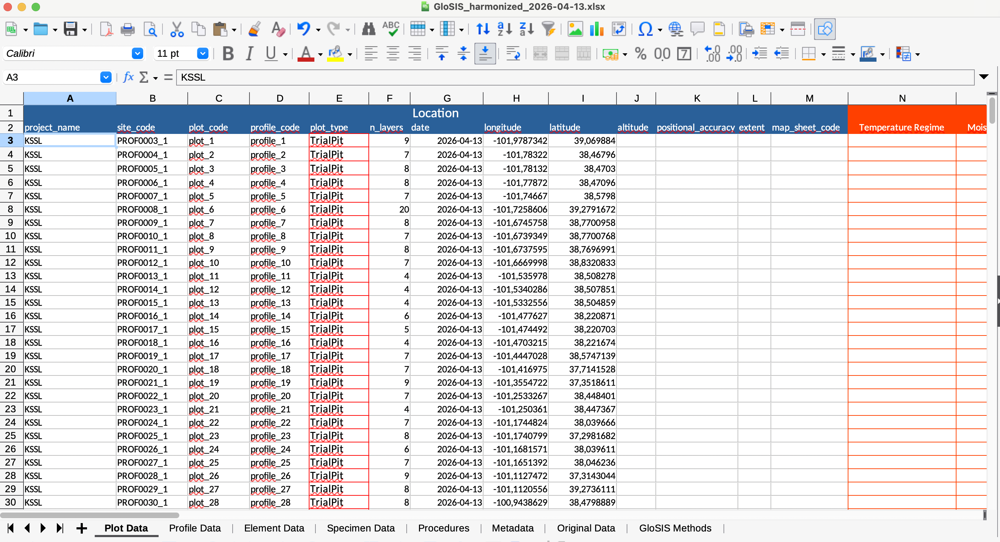
```

Finally, columns `N:BJ` describe the soil formation factors in the sampling plot following the FAO Guidelines for Soil Description 4th Ed. (2006) if available. These columns are optional and only can be updated manually directly on the `XLSX template`.

#### Profile Data Sheet

This sheet includes profile identification `profile_code` and profile descriptors (FAO and Soil USDA classification Systems and Soil Depth classes according to the 4th edition of the FAO Guidelines for Soil Description. The `profile_code` column act as the join parameter to link profiles to the information on the other sheets, thus it is important to ensure its consistency over the whole file tabs.

This sheet records the profile identifier (`profile_code`) and key profile descriptors, including soil profile classification (FAO and USDA Soil Taxonomy) and soil depth classes following the 4th edition of the FAO Guidelines for Soil Description. The `profile_code` field serves as the main join key linking profile records to related information in the other sheets, so it is essential to keep it consistent across all sheets in the file.

#### Element Data Sheet

An `Element` is a depth-based subdivision of a soil profile and can be described as either:

-   `Horizon`: a natural, relatively homogeneous layer formed by pedogenesis

-   `Layer`: an arbitrarily defined section, often based on fixed depth intervals for sampling and analysis

Figure \@ref(fig:element-fig) illustrates the differences between these two element types.


```{r element-fig, echo=FALSE, out.width="100%",fig.cap = "Horizon vs Layer en Element Features."}
knitr::include_graphics("images/module5/element.png")
```

For each sampled horizon or layer, the `Element Data` sheet records the identifiers used to link the profile and the element (`profile_code`, `element_code`), and where applicable, the horizon classification identifier (`horizon_code`) features. It also specifies the `element_type` (`Horizon` or `Layer`) and the depth limits of the element (`upper_depth`, `lower_depth`)

As in the `Profile Data` sheet, key morphological characteristics following the 4th edition of the FAO Guidelines for Soil Description can optionally be added manually in columns `H:CC` (Fig. \@ref(fig:element-tab)).

```{r element-tab, echo=FALSE, out.width="100%",fig.cap = "Element Data Sheet."}
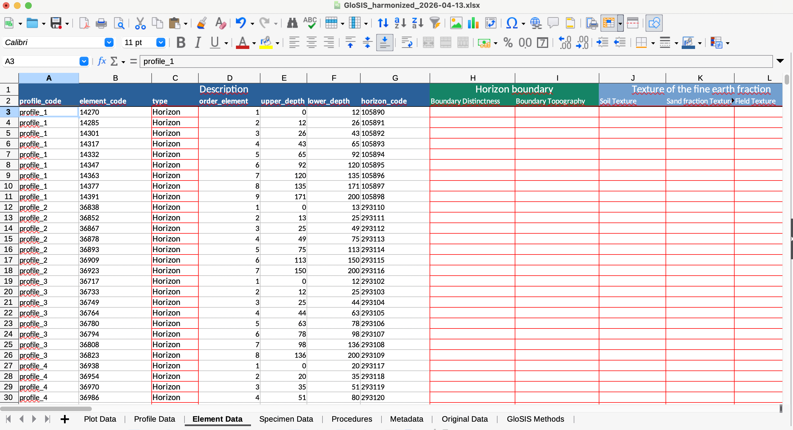
```


#### Specimen Data Sheet

The main purpose of the `Specimen Data` is to store the laboratory analytical results for each horizon or layer registered in `Element Data`. It includes the identifiers needed to link analytical results to the corresponding profile and element (`profile_code`, `element_code`) and the laboratory sample label (`specimen_code`) in columns `A:C` (Fig. \@ref(fig:specimen-tab)). 

The subsequent columns contain the analytical values for each measured soil property.

Because these values are loaded into the GloSIS database, all analytical results in this sheet **must be expressed in the GloSIS standard units of measurement**. If necessary, values should be converted to the required units prior to ingestion. These values are automatically transformed if the `glosis-etl-js Harmonization` module is used to create the template.

```{r specimen-tab, echo=FALSE, out.width="100%",fig.cap = "Specimen Data Sheet."}
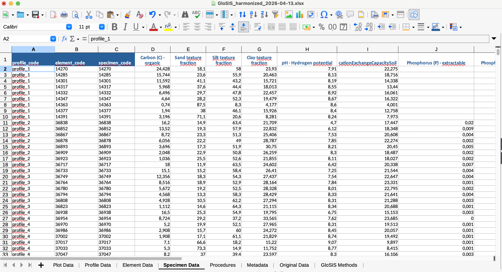
```

** Note that the values in this sheet are already converted to the corresponding GloSIS standard units of measurement. The original values remain as a backup in the sheet `Original Data`.

#### Procedures Sheet

The `Procedures` sheet defines the relationship between the measured soil properties, their standardized GloSIS property names, the laboratory methods, and the units of measurement. This linkage is essential to ensure consistency and interoperability across datasets and to support correct ingestion into the GloSIS database.

The sheet is linked to the reference list provided in the `GloSIS Methods` sheet, which contains the approved set of standardized soil property names, analytical procedures, and measurement units. Only properties, methods, and units included in `GloSIS Methods` can be uploaded to the GloSIS database. Any measured property, method, or unit that is not present in this list cannot be ingested and must either be removed or replaced with an accepted equivalent. Missing procedures can be reported to the GloSIS Working Group for possible inclusion, together with documentation describing the soil property, the analytical method, and the unit of measurement. The reference list is maintained and updated over time to incorporate new analytical properties, methods, and units.

In practical terms, this sheet links the analytical values in `Specimen Data` to their corresponding analytical metadata (Fig. \@ref(fig:procedures-tab)).  The first column (`soil_property`) lists the soil properties included in `Specimen Data`, in the same order in which they appear. Columns `B–D` provide drop-down menus to select the corresponding standard GloSIS property name, analytical procedure, and unit of measurement. This sheet is automatically populated by the `glosis-etl-js Harmonization` module

```{r procedures-tab, echo=FALSE, out.width="100%",fig.cap = "Procedures Sheet."}
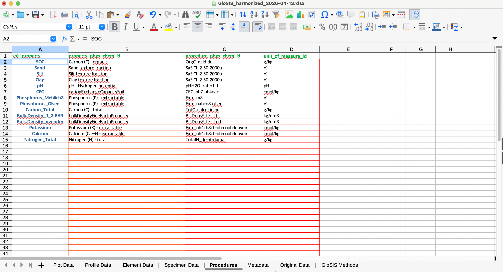
```


#### Metadata Sheet

It includes detailed metadata to identify the different data providers (Fig. \@ref(fig:metadata-tab)) .

```{r metadata-tab, echo=FALSE, out.width="100%",fig.cap = "Metadata Sheet."}
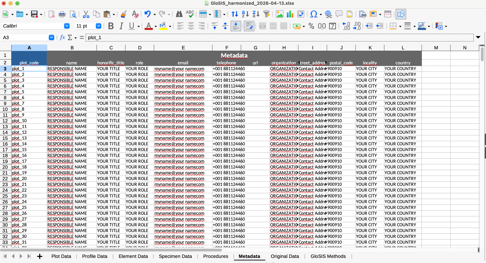
```


#### Original Data Sheet

The `Original Data` sheet  (Fig. \@ref(fig:original-tab)) stores the raw values from soil analyses and descriptions before any unit conversion. Although optional, it is recommended for maintaining a record of the original measurements, especially when unit conversions or other transformations are required. Keeping these values supports traceability and good documentation practices.

```{r original-tab, echo=FALSE, out.width="100%",fig.cap = "Original Data Sheet."}
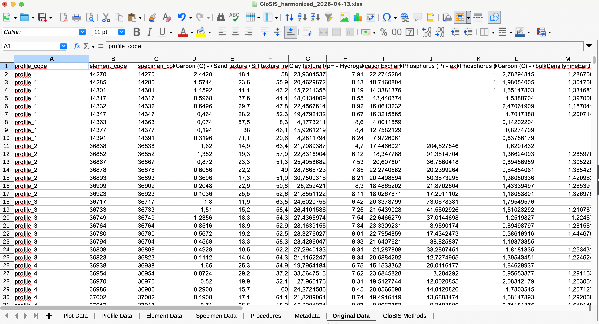
```

Values in the `Original Data` sheet can be linked (e.g., via formulas) to the `Element Data` sheet, allowing adjusted values to be transformed and transferred automatically while preserving the original records. This helps users track how each soil property was measured and in which units the results were reported. The original data are automatically preserved when using the `glosis-etl-js Harmonization` module.


#### GloSIS Methods sheet

The `GloSIS Methods` sheet is the reference table that includes the soil properties, analytical procedures, and units of measurement accepted in the GloSIS database. This list follows the codelist in the [GLOSIS ontology network](https://github.com/glosis-ld/glosis/blob/master/csv_codelists/glosis_procedure.csv) and a summary of the main properties and units of measurement are shown in Table \@ref(tab:soil-props). The information in this sheet defines the options used by the `Procedures` sheet (via drop-down lists) and by the `glosis-etl-js Harmonization` module to validate inputs and apply unit conversions consistently.

The main columns are:

-   `property_phys_chem_id`: The standardized GloSIS name for the soil property (e.g., Acidity -- exchangeable).

-   \`procedure_phys_chem_idv: The standardized identifier for the analytical method used to measure that property (e.g., ExchAcid_ph0-kcl1m).

-   `unit_of_measure_id`: The required unit for storing the value in GloSIS (e.g., cmol/kg).

-   `value_min / value_max`: The admissible bounds for quality control. Values outside this range can be flagged during harmonization/validation.

-   `definition`: A short description of what is being measured and how (e.g., exchangeable acidity (H+Al) extracted with 1 M KCl).

-   `common_input_units`: A list of commonly encountered units in legacy datasets that can be converted into the GloSIS standard units.

-   `conversion_factors`: The factors applied to each unit listed in `common_input_units`, in the same order, to convert to the GloSIS unit.

-   `notes`: Additional clarifications (e.g., equivalences between units).


```{r table-soil-properties, echo=FALSE}
soil_prop_table <- data.frame(
  Category = c(
    rep("Soil organic components", 5),
    rep("Nitrogen and major nutrients", 4),
    rep("Exchangeable cations and acidity", 9),
    rep("Soil texture and coarse fraction", 4),
    rep("Trace elements", 8),
    rep("Soil physical properties", 5),
    rep("Soil chemical properties", 6),
    rep("Other soil constituents", 1)
  ),
  Property = c(
    "Organic carbon",
    "Total carbon",
    "Inorganic carbon",
    "Organic matter",
    "Total carbonate equivalent",
    
    "Total nitrogen",
    "Phosphorus",
    "Potassium",
    "Phosphorus retention",
    
    "Calcium",
    "Magnesium",
    "Sodium",
    "Potassium",
    "Aluminium",
    "Hydrogen",
    "Exchangeable acidity",
    "Base saturation",
    "Aluminium saturation",
    
    "Sand",
    "Silt",
    "Clay",
    "Coarse fragments",
    
    "Iron",
    "Manganese",
    "Copper",
    "Zinc",
    "Boron",
    "Sulfur",
    "Molybdenum",
    "Cadmium",
    
    "Bulk density (fine earth)",
    "Bulk density (whole soil)",
    "Porosity",
    "Volumetric water content",
    "Hydraulic conductivity",
    
    "pH",
    "Electrical conductivity",
    "Soluble salts",
    "Cation exchange capacity",
    "Effective cation exchange capacity",
    "Ca/N ratio",
    
    "Gypsum"
  ),
  Unit = c(
    "g/kg", "g/kg", "g/kg", "g/kg", "g/kg",
    "g/kg", "%", "cmol/kg", "g/hg",
    "cmol/kg", "cmol/kg", "cmol/kg", "cmol/kg", "cmol/kg", "cmol/kg", "cmol/kg", "%", "%",
    "%", "%", "%", "%",
    "%", "cmol/kg", "%", "%", "%", "%", "%", "%",
    "kg/dm³", "kg/dm³", "m³/100 m³", "m³/100 m³", "cm/h",
    "pH", "dS/m", "cmol/L", "cmol/kg", "cmol/kg", "ratio",
    "%"
  )
)

knitr::kable(
  soil_prop_table,
  caption = "Summary of soil properties and units of measurement in the GloSIS Onthology."
)

```


###The GloSIS ETL Platform

Because the GloSIS database enforces a structured model, data cannot be loaded reliably as free-form from heterogeneous legacy information. The GloSIS ETL platform provides a practical workflow to harmonize, standardize, and load soil legacy data into the GloSIS PostgreSQL/PostGIS schema in a consistent and reproducible way. This platform has been developed in JavaScript and it is referenced as `glosis-etl-js` in this tutorial.

`glosis-etl-js` transforms raw datasets into database-ready tables by automating the harmonization and standardization tasks required in GloSIS. This streamlines ingestion into the relational database, improves accessibility for non-technical users, and ensures that soil datasets from different sources can be integrated and compared effectively.

The `glosis-etl-js` services are provided as **Docker containers**, allowing users to deploy and manage the system without manually installing software dependencies. This approach ensures stability, compatibility, and ease of updates. The installation and setup of the ETL are described in the next section.

The platform includes three modules  (Figure \@ref(fig:glosis-etl)):

-   *Harmonization*: Checks and harmonizes raw input data (e.g., coordinates, depth intervals, missing or inconsistent fields, out-of-range lab values) and defines units and methods according to GloSIS conventions to produce a clean, consistent dataset for loading.
-   *Standardization*: Transforms the harmonized data into ISO 28258–compliant and GloSIS-standardized data, applying controlled vocabularies and standardized identifiers so that the dataset is fully compliant with the target schema.
-   *Viewer*: Allows users to explore and validate the standardized data before and/or after loading to confirm that records, attributes, and values were ingested correctly into the database.

```{r glosis-etl, echo=FALSE, out.width="100%",fig.cap = "Modules in the glosis-etl-js."}
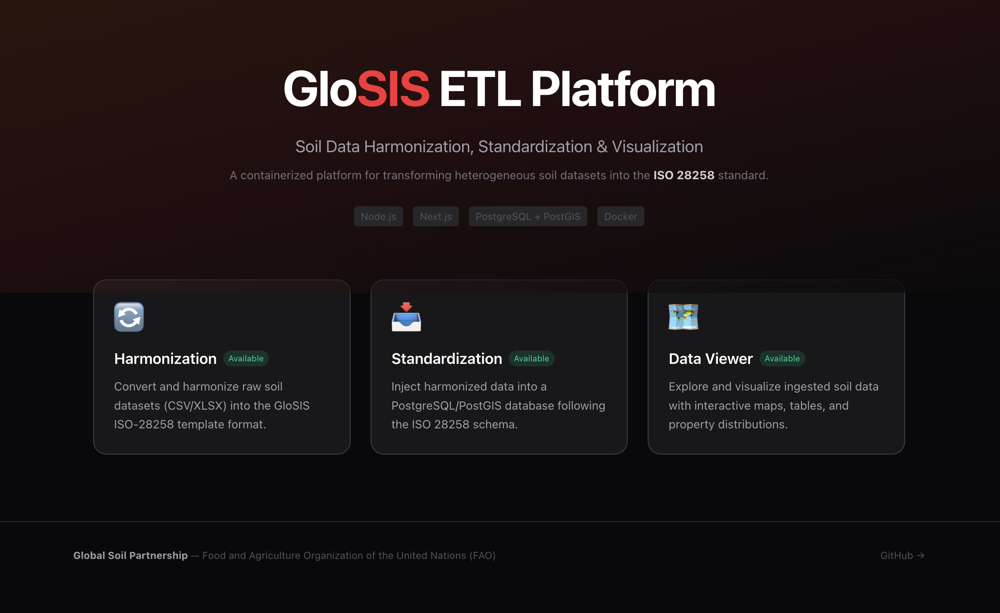
```

#### Installation and Setup of the glosis-etl-js

The `glosis-etl-js` application is distributed as a set of Docker containers orchestrated by **Docker Compose**. This means users do not need to manually install PostgreSQL, R, or any other dependency, all software requirements are pre-configured inside the containers and managed automatically through the `docker-compose.yml`.

The project consists of two main services, each running as an independent container:

1.  **`glosis-db-js`** -- A **PostGIS-enabled PostgreSQL database** (based on `postgis/postgis:17-3.5`) that stores soil data following the **GloSIS / ISO 28258** standard. It is automatically initialized with the GloSIS schema via SQL scripts bundled in the repository.

2.  **`glosis-etl-js`** -- A **JavaScript** application that serves a **landing page** and three web modules:

    -   **Harmonization** (`/harmonization`) -- Converts local soil data into GloSIS-compatible format using Excel templates.
    -   **Standardization** (`/standardization`) -- Injects harmonized Excel data into the PostgreSQL database.
    -   **Data Viewer** (`/dataviewer`) -- An interactive dashboard to explore, visualize, and subset the data stored in the database.

An optional third service, **`glosis-pgadmin`**, provides a pgAdmin 4 web interface for direct database administration (see **Optional Services** below).

::: {.warning-box}
Before proceeding, ensure that *Docker Desktop* is installed and running on your computer (see *Installation of Docker Desktop and Docker Compose* in the *Software Installation* section at the beginning of this document).
:::

The easiest way to install the `glosis-etl-js` services is by downloading the repository and using Docker Compose to build and run the containers.

**Steps:**

1.  **Ensure Docker Desktop is running.**

2.  **Download the glosis-etl-js repository from GitHub:**

    Go to:

    ```         
    https://github.com/FAO-SID/glosis-etl-js
    ```

    Click the green **"Code"** button, then select **Download ZIP** (Figure \@ref(fig:clone)).

    ```{r clone, echo=FALSE, out.width="100%", fig.cap="Cloning the repository."}
    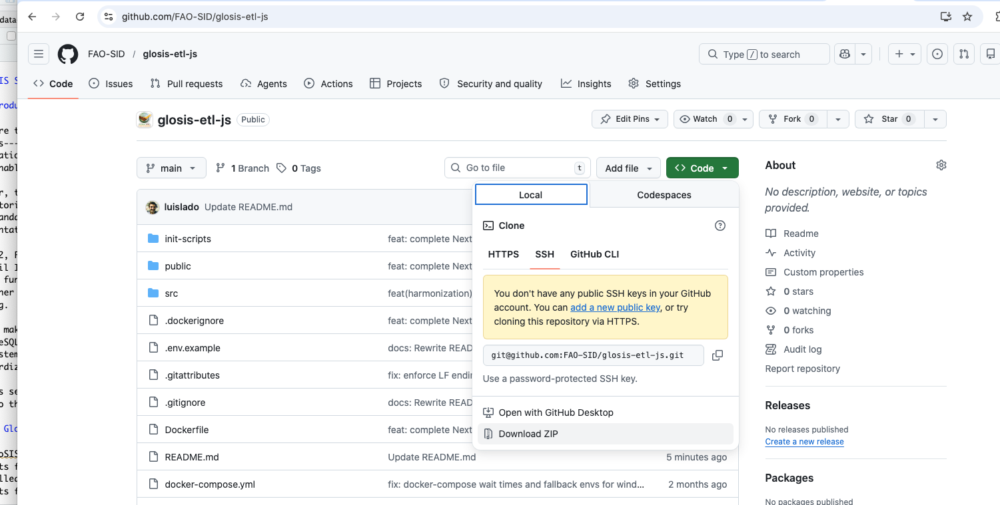
    ```

    Alternatively, if you have Git installed, you can clone the repository:

    ``` bash
    git clone https://github.com/FAO-SID/glosis-etl-js.git
    ```

3.  **Extract the ZIP file** (if downloaded) to a folder on your computer (e.g., the `Desktop` folder).

4.  **Configure the environment variables (Oonly or production deployments).**
    Environment variables (database credentials, logging level, etc.) are read from the `.env` file in the project root. The `.env` file stores configuration values that are shared between the services. The default variables are:

``` bash
# PostgreSQL Database Configuration
POSTGRES_DB=glosis
POSTGRES_USER=glosis
POSTGRES_PASSWORD=glosis    # Change in production!

```

The default values use `glosis` as the database name, user, and password. For production deployments, edit the `.env` file and change the `POSTGRES_PASSWORD` value.

:::warning-box
**CAUTION:**
- ⚠️ Important: For local development or testing, as in this training, do not modify the `.env` file.
- Only update these values when deploying to a production environment, especially the database password.
- For production deployments, always change the default password (`glosis`) to a secure value.
:::


5.  **Open a Terminal or Command Prompt** and navigate to the extracted folder:

    ``` bash
    cd Desktop/glosis-etl-js
    ```

6.  **Start the GloSIS services** by running:

    ``` bash
    docker compose up -d --build
    ```

    > **Note:** The `--build` flag is required the first time to build the `glosis-etl-js` image from the Dockerfile. Subsequent runs can omit it unless the application code has changed. The first build may take **2--5 minutes**.

    > **Note:** On older systems you may need to use `docker-compose` (with a hyphen) instead of `docker compose`.

#### Verify Installation

##### Using Docker Desktop {-} 

Open Docker Desktop and check if the containers are running (Figure \@ref(fig:docker-desktop)).

```{r docker-desktop, echo=FALSE, out.width="100%", fig.cap="Docker Desktop showing running containers."}

```

If everything is working, the project and service icons should be **green**. If any service fails, the icon will appear \*\*orange\*.

##### Using the Terminal {-}

To manually check if the services are running, type:

``` bash
docker ps
```

You should see an output similar to:

```         
CONTAINER ID   IMAGE                          COMMAND                  CREATED        STATUS                  PORTS                    NAMES
415f97d8a445   glosis-etl-js-glosis-etl-js    "docker-entrypoint.s…"   25 hours ago   Up 25 hours (healthy)   0.0.0.0:3000->3000/tcp   glosis-etl-js
cb414728ebfd   postgis/postgis:17-3.5         "docker-entrypoint.s…"   7 days ago     Up 7 days (healthy)     0.0.0.0:5442->5432/tcp   glosis-db-js
```

Both containers should show a status of **(healthy)**.

##### Stopping the Services {-}

To stop the services at any time, use:

``` bash
docker compose down
```

This will stop and remove the containers, but your **database data will remain intact** in the Docker named volume `glosis-db-data`.

> **Tip:** To completely reset the database (remove all data), run: `docker compose down -v`. This deletes the named volumes and the database will be re-initialized from the SQL scripts on the next start.

#### Optional: pgAdmin Web Interface {#pgadmin}

The `docker-compose.yml` file includes an optional **pgAdmin 4** service for direct database management. To activate it, go to the installation folder and type:

``` bash
docker compose --profile admin up -d
```

Once running, access pgAdmin at:

```         
http://localhost:5050
```

Login credentials:

-   **Email:** `admin@glosis.org`
-   **Password:** `admin`

To connect to the GloSIS database from pgAdmin, create a new server with:

-   **Host:** `postgis`
-   **Port:** `5432`
-   **Database:** `postgres`
-   **User / Password:** `glosis` / `glosis`


All created GloSIS PostgreSQL databases are available for connection to external applications such as **pgAdmin**, **DBeaver**, **QGIS**, and **R**, using the parameters listed in Table \@ref(tab:db-connection).

```{r db-connection, echo=FALSE}
db_params <- data.frame(
  Parameter = c("Host", "Port", "Database", "User", "Password"),
  Value = c("localhost", "5442", "yourdatabase", "glosis", "glosis")
)
knitr::kable(db_params, caption = "Database connection parameters.")
```

> **Note:** The port is 5442 (not the standard 5432) to avoid conflicts with any locally installed PostgreSQL server. Adjust the database name to match your actual database.


###Running the GloSIS ETL

To open the GloSIS ETL Platform, enter this address in your web browser:

```         
http://localhost:3000/
```

This will load the **landing page** with links to the three application modules (Figure \@ref(fig:etl-harmonization)).

```{r etl-harmonization, echo=FALSE, out.width="100%",fig.cap = "glosis-etl-js Harmonization module in first place."}

```

Each module is accessible directly via its URL:

| Module              | URL                                     | Description                                |
|:-----------------|:-------------------------|:---------------------------|
| **Harmonization**   | `http://localhost:3000/harmonization`   | Convert local soil data into GloSIS format |
| **Standardization** | `http://localhost:3000/standardization` | Inject harmonized data into the database   |
| **Data Viewer**     | `http://localhost:3000/dataviewer`      | Explore and visualize stored soil data     |


#### Data Harmonization

The [Data Harmonization](http://localhost:3000/harmonization) module (Figure \@ref(fig:etl-harmonization)) provides the foundation for preparation of a clean and documented dataset to be ingested in the GloSIS database.


The preparation of the data follows a 3-step quality assurance procedure (Figure \@ref(fig:etl-harmonization-steps)) comprehensive data validation at each stage.

```{r etl-harmonization-steps, echo=FALSE, out.width="100%",fig.cap = "glosis-etl-js Harmonization module."}
knitr::include_graphics("images/module5/etl_harmonization_steps.png")
```

The module performs systematic data quality checks across three domains to produce a `XLSX` file following the GloSIS standards. This file, once correctly verified, will be used as input in the `GloSIS Data` standardization module to ingest soil data into the GloSIS database.


##### Data Upload Interface: Upload {-}

The first step of the harmonization process involves uploading soil datasets and configuring variable mappings to align with GloSIS standard data structure and naming conventions.

The module accepts the following data formats (Figure \@ref(fig:etl-harmonization-step1)):

-   CSV files (.csv) - For comma-separated tabular data
-   Text files (.txt)

```{r etl-harmonization-step1, echo=FALSE, out.width="100%",fig.cap = "Step 1: Data upload section."}
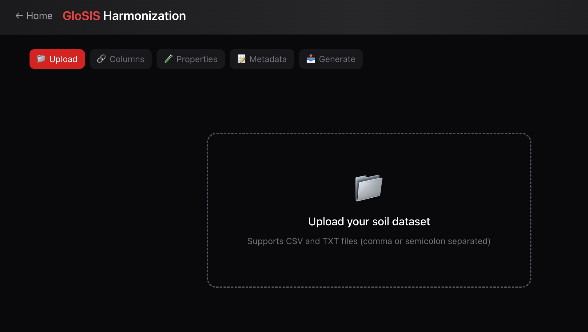
```

The example in this tutorial uses the file `KSSL_cleaned.csv`, produced as output during Session 3 of Module 1 – Soil Data Preparation, as input.

##### Variable Mapping: Columns{-}

Once data is uploaded, users must systematically map their dataset columns to GloSIS standard variable names through an interactive menu. This section facilitates the mapping of Site and Plot features of interest and the identification of the analytical properties in the dataset. It provides dropdown selections for each variable and fuzzy matching to assist in finding correct mappings.

On top, the module displays a table with the first rows of the uploaded data (Figure \@ref(fig:etl-harmonization-step2a)). This serves to identify the column that must be mapped to standard GloSIS nomenclature. 

```{r etl-harmonization-step2a, echo=FALSE, out.width="100%",fig.cap = "Step 2a: Parameter Mapping."}
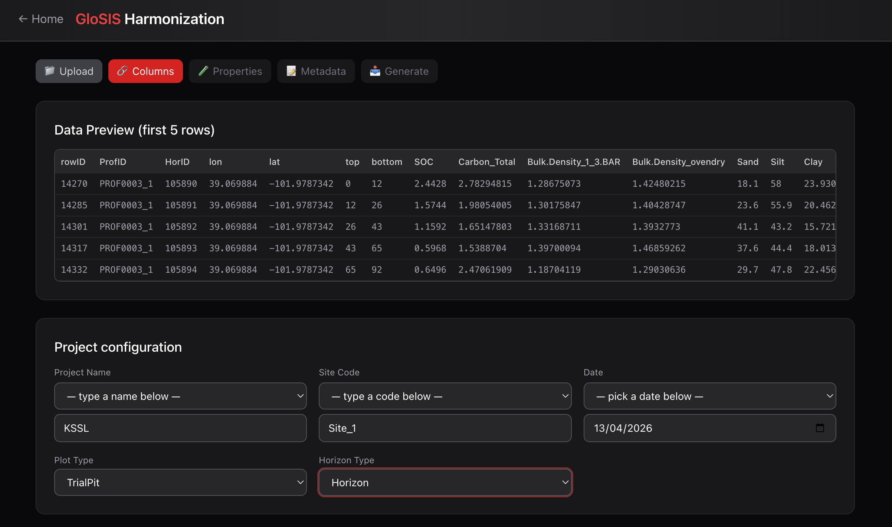
```

The mapping process captures 3 essential categories:

**1) Project Configuration Settings** *Site Identification Parameters (Optional - Default values provided if not mapped):* - Project Name - Site Code - Date of observation - Plot Type - Horizon Type.

**2) Column Mapping ** *Required Plot and Element Parameters (Must be mapped explicitly):* - Sample ID (element_code or specimen_code) - Longitude (X coordinate, WGS84) - Latitude (Y coordinate, WGS84) - Upper Depth (cm) - Top boundary of soil layer - Lower Depth (cm) - Bottom boundary of soil layer.

**3) Soil Properties ** *Identification of the columns with analytical soil properties measured (Multi-selection):* - Each property must be selected to be then mapped to GloSIS standard nomenclature in the next section

Column Mapping and Analytical Properties Identification in this section (Figure \@ref(fig:etl-harmonization-step2b)).

```{r etl-harmonization-step2b, echo=FALSE, out.width="100%",fig.cap = "Step 2b: - Plot, Element and Analytical Mapping."}
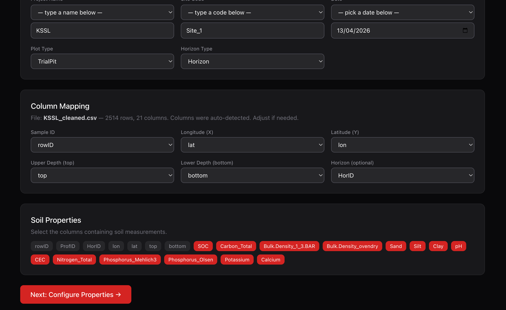
```


##### Variable Mapping: Properties {-}

Each of the selected analytical properties identified in the previous step are here presented to identify the correlative GloSIS standard nomenclature, the analytical methods used and the reporting units in the original database (Figure \@ref(fig:etl-harmonization-step2c)). If the reported soil units differ from GloSIS standard units, the module automatically applies conversion factors to satisfy GloSIS requirements.


```{r etl-harmonization-step2c, echo=FALSE, out.width="100%",fig.cap = "Step 2c: Mapping analytical procedures and units of measurement."}
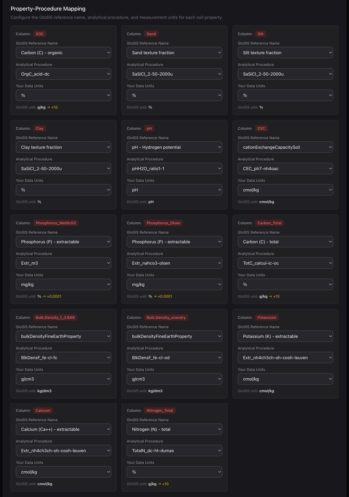
```

 
##### Data Quality Check and Quality Report Generation {-}

The module analyses the data values, its integrity and coherence and identifies potential issues with the data. 

The data validation in this step occurs at three stages, geographic (horizontal location), soil depth (vertical position) and Analytical integrity (missing values, non valid data, data outliers):

###### Geographic Data Validation {-}

This validation phase ensures that every soil sample is correctly georeferenced with accurate spatial coordinates, maintaining the spatial integrity essential for the GloSIS database.

The GloSIS database uses **EPSG:4326** (WGS84) as its standard coordinate reference system. All geographic coordinates must be identified using this global standard projection.

The module systematically checks for the following geographic data issues:

**Coordinate Completeness:** - Identifies missing X (longitude) and/or Y (latitude) coordinates

**Coordinate Range Validation:** - Longitude: −180° to +180°, Latitude: −90° to +90° (global bounds) - Flags coordinates outside standard global ranges as invalid

**Duplicate Site Detection:** - Identifies potential duplicate sites (multiple profiles at identical coordinates)

###### Soil Depth Validation {-}

All soil profiles must include both upper and lower depth measurements for each sampled layer. This step ensures that the vertical intervals for each soil sample are physically and logically possible, maintaining the integrity of soil profile structure.

The module checks for **Depth Completeness** and **Depth Logical Consistency**:

-   Identifies records with missing top and/or bottom depth measurements
-   Detects depth inversions where top depth ≥ bottom depth (physically impossible)
-   Identifies soil profiles not starting at surface (top depth \> 0 cm when expected)

###### Soil Properties Validation {-}

This final validation step involves screening analytical soil property values against scientifically established analytical thresholds to identify unrealistic or impossible values. Out-of-bounds values are commonly known as outliers.

For each analytical property, the system validates that reported values fall within scientifically plausible ranges using a GloSIS lookup table with global soil data as a reference. The values for each soil property are compared with specific soil lower and upper thresholds and identified as potential out-of-bound values those out of the range of these thresholds 

All errors and warnings identified during the validation phases above are automatically compiled and reported in the main interface. Quality check results are displayed in the bottom of the  `Properties` Tab which displays detailed validation results organized by issue type. Users can download a comprehensive `Download QC Report (XLSX format)` for further analysis and data cleaning outside the module (Figure \@ref(fig:etl-harmonization-QC1)).

```{r etl-harmonization-QC1, echo=FALSE, out.width="100%",fig.cap = "Step 3a: Reporting potential errors in the dataset."}
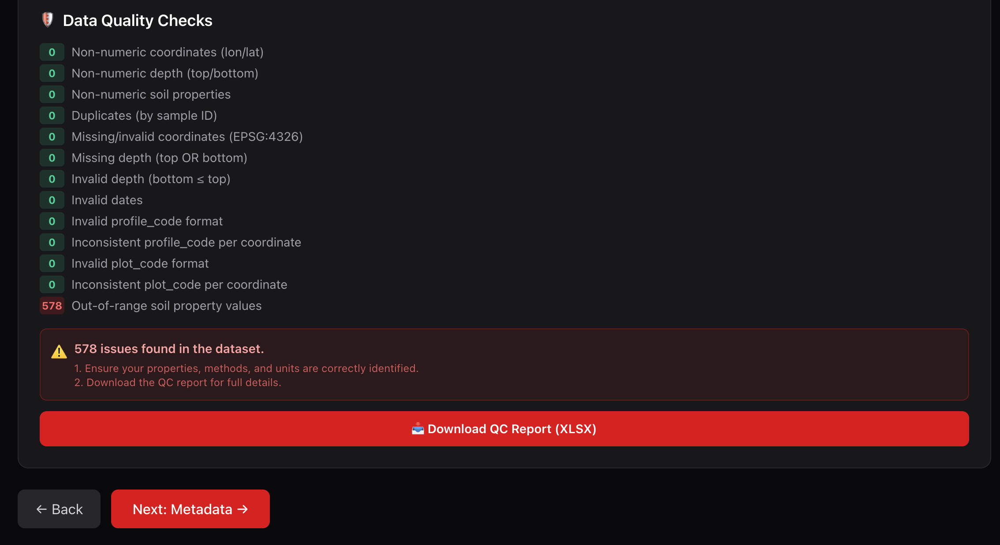
```

If no issues were detected, the QC section will display the message "Data Ready to Harmonize" (Figure \@ref(fig:etl-harmonization-QC2)), and users can proceed to include the Metadata information.

```{r etl-harmonization-QC2, echo=FALSE, out.width="100%",fig.cap = "Step 3a: No errors identified in the dataset."}
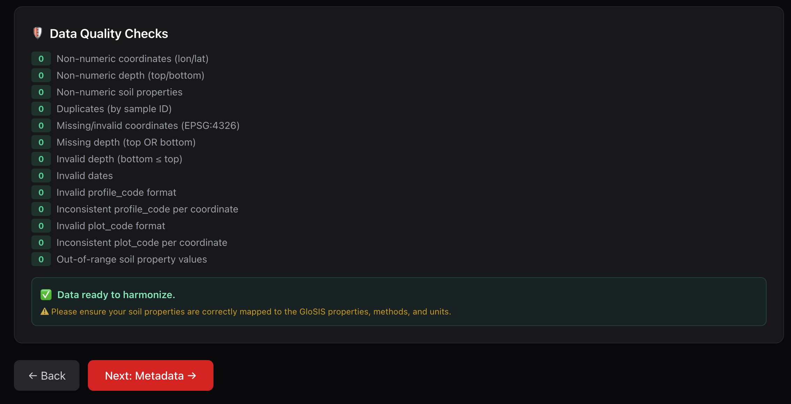
```


###### Data Correction and Resubmission {-}

If data quality issues identified in the Quality Check Report are to to incorrect mapping of soil properties method and units, corrections can be made in the same section once identified. If is related to the dataset itself, users must correct the original dataset and resubmit again for harmonization.

::: highlights
-   The `Procedures Reference` tab in the `public/glosis_template_v6.xlsx` and `public/glosis_procedures_v2.csv` files contain detailed information on the analytical procedures in GloSIS, including glosis units, method descriptions and unit conversion parameters.
:::

##### Metadata {-}

The metadata section provides a mechanism to include contact and organizational metadata (Figure \@ref(fig:etl-harmonization-metadata)). These values can be adjusted in the generated XLSX GloSIS template to reflect specific metadata associated with individual soil observations.

```{r etl-harmonization-metadata, echo=FALSE, out.width="100%",fig.cap = "Metadata Tab."}
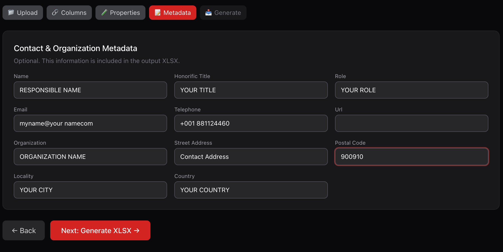
```


##### Generate and Download the Harmonized Data {-}

Once all critical data quality issues have been resolved and the dataset passes validation, users can download the harmonized data in a GloSIS-standard format. Press the `Generate & Download` green button (Figure \@ref(fig:etl-harmonization-download)), and a file with the GloSIS harmonized data will be available in your computer.

```{r etl-harmonization-download, echo=FALSE, out.width="100%",fig.cap = "Metadata Tab."}

```

The downloaded file follows the GloSIS standard format, with data organized according to the hierarchical features of interest defined in ISO 28258.

**Plot Data Sheet:** - Project identifier - Site identifier - Plot identifier - Profile identifier - Plot type identifier (Borehole, TrialPit, Surface) - Number of layers / plot - Date of observation - Longitude (WGS84) - Latitude (WGS84)

**Profile Data Sheet:** - Profile identifier

**Element Data Sheet:** - Profile identifier - Element identifier - Element type (Horizon, Layer) - Order element (Element position in the profile) - Upper depth - Lower depth - Horizon identifier

**Specimen Sheet:** - Profile identifier - Element identifier - Specimen identifier - Analytical properties (GloSIS Standard Units)

**Procedures Sheet:** - Analytical properties - Analytical properties (GloSIS standard) - Analytical procedures - Unit of measure (GloSIS standard)

**Metadata Sheet:** - Plot identifier - Provider Metadata

**Original Data Sheet:** - Profile identifier - Analytical properties (Original Units)

**GloSIS Methods Sheet:** - GloSIS Procedures Registry List (Informative)

::: warning-box
-   All Analytical Procedures must exist in the available GloSIS `Procedures` Registry list. This ensures methodology traceability and standardization.

-   Each dataset is unique and may have specific data-quality issues requiring investigation and resolution.

-   The `Procedures` list is flexible and can incorporate new, well-documented analytical procedures upon request to the GloSIS Working Group team.

-   Properties not in the standard `Procedures` list must be removed from the analyses before data injection into the database to ensure compatibility within GloSIS.

-   Users must resolve all Critical Issues before proceeding to data download. Warning Issues should be carefully reviewed; users can override if values are scientifically justified.
:::

#### Data Standardization

The data injection of soil data into the Glosis database is performed thought a standardized Excel (`.xlsx`) template that serves as an intermediary format for structuring soil data before its integration into PostgreSQL. This template ensures that the data follows a predefined schema, aligning with the complex relational structure of the GloSIS database. The template consists of multiple sheets, each corresponding to a specific data entity, such as site information, soil horizons/layers, laboratory procedures, and analytical results structured in different sheets. Each column in these sheets is carefully labeled to match the expected database fields, reducing errors and ensuring data consistency. The structured nature of the template minimizes manual intervention and ensures that data is correctly mapped when it is processed by the `glosis-etl-js` module. It validates the input, identifies potential discrepancies, and harmonizes the dataset before transferring it into PostgreSQL, ultimately simplifying the data submission process while maintaining accuracy and comparability.

Ensuring the correct creation of the template is essential for the successful execution of the data injection process. Proper adherence to the template structure guarantees data integrity, compatibility, and seamless integration into the PostgreSQL GloSIS Database.

##### Create a database to store your results {-}

Run the [Data Standardization](http://localhost:3000/standardization) module and move to the `Create New Database` box. Type the name in the box and press the button `+ Create` (Figure \@ref(fig:etl-standardization)).

```{r etl-standardization, echo=FALSE, out.width="100%",fig.cap = "Metadata Tab."}
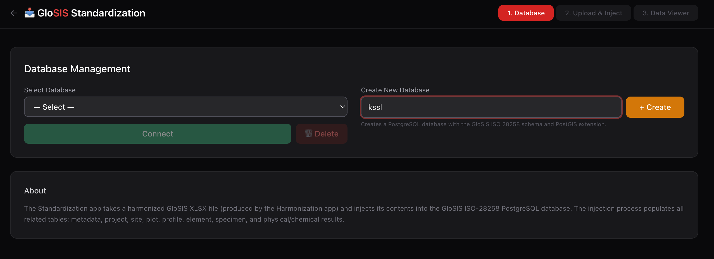
```

The module will create that specific database with tables following the database schema in the GloSIS database. Once created, select it in `Select Database` dropdown menu and press the button `Connect`. Now you are connected to your GloSIS standardized database.

:::warning-box
- The module includes a `Delete` button that permanently removes the selected database. Use this option with caution, and only if you are certain the database is no longer needed.
- If this is your first time running the Docker containers, a GloSIS PostgreSQL database may be created with an empty schema (0 tables).
  In this case:
  a) Go to the **Database** section  
  b) Remove the existing empty `glosis` database using the interface options (`Select` & `Delete`)  
  c) If you want to create a new database named `glosis`, click the `+ Create` button to build it from scratch  
:::

##### Inject the data into the created PostgreSQL database {-}

Once connected, click the red `Upload Data` button, to open the tab for uploading the `XLSX template` previously created using the [Data harmonization](http://localhost:3000/harmonization) module (Figure \@ref(fig:etl-harmonization-metadata)). 

Then, click the red `Inject Data` button. The module will transform the data from the Excel file into the structure of the GloSIS PostgreSQL database.

You can explore the uploaded data in the `Data Viewer` tab within this module.


```{r etl-injection, echo=FALSE, out.width="100%",fig.cap = "Standardization Upload and Injection tab."}
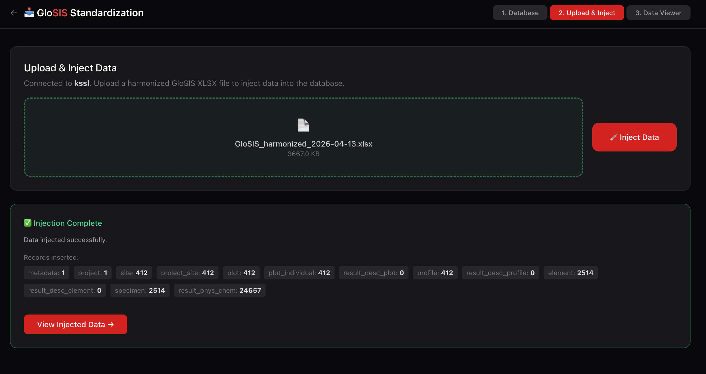
```


#### Data Viewer

The [Data Viewer](http://localhost:3000/dataviewer) module provides interactive visualization of soil databases stored in the system, enabling users to validate data integrity before and after database ingestion.

Open [Data Viewer](http://localhost:3000/dataviewer) from the [ETL main menu](http://localhost:3000). Select an existing database from the list in the top right corner and click `Connect`. The Data Viewer will load the soil data, display the distribution of sampling sites on an interactive map, and preview harmonized records with filterable analytical columns. Soil property names include the analytical method and units of measurement. This barplot allows users to explore the variation of soil properties with depth across soil profiles (Figure \@ref(fig:etl-viewer1)).

```{r etl-viewer1, echo=FALSE, out.width="100%",fig.cap = "Visualization of the KSSL data in this Manual"}
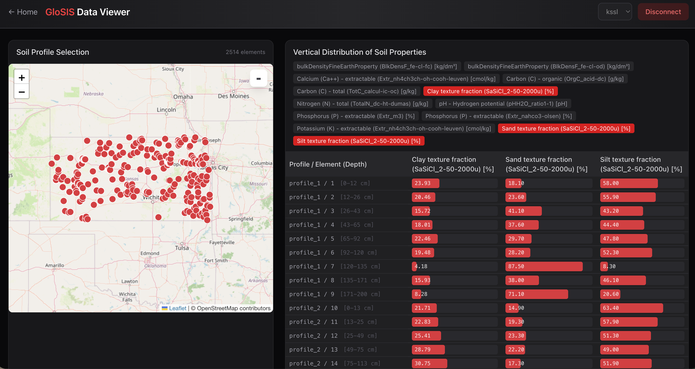
```

Using the `-` button in the top right of the map, users can select a subset of soil locations, restricting the visualization to the chosen soil profiles (Figure \@ref(fig:etl-viewer2)).


```{r etl-viewer2, echo=FALSE, out.width="100%",fig.cap = "Visualization of a subset of the KSSL data in this Manual"}
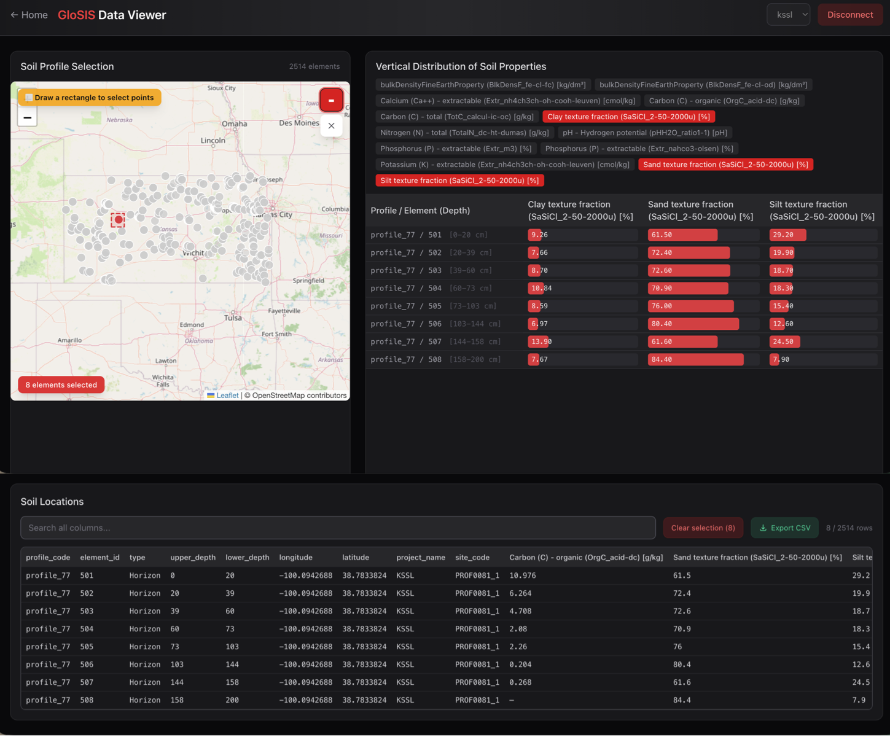
```

Finally, the `Export CSV` button allows users to export sampling point information, or a subset of it, to a .csv file for further analysis or visualization in other applications.


###Connecting PostgreSQL to QGIS

The created PostgreSQL database can be easily connected to QGIS by following these steps:

1. Open QGIS.
2. Add a New PostgreSQL connection by going to **Layer -> Add Layer -> Add PostGIS Layers**.
3. Set the Connection information in the New PostGIS Connection (Figure \@ref(fig:qgis-connection)):

```{r qgis-connection, echo=FALSE, out.width="50%", fig.align="center", fig.cap="Connection information in the New PostGIS Connection"}
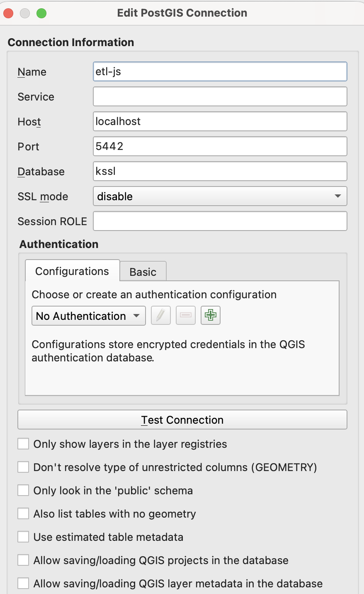
```

4. Open the database connection in the **Database Manager** by going to **Database -> Database Manager -> Providers -> PostGIS -> etl-js** and double-click to connect (Figure \@ref(fig:qgis-dbmanager)).

```{r qgis-dbmanager, echo=FALSE, out.width="100%",fig.cap = "Open Connection in DB Manager"}
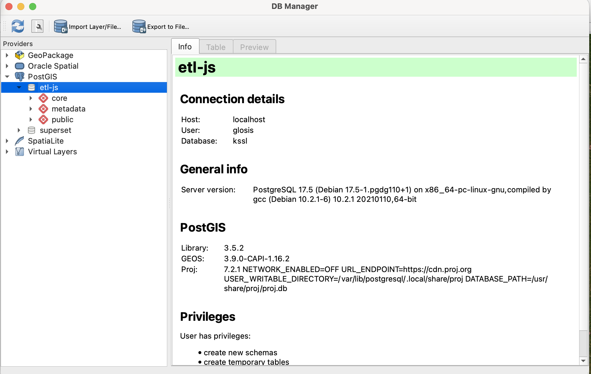
```

5. Go to **Database -> SQL Window**.

In this window, type the query below and Execute the code:

```sql
SELECT 
  r.result_phys_chem_id AS gid,
  p.name,
  s.site_id,
  p3.profile_id, 
  e.element_id,
  e.upper_depth,
  e.lower_depth,
  r.specimen_id,
  o.property_phys_chem_id,
  o.procedure_phys_chem_id,
  r.value,
  o.unit_of_measure_id,
  p2."position" AS geom
FROM core.project p
LEFT JOIN core.site_project sp ON sp.project_id = p.project_id
LEFT JOIN core.site s ON s.site_id = sp.site_id
LEFT JOIN core.plot p2 ON p2.site_id = s.site_id
LEFT JOIN core.profile p3 ON p3.plot_id = p2.plot_id
LEFT JOIN core."element" e ON e.profile_id = p3.profile_id
LEFT JOIN core.specimen s2 ON s2.element_id = e.element_id
LEFT JOIN core.result_phys_chem r ON r.specimen_id = s2.specimen_id
LEFT JOIN core.observation_phys_chem o ON o.observation_phys_chem_id = r.observation_phys_chem_id
ORDER BY p.name, s.site_id, p3.profile_id, e.upper_depth, o.property_phys_chem_id;
```

Check on the mark on `Load as a New Layer` and click on the `Load` button (Figure \@ref(fig:qgis-dbquery)).

```{r qgis-dbquery, echo=FALSE, out.width="100%",fig.cap = "Open Connection in DB Manager"}
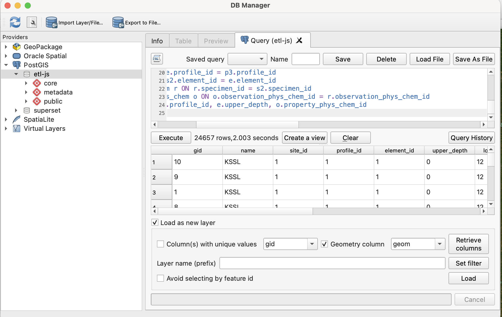
```

A layer named `QueryLayer` will appear in the Layers Panel in QGIS (Figure \@ref(fig:qgis-querylayer)).

```{r qgis-querylayer, echo=FALSE, out.width="100%",fig.cap = "Sampling Points in QueryLayer"}
knitr::include_graphics("images/module5/qgis_out.png")
```

This layer contains point data from the cleaned `kssl` database in *long* format, where each row represents a single observation of a soil property measured at a specific site, profile, depth interval, and specimen. The columns describe the context of each observation (e.g., site, profile, element, and depth), along with the measured property, the analytical method used, the observed value, and its unit of measurement.

```{r qgis-long, echo=FALSE, out.width="100%",fig.cap = "QueryLayer Table in long format"}
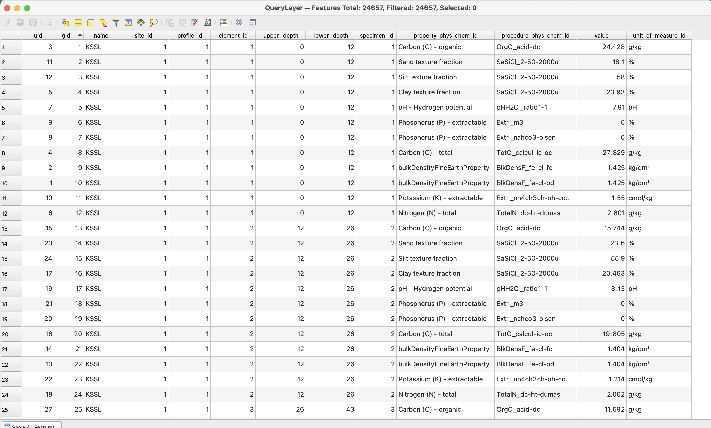
```

###Connecting PostgreSQL to R

The PostgreSQL GloSIS database can be connected to R using appropriate packages and SQL queries.

In this section, the `kssl` database is accessed from R, and the results are exported as a GeoPackage. This format is used because it preserves full column names, allowing soil analytical properties and their units of measurement to remain clearly described in the output.

The resulting file is saved in `03_outputs/module3/` and can be directly loaded into GIS software such as QGIS for further visualization and analysis.

```{r postgres-2-R, eval=FALSE}
# =========================================================
# Load packages
# =========================================================
library(DBI)
library(RPostgres)
library(dplyr)
library(tidyr)
library(sf)

# =========================================================
# Connect to the PostgreSQL database
# =========================================================
# This connection uses the database exposed on localhost:5442,
# which is the port mapped from the Docker PostgreSQL container.
con <- dbConnect(
  RPostgres::Postgres(),
  dbname   = "kssl",
  host     = "localhost",
  port     = 5442,
  user     = "glosis",
  password = "glosis"
)

# =========================================================
# SQL Query 1: retrieve soil point / profile / horizon metadata
# =========================================================
# This query extracts the structural information for each soil specimen:
# - project and site identifiers
# - plot and profile identifiers
# - horizon/element depth information
# - specimen code
# - longitude and latitude from the plot geometry

query_points <- "
SELECT
  p.project_id,
  p.name AS project_name,
  s.site_id,
  s.site_code,
  pl.plot_id,
  pf.profile_id,
  e.element_id,
  e.order_element,
  e.upper_depth,
  e.lower_depth,
  e.type,
  sp.specimen_id,
  sp.code AS specimen_code,
  ST_X(pl.position::geometry) AS longitude,
  ST_Y(pl.position::geometry) AS latitude
FROM core.project p
JOIN core.project_site ps
  ON ps.project_id = p.project_id
JOIN core.site s
  ON s.site_id = ps.site_id
JOIN core.plot pl
  ON pl.site_id = s.site_id
JOIN core.profile pf
  ON pf.plot_id = pl.plot_id
JOIN core.element e
  ON e.profile_id = pf.profile_id
JOIN core.specimen sp
  ON sp.element_id = e.element_id
ORDER BY
  p.name,
  s.site_id,
  pf.profile_id,
  e.order_element,
  e.upper_depth
"

# =========================================================
# SQL Query 2: retrieve laboratory soil properties
# =========================================================
# This query extracts the measured physico-chemical properties
# linked to each specimen, including:
# - property identifier
# - analytical procedure
# - unit of measure
# - observed value

query_properties <- "
SELECT
  p.name AS project_name,
  s.site_code,
  sp.specimen_id,
  sp.code AS specimen_code,
  r.result_phys_chem_id,
  o.observation_phys_chem_id,
  o.property_phys_chem_id,
  o.procedure_phys_chem_id,
  o.unit_of_measure_id,
  r.value
FROM core.result_phys_chem r
JOIN core.specimen sp
  ON r.specimen_id = sp.specimen_id
JOIN core.element e
  ON sp.element_id = e.element_id
JOIN core.profile pf
  ON e.profile_id = pf.profile_id
JOIN core.plot pl
  ON pf.plot_id = pl.plot_id
JOIN core.site s
  ON pl.site_id = s.site_id
JOIN core.project_site ps
  ON s.site_id = ps.site_id
JOIN core.project p
  ON ps.project_id = p.project_id
JOIN core.observation_phys_chem o
  ON o.observation_phys_chem_id = r.observation_phys_chem_id
ORDER BY
  p.name,
  s.site_code,
  sp.specimen_id,
  o.property_phys_chem_id
"

# =========================================================
# Execute the SQL queries and store results in R objects
# =========================================================
soil_points <- dbGetQuery(con, query_points)
soil_properties <- dbGetQuery(con, query_properties)

# =========================================================
# Convert soil properties from long to wide format
# =========================================================
# A new field called 'property_unit' is created by concatenating:
# - property_phys_chem_id
# - unit_of_measure_id
#
# This ensures that each output column clearly represents both
# the property and its measurement unit.
#
# Then the table is grouped by specimen and reshaped to wide format so that:
# - each row corresponds to one specimen
# - each property becomes a separate column
soil_properties <- soil_properties %>%
  mutate(
    property_unit = paste0(property_phys_chem_id, "_", unit_of_measure_id)
  ) %>%
  group_by(project_name, site_code, specimen_id, specimen_code, property_unit) %>%
  summarise(value = mean(value, na.rm = TRUE), .groups = "drop") %>%
  pivot_wider(
    names_from = property_unit,
    values_from = value
  )

# =========================================================
# Join specimen metadata with laboratory properties
# =========================================================
# The project name is removed from the properties table before joining
# to avoid duplicated columns such as project_name.x / project_name.y.
#
# The join is performed using:
# - site_code
# - specimen_id
# - specimen_code
soil_points_with_properties <- soil_points %>%
  left_join(
    soil_properties %>% select(-project_name),
    by = c("site_code", "specimen_id", "specimen_code")
  )

# =========================================================
# Convert the final table to an sf spatial object
# =========================================================
# Longitude and latitude are used to create point geometries.
# The coordinate reference system is WGS84 (EPSG:4326).
soil_points_sf <- st_as_sf(
  soil_points_with_properties,
  coords = c("longitude", "latitude"),
  crs = 4326
)

# =========================================================
# Export the spatial dataset to a GeoPackage file
# =========================================================
# GeoPackage is used instead of Shapefile because it preserves:
# - full column names
# - special characters
# - a larger number of fields
st_write(
  soil_points_sf,
  "03_outputs/module3/kssl_points_with_properties.gpkg",
  delete_dsn = TRUE
)

# =========================================================
# Optional: close the database connection when finished
# =========================================================
dbDisconnect(con)
```

## Data sharing and export formats
##	Metadata
##	Web Services

<!--chapter:end:05-Soil-Data-Harmonization-Sharing-Dissemination.Rmd-->


---
title: "Drafts"
output: html_document
---

This folder contains draft files that are not yet ready to be published.

## How to add your draft

1. Add your `.Rmd` file to this folder
2. It will **not** be compiled or published to the site automatically
3. When ready, move it to the root folder

## Files in progress

- yourfile.Rmd — description of what it is

<!--chapter:end:README.Rmd-->

# References {-}

<!--chapter:end:References.Rmd-->

